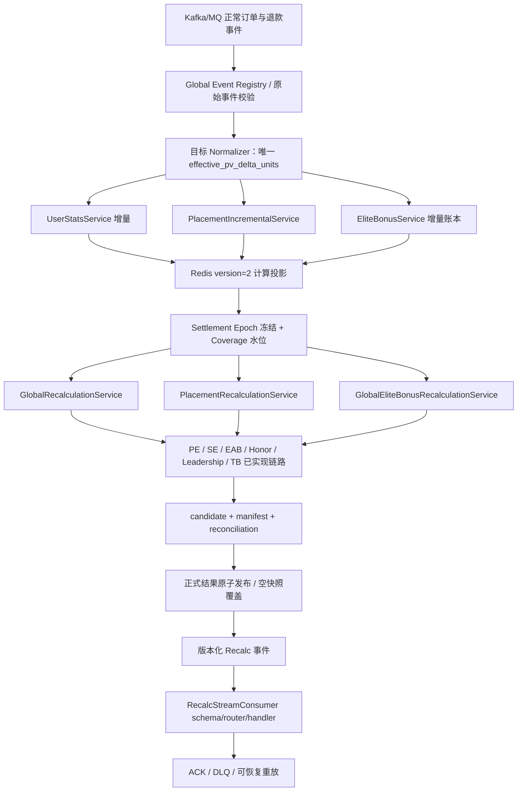

# Redemption 项目检查方案（PV Amount Migration · 2475c6c4 基线）

> 使用说明：本方案用于定义“检查什么、依据什么检查、怎样判定通过”。  
> 本文档处于方案阶段，不填写实际缺陷结论；`PV_Amount_Migration_v2.15_第八次复核_d74基线_完整修正版_v34.md` 中的历史结论和疑似缺陷仅转换为待独立执行的检查项。  
> 本方案发布后，执行阶段不得回改检查标准；执行中发现方案未覆盖的问题，应在复核报告中归入“潜在风险 / 后续处置建议”。

---

## 1. 文档控制

| 项目 | 内容 |
|---|---|
| 文档名称 | `Redemption PV Amount Migration（2475c6c4 基线）检查方案` |
| 文档编号 | `PLAN-PVAM-v1.15` |
| 文档版本 | `v1.15` |
| 当前状态 | `DRAFT` |
| 待检查对象 | `l343765828/Redemption master@2475c6c49e60089b28f8ef1c0b75e86b2ceb6ebb` 及本方案第 3.3 节审查材料；`d74cfb77c496e3a1564255f758dba80fa8644e33` 仅作为历史基线对照 |
| 项目仓库 | `https://github.com/l343765828/Redemption.git` |
| 基线分支 | `master` |
| 基线提交 | `2475c6c49e60089b28f8ef1c0b75e86b2ceb6ebb` |
| 编制人 | `AI Agent（方案编制角色）` |
| 复核人 | `AI Agent（全链路审计修订角色）` |
| 编制日期 | `2026-07-29` |
| 对应复核报告 | `REPORT-PVAM-v1.5` / `Redemption_PV_Amount_Migration_d74_复核报告_v1.5.md` |

### 1.0A 当前授权与基线迁移

- 授权状态：`PENDING_ORGANIZATIONAL_APPROVAL`；当前指令仅授权文档复核与修订，不构成组织施工批准。
- 当前唯一代码/SQL事实基线：`2475c6c49e60089b28f8ef1c0b75e86b2ceb6ebb`。
- `097cae32`仅作为历史基线标识；其到当前基线的Python/SQL树无差异，不能继续作为活动证据ref。
- 本方案与`REPORT-PVAM-v1.5`、`MODPLAN-PVAM_v1.2`、`WORK-PLAN-PVAM_v1.3`共同构成统一受控链。

### 1.0B 治理授权边界

- 当前没有可识别组织批准人、角色、签名或不可抵赖批准原文。
- 因此本方案治理状态为 `DRAFT`，施工授权为 `PENDING_ORGANIZATIONAL_APPROVAL`。
- 只有完成 `05_CONTROL/AUTHORIZATION_STATUS-PVAM-v2.md` 所列签署字段后，才可另行升格文档状态；本次修订不得代签。

### 1.1 版本记录

| 版本 | 日期 | 修改人 | 变更内容 | 审批状态 |
|---|---|---|---|---|
| v1.1 | `2026-07-28` | `AI Agent（方案编制角色）` | 合并两份候选方案，固定 d74 基线并收敛检查范围 | `DRAFT` |
| v1.2 | `2026-07-29` | `AI Agent（方案编制角色）` | 依据 `PV_Amount_Migration_检查方案_审查意见_v2.0.md` 定向修订并将历史基线提升至 097cae32（HISTORICAL_ONLY） | `DRAFT` |
| v1.3 | `2026-07-29` | `AI Agent（方案编制角色）` | 依据 `PV_Amount_Migration_检查方案_审查意见_v3.0.md` 修订 CHK-TEST-001 期间夹具处置表标签 | `DRAFT` |
| v1.4 | `2026-07-30` | `用户（业务决策）/ AI Agent（落版）` | 依据用户对 §17 的业务决策关闭 DEC-001、DEC-002、DEC-003、DEC-005、DEC-014，并联动更新预期规则 | `DRAFT` |
| v1.5 | `2026-07-31` | `用户（业务决策）/ AI Agent（落版）` | 依据用户对 DEC-004 与 DEC-011 的业务裁决定向修订，并新增 DEC-016、DEC-017 | `DRAFT` |
| v1.6 | `2026-07-31` | `用户（业务决策）/ AI Agent（落版）` | 依据用户对 §17 的业务决策关闭 DEC-006、DEC-015，并联动更新预期规则 | `DRAFT` |
| v1.7 | `2026-08-01` | `用户（业务决策）/ AI Agent（落版）` | 依据用户对 DEC-007 的业务决策关闭该项，并收窄 CHK-PUB-002/TC-030 为迁移保真度检查 | `DRAFT` |
| v1.8 | `2026-08-01` | `用户（业务决策）/ AI Agent（落版）` | 依据用户对 DEC-008 的业务决策关闭该项（权威存储为 Redis、两表同事务契约转移至业务系统），并收窄 CHK-EVT-005/CHK-PUB-001 及 TC-026/TC-029 | `DRAFT` |
| v1.9 | `2026-08-01` | `用户（业务决策）/ AI Agent（落版）` | 依据用户对 DEC-016 的业务决策关闭该项（负值/超范围由前一业务系统校验；配置行重复时取值函数只取一行），并同步更新 CHK-DATA-006/TC-007 对应判据 | `DRAFT` |
| v1.10 | `2026-08-01` | `用户（业务决策）/ AI Agent（落版）` | 依据用户对 §17 的业务决策关闭 DEC-009、DEC-010，并联动固化最小 schema manifest 范围与“测试阶段豁免、生产 Gate C 保持 OPEN”规则 | `DRAFT` |
| v1.11 | `2026-08-02` | `用户（文档修订）/ AI Agent（落版）` | 依据用户对 DEC-017 的确认（Elite 说明文档已按 DEC-011 完成修订），关闭该项 | `DRAFT` |
| v1.12 | `2026-08-02` | `用户（业务决策）/ AI Agent（落版）` | 依据 RV8-G-01 登记 DEC-018；依据用户对 RV8-G-02 的业务决策收窄 DEC-007/CHK-PUB-002；依据用户业务决策关闭 DEC-012（选 A）；依据 RV8-B1-02/RV8-A-02 完成批量文档整理 | `DRAFT` |
| v1.13 | `2026-08-02` | `用户（业务决策）/ AI Agent（落版）` | 依据用户对 §17 的业务决策关闭 DEC-018，并联动固化活跃结果“无须物化、各消费方按同一派生规则各自现算”的唯一预期行为 | `DRAFT` |
| v1.14 | `2026-08-05` | `用户会话指令 / AI Agent（落版）` | 历史版本：统一受控基线至 `2475c6c4`；后因授权证据不可独立验证而被 v1.15 取代 | `SUPERSEDED` |
| v1.15 | `2026-08-05` | `AI Agent（第四轮文档修订）` | 关闭 F3-01～F3-10 文档内缺陷：八级追溯、治理状态、patch/DEV 门禁、状态枚举、版本引用及设计边界 | `DRAFT` |

本版本变更对照表：

| 编号 | 修订位置 |
|---|---|
| RV-C-01 | §4.4 EX-005、§8/§9 CHK-DATA-004、CHK-BIZ-004、§11 TC-004/TC-013 |
| RV-G-01 | §9 CHK-PUB-001 依赖项 |
| RV-B1-01 | §3.3 BL-015、§17 DEC-014 |
| RV-C-02 | §8/§9 CHK-TEST-004、§15 |
| RV-D-01 | §8/§9 CHK-TEST-004、§15 |
| RV-G-05 | §8/§9 CHK-GOV-001、§11 TC-000、§15.1 |
| RV-A-04 | §11 TC-013 |
| RV-B1-02 | §3.3 BL-006 |
| RV-B1-04 | §3.3 BL-009 |
| RV-B2-01 | §2.3、§4.4 EX-004 |
| RV-D-02 | §8/§9 CHK-BIZ-001、§11 TC-009 |
| RV-D-04 | §8/§9 CHK-TEST-001 及其期间夹具处置表 |
| RV-G-02 | §8 CHK-DATA-002、CHK-TEST-001 |
| RV-G-03 | §3.3 BL-011 及 BL-011 SQL 证据登记表 |
| 基线提升 | 标题、§1、§1.1、§2.1、§3.3、§5.1、§8/§9 CHK-ARCH-001、CHK-GOV-001 |
| 勘误表#2 | §17 DEC-015 |
| USER-DECISION DEC-001 | §8/§9 CHK-DATA-004、§8/§9 CHK-BIZ-004、§8/§9 CHK-BIZ-008、§11 TC-004/TC-013、§17 DEC-001 |
| USER-DECISION DEC-002 | §8/§9 CHK-DATA-004、§8/§9 CHK-DATA-007、§11 TC-004/TC-008、§17 DEC-002 |
| USER-DECISION DEC-003 | §8/§9 CHK-DATA-004、§8/§9 CHK-BIZ-008、§8/§9 CHK-BIZ-011、§11 TC-005、§17 DEC-003 |
| USER-DECISION DEC-005 | §8/§9 CHK-EVT-001、§11 TC-022、§17 DEC-005 |
| USER-DECISION DEC-014 | §3.3 BL-015、§15.1、§17 DEC-014 |
| USER-DECISION DEC-004 | §8/§9 CHK-DATA-006、§11 TC-007、§17 DEC-004、§17 DEC-016（新增）、CHK-TEST-004（T0-17/T0-19 判据） |
| USER-DECISION DEC-011 | §8/§9 CHK-BIZ-001、§11 TC-009、§17 DEC-011、§17 DEC-017（新增）、CHK-TEST-004（T0-10 判据） |
| USER-DECISION DEC-006 | §8/§9 CHK-DATA-005、§8/§9 CHK-EVT-001、§11 TC-006/TC-022、§17 DEC-006 |
| USER-DECISION DEC-015 | §3.3 BL-005、§17 DEC-015、文末联动歧义说明（解除并删除） |
| USER-DECISION DEC-007 | §8/§9 CHK-PUB-002、§11 TC-030、§17 DEC-007 |
| USER-DECISION DEC-008 | §8/§9 CHK-EVT-005、§8/§9 CHK-PUB-001、§11 TC-026/TC-029、§17 DEC-008 |
| USER-DECISION DEC-016 | §8/§9 CHK-DATA-006、§11 TC-007、§17 DEC-016 |
| USER-DECISION DEC-009 | §3.3 BL-014、§4.3 S-015、§5.1、§8/§9 CHK-ARCH-001/CHK-DATA-007/CHK-BIZ-009/CHK-PUB-001/CHK-TEST-004、§11.1、§13～§14、§17 DEC-009 |
| USER-DECISION DEC-010 | §5.2、§6 MAP-011、§8/§9 CHK-EVT-002/CHK-EVT-005/CHK-TEST-003/CHK-TEST-004、§11 TC-023/TC-026/TC-032、§12.3、§14、§17 DEC-010 |
| USER-DECISION DEC-017 | §17 DEC-017 |
| RV8-G-01（登记，非业务决策） | §17 DEC-018、§9 CHK-DATA-006、§9 CHK-TEST-004 |
| USER-DECISION DEC-007（收窄） | §17 DEC-007、§9 CHK-PUB-002 |
| USER-DECISION DEC-012 | §17 DEC-012、§8/§9 CHK-ARCH-002、§8/§9 CHK-BIZ-002 |
| USER-DECISION DEC-018 | 编号引用：§1.1、§9 CHK-DATA-006、§9 CHK-BIZ-004/007/008/009/011、§9 CHK-TEST-004、§17 DEC-018；散文引用：§6 MAP-006/007/008/010、§8 CHK-DATA-006、CHK-BIZ-004/007/008/009/011、CHK-TEST-002、§9 CHK-DATA-006、CHK-BIZ-004/007/008/009/011、CHK-TEST-004、§11 TC-007 |

---

## 2. 检查目标

### 2.1 背景

Redemption 是以 Kafka/MQ、Redis、Dask/RAPIDS、MySQL/MariaDB 和推荐网/安置网为基础的月度奖金计算项目。当前专项拟将 PV/BV/GPV、左右区业绩、结余和奖金基数统一迁移到 `int64 micro-units`，同时保持有效 SQL 的 Legacy 结果或有明确来源的 corrected 决议，并补齐事件身份、结算屏障、正式发布、幂等和恢复能力。本轮以 `2475c6c49e60089b28f8ef1c0b75e86b2ceb6ebb` 为代码、SQL、治理、Skill 和 `Doc/奖金制度.md` 唯一固定基线；历史链路中 d74cfb77 到 097cae32 的唯一差异为新增该业务文档；097cae32 到 2475c6c4 仅修改 Elite 规则 DOCX，Python/SQL不变，Python、SQL、治理及配置内容不变。两份候选检查方案中的范围、断言和验收标准已经按第 15.1 节形成编制记录：可由材料证明的内容进入正式检查项，未经执行即写成“缺陷已确认、Gate 已失败、测试已通过”的内容不得继承为方案结论。预期交付物仅为本检查方案。

### 2.2 核心目标

本轮检查需要回答：

1. `当前 Python 实现、有效 SQL、项目文档、项目 Skill 和奖金制度.md 之间的业务口径是否可追溯且一致；Legacy parity 与 approved corrected 是否被明确分层。`
2. `PV Amount Migration 是否覆盖全部真实入口、金额模型、增量/全量服务、已实现奖金服务、配置、Active、Period、writer 和输出边界，且不存在单位混用、float 链、版本混算或溢出。`
3. `订单/退款事件、Normalizer、Epoch、Coverage、outbox、checkpoint、Recalc consumer、正式发布和恢复是否具备幂等、原子、可审计、可重放和 fail-loud 能力。`
4. `DEV 静态/单元验证与 UAT 真实依赖验证是否能通过固定检查项、回传包和证据索引形成 Loop Engineering 闭环。`

### 2.3 非目标

本轮明确不处理：

- `PB、SFB、GPB、CRB 的 Python 奖金算法正确性；当前无对应 Python 生产实现，用户明确排除。`
- `未经用户或业务/财务/架构裁决的规则变化；开放政策只能登记为 DEC 项或 NEEDS_DECISION。`
- `仅属于性能优化且不影响正确性、可完成性、幂等、资源安全或恢复能力的事项。`
- `本次不修改代码、SQL、Skill、需求文档或生产数据，不生成复核报告、施工方案或其他阶段文档。`
- `附录 B 的排除集合仅为 PB（Performance Bonus）、SFB（Stockist Fees）、GPB（Global Pool Bonus）、CRB（Car/Room Bonus）；不得扩展为未获来源依据的其他奖金类型。`
- `两份候选方案中预先写入的缺陷状态、Gate 状态、行号和执行结果不作为本方案阶段的事实；只能转化为待执行检查项。`

---

## 3. 权威基线与冲突裁决

### 3.1 指令优先级

发生冲突时按以下顺序处理：

1. 用户针对本轮任务的明确要求；
2. 项目根目录 `AGENTS.md`；
3. 当前任务适用且已成功加载的项目 Skill；
4. 用户指定的权威 SQL、需求、代码或文档；
5. 其他项目材料；
6. 通用工程经验。

### 3.2 默认业务规则优先级

若用户未对本轮另行指定，以以下顺序确认业务规则：

1. `PLAN-PVAM-v1.15` 的检查判据和其中已关闭的 `DEC-*`；
2. 已批准的专项规格、MODPLAN/TASK合同及可追溯的 corrected 决议；
3. 当前有效的 `sql_uat/` 生产结算 SQL——仅在不存在已关闭DEC/corrected裁决时作为Legacy行为oracle；
4. `奖金制度.md`；
5. 当前 Python 实现；
6. 测试代码和历史评审材料。

说明：

- 已有正式决策改变业务口径时，以已关闭DEC/批准的corrected合同为准，不得用Legacy SQL反向覆盖。
- Python 与有效 SQL 冲突且不存在DEC/corrected裁决时，默认判定为 Python 实现偏差。
- 有效 SQL 之间存在实质冲突且无既有DEC可裁决时，状态应为 `NEEDS_DECISION`，不得静默选择。
- `LEGACY_PARITY` 与 `CORRECTED_APPROVED` 可同时登记，但双标签仅服务于差分、回放和审计，不替代裁决顺序。

### 3.3 本轮基线清单
| 基线编号 | 类型 | 文件/对象 | 版本或提交 | 权威范围 | 是否成功读取 | 备注 |
|---|---|---|---|---|---|---|
| BL-001 | 用户指令 | 本轮消息中的方案约束 | 2026-07-28 | 唯一交付物、模板 schema、范围及阶段边界 | YES | 本方案最高优先级 |
| BL-002 | 治理 | `AGENTS.md` | 2475c6c49e60089b28f8ef1c0b75e86b2ceb6ebb / blob `57cd62a7` | 证据、优先级、Skill、正式审查流程 | YES | 与 d74 历史基线内容一致 |
| BL-003 | 项目 Skill | `.claude/skills/redemption-file-filter/SKILL.md` | 2475c6c49e60089b28f8ef1c0b75e86b2ceb6ebb / blob `604886c2` | 文件过滤与业务查证顺序 | YES | 已成功读取 |
| BL-004 | 项目 Skill | `.claude/skills/redemption-sql-doc-map/SKILL.md` | 2475c6c49e60089b28f8ef1c0b75e86b2ceb6ebb / blob `29d66be2` | SQL/文档/Python 路由 | YES | 已成功读取 |
| BL-005 | 复核材料 | `PV_Amount_Migration_v2.15_第八次复核_d74基线_完整修正版_v34.md` | v34 | 当前合同编译视图、overlay、开放政策、历史意见和待验收项 | YES | 仅作为检查项和依据来源；不继承其历史结论；其历史意见统计按 DEC-015 固定为“完全成立8、部分成立1”，各条意见仍须逐项核验证据 |
| BL-006 | 专项清单 | `PV_Amount_Migration_Checklist_Final_v2.25_d74.md` | Final v2.25-d74 | 基础合同、Gate、P0/T0、模块范围 | YES | 与 BL-005 组合使用 |
| BL-007 | 业务文档 | 仓库内 `Doc/奖金制度.md` | EKPlan20250324 / 2475c6c49e60089b28f8ef1c0b75e86b2ceb6ebb | 资格、比例、Active、周期、大区等业务意图补充 | YES | 粗糙业务文档；不单独定义 Epoch、manifest、checkpoint 等技术合同 |
| BL-008 | 候选方案 | `Redemption_PV_Amount_Migration_检查方案_v1.0.md` | v1.0 | 候选范围、检查项和 Loop 闭环设计 | YES | 作为比较输入，不自动成为权威标准 |
| BL-009 | 候选方案 | `PV_Amount_Migration_d74_检查方案_v1.0_other.md` | v1.0 | 候选范围、文件定位和验收细化 | YES | 作为比较输入；候选断言按第 15.1 节逐条登记后决定保留、转检查项或删除 |
| BL-010 | SQL | `sql_uat/CALC_PV.sql`、`CALC_BE_E.sql`、`CALC_BE_PE.sql`、`CALC_BE_SE_COUNTRY.sql`、`CALC_BE_EAB.sql`、`CALC_BE_TB.sql` | 2475c6c49e60089b28f8ef1c0b75e86b2ceb6ebb | PV、Elite、PE、SE、EAB 及 TB Legacy oracle | YES | 执行阶段仍须从固定 commit 完整读取并记录 blob/SHA |
| BL-011 | SQL | `CALC_LV_ELITE.sql`、Honor/LB、编排、状态、汇总和发布相关有效 SQL | 2475c6c49e60089b28f8ef1c0b75e86b2ceb6ebb | rank、Honor、Leadership、Period、执行顺序和结果表写入 | YES | 已逐文件读取；rank 0/10/20/30、Honor 12期窗口与2/3次门槛、只升不降、LB双闸门及编排/状态/汇总规则支持§8/§9预期；blob见下表 |
| BL-012 | Python | 第 4.3 节列出的当前实现模块 | 2475c6c49e60089b28f8ef1c0b75e86b2ceb6ebb | 当前实现事实、生产可达性和差异定位 | NO | 方案阶段只固定范围；执行阶段须从 2475c6c4 完整读取 |
| BL-013 | 需求文档 | Skill 映射的 `Doc/` 需求与技术文档 | 2475c6c49e60089b28f8ef1c0b75e86b2ceb6ebb | SQL 解释、历史设计和业务上下文 | 部分 | 阶段 1 按映射逐份读取并验证是否过时；其中 `Doc/CALC_BE_E_需求分析_修订建议版.md` 已读取并用作 CHK-PUB-002 证据（见该项现状定性引用），其余映射需求文档待读 |
| BL-014 | Schema/配置 | `sql/AR_CONFIG.sql`、经 DBA/架构批准的最小 schema manifest、SQL_MODE、Redis/Stream 配置 | 2475c6c49e60089b28f8ef1c0b75e86b2ceb6ebb + 生产/UAT 批准清单待提供 | 覆盖本仓库全部生产可达输入、Redis 权威状态、事件/outbox 接口、有效 SQL oracle 所涉表，以及验证 amount version、金额字段类型与单位、主键/唯一键、数据库 assignment 和发布证明所必需的关系库对象 | NO | 依 DEC-009 采用批准的最小清单；清单须记录生产/UAT 环境、数据库版本、全局及会话 SQL_MODE、DDL 导出时间、对象版本和 SHA-256；清单外对象须有“不影响本专项”的调用链证据；任何必需对象缺失时，对应检查项标记 `BLOCKED` |
| BL-015 | 继承合同原文 | `PV_Amount_Migration_Checklist_Final_v2.15.md` | Final v2.15 | Epoch、coverage、ledger、amount version 等未被 v2.25 覆盖的继承技术条款 | YES | 用户已提供原文副本并成功读取；SHA-256 `c2f52559e4793674de5ed8616facf1f77a260287281f2b2f98d911808e1a2754`；不再因原文缺失将相关继承条款降级为 `UNVERIFIABLE`。实际交付件名为 `PV_Amount_Migration_Checklist_Final_v2.15.md`；本行使用真实文件名，不再维护下划线别名 |

#### BL-011 SQL 证据登记表

| 范围 | 有效 SQL | 2475c6c4 blob SHA |
|---|---|---|
| Elite / rank | `sql_uat/CALC_LV_ELITE.sql` | `45f874573026652bfc1c4ab3a2180573e781db4f` |
| Elite 历史最高 | `sql_uat/CALC_LV_ELITE_HIGHEST.sql` | `2227a913c84f36b993f0ee810ef923f3fd4d8271` |
| Honor 当期 | `sql_uat/CALC_LV_HONOR_LAST.sql` | `4cf7bdd6c7eb344416f57b5634ef8eaed93a7da4` |
| Honor 历史最高 | `sql_uat/CALC_LV_HONOR_HIGH.sql` | `386792f2c1ba6e995958c41e9112003dfb119dd6` |
| Leadership | `sql_uat/CALC_BE_LB_COUNTRY.sql` | `6c1f8749b43cd1380ca07bfde5f9913596ac99a8` |
| 自动调度 | `sql_uat/AUTO_CALC_BONUS.sql` | `5b486a3e4a3ddf5ff9bd84dc91c86e37d1881b25` |
| 主编排 | `sql_uat/CALC_BONUS.sql` | `71dc60991efe06014e3df455ad098fd5a056202a` |
| 前置检查 | `sql_uat/CALC_CHECK.sql` | `ca29016c73762949150f6248709300e9b3108ddd` |
| 周期状态 | `sql_uat/CALC_PERIOD_STATUS.sql` | `7d538615eec6d0ce2483f05de0e8693642f9e9ac` |
| 奖金汇总 | `sql_uat/CALC_BE.sql` | `ab406beca859dd5a9a030b62497c94b78e54d39e` |
| 不发奖明细 | `sql_uat/CALC_INACTIVE_DETAILS.sql` | `2e1d17ad32bfda01d182166ac9f02835cb40d8c9` |
| 结算备份 | `sql_uat/CALC_BACKUP.sql` | `7f4c1e9a9230c50f81a22d2178f3641dfb30da41` |
| 大区备份 | `sql_uat/CALC_BACKUP_COUNTRY_SHARE.sql` | `e9da72b3b13d5801f85fc8aef40cbde0b22bde32` |
| 大区分摊 | `sql_uat/CALC_COUNTRY_SHARE.sql` | `a585ef859638a140e777117a3add1f78d1fed0d8` |
| LB 大区分摊 | `sql_uat/CALC_COUNTRY_SHARE_LB.sql` | `a910e2ab26ef7a59f37037112be7fa4774309de7` |
| 网络层数初始化 | `sql_uat/CALC_BE_NET.sql` | `c078ea2723dd59745ec7d312dc1d9a47131b111b` |
| 结算数据初始化 | `sql_uat/CALC_BE_REM_DATA.sql` | `f8b20f382a7946532984bdf099d88873d412a459` |
| 生效/续约 | `sql_uat/CALC_EFFECT.sql` | `11d27932af918c89c55c9c85be135cd141dc50b9` |

---

## 4. 文件范围与过滤规则

### 4.1 必须加载的项目规则

| 规则 | 适用条件 | 本轮是否需要 | 加载结果 |
|---|---|---|---|
| `redemption-file-filter` | 文件扫描、代码/SQL/迁移/交付物检查 | `YES` | `LOADED` |
| `redemption-sql-doc-map` | SQL、文档与 Python 对齐或映射 | `YES` | `LOADED` |

若后续执行环境无法读取当前 commit 中的 Skill，相关检查项状态必须设为 `BLOCKED`，并记录缺失路径、未生效规则和影响；不得用本方案转述替代实际 Skill 内容。

### 4.2 默认排除范围

在项目 Skill 未规定例外、且用户未明确要求检查时，默认排除：

- 文件名包含英文 `_bak`、`_bakN` 或 `_final` 的文件；
- `redemption-file-filter` 明确列出的旧版、副本或废弃 SQL；
- `GraphService.run_bfs` 演示逻辑；
- 构建产物、缓存、虚拟环境及无关临时文件；
- 与本轮专项无调用关系、无数据关系的模块。

排除文件不得作为当前生产逻辑、业务规则或当前版本缺陷的证据。

### 4.3 纳入检查范围
| 范围编号 | 模块/目录 | 文件或对象 | 纳入原因 | 检查深度 |
|---|---|---|---|---|
| S-001 | 治理与规则 | 固定提交、`AGENTS.md`、两个项目 Skill、两份候选检查方案 | 固定优先级、过滤规则、SQL/文档路由，并核验候选方案是否把结论写入方案 | FULL |
| S-002 | 公共金额域 | 目标 `Common/PvAmount.py`、`Until/Common.py`、金额入口适配器 | 核对 micro-units、integer cents、ppm、两处放大边界和禁止 float 合同 | FULL |
| S-003 | 消息入口与事件治理 | `MessageConsumer/UserConsumer*.py`、`Order/OrderService.py`、`MessageConsumer/RecalcStreamConsumer.py` | 核对权威输入、事件身份、schema、ACK、重试、DLQ 和结算屏障 | FULL |
| S-004 | 金额模型 | `Model/User/UserStats.py`、`EliteBonusStats.py`、`UserPeriodHighestRank.py`、`Redishelper/BaseRedisModel.py` | 核对字段单位、`amount_encoding_version`、序列化与旧数据隔离 | FULL |
| S-005 | 推荐网与全量重算 | `UserStatsService.py`、`GlobalRecalculationService.py`、`GraphService.py`（排除 `run_bfs`）、`TopologyMutationService.py` | 核对 PV 传播、rank、图完整性、期间守卫及全量/增量一致性 | FULL |
| S-006 | 安置网 | `PlacementIncrementalService.py`、`PlacementRecalculationService.py` 及入口/测试 | 核对 1L/2L、结余、单位、闭包腿归属和增量/全量一致性 | FULL |
| S-007 | Elite 奖金 | `EliteBonusService.py`、`GlobalEliteBonusRecalculationService.py` 及测试 | 核对 P0-8 七条、P0-12 SOURCE、增量账本和正式发布 | FULL |
| S-008 | PE 奖金 | `PEBonusService.py`、`PEBonusService_Main.py` 及测试 | 核对 root、资格、Active、期间、费率、截断和 writer | FULL |
| S-009 | SE 奖金 | `SuperEliteBonusService.py` 及测试 | 核对 exact raw canonical、Country/TYPE、Active、公共 units 与 Legacy 金额一致性 | FULL |
| S-010 | EAB 奖金 | `EliteAchievementBonusService.py`、`eab_test_fixed.py` 及使用示例 | 核对 `CORRECTED_EAB_V8`、最终一次 HALF_UP、Active、Country 和发布 | FULL |
| S-011 | Honor 与 Leadership | `HonorLevelGPUService.py`、`HonorLevelHighGPUService.py`、`LeadershipBonusGPUService.py` | 核对 rank、滚动最高奖衔、九代比例、双重拦截、Active 和大区 | FULL |
| S-012 | Team Bonus Python 状态 | `team_bonus_tb.py`、`run_team_bonus_tb.py`、相关测试及生产引用图 | 用户排除未实现奖金业务；只核验 oracle/demo 隔离和是否存在生产可达 Python 路径 | TARGETED |
| S-013 | 有效 SQL | Skill 未排除的 PV、E、PE、SE_COUNTRY、EAB、ELITE、HONOR、LB、编排/状态/汇总过程；`CALC_BE_TB.sql` 仅作 oracle 参照 | 作为 Legacy parity、业务口径、期间、写表和执行顺序依据 | FULL |
| S-014 | 需求与技术文档 | Skill 映射文档、`奖金制度.md`、v2.25 清单、v34 复核材料 | 区分业务制度、Legacy SQL、corrected overlay 和目标技术合同 | FULL |
| S-015 | Schema、配置与发布 | `sql/AR_CONFIG.sql`、DEC-009 批准的最小 schema manifest/SQL_MODE、Redis key、Stream、结果表和唯一键 | 核对批准清单覆盖范围、配置快照、数据结构、发布证明、幂等和恢复；必需对象缺失时阻断对应检查项 | TARGETED |
| S-016 | 测试与 Loop 闭环 | `User/Test`、`MessageConsumer/Test`、脚本、CI、UAT 回传包 | 核对测试是否命中生产代码，并形成 DEV→UAT→报告的证据闭环 | FULL |

### 4.4 明确排除项

| 排除编号 | 文件/模块 | 排除原因 | 是否影响结论 |
|---|---|---|---|
| EX-001 | 文件名含 `_bak`、`_bakN` 或 `_final` 的文件 | 项目过滤 Skill 默认排除 | NO，本轮不得以其证明当前实现或业务规则 |
| EX-002 | Skill 列明的 9 个废弃/副本 SQL | `redemption-file-filter` 明确排除 | NO，本轮使用有效 SQL |
| EX-003 | `GraphService.run_bfs` | 演示逻辑，项目 Skill 默认排除 | NO，图检查使用生产可达闭包和索引路径 |
| EX-004 | PB（Performance Bonus）、SFB（Stockist Fees）、GPB（Global Pool Bonus）、CRB（Car/Room Bonus）的 Python 奖金算法 | v2.25 附录 B 的无 Python 生产实现排除集合 | NO，不评价这四项的 Python 业务正确性，也不以“缺少 Python 实现”登记缺陷 |
| EX-005 | Team Bonus units-int 生产实现建设 | 本轮不承担新增生产服务的建设；但 TB 费率解析、`capping=0`、结余独立更新的配置解析 + SQL/oracle 验收，以及生产可达性/隔离核验仍无条件执行 | YES，生产 units-int 实现缺失按 v2.25 §7.5/§13.3/状态矩阵登记为 Gate 缺口；不判 Python 算法失败，不得用 `NOT_APPLICABLE` 关闭 |
| EX-006 | `.venv`、缓存、IDE 配置、构建产物和无关临时文件 | 非项目业务实现 | NO |
| EX-007 | 仅改善性能但不影响正确性的重构 | 本轮目标是正确性、可审计性和结算可靠性 | NO，除非资源问题会导致漏算、重复计算或无法完成结算 |
| EX-008 | 直接修改代码、SQL、Skill、需求文档或生产数据 | 本次只编制检查方案 | NO |
| EX-009 | `奖金制度.pdf` | 本轮用户指定 `奖金制度.md` 作为业务补充材料 | NO；Markdown 无法证明或与 SQL/approved contract 冲突时按第 3 章裁决 |

---

## 5. 技术与运行基线

### 5.1 代码及依赖基线

| 项目 | 基线值 |
|---|---|
| Git 分支 | `master` |
| Git commit | `2475c6c49e60089b28f8ef1c0b75e86b2ceb6ebb` |
| Python 版本 | `3.11`（来自 `environment.yml`；UAT实际版本须回传） |
| 依赖锁文件 | `requirements.txt`：confluent-kafka 2.8.0、deltalake 1.2.1、delta-spark 3.3.2、pyspark 3.5.7、pydantic 2.11.10、redis 7.1.1、redis-om 1.0.6、apscheduler 3.10.4；`environment.yml` 摘要须入证据包 |
| 数据库及版本 | `MySQL/MariaDB；服务器版本须随 DEC-009 批准的最小 schema manifest 回传，当前待补充` |
| Redis 及版本 | `Python client redis 7.1.1；Redis Server版本/部署形式待补充` |
| Kafka 及版本 | `confluent-kafka 2.8.0；Broker版本、正常订单/退款Topic及consumer group待补充` |
| Dask/RAPIDS/cuDF | `RAPIDS 25.12、Dask/Distributed 2025.9.1、CUDA 12.9、NumPy 2.2.6；UAT实测待补充` |
| Schema 版本 | `待补充（DEC-009 批准的最小 schema manifest；须记录生产/UAT 环境、数据库版本、全局及会话 SQL_MODE、DDL 导出时间、对象版本、Redis/event schema 版本和 SHA-256）` |
| 配置快照 | `仓库 sql/AR_CONFIG.sql + UAT运行时原始行快照；敏感值脱敏，保留row count、raw value、snapshot id和checksum` |

DEC-009 固化规则：本轮不要求无差别提供全部生产 DDL，而采用经 DBA/架构批准的最小 schema manifest。最小范围必须覆盖本仓库全部生产可达输入、Redis 权威状态、事件/outbox 接口、有效 SQL oracle 所涉及的表，以及验证 amount version、金额字段类型与单位、主键/唯一键、数据库 assignment 和发布证明所必需的关系库对象。清单外对象必须有“不影响本专项”的调用链证据；任何必需对象缺失时，对应检查项标记为 `BLOCKED`，不得推定通过。DEC-009 已关闭只固定材料范围，不代表该清单已经提供或任何实现已经通过。

### 5.2 环境能力矩阵

| 验证能力 | 开发环境 | 测试环境 | 本轮执行位置 |
|---|---|---|---|
| 静态检查 | `YES` | `待补充` | `DEV` |
| Python 单元测试 | `YES` | `待补充` | `DEV`；依赖真实中间件/GPU 的用例转 `UAT` |
| MySQL 存储过程执行 | `NO` | `待补充` | `UAT` |
| Kafka 真实消息验证 | `NO` | `待补充` | `UAT` |
| Redis 状态/锁/Stream 验证 | `待补充` | `待补充` | 本地具备独立 Redis 时为 `DEV`，否则 `UAT` |
| Dask/RAPIDS GPU 验证 | `待补充` | `待补充` | `UAT` |
| 全链路月结/回放 | `NO` | `待补充` | `UAT` |

开发环境无法执行的项目，计划状态应为 `PENDING_TEST_ENV`，不得预先写成通过。测试环境能力为“待补充”时，不得在方案阶段假定其可用。

DEC-010 固化规则：生产级 Raw/Normalized checkpoint 与其保留策略在测试阶段豁免，不作为测试阶段单项 FAIL 的依据；但生产 Gate C 必须保持 `OPEN`，在上述生产材料、实现与恢复证据完成前不得宣称具备生产发布条件。该豁免不取消 raw/normalized 内容正确性、revision/幂等、Redis 权威提交顺序、ACK/offset 顺序、Stream ACK 前裁剪、deleted-ID 恢复及其他现有故障恢复测试。

---

## 6. 业务与实现映射

### 6.1 模块映射
| 映射编号 | 业务模块 | 有效 SQL/存储过程 | 需求/规格文档 | Python 服务 | 输入 | 持久化/输出 | 主要测试 |
|---|---|---|---|---|---|---|---|
| MAP-001 | 订单事件、退款与公共 Normalizer | `CALC_PV.sql`、`CALC_PERIOD_STATUS.sql` | v2.25 §4/§6；v34 §5/§6/§8 | `OrderService`、`UserConsumer`、目标 Normalizer（存在性及可达性待查） | Kafka/MQ 正常订单及退款事件 | Global Event Registry、normalized delivery、Redis 投影、outbox | 待新增事件身份/退款/单一 delta 测试 |
| MAP-002 | UserStats 增量与 Global 全量 | `CALC_PV.sql`、`CALC_LV_ELITE.sql` | 双轨制解析；Elite/PE/SE 晋级规则；v2.25 §7.3 | `UserStatsService`、`GlobalRecalculationService` | normalized units、推荐图、上期状态 | UserStats Redis、UserPeriodHighestRank、完成事件 | `UserStatsServiceTests`、`GlobalRecalculationServiceTest` |
| MAP-003 | 安置网 1L/2L | `CALC_PV.sql` | `双轨制1L2L计算逻辑解析_修正版.md`；v2.25 §7.5 | `PlacementIncrementalService`、`PlacementRecalculationService`、`GraphService` | normalized units、安置闭包、上期结余 | UserStats 安置字段、Placement 事件 | `PlacementRecalculationServiceTest` |
| MAP-004 | Team Bonus oracle/可达性 | `CALC_BE_TB.sql` | `团队奖金TB结算需求与技术规范说明书 (1).md`；`奖金制度.md` | `team_bonus_tb.py`（oracle/demo 身份及生产可达性待查） | SQL 等价夹具 | 不适用；未发现生产可达路径时不评价 Python 奖金实现 | `test_team_bonus_tb.py`、`run_team_bonus_tb.py`（证据等级待查） |
| MAP-005 | Elite Bonus | `CALC_BE_E.sql` | `CALC_BE_E_需求分析_修订建议版.md`；v34 §3.4/§3.6 | `EliteBonusService`、`GlobalEliteBonusRecalculationService` | UserStats、PV_PSS 候选、费率、推荐图 | EliteBonusStats、正式 E 与 SOURCE、完成事件 | `EliteBonusServiceTest` |
| MAP-006 | Pro Elite Bonus | `CALC_BE_PE.sql` | `PE奖金_需求与技术实现文档_定稿.md`；`奖金制度.md` | `PEBonusService`、`PEBonusService_Main` | 用户全集、Elite snapshot、UserStats pv + monthActivePV 同规则现算、费率 | PE 奖金结果、writer/manifest 待查 | `PEBonusServiceTest` |
| MAP-007 | Super Elite Bonus | `CALC_BE_SE_COUNTRY.sql` | `SuperEliteBonus_需求说明书_修订版.md`；`奖金制度.md`；v34 §3.5 | `SuperEliteBonusService` | Elite 结果、订单 PV、UserInfo、UserStats pv + monthActivePV 同规则现算、Country、配置 | SE 理论/实际奖金及大区结果 | `SuperEliteBonusServiceTest` |
| MAP-008 | Elite Achievement Bonus | `CALC_BE_EAB.sql` | `EAB_需求与重构规范_修正版.md`；`奖金制度.md`；P0-1/P0-6 | `EliteAchievementBonusService` | Elite PGS、订单 PV、UserStats pv + monthActivePV 同规则现算、Country、eabRate | EAB theoretical/actual/audit/legacy projection | `eab_test_fixed.py` |
| MAP-009 | Honor 当期与历史最高 | `CALC_LV_HONOR_LAST.sql`、`CALC_LV_HONOR_HIGH.sql` | Honor Level 说明书；`奖金制度.md` | `HonorLevelGPUService`、`HonorLevelHighGPUService` | UserStats、SE 层级、历史记录、Member Level | Honor snapshot、UserPeriodHighestRank | 待新增 SQL-Python 差分与滚动窗口测试 |
| MAP-010 | Leadership Bonus | `CALC_BE_LB_COUNTRY.sql` | 跨奖项对齐文档；Honor 说明书；`奖金制度.md` | `LeadershipBonusGPUService` | Honor、LB_PV、UserStats pv + monthActivePV 同规则现算、Country、配置 | Leadership 明细/汇总及 writer 待查 | 待新增 SQL-Python 差分测试 |
| MAP-011 | 结算事件、发布与恢复 | 编排/状态/汇总有效 SQL | v2.25 Gate C；v34 Epoch/Coverage/发布章节；DEC-010 | 三类全量/增量 producer、`RecalcStreamConsumer`、writer | Redis/SQL authority、outbox、checkpoint | 正式 committed 结果、DLQ/PEL、manifest | 状态机、故障注入和恢复测试仍执行；生产级 Raw/Normalized checkpoint 与保留策略在测试阶段豁免，但 Gate C 保持 `OPEN` |

### 6.2 关键调用链

当前实际接线必须在检查阶段从生产入口逐点证明；下图同时标示目标合同和待查实现，不代表各节点已经实现或通过。

---

## 7. 检查维度

| 维度 | 检查重点 | 典型证据 |
|---|---|---|
| 文件与调用链 | 有效入口、实际调用关系、死代码、漏接入 | import、调用点、启动脚本、存储过程调用 |
| 业务规则 | 资格、公式、过滤、封顶、结余、分摊、最终拦截 | SQL 关键语句、规格章节、差分样例 |
| 数据单位与精度 | units/cents/ppm、边界转换、截断/舍入、溢出 | 字段定义、转换函数、边界测试 |
| 数据模型与兼容 | 字段默认值、版本字段、旧数据读取、新旧编码隔离 | 模型定义、迁移脚本、序列化样例 |
| 状态与生命周期 | 周期初始化、重算、封期、跨期桥接、清库与重放 | Redis key、数据库状态、事件时序 |
| 并发与幂等 | 锁、事务、WATCH、重复消息、重试、原子提交 | 并发测试、唯一键、幂等键、失败注入 |
| 异常处理 | 错误是否被吞、白名单是否过宽、失败是否可追踪 | exception 分支、日志、失败测试 |
| 图与层级计算 | 推荐网/安置网、单父、多路径、环、腿归属 | 图校验、闭包/BFS、非法数据测试 |
| 测试有效性 | 测试是否命中生产代码、断言是否正确、mock 是否失真 | 测试收集、覆盖路径、失败注入 |
| 性能与资源 | GPU/内存峰值、批次、持久化、网络/数据库压力 | profile、指标、容量测试 |
| 发布与回滚 | 执行顺序、数据迁移、灰度、回滚条件和恢复路径 | 施工步骤、备份、回滚演练 |

---

## 8. 检查项总表

检查项编号一经发布不得复用。删除的检查项保留编号并标记 `RETIRED`。

| 检查项编号 | 检查对象 | 预期规则 | 检查方法 | 通过标准 | 优先级 | 执行环境 | 计划证据 |
|---|---|---|---|---|---|---|---|
| CHK-GOV-001（RETIRED） | 编制记录已固化于第 15.1 节，非执行阶段检查对象 | 两份候选方案的章节、枚举和断言已分类登记；不再由方案自检其编制质量 | — | `RETIRED`；保留编号，不进入执行状态矩阵 | — | — | 第 15.1 节候选断言处置附录 |
| CHK-ARCH-001 | GitHub `master@2475c6c49e60089b28f8ef1c0b75e86b2ceb6ebb`、`AGENTS.md`、两个项目 Skill、审查包、DEC-009 批准的最小 schema manifest | 审查只能使用固定 commit 和成功读取材料；先应用文件过滤，再建立 SQL/文档/Python 映射；批准的最小 schema manifest 须满足 DEC-009 的范围、元数据和清单外排除证据；排除对象不得作为当前事实证据 | STATIC | commit 固定；必检材料全部读取；schema manifest 中任何必需对象缺失时，对应检查项显式 `BLOCKED`；无排除文件进入证据集 | P1 | DEV | commit/文件 SHA、有效文件清单、schema manifest 批准记录与对象 SHA、清单外调用链排除证据、Skill 加载记录 |
| CHK-ARCH-002 | Kafka/MQ 消费入口、订单服务、增量服务、月结编排、writer、Recalc consumer | 每个目标合同必须落在真实生产可达路径；孤立函数、demo、smoke 和未接线服务不能视为实现 | STATIC | 所有 P0/P1 目标实现均存在生产可达调用点；直接调用和补数路径不能绕过关键守卫 | P0 | BOTH | import/call graph、启动脚本、部署任务、Topic/Stream/存储过程调用记录 |
| CHK-ARCH-003 | 目标 `Common/PvAmount.py`、Until/Common.py、各服务本地金额解析器 | 公共金额模块位于最低层；Common 仅被 User/Placement/Bonus 依赖；不得形成 PvAmount↔奖金模块循环；同一职责不得存在多个不一致实现 | STATIC | 依赖图满足单向规则；所有生产金额边界调用已批准公共适配器 | P1 | DEV | import graph、AST 搜索、重复函数清单 |
| CHK-DATA-001 | 订单/退款消息 schema、DB 批量装载、UserStats/Placement/Elite 增量入口 | 只允许“外部十进制字符串→units”和“DB Decimal/string→units”两处放大；内部服务只接收严格 units-int，拒绝 bool/int raw/float/指数/NaN/Infinity | EXECUTION | 仅两处边界转换；所有内部入口严格类型校验；三路收到相同 int | P0 | BOTH | schema、adapter 单测、入口失败日志、normalized payload |
| CHK-DATA-002 | PV/BV/GPV、1L/2L、结余、奖金基数的 Python、pandas/dask/cuDF/NumPy 数据列 | 计算域统一 int64 micro-units（PV_SCALE=1,000,000）；禁止 float 标量/列、Decimal(str(float))、int(round(float)) 和 join 后静默浮点提升 | EXECUTION | 编码矩阵覆盖全部金额列；无生产 float 链；mutation 均被捕获 | P0 | BOTH | AST/类型扫描、DataFrame dtypes、mutation 测试、运行时断言 |
| CHK-DATA-003 | UserStats、EliteBonusStats、所有持久化金额模型和 Redis 记录 | version=2 表示 micro-units；缺失/None 为 legacy/unknown，禁止直接进入新计算域；其他值 fail-loud；无金额模型不新增 version | EXECUTION | 全部金额模型和入口执行一致版本策略；UserPeriodHighestRank 等无金额模型保持不适用 | P0 | BOTH | 模型定义、Redis 样例、序列化/反序列化测试、迁移清库/重建记录 |
| CHK-DATA-004 | RatesService、AR_CONFIG 快照、E/PE/LB/EAB/SE 配置解析及 TB SQL/oracle | 费率使用整数 ppm；缺失/显式0按已批准合同为0，重复/非法阻断；负费率允许并作为有符号 ppm 按各奖项既有配置及 SQL/oracle 计算，不得仅因负值阻断；费率最大值/专项上限由前一业务系统校验，当前系统不作二次业务校验；Country 空字符串/字面0及 EAB/LB 非 `bonus` TYPE 同样不列为当前系统二次校验项；TB 费率解析与 `capping=0` 无条件按配置 + SQL/oracle 验收；其余 Country/TYPE 路径仍按 EAB/SE/LB 独立矩阵处理 | DIFF | ppm 无 float；审计区分缺失与显式0；负费率按配置及 SQL/oracle 验收；不以已豁免的上游校验项判当前系统 FAIL；TB 费率/capping矩阵完成；SE exact raw TYPE；EAB/LB 不套用 SE 未批准规则 | P0 | BOTH | ConfigRequirementMatrix、原始行快照、解析结果、用户决策原文、TB SQL/oracle及SQL-Python差分 |
| CHK-DATA-005 | AR_PERIOD、PERIOD_NUM、CALC_MONTH、事件时间、各服务入口和 writer | PERIOD_NUM 与 YYYYMM 语义不同；当前期必须唯一映射 AR_PERIOD；首期取 MIN；非首期 period-1 必须存在；CALC_MONTH=1..12；退款以批准时间为唯一权威时间字段，经 GMT+8 转换后映射 AR_PERIOD，业务生效时间、到达时间或本地时间不得替代 | DIFF | 无 YYYYMM 推导 period；缺上一期阻断；退款期以批准时间经 GMT+8 转换后唯一映射；writer/Active/config 与计算 run 一致 | P0 | BOTH | AR_PERIOD 样本、resolver 输出、DEC-006 用户原始决策、SQL/Python 参数、边界测试 |
| CHK-DATA-006 | monthActivePV 唯一取值函数、AR_CONFIG→Delta→Redis 加载/失效链路、UserStats pv 源、PE/SE/Honor/LB/EAB/TB 的 is_active 输入及 Python 持久化活跃表读取路径；CALC_PV/MID7/AR_PERF_ACTIVE 仅作 SQL Legacy 区分性对照 | 门槛为 INTEGER_BV_ONLY、比较域 scale=100，30/30.00 可规范且30.1阻断；依 DEC-018，活跃结果无须物化为共享 snapshot，各消费方每次按同一 pv 源与唯一取值函数返回的 monthActivePV 各自现算，不读取持久化活跃表或把共享 snapshot 作为权威活跃源；PE/SE/LB/EAB/TB 不活跃不发，Elite active=N/A；run 启动取值后固化 manifest/checksum；目标供给链按 DEC-004 执行 Redis 为空等待2秒、再读 Delta、仍为空报错中断；配置行重复、负值、超出合理范围依 DEC-016 处理：负值/超范围由前一业务系统校验、当前系统不作二次业务校验；重复情形下取值函数只取一行、不阻断、不需特定排序规则 | DIFF | 唯一取值函数无默认/回退且所有消费可追溯；各消费方以同一派生规则各自现算，未建立共享 snapshot builder/唯一键不判 FAIL；Python 无持久化活跃表读取路径；供给链、run 冻结和各奖金行为符合 DEC-004；所有消费方 period/run/checksum 一致；缺失按 DEC-004 fail-loud；负值/超出合理范围由前一业务系统校验、当前系统不作二次业务校验；重复情形下取值函数确实只取一行且不阻断 | P0 | BOTH | DEC-004/DEC-018 用户原始决策、取值函数与调用图、配置原始值、Redis/Delta 加载及失败日志、各奖金输入与 manifest/checksum、DEC-016 用户原始决策、AR_CONFIG.CONFIG_NAME UNIQUE KEY 证据 |
| CHK-DATA-007 | 所有聚合、费率乘除、最终奖金 writer 和数据库 assignment | 在费率最大值/专项上限由前一业务系统保证且当前系统不作二次业务校验的前提下，对上游合法输入证明 int64 技术上界；最终奖金使用 integer cents；E/PE/SE/TB 按 SQL 截断点，EAB 中间不舍入且个人最终一次 ROUND_HALF_UP 两位；禁止多次舍入；DDL/SQL_MODE 与 assignment oracle 取证范围按 DEC-009 批准的最小 schema manifest | DIFF | 合法输入的技术上界证明成立；极值测试无 wrap；不把当前系统的费率最大值/专项上限二次校验列为通过条件；writer assignment 与 oracle 一致；必需 schema 对象缺失时本项 `BLOCKED` 而非推定通过 | P0 | BOTH | DEC-009 批准的最小 schema manifest、范围证明、上游合法输入样例、极值测试、MariaDB assignment oracle、逐项差分 |
| CHK-BIZ-001 | UserStatsService、GlobalRecalculationService、EliteBonusService、CALC_PV、CALC_LV_ELITE | 增量与全量公式一致；corrected 有效 PV/派生状态不低于0；GPV/贡献按推荐网传播和1000/2000阈值；rank 0/10/20/30；合格腿和虚拟宽度符合 SQL/已批准合同；合格下线集合/数量变化须在当前节点精确保存并重算，仅当贡献值、分支合格性、资格或紧缩路径任一对上输出变化时继续向上传播，对上输出完全不变时允许安全早停；保守全传播不判 FAIL | DIFF | 数量变化场景的增量、全量重建、SQL oracle 最终状态完全一致；当前节点集合/数量已精确保存重算；对上输出变化时祖先链正确更新；早停与否不作为判据 | P0 | BOTH | DEC-011 用户原始决策、同输入三路最终状态差分、当前节点集合/数量、祖先链快照与传播 trace |
| CHK-BIZ-002 | GraphService（排除 run_bfs）、TopologyMutationService、闭包表和索引 | 推荐/安置关系满足唯一父、父存在、无环、无重复边、安置腿合法、同一祖先-后代无多路径；拓扑变更具有 period/version/guard 并可重算受影响节点 | EXECUTION | 全部非法图 fail-loud；闭包第一跳腿唯一；变更具有可恢复事务/事件证据 | P0 | BOTH | 图校验输出、非法图反例、闭包校验、拓扑变更 trace |
| CHK-BIZ-003 | PlacementIncrementalService、PlacementRecalculationService、CALC_PV | 同一 normalized units delta 按闭包第一跳腿累计；pre/pv/total/remain 全部同单位；首期/上期结余和 MID8 桥接符合合同；重算幂等且不覆盖无关字段 | DIFF | 所有字段单位/值一致；重复运行不变；无活动桥接行为按已批准合同 | P0 | BOTH | SQL/Python 左右区矩阵、Redis 前后快照、幂等结果 |
| CHK-BIZ-004 | `team_bonus_tb.py`、入口/编排引用、`CALC_BE_TB.sql` 和相关测试 | oracle/demo 隔离与生产可达性核验无条件执行；标准对碰、含负费率允许分支的费率解析、`capping=0`、按 DEC-018 由消费方同规则现算的 Active、奖金池、TB_RATE精度、最终奖金及结余独立更新均以配置 + SQL/oracle无条件验收；units-int生产实现缺失登记为Gate缺口 | DIFF | oracle/demo不被生产误用；负费率不得仅因负值阻断且 SQL/oracle验收全部完成；Active 不以共享 snapshot 为权威源，未建设其物化构件不判 FAIL；Gate缺口不被误判为Python算法失败、不要求本轮建设且不以`NOT_APPLICABLE`关闭 | P1 | BOTH | import/call graph、脚本分类、配置解析、DEC-001/DEC-018 用户原始决策、SQL/oracle差分、Gate状态登记 |
| CHK-BIZ-005 | EliteBonusService、GlobalEliteBonusRecalculationService、CALC_BE_E | 逐项验证 PV_PSS>0 候选、初始GPV=PV_PCS、Active=N/A、路径A、路径B、qualified且GPV_REAL>0、退款先撤销旧资格/奖金/SOURCE再过滤 | DIFF | 所有七条差分通过且有正式 writer 资格证明 | P0 | BOTH | 七条独立测试、SQL 中间表、增量/全量候选与奖金差分 |
| CHK-BIZ-006 | 增量 SOURCE tracking、P0-12 正式 SOURCE、Global full rebuild 和双表发布 | 增量 ledger 仅审计/重放/dirty/全量输入；正式键唯一(period,source)；SOURCE_PV 只汇总每事件最新 accepted ACTIVE revision；正式来源仅 Global full rebuild + reconciliation + 双表原子发布 | EXECUTION | 唯一键、汇总公式、原子边界、空覆盖和 committed proof 全部满足 | P0 | BOTH | ledger、revision 链、SOURCE candidate/committed、checksum 与双表事务证明 |
| CHK-BIZ-007 | PEBonusService、PEBonusService_Main、CALC_BE_PE | 用户全集含 root；资格 rank>=20；base=直属合格来源 GPV_REAL + 本人 GPV_UNREAL；Active 由 PE 按 DEC-018 使用同一派生规则现算；费率 ppm；最终 SQL 截断；period/month 唯一 | DIFF | root 不丢；Active 派生可追溯且不以共享 snapshot 为权威源；未建设共享 snapshot 物化构件不判 FAIL；非法输入阻断、无硬编码率、writer 同 run | P1 | BOTH | DEC-018 用户原始决策、root/orphan/资格/active 派生/截断差分、writer 行集 |
| CHK-BIZ-008 | SuperEliteBonusService、CALC_BE_SE_COUNTRY、Country/TYPE 及 Active 派生输入 | 合规输入保持 Legacy 金额/分母；Active 由 SE 按 DEC-018 使用同一派生规则现算，不以共享 snapshot 为权威源；除 Country 空字符串/字面0不列为当前系统二次校验项外，raw ID/config/country/TYPE 精确校验并禁止 trim/case/.0 修复；C0 identity；SE TYPE 原始精确 `bonus`；period/rank/active 非法 fail-loud；rate缺失/0为0，负费率允许并按配置及 SQL/oracle 计算 | DIFF | exact canonical、同 period Active 派生、公共 units、负费率与金额/分母/不发语义一致；未建设共享 snapshot 物化构件不判 FAIL；不以 Country 空字符串/字面0二次校验判当前系统 FAIL | P0 | BOTH | C0～C4、raw canonical、active 派生 period、DEC-018 用户原始决策、其他用户决策原文、MariaDB parity 差分 |
| CHK-BIZ-009 | EliteAchievementBonusService、CALC_BE_EAB、EAB 规范 | 生产模式为 CORRECTED_EAB_V8；人员池与订单池独立；PGS>=1000；Active 由 EAB 按 DEC-018 使用同一派生规则现算且仅影响实际发放，不以共享 snapshot 为权威源；Country 大区正确；中间不舍入，最终个人奖金一次 ROUND_HALF_UP 两位并落 integer cents；EAB 涉及的 DDL/SQL_MODE/assignment 对象须纳入 DEC-009 批准的最小 schema manifest | DIFF | 无中间舍入、最终一次 HALF_UP、Active 派生/大区/行集/发布 proof 全部满足；未建设共享 snapshot 物化构件不判 FAIL；必需 schema 对象缺失时本项 `BLOCKED` | P0 | BOTH | DEC-009 批准的最小 schema manifest、DEC-018 用户原始决策、模式 manifest、SQL/approved corrected 差分、最终 DB assignment oracle |
| CHK-BIZ-010 | HonorLevelGPUService、HonorLevelHighGPUService、CALC_LV_HONOR_LAST/HIGH | rank 使用0/10/20/30；当期 Honor 与 SE 层级/宽度符合 SQL和制度；历史最高只升不降并按批准窗口；Member Level 上限动态；历史输入与当期待插入记录隔离 | DIFF | 映射、窗口、上限、字段和历史行集全部一致 | P1 | BOTH | 当期/历史窗口 SQL-Python 差分、rank/level映射、重复运行结果 |
| CHK-BIZ-011 | LeadershipBonusGPUService、CALC_BE_LB_COUNTRY、Honor/Active 派生/Country输入 | Active 由 LB 按 DEC-018 使用同一派生规则现算，不以共享 snapshot 为权威源；九代比例4.5/4.5/4.5/3.6/3.6/3.6/1.8/1.8/1.8；每国家/大区分级加权；layer<=ori进入分母、layer<=bonus发放；不活跃算理论不发；Country 空字符串/字面0及 LB 非 `bonus` TYPE 由前一业务系统校验，不列为当前系统二次校验项；其余 Country/TYPE 按 LB 专项矩阵 | DIFF | 双重拦截、Active 派生、合规 Country、ppm、截断和writer proof全部满足；未建设共享 snapshot 物化构件不判 FAIL；不以已豁免的上游校验项判当前系统 FAIL | P1 | BOTH | 逐代逐国 SQL-Python 差分、DEC-018 及其他用户决策原文、分母/理论/实际明细 |
| CHK-EVT-001 | 订单/退款事件、GLOBAL_EVENT_REGISTRY、REFUND_EVENT_LEDGER、原订单状态 | 外部身份至少(source_system,source_event_id)且不含period；相同identity+hash幂等；不同hash冲突；任意商品退款触发原订单整单BV一次全额冲销；同一原订单首次整单冲销完成后的第二次整单冲销请求按 duplicate/no-op 处理，不再扣减；未发回原期、已发进处理当前期；退款期仅由批准时间经 GMT+8 转换后确定 | EXECUTION | registry全局唯一、原订单状态单向、退款期只由批准时间确定且首次解析后稳定、第二次整单冲销幂等 no-op、无二次负BV、证据完整 | P0 | UAT | registry/ledger、原订单和退款状态、DEC-005/DEC-006 用户原始决策、跨期重放日志、金额前后查询 |
| CHK-EVT-002 | raw event、normalized delivery、UserStats/Placement/Elite stage | 每个业务revision只生成一个 immutable effective_pv_delta_units；previous/current revision连续；三个 stage 不重算、不各自钳制；重复幂等、revision gap阻断；依 DEC-010，测试阶段豁免生产级 Raw/Normalized checkpoint 与保留策略材料，但不豁免本项内容正确性与幂等验证 | EXECUTION | 每delivery三stage结果可追踪且无自行解析/钳制；缺少生产级 checkpoint/保留策略不判测试阶段 FAIL，但 Gate C 保持 `OPEN` | P0 | BOTH | DEC-010 用户原始决策、raw/normalized payload、stage ledger、三路输入hash和状态差分、Gate C 状态登记 |
| CHK-EVT-003 | UserStats/Placement/Elite 状态key、消息入口、核心写入口、SETTLEMENT_EPOCH_MANAGER | 权威Epoch仅七状态；局部状态原子映射；消息入口和核心写入口双重守卫；全量前冻结新消费、等待in-flight归零、固定位置；Elite状态包含在统一守卫；persisted=false不得OPENED | EXECUTION | 三个子系统统一快照判定；OPENED仅在committed proof后；epoch单调 | P0 | UAT | 状态转换日志、锁/epoch快照、并发测试、offset/in-flight证明 |
| CHK-EVT-004 | REBUILD_COVERAGE_MANIFEST、NORMALIZED_DELIVERY_LEDGER、EVENT_STAGE_LEDGER | coverage按topic/partition记录next offset/checksum/revision；delivery状态与stage状态分离；唯一(event,generation,stage)；covered逐stage标REBUILT_COVERED；未覆盖旧delivery生成新generation并supersede+映射 | EXECUTION | manifest字段齐全、状态集合正确、replay后金额和stage ledger一致 | P0 | UAT | manifest/ledger记录、旧epoch replay测试、checksum对账 |
| CHK-EVT-005 | Redis 权威提交边界、业务状态、dirty、stage marker、outbox 哨兵、checkpoint | 依 DEC-008 权威存储为 Redis：业务状态、revision、dirty、stage 与 outbox 须在同一 Redis 权威提交（pipeline/Lua/CAS）内完成；哨兵载荷完整可供下游落库；不得声称跨 Redis 与关系库的原子性；ACK/offset 不得早于权威提交；IN_DOUBT 可恢复；checkpoint 与事件持久化顺序可证明。关系库落库及两表同事务由业务系统负责，不在本项验收范围。依 DEC-010，生产级 Raw/Normalized checkpoint/保留策略材料在测试阶段豁免，但本项提交顺序与恢复验证不豁免 | EXECUTION | Redis 侧原子单元与恢复程序有可复现证据；哨兵载荷完整；测试使用的 checkpoint 不越过未完成业务；缺少生产级 Raw/Normalized checkpoint/保留策略材料不判测试阶段 FAIL，但 Gate C 保持 `OPEN` | P0 | UAT | DEC-008/DEC-010 用户原始决策、Redis pipeline/Lua 提交证据、故障注入、outbox/哨兵/checkpoint 前后状态、Gate C 状态登记 |
| CHK-EVT-006 | RecalcStreamConsumer、所有 producer 和事件注册表 | 每个事件变体唯一识别并绑定schema和处置；JSON顶层必须object；未知/空/缺handler不得静默成功；仅在handler/audited noop/DLQ后ACK；同名SETTLEMENT_PERIOD_DONE按可靠discriminator路由 | EXECUTION | 无分支落空/pass默认成功；schema错误进入统一重试/DLQ；同名变体不混淆 | P0 | UAT | registry、schema、handler结果、PEL/ACK/DLQ和重复投递记录 |
| CHK-EVT-007 | system:recalc_outbox_stream、四类producer、consumer group/PEL/XAUTOCLAIM | 权威payload在所有必要group ACK前不得无证明裁剪；若提前裁剪必须有持久重放源；容量按峰值/停机/延迟/group数证明；deleted IDs必须告警并恢复 | EXECUTION | 保留策略有容量证明；deleted ID可从权威源恢复并完成stage | P0 | UAT | 容量模型、stream/group指标、>100000 backlog测试、deleted-ID恢复记录 |
| CHK-PUB-001 | 各奖金writer、Elite bonus/SOURCE、candidate/staging/live表、manifest | candidate未提交不可读；同run相关表原子可见；空candidate清旧period；资格/version/source-clean校验；row/key/amount/checksum/revision对账；依 DEC-008，本仓库不执行关系库落库，哨兵 persisted 恒为 false；若出现 persisted=true 必须有 committed proof；结果对象、唯一键、assignment 与发布证明所需关系库对象须纳入 DEC-009 批准的最小 schema manifest | EXECUTION | 原子可见、唯一键、空覆盖、资格/版本/dirty校验和reconciliation全部满足；必需 schema 对象缺失时本项 `BLOCKED` | P0 | UAT | DEC-009 批准的最小 schema manifest、staging/live切换、空快照查询、manifest/reconciliation/checksum |
| CHK-PUB-002 | 全仓 Web/RPC 框架与读取入口扫描、CALC_BONUS 清空/重建调用时序 | 本引擎不新增任何对外读取入口；AR_CALC_BONUS_E 等结果表的清空/重建时序相对 2475c6c4 基线未扩大或改变；维护期读取一致性机制建设与验收不在本方案范围，不因业务系统如何处理该场景而判本项 FAIL | STATIC | 无新增读取入口；清空/重建时序与基线一致 | P1 | DEV | DEC-007 用户原始决策、API框架扫描记录、CALC_BONUS 调用顺序diff |
| CHK-TEST-001 | User/Test、MessageConsumer/Test、test_*.py、demo/smoke/usage脚本 | 测试必须导入当前commit生产实现、断言业务结果和失败路径；v2.25 §8.1/§8.2 六个具名文件必须逐一处置；§8.3 八个期间夹具必须按分类表登记；demo/print/自造替身不计生产通过 | EXECUTION | 测试命中生产代码；mutation被捕获；六文件处置和八文件分类完整；结果分类真实 | P1 | DEV | pytest收集、import路径、覆盖路径、具名文件处置表、期间夹具分类表、mutation survival |
| CHK-TEST-002 | CALC_PV及已实现Python奖金对应的有效SQL和Python服务 | 同一数据、period、config、topology和精度口径运行 SQL 与 Python；Python Active 依 DEC-018 由各消费方按同一 pv 源与 monthActivePV 派生规则各自现算，不把共享 snapshot 作为权威源；Legacy parity 与 approved corrected 分列；每个差异可定位到规则/字段/阶段 | DIFF | 所有P0/P1字段差分为0或有已批准差异说明；未建设共享 Active snapshot 物化构件不判 FAIL | P0 | UAT | DEC-018 用户原始决策、fixture、SQL中间表、Python中间结果、逐字段差分和oracle版本 |
| CHK-TEST-003 | 消息入口、锁、revision、Epoch、outbox、writer、consumer、Stream | 覆盖重复/乱序/并发、锁过期、部分提交、broker/Redis/DB失败、进程崩溃、重启reclaim和rollback；任一已执行功能测试不得漏算、双计或假成功；DEC-010 仅豁免测试阶段的生产级 Raw/Normalized checkpoint/保留策略材料 | EXECUTION | 已执行范围无漏/重、无假ACK/OPENED、恢复后checksum与干净重跑一致；生产级材料未提供时 Gate C 保持 `OPEN`，不得据此宣称生产就绪 | P0 | UAT | DEC-010 用户原始决策、故障注入矩阵、每次退出码、状态时间线、最终对账、Gate C 状态登记 |
| CHK-TEST-004 | 检查项、测试执行清单、审计包、证据包、复核报告 | 开发环境不能执行的项标PENDING_TEST_ENV；UAT按固定commit/镜像/配置执行并回传原始证据；DEC-009 批准清单与 DEC-009/010 原始用户确认文本必须入审计包；DEC-010 豁免项须与 Gate C `OPEN` 状态分别登记；报告须逐项列出P0-0～P0-12和T0-1～T0-30状态，不回改方案 | STATIC | P0/P1全有明确状态；P0/T0矩阵无合并省略；schema manifest 范围及缺失对象可追踪；测试豁免不被误写成生产 Gate 关闭；overlay有原始确认文本而非报告转述；证据可重放且与方案ID一一对应 | P1 | BOTH | UAT回传包、DEC-009 批准清单、DEC-009/010 原始确认文本、Gate C 状态登记、P0/T0逐项矩阵、证据索引、报告交叉引用 |
---

## 9. 单项检查定义模板

以下小节按已发布检查项编号展开；执行阶段只能填写状态和证据，不得修改本节的目的、依据、步骤、预期和判定标准。

### `CHK-GOV-001` — `RETIRED：候选方案编制复核`

| 属性 | 内容 |
|---|---|
| 状态 | `RETIRED` |
| 保留原因 | 保留已发布编号；该项属于方案编制动作，不能由方案自身作为独立可执行检查项认定编制质量 |
| 编制记录 | 两份候选方案的章节、枚举、断言及处置分类已固化于第 15.1 节 |
| 执行约束 | 不进入 §14 执行排程、P0/P1 完成率或复核报告检查项状态矩阵 |

### `CHK-ARCH-001` — `固定提交、材料清单与过滤规则完整性`

| 属性 | 内容 |
|---|---|
| 检查目的 | 证明本轮审查对象唯一、材料可追溯，且不会混入备份、副本、演示逻辑或未读取材料。 |
| 关联范围 | S-001 / S-012 / S-013 / S-015 |
| 权威依据 | BL-001～BL-007、BL-014；AGENTS.md §2～§9；两个项目 Skill；DEC-009 用户业务决策 |
| 待查实现 | 仓库树、Git commit、文件 SHA、过滤脚本、SQL/文档映射表、DEC-009 批准的最小 schema manifest |
| 前置条件 | 可访问 GitHub `master@2475c6c49e60089b28f8ef1c0b75e86b2ceb6ebb` 和全部审查包；DBA/架构批准主体可追溯 |
| 检查方法 | STATIC |
| 执行步骤 | 1. 固定 branch、完整 commit SHA 与仓库文件树 2. 按 Skill 生成纳入/排除清单并计算摘要 3. 逐项验证 SQL/文档/Python 路径存在且映射未过时 4. 核验最小 schema manifest 的 DBA/架构批准记录、DEC-009 覆盖对象与必填元数据；对清单外对象逐项检查“不影响本专项”的调用链证据 |
| 输入数据 | 2475c6c4 仓库文件树、d74cfb77 历史差异对照、审查包文件、Skill 排除清单、DEC-009 批准的最小 schema manifest |
| 预期结果 | 形成唯一有效材料清单；每个排除项有规则来源；每个映射对象可定位；schema manifest 覆盖全部生产可达输入、Redis 权威状态、事件/outbox、有效 SQL oracle 表及 version/金额/键/assignment/发布证明必需对象 |
| 通过标准 | commit 固定；必检材料全部读取；schema manifest 的批准主体、环境、数据库版本、全局/会话 SQL_MODE、DDL 导出时间、对象版本和 SHA-256 完整；清单外对象排除证据成立；无排除文件进入证据集 |
| 失败标准 | commit 不唯一、必检材料未读取却被引用、schema manifest 未获批准/范围或元数据不完整、清单外对象无“不影响本专项”的调用链证据、排除对象用于证明当前行为或映射失效未记录；任何必需对象缺失时不得推定通过，须将受影响检查项标记 `BLOCKED` |
| 所需证据 | DEC-009 用户原始决策、GitHub compare/commit 输出、文件 SHA、schema manifest 与批准记录、清单外调用链证据、清单差分、读取日志 |
| 执行环境 | DEV |
| 严重级别 | P1 |
| 依赖项 | 无 |

### `CHK-ARCH-002` — `生产入口、实际调用链与可达性`

| 属性 | 内容 |
|---|---|
| 检查目的 | 确认金额迁移、守卫、奖金服务和发布逻辑实际被生产入口调用，并识别不可达或绕过路径。 |
| 关联范围 | S-003 / S-005～S-015 |
| 权威依据 | BL-003～BL-006；v2.25 §6.7/§7；v34 §4 |
| 待查实现 | MessageConsumer、OrderService、run_monthly_bonus_pipeline_v2.py、各 Service main/writer、Crontab/部署配置；TopologyMutationService 依 DEC-012 选 A，属 P0/P1 目标实现，须存在生产可达调用点 |
| 前置条件 | 取得当前部署入口、进程启动参数、Topic/consumer group 和定时任务配置 |
| 检查方法 | STATIC |
| 执行步骤 | 1. 从 Kafka、定时任务和人工补数入口向下追踪调用 2. 标注每个 service 的生产、测试、demo 或不可达属性 3. 在 UAT 通过 trace/log 证明关键入口实际命中目标函数 |
| 输入数据 | 源码、部署清单、UAT 日志与 trace id |
| 预期结果 | 每条业务链有唯一可追踪入口，守卫、转换、计算、writer、ACK 均在链上 |
| 通过标准 | 所有 P0/P1 目标实现均存在生产可达调用点；直接调用和补数路径不能绕过关键守卫 |
| 失败标准 | 仅存在孤立函数/示例；生产入口绕过转换或守卫；服务实际未接线却被视为已实现 |
| 所需证据 | 调用图、配置、进程清单、入口日志、UAT trace；`User/Test/` 下的示例/smoke 测试脚本不构成生产可达性证明 |
| 执行环境 | BOTH |
| 严重级别 | P0 |
| 依赖项 | CHK-ARCH-001 |

### `CHK-ARCH-003` — `公共金额模块依赖方向与单一实现`

| 属性 | 内容 |
|---|---|
| 检查目的 | 证明公共金额合同可以被所有生产链复用且不会因循环依赖或本地复制产生单位分叉。 |
| 关联范围 | S-002 / S-004～S-011 |
| 权威依据 | BL-005/BL-006；v2.25 §7.1；v34 §5 |
| 待查实现 | Common/PvAmount.py（若不存在则记录待实现对象）、Until/Common.py、各 `_parse_*`/`int`/`round` 路径 |
| 前置条件 | 完成有效 Python 文件清单 |
| 检查方法 | STATIC |
| 执行步骤 | 1. 生成模块 import graph 2. 搜索所有金额解析、缩放、格式化和费率解析函数 3. 核对依赖方向、API 责任和生产调用点 |
| 输入数据 | 全部有效 Python 源码 |
| 预期结果 | 公共 API 单一、无循环、无业务模块反向依赖、无重复放大实现 |
| 通过标准 | 依赖图满足单向规则；所有生产金额边界调用已批准公共适配器 |
| 失败标准 | 循环依赖、Common 依赖业务层、服务内部重复放大或公共模块不可达 |
| 所需证据 | import graph、grep/AST 结果、API 对照表 |
| 执行环境 | DEV |
| 严重级别 | P1 |
| 依赖项 | CHK-ARCH-001 |

### `CHK-DATA-001` — `外部金额字符串与两个放大边界`

| 属性 | 内容 |
|---|---|
| 检查目的 | 防止双重放大、漏放大、JSON number 精度损失和三条增量链各自解释金额。 |
| 关联范围 | S-002 / S-003 / MAP-001～MAP-005 |
| 权威依据 | BL-005/BL-006；v2.25 §4.3/§4.4；v34 §5.3 |
| 待查实现 | OrderPayload、UserConsumer、OrderService、目标公共 parser、三个增量 service 参数 |
| 前置条件 | 冻结外部事件 schema 和 DB 字段类型 |
| 检查方法 | INTEGRATION |
| 执行步骤 | 1. 静态定位全部金额入口及放大调用 2. 用规范字符串、非法类型和精度边界执行 adapter/入口测试 3. 验证 normalized units 在三个下游保持不变且无再次缩放 |
| 输入数据 | `"0"`、`"30.00"`、`"0.01"`、负退款、JSON number、bool、指数、NaN、超两位小数 |
| 预期结果 | 规范字符串产生确定 units；非法类型 fail-loud；内部 units 不被二次缩放 |
| 通过标准 | 仅两处边界转换；所有内部入口严格类型校验；三路收到相同 int |
| 失败标准 | 接受 float/JSON number、服务内再次乘 scale、不同下游得到不同 delta |
| 所需证据 | payload、转换结果、异常类型、调用 trace |
| 执行环境 | BOTH |
| 严重级别 | P0 |
| 依赖项 | CHK-ARCH-002 / CHK-ARCH-003 |

### `CHK-DATA-002` — `micro-units 全链路与生产 float 清除`

| 属性 | 内容 |
|---|---|
| 检查目的 | 证明所有金额状态在 CPU/GPU/Redis/Dask 中保持精确定点整数，避免隐式精度和舍入偏差。 |
| 关联范围 | S-002 / S-004～S-011 |
| 权威依据 | BL-005/BL-006；v2.25 §4.1/§4.5；v34 §5.1/§5.4 |
| 待查实现 | 全部有效 Python 金额字段、聚合、join、转换、writer 前数据框 |
| 前置条件 | 建立逐字段编码矩阵 |
| 检查方法 | MUTATION |
| 执行步骤 | 1. 静态扫描 float/round/astype(float)/to_numeric 金额路径 2. 在关键 join、groupby、GPU 聚合前后记录 dtype 3. 以 ×100/×1e6 和 float 注入 mutation 验证测试能失败 |
| 输入数据 | 小数边界、负值、跨分区聚合、空值 join、极大 int64 值 |
| 预期结果 | 金额列始终为受控 int64/nullable integer；非法提升立即阻断 |
| 通过标准 | 编码矩阵覆盖全部金额列；无生产 float 链；mutation 均被捕获 |
| 失败标准 | 金额列出现 float、round 洗白、GPU/CPU 聚合改变单位或测试未捕获缩放突变 |
| 所需证据 | AST 报告、dtype 快照、mutation 输出、差分样例 |
| 执行环境 | BOTH |
| 严重级别 | P0 |
| 依赖项 | CHK-DATA-001 |

### `CHK-DATA-003` — `amount_encoding_version 与新旧数据隔离`

| 属性 | 内容 |
|---|---|
| 检查目的 | 避免旧值 ×1 与新值 ×1,000,000 在同一周期或同一模型中混算。 |
| 关联范围 | S-004 / MAP-002～MAP-011 |
| 权威依据 | BL-005/BL-006；v2.25 §4.2/§7.2；v34 §5.2 |
| 待查实现 | Model/User/UserStats.py、EliteBonusStats.py、构造器、load/save、上期读取、writer |
| 前置条件 | 取得 Redis 现存样本和生产模型 schema |
| 检查方法 | INTEGRATION |
| 执行步骤 | 1. 列出所有带金额持久化模型和字段 2. 验证新建、读取、复制、跨期桥接和清库重建的 version 行为 3. 注入 None、1、2、未知版本和混合版本记录 |
| 输入数据 | legacy 无版本、version=2、未知版本、同一批次混合版本 |
| 预期结果 | 仅 version=2 进入新域；legacy 经隔离 adapter/重建；未知与混合阻断 |
| 通过标准 | 全部金额模型和入口执行一致版本策略；UserPeriodHighestRank 等无金额模型保持不适用 |
| 失败标准 | 默认把缺失当新编码、静默兼容未知版本、跨期读取混合单位 |
| 所需证据 | 字段清单、Redis dump、测试输出、重建步骤 |
| 执行环境 | BOTH |
| 严重级别 | P0 |
| 依赖项 | CHK-DATA-002 |

### `CHK-DATA-004` — `费率 ppm、配置 requiredness、Country/TYPE 路径矩阵`

| 属性 | 内容 |
|---|---|
| 检查目的 | 证明已实现 Python 奖金链的费率、专项配置和 Country/TYPE 解析符合当前合同，并无条件完成 Team Bonus 配置解析 + SQL/oracle 验收 |
| 关联范围 | S-007～S-012、S-015 / MAP-004～MAP-010 |
| 权威依据 | BL-005 配置矩阵；BL-006；用户业务决策 DEC-001/DEC-002/DEC-003；有效 E/PE/SE/EAB/LB/TB SQL；`Doc/奖金制度.md` 的比例和大区意图 |
| 待查实现 | `RatesService`、`AR_CONFIG` 快照、Elite/PE/SE/EAB/LB 的配置解析，以及 `CALC_BE_TB.sql`/TB oracle 的费率与 capping 解析 |
| 前置条件 | 配置原始行、快照 ID、schema version 和 checksum 可取得 |
| 检查方法 | SQL-PYTHON-DIFF |
| 执行步骤 | 1. 对已实现奖金逐项构造缺失、显式0、合法正值、重复、非法值和负值输入； 2. 按当前合同区分 required/optional、0 行与显式0；负费率必须允许并作为有符号 ppm 按各奖项既有配置及 SQL/oracle 计算，不得仅因负值阻断；费率最大值和专项上限由前一业务系统校验，当前系统不作二次业务校验； 3. 对 SE/EAB/LB 的合规输入分别执行 Country/TYPE 路径矩阵，禁止互相套用；Country 空字符串/字面0及 EAB/LB 非 `bonus` TYPE 不作为当前系统二次校验用例，SE exact raw TYPE 及其他路径规则仍须验证； 4. 核验解析、计算和输出全程使用 ppm/units，不使用 float； 5. 无条件执行 TB `teamTouchRate{CALC_ID}` 与 `teamTouchCapping{CALC_ID}` 的缺失/0/正/负/重复/非法矩阵；负 rate 按前述允许规则及 SQL/oracle 验收，并验证 `capping=0` 取全额 |
| 输入数据 | 配置 0/1/>1 行、0/正/负/非法值；TB rate/capping 矩阵；上游已校验的合法 Country/TYPE；Country 空字符串/字面0、EAB/LB 非 `bonus` TYPE 及费率最大值/专项上限不作为当前系统二次业务校验用例；SE TYPE 精确/大小写/空白变体仍保留 |
| 预期结果 | 负费率按各奖项既有配置及 SQL/oracle 产生结果，不得仅因负值阻断；当前系统不二次验证费率最大值/专项上限、Country 空字符串/字面0及 EAB/LB 非 `bonus` TYPE；其余已实现路径及 TB SQL/oracle 按已批准矩阵产生值或受控阻断；TB 验收不依赖生产 Python 可达性 |
| 通过标准 | 配置 manifest 可追溯；负费率与各奖项配置及 SQL/oracle 一致；不以已豁免的上游校验项判当前系统 FAIL；其余已实现奖金矩阵全部通过；TB 费率/capping 矩阵与 SQL/oracle 一致；SE exact raw TYPE；EAB/LB 合规路径一致 |
| 失败标准 | 负费率仅因负值被阻断；把费率最大值/专项上限、Country 空字符串/字面0或 EAB/LB 非 `bonus` TYPE 二次校验作为当前系统通过条件；静默默认、重复行静默取值、float 费率、跨奖金套用 TYPE 规则、TB 因无生产可达 Python 路径而跳过或标记 `NOT_APPLICABLE` |
| 所需证据 | 配置快照、解析日志、差分表、DEC-001/DEC-002/DEC-003 用户原始决策、TB SQL/oracle 输出与可达性记录 |
| 执行环境 | BOTH |
| 严重级别 | P0 |
| 依赖项 | 无（TB 可达性证据由 CHK-BIZ-004 提供，仅作交叉引用） |

### `CHK-DATA-005` — `Period Resolver、GMT+8 与相邻期合同`

| 属性 | 内容 |
|---|---|
| 检查目的 | 防止硬编码首期、把 YYYYMM 当期号、跨年/缺期误读和不同奖金使用不同周期快照。 |
| 关联范围 | S-005～S-014 / MAP-001～MAP-012 |
| 权威依据 | BL-005/BL-006；v2.25 §5.1/§6.2；奖金制度.md 结算周期；用户业务决策 DEC-006 |
| 待查实现 | 各 `_get_previous_period`、入口参数、PE Main、SE/EAB/Honor/LB/TB writer |
| 前置条件 | 取得完整 AR_PERIOD 数据；DEC-006 已 `CLOSED` |
| 检查方法 | SQL-PYTHON-DIFF |
| 执行步骤 | 1. 静态列出所有 period/month 解析点 2. 测试首期非1、缺上一期、跨年、合法六位期号和 period/month 不匹配 3. 构造批准时间、业务生效时间、到达时间分别跨 GMT+8 月界的退款，验证仅批准时间决定退款期并经 AR_PERIOD 唯一映射 4. 比较 SQL 编排参数与所有 Python 服务 snapshot/run |
| 输入数据 | 首期非1、period gap、跨年、calc_month 0/13、YYYYMM 恰与 period 相同/不同、批准时间与业务生效时间/到达时间分属不同期间、GMT+8 月边界 |
| 预期结果 | 所有模块使用同一 resolver 和 period snapshot；退款仅以批准时间经 GMT+8 转换后映射 AR_PERIOD；非法组合 fail-loud |
| 通过标准 | 无 YYYYMM 推导 period；缺上一期阻断；退款期只由批准时间决定且首次解析后保持稳定；writer/Active/config 与计算 run 一致 |
| 失败标准 | 硬编码1、period-1 行不存在仍继续、不同模块周期不一致，或使用业务生效时间、到达时间、本地时间替代批准时间确定退款期 |
| 所需证据 | resolver 日志、AR_PERIOD 查询、DEC-006 用户原始决策、各候选时间字段原始值、各服务参数和 manifest |
| 执行环境 | BOTH |
| 严重级别 | P0 |
| 依赖项 | CHK-ARCH-002；DEC-006 已 `CLOSED`，作为固化规则引用 |

### `CHK-DATA-006` — `INTEGER_BV 活跃门槛、唯一取值函数与加载链路`

| 属性 | 内容 |
|---|---|
| 检查目的 | 证明 Python 活跃值无须物化为共享 snapshot，而是由各消费方按同一 pv 源和唯一 monthActivePV 取值函数在每次判定时各自现算；供给侧加载失败 fail-loud，并避免持久化活跃表、共享 snapshot 权威源、各奖金自定义门槛、不活跃分母/发放行为漂移及小数门槛被错误接受。 |
| 关联范围 | S-005～S-014 / MAP-002～MAP-012 |
| 权威依据 | DEC-004/DEC-018 用户业务决策（CURRENT_CONTRACT overlay）；DEC-016 用户业务决策；BL-005/BL-006；v34 §3.3/§7.2；v2.25 §5.2/§5.3；Final v2.15 §2.4/§2.5（其中读取 AR_PERF_ACTIVE 的既有要素已被 DEC-004 取代）；奖金制度.md 活跃资格 |
| 待查实现 | 消费侧：monthActivePV 取值方法/静态函数（`2475c6c4` 中不存在）、`User/PEBonusService.py` 的 IS_ACTIVE 派生点、`PEBonusService_Main.py` 的 `ddf_user_perf=None` 入口、`SuperEliteBonusService.required_perf` 注入及其生产 producer（当前不存在）、Honor 的 is_active 缺省处理、UserStats 的 pv 聚合；供给侧：AR_CONFIG→Python 的同步链路、目标 Redis 缓存/失效重载及 Delta 兜底（`2475c6c4` 中均不存在）。CALC_PV/MID7/AR_PERF_ACTIVE 仅作为 SQL Legacy 区分性对照，不作为 Python 应读取的活跃源。 |
| 前置条件 | P0-10 的 INTEGER_BV_ONLY/scale=100 核心已冻结；缺失情形按 DEC-004 fail-loud；活跃结果形态按 DEC-018 已 `CLOSED`，无须物化共享 snapshot、各消费方按同一派生规则各自现算；重复、负值、超出合理范围按 DEC-016 已 `CLOSED`，负值/超范围不作二次业务校验、重复取一行。 |
| 检查方法 | SQL-PYTHON-DIFF |
| 执行步骤 | 1. 反向核验 Python 代码路径中不存在读取 MySQL 活跃表（含 `AR_PERF_ACTIVE`）的调用，并与 SQL Legacy 的 MID7/AR_PERF_ACTIVE 用途分开登记 2. 核验唯一 monthActivePV 取值函数及 PE/SE/Honor/LB/EAB/TB 调用链；确认各消费方均以同一 pv 源和同一派生规则各自现算，且不把共享 snapshot 作为权威活跃源；追踪 SE 注入值的生产 producer 与来源 3. 测试 30、30.00、30.1、缺失、重复、负值和极大值配置：30/30.00 规范化、30.1 阻断；缺失按 DEC-004；重复/负值/极大值按 DEC-016：负值、极大值（超出合理范围）由前一业务系统校验、不作二次业务校验；重复情形下核验取值函数确实只取一行且不阻断，不自造排序规则 4. 核验 AR_CONFIG 数据按 tb_user 同步模式进入 Delta 和 Redis；变更时删除并重载 Redis；Redis 为空时等待2秒并重新读取 Redis，仍为空才转读 Delta，Delta 仍为空则报错中断 5. 在 run 启动时取值并固化 manifest/checksum，验证 run 期间缓存失效/重载不改变已固化门槛；核对各奖金理论计算、分母与最终发放语义 |
| 输入数据 | 30、30.00、30.1、缺失、重复、负值、极大值；Redis/Delta 空与非空；同一 run 中途配置变更；inactive qualified、Elite qualified inactive；可追溯与不可追溯的 SE is_active 注入 |
| 预期结果 | 消费侧：门槛值只经唯一取值函数取得，所有活跃判定按同一 pv 源与 `pv >= 取值函数返回的 monthActivePV` 由各消费方每次现算；依 DEC-018，无须物化共享活跃结果 snapshot，也不要求 snapshot builder、唯一键或写入时点；不读取 `AR_PERF_ACTIVE` 或任何持久化活跃表，不把共享 snapshot 作为权威活跃源，不接受无法追溯到该函数和派生规则的外部活跃值；取值函数不得内置默认值或回退值（编辑推论，依据 DEC-004 的最终加载失败中断语义）；PE/SE/LB/EAB/TB 不活跃不发，Elite 不受 active 限制。供给侧：AR_CONFIG 同步数据加载至 Redis；数据变更删除 Redis 数据并重新加载；Redis 为空等待2秒，仍为空从 Delta 获取，Delta 仍为空直接报错中断计算且不产生奖金结果；不得直连 MySQL 或回退默认门槛。Redis 是 DEC-004 指定缓存层，改用 Dask dataset 或其他缓存层须另经用户确认。加载层缓存可失效重载；每次 run 仅在启动取值并固化 manifest/checksum，run 期间不受后续重载影响，报错中断仅作用于 run 启动取值。DEC-018 固化的是唯一预期形态，不代表当前实现已符合：仍须在执行阶段验证各消费方确实按同一派生规则各自现算。现状定性：2A 的取值函数不存在，PE 硬编码30、SE 依赖无生产 producer 的外部注入、Honor 另有缺省处理，构成当期可判偏差；2B 链路不存在，登记实现缺口；两者均不据以判任何 Python 奖金算法失败。DEC-016 项：负值、超出合理范围由前一业务系统校验，当前系统不作二次业务校验，不得因未实现该二次校验而判 FAIL；配置行重复情形下，取值函数只取一行即可，不要求特定排序或择一规则，且"取一行"取的是 AR_CONFIG 真实 VALUE 之一，不属于 DEC-004 禁止的"内置默认值/回退值"。现状定性（核验发现，非用户原文）：源表 AR_CONFIG.CONFIG_NAME 存在 UNIQUE KEY 约束（sql/AR_CONFIG.sql），源头层面重复不可能；但同步下游（Delta/Redis）目前无对应唯一性约束，理论上仍可能在同步链路中途出现多行，取一行的行为须在取值函数中明确实现，不依赖"恰好不会发生"。 |
| 通过标准 | 唯一取值函数、同源 pv 和全消费调用链可追溯；各消费方按同一派生规则各自现算，未建设共享 snapshot、builder、唯一键或写入时点不判 FAIL；Python 无持久化活跃表读取路径；SE 注入可追溯到统一函数及现算结果；供给侧严格完成 Redis→等待2秒→Delta→报错中断语义；同一 run 的门槛、period/run/config/schema checksum 唯一且稳定；各奖金活跃行为符合合同；重复情形下取值函数确实只取一行且行为可复现、不阻断；负值/超出合理范围未被当前系统二次校验且未因此判 FAIL。 |
| 失败标准 | ① 门槛加载最终失败时未中断，而是回退默认值、跳过活跃判定或按全员活跃处理；② 门槛来源绕过唯一取值函数或供给链，包括直连 MySQL 或函数内置默认/回退值；③ Python 存在读取 `AR_PERF_ACTIVE` 或其他持久化活跃表的调用路径；④ 各奖金口径不一致，外部活跃注入无法追溯到统一取值函数与现算结果，或任一消费方把共享 snapshot 当作权威活跃源而未按统一派生规则各自现算；⑤ 硬编码裸30——当前基线已命中 `User/PEBonusService.py:367`，非假想项；⑥ 同一 run 因缓存重载使用两个门槛值；⑦ SE 不活跃份额被重分配、TB inactive 进入基数、PE/SE/LB/EAB/TB 对不活跃用户发奖或 Elite 被 active 归零；⑧ 取值函数在遇到配置行重复时报错阻断、跳过活跃判定或按全员活跃处理，而非取一行；⑨ 本检查项被用于对负值或超出合理范围的配置值提出业务合法性验收要求（该验收依 DEC-016 属前一业务系统职责）；⑩ 因未建设共享 snapshot、builder、唯一键或写入时点而判 FAIL。 |
| 所需证据 | DEC-004/DEC-018 用户原始决策；全 Python 调用/导入搜索；取值函数、SE producer 与各奖金输入追踪；AR_CONFIG→Delta→Redis 同步、失效、等待及兜底日志；配置原始值；run manifest/checksum；失败时无奖金结果证明；SQL Legacy 区分性证据；DEC-016 用户原始决策；AR_CONFIG.CONFIG_NAME UNIQUE KEY 证据（sql/AR_CONFIG.sql）。 |
| 执行环境 | BOTH |
| 严重级别 | P0 |
| 依赖项 | CHK-DATA-004 / CHK-DATA-005；DEC-016/DEC-018 已 `CLOSED`，作为固化规则引用 |

### `CHK-DATA-007` — `int64 溢出、最终 cents 与截断/舍入点`

| 属性 | 内容 |
|---|---|
| 检查目的 | 在费率最大值/专项上限由前一业务系统保证、当前系统不作二次业务校验的前提下，防止上游合法输入在单位迁移后溢出，以及整数除法次序变化和错误舍入导致金额差异。 |
| 关联范围 | S-002 / S-006～S-014 |
| 权威依据 | BL-005/BL-006；v34 §5.1；P0-1；有效奖金 SQL |
| 待查实现 | 各奖金计算器、`_truncate_gpu`、`_apply_truncate`、EAB Decimal 量化、writer |
| 前置条件 | 取得 DEC-009 批准的最小 schema manifest 中与本项有关的真实结果表 DDL、全局/会话 SQL_MODE、对象版本/SHA-256 和业务最大容量；任一必需对象缺失时本项 `BLOCKED` |
| 检查方法 | SQL-PYTHON-DIFF |
| 执行步骤 | 1. 以前一业务系统已校验的合法费率为输入，计算每字段/中间式最大值和乘法技术上界，不在当前系统重新定义或验证费率最大值/专项上限 2. 构造截断边界、HALF_UP 边界和接近 int64 上限数据 3. 用同一输入比较 SQL 临时表、Python 中间值和最终 DB 值 |
| 输入数据 | 上游已校验的合法费率、0.005、1500.99×15%、TB rate 6位截断、极大用户/订单/层级聚合；不构造当前系统费率最大值/专项上限业务拒绝用例 |
| 预期结果 | 合法输入无溢出；每个模块仅在合同位置截断/舍入；最终 cents 与 SQL/approved corrected 一致；当前系统不承担费率最大值/专项上限二次业务校验 |
| 通过标准 | 合法输入的技术上界证明成立；极值测试无 wrap；未把费率最大值/专项上限二次校验列为当前系统通过条件；writer assignment 与 oracle 一致 |
| 失败标准 | 合法输入发生溢出、提前/重复舍入、float 中转、不同数据库 assignment 结果或负零异常；以当前系统缺少费率最大值/专项上限二次业务校验判 FAIL |
| 所需证据 | 上游合法输入前提、DEC-002/DEC-009 用户原始决策、DEC-009 批准的最小 schema manifest、数学上界、测试输出、SQL/Python 中间值、DDL/SQL_MODE |
| 执行环境 | BOTH |
| 严重级别 | P0 |
| 依赖项 | CHK-DATA-002 / CHK-DATA-004 |

### `CHK-BIZ-001` — `UserStats/Global 推荐网传播、rank 与 corrected PV 下限`

| 属性 | 内容 |
|---|---|
| 检查目的 | 证明核心推荐网状态在正单、退款、资格变化、合格下线集合/数量变化和全量重建后确定且三路最终状态一致。 |
| 关联范围 | S-005 / MAP-002 |
| 权威依据 | DEC-011 用户业务决策（CURRENT_CONTRACT overlay）；有效 CALC_PV/CALC_LV_ELITE；v34 T0-10/§4.7/§十四第6条；相反的 Elite 文档表述另由 DEC-017 跟踪，不作为本 P0 系统行为检查的通过条件 |
| 待查实现 | UserStatsService.update_elite_performance、GlobalRecalculationService.settle_period、EliteBonusService._evaluate_node/_propagate_upward、rank/contrib/GPV_REAL/UNREAL 相关函数 |
| 前置条件 | 准备合法推荐树和同一 normalized delta |
| 检查方法 | SQL-PYTHON-DIFF |
| 执行步骤 | 1. 按节点深度比较正向累计和截断 2. 执行退款、跨阈值、虚拟宽度边界和资格回退 3. 执行两类集合/数量变化场景：场景A为数量变化且贡献值、分支合格性、资格、紧缩路径四项对上输出均不变，核验当前节点已更新且祖先链最终状态与全量重建一致；场景B为变化导致对上输出变化，分别构造①贡献值变化、②分支合格性变化、③资格变化、④紧缩路径变化、⑤合格下线集合成员替换但数量不变，核验对上输出变化已触发传播且祖先链正确更新。子用例⑤源于对 `_evaluate_node` 仅比较集合长度的核验发现，并非用户原文，只做三路差分、不预设结论 4. 比较增量后状态、全量重建状态和 SQL oracle |
| 输入数据 | 0、正/负 delta、999.99/1000/1999.99/2000、兄弟腿、缺祖先；场景A的数量变化但四项对上输出均不变；场景B的贡献值、分支合格性、资格、紧缩路径变化及集合成员替换但数量不变五个子用例 |
| 预期结果 | 三路最终状态一致；负状态按 corrected floor；当前节点的合格下线集合/数量始终精确保存并重算；仅当贡献值、分支合格性、资格或紧缩路径任一对上输出变化时祖先链必须正确更新；对上输出完全不变时允许安全早停。现状定性：`EliteBonusService` 已保存 `qualified_downlines` 集合本身；数量变化继续传播属于保守实现，按本契约判 PASS；但早停判据只比较集合长度，集合成员替换但数量不变须由子用例⑤做三路差分，不预设缺陷结论。 |
| 通过标准 | 数量变化场景下，增量结果、全量重建结果、SQL oracle 三路最终状态完全一致；当前节点的合格下线集合/数量已精确保存并重算；凡贡献值、分支合格性、资格、紧缩路径四者之一发生变化，祖先链均已正确更新。早停与否属实现策略，本身不构成通过或失败条件；保守的全量向上传播只要最终状态正确即判 PASS。 |
| 失败标准 | ① 当前节点未精确保存/重算合格下线集合或数量，即“数量变化一律不处理”；② 对上输出确已变化却提前停止，导致祖先链漏更新；③ 增量与全量重建或 SQL oracle 最终状态不一致；④ 传播规则由测试自造而非依据 DEC-011 契约。 |
| 所需证据 | DEC-011 用户原始决策、逐节点集合/数量与状态表、SQL 中间表、增量/全量/SQL 三路最终状态差分、祖先链与传播 trace、事件 identity |
| 执行环境 | BOTH |
| 严重级别 | P0 |
| 依赖项 | CHK-DATA-001～CHK-DATA-006 |

### `CHK-BIZ-002` — `推荐网/安置网图完整性与拓扑变更`

| 属性 | 内容 |
|---|---|
| 检查目的 | 防止 PV 双计、漏计、错误腿归属和拓扑变更期间状态不一致。 |
| 关联范围 | S-005 / S-006 / MAP-002～MAP-004 |
| 权威依据 | BL-002/BL-003；CALC_PV；双轨制解析；v2.25 §7.4；DEC-012 已 `CLOSED`（选 A），TopologyMutationService 确认在迁移范围内，验收对象为接线后的生产路径 |
| 待查实现 | validate_graph_integrity、build_placement_closure_table、dedup guard、TopologyMutationService |
| 前置条件 | 准备合法图和单父/环/多路径/非法腿数据 |
| 检查方法 | INTEGRATION |
| 执行步骤 | 1. 静态核对所有生产图入口调用完整性校验 2. 执行合法图与各类非法图反例 3. 执行拓扑变更并验证受影响状态、版本、事件和回滚 |
| 输入数据 | 无父、重复父、环、D→B→A 与 D→C→A、多腿值、断裂 parent |
| 预期结果 | 合法图唯一结果；非法图在写金额前熔断；拓扑变更不产生半状态 |
| 通过标准 | 全部非法图 fail-loud；闭包第一跳腿唯一；变更具有可恢复事务/事件证据 |
| 失败标准 | 非法图继续结算、重复路径双计、拓扑服务签名/period 不兼容或局部更新成功 |
| 所需证据 | 图边集、闭包结果、异常日志、状态前后对比 |
| 执行环境 | BOTH |
| 严重级别 | P0 |
| 依赖项 | CHK-ARCH-002 / CHK-EVT-003 |

### `CHK-BIZ-003` — `Placement 1L/2L、期初结余与增量/全量一致性`

| 属性 | 内容 |
|---|---|
| 检查目的 | 证明安置业绩、期初桥接和结余在正单、退款、纯结余及重算中不丢失、不双计。 |
| 关联范围 | S-006 / MAP-003 |
| 权威依据 | CALC_PV；双轨制解析；v2.25 §7.5；v34 T0-1 |
| 待查实现 | update_placement_performance、settle_placement_period、_apply_mid8_logic、_write_back_placement_matrix |
| 前置条件 | 有效安置闭包、上期 version=2 状态和 period resolver |
| 检查方法 | SQL-PYTHON-DIFF |
| 执行步骤 | 1. 构造左右腿、深层树和期初结余场景 2. 分别执行增量累计和全量重建 3. 比较 SQL MID 表、Redis 字段、事件和重复运行结果 |
| 输入数据 | 左/右单边、双边、纯结余零活动、负 delta、上期缺失、极深树 |
| 预期结果 | pre+pv=total，碰后 remain/结余满足规则；增量/全量/SQL 一致 |
| 通过标准 | 所有字段单位/值一致；重复运行不变；无活动桥接行为按已批准合同 |
| 失败标准 | ×100/×1e6 混用、float/round、结余被冲掉、跨期取错或多路径双计 |
| 所需证据 | 逐用户安置矩阵、SQL MID 结果、Redis 快照、事件记录 |
| 执行环境 | BOTH |
| 严重级别 | P0 |
| 依赖项 | CHK-BIZ-002 / CHK-DATA-003 / CHK-DATA-005 |

### `CHK-BIZ-004` — `Team Bonus oracle、生产可达性与无条件验收`

| 属性 | 内容 |
|---|---|
| 检查目的 | 确认现有 Team Bonus 文件是 oracle/demo 还是生产可达实现，同时无条件完成配置解析 + SQL/oracle 业务验收，并如实登记 units-int 生产实现 Gate 状态 |
| 关联范围 | S-012 / MAP-004 |
| 权威依据 | BL-005/BL-006；v2.25 §7.5/§13.3/状态矩阵；v34 §14；DEC-018 用户业务决策；`redemption-file-filter`；`redemption-sql-doc-map`；`CALC_BE_TB.sql`；Team Bonus 文档和 `Doc/奖金制度.md` |
| 待查实现 | `User/team_bonus_tb.py`、`User/run_team_bonus_tb.py`、相关测试、启动脚本、编排、import/call graph、writer |
| 前置条件 | 固定 2475c6c4 代码树、真实部署/启动清单、AR_CONFIG 快照及隔离 SQL/oracle fixture 可读取 |
| 检查方法 | SQL-PYTHON-DIFF |
| 执行步骤 | 1. 从启动脚本、编排和 import/call graph 判断 Team Bonus Python 是否生产可达； 2. 核验 oracle/demo 显式标记及生产隔离； 3. 不依赖生产可达性，无条件以配置 + SQL/oracle 执行标准对碰、rate矩阵、`capping=0`、Active、奖金池、TB_RATE六位截断、最终奖金及结余独立更新验收；其中 Python Active 必须按 DEC-018 由消费方使用同一 pv 源与 monthActivePV 派生规则现算，不把共享 snapshot 作为权威源，未建设 snapshot builder/唯一键/写入时点不判 FAIL；负 rate 必须允许并按有符号 ppm 与 SQL/oracle 计算，不得仅因负值阻断； 4. 将units-int生产实现缺失按v2.25既有状态登记为Gate缺口，不判Python算法失败、不要求本轮建设； 5. 核验测试证据等级，demo/print不能计为生产通过 |
| 输入数据 | 生产部署/启动清单、import graph；标准对碰、rate缺失/0/正/负/重复/非法、`capping=0`、inactive、零分母、仅一侧结余变化样例 |
| 预期结果 | oracle/demo身份清晰且不会被生产误用；负费率按配置及 SQL/oracle 计算且不因负值阻断；其余配置解析、SQL/oracle金额和结余无条件可判；生产实现状态在Gate矩阵中如实呈现 |
| 通过标准 | 可达性证据完整；oracle隔离；负费率允许规则及费率/capping/Active/奖金池/精度/结余验收完成；Active 按统一派生规则现算且未把共享 snapshot 作为权威源，未建设 snapshot 物化构件不判 FAIL；Gate缺口未被误判为Python算法失败且未以`NOT_APPLICABLE`关闭 |
| 失败标准 | 负费率仅因负值被阻断；Active 依赖共享 snapshot 权威源或各消费方派生规则不一致；因未建设共享 snapshot、builder、唯一键或写入时点而判 FAIL；oracle被生产误用；无证据即声称可达或不可达；因生产路径缺失跳过SQL/oracle验收；把Gate缺口等同Python算法失败，或以`NOT_APPLICABLE`关闭 |
| 所需证据 | import/call graph、启动/部署记录、文件标记、配置快照、DEC-001/DEC-018 用户原始决策、Active 派生 trace、SQL/oracle中间/最终结果、结余差分、Gate状态矩阵 |
| 执行环境 | BOTH |
| 严重级别 | P1 |
| 依赖项 | CHK-ARCH-002 |

### `CHK-BIZ-005` — `Elite corrected gate 七条合同`

| 属性 | 内容 |
|---|---|
| 检查目的 | 防止 Elite 候选、资格、金额和退款顺序在迁移后偏离已批准 P0-8。 |
| 关联范围 | S-007 / MAP-005 |
| 权威依据 | CALC_BE_E.sql；v34 §3.4；P0-8 overlay |
| 待查实现 | _evaluate_node、update_elite_bonus_incremental、Global settle、snapshot writer |
| 前置条件 | 权威 PV_PSS、PV_PCS、推荐图、费率和同一 period snapshot |
| 检查方法 | SQL-PYTHON-DIFF |
| 执行步骤 | 1. 为七条合同分别构造最小正/反例 2. 比较增量、Global 全量和 SQL 候选/资格/奖金 3. 执行退款与推荐关系变化，观察撤销顺序和旧行清理 |
| 输入数据 | PV_PSS=0/>0、GPV临界、路径A/B、inactive、退款、关系变更 |
| 预期结果 | 七条合同独立满足；Elite 不受 active；旧资格/奖金/SOURCE 不残留 |
| 通过标准 | 所有七条差分通过且有正式 writer 资格证明 |
| 失败标准 | Global 缺权威 PV_PSS 仍发布、以金额>0替代完整资格、退款先过滤造成旧结果残留 |
| 所需证据 | 七条用例输出、SQL/Python 行集、撤销日志、writer proof |
| 执行环境 | BOTH |
| 严重级别 | P0 |
| 依赖项 | CHK-BIZ-001 / CHK-DATA-004 / CHK-DATA-007 |

### `CHK-BIZ-006` — `Elite SOURCE、assignment ledger 与期间汇总`

| 属性 | 内容 |
|---|---|
| 检查目的 | 防止 SOURCE 与 stats 非原子、重复累计、退款二次抵销、重新归属双计和增量 hash 被误作正式依据。 |
| 关联范围 | S-007 / MAP-005 / MAP-011 |
| 权威依据 | v34 §3.6/§3.7；P0-12 overlay |
| 待查实现 | _track_bonus_source、_batch_save、Global source rebuild、snapshot_period_to_db、正式 SOURCE 表 |
| 前置条件 | 事件身份、business/topology/source revision、authority store 和 writer 方案已固定 |
| 检查方法 | INTEGRATION |
| 执行步骤 | 1. 验证 stats、assignment、dirty、outbox、stage marker 的原子单元 2. 构造多订单、重放、revision replacement、退款和重新归属 3. 执行 Global rebuild/reconciliation，并验证 bonus/SOURCE 同 run 原子可见 |
| 输入数据 | 同 source 多订单、同 delivery 重放、旧/新 revision、整单退款、upline 变化、空事件集 |
| 预期结果 | SOURCE_PV 仅计最新有效事件；dirty 与 run failure 分层；正式两表一致 |
| 通过标准 | 唯一键、汇总公式、原子边界、空覆盖和 committed proof 全部满足 |
| 失败标准 | HSET 与 stats 分离、旧新 revision 同计、退款二次抵销、增量 SOURCE 直接发布或双表不同 run |
| 所需证据 | ledger dump、事务/Lua 记录、candidate/committed checksum、reconciliation 报告 |
| 执行环境 | BOTH |
| 严重级别 | P0 |
| 依赖项 | CHK-EVT-001 / CHK-EVT-002 / CHK-PUB-001 |

### `CHK-BIZ-007` — `Pro Elite 奖金 SQL/approved 规则一致性`

| 属性 | 内容 |
|---|---|
| 检查目的 | 防止 root 被 edge 表过滤、错误网络紧缩、Active 漂移、硬编码15%和期间参数缺失。 |
| 关联范围 | S-008 / MAP-006 |
| 权威依据 | CALC_BE_PE.sql；PE 文档；奖金制度.md；v2.25 §7.7；DEC-018 用户业务决策 |
| 待查实现 | execute_batch、fetch_ddf_users、PE Main、rate loader、writer/manifest |
| 前置条件 | UserStats/Elite snapshot、用户全集、同一 run 的 UserStats pv、monthActivePV 取值函数、config 与 period；Active 由 PE 按同一派生规则现算，不要求共享 Active snapshot |
| 检查方法 | SQL-PYTHON-DIFF |
| 执行步骤 | 1. 构造 root、orphan、正常直属和虚拟宽度输入 2. 比较 base、资格、按 DEC-018 现算的 active 和最终金额，并核验未把共享 snapshot 作为权威活跃源 3. 从生产入口执行并验证 writer、唯一键和 manifest |
| 输入数据 | root有业绩、无边用户、rank 10/20/30、inactive、1500.99截断 |
| 预期结果 | 行集、base、资格和金额与 SQL/approved corrected 一致；Active 由 PE 按同一派生规则现算，无须共享 snapshot、builder、唯一键或写入时点 |
| 通过标准 | root 不丢；Active 派生可追溯且不以共享 snapshot 为权威源，未建设 snapshot 物化构件不判 FAIL；非法输入阻断、无硬编码率、writer 同 run |
| 失败标准 | 仅用 edge 表；Active 依赖共享 snapshot 权威源或派生规则与其他消费方不一致；因未建设共享 snapshot、builder、唯一键或写入时点而判 FAIL；null active 静默通过/归零、period缺失或提前舍入 |
| 所需证据 | DEC-018 用户原始决策、用户全集、Active 派生 trace、SQL/Python差分、入口日志、writer查询 |
| 执行环境 | BOTH |
| 严重级别 | P1 |
| 依赖项 | CHK-BIZ-001 / CHK-DATA-004～CHK-DATA-007 |

### `CHK-BIZ-008` — `Super Elite exact canonical 与 Legacy 金额一致性`

| 属性 | 内容 |
|---|---|
| 检查目的 | 防止脏输入被静默规范化、非活跃分母改变、float PV round 和配置策略错误改变 SE 奖金。 |
| 关联范围 | S-009 / MAP-007 |
| 权威依据 | CALC_BE_SE_COUNTRY.sql；SE 文档；v34 §3.2/§3.5；用户业务决策 DEC-001/DEC-003/DEC-018 |
| 待查实现 | _normalize_id_series、_parse_se_rate、_parse_country_mapping、calculate_se_bonus |
| 前置条件 | 冻结上游已校验的合法 raw schema、SE exact TYPE 矩阵、同一 run 的 UserStats pv、monthActivePV 取值函数和 period；Active 由 SE 按同一派生规则现算，不要求共享 Active snapshot；Country 空字符串/字面0不作为当前系统二次校验项 |
| 检查方法 | SQL-PYTHON-DIFF |
| 执行步骤 | 1. 对 raw ID、period、rank、PV、monthActivePV 和 config 做 mutation，并核验 active 由统一派生规则现算且不把共享 snapshot 作为权威源；但不以 Country 空字符串/字面0构造当前系统二次校验失败用例 2. 对上游合法 Country 执行 C0～C4、SE exact TYPE 和非活跃 SE 分母场景 3. 对完全合规输入及负费率允许分支逐行比较 SQL 与 Python 金额/行集 |
| 输入数据 | `01`/`1`/`1.0`、BONUS/空白、无映射、duplicate、inactive、rate缺失/0/负值 |
| 预期结果 | 除 Country 空字符串/字面0不列为当前系统二次校验项外，非法 raw 值受控失败；合规数据 Legacy parity；Active 由 SE 按同一派生规则现算，无须共享 snapshot 物化构件；负费率允许并按配置及 SQL/oracle 计算，不得仅因负值阻断 |
| 通过标准 | exact canonical、同 period Active 派生、公共 units、负费率、金额/分母/不发语义一致；Active 不以共享 snapshot 为权威源且未建设 snapshot 物化构件不判 FAIL；未以 Country 空字符串/字面0二次校验判当前系统 FAIL |
| 失败标准 | 负费率仅因负值被阻断；Active 依赖共享 snapshot 权威源、与其他消费方派生规则不一致，或因未建设 snapshot 物化构件而判 FAIL；把 Country 空字符串/字面0二次校验作为当前系统通过条件；strip/lower/upper/.0 合并、rank/active coerce为0、float round、rate 0被错误阻断 |
| 所需证据 | 原始输入、校验错误、DEC-001/DEC-003/DEC-018 用户原始决策、Active 派生 trace、SQL/Python逐行差分、配置决议 |
| 执行环境 | BOTH |
| 严重级别 | P0 |
| 依赖项 | CHK-DATA-004 / CHK-DATA-006 / CHK-DATA-007 |

### `CHK-BIZ-009` — `EAB corrected 模式、资格、Active 与舍入`

| 属性 | 内容 |
|---|---|
| 检查目的 | 证明 EAB 本地 corrected 算法、公共 units adapter、Active 和正式发布形成一致闭环。 |
| 关联范围 | S-010 / MAP-008 |
| 权威依据 | CALC_BE_EAB.sql；EAB 规范；奖金制度.md；P0-1/P0-6；DEC-018 用户业务决策 |
| 待查实现 | build_eab_service_for_prod、calculate_eab_bonus、amount/rate/country parser、writer |
| 前置条件 | 冻结 eabRate、Country mapping、同一 run 的 UserStats pv 与 monthActivePV 取值函数；Active 由 EAB 按同一派生规则现算，不要求共享 Active snapshot；取得 DEC-009 批准的最小 schema manifest 中 EAB SQL oracle、结果 assignment 与发布证明所必需的 DDL/SQL_MODE；必需对象缺失时本项 `BLOCKED` |
| 检查方法 | SQL-PYTHON-DIFF |
| 执行步骤 | 1. 验证显式生产模式和 Legacy 隔离 2. 分别测试人员资格、订单池、国家合并和 inactive 理论/实际，并核验 Active 按 DEC-018 现算且不把共享 snapshot 作为权威源 3. 比较中间精确值、最终一次量化、integer cents 和数据库值 |
| 输入数据 | 单国/大区、零人数/零PV、inactive、舍入边界、rate缺失/0/重复 |
| 预期结果 | corrected 结果符合批准合同；Active 由 EAB 按同一派生规则现算，无须共享 snapshot、builder、唯一键或写入时点；Legacy oracle 隔离；最终 DB 与 SQL 目标一致 |
| 通过标准 | 无中间舍入、最终一次 HALF_UP、Active 派生/大区/行集/发布 proof 全部满足；Active 不以共享 snapshot 为权威源，未建设 snapshot 物化构件不判 FAIL |
| 失败标准 | Active 依赖共享 snapshot 权威源、与其他消费方派生规则不一致，或因未建设 snapshot 物化构件而判 FAIL；本地×100与公共units混用、模式不显式、inactive份额重分配、多次舍入或writer漂移 |
| 所需证据 | DEC-009 批准的最小 schema manifest、DEC-018 用户原始决策、Active 派生 trace、mode/config manifest、计算明细、SQL/Python差分、DB查询 |
| 执行环境 | BOTH |
| 严重级别 | P0 |
| 依赖项 | CHK-DATA-004～CHK-DATA-007 / CHK-PUB-001 |

### `CHK-BIZ-010` — `Honor 当期判定、滚动最高奖衔与数据治理`

| 属性 | 内容 |
|---|---|
| 检查目的 | 防止旧0/1/2/3映射、固定上限90、滚动窗口或历史记录混入导致奖衔错误。 |
| 关联范围 | S-011 / MAP-009 |
| 权威依据 | Honor SQL；Honor 文档；奖金制度.md；v2.25 §7.9 |
| 待查实现 | recompute_all_gpu、compute_highest_honor_gpu、UserPeriodHighestRank |
| 前置条件 | 冻结 period、用户等级、历史记录和制度中缺失/冲突项的裁决 |
| 检查方法 | SQL-PYTHON-DIFF |
| 执行步骤 | 1. 比较当期层级、宽度、ori/bonus honor 2. 构造连续3月、6月4次、2/3 Star Crown窗口和只升不降 3. 验证历史记录唯一键、输入输出隔离和重复执行 |
| 输入数据 | rank非法、不同Member Level上限、窗口边界、缺月/重复月、降级场景 |
| 预期结果 | 当期和最高奖衔与权威规则一致，记录可审计且幂等 |
| 通过标准 | 映射、窗口、上限、字段和历史行集全部一致 |
| 失败标准 | 非法rank静默转换、固定90、旧/新记录混算、重复运行多写或制度/SQL冲突未标 NEEDS_DECISION |
| 所需证据 | SQL/Python快照、历史窗口表、level映射、决议记录 |
| 执行环境 | BOTH |
| 严重级别 | P1 |
| 依赖项 | CHK-BIZ-001 / CHK-DATA-005 |

### `CHK-BIZ-011` — `Leadership 九代、大区、双重拦截与Active`

| 属性 | 内容 |
|---|---|
| 检查目的 | 证明 Honor、Country、Active、rate 和截断在 Leadership 链路中保持 SQL/批准规则。 |
| 关联范围 | S-011 / MAP-010 |
| 权威依据 | CALC_BE_LB_COUNTRY.sql；Honor/LB文档；奖金制度.md；v34 §3.2；用户业务决策 DEC-003/DEC-018 |
| 待查实现 | compute_leadership_bonus、_build_inputs_from_honor_snapshot、_truncate_gpu、writer |
| 前置条件 | Honor/config/country snapshot、UserStats pv 与 monthActivePV 取值函数同 run；Active 由 LB 按同一派生规则现算，不要求共享 Active snapshot；Country 与 LB TYPE 已由前一业务系统校验 |
| 检查方法 | SQL-PYTHON-DIFF |
| 执行步骤 | 1. 构造9代、多个国家/合并大区和不同Honor上限 2. 逐层比较分母、pool、weighted rate、理论/实际金额，并核验 Active 按 DEC-018 现算且不把共享 snapshot 作为权威源 3. 验证inactive、旁线不合格及 Country 缺失/重复；Country 空字符串/字面0和 LB 非 `bonus` TYPE 不作为当前系统二次校验用例 |
| 输入数据 | 层级边界、ori/bonus差异、inactive、C0～C4、rate/limit 0 |
| 预期结果 | 对上游已校验的合规 Country/TYPE，逐层行集、分母、金额和不发语义一致；Active 由 LB 按同一派生规则现算，无须共享 snapshot、builder、唯一键或写入时点；当前系统不二次验证 Country 空字符串/字面0及 LB 非 `bonus` TYPE |
| 通过标准 | 双重拦截、Active 派生、合规 Country、ppm、截断和writer proof全部满足；Active 不以共享 snapshot 为权威源，未建设 snapshot 物化构件不判 FAIL；未以已豁免的上游校验项判当前系统 FAIL |
| 失败标准 | Active 依赖共享 snapshot 权威源、与其他消费方派生规则不一致，或因未建设 snapshot 物化构件而判 FAIL；把 Country 空字符串/字面0或 LB 非 `bonus` TYPE 二次校验作为当前系统通过条件；旁线不合格仍计、inactive重分配、套用SE TYPE政策、伪造active=1或rank映射错误 |
| 所需证据 | 逐层明细、DEC-003/DEC-018 用户原始决策、Active 派生 trace、SQL临时表、snapshot checksum、writer查询 |
| 执行环境 | BOTH |
| 严重级别 | P1 |
| 依赖项 | CHK-BIZ-010 / CHK-DATA-004 / CHK-DATA-006 / CHK-DATA-007 |

### `CHK-EVT-001` — `全局事件身份、整单退款一次性冲销与归期`

| 属性 | 内容 |
|---|---|
| 检查目的 | 防止跨期重复扣减、部分冲销、占用其他订单和身份冲突被静默接受。 |
| 关联范围 | S-003 / MAP-001 / MAP-011 |
| 权威依据 | P0-2B/P0-3/P0-11；v34 §6；v2.25 §6.1/§6.2；用户业务决策 DEC-005/DEC-006 |
| 待查实现 | Kafka消息入口、订单幂等键、退款resolver、registry/ledger（目标对象） |
| 前置条件 | DEC-005、DEC-006 已 `CLOSED` |
| 检查方法 | INTEGRATION |
| 执行步骤 | 1. 注册正常订单和退款 identity/hash/original order 2. 执行相同消息重放、同一原订单首次整单冲销完成后的第二次整单冲销请求、identity/hash冲突、金额不符和跨期重试 3. 构造批准时间与业务生效时间/到达时间分属不同期间的退款，验证仅批准时间经 GMT+8 转换后决定首次归期 4. 验证首次归期固化、第二次整单冲销按 duplicate/no-op 且只产生一次 effective reversal，其他异常按既有合同留证 |
| 输入数据 | 正常订单、同退款重复、同一原订单不同identity的第二次整单冲销请求、identity/hash冲突、金额不符、未发/已发期、批准时间与业务生效时间/到达时间分属不同期间、迟到事件 |
| 预期结果 | 合法退款一次性全额抵销；同一原订单第二次整单冲销请求按 duplicate/no-op，不再扣减；identity/hash冲突仍按既有合同阻断；批准时间经 GMT+8 转换后唯一决定退款期且首次归期稳定 |
| 通过标准 | registry全局唯一、原订单状态单向、退款期只由批准时间决定且首次解析后保持稳定、第二次整单冲销幂等 no-op、无二次负BV、证据完整 |
| 失败标准 | 第二次整单冲销再次扣减、被作为 conflict 或要求人工 override；period参与唯一键导致跨期重复、部分应用，或使用业务生效时间、到达时间、本地时间替代批准时间确定或重新确定退款期 |
| 所需证据 | 原始消息、hash、registry/ledger、DEC-005/DEC-006 用户原始决策、各候选时间字段原始值、period resolver、Redis/DB前后值 |
| 执行环境 | UAT |
| 严重级别 | P0 |
| 依赖项 | CHK-DATA-005；DEC-005、DEC-006 已 `CLOSED`，作为固化规则引用 |

### `CHK-EVT-002` — `Normalizer 单一 delta、revision 与三下游一致消费`

| 属性 | 内容 |
|---|---|
| 检查目的 | 防止同一订单在三个计算域产生不同金额、重复投递双计或乱序覆盖。 |
| 关联范围 | S-003 / S-005～S-007 / MAP-001～MAP-005 |
| 权威依据 | NORMALIZER_SINGLE_DELTA_CONTRACT；v34 §5.5/§8.2；DEC-010 用户业务决策 |
| 待查实现 | 目标 Normalizer、normalized topic/stream、三个增量service入口 |
| 前置条件 | 事件身份、corrected floor、amount version 和 authority store已固定；生产级 Raw/Normalized checkpoint/保留策略可缺席测试阶段，但 Gate C 必须保持 `OPEN` |
| 检查方法 | INTEGRATION |
| 执行步骤 | 1. 生成正单、退款和replacement revision链 2. 将同一normalized delivery投递到三个stage并重复/乱序 3. 比较stage输入hash、revision CAS和最终金额状态 |
| 输入数据 | rev1、rev2 replacement、重复generation、revision gap、负delta过零 |
| 预期结果 | 三路使用同一delta/version/hash；重复无变化；gap阻断；生产级 Raw/Normalized checkpoint/保留策略材料缺席不改变测试阶段功能判定，且 Gate C 继续登记为 `OPEN` |
| 通过标准 | 每delivery三stage结果可追踪且无自行解析/钳制；未把测试阶段豁免误写成 Gate C 已关闭或生产就绪 |
| 失败标准 | 服务内int/×100/重新聚合、三路delta不同、gap继续执行或重复双计；因生产级 checkpoint/保留策略材料缺席而判测试阶段功能 FAIL；或以测试阶段豁免关闭 Gate C |
| 所需证据 | DEC-010 用户原始决策、normalized记录、stage ledger、三路日志、状态前后差分、Gate C 状态登记 |
| 执行环境 | BOTH |
| 严重级别 | P0 |
| 依赖项 | CHK-DATA-001～CHK-DATA-003 / CHK-EVT-001；DEC-010 已 `CLOSED`，作为测试豁免与生产 Gate 规则引用 |

### `CHK-EVT-003` — `统一结算守卫、全量/增量屏障与 Epoch 状态机`

| 属性 | 内容 |
|---|---|
| 检查目的 | 防止全量重建期间增量写入、守卫可绕过、假DONE/假发布和epoch倒退。 |
| 关联范围 | S-003 / S-005～S-007 / MAP-011 |
| 权威依据 | v34 §4.1～§4.3/§8.1；P0-4 CODE ACCEPTANCE；T0-2/T0-21 |
| 待查实现 | assert_period_settlement_available、各settle方法、consumer pause、lock/status/epoch |
| 前置条件 | UAT可控制消费者、Redis状态和失败注入 |
| 检查方法 | INTEGRATION |
| 执行步骤 | 1. 从consumer/direct-call/补数脚本触发并验证双重守卫 2. 在有in-flight写入时启动全量，验证冻结和排空顺序 3. 覆盖正常、失败、同run重试、new epoch rollback和persisted=false |
| 输入数据 | Global/Placement/Elite分别RUNNING、并发消息、锁失效、发布失败、重试 |
| 预期结果 | 任何写入不跨越冻结边界；状态转换合法且可恢复 |
| 通过标准 | 三个子系统统一快照判定；OPENED仅在committed proof后；epoch单调 |
| 失败标准 | 守卫只有定义无调用、遗漏Elite、DONE+persisted=false放行、同run增加epoch或回滚倒退 |
| 所需证据 | consumer/lock/epoch日志、offset、in-flight计数、状态表 |
| 执行环境 | UAT |
| 严重级别 | P0 |
| 依赖项 | CHK-ARCH-002 / CHK-EVT-002 |

### `CHK-EVT-004` — `Coverage manifest、delivery ledger 与 stage ledger`

| 属性 | 内容 |
|---|---|
| 检查目的 | 证明全量重建与未完成增量之间不会漏单、双计或用一个总状态掩盖部分stage未覆盖。 |
| 关联范围 | S-003 / S-015 / MAP-011 |
| 权威依据 | v34 §8.2/§8.3；T0-12/T0-21/T0-26 |
| 待查实现 | 目标coverage和ledger存储、replay coordinator、stage CAS |
| 前置条件 | Epoch、event identity、checkpoint和authority store方案可用 |
| 检查方法 | INTEGRATION |
| 执行步骤 | 1. 冻结一个包含已覆盖/未覆盖事件的rebuild水位 2. 验证每stage独立覆盖状态 3. 重放未覆盖旧delivery并核对generation、supersede、mapping和最终金额 |
| 输入数据 | 三stage完成度不同、旧epoch delivery、coverage边界前后事件、checksum mismatch |
| 预期结果 | 每事件每stage状态明确；旧/新delivery映射完整；无重复应用 |
| 通过标准 | manifest字段齐全、状态集合正确、replay后金额和stage ledger一致 |
| 失败标准 | delivery/stage混字段、只写总REBUILT、未生成新generation或mapping缺失 |
| 所需证据 | coverage、delivery/stage ledger、replay日志、金额对账 |
| 执行环境 | UAT |
| 严重级别 | P0 |
| 依赖项 | CHK-EVT-002 / CHK-EVT-003 |

### `CHK-EVT-005` — `权威存储、outbox、checkpoint 与原子边界`

| 属性 | 内容 |
|---|---|
| 检查目的 | 防止状态成功而事件未发布、事件成功而状态未保存、offset 先提交，以及在 Redis 权威之外虚假声称跨存储原子。依 DEC-008，关系库落库及其两表同事务要求已转移至业务系统，本项不验收该部分。 |
| 关联范围 | S-003 / S-007 / S-014 / MAP-001/MAP-005/MAP-011 |
| 权威依据 | DEC-008 用户业务决策（确定权威存储为 Redis，narrows v34 §3.7/§8.4、v2.25 §6.4 中的 MariaDB 事务 authority 分支）；DEC-010 用户业务决策；T0-2/T0-16/T0-25 |
| 待查实现 | _save_models_pipeline、_save_placement_pipeline、_track_bonus_source、_emit_settlement_done 的 Redis pipeline(transaction=True) 提交边界、producer/consumer；关系库 authority 事务依 DEC-008 不在本仓库范围 |
| 前置条件 | DEC-008 已 `CLOSED`，权威存储为 Redis；DEC-010 已 `CLOSED`，生产级 Raw/Normalized checkpoint/保留策略材料在测试阶段可缺席但 Gate C 保持 `OPEN` |
| 检查方法 | INTEGRATION |
| 执行步骤 | 1. 列出每个 stage 的权威对象与 Redis 提交边界，确认业务状态与 outbox 哨兵在同一权威提交内 2. 在 Redis 权威提交前/中/后、哨兵发布前/后、checkpoint 前/后注入崩溃 3. 重启恢复并验证无丢失、无双计、IN_DOUBT 可判定 4. 核验哨兵载荷字段完整（period/run_id/persisted/bonus_count/source_count），足以支撑下游落库；不验收业务系统侧的落库实现 |
| 输入数据 | Redis 超时、broker 失败、进程 kill、重复恢复、哨兵发布前后崩溃 |
| 预期结果 | 每个已执行失败点恢复到完整旧状态或完整新状态；不出现跨 Redis 与关系库的原子性虚假声明；哨兵载荷完整；测试使用的 checkpoint 不越过未完成业务；生产级 Raw/Normalized checkpoint/保留策略材料缺席不判测试阶段 FAIL，且 Gate C 保持 `OPEN`。现状定性：_emit_settlement_done 已使用 redis_conn.pipeline(transaction=True) 将状态键与 outbox xadd 放入同一提交，与本裁决方向一致；但 MessageConsumer/RecalcStreamConsumer.py 对 SETTLEMENT_PERIOD_DONE 的处理分支目前为 pass，下游落库消费者尚未实现，按实现缺口登记，不据以判 Python 奖金算法失败（此段为核验发现，非用户原文）。 |
| 通过标准 | Redis 侧原子单元与恢复程序有可复现证据；哨兵载荷完整；测试使用的 checkpoint 不越过未完成业务；本项判定不依赖、也不要求业务系统的落库实现方式；未把 DEC-010 测试豁免误写为生产 Gate 已关闭。 |
| 失败标准 | ① 独立 HSET/批量 save 分离，业务状态与 outbox 未在同一 Redis 权威提交内；② ACK/offset 早于权威提交；③ 已执行场景半提交无法判定；④ 声称本系统保证 Redis 与关系库之间的跨存储原子性；⑤ 哨兵载荷缺字段导致下游无法落库；⑥ 以业务系统未实现落库为由判本项 FAIL；⑦ 因生产级 Raw/Normalized checkpoint/保留策略材料缺席而判测试阶段功能 FAIL，或据豁免关闭 Gate C。 |
| 所需证据 | DEC-008/DEC-010 用户原始决策、Redis pipeline/Lua 提交证据、故障时间线、outbox/哨兵/checkpoint 查询、Gate C 状态登记 |
| 执行环境 | UAT |
| 严重级别 | P0 |
| 依赖项 | CHK-EVT-001～CHK-EVT-004；DEC-008、DEC-010 已 `CLOSED`，作为固化规则引用 |

### `CHK-EVT-006` — `Recalc 事件无歧义路由、schema 与 ACK`

| 属性 | 内容 |
|---|---|
| 检查目的 | 防止未处理事件被ACK、合法JSON非对象无限留PEL和同名异构完成事件触发错误后置动作。 |
| 关联范围 | S-003 / MAP-011 |
| 权威依据 | v34 §4.8；v2.25 §6.5/§7.11 |
| 待查实现 | process_event、_dispatch_business、producer payload、consumer group/DLQ |
| 前置条件 | 列出全部可达事件和目标处置 |
| 检查方法 | INTEGRATION |
| 执行步骤 | 1. 建立事件变体→schema→handler/disposition表 2. 注入空payload、非法JSON、array/null/string/number、未知事件和缺字段 3. 分别发布Global与Elite完成事件并验证路由、幂等和ACK条件 |
| 输入数据 | 所有已知event_type、两类SETTLEMENT_PERIOD_DONE、PLACEMENT_*、未知/非法消息 |
| 预期结果 | 每条消息只有明确受控终态；业务未完成不ACK |
| 通过标准 | 无分支落空/pass默认成功；schema错误进入统一重试/DLQ；同名变体不混淆 |
| 失败标准 | print/pass后ACK、未知事件ACK、非object保护区外异常、persisted=false未完成writer却ACK |
| 所需证据 | 事件注册表、payload、consumer日志、PEL/ACK/DLQ查询 |
| 执行环境 | UAT |
| 严重级别 | P0 |
| 依赖项 | CHK-EVT-003 / CHK-EVT-005 |

### `CHK-EVT-007` — `Redis Stream 保留、ACK前裁剪与 deleted-ID 恢复`

| 属性 | 内容 |
|---|---|
| 检查目的 | 防止 MAXLEN~100000 在消费前删除payload造成永久事件丢失。 |
| 关联范围 | S-003 / S-014 / MAP-011 |
| 权威依据 | v34 §4.8；v2.25 §6.6 |
| 待查实现 | 所有XADD maxlen、retention job、XAUTOCLAIM、durable replay |
| 前置条件 | UAT可模拟消费者停机和大backlog |
| 检查方法 | INTEGRATION |
| 执行步骤 | 1. 计算峰值容量和安全裁剪水位 2. 制造多group进度差和超过100000条backlog 3. 执行trim/reclaim/restart，验证deleted IDs处理和权威重放 |
| 输入数据 | 长时间停机、慢handler、多group、ACK前trim、重启reclaim |
| 预期结果 | 无事件不可恢复丢失；达到水位触发背压/告警或安全扩容 |
| 通过标准 | 保留策略有容量证明；deleted ID可从权威源恢复并完成stage |
| 失败标准 | 固定maxlen无证明、payload丢失后直接ACK、deleted IDs未记录 |
| 所需证据 | 指标曲线、stream/PEL详情、重放源查询、最终stage结果 |
| 执行环境 | UAT |
| 严重级别 | P0 |
| 依赖项 | CHK-EVT-005 / CHK-EVT-006 |

### `CHK-PUB-001` — `正式 writer、空快照、双表发布与 committed proof`

| 属性 | 内容 |
|---|---|
| 检查目的 | 防止旧行残留、部分发布、金额>0替代资格证明和“调用返回”被误作持久化成功。依 DEC-008，关系库落库及 AR_CALC_BONUS_E 与 _SOURCE 的两表同事务要求已随落库职责转移至业务系统，不在本项验收范围；本项就该部分只验收本仓库是否如实交付且不谎报持久化成功。 |
| 关联范围 | S-007～S-014 / MAP-004～MAP-011 |
| 权威依据 | v34 §4.3～§4.6/§8.5；P0-12；T0-6/T0-9/T0-15；DEC-009 用户业务决策 |
| 待查实现 | snapshot_period_to_db（含未提供 db_executor 时的 Redis 重算阶段分支）、各奖金 writer、结果表唯一键、哨兵 persisted 标志；SETTLEMENT_RUN_MANIFEST 与关系库 transaction 方案依 DEC-008 不在本仓库范围 |
| 前置条件 | 取得 DEC-009 批准的最小 schema manifest 中结果对象、唯一键、assignment 与发布证明所必需的 DDL/SQL_MODE，以及正式读取路径；任一必需对象缺失时本项 `BLOCKED`；DEC-008 已 `CLOSED`，关系库 transaction 方案不再作为本项前置 |
| 检查方法 | INTEGRATION |
| 执行步骤 | 1. 验证非空和空candidate的按期完整覆盖 2. 复用 CHK-EVT-005 在 Redis 候选态写入前/中/后及哨兵发布前/后的故障注入结果；本项不重复设计相同故障矩阵，聚焦空 candidate 清旧 period、资格/version/source-clean 校验以及 row/key/amount/checksum/revision 对账 3. 校验正式读仅看到同run committed版本及完整proof |
| 输入数据 | 正常快照、空快照、资格为false但金额残留、混合version、哨兵发布前后的部分失败 |
| 预期结果 | 旧期数据被正确替换；半发布不可见；proof可反向追踪计算输入 |
| 通过标准 | 原子可见、唯一键、空覆盖、资格/版本/dirty校验和reconciliation全部满足 |
| 失败标准 | 空结果不调用writer、persisted=true 但无 committed proof（含本仓库在未实际落库时将哨兵 persisted 置为 true）、旧行残留。“两表不同事务”依 DEC-008 已随落库职责转移至业务系统，不再作为本项失败标准。 |
| 所需证据 | DEC-009 用户原始决策及批准的最小 schema manifest、前后查询、事务日志、manifest、checksum、正式读结果 |
| 执行环境 | UAT |
| 严重级别 | P0 |
| 依赖项 | CHK-DATA-003 / CHK-EVT-005 / CHK-ARCH-001 |

### `CHK-PUB-002` — `维护期读取责任边界与迁移保真度`

| 属性 | 内容 |
|---|---|
| 检查目的 | 证明本结算引擎自身不新增任何正式读取入口，且其对共享结果表（如 AR_CALC_BONUS_E）的清空/重建时序相对 2475c6c4 迁移前基线未发生扩大或改变；维护期读取一致性机制（含面向正式读取的 epoch/候选态暴露、BLOCK_ALL/SERVE_LAST_COMMITTED 读取策略与读取门控、正式版本切换）依 DEC-007 确立为业务系统职责，不在本项验收范围内，不因未实现而判 FAIL。 |
| 关联范围 | S-014 / MAP-011 |
| 权威依据 | DEC-007 用户业务决策（narrows v34 §8.1/§8.6 提出的面向正式读取的 epoch/候选态暴露与读取门控机制为超出本仓库范围；引擎内部 epoch 生命周期仍属本仓库范围，由 CHK-EVT-003/CHK-EVT-004 验收） |
| 待查实现 | 本仓库（SQL legacy 与 Python 迁移双侧）是否存在任何对外读取 API/RPC 框架；CALC_BONUS 主编排中 CALC_BE_REM_DATA 的 TRUNCATE 与 CALC_BE_E/CALC_BE 的重建时序，相对 2475c6c4 基线是否保持不变；面向正式读取的 epoch/候选态暴露（read path、status API）、BLOCK_ALL/SERVE_LAST_COMMITTED 读取策略与读取门控，以及业务系统落库后的正式版本切换，明确为业务系统职责，不在本仓库待建设范围；publish 的 retry/rollback 按提交方分层——Redis 权威提交/outbox 发送/引擎内部 run 失败恢复仍属本仓库职责（由 CHK-EVT-003/CHK-EVT-004/CHK-EVT-005 承接），业务系统落库后的正式读版本切换及其失败重试/回滚为业务系统职责 |
| 前置条件 | DEC-007 已 `CLOSED` |
| 检查方法 | STATIC |
| 执行步骤 | 1. 全仓（SQL legacy 与 Python 迁移双侧）静态扫描 Web/RPC 框架引用（Flask/FastAPI/gRPC 等）及 epoch/candidate/staging/manifest 相关命名，确认无新增对外读取入口 2. 对比 2475c6c4 基线中 CALC_BONUS 的 CALC_BE_REM_DATA（TRUNCATE）与 CALC_BE_E/CALC_BE（重建）调用顺序，确认 Python 迁移侧未改变该清空/重建时序、也未使其扩大 3. 核对本项通过/失败不依赖业务系统如何处理维护期读取，也不对业务系统提出验收要求 |
| 输入数据 | 全仓 API/RPC 框架与 epoch 关键词扫描结果；CALC_BONUS 调用顺序基线与迁移后对比 |
| 预期结果 | 本引擎不暴露任何新读取入口；AR_CALC_BONUS_E 等结果表的清空/重建时序相对基线未扩大或改变；维护期读取一致性机制的建设与验收不在本方案范围，无论业务系统查询的是本仓库结果表本身还是独立同步副本，均不因此判本检查项 FAIL。现状定性：Doc/CALC_BE_E_需求分析_修订建议版.md 明确该表供客服查询/财务对账使用，且 CALC_BACKUP 归档发生在整个 run 提交之后而非运行前——该窗口在 SQL legacy 系统中已长期存在；本决议不改变、也不要求消除该窗口，只明确其处置责任不在本仓库（此段为核验发现，非用户原文）。 |
| 通过标准 | 全仓无新增 Web/RPC 框架或读取入口；CALC_BONUS 清空/重建调用顺序与 2475c6c4 基线一致；本检查项的判定不依赖、也不要求业务系统的读取处理方式。 |
| 失败标准 | ① Python 迁移侧新增任何对外读取 API/RPC 端点；② 迁移后 CALC_BE_REM_DATA 的 TRUNCATE 与后续重建之间的时序相对基线被扩大或改变，且未同步告知；③ 本检查项被用于对业务系统提出验收要求，或以业务系统未处理该场景为由判本项 FAIL。 |
| 所需证据 | DEC-007 用户原始决策；全仓 API/RPC 框架扫描记录；CALC_BONUS 调用顺序 diff（基线 vs 迁移后）；Doc/CALC_BE_E_需求分析_修订建议版.md 客服查询/财务对账用途引用（核验发现，非用户原文）。 |
| 执行环境 | DEV |
| 严重级别 | P1 |
| 依赖项 | CHK-ARCH-002；DEC-007 已 `CLOSED`，作为固化规则引用 |

### `CHK-TEST-001` — `现有测试是否命中生产代码及断言有效性`

| 属性 | 内容 |
|---|---|
| 检查目的 | 防止“测试全绿”来自未收集、未断言、复制算法、错误mock或只跑示例。 |
| 关联范围 | S-015 |
| 权威依据 | BL-002；v2.25 §8/附录C；v34 §14/§15 |
| 待查实现 | 全部有效测试和脚本；§8.1 失效脚本 `User/test_bonus_pipeline_auto_check.py`、`User/test_userstatsservice_elite_report.py`、`User/Test/run_mutation_test.py`；§8.2 demo/smoke/usage 文件 `User/eab_usage_example.py`、`User/run_team_bonus_tb.py`、`User/run_monthly_bonus_pipeline_v2.py` |
| 前置条件 | 当前commit源码可导入，依赖安装完成 |
| 检查方法 | MUTATION |
| 执行步骤 | 1. 列出测试收集结果和实际import目标 2. 对§8.1三个失效脚本逐一记录“修复”或“从CI明确排除”，且不得计入验收覆盖率 3. 对§8.2三个demo/smoke/usage文件逐一显式标记，且不得计作生产通过 4. 按下表对§8.3八个期间夹具逐文件分类，fixture缺口不得冒充生产代码失败，也不得关闭AR_PERIOD验收 5. 对关键公式、scale、guard、ACK、writer注入mutation并确认测试失败 |
| 输入数据 | 现有测试套件、六个具名脚本、八个期间夹具及受控代码mutation |
| 预期结果 | 关键合同有可失败断言；失效脚本、demo及期间夹具分类准确；未执行/跳过/环境限制明确 |
| 通过标准 | 测试命中生产代码；mutation被捕获；三个失效脚本均修复或从CI明确排除；三个demo文件均显式标记；八文件期间夹具分类表完整；结果分类真实 |
| 失败标准 | 零测试收集、失效脚本计入覆盖率、demo计作生产通过、期间夹具误作AR_PERIOD证据、只print、复制实现、mock绕过关键路径或mutation存活 |
| 所需证据 | collect输出、coverage/trace、六文件处置记录、八文件期间夹具分类表、mutation报告、测试分类表 |
| 执行环境 | DEV |
| 严重级别 | P1 |
| 依赖项 | CHK-ARCH-001 |

#### CHK-TEST-001 期间夹具处置表（v2.25 §8.3）

| 文件 | 分类 | 处置要求 |
|---|---|---|
| `User/Test/GlobalRecalculationServiceTest.py` | `YYYYMM-LIKE / NOT PERIOD-CONTRACT EVIDENCE` | 可保留为局部 fixture，但不得宣称已验证 `PERIOD_NUM` 与 `CALC_MONTH` 的真实映射 |
| `User/Test/PEBonusServiceTest.py` | `PERIOD-CONTRACT EVIDENCE INVALID / YYYYMM-BOUND FIXTURE OBSERVED` | 不得作为真实 `AR_PERIOD` 合同证据；需由具名期间解析验收补证，fixture 缺口不得冒充生产代码失败 |
| `User/Test/SuperEliteBonusServiceTest.py` | `PERIOD-CONTRACT EVIDENCE INVALID / YYYYMM-BOUND FIXTURE OBSERVED` | 不得作为真实 `AR_PERIOD` 合同证据；需由具名期间解析验收补证，fixture 缺口不得冒充生产代码失败 |
| `User/Test/eab_test_fixed.py` | `PERIOD-CONTRACT EVIDENCE INVALID / YYYYMM-BOUND FIXTURE OBSERVED` | 不得作为真实 `AR_PERIOD` 合同证据；需由具名期间解析验收补证，fixture 缺口不得冒充生产代码失败 |
| `User/Test/test_team_bonus_tb.py` | `YYYYMM-LIKE` | 可保留为 SQL/oracle fixture，但不得宣称已验证真实 `AR_PERIOD` 合同 |
| `User/Test/PlacementRecalculationServiceTest.py` | `SYNTHETIC ADJACENT-INTEGER FIXTURE` | 仅用于相邻整数场景；真实前后期必须由 `AR_PERIOD` 解析与存在性测试另行验证 |
| `User/Test/UserStatsServiceTests.py` | `OPAQUE REDIS-ISOLATION KEY` | 仅证明按 key 隔离，不作为日历或相邻期语义证据 |
| `User/Test/EliteBonusServiceTest.py` | `YYYYMM-LIKE / NOT PERIOD-CONTRACT EVIDENCE` | 可保留为局部 fixture，但不得宣称已验证 `PERIOD_NUM` 与 `CALC_MONTH` 的真实映射 |

### `CHK-TEST-002` — `SQL-Python 同输入差分验收集`

| 属性 | 内容 |
|---|---|
| 检查目的 | 以可执行证据验证金额迁移未改变已实现奖金的资格、行集、分母和金额。 |
| 关联范围 | S-005～S-012 / MAP-002～MAP-010 |
| 权威依据 | 第3章权威优先级；两个Skill映射；v2.25 Gate A/B |
| 待查实现 | UserStats、Placement、E、PE、SE、EAB、Honor、LB、TB |
| 前置条件 | UAT有隔离数据库、相同输入装载器和可重复清理脚本 |
| 检查方法 | SQL-PYTHON-DIFF |
| 执行步骤 | 1. 为每模块建立最小与综合fixture 2. 运行有效SQL并导出中间/最终结果 3. 运行Python并按业务键、字段、精度和行集差分 |
| 输入数据 | 正常、临界、inactive、退款、国家合并、配置异常、空结果 |
| 预期结果 | Legacy项匹配SQL；corrected项匹配有来源overlay且保留Legacy对账 |
| 通过标准 | 所有P0/P1字段差分为0或有已批准差异说明 |
| 失败标准 | 输入/周期/配置不一致、只比最终总额、用失效SQL或未批准差异 |
| 所需证据 | fixture checksum、SQL/Python输出、diff文件、批准差异表 |
| 执行环境 | UAT |
| 严重级别 | P0 |
| 依赖项 | CHK-DATA-004～CHK-DATA-007 / CHK-BIZ-001～CHK-BIZ-011 |

### `CHK-TEST-003` — `并发、重复、乱序、故障与恢复测试`

| 属性 | 内容 |
|---|---|
| 检查目的 | 验证 Loop Engineering 的闭环不只覆盖正常路径，且每个失败点都有可恢复证据。 |
| 关联范围 | S-003 / S-014 / S-015 |
| 权威依据 | v2.25 Gate C；v34 §8/§14；DEC-010 用户业务决策 |
| 待查实现 | 全部event/settlement/publish链 |
| 前置条件 | UAT可隔离数据、控制依赖和重启服务；生产级 Raw/Normalized checkpoint/保留策略材料可依 DEC-010 在测试阶段缺席，但 Gate C 必须保持 `OPEN` |
| 检查方法 | INTEGRATION |
| 执行步骤 | 1. 建立故障点×预期状态矩阵 2. 在每个原子边界前后注入失败并重试/重启 3. 对账事件、stage、Redis、DB、正式结果和checkpoint |
| 输入数据 | 重复delivery、revision gap、锁过期、Redis/DB/broker失败、kill -9、trim |
| 预期结果 | 已执行范围内失败可判定、可重试或DLQ；最终状态唯一且金额守恒；测试阶段未提交生产级 Raw/Normalized checkpoint/保留策略材料不判功能 FAIL，Gate C 继续 `OPEN` |
| 通过标准 | 已执行范围无漏/重、无假ACK/OPENED、恢复后checksum与干净重跑一致；测试结论与生产 Gate C 状态分开登记 |
| 失败标准 | 已执行范围部分状态无法判断、重试重复金额、消息永久丢失或人工无法恢复；因生产级材料缺席而判测试阶段功能 FAIL；或以测试阶段通过/豁免宣称 Gate C 关闭、具备生产就绪条件 |
| 所需证据 | DEC-010 用户原始决策、故障脚本、日志、状态查询、干净重跑diff、Gate C 状态登记 |
| 执行环境 | UAT |
| 严重级别 | P0 |
| 依赖项 | CHK-EVT-001～CHK-PUB-002 |

### `CHK-TEST-004` — `DEV→UAT 回传包与复核报告追踪闭环`

| 属性 | 内容 |
|---|---|
| 检查目的 | 解决开发与测试环境分离导致无法闭环的问题，并保持方案、执行、报告三阶段边界。 |
| 关联范围 | S-015 |
| 权威依据 | 用户本轮 Loop Engineering 要求；模板 §5.2/§11.1/§12/§14；v34 §3.1；v2.25 §十二；DEC-009/DEC-010/DEC-018 用户业务决策 |
| 待查实现 | 执行手册、审计包、证据目录、报告生成流程及P0/T0状态矩阵 |
| 前置条件 | 测试环境执行人、权限、窗口和证据存储位置已指定 |
| 检查方法 | MANUAL |
| 执行步骤 | 1. 冻结方案编号和检查项ID 2. 生成仅含命令/数据/预期/证据要求的UAT执行包 3. 将P0-5B/7/8/9/10/12及 §17 全部 CLOSED 决策的原始用户确认文本收入审计包，不得只留报告转述；收入 DEC-009 批准的最小 schema manifest、批准记录和清单外排除证据 4. 独立登记更新后的 T0 判据：T0-17 按 DEC-004 核验 Python 不存在 MySQL 活跃表读取路径；T0-19 按 DEC-004/DEC-018 核验活跃结果由各消费方仅以同一 pv 源与 `pv >= 取值函数返回的 monthActivePV` 的同一派生规则各自现算，run/config 冻结与 checksum 要求不变；无须物化共享 snapshot，不要求 builder、唯一键或写入时点，缺少这些物化构件不得判 FAIL；使用共享 snapshot 作为权威活跃源或各消费方派生规则不一致则判 FAIL；T0-10 按 DEC-011 以当前节点集合/数量精确保存重算及增量/全量/SQL oracle 最终状态等价为判据，保守全传播不判 FAIL；T0-21 判据不变，仍由 CHK-EVT-003 承接，与 DEC-007 收窄范围无关；T0-28 判据见 CHK-TEST-003，依 DEC-010 测试豁免与 Gate C 状态分开登记；五项均保留独立状态行，不合并省略 5. 将 DEC-010 的“测试阶段豁免”与“生产 Gate C 保持 OPEN”分成两个独立状态字段：不得因生产级 Raw/Normalized checkpoint/保留策略材料缺席判测试阶段功能 FAIL，也不得因测试通过或豁免关闭 Gate C 6. 接收回传包后按方案状态写复核报告，并逐项列出P0-0～P0-12与T0-1～T0-30的状态、证据编号及不适用理由，不得合并省略 7. 新增发现仅进潜在风险/建议 |
| 输入数据 | 固定commit、镜像、配置摘要、DEC-009 批准的最小 schema manifest、命令、退出码、DB/Redis/Kafka/log证据、overlay原始用户确认文本（含 DEC-004/DEC-009/DEC-010/DEC-011/DEC-018） |
| 预期结果 | 每个检查项有状态和证据；P0/T0逐项可追踪；T0-17/T0-19/T0-10 各自使用更新后判据并保留独立状态行，其中 T0-19 以各消费方同规则各自现算为唯一预期，不设置共享 snapshot 物化门槛；schema manifest 覆盖/缺失可追踪；DEC-010 测试豁免与 Gate C `OPEN` 独立登记；overlay决议可回溯到原始确认；方案不被事后修改以适配结果 |
| 通过标准 | P0/P1全有明确状态；P0-0～P0-12与T0-1～T0-30逐项状态矩阵完整且未合并省略；T0-17/T0-19/T0-10 独立行的判据分别与 DEC-004、DEC-004 + DEC-018、DEC-011 一致；T0-21/T0-28 各自独立登记且判据分别来自 CHK-EVT-003、CHK-TEST-003；DEC-009 manifest 的批准、范围、元数据和缺失对象状态完整；DEC-010 未被误写成 Gate C 已关闭；P0-5B/7/8/9/10/12及 §17 全部 CLOSED 决策的原始用户确认文本在审计包中可定位；证据可重放；报告与方案ID一一对应 |
| 失败标准 | 口头确认、只保留overlay报告转述、P0/T0合并或省略、T0-19 仍保留现算/物化双分支或把共享 snapshot 的 builder/唯一键/写入时点列为通过前提、schema manifest 必需对象缺失却推定通过、把 DEC-010 测试豁免写成生产 Gate C 已关闭、无原始输出、环境/commit不明、报告新增标准或回头改方案 |
| 所需证据 | 完整回传包、DEC-009 批准的最小 schema manifest 与批准记录、§17 全部 CLOSED 决策的原始确认文本、Gate C 状态登记、证据hash、含 T0-10/T0-17/T0-19/T0-21/T0-28 独立行的P0/T0逐项状态矩阵、报告索引 |
| 执行环境 | BOTH |
| 严重级别 | P1 |
| 依赖项 | 全部检查项；UAT权限 |

---

## 10. 检查方法

### 10.1 静态核对

- 确认文件真实存在并成功读取；
- 从生产入口追踪实际调用链，不仅检查孤立函数；
- 对照有效 SQL、规格和 Python 的资格、公式、过滤及输出；
- 检查字段类型、默认值、序列化和兼容分支；
- 检查异常是否被吞掉、是否错误降级为成功；
- 静态阅读只能形成“静态证据”，不得写成“测试通过”。

### 10.2 可执行验证

- 单元测试必须命中当前待审实现；
- 集成测试应记录真实依赖或替身边界；
- SQL 与 Python 差分测试必须使用同一输入、同一周期和同一精度口径；
- 并发、重复消息、失败重试及部分提交必须包含失败路径；
- 所有命令记录退出码、环境、时间及完整结果摘要。

### 10.3 边界与反例

至少覆盖：

- 0、负值、空值、极大值；
- 金额小数边界及截断点；
- 旧编码、新编码和非法混合编码；
- 重复订单、重复消息、乱序消息；
- 跨期、已封期、期初结余；
- 无父节点、非法腿、环、多路径；
- 不活跃、资格临界值、封顶临界值；
- 依赖中断、写入失败、重试及回滚。

### 10.4 第三方意见复核

每条第三方意见必须独立验证并归类：

- `CONFIRMED`：证据完整，当前版本仍存在；
- `FIXED`：历史存在，当前版本已修复；
- `FALSE_POSITIVE`：意见与当前材料不符；
- `RISK_ONLY`：存在风险，但证据不足以确认缺陷；
- `UNVERIFIABLE`：材料或环境不足；
- `OUT_OF_SCOPE`：不属于本轮范围。

v34 中列出的缺陷标签、Gate 状态和实现矩阵均按本节处理；不得因其版本号或“完整修正版”名称直接继承裁决。

---

## 11. 测试数据与用例规划

| 用例编号 | 关联检查项 | 场景 | 输入/前置数据 | 预期结果 | 执行环境 | 自动化 | 证据要求 |
|---|---|---|---|---|---|---|---|
| TC-000 | CHK-GOV-001（RETIRED） | RETIRED：候选方案编制记录已转第15.1节附录 | 模板、候选方案A/B、固定材料清单 | 不执行；保留编号，不进入测试完成率 | DEV | NO | 第15.1节候选断言处置附录 |
| TC-001 | CHK-DATA-001 | 外部金额规范字符串与非法类型 | 正/负两位小数字符串；JSON number、float、bool、指数、NaN | 仅规范字符串转换为确定units；非法输入受控失败 | BOTH | YES | adapter结果、异常和normalized payload |
| TC-002 | CHK-DATA-002 | ×100/×1e6及float mutation | 对关键聚合注入scale和float mutation | 所有mutation被测试捕获，dtype保持整数 | DEV | YES | mutation报告、dtype快照 |
| TC-003 | CHK-DATA-003 | 新旧编码隔离 | None/1/2/未知及混合version Redis记录 | 仅version=2进入新域，其他按合同阻断/隔离 | BOTH | YES | Redis前后值、异常 |
| TC-004 | CHK-DATA-004 | 已实现奖金费率矩阵及TB无条件费率/capping矩阵 | 缺失、0、正值、负值、重复、非法值；TB `teamTouchRate{CALC_ID}` / `teamTouchCapping{CALC_ID}`；不构造当前系统费率最大值/专项上限业务拒绝用例 | 负费率允许并按有符号 ppm、既有配置及 SQL/oracle 计算，不得仅因负值阻断；当前系统不二次验证费率最大值/专项上限；TB费率与`capping=0`按SQL/oracle执行，不依赖生产可达性 | BOTH | YES | 原始配置、DEC-001/DEC-002 用户原始决策、解析结果、TB SQL/oracle及可达性记录 |
| TC-005 | CHK-DATA-004 | 合规 Country 路径与 SE exact TYPE | Country 无行/合法/重复及 SE TYPE 精确/大小写/空白变体；Country 空字符串/字面0和 EAB/LB 非 `bonus` TYPE 不作为当前系统二次校验用例 | 合规 Country 路径按各奖金矩阵处理；SE非exact阻断；未以已豁免的上游校验项判当前系统 FAIL | UAT | YES | 配置、DEC-003 用户原始决策、校验和奖金差分 |
| TC-006 | CHK-DATA-005 | 期间边界与退款批准时间归期 | 首期非1、缺上一期、跨年、period/month不匹配；批准时间与业务生效时间/到达时间分属不同期间；GMT+8月边界 | 唯一AR_PERIOD映射；退款期只由批准时间经GMT+8转换后确定；非法组合阻断 | BOTH | YES | DEC-006 用户原始决策、各候选时间字段原始值、resolver输出与查询 |
| TC-007 | CHK-DATA-006 | 活跃门槛唯一取值、各消费方同规则各自现算、MySQL活跃表隔离、run冻结与供给链失败 | 30、30.00、30.1、缺失/重复/负值/极大值；Redis/Delta 空；同一 run 中途配置变更；inactive qualified、Elite qualified inactive；可追溯/不可追溯 SE 注入；无共享活跃 snapshot、存在但被误作权威源的共享 snapshot | 唯一取值函数、无硬编码字面量门槛且各奖金门槛同源；各消费方按同一派生规则各自现算，未建设共享 snapshot、builder、唯一键或写入时点不判 FAIL，把共享 snapshot 作为权威活跃源或各消费方派生规则不一致则判 FAIL；Python 不存在 MySQL 活跃表读取路径；Redis 与 Delta 均为空时报错中断、无奖金结果且不按全员活跃；同一 run 门槛不漂移；PE/SE/LB/EAB/TB 不活跃不发，Elite active=N/A。取值函数建成前对应2A当期偏差挂起，供给链建成前对应2B实现缺口挂起，均不计为 Python 奖金算法失败。重复情形下取值函数只取一行、不阻断；负值/超出合理范围不作当前系统二次业务校验、不因此判 FAIL。 | UAT | YES | DEC-004/DEC-018 用户原始决策、取值函数/调用图、各消费方派生 trace、SE producer 追踪、Redis/Delta 日志、run manifest/checksum、无奖金结果证明、DEC-016 用户原始决策、AR_CONFIG.CONFIG_NAME UNIQUE KEY 证据 |
| TC-008 | CHK-DATA-007 | 截断、HALF_UP及溢出 | 上游已校验的合法费率、PE 1500.99、TB 6位rate、EAB 0.005、int64极值；不构造当前系统费率最大值/专项上限业务拒绝用例 | 合法输入仅在合同位置量化且不溢出；当前系统不承担费率最大值/专项上限二次业务校验；必需 schema 对象缺失时本用例 `BLOCKED` | UAT | YES | DEC-002/DEC-009 用户原始决策、DEC-009 批准的最小 schema manifest、中间值、最终DB值 |
| TC-009 | CHK-BIZ-001 | 推荐网正向传播、阈值及合格下线集合/数量变化的最终状态等价 | 1000/2000边界、兄弟腿、虚拟宽度；场景A：数量变化但贡献值/分支合格性/资格/紧缩路径均不变；场景B：①贡献值变化、②分支合格性变化、③资格变化、④紧缩路径变化、⑤集合成员替换但数量不变 | 三路最终状态一致；当前节点集合/数量必精确保存重算；对上输出变化时祖先链正确更新；早停与否不作为判据，保守全传播只要最终状态正确即 PASS | UAT | YES | DEC-011 用户原始决策、逐节点集合/数量、增量/全量/SQL最终状态差分、祖先链与传播trace |
| TC-010 | CHK-BIZ-001 | 退款回退与corrected floor | 正PV后整单退款，跨越资格阈值 | 状态不低于0，资格/rank/贡献正确回退 | UAT | YES | 事件与状态差分 |
| TC-011 | CHK-BIZ-002 | 非法图熔断 | 单父冲突、环、多路径、非法腿、断父 | 金额写入前fail-loud | BOTH | YES | 图校验输出 |
| TC-012 | CHK-BIZ-003 | Placement结余和幂等 | 纯结余、当期活动、负delta、重复全量 | pre/pv/total/remain一致且重跑不变 | UAT | YES | SQL/Python安置矩阵 |
| TC-013 | CHK-BIZ-004 | Team Bonus可达性、oracle隔离与无条件业务验收 | 启动/部署/import graph；标准对碰、含负费率允许分支的rate矩阵、`capping=0`、inactive、零分母、仅一侧结余变化 | oracle/demo隔离；负费率不得仅因负值阻断；配置+SQL/oracle验收无条件完成；生产units-int实现缺失登记Gate缺口且不以`NOT_APPLICABLE`关闭 | BOTH | YES | 可达性记录、DEC-001 用户原始决策、配置解析、MID/bonus/结余差分、Gate状态矩阵 |
| TC-014 | CHK-BIZ-005 | Elite P0-8七条 | 七条各自最小正反例 | 候选、资格、金额和退款顺序全部满足 | UAT | YES | 七条独立结果 |
| TC-015 | CHK-BIZ-006 | SOURCE多订单与重放 | 同source多订单、同delivery重复 | 期间求和且重复不双计 | UAT | YES | ledger与SOURCE结果 |
| TC-016 | CHK-BIZ-006 | SOURCE revision/refund/reassign | replacement、整单退款、upline变更 | 仅最新accepted ACTIVE；总量不因重新归属双计 | UAT | YES | revision链和reconciliation |
| TC-017 | CHK-BIZ-007 | PE root/orphan/active/截断 | root有业绩、无边用户、inactive、1500.99 | 行集/base/金额与SQL一致 | UAT | YES | SQL-Python diff |
| TC-018 | CHK-BIZ-008 | SE exact canonical与Legacy parity | ID/TYPE/rank/active/PV mutation及合法数据 | 脏数据阻断；合法输入金额/分母一致 | UAT | YES | 校验日志和逐行diff |
| TC-019 | CHK-BIZ-009 | EAB大区/active/最终舍入 | 单国/合并区、inactive、舍入边界、空池 | corrected结果、理论/实际和最终cents正确；必需 schema 对象缺失时本用例 `BLOCKED` | UAT | YES | DEC-009 批准的最小 schema manifest、EAB明细和DB值 |
| TC-020 | CHK-BIZ-010 | Honor滚动最高 | 连续3月、6月4次、2/3 Crown次数、降级 | 最高奖衔按批准规则只升不降 | UAT | YES | 窗口记录与diff |
| TC-021 | CHK-BIZ-011 | LB九代双重拦截 | ori与bonus不同、inactive、多国家/大区 | 分母/发放/金额逐层一致 | UAT | YES | 逐层逐国diff |
| TC-022 | CHK-EVT-001 | 退款幂等/冲突/批准时间归期 | 同消息重放、同一原订单首次整单冲销完成后的第二次整单冲销请求、identity/hash冲突、金额不符、已发/未发；批准时间与业务生效时间/到达时间分属不同期间 | 只冲销一次；第二次整单冲销按 duplicate/no-op；其他冲突留证；退款期只由批准时间经GMT+8转换后确定且首次归期固定 | UAT | YES | DEC-005/DEC-006 用户原始决策、各候选时间字段原始值、registry/ledger/period |
| TC-023 | CHK-EVT-002 | revision CAS和三stage | 重复、乱序、gap、replacement；生产级 Raw/Normalized checkpoint/保留策略材料可缺席测试阶段 | 三路同delta；重复幂等；gap阻断；生产级材料缺席不判本功能用例 FAIL，Gate C 保持 `OPEN` | UAT | YES | DEC-010 用户原始决策、normalized和stage ledger、Gate C 状态登记 |
| TC-024 | CHK-EVT-003 | 守卫与Epoch并发 | 三类全量运行时注入消息及direct-call | 写入被阻断/排空；状态转换合法 | UAT | YES | 状态/锁/offset时间线 |
| TC-025 | CHK-EVT-004 | coverage与旧epoch replay | 各stage覆盖度不同、未覆盖旧delivery | 逐stage覆盖；新generation+supersede+mapping完整 | UAT | YES | manifest/ledger |
| TC-026 | CHK-EVT-005 | Redis 权威提交边界故障注入 | Redis 超时/broker 失败/进程 kill；权威提交前后、哨兵发布前后、测试 checkpoint 前后；生产级 Raw/Normalized checkpoint/保留策略材料可缺席测试阶段 | 旧/新状态完整且可恢复；业务状态与哨兵同一权威提交；哨兵载荷完整；不声称跨存储原子；生产级材料缺席不判本功能用例 FAIL，Gate C 保持 `OPEN` | UAT | YES | DEC-008/DEC-010 用户原始决策、Redis pipeline 提交证据、outbox/哨兵/checkpoint、Gate C 状态登记 |
| TC-027 | CHK-EVT-006 | Recalc schema/ACK | 空、非法JSON、array/null、未知、两类done事件 | 受控DLQ/重试/handler后才ACK | UAT | YES | PEL/ACK/DLQ |
| TC-028 | CHK-EVT-007 | Stream超过100000与deleted ID | 消费者停机、多group、ACK前trim | 无永久丢失；deleted ID恢复/告警 | UAT | YES | 指标、replay结果 |
| TC-029 | CHK-PUB-001 | 空快照、旧行清除与 persisted 反向核验 | 空candidate、资格脏行、未落库时的哨兵标志；DEC-009 批准清单内必需结果对象 | 旧行清除；proof完整；未实际落库时哨兵 persisted 恒为 false，不谎报持久化成功；必需 schema 对象缺失时本用例 `BLOCKED` | UAT | YES | DEC-008/DEC-009 用户原始决策、DEC-009 批准的最小 schema manifest、manifest/查询、哨兵载荷 |
| TC-030 | CHK-PUB-002 | 读取入口扫描与清空/重建时序基线比对 | 全仓 API/RPC 框架扫描、CALC_BONUS 调用顺序与 2475c6c4 基线对比 | 无新增读取入口；清空/重建时序与基线一致；不对业务系统提出验收要求 | DEV | YES | DEC-007 用户原始决策、扫描记录、调用顺序diff |
| TC-031 | CHK-TEST-001 | 测试收集与mutation有效性 | 当前全部测试及关键mutation | 真实收集、命中生产、关键mutation失败 | DEV | YES | collect/coverage/mutation |
| TC-032 | CHK-TEST-004 | UAT全链路回传 | 固定commit/镜像，DEC-009 批准的最小 schema manifest，订单→月结→writer→consumer；DEC-010 生产级材料可缺席测试阶段 | 回传包字段完整，P0/P1可形成状态；必需 schema 对象缺失时对应项 `BLOCKED`；DEC-010 测试豁免与 Gate C `OPEN` 分别登记 | UAT | NO | DEC-009/DEC-010 用户原始决策、批准清单、Gate C 状态、命令、退出码、DB/Redis/Kafka/log证据 |

编辑推论（TC-029）：`bonus成功SOURCE失败` 属业务系统侧落库失败点；因 DEC-008 已将两表同事务要求随落库职责转移，本仓库无法构造该失败点，故从本用例移出。

### 11.1 测试环境回传包

测试环境执行者必须回传：

- Git commit、镜像版本或发布包摘要；
- 环境及配置摘要，敏感内容脱敏；
- DEC-009 经 DBA/架构批准的最小 schema manifest、批准记录、生产/UAT 环境、数据库版本、全局及会话 SQL_MODE、DDL 导出时间、对象版本和 SHA-256，以及清单外对象“不影响本专项”的调用链证据；必需对象缺失时须明确列出受影响的 `BLOCKED` 检查项；
- 执行命令或任务编号；
- 开始/结束时间；
- 测试输出及退出码；
- 数据库前后查询结果；
- Redis/Kafka/日志证据；
- 失败用例的原始错误和最小复现步骤。

附加要求：回传包必须包含 `PLAN-PVAM-v1.15` 和检查项/用例编号；原始输出只追加不覆盖；每个文件计算 SHA-256；UAT 执行者不得修改通过标准。依 DEC-010，测试阶段可不提供生产级 Raw/Normalized checkpoint 与保留策略材料，但必须在回传包中把该豁免与生产 Gate C `OPEN` 状态分开登记，不得将豁免写成 Gate 已关闭或生产就绪。

---

## 12. 判定规则

### 12.1 单项状态

| 状态 | 定义 |
|---|---|
| `PASS` | 已执行计划要求的检查，证据完整，全部通过标准满足 |
| `FAIL` | 已确认不满足通过标准，且证据可复现 |
| `PENDING_TEST_ENV` | 静态或开发环境检查已完成，但必须等待测试环境证据 |
| `BLOCKED` | 因材料、权限、依赖或环境问题无法继续 |
| `NEEDS_DECISION` | 权威材料冲突或缺少业务裁决 |
| `NOT_APPLICABLE` | 经说明后确认不适用 |
| `NOT_RUN` | 尚未执行，不能计入通过 |
| `RETIRED` | 检查项已废弃但保留编号 |

### 12.2 严重级别

| 级别 | 判定参考 |
|---|---|
| P0 | 可能导致重复发奖、错误发奖、金额/数据不可逆损坏、全局结算错误或无法安全回滚 |
| P1 | 核心业务规则偏差、关键链路失效、幂等/并发缺陷、迁移不完整或上线阻断 |
| P2 | 边界场景错误、局部兼容/可运维性问题，存在明确影响但不阻断全部主流程 |
| P3 | 不影响当前正确性的改进建议、可读性或低风险优化 |

严重级别必须根据实际影响判定，不能仅凭问题所在文件或意见来源决定。

### 12.3 总体结论

复核报告只能使用：

- `ACCEPTED`
- `ACCEPTED WITH CONDITIONS`
- `REJECTED`
- `UNVERIFIABLE`

建议判定：

| 条件 | 总体结论 |
|---|---|
| 存在未关闭的 P0/P1 已确认错误 | `REJECTED` |
| 无阻断缺陷，但存在明确前置条件或可接受剩余风险 | `ACCEPTED WITH CONDITIONS` |
| 关键材料缺失或核心测试环境证据缺失，无法形成结论 | `UNVERIFIABLE` |
| 所有必检项通过，且无未处置阻断项 | `ACCEPTED` |

本节只定义后续复核报告的判定标准；本检查方案不填写总体结论。

DEC-010 的判定约束：测试阶段缺少生产级 Raw/Normalized checkpoint 与保留策略材料，不单独导致相关功能检查 `FAIL`；但只要该生产材料、实现和恢复证据尚未完成，Gate C 必须保持 `OPEN`，总体结论不得据测试豁免解释为已满足生产发布条件。该规则不豁免本方案其他已定义的功能、顺序、幂等、裁剪与恢复失败。

---

## 13. 证据规范

每条已确认错误至少包含：

1. 当前版本或 commit；
2. 文件路径；
3. 类、函数、字段、SQL 对象或文档章节；
4. 原始代码、SQL、日志或测试输出；
5. 权威预期；
6. 从证据到结论的推导；
7. 影响范围；
8. 是否已实际执行验证。

补充规则：

- 行号仅在准确且绑定当前 commit 时使用；否则引用稳定的函数、字段或 SQL 对象。
- 不能引用未读取文件、历史版本内容或被排除文件证明当前缺陷。
- 不得把推测写成事实。
- 当前版本已经修复的问题不得继续计入缺陷总数。
- 测试失败需区分“产品缺陷、测试缺陷、环境缺陷和数据缺陷”。
- 每份证据必须带 `PLAN-PVAM-v1.15`、检查项ID、用例ID、环境、时间、执行人/角色和SHA-256。
- Schema/DDL 证据必须能追溯到 DEC-009 经 DBA/架构批准的最小 schema manifest；批准清单须完整记录生产/UAT 环境、数据库版本、全局及会话 SQL_MODE、DDL 导出时间、对象版本和 SHA-256。清单外对象必须附“不影响本专项”的调用链证据；任何必需对象缺失时，对应检查项只能标记 `BLOCKED`，不得推定通过。
- DEC-010 证据必须把“测试阶段豁免”与“生产 Gate C `OPEN`”分别记录；测试结果、豁免记录或材料缺席均不得被改写成生产 Gate 已关闭。
- SQL-Python差分必须保留原始输入、SQL中间表、Python中间结果和差分算法版本；只保留截图不满足金额验收。

---

## 14. 计划执行顺序

| 阶段 | 工作 | 输入 | 输出 | 完成条件 |
|---|---|---|---|---|
| 1 | 固定版本及材料清单 | 仓库/交付包 | 基线清单、DEC-009 批准的最小 schema manifest | commit、文件摘要及 manifest 批准主体/范围/元数据明确；必需对象缺失的受影响项已标 `BLOCKED` |
| 2 | 应用文件过滤与映射 | 项目规则 | 有效范围 | 排除项和映射可追踪 |
| 3 | 静态检查 | SQL/文档/Python | 静态证据 | 必检对象全部处理 |
| 4 | 开发环境测试 | 代码/测试数据 | 测试结果 | 可执行项全部完成 |
| 5 | 测试环境验证 | 验证包 | 环境证据、Gate 状态登记 | 待验证项有明确结果；DEC-010 测试豁免与生产 Gate C `OPEN` 已分开登记 |
| 6 | 形成复核报告 | 全部证据 | 复核报告 | 结论可追踪到检查项 |

阶段约束：阶段1～5不写总体结论；阶段3发现的疑似缺陷登记到对应检查项；阶段5发现方案未覆盖的问题只进入后续报告的潜在风险/处置建议，不回改本方案。

---

## 15. 交付物

本轮受控输出：

- `Redemption_PV_Amount_Migration_d74_检查方案_v1.15.md`
- `REPORT-PVAM-v1.5.md` / `Redemption_PV_Amount_Migration_d74_复核报告_v1.5.md`
- `MODPLAN-PVAM_v1.2_终稿修改方案套件.zip`
- `WORK-PLAN-PVAM_v1.3_终稿施工方案套件.zip`
- `TRACEABILITY_MANIFEST.json`、`TRACEABILITY_MANIFEST.md` 及机器校验结果
- `PATCH_DELIVERY_POLICY.md`、`DEV_VALIDATION_POLICY.md`、`ROLLBACK_MANIFEST_SPEC.md`、`STATUS_SCHEMA.md`
- 本轮不生成真实实施 patch、DEV 通过结果、UAT 通过结果或生产发布批准；这些只能由后续实施与真实环境证据产生。

后续执行/复核阶段的审计包与复核报告最低内容（不构成本次编辑任务的额外交付物）：

- `P0-5B/7/8/9/10/12 等 overlay 决议的原始用户确认文本；不得仅保存报告转述。`
- `P0-0～P0-12 逐项状态、证据编号及不适用理由矩阵；不得合并省略。`
- `T0-1～T0-30 逐项状态、证据编号及不适用理由矩阵；不得合并省略。`

### 15.1 候选方案断言处置附录

本附录是 CHK-GOV-001 退役前已完成的编制记录，不是执行阶段检查结论。

| 对比维度/候选内容 | BL-008 `Redemption_PV_Amount_Migration_检查方案_v1.0.md` | BL-009 `PV_Amount_Migration_d74_检查方案_v1.0_other.md` | 处置分类 | v1.2 落点/理由 |
|---|---|---|---|---|
| 1～18章结构与标题编号 | 提供完整模板骨架 | 提供完整模板骨架 | 保留标准 | v1.2 保持模板18章不变 |
| 模板枚举与阶段边界 | 提供检查项、环境、状态与证据边界 | 提供相同边界及更细的逐文件承载 | 保留标准 | §8～§14；枚举按模板合法值 |
| 事件、Epoch、Coverage、outbox、checkpoint、发布/恢复检查体系 | 以 CHK-EVT-*、CHK-PUB-* 形成完整骨架 | 采用不同编号体系承载同类断言 | 保留标准 | 保留 BL-008 已发布编号体系，避免复用 BL-009 不兼容编号 |
| 具名文件、P0/T0与overlay审计承载 | 以概括检查项为主 | 明确六个脚本、八个期间夹具、P0/T0逐项矩阵及overlay原始确认文本 | 转检查项 | CHK-TEST-001/004、§15 后续审计包要求 |
| Final v2.15原文提供要求 | 未单独登记 | 明确登记缺席及降级分支 | 转检查项（材料阻断已解除） | v1.2 落点为 BL-015、DEC-014；v1.4 已读取用户提供的原文，DEC-014 `CLOSED`，不再因原文缺失降级为 `UNVERIFIABLE` |
| Team Bonus费率、capping与结余验收 | 作为在范围内的DIFF检查 | 作为在范围内的Legacy oracle/生产合同检查 | 保留标准 | CHK-DATA-004、CHK-BIZ-004、TC-004/013无条件执行配置+SQL/oracle验收 |
| Team Bonus units-int生产实现 | 要求核验现有实现/状态 | 登记生产实现存在性和合同状态 | 转检查项 | 生产实现缺失如实登记Gate缺口；不判Python算法失败、不要求本轮建设、不以`NOT_APPLICABLE`关闭 |
| 候选中的Gate/缺陷/测试既成状态 | 不作为方案阶段结果继承 | 背景中含既有Gate状态转述 | 删除无依据或阶段越界 | 只保留为待执行检查标准；v1.2不预写本轮结果 |
| 未实现奖金业务 | 依用户范围排除 | 依用户范围排除 | 删除范围外 | EX-004仅保留v2.25附录B四项PB/SFB/GPB/CRB |
| 未绑定固定commit的行号或执行结果 | 要求执行阶段重新取证 | 含编制阶段定位信息 | 转检查项 | 固定2475c6c4后重新读取；准确定位可入证据，不能替代执行结果 |
| 候选方案编号冲突 | 采用BL-008编号体系 | CHK-ARCH/DATA等编号与BL-008指向不同对象 | 删除无依据或阶段越界 | 不复用或重排已发布编号；内容按现有检查项吸收 |
| 候选方案编制质量自检 | 未设独立执行方 | 作为候选合并输入 | 删除无依据或阶段越界 | CHK-GOV-001标记`RETIRED`，本表固化编制处置，不进入执行状态矩阵 |

---

## 16. 完成与中止条件

### 16.1 完成条件

- 所有 `P0/P1` 检查项均有明确状态；
- 所有必检文件均确认成功读取或记录无法读取；
- 所有执行型结论都有真实测试证据；
- 所有冲突均已裁决或列入 `NEEDS_DECISION`；
- 开发环境与测试环境的验证边界已明确；
- 复核报告中的每项结论都能反向追踪到检查项和证据。

本次第四轮文档修订完成条件为：第1～18章齐全、活动版本引用一致、八级追溯无孤儿/悬边、治理状态不自相矛盾、状态枚举合法；不把文档修订写成代码或UAT已通过。

### 16.2 中止条件

出现以下情况时暂停并请求补充：

- 无法确定待审版本或交付包；
- 权威基线存在重大冲突且未裁决；
- 核心文件损坏或无法读取；
- 执行测试可能影响生产或不可恢复数据；
- 缺少完成核心判断所必需的权限、环境或数据。

---

## 17. 开放问题

| 决策编号 | 问题 | 可选方案 | 影响 | 责任人 | 截止日期 | 状态 |
|---|---|---|---|---|---|---|
| DEC-001 | 负费率最终政策 | 已决定 B：允许并定义业务语义。负费率作为有符号 ppm 按各奖项既有配置及 SQL/oracle 计算，不得仅因负值阻断。理由（用户原文）：在前一个业务系统中有验证，所以在当前系统中调用的时候一定是对的 | 这是 E/PE/LB/EAB/SE/TB 配置验收的唯一预期行为；偏离即判 FAIL；决议关闭不代表实现已经通过 | 用户（业务方） | 2026-07-30 | CLOSED |
| DEC-002 | 费率最大值和专项上限范围 | 已决定：不用验证。理由（用户原文）：在前一个业务系统中有验证，所以在当前系统中调用的时候一定是对的 | 费率最大值和专项上限由前一业务系统校验，当前系统不作二次业务校验；对上游合法输入的 int64 技术溢出验证仍保留；不得因当前系统未实现该二次业务校验而判 FAIL | 用户（业务方） | 2026-07-30 | CLOSED |
| DEC-003 | Country空字符串/字面0及EAB/LB非bonus TYPE政策 | 已决定：不用验证。理由（用户原文）：在前一个业务系统中有验证，所以在当前系统中调用的时候一定是对的 | Country 空字符串/字面0及 EAB/LB 非 `bonus` TYPE 由前一业务系统校验，不列为当前系统二次校验项；SE exact TYPE 与其他合规 Country/TYPE 路径仍按合同验收；不得以已豁免项判当前系统 FAIL | 用户（业务方） | 2026-07-30 | CLOSED |
| DEC-004 | 活跃判定规则与 monthActivePV 门槛取用契约 | 已决定。用户原文（第一部分）：“Python 项目不读取 MySQL 活跃表，活跃状态由 Python 内部统一按 `pv >= 30` 整数 BV 自动判断，不活跃用户在 PE/SE/LB/EAB/TB 中按规范执行不发奖拦截，Elite 奖金不受活跃限制。” 用户原文（2A 消费侧）：“monthActivePV对应python项目中的30，我想的是有一个获取monthActivePV的方法或静态函数，读取monthActivePV，替换30，然后是否活跃根据每次判断获得，不读取AR_PERF_ACTIVE” 用户原文（2B 供给侧之一）：“monthActivePV的所在表同步数据到python项目中，和同步tb_user一样，然后这个表加载到redis中，然后出现数据变更删除redis数据，重新加载，当redis数据为空时，等待2两秒，两秒之后还为空从delta获取数据” 编辑注：原文“2两秒”按2秒理解，不作其他解读。 用户原文（2B 供给侧之二）：“Delta 兜底之后仍为空直接报错中断计算” 契约分层：2A 为消费侧契约，当前部分实现且存在偏差；2B 为目标架构，当前未实现。取值函数不得内置默认值或回退值（编辑推论，依据2B最终失败语义）。缓存层按用户原文为 Redis；以 Dask dataset 或其他缓存层替代须另经用户确认，不得静默偏离。 | 确立 Python 唯一活跃数据源、门槛取值入口、判定规则与门槛加载失败语义，取代原 A/B 两个错误选项。本决议取代 v2.25 §5.3/T0-17 中“Active Snapshot 须消费 AR_PERF_ACTIVE 强制覆盖”的既有要素，属用户 overlay 对已确认合同的修订，非对 OPEN 子政策的关闭。决议关闭不代表实现已经通过。 | 用户（业务方） | 2026-07-31 | CLOSED |
| DEC-005 | 第二次整单冲销和异常人工处置 | 已决定 A：duplicate（按重复事件/幂等无视处理）。理由（用户原文）：认为第二次请求只是网络重试或重复投递，第一次已经冲销过了，做到“幂等”即可。 | 同一原订单首次整单冲销完成后的第二次整单冲销请求必须按 duplicate/no-op 处理且不得再次扣减；将其判为 conflict、要求人工 override 或再次冲销均判 FAIL；决议关闭不代表实现已经通过 | 用户（业务方） | 2026-07-30 | CLOSED |
| DEC-006 | 退款权威时间字段与GMT+8 cutoff | 已决定 A：采用批准时间。用户原文：“DEC-006：选 A，采用批准时间” | 退款批准时间是唯一权威时间字段，须经 GMT+8 转换后唯一映射 AR_PERIOD；业务生效时间、到达时间或本地时间不得替代，偏离即判 FAIL；决议关闭不代表实现已经通过 | 用户（业务方） | 2026-07-31 | CLOSED |
| DEC-007 | 维护期正式读取策略 | 经业务方进一步确认（选方案 a）。已决定：维护期读取一致性机制（BLOCK_ALL/SERVE_LAST_COMMITTED 二选一、epoch/候选态管理）不属于本结算系统职责范围，无论业务系统实际查询的是本仓库结果表本身，还是独立同步的副本，风险处置均由业务系统负责。理由（用户原文）："我觉得不管是哪种情况，跟当前的计算系统都没有关系，即使有风险也是由业务系统解决，不应该在当前的系统考虑" 用户原文（细化边界）："选择方案 (a)。 Python 结算引擎仍负责内部 Settlement Epoch、全量/增量冻结与排空、run 状态、epoch 单调性、Coverage、旧事件重放以及 Redis 权威提交和恢复。 业务系统负责面向正式读取的 epoch/候选态暴露、BLOCK_ALL/SERVE_LAST_COMMITTED 读取策略、读取门控，以及业务系统落库后的正式版本切换。 `CHK-EVT-003`、`CHK-EVT-004` 保持不变；收窄 `DEC-007` 影响列和 `CHK-PUB-002` 中"epoch manager、publish retry/rollback、status API"的宽泛出库表述。 还需要特别区分 `publish retry/rollback`：    * Redis权威提交、outbox发送、引擎内部run失败恢复：Python引擎负责；    * 业务系统落库、正式读版本切换及其失败重试/回滚：业务系统负责。" | 确立维护期读取一致性机制的建设与验收边界不在本仓库，但仅限于面向正式读取的 epoch/候选态暴露（BLOCK_ALL/SERVE_LAST_COMMITTED 读取策略、读取门控）与业务系统落库后的正式版本切换；Python 结算引擎内部的 Settlement Epoch、全量/增量冻结与排空、run 状态、epoch 单调性、Coverage、旧事件重放及 Redis 权威提交与恢复，仍属本仓库职责，由 CHK-EVT-003/CHK-EVT-004 承接验收，不受本决议影响；CHK-PUB-002 收窄为迁移保真度检查（本引擎是否新增读取入口、清空/重建时序是否相对基线未变），不再要求实现面向正式读取的 epoch/候选态暴露与门控机制；publish 的 retry/rollback 按提交方分层：Redis 权威提交/outbox 发送/引擎内部 run 失败恢复仍由本仓库负责（CHK-EVT-003/004/005 承接），业务系统落库后的正式读版本切换及其失败重试/回滚为业务系统职责；不因当前系统未实现后者而判 CHK-PUB-002 FAIL；不代表维护窗口本身已被证明安全，该风险（如存在）由业务系统负责处置；决议关闭不代表实现已经通过。 | 用户（业务方） | 2026-08-02 | CLOSED |
| DEC-008 | 事件与状态权威存储 | 已决定 A：权威存储为 Redis。用户原文："我的规划是先用 redis 落盘，然后异步发消息给业务系统，然后业务系统再落盘，我的 python 项目中不会出现 MariaDB 落盘"。用户就"两表同事务契约如何处置"明确选择 A（契约转移）：`DbExecutor` 文档中"两张表的 INSERT 应在同一个事务中"这一要求，随落库职责一起转移给业务系统；本仓库只负责发出完整的一批数据。 | 确立本仓库原子边界止于 Redis 权威提交（业务状态 + outbox 哨兵同一提交），MariaDB 事务权威不适用；AR_CALC_BONUS_E 与 _SOURCE 的关系库两表同事务要求随落库职责转移至业务系统，不在本方案验收范围；CHK-EVT-005 收窄为 Redis 侧原子性与哨兵完整性验收，CHK-PUB-001 移除"两表不同事务"失败标准并将 persisted 收窄为反向检查；不因本仓库未实现 MariaDB 落盘而判 FAIL；下游落库消费者当前未实现（RecalcStreamConsumer 对 SETTLEMENT_PERIOD_DONE 仅 pass），按实现缺口登记，不据以判 Python 奖金算法失败；不代表跨存储一致性已被证明安全，该风险（如存在）由业务系统负责处置；决议关闭不代表实现已经通过。 | 用户（业务方） | 2026-08-01 | CLOSED |
| DEC-009 | 全调用链DDL/schema manifest完整范围 | 已决定 B：采用经 DBA/架构批准的最小 schema manifest。用户原文：“选 B：采用经 DBA/架构批准的最小 schema manifest。最小范围必须覆盖本仓库全部生产可达输入、Redis 权威状态、事件/outbox 接口、有效 SQL oracle 所涉及的表，以及验证 amount version、金额字段类型与单位、主键/唯一键、数据库 assignment 和发布证明所必需的关系库对象。清单须记录生产/UAT环境、数据库版本、全局及会话 SQL_MODE、DDL导出时间、对象版本和 SHA-256。清单外对象必须有“不影响本专项”的调用链证据；任何必需对象缺失时，对应检查项标记为 BLOCKED，不得推定通过。” | 固定 schema 材料的批准最小范围、必填元数据、清单外排除证明和缺失对象阻断语义，取代“全部生产 DDL”与“未定义最小清单”双分支；本决议关闭不代表清单已经提供或实现已经通过 | 用户（业务方） | 2026-08-01 | CLOSED |
| DEC-010 | 生产Raw/Normalized checkpoint与保留策略 | 已决定 B：测试阶段豁免但生产 Gate 保持 OPEN。用户原文：“选 B：测试阶段豁免但生产Gate保持OPEN” | 生产级 Raw/Normalized checkpoint 与其保留策略材料不作为测试阶段功能检查的失败依据，但 Gate C 在生产材料、实现与恢复证据完成前必须保持 `OPEN`，不得宣称生产就绪；不豁免 raw/normalized 内容正确性、revision/幂等、Redis 权威提交顺序、ACK/offset、Stream ACK 前裁剪、deleted-ID 恢复及其他既有故障恢复检查；本决议关闭不代表生产 Gate 已关闭或实现已经通过 | 用户（业务方） | 2026-08-01 | CLOSED |
| DEC-011 | 合格下线集合/数量变化的增量传播契约 | 已决定。用户原文：“合格下线集合/数量变化必须在当前节点精确保存并重新计算。仅当该变化导致对上输出发生变化——包括贡献值、分支合格性、资格或紧缩路径变化——才继续向上传播；数量变化但对上输出完全不变时，允许安全早停。” 用户定性原文：“数量变化一律不处理”是错误的；“当前节点更新，但对上输出不变就停止”是合理的；“所有数量变化一律向上传播”是保守实现，属性能问题，不是业务正确性问题。 | 确立 Elite 增量传播的唯一预期行为，取代原 A/B 二选一；保守全传播实现不判 FAIL。决议关闭不代表实现已经通过。 | 用户（业务方） | 2026-07-31 | CLOSED |
| DEC-012 | TopologyMutationService生产启用策略 | 已决定：选 A——修复并接线。用户原文："选 A：修复并接线"。（用户未另附理由原文，待补充；不得代拟。） | 确立 TopologyMutationService 的目标合同为修复并接入生产可达路径，取代原 A/B 二选一；该服务确定留在本次迁移范围内（§4.3 S-005 已含，深度 FULL，无需改动范围或排除集）；CHK-ARCH-002 对本服务的判据据此确定为“必须存在生产可达调用点，未接线不得视为已实现”；CHK-BIZ-002 的拓扑变更验收（period/version/guard、受影响节点重算、无半状态）确认适用于接线后的生产路径；决议关闭不代表实现已经通过——“修复”的具体内容与完成度由执行阶段按本方案取证判定，方案阶段不预写任何缺陷结论。 | 用户（业务方） | 2026-08-02 | CLOSED |
| DEC-013 | UAT 可用能力、生产 DDL/SQL_MODE、Redis/Kafka/GPU 版本与权限 | A：提供环境说明和只读/隔离测试权限；B：缺失项保持 `PENDING_TEST_ENV`/`BLOCKED` | 影响 SQL-Python 差分、Stream、GPU 和发布恢复证据 | 待补充（环境/DBA/运维） | 待补充 | OPEN |
| DEC-014 | Final v2.15继承合同原文缺失 | 已决定 A：提供 `PV_Amount_Migration_Checklist_Final_v2.15.md` 原文；本轮已提供并成功读取原文副本，SHA-256 为 `c2f52559e4793674de5ed8616facf1f77a260287281f2b2f98d911808e1a2754` | Epoch、coverage、ledger、amount version 等继承技术条款不再因 v2.15 原文缺失降级为 `UNVERIFIABLE`；仅解除材料阻断，不代表相关实现已经通过 | 用户（业务方） | 2026-07-30 | CLOSED |
| DEC-015 | v34内部统计冲突以何处为准 | 已决定 A：以 §0/第一章“完全成立8、部分成立1”为准。用户原文：“DEC-015：选 A，以 §0/第一章‘完全成立8、部分成立1’为准” | v34 历史意见统计口径固定为“完全成立8、部分成立1”；附录B“完全成立9、部分成立0”不再作为统计口径；各条意见仍须逐项核验证据；决议关闭不代表实现已经通过 | 用户（业务方） | 2026-07-31 | CLOSED |
| DEC-016 | monthActivePV 配置行重复、负值、超出合理范围政策 | 已决定：负值、超出合理范围由前一业务系统校验，当前系统不作二次业务校验，与 DEC-002/003 同一豁免口径。理由（用户原文）："monthActivePV一定不会出错，因为业务系统有验证，python项目只是把业务系统的数据同步过来"。配置行重复：源表 AR_CONFIG.CONFIG_NAME 存在 UNIQUE KEY（sql/AR_CONFIG.sql），源头层面重复不可能；但同步下游（Delta/Redis）无对应唯一性约束，理论上仍可能出现多行——用户就此明确：取值函数在取值时只取一行即可，不要求特定排序/择一规则。理由（用户原文）："取值函数在取值的时候只取一行就好了"。不得把已由 DEC-004 确认的"缺失→Redis等待2秒→Delta→仍为空报错中断"重新并入本条。 | 确立 monthActivePV 配置行重复、负值、超出合理范围三项的处理语义，解除 CHK-DATA-006/TC-007 对这三类边界的待决状态；P0-10 的 INTEGER_BV_ONLY/scale=100 核心（30/30.00 规范化、30.1 阻断）不受本决议影响，二者相互独立；"取一行"取的是 AR_CONFIG 真实 VALUE 之一，不属于 DEC-004 禁止的"内置默认值/回退值"；不得因当前系统未做重复/负值/超范围的二次业务校验而判 FAIL；不得因取值函数在遇到多行时未阻断而判 FAIL；决议关闭不代表实现已经通过。 | 用户（业务方） | 2026-08-01 | CLOSED |
| DEC-017 | Elite 文档传播表述待按 DEC-011 同步修订 | 已确认：文档所有者已完成对《Elite_Bonus_发奖规则说明.docx》的修订——阶段四安全停止条件由两项更正为三项（补入“合格下线集合规模未改变”）；“重要说明”节不再断言数量变化不触发传导，改为说明数量变化会触发传导（保守策略）；示例推演更正为 B 层继续传导、在 A 层停止。用户原文：“我已经修正完'Doc/Elite_Bonus_发奖规则说明.docx'了”。关于任务书原 A0-(4)，“与送审草稿的差异”段落已由文档所有者有意删除；用户本轮明确确认：“关于这点我已经删除，没有保留的必要了”，故不再要求恢复该段或保留“两种叙述下 A 的最终状态一致”结论。前三项已按 A0 逐条核验通过，A0-(4) 按用户当前裁决豁免。 | 确认 Elite 说明文档的传播表述已与 EliteBonusService 的实际行为（三条件安全停止：业绩差值、资格/路径、合格下线集合规模）一致；本决议只确认文档侧修订完成，不改变、也不影响 CHK-BIZ-001 的 P0 系统行为判定标准——该检查项的通过与否始终独立于本决议，与 DEC-017 原始登记的边界一致；决议关闭不代表 CHK-BIZ-001 已执行或已通过，二者互不蕴含。 | 用户（业务方） | 2026-08-02 | CLOSED |
| DEC-018 | 活跃结果物化形态：monthActivePV 现算结果是否需要物化为可复用的共享 snapshot 表（含 builder、唯一键），还是仅需保证“同一 pv 源 + 同一取值函数”的派生规则统一、无须物化 | 已决定 A。用户原文：“选 A：无须物化，各消费方按同一派生规则各自现算即可；” 用户未另附理由原文，待补充；不得代拟。 | 确立活跃结果无须物化为共享 snapshot、各消费方按同一 pv 源和同一 monthActivePV 取值函数的派生规则各自现算为唯一预期行为；不要求 snapshot builder、唯一键或写入时点，不得因未建设这些物化构件而判 FAIL；任一消费方把共享 snapshot 作为权威活跃源而不按统一派生规则现算，或各消费方派生规则不一致，均判 FAIL；决议关闭不代表实现已经通过。 | 待补充（用户） | 待补充 | CLOSED |
---

## 18. 审批

| 角色 | 姓名 | 意见 | 日期 | 结论 |
|---|---|---|---|---|
| 编制 | `AI Agent（方案编制角色）` | `待补充` | `2026-07-28` | `待补充` |
| 技术复核 | `待补充` | `待补充` | `待补充` | `待补充` |
| 业务复核 | `待补充` | `待补充` | `待补充` | `待补充` |
