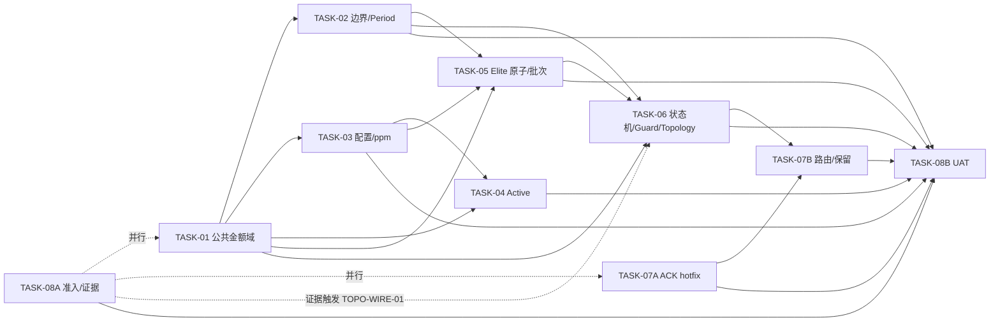

# MODPLAN-PVAM v1.2 完整套件全文


---

<!-- BEGIN MODPLAN-PVAM_v1.2_总方案.md -->

# Redemption PV Amount Migration 本轮修改方案 v1.2（主控总方案）

> 文档编号：`MODPLAN-PVAM_v1.2`  
> 受控代码基线：`l343765828/Redemption@2475c6c49e60089b28f8ef1c0b75e86b2ceb6ebb`  
> 当前状态：`DRAFT`  
> 授权状态：`PENDING_ORGANIZATIONAL_APPROVAL`  
> 状态含义：本轮只完成技术文档修订；当前未提供可识别组织批准人、角色、签名或批准原文，不构成施工授权。

---

## 0A. 正式授权与受控链

- 授权状态：`PENDING_ORGANIZATIONAL_APPROVAL`；权威登记见 `05_CONTROL/AUTHORIZATION_STATUS-PVAM-v2.md`。历史 `APPROVAL-PVAM-20260805-01` 仅作 `UNVERIFIED/HISTORICAL_ONLY` 记录。
- 上游检查/复核：`PLAN-PVAM-v1.15`、`REPORT-PVAM-v1.5`。
- 受控代码基线：`2475c6c49e60089b28f8ef1c0b75e86b2ceb6ebb`。
- 拟申请批准范围：R-001～R-013及TASK-01～08的既定处置；不关闭DEC-013、Gate C或任何UAT AC。

## 1. 文档控制

| 项目 | 内容 |
|---|---|
| 文档名称 | `Redemption PV Amount Migration 本轮修改方案 v1.2` |
| 文档编号 | `MODPLAN-PVAM_v1.2` |
| 文档版本 | `v1.2` |
| 当前状态 | `DRAFT` |
| 受控仓库 | `l343765828/Redemption` |
| 受控提交 | `2475c6c49e60089b28f8ef1c0b75e86b2ceb6ebb` |
| 代码/SQL事实基线 | 与 `097cae32e0ff7708eb6ee69a7f2ce188e80c060c` 一致；两提交区间仅 Elite 规则 DOCX 变化 |
| 对应检查方案 | `Redemption_PV_Amount_Migration_d74_检查方案_v1.15.md` / `PLAN-PVAM-v1.15` |
| 对应复核报告 | `Redemption_PV_Amount_Migration_d74_复核报告_v1.5.md` |
| 权威登记册 | `PV_Amount_Migration_Checklist_Final_v2.25_d74.md`（附件副本名可能含 `(3)`，逻辑文档名以此为准） |
| 本轮审核意见 | `PLAN-PVAM修改方案套件_审核与核验报告_v1.0.md` |
| 七轮终局审计 | `全链路项目工程文档七轮终局审查与核验报告.md` |
| B7-01～B7-06 当前处置 | `00_B7-01-B7-06_真实性核验与反驳表.md` |
| S6-01～S6-06 前轮处置 | `06_HISTORY/00_S6-01-S6-06_真实性核验与反驳表.md`（`HISTORICAL_ONLY`） |
| 编制角色 | 高级技术架构师 / 研发负责人 |
| 编制日期 | `2026-08-04` |
| 审批人 | `待组织授权人签署` |
| 审批日期 | `待签署` |

### 1.1 编号与状态治理

1. `PLAN-PVAM-*` 保留给检查方案家族；本修改方案使用 `MODPLAN-PVAM-*`，避免同号异物。
2. 所有任务书状态与总方案一致为 `DRAFT`；只有取得可核验的组织批准人、角色、批准原文/签名、时间、范围和允许 Wave 后，才允许统一改为 `APPROVED`。
3. `DRAFT/APPROVED/SUPERSEDED` 是文档治理状态；实施状态使用 `NOT_STARTED、READY、IN_PROGRESS、DEV_VERIFIED、BLOCKED、ROLLED_BACK`；验证状态使用 `NOT_RUN、PASS、FAIL、PENDING_TEST_ENV、BLOCKED`。

### 1.2 基线裁决

1. R-001～R-013 是复核报告 v1.5 已独立确认的 13 项代码错误（P0×12、P1×1），本方案全部保留为 `ACCEPTED`。
2. RISK-001～002、UV-001～005 保留原证据等级，不因审核意见自动升级为代码缺陷或 PASS。
3. G2-01～G2-04 是复核报告登记/矩阵修正，不重复生成代码任务。
4. 有效 SQL 用于 Legacy parity；已批准 corrected 合同独立保留，二者不得静默互相覆盖。

### 1.3 版本记录补充

| 版本 | 日期 | 变更 | 治理状态 |
|---|---|---|---|
| v1.1 | 2026-08-05 | 历史全链路修订版；其自述批准记录因不可独立验证而由本版取代 | SUPERSEDED |
| v1.2 | 2026-08-05 | 第四轮关闭追溯、状态、patch/DEV、版本和设计边界问题 | DRAFT |
| v1.2-r8 | 2026-08-06 | 七轮 B7：registry 发布信任根、工件摘要、独立临时目录、AC 来源保真及当前轮次引用 | DRAFT |

## 2. 本轮目标与边界

### 2.1 目标

本方案保持 8 个逻辑任务组；为降低 R-012 的紧急风险，将 TASK-07 拆为 07A/07B，因此实际交付 9 份施工任务书：

- 关闭 R-001～R-013 的设计缺口并给出可执行 AC；
- 金额域统一为 int64 micro-units、费率 ppm、最终奖金 integer cents；
- 只允许外部事件和 DB loader 两处放大；
- monthActivePV 使用唯一读取 getter，各消费方同源现算 Active；
- Elite stats/SOURCE/revision/outbox 原子化并输出外部发布 proof；
- 统一 epoch/state/guard，分离计算、批次就绪与正式发布；
- 先行修复未处理 ACK，再完成最终事件 schema、handler 与 ACK-aware retention；
- 建立固定环境、TC 映射、机器可读追踪和 UAT 证据闭环。

### 2.2 红线

1. 不修改无 R/CHK/P0/T0 证据的业务算法。
2. 不重新打开已 CLOSED DEC，也不把 DEC 关闭写成实现通过。
3. 不代替业务/财务/DBA/运维决定退款人工 override、迟到边界、生产 DDL、权限和主机。
4. 不把静态阅读、fixture 或 shadow 结果写成 UAT/生产 PASS。
5. 不允许 float/round(float)/Decimal(str(float)) 金额洗白。
6. PERIOD_NUM 不得由 YYYYMM 推导，首期不得硬编码 1。
7. Python 不新增未经 DEC-008 授权的 MariaDB 正式奖金 writer。
8. 不物化共享 Active 权威 snapshot；各消费方按统一规则现算。
9. 不把 `team_bonus_tb.py` oracle 冒充生产服务。
10. 不读取默认排除文件、废弃 SQL 或 `GraphService.run_bfs`。
11. 不以固定 MAXLEN、unknown ACK 或未审计 no-op 代替可靠性。
12. 不以 UAT fixture 冒充 DEC-004 2B 生产同步链。
13. 不以测试脚本引用证明 Topology 生产接线。

### 2.3 本轮不承担

- PB/SFB/GPB/CRB Python 算法；
- 新建生产 Team Bonus 服务；
- 业务系统 MariaDB 正式 writer/read switch；
- DEC-004 2B 的 AR_CONFIG→Delta→Redis 写入/失效 producer（本轮登记 `DEFERRED`）；
- 未签字退款人工政策；
- 与正确性/幂等/恢复无关的性能重构。

## 3. 统一技术合同

| 合同 | 唯一规则 |
|---|---|
| PV/BV/GPV/1L/2L/结余/奖金基数 | `int64 micro-units`，`PV_SCALE=1_000_000` |
| amount version | 新计算记录显式 `amount_encoding_version=2`；缺失/None 为 legacy/unknown，默认阻断 |
| 费率 | 有符号整数 ppm，scale=1_000_000 |
| 最终奖金 | 内部 integer cents；外部两位 Decimal string |
| 放大边界 | 外部规范十进制字符串→units；DB Decimal/string→units |
| Active | 同一 UserStats.pv + 唯一 getter，各消费方现算；无共享权威 snapshot |
| monthActivePV 读取 | Redis→等待2秒→Redis→Delta→fail-loud |
| monthActivePV 写入 | `GAP-DEC004-2B / DEFERRED`；fixture 不等于生产链 |
| Period | AR_PERIOD resolver；退款批准时间经 GMT+8 映射 |
| Python 权威状态 | Redis；关键账本、状态和 outbox 同一权威提交 |
| 正式发布 | 业务系统负责正式读模型；Python 交付 batch/manifest/checksum/receipt 协议 |
| ACK | handler 后置条件或批准 audited no-op 完成后才 ACK |
| retention | 所有 group ACK 安全水位前不得裁剪；具备容量、告警和 durable replay |

## 4. DEC 绑定与实施边界

| DEC | 状态 | 本方案绑定 | 主要 TASK |
|---|---|---|---|
| DEC-001 | CLOSED | 负费率 signed ppm，不因负号阻断 | 03 |
| DEC-002 | CLOSED | 业务上限由上游保证；本仓做 int64 技术保护 | 01、03、08 |
| DEC-003 | CLOSED | EAB/LB 上游豁免与 SE exact raw 分离 | 03 |
| DEC-004 | CLOSED CONTRACT | 2A getter/现算由 T04；2B 写入侧 `DEFERRED`，未完成不得关闭 CHK-DATA-006/TC-007 | 04、08 |
| DEC-005 | CLOSED | 第二次整单冲销 duplicate/no-op | 02 |
| DEC-006 | CLOSED CORE | 批准时间/GMT+8/AR_PERIOD；迟到残余不代决 | 02、08 |
| DEC-007 | CLOSED | 本仓 epoch/freeze/drain；业务系统正式发布 | 06 |
| DEC-008 | CLOSED | Redis 权威；Python 不写正式 MariaDB 奖金表 | 05、06 |
| DEC-009 | CLOSED CONTRACT | DBA 最小 schema manifest 缺失即 BLOCKED | 08 |
| DEC-010 | CLOSED | 测试 checkpoint 豁免不关闭生产 Gate C，不豁免 ACK/trim/recovery | 06、07A、07B、08 |
| DEC-011 | CLOSED | 当前节点精确保存；仅对上输出变化才需继续传播，保守全传播可接受 | 05、08 |
| DEC-012 | CLOSED | T06 固定承接 `TOPO-WIRE-01`；T08 证据只决定执行分支 | 06、08 |
| DEC-013 | OPEN | UAT 环境/版本/权限/数据准入 | 08 |
| DEC-014 | CLOSED | Final v2.15 合同已提供 | 全部 |
| DEC-015 | CLOSED | 历史统计按“完全成立8、部分成立1” | 08 |
| DEC-016 | CLOSED | monthActivePV 重复取真实行一条；负/上限不二次业务阻断 | 04 |
| DEC-017 | CLOSED | 文档已修；不等于代码行为 PASS | 05、08 |
| DEC-018 | CLOSED | 无须物化 Active，各消费方同规则现算 | 04 |

## 5. 问题处置与双向追踪矩阵

### 5.1 R-001～R-013

| 问题 | 级别 | 状态 | REM | W | V | 所属任务 | 本轮结果要求 |
|---|---:|---|---|---|---|---|---|
| R-001 amount version 缺失 | P0 | ACCEPTED | REM-001 | W-001 | V-001 | 01 | 新记录 v2；legacy/unknown 隔离 |
| R-002 PvAmount 公共层缺失 | P1 | ACCEPTED | REM-002 | W-002 | V-002 | 01 | 唯一公共金额 API |
| R-003 float/round 链 | P0 | ACCEPTED | REM-003 | W-003 | V-003 | 02 | 生产金额整数化 |
| R-004 配置合同偏差 | P0 | ACCEPTED | REM-004 | W-004 | V-004 | 03 | signed ppm、snapshot、exact raw |
| R-005 PE 裸30 | P0 | ACCEPTED | REM-005 | W-005 | V-005 | 04 | 唯一 getter |
| R-006 外部 IS_ACTIVE 权威 | P0 | ACCEPTED | REM-006 | W-006 | V-006 | 04 | 消费方同源现算 |
| R-007 本地 period 算术 | P0 | ACCEPTED | REM-007 | W-007 | V-007 | 02 | AR_PERIOD resolver |
| R-008 Elite SOURCE 非原子 | P0 | ACCEPTED | REM-008 | W-008 | V-008 | 05 | stats/SOURCE/revision/outbox 同提交 |
| R-009 persisted=false 仍 DONE | P0 | ACCEPTED | REM-009 | W-009 | V-009 | 06 | 计算/ready/published 分层 |
| R-010 guard 分裂 | P0 | ACCEPTED | REM-010 | W-010 | V-010 | 06 | 单一 guard/epoch |
| R-011 Elite gate/writer proof | P0 | ACCEPTED | REM-011 | W-011 | V-011 | 05 | gate、manifest、receipt |
| R-012 未处理仍 ACK | P0 | ACCEPTED | REM-012A、REM-012B（父项 R-012） | W-012A、W-012B | V-012A、V-012B | 07A、07B | 先 fail-closed，再完成最终 handler/schema；机器清单保留 parent_issue=R-012 |
| R-013 ACK 前裁剪 | P0 | ACCEPTED | REM-013 | W-013 | V-013 | 07B | ACK-aware retention/replay |

### 5.2 RISK 与 UV

| 编号 | 级别 | 状态 | 子状态 | 所属任务 | 裁决 |
|---|---:|---|---|---|---|
| RISK-001 Topology 可达性 | P1 | UAT_VERIFY | BLOCKED_EXTERNAL_EVIDENCE | 08→触发06 | archive/部署/call graph 决定 T06 接线分支，不预先改写为缺陷 |
| RISK-002 原始测试证据缺失 | P1 | UAT_VERIFY | PENDING_RERUN_EVIDENCE | 08 | 固定镜像重跑 |
| UV-001 全链路环境 | P0 | UAT_VERIFY | PENDING_TEST_ENV | 08 | DEC-013 后执行 |
| UV-002 schema/DDL/SQL_MODE | P0 | UAT_VERIFY | BLOCKED_EXTERNAL_EVIDENCE | 08 | DBA manifest |
| UV-003 SQL-Python 同数据差分 | P0 | UAT_VERIFY | PENDING_TEST_ENV | 08 | 隔离 UAT |
| UV-004 ACK/PEL/trim/恢复 | P0 | UAT_VERIFY | PENDING_TEST_ENV | 08 | 真实中间件/故障注入 |
| UV-005 archive/全测/审计包 | P1 | UAT_VERIFY | BLOCKED_EXTERNAL_EVIDENCE | 08 | 精确归档和原始包 |

### 5.3 其他发现与派生缺口

| 编号 | 状态 | 所属任务 | 说明 |
|---|---|---|---|
| OPT-001 | ACCEPTED | 08 | pytest/unittest 收集包装，保留 CLI smoke |
| OPT-002 | ACCEPTED | 08 | 机器可读双向追踪 manifest |
| FIX-001 | N/A — CONFIRMED_CLOSED | 文档基线 | DEC-017 文档修复，不计当前缺陷 |
| GAP-DEC004-2B | DEFERRED | 08 | 本轮不建设写入/失效链；生产前必须另有施工任务 |

### 5.4 五状态统计

- R/RISK/UV 强制范围：`ACCEPTED=13`、`UAT_VERIFY=7`、`REJECTED=0`、`DEFERRED=0`、`NEEDS_DECISION=0`。
- `GAP-DEC004-2B` 是本方案派生的实现缺口，不改变复核报告 13+7 统计。
- FIX-001 为已关闭修复，不进入五状态统计。

## 6. 模块化任务拆分

| 任务 | 标题 | 主问题 | Gate | 独立交付边界 |
|---|---|---|---|---|
| 01 | 金额编码公共层与模型适配 | R-001/002 | A | API、version、legacy 隔离 |
| 02 | 订单/退款边界与 Period | R-003/007 | A/B/C | normalizer、resolver、无 float |
| 03 | 配置/ppm | R-004 | A/B | matrix、snapshot、signed ppm |
| 04 | monthActivePV/Active | R-005/006 | B | 读取 getter、消费方现算；2B 写入侧延期 |
| 05 | Elite SOURCE/Writer Proof | R-008/011 | A/B/C | Redis 原子账本、candidate/batch |
| 06 | 状态机/Guard/Topology 条件接线 | R-009/010、RISK-001 条件项 | C | epoch、guard、发布分层、TOPO-WIRE-01 |
| 07A | ACK 紧急修复 | R-012 子集 | C | 当前 payload 内 fail-closed，可先行 |
| 07B | 最终路由与 Stream 保留 | R-012/013 | C | schema、handler、retention/replay |
| 08 | 风险/UAT/证据治理 | RISK/UV、OPT、2B gap | A/B/C | 环境、TC、证据、追踪 |

## 7. 执行顺序与依赖拓扑



### 7.1 推荐 Wave

| Wave | 任务 | 说明 |
|---|---|---|
| 0 | 08A | archive、DDL、镜像、权限、fixture 准入 |
| 1 | 01、07A | 公共金额域与 ACK hotfix 并行；07A 不依赖金额/状态机 |
| 2 | 02、03 | 依赖 01，可并行 |
| 3 | 04 | 依赖 01/03；只做读取侧和 Active |
| 4 | 05 | 依赖 01/02/03 |
| 5 | 06 | 状态机、发布分层、Topology 条件接线 |
| 6 | 07B | 依赖 06 和 07A |
| 7 | 08B | 固定环境全量 UAT |

### 7.2 合并门禁

- 每个任务独立 PR、变更清单、测试报告和 rollback；07A/07B 独立开关。
- 后续任务不得复制前置公共函数。
- DEV AC 未满足不得进入相应 UAT。
- 08A 最小准入未完成，UAT 结果不得关闭问题。
- 2B fixture 只允许验证读取侧；不得据此关闭生产供给链。

## 8. P0/T0 承载摘要

| 主题 | TASK |
|---|---|
| P0-0/DEC-009 schema | 08 |
| P0-1/2A/3/7 金额、舍入、Period | 01、02、03、05、08 |
| P0-2B/3-TIME/4 退款与入口屏障 | 02、06、08 |
| P0-5A/5B/9 配置与 SE | 03、08 |
| P0-8/12 Elite | 05、06、08 |
| P0-10 Active | 04；2B gap 由 08 管理 |
| P0-11 事件身份/路由 | 02、06、07A、07B、08 |
| T0-2/6/16/21/28 状态、提交、恢复 | 05、06、07B、08 |
| T0-17/19 Active 输入 | 04、08 |
| T0-30 治理/审计 | 08 |

详细 T0-1～30 与 TC-000～032 映射以各任务 AC 和 T08 §8.3 为准；不得合并省略状态行。

## 9. AC 环境与 TC 纪律

1. 每个任务书 §9 使用 `AC / 验收标准 / 环境 / 关联 TC` 四列。
2. `DEV` 可在固定源码与隔离 fixture 关闭；`UAT` 依赖 DEC-013；`DEV+UAT` 两类证据均需存在。
3. UAT 不可用时，所有含 UAT 的 AC 只能 `PENDING_TEST_ENV` 或 `BLOCKED`。
4. TC-000 为 RETIRED；TC-001～032 必须逐项保留结果。
5. UAT-001～012 只是执行包分组，不能替代受控 TC 编号和通过标准。

## 10. 总体验收标准

### 10.1 DEV

- compile/AST/import graph 通过；公共层无反向依赖；
- production-reachable 金额无 float；version/ppm/period/Active/Elite/state/ACK mutation 有效；
- pytest/unittest 可收集且 CLI smoke 保留；
- 每任务提供命令、exit、stdout/stderr、文件清单、前后行为和 rollback 结果。

### 10.2 UAT

- commit/archive/image/schema/config/data 全有 checksum；
- MySQL/Redis/Kafka/Dask/RAPIDS/GPU/时区/权限完整；
- 同数据 SQL-Python 差分；
- 故障注入覆盖锁、进程、Redis/Kafka、重复/乱序、PEL、DLQ、trim、空批次、重跑；
- Topology 生产接线有部署+trace 证据；
- 2B 写入链未建设时明确 BLOCKED，不用 fixture 替代；
- 每个问题只在所属 AC/TC 证据齐全后关闭。

### 10.3 Gate

| Gate | 关闭条件 |
|---|---|
| A | units/version/边界/ppm/int64/period 通过；unknown/float mutation 被阻断 |
| B | 各奖金 oracle/corrected 同数据差分、Active/配置/2B供给条件满足 |
| C | epoch/guard/atomic outbox/publish proof/ACK/retention/recovery 通过；生产豁免有批准计划 |

任一 Gate OPEN/FAILED/BLOCKED/PENDING_TEST_ENV，整体仍为 `INCOMPLETE / NOT READY FOR PRODUCTION`。

## 11. 通用回滚原则

1. 独立 feature flag/schema/event version；additive-first。
2. v2 units 禁止降格写回 legacy；保留新字段/键审计。
3. 07A 回滚不得恢复 unknown/ghost 自动 ACK；必要时停消费并保留 PEL。
4. 07B retention 默认 dry-run；IN_DOUBT/ghost 未关闭禁止 trim。
5. 状态失败进入 FAILED/IN_DOUBT，不删除键伪装 OPEN。
6. 外部发布失败继续服务上一 committed 版本。
7. 回滚证据含操作者、时间、原因、period/run/epoch、前后 checksum。

## 12. 交付物清单

| 文件 | 作用 |
|---|---|
| `00_B7-01-B7-06_真实性核验与反驳表.md` | 当前七轮审计意见的本轮独立裁决 |
| `全链路项目工程文档七轮终局审查与核验报告.md` | 当前审计来源；随顶层包归档 |
| `00_S6-01-S6-06_真实性核验与反驳表.md` | `HISTORICAL_ONLY`；前轮处置来源 |
| `00_F1-F7_审核意见核验与反驳表.md` | `HISTORICAL_ONLY`；不属于当前包，不参与活动门禁 |
| `MODPLAN-PVAM_v1.2_总方案.md` | 主索引、范围、DEC、追踪、依赖、总验收 |
| `TASK-PVAM-01_金额编码公共层与基础模型适配器.md` | R-001/002 |
| `TASK-PVAM-02_订单退款入口金额放大与边界转换.md` | R-003/007 |
| `TASK-PVAM-03_配置解析ppm与硬编码清理.md` | R-004 |
| `TASK-PVAM-04_monthActivePV与Active同源现算.md` | R-005/006；2B读取侧/延期边界 |
| `TASK-PVAM-05_Elite_SOURCE原子性与Writer_Proof.md` | R-008/011 |
| `TASK-PVAM-06_全量重算状态机发布分层与统一Guard.md` | R-009/010；TOPO-WIRE-01 |
| `TASK-PVAM-07A_Consumer_ACK紧急修复.md` | R-012 hotfix |
| `TASK-PVAM-07B_事件路由与Stream保留.md` | R-012 final/R-013 |
| `TASK-PVAM-08_风险延期与UAT准入证据包.md` | RISK/UV/OPT/2B gap |
| `MODPLAN-PVAM_v1.2_完整套件全文.md` | 按要求合并的完整 Markdown 全文 |
| `SHA256SUMS.txt` | 完整性清单 |

## 13. 审批与授权状态

本文件当前治理状态为 `DRAFT`，授权状态为 `PENDING_ORGANIZATIONAL_APPROVAL`。当前会话指令授权的是 B7-01～B7-06 的事实核验和文档/控制资产修订，不是代码施工、部署或生产发布授权。

升格为 `APPROVED` 前必须提供并归档：

1. 可识别批准人姓名、组织角色与权限范围；
2. 不可抵赖的批准原文、签名或受控审批系统记录；
3. 批准时间、适用基线、批准的 TASK/WORK/Wave；
4. 保留的 `BLOCKED/DEFERRED/PENDING_TEST_ENV` 项、责任人和截止时间；
5. 明确声明文档批准不等于代码、DEV、UAT、部署或 Gate C 通过。

上述证据缺失时，所有 TASK/WORK 均保持 `DRAFT/BLOCKED`；不得使用历史 `APPROVED_BY_USER_INSTRUCTION` 记录代签。

<!-- END MODPLAN-PVAM_v1.2_总方案.md -->


---

<!-- BEGIN TASK-PVAM-01_金额编码公共层与基础模型适配器.md -->

# TASK-PVAM-01 金额编码公共层与基础模型适配器

## 1. 文档信息

| 项目 | 内容 |
|---|---|
| 所属总方案 | `MODPLAN-PVAM_v1.2` |
| 任务编号 | `TASK-PVAM-01` |
| 来源检查项 | `CHK-ARCH-003、CHK-DATA-001、CHK-DATA-003、CHK-EVT-002` |
| 来源问题 | `R-001、R-002` |
| 处置项 | `REM-001、REM-002` |
| 施工项 | `W-001、W-002` |
| 验证项 | `V-001、V-002` |
| 关联决策 | `DEC-002、DEC-008、DEC-014` |
| 严重级别 | `P0 / P1` |
| 当前状态 | `DRAFT` |
| 受控基线 | `l343765828/Redemption@2475c6c49e60089b28f8ef1c0b75e86b2ceb6ebb` |
| 编制日期 | `2026-08-04` |
| 审批人 | `待组织授权人签署` |
| 审批日期 | `待签署` |
| 前置任务 | 无（所有代码任务的根前置） |

> `DRAFT` 表示技术内容已修订但尚无可核验组织施工授权；不得启动代码施工、部署或生产发布。


### 1.1A 授权与执行状态分层

- 授权状态依据：`AUTHORIZATION_STATUS-PVAM-v2`；当前为 `PENDING_ORGANIZATIONAL_APPROVAL`。
- 本TASK治理状态：`DRAFT`；授权状态：`PENDING_ORGANIZATIONAL_APPROVAL`。
- 代码实现状态：`NOT_STARTED`；UAT依赖项：`PENDING_TEST_ENV`。
- 批准不改变来源报告的`REJECTED`结论，也不允许绕过WORK级patch、rollback和环境门禁。

## 2. 问题与代码证据

### 2.1 已核实事实

- `Model/User/UserStats.py::UserStats` 持有 `pv/gpv/gpv_real/gpv_unreal/pv_1l/pv_2l/pre_surplus/total/remain` 等金额字段，但没有 `amount_encoding_version`。
- `Model/User/EliteBonusStats.py::EliteBonusStats` 持有 `pv_pcs/gpv/gpv_real/estimated_bonus`，同样没有金额编码版本；`estimated_bonus` 还是 float 字段。
- 固定提交中 `Common/PvAmount.py` 不存在；PE、SE、EAB、Leadership、Elite 各自保留金额/精度处理，形成多套 scale 和舍入语义。
- `UserPeriodHighestRank` 不持有金额字段，不属于 amount version 模型，禁止误加版本字段。

### 2.2 稳定定位

| 证据 | 稳定定位 | 当前事实 |
|---|---|---|
| EV-CODE-001 | `Model/User/UserStats.py::UserStats` | 无 amount version |
| EV-CODE-002 | `Model/User/EliteBonusStats.py::EliteBonusStats` | 无 amount version；奖金 float |
| EV-CODE-013 | `Common/PvAmount.py` | 文件不存在 |
| 目标合同 | v2.25 §四、T0-3/4/5/7 | units/version/ppm/cents/无 float |

## 3. 本任务修改目标

1. 建立项目唯一的公共金额域，统一 micro-units、integer cents、ppm、严格类型检查和 int64 上界保护。
2. 为所有持久化金额模型建立可审计的编码版本；新记录显式为 v2，legacy/unknown 不得静默混入。
3. 提供只在两个批准边界使用的转换 API，并为后续 TASK 提供稳定、无业务反向依赖的底层接口。
4. 采用 additive-first 兼容策略，使本任务可先独立合入、独立测试和独立回滚。

## 4. 处置决定与方案选择

### 4.1 采用方案

新增 `Common/PvAmount.py`，作为最低层纯函数模块；模型增加可空 `amount_encoding_version`，但所有新建 v2 记录必须由工厂显式传入 `2`。

核心常量：

```python
PV_SCALE = 1_000_000
BONUS_CENT_SCALE = 100
RATE_PPM_SCALE = 1_000_000
AMOUNT_ENCODING_VERSION_V2 = 2
INT64_MIN = -(2**63)
INT64_MAX = 2**63 - 1
```

目标 API 至少包含：

```text
parse_external_decimal_to_units(raw: str, *, max_decimals: int = 2) -> int
parse_db_amount_to_units(raw: Decimal | str, *, max_decimals: int = 2) -> int
require_units_int(value, field_name: str) -> int
require_amount_version(value, *, allow_legacy: bool = False) -> int
units_to_decimal_string(units: int) -> str
parse_percent_to_ppm(raw: Decimal | str) -> int
mul_units_by_ppm(units: int, ppm: int) -> int
units_ppm_to_bonus_cents(units: int, ppm: int, rounding_mode: str) -> int
checked_add_int64(*values: int) -> int
checked_mul_int64(a: int, b: int) -> int
assert_integer_amount_dtype(df, columns, df_name: str) -> None
```

### 4.2 版本策略

- 模型字段定义采用 `Optional[int] = None`，防止旧 Redis JSON 因字段缺失而无法反序列化。
- 新记录工厂必须显式写 `amount_encoding_version=2`；禁止把模型默认值设置为 2，因为这会把旧记录静默伪装成新编码。
- 读路径：`2` 可进入新计算域；`None/缺失` 只允许进入隔离的 legacy adapter 或迁移工具；其他值 fail-loud。
- 不在本任务自动把 legacy 数值乘以 `1_000_000`。历史转换必须由有来源、有审计清单的 migration/rebuild 完成。

### 4.3 被否决方案

| 方案 | 否决理由 |
|---|---|
| 给 version 字段默认值 2 | 旧 JSON 缺字段时会被静默解释成新编码 |
| 在每个奖金服务各自写转换函数 | 延续 R-002 的多实现漂移 |
| 接受 float 后 `Decimal(str(float))` | 已经发生二进制精度损失，不是修复 |
| 在 `Until/Common.py` 混入奖金规则 | 公共层会反向依赖业务模块，破坏单向依赖 |
| 给 `UserPeriodHighestRank` 加 version | 该模型无金额，属于范围越界 |

## 5. 修改范围与受影响模块

### 5.1 新增文件

- `Common/PvAmount.py`：公共金额、ppm、cents、int64/dtype 守卫。
- `Common/AmountModelAdapter.py`（可选独立文件）：模型版本读取、legacy 隔离、序列化辅助。
- `User/Test/test_pv_amount_common.py`：公共 API 测试。
- `User/Test/test_amount_model_version.py`：版本和旧 JSON 兼容测试。

### 5.2 修改文件

| 文件 | 修改点 |
|---|---|
| `Model/User/UserStats.py` | 新增 `amount_encoding_version: Optional[int] = None`；金额字段注释统一为 units |
| `Model/User/EliteBonusStats.py` | 新增 version；增加 integer-cents 目标字段或标注 legacy float 字段只读 |
| `Redishelper/BaseRedisModel.py` | 如需，增加模型后置版本校验 hook；不得耦合奖金业务 |
| `User/UserStatsService.py` | 新建/零值工厂显式传 v2 |
| `User/GlobalRecalculationService.py` | `_new_zero_user_stats` 显式传 v2；反序列化校验 version |
| `User/PlacementIncrementalService.py` | 新对象显式传 v2 |
| `User/PlacementRecalculationService.py` | 新对象/批量读取校验 version |
| `User/EliteBonusService.py` | `_get_or_create_node` 显式传 v2 |
| `User/GlobalEliteBonusRecalculationService.py` | 新节点/批量读取校验 version |

## 6. 明确排除项（防越界红线）

- 不在本任务重写 PE/SE/EAB/LB/Elite 具体奖金公式；它们在 TASK-02/03/04/05 迁移到公共 API。
- 不自动转换现有 Redis 数据，不执行生产清库，不生成没有审计来源的 seed。
- 不修改 `UserPeriodHighestRank`。
- 不修改有效 SQL 的业务公式。
- 不删除旧 `estimated_bonus` 字段；先 additive 兼容，最终停写由 TASK-02/05 完成。
- 不读取 `_bak`/`_final`、废弃 SQL 或 `GraphService.run_bfs`。

## 7. 前置条件与依赖关系

- 无前置 TASK。
- 依赖 P0-0/DEC-009 的 schema manifest 仅用于最终 UAT，不阻止公共层 DEV 实施。
- 本任务完成后，TASK-02～07 只能调用本任务 API，不得复制实现。

## 8. 修改后行为与技术设计

### 8.1 类型门禁

`require_units_int` 必须拒绝：

- `bool`（Python 中是 int 子类）；
- Python/NumPy/CuPy float；
- Decimal/string（内部域不负责转换）；
- NaN、Infinity、指数文本；
- 超出 int64 的值。

允许 Python int 与明确支持的 NumPy/CuPy signed integer，转换后再次检查 int64。

### 8.2 模型读取状态机

```text
version=2            -> NEW_DOMAIN_OK
version=None/缺字段   -> LEGACY_UNKNOWN，默认阻断
version=其他          -> INCOMPATIBLE，阻断并记录
```

所有异常日志包含：模型、Redis key、period、user_id、version、run_id，不打印敏感业务内容。

### 8.3 算术与舍入

- units 计算保持整数；每次加、乘、聚合前后检查 int64。
- `mul_units_by_ppm` 明确向零截断，不使用 `/` 产生 float。
- 最终奖金到 cents 的 rounding mode 由奖项合同调用参数决定：E/PE/SE/LB/TB 使用 SQL 对应截断；EAB 使用已确认最终一次 `ROUND_HALF_UP`。
- 公共层只实现算法，不自行选择奖项 rounding mode。

### 8.4 依赖方向

```text
Common/PvAmount
  ↑
Model adapters / User / Placement / Bonus
```

`Common` 禁止导入 `User`、`Model.User` 或任何奖金服务。

## 9. 任务验收标准（AC）

| AC | 验收标准 | 环境 | 关联 TC |
|---|---|---|---|
| AC-01 | `Common/PvAmount.py` 存在，import graph 无循环，公共层无业务模块 import | DEV | TC-002、TC-031 |
| AC-02 | UserStats、EliteBonusStats 新建记录均显式写 version=2 | DEV+UAT | TC-003 |
| AC-03 | 旧 JSON 缺 version 可反序列化，但进入 v2 计算入口时必定阻断 | DEV+UAT | TC-003 |
| AC-04 | version=1、3、字符串2、bool 等非法值全部阻断 | DEV | TC-003 |
| AC-05 | 外部/DB 边界 parser 与内部 `require_units_int` 职责分离 | DEV | TC-001、TC-002 |
| AC-06 | `0.1` float、`True`、NaN、Infinity、指数文本均被相应用例拒绝 | DEV | TC-001、TC-002 |
| AC-07 | 正负边界、int64 最大值、乘法溢出测试通过 | DEV+UAT | TC-008 |
| AC-08 | 只有持久化金额模型新增 version；无金额模型零误加 | DEV | TC-003、TC-030 |
| AC-09 | 全仓新增代码没有 `Decimal(str(float))`、`int(round(float))` 等洗白模式 | DEV | TC-002、TC-031 |
| AC-10 | TASK-01 独立回滚测试通过，旧代码在不写 v2 新数据时可启动 | DEV+UAT | TC-031、TC-032 |

> 环境规则：仅标记 UAT 或 DEV+UAT 的条目在环境不可用时只能记为 `PENDING_TEST_ENV`，不得以 DEV 结果替代最终关闭。

## 10. 环境验证与回传证据

### 10.1 DEV

- `python -m compileall` 与 AST/import graph。
- 公共 parser/version/int64/dtype 单元测试。
- Redis OM 旧 JSON/new JSON 序列化往返测试（可用隔离 Redis）。
- mutation：把 version 校验删除、把 bool 当 int、把 float 放行，测试必须失败。

### 10.2 UAT

关联 `UAT-001、UAT-011`：

- 混合 legacy/new Redis 样本读取；
- schema manifest 中金额字段、范围和 assignment 核对；
- 大批量聚合 int64 上界与错误阻断；
- 回传 Redis 前后样本、dtype、命令、exit code、完整输出、checksum。

无法提供 UAT 时，本任务只能标记 `DEV_ACCEPTED / PENDING_TEST_ENV`，不得关闭 Gate A。

## 11. 独立回滚与风险控制

1. 先通过 feature flag `PV_AMOUNT_V2_READ/WRITE` 开启新域；默认 shadow-read，不直接切生产。
2. 回滚时关闭 v2 新写并恢复旧读路径，但保留 version 字段和 v2 键供审计。
3. 已经写入的 v2 数值禁止除以 `1_000_000` 回写旧键；需要回退时以最后一个 committed legacy snapshot 服务。
4. 如果模型新增字段导致兼容问题，只回滚 reader enforcement，不删除 Redis JSON 字段。
5. 回滚后重跑版本扫描，确保没有 v2 数据被 legacy 代码误读。


### 第四轮补充：有符号整数除法合同

`trunc_div_zero(numerator, denominator)` 必须支持任意非零分母，并对 `(+,+)、(+,-)、(-,+)、(-,-)` 四象限均向零截断；分母为零必须抛出异常。

<!-- END TASK-PVAM-01_金额编码公共层与基础模型适配器.md -->


---

<!-- BEGIN TASK-PVAM-02_订单退款入口金额放大与边界转换.md -->

# TASK-PVAM-02 订单/退款入口金额放大与边界转换

## 1. 文档信息

| 项目 | 内容 |
|---|---|
| 所属总方案 | `MODPLAN-PVAM_v1.2` |
| 任务编号 | `TASK-PVAM-02` |
| 来源检查项 | `CHK-DATA-001、CHK-DATA-002、CHK-ARCH-003、CHK-BIZ-011、CHK-DATA-005` |
| 来源问题 | `R-003、R-007` |
| 处置项 | `REM-003、REM-007` |
| 施工项 | `W-003、W-007` |
| 验证项 | `V-003、V-007` |
| 关联决策 | `DEC-002、DEC-005、DEC-006、DEC-007、DEC-010` |
| 严重级别 | `P0` |
| 当前状态 | `DRAFT` |
| 受控基线 | `l343765828/Redemption@2475c6c49e60089b28f8ef1c0b75e86b2ceb6ebb` |
| 编制日期 | `2026-08-04` |
| 审批人 | `待组织授权人签署` |
| 审批日期 | `待签署` |
| 前置任务 | `TASK-PVAM-01` |

> `DRAFT` 表示技术内容已修订但尚无可核验组织施工授权；不得启动代码施工、部署或生产发布。


### 1.1A 授权与执行状态分层

- 授权状态依据：`AUTHORIZATION_STATUS-PVAM-v2`；当前为 `PENDING_ORGANIZATIONAL_APPROVAL`。
- 本TASK治理状态：`DRAFT`；授权状态：`PENDING_ORGANIZATIONAL_APPROVAL`。
- 代码实现状态：`NOT_STARTED`；UAT依赖项：`PENDING_TEST_ENV`。
- 批准不改变来源报告的`REJECTED`结论，也不允许绕过WORK级patch、rollback和环境门禁。

## 2. 问题与代码证据

### 2.1 金额链事实

- `PEBonusService._apply_truncate` 使用 `cp.round`，并以 `/100.0` 输出奖金 float。
- `SuperEliteBonusService` 在金额/比例路径存在 Decimal 与后续 DataFrame 数值转换分叉。
- `LeadershipBonusGPUService._truncate_gpu` 显式转换 `float64`，再 `nextafter/trunc`。
- `EliteBonusStats.estimated_bonus` 与 Elite 服务写入 float。
- `PlacementRecalculationService` 从 Redis 读取金额时调用 `float(...)`，空表也构造 `float64` PV 列。

### 2.2 Period 事实

- `GlobalRecalculationService._get_previous_period` 硬编码首期为 1，并直接 `period-1`。
- `PlacementIncrementalService._get_prev_period` 同样硬编码首期 1。
- `PlacementRecalculationService._get_prev_period` 同时接受 `YYYYMM` 并做自然月减一，或接受正整数减一。
- 这些实现绕过“由 AR_PERIOD 唯一解析 current/first/previous/calc_month”的目标合同。

### 2.3 入口事实

- 当前 `Order/OrderService.py` 是 Dask/BFS 演示入口，不是受控 PV 订单消费边界。
- `MessageConsumer/UserConsumer.py` 消费用户变更并更新图，不是订单/退款金额 Normalizer。
- 因此实施不得把演示脚本或用户拓扑 consumer 直接宣称为生产金额入口；必须建立并证明真实接线。

## 3. 本任务修改目标

1. 建立外部订单/退款和 DB 批量装载的唯一金额转换边界。
2. 生成不可变 normalized delivery，提供唯一 `effective_pv_delta_units` 给 UserStats、Placement、Elite 三路。
3. 清除所有生产可达金额链中的 float/round 中转，使用 TASK-01 的 units/ppm/cents API。
4. 建立唯一 `PeriodResolver`，所有服务、Active、配置、writer 和退款归期共用同一 period snapshot。
5. 落实已确认的整单退款、一次冲销和批准时间归期原则，同时不越权决定人工 override/迟到边界。

## 4. 处置决定与方案选择

### 4.1 目标组件

建议新增：

- `Common/PeriodResolver.py`
- `MessageConsumer/PvEventSchema.py`
- `MessageConsumer/PvEventNormalizer.py`
- `MessageConsumer/PvEventConsumer.py`（或接入实际部署入口的等价模块）
- `Model/Order/NormalizedPvEvent.py`
- `Order/RefundReversalLedger.py`（Redis 权威接口/协议；事务落地与 epoch 在 TASK-06 联动）

### 4.2 两处放大边界

```text
A. Kafka/MQ raw event：canonical decimal string -> units
B. DB batch loader：Decimal/string -> units
```

内部服务只接收：

```text
period_num
source_system
source_event_id
normalized_event_id
business_revision / previous_business_revision
effective_pv_delta_units (strict int)
amount_encoding_version=2
approved_at / resolved_period_snapshot
```

### 4.3 PeriodResolver

解析动作必须：

1. 查询 `AR_PERIOD` 并验证 current period 唯一；
2. 读取 `CALC_YEAR/CALC_MONTH`；
3. 读取系统首期 `MIN(PERIOD_NUM)`；
4. 非首期验证 `current-1` 行真实存在；
5. 为退款把批准时间转换 GMT+8 后查询唯一 period；
6. 产出 immutable `PeriodSnapshot`，包含源查询 checksum/版本。

### 4.4 被否决方案

| 方案 | 否决理由 |
|---|---|
| 入口 `bv=int(bv)` | 会截断或误收非规范输入，且无法判断原单位 |
| 内部服务再次 `pv_to_units` | 导致双放大 |
| 根据 6 位字符串猜 YYYYMM | PERIOD_NUM 与 YYYYMM 语义不同 |
| 首期固定 1 | AR_PERIOD 首期可能不是 1 |
| 以 Kafka 到达时间决定退款期 | DEC-006 指定批准时间 |
| 把 `OrderService.py` demo 直接部署 | 没有 schema、幂等、period、guard 与三路分发合同 |
| 用 float64 提升 GPU 性能 | 违反财务定点合同 |

## 5. 修改范围与受影响模块

### 5.1 边界与 Normalizer

- 新订单/退款消息 schema 和 Normalizer。
- 实际 Kafka/MQ 部署入口及启动脚本。
- DB batch loader/全量重建入口。
- UserStats/Placement/Elite 增量调用签名。

### 5.2 float 清理

| 文件 | 目标修改 |
|---|---|
| `User/PEBonusService.py` | TOTAL_BASE_GPV/bonus 全整数；取消 `cp.round` 与 `/100.0` |
| `User/SuperEliteBonusService.py` | orders/pool/bonus 使用 units/cents；禁止 float dtype |
| `User/LeadershipBonusGPUService.py` | `_truncate_gpu` 改为整数比例/截断；gpv 列 int64 |
| `User/EliteBonusService.py` | estimated bonus 迁移到 integer cents；不写 float |
| `Model/User/EliteBonusStats.py` | v2 路径只写 integer-cents 字段 |
| `User/PlacementRecalculationService.py` | 去掉 Redis `float()`、float64 PV 列和 round |
| `User/PlacementIncrementalService.py` | 入口严格 units-int；period resolver |
| `User/GlobalRecalculationService.py` | period resolver；金额 version/dtype 守卫 |
| `User/EliteAchievementBonusService.py` | 保留其已批准最终 HALF_UP，但接入公共 units/cents 边界，避免多 scale 混用 |

### 5.3 测试

- raw schema/parser 测试；
- DB loader 测试；
- normalized single-delta 三路一致测试；
- period/退款边界测试；
- 各奖金和 Placement 金额 mutation/dtype 测试。

## 6. 明确排除项（防越界红线）

- 不改变 E/PE/SE/EAB/LB/TB 的资格、分母、比例和网络公式。
- 不把 corrected floor-zero 冒充 Legacy SQL；两种模式必须可追溯。
- 不决定退款金额不符后的人工 override、授权角色或专项池 reconciliation。
- 不自行定义“迟到事件 cutoff”；未签字场景自动路径拒绝并留证。
- 不在本任务完成 settlement epoch/发布状态机；由 TASK-06 实现。
- 不建设生产 TB 服务；只保证已有 oracle/验收输入单位不被混淆。

## 7. 前置条件与依赖关系

- 必须先完成 TASK-PVAM-01 的公共 API 与模型 version。
- 配置相关比例必须通过 TASK-PVAM-03 接口获取；本任务只负责金额运算迁移。
- 最终三路事件提交、epoch 和 coverage 依赖 TASK-PVAM-06。
- UAT 归期测试依赖 DEC-013 环境准入和 AR_PERIOD 只读权限。

## 8. 修改后行为与技术设计

### 8.1 外部金额 schema

只接受 JSON string：`"30"`、`"30.00"`、`"-100.25"`。拒绝 JSON number、bool、null、指数、NaN、Infinity、超过两位小数和空白修复式输入。

### 8.2 Normalized delivery

Normalizer 只计算一次：

```text
old_business_units
new_business_units
effective_pv_delta_units = new_business_units - old_business_units
```

`effective_pv_delta_units` 与 identity/hash 固化后，UserStats、Placement、Elite 只消费该字段，禁止重新聚合、钳制或放大。corrected floor-zero 仅在批准的业务状态计算点执行，并保留原始 signed event。

### 8.3 退款

- 任一商品退款触发原订单整单有效 BV 等额负向事件。
- 同一原订单从未冲销到已整单冲销只允许一次。
- 相同身份/hash 重投为幂等 no-op；第二个冲销请求按 DEC-005 识别 duplicate/no-op，不再次扣减。
- 金额与原订单不一致、身份冲突：自动路径拒绝，记录永久冲突；不做部分应用。
- 未发奖回原期，已发奖进入批准时间映射出的当前期；不重开已发历史期。

### 8.4 出计算域

- units -> cents 或 Decimal string 只在 writer/event adapter 做。
- 每个输出字段在编码矩阵中登记：字段名、内部单位、外部单位、舍入模式、调用点。
- DataFrame merge/groupby 前后调用 dtype assertion。

## 9. 任务验收标准（AC）

| AC | 验收标准 | 环境 | 关联 TC |
|---|---|---|---|
| AC-01 | 全仓只有两个批准的放大调用点；生产内部无第三处 `*1_000_000` | DEV+UAT | TC-001、TC-002、TC-023 |
| AC-02 | JSON number/float/bool/null/指数/NaN/Infinity 全部拒绝并进入明确错误处置 | DEV+UAT | TC-001 |
| AC-03 | 同一 normalized event 三路收到相同 int delta、version、revision 和 identity | DEV+UAT | TC-023、TC-026 |
| AC-04 | PE/SE/Elite/LB/Placement 生产金额列无 float dtype；EAB scale 不与公共 units 混用 | DEV+UAT | TC-002、TC-012、TC-017、TC-018、TC-021 |
| AC-05 | 最终奖金不以 float 输出，外部只输出两位 Decimal string 或 integer cents | DEV+UAT | TC-008、TC-017、TC-018、TC-019、TC-021 |
| AC-06 | PeriodResolver 不接受 YYYYMM 推导；首期来自 MIN(AR_PERIOD) | DEV+UAT | TC-006 |
| AC-07 | current/previous period 缺失、多行或不连续时 fail-loud | DEV+UAT | TC-006 |
| AC-08 | 退款批准时间经 GMT+8 在月界前后映射正确；到达时间不影响归期 | UAT | TC-006、TC-022 |
| AC-09 | 整单退款重复和第二次冲销不产生第二个负 delta | DEV+UAT | TC-010、TC-022 |
| AC-10 | SQL-Python 边界、极值、负值、跨分区差分符合 Legacy/Corrected 标签 | UAT | TC-008、TC-012、TC-017、TC-018、TC-019、TC-021 |
| AC-11 | demo/图 consumer 未被冒充金额入口；真实启动/部署接线有证据 | DEV+UAT | TC-024、TC-030、TC-032 |
| AC-12 | 本任务 feature flag 关闭后，不影响 TASK-01 模型/API | DEV | TC-031 |

> UAT 专属 AC 未取得 DEC-013 环境、真实 AR_PERIOD/消息数据或同数据 SQL oracle 时保持 `PENDING_TEST_ENV`。

## 10. 环境验证与回传证据

### DEV

- parser/normalizer/property-based 测试；
- 全仓 AST/dtype/forbidden-pattern 扫描；
- period resolver 使用固定 AR_PERIOD fixture；
- 三路 mock consumer identity/delta 一致性；
- E/PE/SE/EAB/LB/Placement 边界 fixture。

### UAT

关联 `UAT-001、UAT-004、UAT-005、UAT-007、UAT-011`：

- 真实 Kafka/MQ订单和退款；
- AR_PERIOD 跨月/跨年/非1首期/缺期；
- MySQL SQL 与 Python 同数据差分；
- GPU 大数和分区聚合 dtype；
- 重复、乱序、迟到、负值、整单冲销；
- 回传 topic/partition/offset、normalized payload、Redis前后、SQL/Python结果和 checksum。

## 11. 独立回滚与风险控制

1. Normalizer 以 `schema_version=2` 双轨发布；旧 consumer 不接收 v2 事件。
2. 先 shadow-compute 并比对，不写业务状态；通过后按 consumer 逐路切换。
3. 回滚时停止 v2 consumer，保留 normalized ledger 和 v2 Redis 状态；不得把 units 当 legacy BV 重放。
4. PeriodResolver 回滚时冻结结算，不允许恢复本地 period 算术继续生产写入。
5. 任一三路结果不一致时阻断该 normalized event，不能只回滚其中一路继续累计。

<!-- END TASK-PVAM-02_订单退款入口金额放大与边界转换.md -->


---

<!-- BEGIN TASK-PVAM-03_配置解析ppm与硬编码清理.md -->

# TASK-PVAM-03 配置解析、ppm Parser 与硬编码清理

## 1. 文档信息

| 项目 | 内容 |
|---|---|
| 所属总方案 | `MODPLAN-PVAM_v1.2` |
| 任务编号 | `TASK-PVAM-03` |
| 来源检查项 | `CHK-DATA-004、CHK-BIZ-007、CHK-BIZ-008` |
| 来源问题 | `R-004` |
| 处置项 | `REM-004` |
| 施工项 | `W-004` |
| 验证项 | `V-004` |
| 关联决策 | `DEC-001、DEC-002、DEC-003、DEC-009、DEC-014` |
| 严重级别 | `P0` |
| 当前状态 | `DRAFT` |
| 受控基线 | `l343765828/Redemption@2475c6c49e60089b28f8ef1c0b75e86b2ceb6ebb` |
| 编制日期 | `2026-08-04` |
| 审批人 | `待组织授权人签署` |
| 审批日期 | `待签署` |
| 前置任务 | `TASK-PVAM-01` |

> `DRAFT` 表示技术内容已修订但尚无可核验组织施工授权；不得启动代码施工、部署或生产发布。


### 1.1A 授权与执行状态分层

- 授权状态依据：`AUTHORIZATION_STATUS-PVAM-v2`；当前为 `PENDING_ORGANIZATIONAL_APPROVAL`。
- 本TASK治理状态：`DRAFT`；授权状态：`PENDING_ORGANIZATIONAL_APPROVAL`。
- 代码实现状态：`NOT_STARTED`；UAT依赖项：`PENDING_TEST_ENV`。
- 批准不改变来源报告的`REJECTED`结论，也不允许绕过WORK级patch、rollback和环境门禁。

## 2. 问题与代码证据

- `PEBonusService.__init__` 固定 `_pro_elite_rate_ppm = 150000`，绕过冻结配置。
- `SuperEliteBonusService._parse_se_rate` 对 name/type 执行 strip/lower，并对 `rate_val<=0` 阻断；这与 signed rate、显式0和 exact raw 合同不一致。
- Elite 服务在未提供 loader 时默认 `0.15`，属于 T0-8 要求清理的无来源默认。
- 各奖金模块分别解析百分比、Country、TYPE，缺少统一 ConfigRequirementMatrix、snapshot id 和 checksum。

## 3. 本任务修改目标

1. 建立统一、可配置的 signed ppm parser 和 ConfigRequirementMatrix。
2. 删除 PE/Elite 等无来源硬编码默认；每次 run 冻结配置行、raw value、canonical value、snapshot id、checksum。
3. 严格区分各奖项的 requiredness、missing/0、负值、重复、Country/TYPE 和 exact raw 规则，禁止用一个“万能 normalize”覆盖差异。
4. 为 TASK-04 的 monthActivePV getter提供底层配置快照接口，但不在本任务决定 Active。

## 4. 处置决定与方案选择

### 4.1 采用方案

新增 `Common/BonusConfig.py`（或等价低层模块），定义：

```python
ConfigRequirement(
    key,
    type_rule,
    cardinality,
    missing_policy,
    zero_policy,
    signed_policy,
    raw_canonical_policy,
    value_encoding,
)
```

统一 API：

```text
load_frozen_config_snapshot(source, period_snapshot) -> ConfigSnapshot
parse_rate_ppm(snapshot, requirement) -> int
parse_country_mapping(snapshot, requirement) -> Mapping
snapshot_manifest(snapshot) -> dict
```

### 4.2 奖项差异

- PE/Elite/EAB/SE/LB/TB 的配置逐项登记，不允许从另一个奖项推断。
- DEC-001：负费率不得仅因负号阻断，作为有符号 ppm 进入既有公式。
- DEC-002：不重复验证业务最大值；仍检查 int64 运算安全。
- DEC-003：EAB/LB 的 Country 空/0和非 bonus TYPE 属上游校验豁免；SE 的 exact raw TYPE/name 仍按其批准合同执行。
- required config 的缺失/重复按具体矩阵处理；SQL/DEC 定义 missing=0 的配置返回0，不能一概强制报错。

### 4.3 被否决方案

- 保留 15% 默认作为“兜底”；会隐藏配置缺失和版本漂移。
- 对所有 name/type `.strip().lower()`；会把不规范原始配置自动修复，破坏 exact canonical 审计。
- 所有负值一律报错；违反 DEC-001。
- 在每个服务里自行读 AR_CONFIG；无法冻结同一 run 快照。
- 用数据库唯一键代替 DataFrame/Delta/Redis 同步后的 cardinality 校验。

## 5. 修改范围与受影响模块

- 新增 `Common/BonusConfig.py`、`Model/Config/ConfigSnapshot.py`（或等价结构）。
- 修改 `User/PEBonusService.py`：删除 `_pro_elite_rate_ppm=150000`，接收冻结 ppm。
- 修改 `User/EliteBonusService.py` 与 `GlobalEliteBonusRecalculationService.py`：删除默认 0.15 生产路径。
- 修改 `User/SuperEliteBonusService.py`：按 exact raw/配置矩阵解析，不做未授权 normalize/阻断。
- 修改 `User/EliteAchievementBonusService.py`、`LeadershipBonusGPUService.py` 的配置入口，复用 snapshot/ppm。
- `User/team_bonus_tb.py` 保持 SQL oracle 身份；增加/更新配置矩阵测试，不把其接入生产。
- 修改结算 orchestrator：run 启动时冻结一次配置并传给所有模块。

## 6. 明确排除项（防越界红线）

- 不更改各奖金业务比例本身；比例来自受控配置。
- 不新增 P0-5B 未签字的 requiredness；未确认子项进入 TASK-08 外部边界。
- 不在本任务实现 monthActivePV Redis/Delta 回退；由 TASK-04 完成。
- 不对 DEC-002/003 已明确由上游校验的业务值做二次阻断。
- 不建设生产 Team Bonus 服务。
- 不修改有效 SQL。

## 7. 前置条件与依赖关系

- 依赖 TASK-01 的 ppm、int64 和版本 API。
- TASK-04、TASK-05 依赖本任务的冻结配置 snapshot。
- UAT 最终验收依赖 TASK-08 提供有来源的 AR_CONFIG 快照及 checksum。
- DEC-004 2B 写入侧本轮选择“缓建”；T03 不得预设真实 Delta/Redis 同步链已存在，只消费 T04 getter 可读取的受控 fixture。

## 8. 修改后行为与技术设计

### 8.1 ConfigSnapshot

至少记录：

```text
period_num / calc_month
source (Redis/Delta/DB fixture)
source_version
loaded_at
raw_row_count
raw_rows_checksum
requirements_version
canonical_values
canonical_checksum
```

同一 run 的所有服务只使用同一 snapshot，不在运行中刷新。

### 8.2 ppm

- 通过 Decimal/string 精确解析百分比到有符号 ppm。
- 显式0保留为0；缺失按 requirement 的 missing policy。
- 任何 float raw value 阻断；不接受科学计数法。
- 负值允许，但后续乘法进行 int64 checked arithmetic。

### 8.3 exact raw

SE 要求 exact raw 的字段使用原始字符串精确比较；不能先 strip/lower。用于审计的 raw row必须原样进入 manifest。非 exact 项可有独立 canonicalizer，但必须由 requirement 明确声明。

## 9. 任务验收标准（AC）

| AC | 验收标准 | 环境 | 关联 TC |
|---|---|---|---|
| AC-01 | PE 和 Elite 生产路径无硬编码 15%/150000 默认 | DEV+UAT | TC-004、TC-031 |
| AC-02 | 所有生产奖金费率使用同一 signed ppm parser | DEV+UAT | TC-004 |
| AC-03 | 缺失、0、负值、重复、非法文本、float、exact raw 的逐奖项矩阵通过 | DEV+UAT | TC-004、TC-005 |
| AC-04 | 负费率不因负号被拒绝，结果按既有有符号公式计算 | DEV+UAT | TC-004 |
| AC-05 | SE raw TYPE/name 的空格和大小写变体不会被静默修复 | DEV+UAT | TC-005、TC-018 |
| AC-06 | DEC-003 豁免项不被错误判失败；SE 独立规则不被豁免覆盖 | DEV+UAT | TC-005、TC-018 |
| AC-07 | run manifest 含 raw/canonical checksum，同一 run 各服务一致 | DEV+UAT | TC-004、TC-032 |
| AC-08 | 配置运行中变化不影响已启动 run；下一个 run 使用新 snapshot | DEV+UAT | TC-004、TC-032 |
| AC-09 | TB oracle 的 missing/0/capping=0 测试保持 SQL parity | DEV+UAT | TC-004、TC-013 |
| AC-10 | ConfigRequirementMatrix 可机器读取并覆盖当前范围内所有配置键 | DEV | TC-031、TC-032 |

> 本任务只验证配置读取/解析契约，不把 DEC-004 2B 写入侧 fixture 冒充真实生产同步链。

## 10. 环境验证与回传证据

### DEV

- parser、matrix、exact raw、checksum 单元测试；
- mutation：恢复硬编码、添加 `.lower()`、拒绝负值，测试必须失败；
- E/PE/SE/EAB/LB/TB 配置 fixture 差分。

### UAT

关联 `UAT-002、UAT-005`：

- DBA/环境方受控注入的 AR_CONFIG/Delta/Redis fixture；记录来源、注入人、版本和 checksum，不据此宣称生产同步链已存在；
- 缺失/0/负/重复/非法 TYPE/Country；
- 同一 snapshot 运行 PE/SE/EAB/LB；
- 与有效 SQL 同数据差分；
- 回传 raw rows、snapshot/checksum、parser trace、奖金结果。

## 11. 独立回滚与风险控制

1. 新 parser 通过 `CONFIG_PARSER_V2` 开关逐服务切换。
2. 回滚时使用最后一个已验证冻结 snapshot，不恢复硬编码默认。
3. snapshot 格式版本化；旧 reader 不读取新字段时仍可启动。
4. 若某奖项矩阵存在争议，只冻结该奖项切换，不影响其他已通过模块。
5. 所有回滚记录 snapshot id、受影响 run/period 和前后 checksum。

<!-- END TASK-PVAM-03_配置解析ppm与硬编码清理.md -->


---

<!-- BEGIN TASK-PVAM-04_monthActivePV与Active同源现算.md -->

# TASK-PVAM-04 monthActivePV 唯一取值函数与奖金 Active 同源现算

## 1. 文档信息

| 项目 | 内容 |
|---|---|
| 所属总方案 | `MODPLAN-PVAM_v1.2` |
| 任务编号 | `TASK-PVAM-04` |
| 来源检查项 | `CHK-DATA-006、CHK-BIZ-007、CHK-BIZ-008、CHK-BIZ-009、CHK-BIZ-011` |
| 来源问题 | `R-005、R-006` |
| 处置项 | `REM-005、REM-006` |
| 施工项 | `W-005、W-006` |
| 验证项 | `V-005、V-006` |
| 派生缺口 | `GAP-DEC004-2B / DEFERRED` |
| 关联决策 | `DEC-004、DEC-016、DEC-018` |
| 严重级别 | `P0` |
| 当前状态 | `DRAFT` |
| 受控基线 | `l343765828/Redemption@2475c6c49e60089b28f8ef1c0b75e86b2ceb6ebb` |
| 编制日期 | `2026-08-04` |
| 审批人 | `待组织授权人签署` |
| 审批日期 | `待签署` |
| 前置任务 | `TASK-PVAM-01、TASK-PVAM-03` |

> `DRAFT` 表示技术内容已修订但尚无可核验组织施工授权；不得启动代码施工、部署或生产发布。


### 1.1A 授权与执行状态分层

- 授权状态依据：`AUTHORIZATION_STATUS-PVAM-v2`；当前为 `PENDING_ORGANIZATIONAL_APPROVAL`。
- 本TASK治理状态：`DRAFT`；授权状态：`PENDING_ORGANIZATIONAL_APPROVAL`。
- 代码实现状态：`NOT_STARTED`；UAT依赖项：`PENDING_TEST_ENV`。
- 批准不改变来源报告的`REJECTED`结论，也不允许绕过WORK级patch、rollback和环境门禁。

## 2. 问题与代码证据

- PE 当前以裸常量 30 派生活跃，绕过 `monthActivePV` 配置。
- PE/SE/EAB/Leadership 的输入合同仍要求或使用外部 `IS_ACTIVE`/活跃底表，形成多个权威源。
- Team Bonus oracle 接收 SQL `IS_ACTIVE` 是 Legacy correctness 输入，不能据此把该表变成新 Python 生产 Active 权威源。
- DEC-018 已明确不建设共享权威 snapshot；目标是各消费方使用同一 PV 源和唯一 getter 各自现算。

## 3. 本任务修改目标

1. 建立唯一 `monthActivePV` 取值函数和可审计读取链；本轮不实现 AR_CONFIG→Delta→Redis 写入/失效供给侧。
2. PE、SE、EAB、Leadership、TB（仅存在生产消费方时）都基于同一 `UserStats.pv` units 和同一 threshold 现算。
3. 移除外部 `IS_ACTIVE` 作为生产权威输入；如保留字段，只能作为审计比对，不参与发奖裁决。
4. 实现 INTEGER_BV_ONLY/scale=100 的门禁，并冻结 run manifest。

## 4. 处置决定与方案选择

### 4.1 唯一 getter

建议新增 `Common/MonthActivePvProvider.py`：

```text
1. 读 Redis 配置投影
2. 空 -> 等待 2 秒
3. 再读 Redis
4. 仍空 -> 读 Delta
5. 仍空 -> fail-loud，中止 run
```

重复同步行按 DEC-016 任取真实行一条，不要求排序；负值/超业务范围由上游校验，不在本系统二次业务阻断。

### 4.2 阈值规范

- 比较配置解析域为 scale=100；`30` 与 `30.00` 均规范为 30BV。
- `30.1` 含非零小数，按 INTEGER_BV_ONLY 阻断。
- 规范后的阈值再精确转换为 micro-units，用于与 `UserStats.pv` 比较。

### 4.3 DEC-004 2B 写入侧的本轮处置

本版明确选择 **缓建 / DEFERRED**：

- 本任务实现 Redis→等待2秒→Redis→Delta→fail-loud 的读取侧 getter、缓存冻结和消费方接线；
- 本任务不新增 AR_CONFIG CDC/批量同步、Delta 写入、Redis 装载/删除重载 producer；
- DEV 使用固定 fixture；UAT 由 TASK-08 协调 DBA/环境方受控注入 Redis/Delta fixture，并记录来源、注入人、版本、有效期和 checksum；
- fixture 只能验证读取侧，不能把 `GAP-DEC004-2B`、CHK-DATA-006 或 TC-007 的真实供给侧写成 PASS；
- 生产发布前必须另有受控施工任务完成写入/失效链，并通过 TC-007。

该处置不重新打开 DEC-004：目标合同已 CLOSED，未实现的是工程交付。

### 4.4 被否决方案

- 在每个服务写 `pv>=30`；会继续漂移。
- 读取 `AR_PERF_ACTIVE` 或共享 snapshot 作为权威；违反 DEC-004/018。
- 为方便审计物化共享 Active 表并要求所有服务消费；属于被否决的实现形态。
- 阈值缺失时默认30；违反 fail-loud 供给链。
- 用 float 比较 29.99/30.0；违反金额域。

## 5. 修改范围与受影响模块

- 新增 `Common/MonthActivePvProvider.py`、`Common/ActiveRule.py`。
- 修改 `User/PEBonusService.py`：输入改为 UserStats PV/version；删除 `IS_ACTIVE` 权威列和裸30。
- 修改 `User/SuperEliteBonusService.py`：不再要求 ddf_user_perf 的 is_active 作为裁决源。
- 修改 `User/EliteAchievementBonusService.py`：Active 由 pv+threshold 派生，理论/实际行保留现有业务语义。
- 修改 `User/LeadershipBonusGPUService.py`：从同 run 的 UserStats PV 派生最终发放闸门。
- 检查生产可达 TB 消费方；若不存在，仅维护 oracle 测试，不新增生产服务。
- 修改 orchestrator/run manifest：冻结 threshold raw/canonical/source/checksum。
- 明确不修改或新建 AR_CONFIG→Delta→Redis 写入侧 producer；该缺口由 TASK-08 登记并阻断生产关闭。
- 新增 cross-consumer consistency 测试。

## 6. 明确排除项（防越界红线）

- Elite Bonus 不受 Active 限制，不得新增闸门。
- 不建设共享 Active snapshot、表、唯一键或 builder。
- 不删除 SQL oracle 中的 `IS_ACTIVE` 字段；oracle 要保留 Legacy SQL 输入。
- 不改 SE 分母、EAB 理论行、LB理论金额、TB结余等既有业务规则。
- 不在 Python 读取 MySQL Active 表。
- 不把 UAT fixture、手工预置 Redis 或 Delta 行冒充生产 AR_CONFIG 同步链。
- 不对 DEC-016 已豁免的负值/上限/重复行做新的业务阻断。

## 7. 前置条件与依赖关系

- 依赖 TASK-01 的 units/version API。
- 依赖 TASK-03 的 ConfigSnapshot 和原始配置获取接口。
- 实际 UAT 依赖 TASK-08 的 Redis/Delta 受控 fixture 和固定环境；该 fixture 不关闭 `GAP-DEC004-2B`。

## 8. 修改后行为与技术设计

### 8.1 ActiveRule

```python
is_active = require_units_int(user_pv_units) >= threshold_units
```

输入必须属于同一 `period/run_id/config_snapshot_id`；version 不为2时阻断。

### 8.2 消费方接口

每个奖金服务接收：

```text
period_snapshot
config_snapshot / month_active_threshold_units
user_stats(user_id, pv_units, amount_encoding_version)
```

服务内部调用同一 `ActiveRule`。可选外部 `is_active` 只进入 `observed_active` 审计列；若不一致记录告警/差分，不覆盖派生值。

### 8.3 缓存与失效

getter 可按 config source version 缓存 canonical threshold；Delta/Redis 版本变化时只影响新 run。运行中不刷新，避免同一结算部分用户用旧阈值、部分用新阈值。

## 9. 任务验收标准（AC）

| AC | 验收标准 | 环境 | 关联 TC |
|---|---|---|---|
| AC-01 | 全仓生产路径不再出现裸 `>=30` Active 判定 | DEV+UAT | TC-007、TC-031 |
| AC-02 | 唯一 getter 的 Redis→2秒→Redis→Delta→fail 顺序有单测和故障测试 | DEV+UAT | TC-007 |
| AC-03 | 30、30.00 可规范；30.1 阻断；29.99PV不活跃，30PV活跃 | DEV+UAT | TC-007 |
| AC-04 | PE/SE/EAB/LB 在同一 user/period/run 下 Active 结果逐行一致 | UAT | TC-007、TC-017、TC-018、TC-019、TC-021 |
| AC-05 | 各服务不读取持久化 Active 表或共享 snapshot 作为权威 | DEV+UAT | TC-007、TC-030 |
| AC-06 | 外部 `IS_ACTIVE` 修改不改变奖金裁决，只产生审计差异 | DEV+UAT | TC-007 |
| AC-07 | Elite Bonus 结果不因 Active 变化而变化 | DEV+UAT | TC-007、TC-014 |
| AC-08 | SE 分母、EAB理论行、LB理论计算和TB结余语义不被改写 | UAT | TC-007、TC-013、TC-018、TC-019、TC-021 |
| AC-09 | run manifest 包含 threshold raw/canonical/source/version/checksum | DEV+UAT | TC-007、TC-032 |
| AC-10 | 配置在运行中变化不造成 run 内结果分裂 | DEV+UAT | TC-007 |
| AC-11 | UAT fixture 明确标记来源与 checksum；不得据 fixture 将 2B 生产供给链标为 PASS | UAT | TC-007、TC-032 |

> `GAP-DEC004-2B` 未关闭前，AC-02 在 DEV 可证明 getter 行为，但 CHK-DATA-006/TC-007 的真实供给侧验收仍保持 `BLOCKED` 或 `PENDING_TEST_ENV`。

## 10. 环境验证与回传证据

### DEV

- getter source chain、cache/invalidator、INTEGER_BV_ONLY 测试；
- 五消费方同一 fixture 的逐行结果；
- 全仓扫描 `IS_ACTIVE` 读取路径与裸30；
- mutation：让某消费方继续用外部 IS_ACTIVE，测试必须失败。

### UAT

关联 `UAT-003、UAT-005、UAT-007`：

- 29.99/30/30.00/30.1、配置切换、Redis缺失/Delta回退；
- PE/SE/EAB/LB同一用户全集；
- SQL Legacy active 与 corrected 派生结果并列差分；
- 回传 config snapshot、UserStats PV/version、各服务Active trace、奖金结果。

## 11. 独立回滚与风险控制

1. 以 `ACTIVE_RULE_V2` 按消费方切换；shadow 模式先比对，不发奖。
2. 回滚只能退回最后一个已验证的统一 getter 版本，不能恢复各服务硬编码。
3. 若某消费方切换失败，冻结该奖项发布；其他奖项可保持 shadow，不允许形成混合正式发奖。
4. threshold/config snapshot 永久保留用于复盘。

<!-- END TASK-PVAM-04_monthActivePV与Active同源现算.md -->


---

<!-- BEGIN TASK-PVAM-05_Elite_SOURCE原子性与Writer_Proof.md -->

# TASK-PVAM-05 Elite SOURCE 写入原子性与正式 Writer Proof

## 1. 文档信息

| 项目 | 内容 |
|---|---|
| 所属总方案 | `MODPLAN-PVAM_v1.2` |
| 任务编号 | `TASK-PVAM-05` |
| 来源检查项 | `CHK-BIZ-005、CHK-BIZ-006、CHK-EVT-005、CHK-PUB-001` |
| 来源问题 | `R-008、R-011` |
| 处置项 | `REM-008、REM-011` |
| 施工项 | `W-008、W-011` |
| 验证项 | `V-008、V-011` |
| 关联决策 | `DEC-007、DEC-008、DEC-011、DEC-017` |
| 严重级别 | `P0` |
| 当前状态 | `DRAFT` |
| 受控基线 | `l343765828/Redemption@2475c6c49e60089b28f8ef1c0b75e86b2ceb6ebb` |
| 编制日期 | `2026-08-04` |
| 审批人 | `待组织授权人签署` |
| 审批日期 | `待签署` |
| 前置任务 | `TASK-PVAM-01、TASK-PVAM-02、TASK-PVAM-03` |

> `DRAFT` 表示技术内容已修订但尚无可核验组织施工授权；不得启动代码施工、部署或生产发布。


### 1.1A 授权与执行状态分层

- 授权状态依据：`AUTHORIZATION_STATUS-PVAM-v2`；当前为 `PENDING_ORGANIZATIONAL_APPROVAL`。
- 本TASK治理状态：`DRAFT`；授权状态：`PENDING_ORGANIZATIONAL_APPROVAL`。
- 代码实现状态：`NOT_STARTED`；UAT依赖项：`PENDING_TEST_ENV`。
- 批准不改变来源报告的`REJECTED`结论，也不允许绕过WORK级patch、rollback和环境门禁。

## 2. 问题与代码证据

- `EliteBonusService._track_bonus_source` 直接 `HSET/EXPIRE` SOURCE；随后 `_batch_save` 再保存 stats，二者不是同一 Redis 事务。
- 异常发生在两次写之间时，SOURCE 与 EliteBonusStats、revision、dirty 状态可分裂。
- Elite candidate/writer 缺少完整 `PV_PSS` gate、amount version、run/revision/coverage 和正式提交证明。
- 当前服务包含 `snapshot_period_to_db/db_executor` 思路，但 DEC-008 已把关系库正式写职责移交业务系统；Python 只能提供完整、可校验的发布批次。

## 3. 本任务修改目标

1. 将 Elite stats、SOURCE assignment、revision/dirty、幂等标记和 outbox 纳入单一 Redis 权威原子提交。
2. 将 Elite 七条 gate 编译成可审计 candidate builder，缺任一 proof 时不产生正式批次。
3. 输出业务系统可消费的完整 batch + manifest + checksums + empty snapshot 语义，形成 Writer Proof。
4. 保持 DEC-011 的传播语义，不因为本任务重新修改已修订文档或扩散算法。

## 4. 处置决定与方案选择

### 4.1 原子边界

采用 Redis Function/Lua 或经证明的 `WATCH/MULTI/EXEC`，一次提交：

```text
EliteBonusStats mutations
SOURCE assignment ledger
source-to-bonus minimal-layer decision
business revision / dirty flags
idempotency marker
outbox event / batch-ready pointer
```

`_track_bonus_source` 改为生成 mutation intent，不再直接写 Redis。

### 4.2 正式 Writer Proof

Python 不直接写 MariaDB。新增发布批次：

```text
ELITE_BONUS_BATCH_READY
- batch_id / period / run_id / epoch / generation
- amount_encoding_version
- config_snapshot_id / period_snapshot_id
- candidate_gate_version
- bonus_rows_count / source_rows_count
- bonus_rows_checksum / source_rows_checksum
- empty_snapshot flag
- coverage / revision watermark
- payload_hash / created_at
```

业务系统写正式表后返回可验证 receipt；状态转换由 TASK-06 管理。

### 4.3 被否决方案

- 在 `_track_bonus_source` 外层加普通 Python 锁；进程崩溃仍可能半写。
- 先写 SOURCE 再写 stats，失败后补偿；补偿本身不可证明完整。
- 继续让 Python 直接写 MariaDB；违反 DEC-008，且跨 Redis/DB 不具备原子性。
- 只凭 `estimated_bonus>0` 作为 candidate gate；缺 PV_PSS/version/coverage proof。
- `persisted=False` 也视作正式完成；由 TASK-06 明确禁止。

## 5. 修改范围与受影响模块

- `User/EliteBonusService.py`：SOURCE intent、原子提交、integer cents、gate input。
- `User/GlobalEliteBonusRecalculationService.py`：candidate builder、完整批次、manifest，不再把 db_executor 作为生产正式路径。
- `Model/User/EliteBonusStats.py`：version、revision、integer cents、run/generation/dirty 字段（按 additive schema）。
- 新增 `Model/User/EliteSourceAssignment.py` 或 Redis ledger schema。
- 新增 `User/EliteBonusPublishBatch.py` / `User/EliteBonusCandidateBuilder.py`。
- 新增 Redis Function/Lua 与单元/故障测试。
- 业务系统接收协议由接口文档约束，实际关系库 writer 不在本仓库修改范围。

## 6. 明确排除项（防越界红线）

- 不修改 Elite/PE/SE 网络和 DEC-011 传播规则。
- 不恢复已经删除的 DEC-017 文档“差异段”。
- 不直接写 MariaDB，不声称 Redis+DB 跨存储原子。
- 不把无奖金顶端 SOURCE fallback 擅自恢复或删除；必须按现有批准 gate/SQL parity 标签处理。
- 不改变 EAB、PE、SE、LB 等其他奖金公式。
- 不在本任务实现全局 state machine；由 TASK-06 管理。

## 7. 前置条件与依赖关系

- TASK-01：amount version、units/cents API。
- TASK-02：normalized delta、period snapshot、无 float。
- TASK-03：冻结 Elite rate/config snapshot。
- TASK-06 依赖本任务的 batch-ready/receipt 合同。
- UAT 依赖 TASK-08 的 Redis/业务系统模拟 receiver 与故障注入权限。

## 8. 修改后行为与技术设计

### 8.1 SOURCE ledger

每个 source assignment 至少包含：

```text
period, source_user_id, bonus_user_id, layer
amount_encoding_version, business_revision
normalized_event_id, run_id, epoch, generation
assignment_hash, updated_at
```

条件更新“最小 layer”与 stats mutation 在同一 Redis 脚本内完成。

### 8.2 Candidate gate

正式候选必须同时证明：

1. period/run/epoch/generation 一致；
2. `amount_encoding_version=2`；
3. `PV_PSS > 0`（按有效 SQL/批准合同提供独立字段/证据）；
4. 初始化/传播输入与 `PV_PCS`、GPV、A/B path 一致；
5. `is_qualified=True` 且 `gpv_real_units>0`；
6. 配置 snapshot/费率/rounding 合法；
7. coverage/revision 无 gap；
8. SOURCE 每个 source 唯一归属，counts/checksum 对账。

缺任一项时 batch 状态为 `BLOCKED_CANDIDATE_PROOF`，不发 ready 事件。

### 8.3 空快照

无合格行也必须生成 `empty_snapshot=true` 的 batch manifest，明确表示“本期正式结果应为空”；不能因零行而不发批次，导致业务系统保留旧结果。

## 9. 任务验收标准（AC）

| AC | 验收标准 | 环境 | 关联 TC |
|---|---|---|---|
| AC-01 | `_track_bonus_source` 不再直接执行 HSET/EXPIRE | DEV | TC-026、TC-031 |
| AC-02 | 任一 Redis 命令点故障时 stats/SOURCE/revision/outbox 全成或全不成 | DEV+UAT | TC-026 |
| AC-03 | 重复 normalized event/revision 幂等，冲突 hash fail-loud | DEV+UAT | TC-015、TC-016、TC-023、TC-026 |
| AC-04 | 每个 source 最多一个正式 assignment，minimal layer 可复核 | DEV+UAT | TC-015、TC-016 |
| AC-05 | candidate 缺 PV_PSS/version/run/revision/coverage 任一字段时阻断 | DEV+UAT | TC-014、TC-029 |
| AC-06 | 奖金和 SOURCE counts/checksum 与 manifest 一致 | DEV+UAT | TC-015、TC-016、TC-029 |
| AC-07 | 空快照生成显式 batch，模拟器可清空旧正式结果 | DEV+UAT | TC-029 |
| AC-08 | 生产代码不调用 MariaDB db_executor；旧接口隔离并有扫描证明 | DEV | TC-029、TC-030 |
| AC-09 | receipt 不存在时只到 `READY_FOR_EXTERNAL_PUBLISH`，不标 PUBLISHED | DEV+UAT | TC-029 |
| AC-10 | DEC-011 数量变化/输出变化传播测试保持通过 | DEV+UAT | TC-009、TC-010 |
| AC-11 | 同一 run/generation 重跑幂等；新 generation 新 batch，不覆盖旧审计 | DEV+UAT | TC-015、TC-016、TC-025、TC-029 |

## 10. 环境验证与回传证据

### DEV

- Redis Lua/Function 原子性测试；
- SOURCE minimal layer、重复/冲突、revision gap；
- 七条 gate/candidate/empty batch；
- 模拟 receiver receipt/checksum；
- mutation：拆开 SOURCE/stats 两次写，测试必须失败。

### UAT

关联 `UAT-006、UAT-010、UAT-011`：

- 多订单、退款、并发 SOURCE；
- Redis中途断线/脚本超时/进程 kill；
- 完整和空批次；
- 业务系统写入模拟或隔离接口，receipt 与 checksum 回传；
- 回传 Redis dump、batch manifest、SOURCE、日志、receiver receipt、故障时间线。

## 11. 独立回滚与风险控制

1. 使用 `ELITE_ATOMIC_LEDGER_V2` 和 batch schema version 双开关。
2. shadow 阶段同时计算旧 SOURCE 与新 ledger，只比较，不双发正式批次。
3. 回滚时停止 v2 batch-ready，保留 ledger/manifest；不恢复非原子生产写入继续发奖。
4. 若 receiver 不兼容，新批次保持 READY/FAILED，不转 DONE；业务系统继续服务上一个 committed 版本。
5. 原子脚本和模型 schema 均 additive，回滚不删除字段/键。

<!-- END TASK-PVAM-05_Elite_SOURCE原子性与Writer_Proof.md -->


---

<!-- BEGIN TASK-PVAM-06_全量重算状态机发布分层与统一Guard.md -->

# TASK-PVAM-06 全量重算状态机、发布分层与统一 Guard

## 1. 文档信息

| 项目 | 内容 |
|---|---|
| 所属总方案 | `MODPLAN-PVAM_v1.2` |
| 任务编号 | `TASK-PVAM-06` |
| 来源检查项 | `CHK-BIZ-006、CHK-ARCH-002、CHK-EVT-003、CHK-PUB-001` |
| 来源问题 | `R-009、R-010` |
| 处置项 | `REM-009、REM-010` |
| 施工项 | `W-009、W-010` |
| 验证项 | `V-009、V-010` |
| 外部触发约束 | `TOPO-WIRE-01` 仅可在 WORK-08 证据触发且受控追溯边更新后实施；当前关联决策为 `DEC-012` |
| 关联决策 | `DEC-007、DEC-008、DEC-010、DEC-012` |
| 严重级别 | `P0` |
| 当前状态 | `DRAFT` |
| 受控基线 | `l343765828/Redemption@2475c6c49e60089b28f8ef1c0b75e86b2ceb6ebb` |
| 编制日期 | `2026-08-04` |
| 审批人 | `待组织授权人签署` |
| 审批日期 | `待签署` |
| 前置任务 | `TASK-PVAM-01、TASK-PVAM-02、TASK-PVAM-05` |

> `DRAFT` 表示技术内容已修订但尚无可核验组织施工授权；不得启动代码施工、部署或生产发布。


### 1.1A 授权与执行状态分层

- 授权状态依据：`AUTHORIZATION_STATUS-PVAM-v2`；当前为 `PENDING_ORGANIZATIONAL_APPROVAL`。
- 本TASK治理状态：`DRAFT`；授权状态：`PENDING_ORGANIZATIONAL_APPROVAL`。
- 代码实现状态：`NOT_STARTED`；UAT依赖项：`PENDING_TEST_ENV`。
- 批准不改变来源报告的`REJECTED`结论，也不允许绕过WORK级patch、rollback和环境门禁。

## 2. 问题与代码证据

- Elite 全量在 `db_executor` 缺失时令 `persisted=False`，但 `_emit_settlement_done` 仍把状态写为 DONE 并发布 `SETTLEMENT_PERIOD_DONE`。
- `UserStatsService.assert_period_settlement_available` 只检查 Global 与 Placement；Elite 全量另有独立 guard，导致状态覆盖分裂。
- 现有 Global/Placement/Elite 各自维护 status/lock/event，没有统一 epoch、freeze、in-flight drain、coverage、candidate/published 分层。
- 同名完成事件还存在 schema 冲突，具体消费路由由 TASK-07B 处理。

## 3. 本任务修改目标

1. 建立统一 SettlementCoordinator/Epoch Manager 和单一 Guard API。
2. 区分“重算完成”“发布批次就绪”“外部正式发布确认”，禁止 persisted=false 进入最终 DONE。
3. 在真实消息入口、增量服务、拓扑变更、全量入口、奖金读取/发布入口统一执行 guard。
4. 实现 freeze、drain、watermark、coverage、manifest、失败恢复和幂等重跑。
5. 遵守 DEC-007/008：Redis 是 Python 权威，业务系统负责正式读模型发布。
6. 预先承接 DEC-012 的 `TOPO-WIRE-01`：证据确认后验证现有生产接线或实施缺失接线，不再临时另立任务。

## 4. 处置决定与方案选择

### 4.1 状态机

建议状态：

```text
OPEN
QUIESCING
DRAINING
RECALCULATING
RECALC_DONE_PENDING_BATCH
BATCH_READY
PUBLISHING_EXTERNAL
PUBLISHED
FAILED
IN_DOUBT
```

Global、Placement、Elite 是同一 epoch 下的 stage，不再各自宣称全局 DONE。

### 4.2 Guard

唯一 API：

```python
SettlementGuard.assert_write_allowed(period, domain, event_identity)
SettlementGuard.assert_read_allowed(period, required_stage)
SettlementGuard.assert_transition(expected, target, run_id, epoch)
```

检查：global lock/epoch、所有 stage 状态、period closed、in-flight counter、coverage、version、run/generation。

### 4.3 被否决方案

- 在 UserStats guard 里简单再加一个 Elite key；仍是分散硬编码，未来会继续漏。
- `persisted` 布尔值同时表示计算和发布；语义不足。
- 失败时删除状态键回到 OPEN；会丢失恢复证据。
- 用 Redis 锁冒充跨 Redis/业务系统原子发布。
- 只在全量入口检查 guard；消息入口和核心写函数仍可绕过。

## 5. 修改范围与受影响模块

- 新增 `Settlement/SettlementCoordinator.py`、`Settlement/SettlementGuard.py`、`Settlement/SettlementRunManifest.py`。
- 修改 `GlobalRecalculationService`、`PlacementRecalculationService`、`GlobalEliteBonusRecalculationService` 使用统一 stage API。
- 修改 `UserStatsService`、`PlacementIncrementalService`、`EliteBonusService` 核心写入口调用 guard。
- 修改真实 PV Message Consumer 和 `TopologyMutationService` 接入 guard。
- `TOPO-WIRE-01`：由本任务负责把生产拓扑变更入口接入 `TopologyMutationService.orchestrate_topology_mutation` 或证明已有等价正式接线，并补齐 period/version/guard/影响范围重算/回滚。
- 修改 period closed/lock/status key 命名和兼容 adapter。
- 接入 TASK-05 的 `BATCH_READY`/receipt；定义业务系统发布回执 API/event。
- 状态事件 envelope 的详细路由交给 TASK-07B。

## 6. 明确排除项（防越界红线）

- 不在 Python 实现业务系统关系库 writer/read switch。
- 不承诺测试期豁免的生产双 checkpoint 已完成；Gate C 保持 OPEN。
- 不修改奖金公式、Active 规则或与 DEC-012 无关的图算法；Topology 接线只修复生产编排和一致性边界。
- 不用“最后写入者获胜”处理状态冲突。
- 不自动清除 FAILED/IN_DOUBT；人工恢复必须有 by/reason/audit。

## 7. 前置条件与依赖关系

- TASK-01：version/金额域。
- TASK-02：真实消息入口、PeriodSnapshot、normalized identity。
- TASK-05：Elite batch/receipt 合同。
- TASK-07B 依赖本任务冻结最终事件变体与 ACK 后置条件；TASK-07A 可独立先行。
- UAT 依赖 TASK-08 的中间件、部署和故障注入准入。
- T08 的固定 archive/部署 call graph 决定 `TOPO-WIRE-01` 执行“核验现有接线”还是“实施新接线”，不改变 T06 的归属。

## 8. 修改后行为与技术设计

### 8.1 启动序列

```text
CAS OPEN -> QUIESCING
阻断新消息进入写阶段
等待所有 in-flight 增量归零
记录 Kafka/normalized watermark
冻结 period/config/topology/amount schema snapshot
CAS -> RECALCULATING
按 Global -> Placement -> Elite/Bonus stage 执行
每 stage 写 coverage/checksum
全部 stage 完成 -> RECALC_DONE_PENDING_BATCH
生成完整 batch -> BATCH_READY
业务系统接收/写入/校验 -> receipt
receipt 验证 -> PUBLISHED
```

### 8.2 失败与恢复

- 任何 stage 失败 -> FAILED；跨存储结果不确定 -> IN_DOUBT。
- 恢复读取 run manifest、stage ledger、coverage、outbox，决定幂等续跑或新 generation。
- 不允许把 `persisted=False`、零行或 consumer 未处理当作 PUBLISHED。

### 8.3 统一 manifest

至少包含 commit/image/config/period/topology/amount schema、epoch/run/generation、ingress watermarks、stage counts/checksums、batch id、receipt、状态时间线。

### 8.4 `TOPO-WIRE-01` 条件分支

1. T08 提供固定 archive、部署 manifest、consumer/cron/人工入口和 call graph。
2. 若已有生产可达接线：核验其确实调用 TopologyMutationService 或等价事务编排，补齐统一 guard、PeriodSnapshot、amount version、CDC 幂等和 rollback 证据。
3. 若无生产可达接线：修改真实拓扑变更 consumer/启动配置，使其通过 TopologyMutationService 执行旧链提取→图变更→新链提取→影响节点重算；禁止继续直接 `graph_actor.run_update` 后不修复状态。
4. 两种分支都必须通过 TC-011/TC-024，并由 TC-030/TC-032 证明生产可达；测试脚本引用不构成接线证明。

## 9. 任务验收标准（AC）

| AC | 验收标准 | 环境 | 关联 TC |
|---|---|---|---|
| AC-01 | 全仓只存在一个公开 SettlementGuard；旧 guard 仅为弃用 adapter 且无生产直连 | DEV+UAT | TC-024、TC-030 |
| AC-02 | Global/Placement/Elite 任一 RUNNING/FAILED/IN_DOUBT 阻断所有生产写入口 | DEV+UAT | TC-024 |
| AC-03 | 真实消息入口和核心写函数都执行 guard，direct-call 不能绕过 | DEV+UAT | TC-024、TC-030 |
| AC-04 | `persisted=False` 只能进入 pending/batch-ready 前状态，不能 DONE/PUBLISHED | DEV+UAT | TC-029 |
| AC-05 | freeze 后新消息不进入本 epoch；in-flight 归零并有 watermark | DEV+UAT | TC-023、TC-024 |
| AC-06 | 全部 stage 的 period/run/epoch/generation/config/topology/version 一致 | DEV+UAT | TC-025、TC-026 |
| AC-07 | 空结果也生成 manifest/batch 并等待外部 receipt | DEV+UAT | TC-029 |
| AC-08 | 每个状态点崩溃后可恢复，最终 checksum 与干净重跑一致 | UAT | TC-026、TC-028、TC-032 |
| AC-09 | 重复 transition/CAS 幂等；非法跳转阻断并审计 | DEV+UAT | TC-024、TC-026 |
| AC-10 | 业务系统未回 receipt 时，正式读保持上一 committed 版本 | UAT | TC-029、TC-032 |
| AC-11 | 测试 checkpoint 豁免有显式标记，生产 Gate C 不被误关闭 | DEV+UAT | TC-023、TC-026、TC-032 |
| AC-12 | `TOPO-WIRE-01` 有固定 archive/部署证据，并已选择“验证现有接线”或“实施新接线”分支 | DEV+UAT | TC-011、TC-024、TC-030、TC-032 |
| AC-13 | 接线后的拓扑变更入口具备 period/version/guard、影响范围重算、失败/回滚证据；测试脚本不作为生产证明 | UAT | TC-011、TC-024、TC-032 |

> `assert_read_allowed` 仅用于本仓结算引擎内部一致性读取，不构成业务系统正式读模型的门控，避免越过 DEC-007。

## 10. 环境验证与回传证据

### DEV

- 状态转移表、非法跳转、CAS、guard coverage、manifest 单测；
- mock in-flight/watermark、stage failure、receipt failure；
- 全仓调用图证明各入口接线；
- mutation：允许 persisted=false DONE、漏 Elite guard，测试必须失败。

### UAT

关联 `UAT-008、UAT-009、UAT-010、UAT-011`：

- 真实并发订单与全量启动；
- Global/Placement/Elite 组合状态；
- Redis/Kafka/进程/业务系统 receiver 故障；
- 空批次、重复run、旧epoch replay；
- 回传状态时间线、locks、in-flight、offset/watermark、coverage、manifest、receipt、checksum。

## 11. 独立回滚与风险控制

1. 新状态机使用独立 key namespace 与 `SETTLEMENT_COORDINATOR_V2` 开关。
2. 先 mirror 旧状态，不控制写；验证后切 guard authority。
3. 回滚时进入 maintenance/frozen，不能简单恢复旧分散 guard 继续写。
4. 已启动 v2 epoch 必须完成恢复或正式 abort，不能删除 key。
5. 业务系统继续服务上一 committed 版本；candidate/manifest 保留。

<!-- END TASK-PVAM-06_全量重算状态机发布分层与统一Guard.md -->


---

<!-- BEGIN TASK-PVAM-07A_Consumer_ACK紧急修复.md -->

# TASK-PVAM-07A Recalc Consumer ACK 紧急修复

## 1. 文档信息

| 项目 | 内容 |
|---|---|
| 所属总方案 | `MODPLAN-PVAM_v1.2` |
| 任务编号 | `TASK-PVAM-07A` |
| 来源检查项 | `CHK-ARCH-002、CHK-EVT-006、CHK-EVT-007、CHK-TEST-001、CHK-TEST-003` |
| 来源问题 | `R-012A`（parent=`R-012`，紧急 fail-closed 子集） |
| 处置项 | `REM-012A`（由 REM-012 拆分） |
| 施工项 | `W-012A`（由 W-012 拆分） |
| 验证项 | `V-012A`（由 V-012 拆分） |
| 关联决策 | `DEC-010` |
| 严重级别 | `P0` |
| 当前状态 | `DRAFT` |
| 受控基线 | `l343765828/Redemption@2475c6c49e60089b28f8ef1c0b75e86b2ceb6ebb` |
| 编制日期 | `2026-08-04` |
| 审批人 | `待组织授权人签署` |
| 审批日期 | `待签署` |
| 前置任务 | 无；可与 TASK-01、TASK-08A 并行 |

> `DRAFT` 表示技术内容已修订但尚无可核验组织施工授权；不得启动代码施工、部署或生产发布。

### 1.1A 授权与执行状态分层

- 授权状态依据：`AUTHORIZATION_STATUS-PVAM-v2`；当前为 `PENDING_ORGANIZATIONAL_APPROVAL`。
- 本TASK治理状态：`DRAFT`；授权状态：`PENDING_ORGANIZATIONAL_APPROVAL`。
- 代码实现状态：`NOT_STARTED`；UAT依赖项：`PENDING_TEST_ENV`。
- 批准不改变来源报告的`REJECTED`结论，也不允许绕过WORK级patch、rollback和环境门禁。

## 2. 问题与代码证据

- `RecalcStreamConsumer.process_event` 对空 payload 直接返回 True，主循环随后 ACK。
- JSON 解析成功后在保护区外执行 `e.get`，合法 JSON 非 object 会抛出未归类异常并持续卡 PEL/reclaim。
- `RECALC_STATE_DRIFT`、`RECALC_NODE_MATERIALIZED`、`HIGHEST_RANK_UPDATED`、`SETTLEMENT_PERIOD_DONE` 仅 print/pass，却被当作成功。
- 未知事件分支落空，`_dispatch_business` 正常返回，消息被 ACK。
- reclaim 对 deleted-ID/空 fields 直接加入 ACK。
- DLQ 写入若失败，当前异常路径没有统一证明“原消息未 ACK”。

## 3. 本任务修改目标

1. 在不改变 producer payload 的前提下立即消除“未处理即 ACK”。
2. 将空、非法 JSON、非 object、unknown、unhandled、handler failure、DLQ failure 和 ghost PEL 纳入统一 fail-closed 纪律。
3. 正常消费与 PEL reclaim 共用同一处理函数和 disposition 结果。
4. 形成可独立部署、独立回滚的 hotfix，为 TASK-07B 最终 schema/retention 改造建立安全底座。

## 4. 处置决定与方案选择

### 4.1 当前契约内的最小安全结果

处理函数不得仅返回布尔值，至少返回：

```text
HANDLED_ACK
DLQ_WRITTEN_ACK
RETRY_KEEP_PEL
UNHANDLED_KEEP_PEL
GHOST_IN_DOUBT
```

只有前两种允许 ACK；`DLQ_WRITTEN_ACK` 必须先证明 DLQ XADD 成功。

### 4.2 现有事件的临时处置

- 已有真实 handler：执行成功后 ACK；失败留 PEL。
- print/pass 或无 handler 事件：`UNHANDLED_KEEP_PEL`，同时告警和指标；不得编造业务副作用。
- 永久 schema 错误：尝试 DLQ，成功后 ACK，失败留 PEL。
- ghost/deleted-ID：记录 stream/group/message id，进入 `GHOST_IN_DOUBT`；不直接 ACK。

### 4.3 被否决方案

- 等待 TASK-06/07B 后一次性修改；会延长 P0 丢事件窗口。
- 把 unknown 全部当合法 no-op；无批准依据。
- DLQ 失败后仍 ACK；永久丢失原消息。
- 只改主消费循环，不改 xautoclaim；两条路径继续漂移。

## 5. 修改范围与受影响模块

- `MessageConsumer/RecalcStreamConsumer.py`：统一 parse/validate/dispatch/disposition/ack。
- 新增轻量 `MessageConsumer/RecalcProcessResult.py`（或等价 enum）。
- 新增当前 v1 事件允许表；没有 handler 的事件明确 fail-closed。
- 单元测试、隔离 Redis PEL/reclaim/DLQ 测试、mutation 测试。
- 不修改 producer、不引入 v2 envelope、不实施 trim job；这些归 TASK-07B。

## 6. 明确排除项（防越界红线）

- 不臆造 `SETTLEMENT_PERIOD_DONE`、drift、highest-rank 的业务 handler。
- 不把无 handler 事件改为 audited no-op；no-op 需要正式合同和批准编号。
- 不提高或删除 MAXLEN 来冒充 R-013 修复。
- 不修改奖金、状态机和发布规则。
- 不直接 ACK ghost PEL。

## 7. 前置条件与依赖关系

- 无代码前置，可立即开发。
- TASK-07B 必须继承本任务 disposition/ACK 测试，不得回退为布尔成功语义。
- UAT 依赖 TASK-08 的隔离 Redis、consumer group、DLQ 和故障注入权限。

## 8. 修改后行为与技术设计

```text
read entry
-> fields/payload presence validation
-> JSON parse inside common try boundary
-> top-level object validation
-> current-v1 event allowlist lookup
-> handler or UNHANDLED_KEEP_PEL
-> verify handler/DLQ postcondition
-> explicit process result
-> ACK only for HANDLED_ACK / DLQ_WRITTEN_ACK
```

normal read 与 xautoclaim 只调用一个 `process_entry()`；单条异常不得中断整个 reclaim 批次。

## 9. 任务验收标准（AC）

| AC | 验收标准 | 环境 | 关联 TC |
|---|---|---|---|
| AC-01 | 空 payload 不返回成功，不在无处置证据时 ACK | DEV+UAT | TC-027 |
| AC-02 | 非法 JSON 与合法非 object JSON 均进入统一异常边界，不中断 reclaim 批次 | DEV+UAT | TC-027 |
| AC-03 | 未知事件、缺 handler、现有 print/pass 分支不得落空成功 | DEV+UAT | TC-027 |
| AC-04 | handler 失败或后置条件未知时不 ACK，保留 PEL 等待重试/后续合同 | DEV+UAT | TC-027 |
| AC-05 | 永久非法消息只有在 DLQ 写成功后 ACK；DLQ 失败保留 PEL | DEV+UAT | TC-027、TC-028 |
| AC-06 | normal read 与 xautoclaim 使用同一处理函数，对同一 entry 行为一致 | DEV+UAT | TC-027、TC-028 |
| AC-07 | deleted-ID/empty fields 不直接 ACK；至少告警并阻断该批恢复链 | DEV+UAT | TC-028 |
| AC-08 | 本 hotfix 不要求 producer/envelope 变更，能够独立启停和回滚 | DEV | TC-031 |
| AC-09 | mutation 将 unknown 重新设为成功、ghost 直接 ACK、DLQ 失败仍 ACK 时，测试必失败 | DEV | TC-031 |

## 10. 环境验证与回传证据

### DEV

- 空/非法/非 object/unknown/pass/handler failure/DLQ failure 全矩阵；
- normal/reclaim 等价；
- fakeredis 或隔离 Redis 的 PEL、XPENDING、XACK 断言；
- mutation：恢复 unknown=True、ghost ACK、DLQ失败 ACK，测试必须失败。

### UAT

关联 `UAT-010、TC-027、TC-028`：

- 真实 Redis consumer group、PEL reclaim、DLQ 暂停；
- 现有 v1 producer 发送所有可达事件；
- 回传 XINFO/XPENDING、ACK ID、DLQ ID、日志与指标。

## 11. 独立回滚与风险控制

1. 使用 `RECALC_ACK_FAIL_CLOSED_V1` 开关；默认先 shadow 记录 disposition，再切 ACK 权威。
2. 回滚只能在停止消费且保存 PEL 快照后执行；不得回滚到 unknown/ghost 自动 ACK。
3. 新增 enum/指标为 additive；TASK-07B 复用。
4. hotfix 失败时停止 consumer，保留 PEL，由 runbook 人工恢复，不允许“为了清积压”批量 ACK。

<!-- END TASK-PVAM-07A_Consumer_ACK紧急修复.md -->


---

<!-- BEGIN TASK-PVAM-07B_事件路由与Stream保留.md -->

# TASK-PVAM-07B 事件路由、正式 Handler 与 Stream 保留护栏

## 1. 文档信息

| 项目 | 内容 |
|---|---|
| 所属总方案 | `MODPLAN-PVAM_v1.2` |
| 任务编号 | `TASK-PVAM-07B` |
| 来源检查项 | `CHK-ARCH-002、CHK-EVT-006、CHK-EVT-007、CHK-TEST-003` |
| 来源问题 | `R-012B`（parent=`R-012`，最终路由/handler）、`R-013` |
| 处置项 | `REM-012B、REM-013` |
| 施工项 | `W-012B、W-013` |
| 验证项 | `V-012B、V-013` |
| 关联决策 | `DEC-007、DEC-010` |
| 严重级别 | `P0` |
| 当前状态 | `DRAFT` |
| 受控基线 | `l343765828/Redemption@2475c6c49e60089b28f8ef1c0b75e86b2ceb6ebb` |
| 编制日期 | `2026-08-04` |
| 审批人 | `待组织授权人签署` |
| 审批日期 | `待签署` |
| 前置任务 | `TASK-PVAM-06、TASK-PVAM-07A` |

> `DRAFT` 表示技术内容已修订但尚无可核验组织施工授权；不得启动代码施工、部署或生产发布。

### 1.1A 授权与执行状态分层

- 授权状态依据：`AUTHORIZATION_STATUS-PVAM-v2`；当前为 `PENDING_ORGANIZATIONAL_APPROVAL`。
- 本TASK治理状态：`DRAFT`；授权状态：`PENDING_ORGANIZATIONAL_APPROVAL`。
- 代码实现状态：`NOT_STARTED`；UAT依赖项：`PENDING_TEST_ENV`。
- 批准不改变来源报告的`REJECTED`结论，也不允许绕过WORK级patch、rollback和环境门禁。

## 2. 问题与代码证据

- 当前事件没有版本化 envelope/schema/handler registry；同名 `SETTLEMENT_PERIOD_DONE` 由 Global 与 Elite 产生不同 payload 和后置动作。
- 当前 pass/unknown 路由不能证明业务处理完成；T07A 只先使其 fail-closed，尚未完成最终 handler。
- Global、Elite、Placement producer 对同一 Stream 使用固定 `MAXLEN ~ 100000`，没有多 group ACK 水位、容量证明或 durable replay。
- ghost PEL 是 ACK 前裁剪/外部删除后的不可恢复信号，必须与 settlement manifest/event registry 联动。

## 3. 本任务修改目标

1. 建立版本化 envelope、schema registry、handler registry 与正式 disposition。
2. 为所有生产可达事件定义唯一 schema、幂等 handler、后置条件和 ACK 条件。
3. 迁移 producer，解决同名异构事件。
4. 取消固定 MAXLEN，实施 ACK-aware retention、容量/延迟告警和 durable replay/ghost recovery。
5. 保持 T07A 的 fail-closed 语义，最终关闭 R-012/R-013 需 DEV+UAT 双证据。

## 4. 处置决定与方案选择

### 4.1 Envelope

```text
schema_version
producer_service / producer_domain
event_type / event_subtype
period_num / run_id / epoch / generation
event_id / idempotency_key
payload_hash / created_at
payload
```

路由键必须唯一确定 schema 和 handler。新事件优先使用清晰专名；旧事件由 compatibility decoder 读取，无法消歧则 DLQ/重试。

### 4.2 Disposition

- `HANDLER_REQUIRED`
- `LEGAL_NOOP_AUDITED`（必须带批准编号）
- `RETRYABLE_FAILURE`
- `REJECT_TO_DLQ`

### 4.3 Retention

producer 不再指定固定 MAXLEN。独立 retention job 仅在以下全部满足时 `XTRIM MINID`：

- 所有注册 group 的 ACK 安全水位超过目标 ID；
- 无 unresolved PEL/claim/DLQ 事务；
- retention window、容量和延迟阈值满足；
- event registry/outbox/manifest 可重放；
- trim manifest 和 checksum 已写入审计存储。

### 4.4 被否决方案

- 只增加 consumer group；不能消除同名 schema 冲突。
- 把 MAXLEN 换成更大常数；仍会 ACK 前裁剪。
- 依赖 T07A 长期保留 unknown PEL 而不建设 handler；只解决不丢，不解决可完成性。
- deleted-ID 直接 ACK；掩盖不可恢复状态。

## 5. 修改范围与受影响模块

- `MessageConsumer/RecalcStreamConsumer.py`：接入 v2 registry/handlers，保留 T07A disposition。
- 新增 `RecalcEventSchema.py`、`RecalcHandlerRegistry.py`、`RecalcDisposition.py`。
- 新增/完善 handlers：Global done、Elite batch ready/published、Placement drift/materialized、highest rank、state drift。
- 修改 Global/Elite/Placement producers 使用统一 publisher。
- 新增 `Settlement/RecalcEventPublisher.py`、event registry/outbox 关联。
- 新增 `Ops/RecalcStreamRetention.py`、lag/PEL/DLQ metrics 和 ghost recovery runbook。

## 6. 明确排除项（防越界红线）

- 不把所有事件强制有副作用；audited no-op 必须有正式批准。
- 不以 DEC-010 测试 checkpoint 豁免豁免 ACK、trim、ghost recovery。
- 不修改奖金公式；handler 后置条件来自 T06 状态机和各业务 TASK。
- 不在有 unresolved ghost/IN_DOUBT 时执行 trim。

## 7. 前置条件与依赖关系

- T07A 已部署或其全部 DEV AC 已通过。
- T06 冻结状态事件、batch/receipt 和 ACK 后置条件。
- 使用 T01 的 strict type/hash 辅助。
- UAT 依赖 T08 的多 group Redis、故障注入和长积压能力。

## 8. 修改后行为与技术设计

### 8.1 最终事件名建议

- `GLOBAL_USERSTATS_RECALC_DONE`
- `PLACEMENT_RECALC_DONE`
- `ELITE_BONUS_BATCH_READY`
- `ELITE_BONUS_PUBLISHED`

### 8.2 处理顺序

继承 T07A 的统一 parse/disposition，再执行 v2 schema、registry、幂等 handler 和后置条件；只有 `HANDLER_REQUIRED` 成功或经批准的 `LEGAL_NOOP_AUDITED` 完成后 ACK。

### 8.3 Ghost 恢复

查询 durable event registry/settlement manifest；可恢复则重建关联事件，不可恢复则将 period/run 标为 IN_DOUBT 并阻断 trim/发布。只有恢复完成或正式人工裁决后清理 PEL。

## 9. 任务验收标准（AC）

| AC | 验收标准 | 环境 | 关联 TC |
|---|---|---|---|
| AC-01 | 所有生产事件变体在 registry 中唯一映射 schema、handler、disposition | DEV+UAT | TC-027 |
| AC-02 | Global/Elite/Placement 完成事件可无歧义区分并执行不同 handler | DEV+UAT | TC-027、TC-029 |
| AC-03 | handler 后置条件不满足时不 ACK；audited no-op 必须有批准编号与审计记录 | DEV+UAT | TC-027 |
| AC-04 | 所有 producer 不再使用固定 `maxlen=100000` | DEV+UAT | TC-028、TC-031 |
| AC-05 | 多 group 慢消费者场景，未 ACK 消息不被 trim | UAT | TC-028 |
| AC-06 | 超过100000消息、长 PEL、DLQ失败、consumer重启均不丢 payload | UAT | TC-027、TC-028 |
| AC-07 | ghost entry 通过 registry/manifest 恢复或进入 IN_DOUBT，不直接 ACK | UAT | TC-028 |
| AC-08 | trim job 生成 group 水位、PEL、范围、checksum 和恢复可用性证明 | UAT | TC-028、TC-032 |
| AC-09 | 旧 `SETTLEMENT_PERIOD_DONE` 兼容 decoder 无法消歧时进入 DLQ/重试，不猜测路由 | DEV+UAT | TC-027 |
| AC-10 | v2 producer/consumer 切换、dual-read/短期 dual-publish 和回滚保持 event_id 幂等 | DEV+UAT | TC-023、TC-025、TC-026、TC-032 |

## 10. 环境验证与回传证据

### DEV

- schema/registry/router/handler contract tests；
- producer scan 禁止固定 MAXLEN；
- compatibility decoder 和 event_id 幂等；
- retention dry-run 的 group/PEL/watermark 计算。

### UAT

关联 `UAT-009、UAT-010、TC-027、TC-028`：

- 至少两个 consumer group，其中一个故意慢/停；
- 发送超过100000条事件；
- handler/Redis/DLQ/consumer 故障；
- ghost PEL 恢复；
- 回传 XINFO/XPENDING、stream范围、ACK/DLQ、retention manifest、replay checksum。

## 11. 独立回滚与风险控制

1. envelope v2 与独立 group shadow consume；shadow 不 ACK v1 group。
2. dual-publish 只用于短期验证，按 event_id 去重；切换完成立即停止旧格式。
3. 回滚 v2 consumer 时同步停止 v2 producer或维持兼容 group，禁止旧 consumer 误读。
4. retention 默认 dry-run；全 group 水位验证后才启用实际 trim。
5. 任何 IN_DOUBT/ghost 未关闭时禁止回滚到固定 MAXLEN。


### 第四轮补充：Stream 回滚边界

默认回滚不得恢复固定 `maxlen=100000`；兼容回退必须保持 producer 无固定 MAXLEN。临时恢复固定上限仅允许在签署的紧急例外中执行，且必须限定窗口、写入速率、容量、告警、停止阈值、未 ACK 保护与再升级路径。

<!-- END TASK-PVAM-07B_事件路由与Stream保留.md -->


---

<!-- BEGIN TASK-PVAM-08_风险延期与UAT准入证据包.md -->

# TASK-PVAM-08 风险、延期事项与 UAT 验证环境准入包

## 1. 文档信息

| 项目 | 内容 |
|---|---|
| 所属总方案 | `MODPLAN-PVAM_v1.2` |
| 任务编号 | `TASK-PVAM-08` |
| 来源检查项 | `CHK-ARCH-001、CHK-DATA-006、CHK-DATA-007、CHK-BIZ-002、CHK-BIZ-007、CHK-BIZ-008、CHK-BIZ-009、CHK-BIZ-011、CHK-EVT-003～007、CHK-PUB-001、CHK-PUB-002、CHK-TEST-001～004` |
| 来源问题 | `RISK-001、RISK-002、UV-001～UV-005、OPT-001、OPT-002、GAP-DEC004-2B` |
| 处置项 | `RISK/UV；OPT-001、OPT-002` |
| 施工项 | `UAT/证据施工项` |
| 验证项 | `UAT-001～UAT-012` |
| 派生缺口 | `GAP-DEC004-2B / DEFERRED` |
| 关联决策 | `DEC-004、DEC-009、DEC-010、DEC-012、DEC-013、DEC-017、DEC-018` |
| 严重级别 | `P0 / P1` |
| 当前状态 | `DRAFT` |
| 受控基线 | `l343765828/Redemption@2475c6c49e60089b28f8ef1c0b75e86b2ceb6ebb` |
| 编制日期 | `2026-08-04` |
| 审批人 | `待组织授权人签署` |
| 审批日期 | `待签署` |
| 前置任务 | 阶段A无；阶段B依赖 TASK-PVAM-01～06、07A、07B |

> `DRAFT` 表示技术内容已修订但尚无可核验组织施工授权；不得启动代码施工、部署或生产发布。


### 1.1A 授权与执行状态分层

- 授权状态依据：`AUTHORIZATION_STATUS-PVAM-v2`；当前为 `PENDING_ORGANIZATIONAL_APPROVAL`。
- 本TASK治理状态：`DRAFT`；授权状态：`PENDING_ORGANIZATIONAL_APPROVAL`。
- 代码实现状态：`NOT_STARTED`；UAT依赖项：`PENDING_TEST_ENV`。
- 批准不改变来源报告的`REJECTED`结论，也不允许绕过WORK级patch、rollback和环境门禁。

## 2. 问题与代码证据

### 2.1 风险

- RISK-001：当前没有固定 source archive、部署 manifest 和可复核 call graph，无法独立确认 `TopologyMutationService` 是否生产可达。二轮审查提到全仓引用可能仅在测试，但在未取得完整归档前不能升级为已确认缺陷。
- RISK-002：候选报告声明的命令、环境和测试没有随附原始 stdout/stderr、exit code、镜像和 XML，不能继承为 PASS。

### 2.2 无法验证

- UV-001：没有真实 MySQL/Redis/Kafka/Dask/RAPIDS/GPU 全链路环境。
- UV-002：DEC-009 最小 schema manifest、DDL、SQL_MODE、assignment 缺失。
- UV-003：无法用同一数据库/数据集做 SQL-Python 差分。
- UV-004：无法运行并发、ACK、PEL、trim、崩溃恢复和 checksum 故障注入。
- UV-005：缺精确整仓调用图、全套测试输出及完整 P0/T0 原始审计包。

## 3. 本任务修改目标

1. 对所有风险/UV 使用受控状态，不把材料缺口误写成代码缺陷或测试通过。
2. 建立 UAT 环境准入清单、证据目录、执行矩阵和回传格式。
3. 关闭 DEC-013 后，按 UAT-001～012 逐项验证 TASK-01～06、TASK-07A、TASK-07B。
4. 为 RISK-001 建立证据触发机制：固定证据决定 T06 `TOPO-WIRE-01` 执行分支，不再临时新增任务。
5. 形成可机器校验的 CHK/TC/R/REM/W/V/TASK/AC→命令→证据→结论链。
6. 承接 OPT-001/002，并管理 `GAP-DEC004-2B` 的受控延期和 fixture 边界。

## 4. 处置决定与方案选择

### 4.1 当前处置状态

| 编号 | 状态 | 子状态 |
|---|---|---|
| RISK-001 | `UAT_VERIFY` | `BLOCKED_EXTERNAL_EVIDENCE` |
| RISK-002 | `UAT_VERIFY` | `PENDING_RERUN_EVIDENCE` |
| UV-001 | `UAT_VERIFY` | `PENDING_TEST_ENV` |
| UV-002 | `UAT_VERIFY` | `BLOCKED_EXTERNAL_EVIDENCE` |
| UV-003 | `UAT_VERIFY` | `PENDING_TEST_ENV` |
| UV-004 | `UAT_VERIFY` | `PENDING_TEST_ENV` |
| UV-005 | `UAT_VERIFY` | `BLOCKED_EXTERNAL_EVIDENCE` |

当前没有针对 R/RISK/UV 的 `REJECTED`、`DEFERRED` 或 `NEEDS_DECISION`。DEC-013 仍 OPEN，作为环境执行门禁。

其他登记：

| 编号 | 状态 | 归属/说明 |
|---|---|---|
| OPT-001 | `ACCEPTED` | 本任务统一 pytest/unittest 收集、CLI smoke、exit/XML 证据 |
| OPT-002 | `ACCEPTED` | 本任务生成机器可读双向追踪 manifest |
| FIX-001 | `N/A — CONFIRMED_CLOSED` | DEC-017 文档 overlay 已核验，不计当前缺陷和施工 |
| GAP-DEC004-2B | `DEFERRED` | 本轮不建设 AR_CONFIG→Delta→Redis 写入/失效链；fixture 不得关闭生产 Gate |

### 4.2 被否决方案

- 根据候选报告文字直接继承测试通过；缺原始证据。
- 根据不完整搜索直接把 RISK-001 升为第14项缺陷；违反证据纪律。
- 因开发环境无法运行就永久延期；应通过 UAT 回传包闭环。
- 只上传截图；截图不能替代命令、exit code、原始输出和数据 checksum。
- 在共享生产环境直接故障注入；必须隔离 UAT。

## 5. 修改范围与受影响模块

本任务主要交付治理/测试资产，不直接修改业务算法：

- `evidence/manifest.schema.json`
- `uat/environment_manifest.yaml`
- `uat/schema_manifest.yaml`
- `uat/config_snapshot_manifest.yaml`
- `uat/test_run_manifest.yaml`
- `uat/callgraph_manifest.json`
- `uat/scripts/`：环境探测、静态扫描、测试编排、故障注入、checksum、SQL-Python diff。
- CI/流水线证据归档配置。
- `TopologyMutationService` 的固定归档、部署/调用图和运行验证，并触发 T06 `TOPO-WIRE-01`。
- pytest/unittest 收集 wrapper、CLI smoke 兼容层、JUnit/XML/coverage/mutation 归档。
- `traceability_manifest.json`：CHK/TC/R/REM/W/V/TASK/AC/命令/证据双向关系。
- DEC-004 2B fixture 注入登记与后续生产施工入口。
- TASK-01～06、TASK-07A、TASK-07B 的 UAT 执行与总验证报告输入。

## 6. 明确排除项（防越界红线）

- 不在未验证前把 RISK 升为确认错误。
- 不代拟 DEC-013 权限、主机和批准人；由环境/DBA/运维提供。
- 不更改业务代码来“让测试通过”；失败应回到所属 TASK 修复。
- 不对生产数据做破坏性清库/故障注入。
- 不把二轮审查 G2-01～G2-04重复登记为代码任务；v1.3 已修正报告。
- 不把 DEC-017 文档修复当作 CHK-BIZ-001 行为通过。

## 7. 前置条件与依赖关系

### 阶段 A：准入

可立即执行，不依赖其他 TASK。必须取得：

1. 固定 commit source archive 与 SHA-256；
2. 容器/conda/pip 镜像和依赖版本；
3. 隔离 MySQL、Redis、Kafka、Dask/RAPIDS/GPU；
4. DBA批准最小 schema manifest、SQL_MODE、DDL和assignment；
5. config、AR_PERIOD、测试数据和脱敏策略；
6. 故障注入及清理权限；
7. 业务系统发布 receiver/模拟器；
8. DEC-013 责任人批准；
9. monthActivePV Redis/Delta fixture 的来源、注入人、版本、有效期和 checksum；明确该 fixture 不等于生产 2B 链。

### 阶段 B：UAT

依赖 TASK-01～06、07A、07B 达到对应 DEV AC；按依赖顺序执行，不允许用后续任务掩盖前置失败。

## 8. 修改后行为与技术设计

### 8.1 环境 manifest

至少记录：

```text
repository / commit / archive_sha256
container_image_digest
python/requirements/conda
mysql/mariadb version + global/session SQL_MODE
redis version/topology/config
kafka broker/client/topics/groups
Dask/Distributed/RAPIDS/cuDF/CUDA/GPU
timezone/locale
schema/config/data snapshot ids + checksums
network/permissions/isolation
```

### 8.2 证据目录

```text
evidence/
  TASK-PVAM-xx/
    UAT-nnn/
      00_manifest.yaml
      01_command.txt
      02_stdout.log
      03_stderr.log
      04_exit_code.txt
      05_input_checksums.json
      06_before_state/
      07_after_state/
      08_diff/
      09_metrics/
      10_conclusion.md
```

原始文件不可覆盖；重跑使用新的 `attempt_id`。

### 8.3 UAT 执行矩阵与受控 TC 映射

| UAT | 主要 TASK/问题 | 对应 TC | 核心验证 |
|---|---|---|---|
| UAT-001 | 01/02；R-001～003 | TC-001、TC-002、TC-003、TC-008 | version、units、非法类型、无float、极值 |
| UAT-002 | 03；R-004 | TC-004、TC-005、TC-013、TC-018 | 配置矩阵、ppm、Country、SE exact raw、TB oracle |
| UAT-003 | 04；R-005/006 | TC-007、TC-017、TC-018、TC-019、TC-021 | Active同源现算及各奖金语义 |
| UAT-004 | 02；R-007/退款归期 | TC-006、TC-022 | AR_PERIOD、批准时间、整单冲销/冲突 |
| UAT-005 | 02/04/06；RISK-001 | TC-009、TC-010、TC-011、TC-012、TC-013、TC-024 | 传播、图、Placement、TB、Topology接线与guard |
| UAT-006 | 05；R-008/011 | TC-014、TC-015、TC-016、TC-026、TC-029 | Elite gate、SOURCE、原子批次、空快照/发布 proof |
| UAT-007 | 02/04；R-003/006 | TC-008、TC-017、TC-018、TC-019、TC-020、TC-021 | PE/SE/EAB/Honor/LB 精度、Active、截断 |
| UAT-008 | 06；R-009/010 | TC-023、TC-024、TC-026、TC-029 | revision、统一guard、epoch、提交边界、发布分层 |
| UAT-009 | 06/07B | TC-025、TC-026、TC-028 | coverage、旧epoch replay、恢复、retention |
| UAT-010 | 05/07A/07B；R-008/012/013 | TC-027、TC-028、TC-026 | outbox、schema、ACK、PEL、DLQ、trim、ghost恢复 |
| UAT-011 | 01/02/05/06；UV-002 | TC-008、TC-019、TC-029、TC-032 | DDL、SQL_MODE、assignment、writer proof、全链回传 |
| UAT-012 | 全部；RISK-002/UV-005 | TC-030、TC-031、TC-032 | 调用图、读取入口、pytest收集、mutation、完整审计包 |

`TC-000` 随 `CHK-GOV-001` 保留为 `RETIRED`，不执行、不计入完成率。上述矩阵覆盖 TC-001～TC-032；每个 TC 的最终状态仍按检查方案独立登记，不能因被某个 UAT 覆盖而合并省略。

### 8.4 RISK-001 证据触发与 T06 固定归属

T08 负责取得固定 archive、部署 manifest、consumer/cron/人工入口、call graph 和 UAT trace；T06 已预先拥有 `TOPO-WIRE-01`，因此不再临时立项。

- 证据证明无生产调用点：RISK-001 升级为确认实现缺口，由 T06 在本轮实施生产接线。
- 证据证明已有调用点：由 T06 核验该入口是否真正经过 TopologyMutationService 或等价事务编排，并补齐 period/version/guard/rollback。
- 证据仍不完整：RISK-001 保持 `BLOCKED_EXTERNAL_EVIDENCE`，T06 条件工作项不得宣称完成。

无论哪一分支，测试脚本、孤立 import 或直接 `graph_actor.run_update` 都不能作为 DEC-012 的生产接线通过证据。

### 8.5 `GAP-DEC004-2B` 延期与 fixture 纪律

- 当前版本明确不建设 AR_CONFIG→Delta→Redis 写入、变更删除/重载 producer。
- UAT fixture 由 DBA/环境方受控注入，必须有来源、注入脚本、操作者、时间、版本、有效期和 checksum。
- getter/Active 测试通过只能关闭消费侧 AC；真实同步链未实施时 CHK-DATA-006/TC-007 的供给侧保持 `BLOCKED`/`PENDING_TEST_ENV`。
- 后续生产施工必须建立独立受控工作项并继承 DEC-004/016，不得以本套件的 fixture 作为完成证据。

## 9. 任务验收标准（AC）

| AC | 验收标准 | 环境 | 关联 TC |
|---|---|---|---|
| AC-01 | DEC-013 有正式环境/权限批准记录 | UAT | TC-032 |
| AC-02 | source archive、commit、image、schema、config、data 均有 checksum | DEV+UAT | TC-030、TC-031、TC-032 |
| AC-03 | DEC-009 最小 manifest 覆盖生产可达输入、Redis状态、事件/outbox和有效SQL对象 | UAT | TC-008、TC-019、TC-029、TC-032 |
| AC-04 | 全局/会话 SQL_MODE 和数据库 assignment 有原始证据 | UAT | TC-008、TC-019、TC-029 |
| AC-05 | RISK-001 有可复核 call graph、部署入口和运行结果；证据触发 T06 `TOPO-WIRE-01` 分支 | DEV+UAT | TC-011、TC-024、TC-030、TC-032 |
| AC-06 | 候选报告测试在固定镜像重跑，保留 stdout/stderr/exit/XML | DEV+UAT | TC-031、TC-032 |
| AC-07 | UAT-001～012 每项均有 manifest、输入、命令、前后状态、diff 和结论 | UAT | TC-001～TC-032 |
| AC-08 | 失败能追踪到所属 TASK/AC/TC，不被总体统计吞掉 | DEV+UAT | TC-031、TC-032 |
| AC-09 | SQL-Python 差分明确标注 Legacy parity/corrected approved | UAT | TC-008～TC-021 |
| AC-10 | 故障注入在隔离环境执行，恢复 checksum 与干净重跑一致 | UAT | TC-022～TC-029 |
| AC-11 | P0/T0、CHK、TC、R/RISK/UV、REM/W/V、TASK、AC、证据形成机器可读双向追踪 | DEV | TC-031、TC-032 |
| AC-12 | 没有仅凭截图、口头结论或二手报告关闭问题 | DEV+UAT | TC-032 |
| AC-13 | OPT-001：脚本测试具有 pytest/unittest 可收集入口并保留 CLI smoke，exit code/报告统一 | DEV | TC-031 |
| AC-14 | `GAP-DEC004-2B` 的 fixture 来源、注入人、checksum、有效期明确，且生产实现状态仍登记 DEFERRED/BLOCKED | UAT | TC-007、TC-032 |

## 10. 环境验证与回传证据

本节即本任务核心交付。每次运行必须回传：

- 环境 manifest；
- 精确命令与工作目录；
- 开始/结束时间 GMT+8；
- exit code；
- 完整 stdout/stderr；
- 输入文件/表/Redis/消息 checksum；
- DB/Redis/Kafka/PEL/DLQ/日志前后快照；
- SQL/Python diff；
- 失败注入点与恢复时间线；
- 结论及审批人。

验证状态只能为：`PASS、FAIL、BLOCKED、PENDING_TEST_ENV`。不能用 `APPROVED` 代替测试结果。

## 11. 独立回滚与风险控制

1. 本任务不直接改生产业务数据，主要回滚 CI/脚本/manifest 配置。
2. 所有 UAT 使用隔离 namespace、topic、consumer group、Redis DB/key prefix 和数据库 schema。
3. 运行前自动备份/快照，运行后校验清理；任何污染立即停止后续 UAT。
4. 证据不可删除或覆盖；错误证据标记 superseded，但保留原件。
5. 外部材料缺失时，环境验证保持 `validation_status=BLOCKED` 或 `validation_status=PENDING_TEST_ENV`；尚未生成的工件使用 `artifact_status=PENDING`，不得使用无域限定的裸 `PENDING`。

<!-- END TASK-PVAM-08_风险延期与UAT准入证据包.md -->
