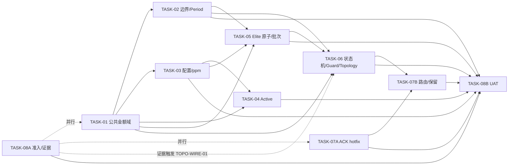

# Redemption PV Amount Migration 本轮修改方案 v1.2（主控总方案）

> 文档编号：`MODPLAN-PVAM_v1.2`  
> 受控代码基线：`l343765828/Redemption@3891f4b9c1f33df056e1334ed30e0ec3f2be1ad2`  
> 当前状态：`DRAFT`  
> 授权状态：`PENDING_ORGANIZATIONAL_APPROVAL`  
> 状态含义：本轮只完成技术文档修订；当前未提供可识别组织批准人、角色、签名或批准原文，不构成施工授权。

---

## 0A. 正式授权与受控链

- 授权状态：`PENDING_ORGANIZATIONAL_APPROVAL`；权威登记见 `05_CONTROL/AUTHORIZATION_STATUS-PVAM-v2.md`。历史 `APPROVAL-PVAM-20260805-01` 仅作 `UNVERIFIED/HISTORICAL_ONLY` 记录。
- 上游检查/复核：`PLAN-PVAM-v1.15`、`REPORT-PVAM-v1.5`。
- 受控代码基线：`3891f4b9c1f33df056e1334ed30e0ec3f2be1ad2`。
- 拟申请批准范围：R-001～R-013、GAP-PVAM-FLAG-CONTRACT 及 TASK-01、01C、02～08 的既定处置；不关闭 DEC-013、Gate C 或任何 UAT AC。

## 1. 文档控制

| 项目 | 内容 |
|---|---|
| 文档名称 | `Redemption PV Amount Migration 本轮修改方案 v1.2` |
| 文档编号 | `MODPLAN-PVAM_v1.2` |
| 文档版本 | `v1.2` |
| 当前状态 | `DRAFT` |
| 受控仓库 | `l343765828/Redemption` |
| 受控提交 | `3891f4b9c1f33df056e1334ed30e0ec3f2be1ad2` |
| 代码/SQL事实基线 | 与 `097cae32e0ff7708eb6ee69a7f2ce188e80c060c` 一致；两提交区间仅 Elite 规则 DOCX 变化 |
| 对应检查方案 | `Redemption_PV_Amount_Migration_d74_检查方案_v1.15.md` / `PLAN-PVAM-v1.15` |
| 对应复核报告 | `Redemption_PV_Amount_Migration_d74_复核报告_v1.5.md` |
| 权威登记册 | `PV_Amount_Migration_Checklist_Final_v2.25_d74.md`（附件副本名可能含 `(3)`，逻辑文档名以此为准） |
| 本轮审核意见 | `PLAN-PVAM修改方案套件_审核与核验报告_v1.0.md` |
| 七轮终局审计 | `全链路项目工程文档七轮终局审查与核验报告.md` |
| B7-01～B7-06 当前处置 | `00_B7-01-B7-06_真实性核验与反驳表.md` |
| S6-01～S6-06 前轮处置 | `06_HISTORY/00_S6-01-S6-06_真实性核验与反驳表.md`（`HISTORICAL_ONLY`） |
| 编制角色 | 高级技术架构师 / 研发负责人 |
| 编制日期 | `2026-08-04` |
| 审批人 | `待组织授权人签署` |
| 审批日期 | `待签署` |

### 1.1 编号与状态治理

1. `PLAN-PVAM-*` 保留给检查方案家族；本修改方案使用 `MODPLAN-PVAM-*`，避免同号异物。
2. 所有任务书状态与总方案一致为 `DRAFT`；只有取得可核验的组织批准人、角色、批准原文/签名、时间、范围和允许 Wave 后，才允许统一改为 `APPROVED`。
3. `DRAFT/APPROVED/SUPERSEDED` 是文档治理状态；实施状态使用 `NOT_STARTED、READY、IN_PROGRESS、DEV_VERIFIED、BLOCKED、ROLLED_BACK`；验证状态使用 `NOT_RUN、PASS、FAIL、PENDING_TEST_ENV、BLOCKED`。

### 1.2 基线裁决

1. R-001～R-013 是复核报告 v1.5 已独立确认的 13 项代码错误（P0×12、P1×1），本方案全部保留为 `ACCEPTED`。
2. RISK-001～002、UV-001～005 保留原证据等级，不因审核意见自动升级为代码缺陷或 PASS。
3. G2-01～G2-04 是复核报告登记/矩阵修正，不重复生成代码任务。
4. 有效 SQL 用于 Legacy parity；已批准 corrected 合同独立保留，二者不得静默互相覆盖。

### 1.3 版本记录补充

| 版本 | 日期 | 变更 | 治理状态 |
|---|---|---|---|
| v1.1 | 2026-08-05 | 历史全链路修订版；其自述批准记录因不可独立验证而由本版取代 | SUPERSEDED |
| v1.2 | 2026-08-05 | 第四轮关闭追溯、状态、patch/DEV、版本和设计边界问题 | DRAFT |
| v1.2-r8 | 2026-08-06 | 七轮 B7：registry 发布信任根、工件摘要、独立临时目录、AC 来源保真及当前轮次引用 | DRAFT |
| v1.2-r10 | 2026-08-08 | 登记 DEC-019/GAP-PVAM-FLAG-CONTRACT，新增 TASK-PVAM-01C，并条件化 TASK-PVAM-01 AC-02/03 与 WORK-01 路由 | DRAFT |

## 2. 本轮目标与边界

### 2.1 目标

本方案在原 8 个逻辑任务组之外新增独立 flag runtime 配置组 01C；TASK-07 仍拆为 07A/07B，因此实际交付 10 份施工任务书：

- 关闭 R-001～R-013 的设计缺口并给出可执行 AC；
- 金额域统一为 int64 micro-units、费率 ppm、最终奖金 integer cents；通过独立 01C 建立 Redis flag Provider、atomic bootstrap、run-freeze 与四态 admission；
- 只允许外部事件和 DB loader 两处放大；
- monthActivePV 使用唯一读取 getter，各消费方同源现算 Active；
- Elite stats/SOURCE/revision/outbox 原子化并输出外部发布 proof；
- 统一 epoch/state/guard，分离计算、批次就绪与正式发布；
- 先行修复未处理 ACK，再完成最终事件 schema、handler 与 ACK-aware retention；
- 建立固定环境、TC 映射、机器可读追踪和 UAT 证据闭环。

### 2.2 红线

1. 不修改无 R/CHK/P0/T0 证据的业务算法。
2. 不重新打开已 CLOSED DEC，也不把 DEC 关闭写成实现通过。
3. 不代替业务/财务/DBA/运维决定退款人工 override、迟到边界、生产 DDL、权限和主机。
4. 不把静态阅读、fixture 或 shadow 结果写成 UAT/生产 PASS。
5. 不允许 float/round(float)/Decimal(str(float)) 金额洗白。
6. PERIOD_NUM 不得由 YYYYMM 推导，首期不得硬编码 1。
7. Python 不新增未经 DEC-008 授权的 MariaDB 正式奖金 writer。
8. 不物化共享 Active 权威 snapshot；各消费方按统一规则现算。
9. 不把 `team_bonus_tb.py` oracle 冒充生产服务。
10. 不读取默认排除文件、废弃 SQL 或 `GraphService.run_bfs`。
11. 不以固定 MAXLEN、unknown ACK 或未审计 no-op 代替可靠性。
12. 不以 UAT fixture 冒充 DEC-004 2B 生产同步链。
13. 不以测试脚本引用证明 Topology 生产接线。

### 2.3 本轮不承担

- PB/SFB/GPB/CRB Python 算法；
- 新建生产 Team Bonus 服务；
- 业务系统 MariaDB 正式 writer/read switch；
- DEC-004 2B 的 AR_CONFIG→Delta→Redis 写入/失效 producer（本轮登记 `DEFERRED`）；
- 未签字退款人工政策；
- 与正确性/幂等/恢复无关的性能重构。

## 3. 统一技术合同

| 合同 | 唯一规则 |
|---|---|
| PV/BV/GPV/1L/2L/结余/奖金基数 | `int64 micro-units`，`PV_SCALE=1_000_000` |
| amount version | 只有进入获批 V2 domain 且全部共享字段满足 V2 合同的 record 才显式2；00/01共享-key Legacy record不写2；legacy/unknown只在V2 calculation entry阻断 |
| 费率 | 有符号整数 ppm，scale=1_000_000 |
| 最终奖金 | 内部 integer cents；外部两位 Decimal string |
| 放大边界 | 外部规范十进制字符串→units；DB Decimal/string→units |
| Active | 同一 UserStats.pv + 唯一 getter，各消费方现算；无共享权威 snapshot |
| monthActivePV 读取 | Redis→等待2秒→Redis→Delta→fail-loud |
| monthActivePV 写入 | `GAP-DEC004-2B / DEFERRED`；fixture 不等于生产链 |
| Period | AR_PERIOD resolver；退款批准时间经 GMT+8 映射 |
| Python 权威状态 | Redis；关键账本、状态和 outbox 同一权威提交 |
| 正式发布 | 业务系统负责正式读模型；Python 交付 batch/manifest/checksum/receipt 协议 |
| ACK | handler 后置条件或批准 audited no-op 完成后才 ACK |
| retention | 所有 group ACK 安全水位前不得裁剪；具备容量、告警和 durable replay |

## 4. DEC 绑定与实施边界

| DEC | 状态 | 本方案绑定 | 主要 TASK |
|---|---|---|---|
| DEC-001 | CLOSED | 负费率 signed ppm，不因负号阻断 | 03 |
| DEC-002 | CLOSED | 业务上限由上游保证；本仓做 int64 技术保护 | 01、03、08 |
| DEC-003 | CLOSED | EAB/LB 上游豁免与 SE exact raw 分离 | 03 |
| DEC-004 | CLOSED CONTRACT | 2A getter/现算由 T04；2B 写入侧 `DEFERRED`，未完成不得关闭 CHK-DATA-006/TC-007 | 04、08 |
| DEC-005 | CLOSED | 第二次整单冲销 duplicate/no-op | 02 |
| DEC-006 | CLOSED CORE | 批准时间/GMT+8/AR_PERIOD；迟到残余不代决 | 02、08 |
| DEC-007 | CLOSED | 本仓 epoch/freeze/drain；业务系统正式发布 | 06 |
| DEC-008 | CLOSED | Redis 权威；Python 不写正式 MariaDB 奖金表 | 05、06 |
| DEC-009 | CLOSED CONTRACT | DBA 最小 schema manifest 缺失即 BLOCKED | 08 |
| DEC-010 | CLOSED | 测试 checkpoint 豁免不关闭生产 Gate C，不豁免 ACK/trim/recovery | 06、07A、07B、08 |
| DEC-011 | CLOSED | 当前节点精确保存；仅对上输出变化才需继续传播，保守全传播可接受 | 05、08 |
| DEC-012 | CLOSED | T06 固定承接 `TOPO-WIRE-01`；T08 证据只决定执行分支 | 06、08 |
| DEC-013 | OPEN | UAT 环境/版本/权限/数据准入 | 08 |
| DEC-014 | CLOSED | Final v2.15 合同已提供 | 全部 |
| DEC-015 | CLOSED | 历史统计按“完全成立8、部分成立1” | 08 |
| DEC-016 | CLOSED | monthActivePV 重复取真实行一条；负/上限不二次业务阻断 | 04 |
| DEC-017 | CLOSED | 文档已修；不等于代码行为 PASS | 05、08 |
| DEC-018 | CLOSED | 无须物化 Active，各消费方同规则现算 | 04 |
| DEC-019 | CLOSED | AR_CONFIG Source of Truth、Redis唯一runtime Provider、MANUAL_BOOTSTRAP原子01、fail-loud/run-freeze/四态admission；WORK-01 AC/CHG条件化 | 01C、01 |

## 5. 问题处置与双向追踪矩阵

### 5.1 R-001～R-013

| 问题 | 级别 | 状态 | REM | W | V | 所属任务 | 本轮结果要求 |
|---|---:|---|---|---|---|---|---|
| R-001 amount version 缺失 | P0 | ACCEPTED | REM-001 | W-001 | V-001 | 01 | 获批V2 record写2；00/01共享Legacy不写2；V2入口隔离legacy/unknown |
| R-002 PvAmount 公共层缺失 | P1 | ACCEPTED | REM-002 | W-002 | V-002 | 01 | 唯一公共金额 API |
| R-003 float/round 链 | P0 | ACCEPTED | REM-003 | W-003 | V-003 | 02 | 生产金额整数化 |
| R-004 配置合同偏差 | P0 | ACCEPTED | REM-004 | W-004 | V-004 | 03 | signed ppm、snapshot、exact raw |
| R-005 PE 裸30 | P0 | ACCEPTED | REM-005 | W-005 | V-005 | 04 | 唯一 getter |
| R-006 外部 IS_ACTIVE 权威 | P0 | ACCEPTED | REM-006 | W-006 | V-006 | 04 | 消费方同源现算 |
| R-007 本地 period 算术 | P0 | ACCEPTED | REM-007 | W-007 | V-007 | 02 | AR_PERIOD resolver |
| R-008 Elite SOURCE 非原子 | P0 | ACCEPTED | REM-008 | W-008 | V-008 | 05 | stats/SOURCE/revision/outbox 同提交 |
| R-009 persisted=false 仍 DONE | P0 | ACCEPTED | REM-009 | W-009 | V-009 | 06 | 计算/ready/published 分层 |
| R-010 guard 分裂 | P0 | ACCEPTED | REM-010 | W-010 | V-010 | 06 | 单一 guard/epoch |
| R-011 Elite gate/writer proof | P0 | ACCEPTED | REM-011 | W-011 | V-011 | 05 | gate、manifest、receipt |
| R-012 未处理仍 ACK | P0 | ACCEPTED | REM-012A、REM-012B（父项 R-012） | W-012A、W-012B | V-012A、V-012B | 07A、07B | 先 fail-closed，再完成最终 handler/schema；机器清单保留 parent_issue=R-012 |
| R-013 ACK 前裁剪 | P0 | ACCEPTED | REM-013 | W-013 | V-013 | 07B | ACK-aware retention/replay |

### 5.2 RISK 与 UV

| 编号 | 级别 | 状态 | 子状态 | 所属任务 | 裁决 |
|---|---:|---|---|---|---|
| RISK-001 Topology 可达性 | P1 | UAT_VERIFY | BLOCKED_EXTERNAL_EVIDENCE | 08→触发06 | archive/部署/call graph 决定 T06 接线分支，不预先改写为缺陷 |
| RISK-002 原始测试证据缺失 | P1 | UAT_VERIFY | PENDING_RERUN_EVIDENCE | 08 | 固定镜像重跑 |
| UV-001 全链路环境 | P0 | UAT_VERIFY | PENDING_TEST_ENV | 08 | DEC-013 后执行 |
| UV-002 schema/DDL/SQL_MODE | P0 | UAT_VERIFY | BLOCKED_EXTERNAL_EVIDENCE | 08 | DBA manifest |
| UV-003 SQL-Python 同数据差分 | P0 | UAT_VERIFY | PENDING_TEST_ENV | 08 | 隔离 UAT |
| UV-004 ACK/PEL/trim/恢复 | P0 | UAT_VERIFY | PENDING_TEST_ENV | 08 | 真实中间件/故障注入 |
| UV-005 archive/全测/审计包 | P1 | UAT_VERIFY | BLOCKED_EXTERNAL_EVIDENCE | 08 | 精确归档和原始包 |

### 5.3 其他发现与派生缺口

| 编号 | 状态 | 所属任务 | 说明 |
|---|---|---|---|
| OPT-001 | ACCEPTED | 08 | pytest/unittest 收集包装，保留 CLI smoke |
| OPT-002 | ACCEPTED | 08 | 机器可读双向追踪 manifest |
| FIX-001 | N/A — CONFIRMED_CLOSED | 文档基线 | DEC-017 文档修复，不计当前缺陷 |
| GAP-DEC004-2B | DEFERRED | 08 | 本轮不建设写入/失效链；生产前必须另有施工任务 |
| GAP-PVAM-FLAG-CONTRACT | ACCEPTED | 01C | DEC-019 已裁决；独立 Provider/bootstrap/run admission 卡接线，禁止扩大 WORK-01 production allowlist |

### 5.4 五状态统计

- R/RISK/UV 强制范围：`ACCEPTED=13`、`UAT_VERIFY=7`、`REJECTED=0`、`DEFERRED=0`、`NEEDS_DECISION=0`。
- `GAP-DEC004-2B` 仍为 DEFERRED；`GAP-PVAM-FLAG-CONTRACT` 是 DEC-019 已接受的治理/实施缺口，均不改变复核报告 13+7 统计。
- FIX-001 为已关闭修复，不进入五状态统计。

## 6. 模块化任务拆分

| 任务 | 标题 | 主问题 | Gate | 独立交付边界 |
|---|---|---|---|---|
| 01 | 金额编码公共层与模型适配 | R-001/002 | A | API、version、legacy 隔离 |
| 01C | Flag runtime Provider 与原子配置 | GAP-PVAM-FLAG-CONTRACT | A | Redis snapshot、CAS bootstrap、run-freeze、00/01/10/11 admission |
| 02 | 订单/退款边界与 Period | R-003/007 | A/B/C | normalizer、resolver、无 float |
| 03 | 配置/ppm | R-004 | A/B | matrix、snapshot、signed ppm |
| 04 | monthActivePV/Active | R-005/006 | B | 读取 getter、消费方现算；2B 写入侧延期 |
| 05 | Elite SOURCE/Writer Proof | R-008/011 | A/B/C | Redis 原子账本、candidate/batch |
| 06 | 状态机/Guard/Topology 条件接线 | R-009/010、RISK-001 条件项 | C | epoch、guard、发布分层、TOPO-WIRE-01 |
| 07A | ACK 紧急修复 | R-012 子集 | C | 当前 payload 内 fail-closed，可先行 |
| 07B | 最终路由与 Stream 保留 | R-012/013 | C | schema、handler、retention/replay |
| 08 | 风险/UAT/证据治理 | RISK/UV、OPT、2B gap | A/B/C | 环境、TC、证据、追踪 |

## 7. 执行顺序与依赖拓扑

### 7.1 推荐 Wave

| Wave | 任务 | 说明 |
|---|---|---|
| 0 | 08A | archive、DDL、镜像、权限、fixture 准入 |
| 1 | 01、07A | 公共金额域与 ACK hotfix 并行；07A 不依赖金额/状态机 |
| 2 | 02、03 | 依赖 01，可并行 |
| 3 | 04 | 依赖 01/03；只做读取侧和 Active |
| 4 | 05 | 依赖 01/02/03 |
| 5 | 06 | 状态机、发布分层、Topology 条件接线 |
| 6 | 07B | 依赖 06 和 07A |
| 7 | 08B | 固定环境全量 UAT |

### 7.2 合并门禁

- 每个任务独立 PR、变更清单、测试报告和 rollback；07A/07B 独立开关。
- 后续任务不得复制前置公共函数。
- DEV AC 未满足不得进入相应 UAT。
- 08A 最小准入未完成，UAT 结果不得关闭问题。
- 2B fixture 只允许验证读取侧；不得据此关闭生产供给链。

## 8. P0/T0 承载摘要

| 主题 | TASK |
|---|---|
| P0-0/DEC-009 schema | 08 |
| P0-1/2A/3/7 金额、舍入、Period | 01、02、03、05、08 |
| P0-2B/3-TIME/4 退款与入口屏障 | 02、06、08 |
| P0-5A/5B/9 配置与 SE | 03、08 |
| P0-8/12 Elite | 05、06、08 |
| P0-10 Active | 04；2B gap 由 08 管理 |
| P0-11 事件身份/路由 | 02、06、07A、07B、08 |
| T0-2/6/16/21/28 状态、提交、恢复 | 05、06、07B、08 |
| T0-17/19 Active 输入 | 04、08 |
| T0-30 治理/审计 | 08 |

详细 T0-1～30 与 TC-000～032 映射以各任务 AC 和 T08 §8.3 为准；不得合并省略状态行。

## 9. AC 环境与 TC 纪律

1. 每个任务书 §9 使用 `AC / 验收标准 / 环境 / 关联 TC` 四列。
2. `DEV` 可在固定源码与隔离 fixture 关闭；`UAT` 依赖 DEC-013；`DEV+UAT` 两类证据均需存在。
3. UAT 不可用时，所有含 UAT 的 AC 只能 `PENDING_TEST_ENV` 或 `BLOCKED`。
4. TC-000 为 RETIRED；TC-001～032 必须逐项保留结果。
5. UAT-001～012 只是执行包分组，不能替代受控 TC 编号和通过标准。

## 10. 总体验收标准

### 10.1 DEV

- compile/AST/import graph 通过；公共层无反向依赖；
- production-reachable 金额无 float；version/ppm/period/Active/Elite/state/ACK mutation 有效；
- pytest/unittest 可收集且 CLI smoke 保留；
- 每任务提供命令、exit、stdout/stderr、文件清单、前后行为和 rollback 结果。

### 10.2 UAT

- commit/archive/image/schema/config/data 全有 checksum；
- MySQL/Redis/Kafka/Dask/RAPIDS/GPU/时区/权限完整；
- 同数据 SQL-Python 差分；
- 故障注入覆盖锁、进程、Redis/Kafka、重复/乱序、PEL、DLQ、trim、空批次、重跑；
- Topology 生产接线有部署+trace 证据；
- 2B 写入链未建设时明确 BLOCKED，不用 fixture 替代；
- 每个问题只在所属 AC/TC 证据齐全后关闭。

### 10.3 Gate

| Gate | 关闭条件 |
|---|---|
| A | units/version/边界/ppm/int64/period 通过；unknown/float mutation 被阻断 |
| B | 各奖金 oracle/corrected 同数据差分、Active/配置/2B供给条件满足 |
| C | epoch/guard/atomic outbox/publish proof/ACK/retention/recovery 通过；生产豁免有批准计划 |

任一 Gate OPEN/FAILED/BLOCKED/PENDING_TEST_ENV，整体仍为 `INCOMPLETE / NOT READY FOR PRODUCTION`。

## 11. 通用回滚原则

1. 独立 feature flag/schema/event version；additive-first。
2. v2 units 禁止降格写回 legacy；保留新字段/键审计。
3. 07A 回滚不得恢复 unknown/ghost 自动 ACK；必要时停消费并保留 PEL。
4. 07B retention 默认 dry-run；IN_DOUBT/ghost 未关闭禁止 trim。
5. 状态失败进入 FAILED/IN_DOUBT，不删除键伪装 OPEN。
6. 外部发布失败继续服务上一 committed 版本。
7. 回滚证据含操作者、时间、原因、period/run/epoch、前后 checksum。

## 12. 交付物清单

| 文件 | 作用 |
|---|---|
| `00_B7-01-B7-06_真实性核验与反驳表.md` | 当前七轮审计意见的本轮独立裁决 |
| `全链路项目工程文档七轮终局审查与核验报告.md` | 当前审计来源；随顶层包归档 |
| `00_S6-01-S6-06_真实性核验与反驳表.md` | `HISTORICAL_ONLY`；前轮处置来源 |
| `00_F1-F7_审核意见核验与反驳表.md` | `HISTORICAL_ONLY`；不属于当前包，不参与活动门禁 |
| `MODPLAN-PVAM_v1.2_总方案.md` | 主索引、范围、DEC、追踪、依赖、总验收 |
| `TASK-PVAM-01_金额编码公共层与基础模型适配器.md` | R-001/002 |
| `TASK-PVAM-01C_Flag_Runtime_Contract与Redis原子配置.md` | GAP-PVAM-FLAG-CONTRACT / DEC-019 |
| `TASK-PVAM-02_订单退款入口金额放大与边界转换.md` | R-003/007 |
| `TASK-PVAM-03_配置解析ppm与硬编码清理.md` | R-004 |
| `TASK-PVAM-04_monthActivePV与Active同源现算.md` | R-005/006；2B读取侧/延期边界 |
| `TASK-PVAM-05_Elite_SOURCE原子性与Writer_Proof.md` | R-008/011 |
| `TASK-PVAM-06_全量重算状态机发布分层与统一Guard.md` | R-009/010；TOPO-WIRE-01 |
| `TASK-PVAM-07A_Consumer_ACK紧急修复.md` | R-012 hotfix |
| `TASK-PVAM-07B_事件路由与Stream保留.md` | R-012 final/R-013 |
| `TASK-PVAM-08_风险延期与UAT准入证据包.md` | RISK/UV/OPT/2B gap |
| `MODPLAN-PVAM_v1.2_完整套件全文.md` | 按要求合并的完整 Markdown 全文 |
| `SHA256SUMS.txt` | 完整性清单 |

## 13. 审批与授权状态

本文件当前治理状态为 `DRAFT`，授权状态为 `PENDING_ORGANIZATIONAL_APPROVAL`。DEC-019 是 CURRENT_CONTRACT 的业务/架构裁决；它授权本轮按 Phase G→I→D 施工与 DEV 验证，但不代替可识别组织批准、真实 UAT、部署或生产发布授权。

升格为 `APPROVED` 前必须提供并归档：

1. 可识别批准人姓名、组织角色与权限范围；
2. 不可抵赖的批准原文、签名或受控审批系统记录；
3. 批准时间、适用基线、批准的 TASK/WORK/Wave；
4. 保留的 `BLOCKED/DEFERRED/PENDING_TEST_ENV` 项、责任人和截止时间；
5. 明确声明文档批准不等于代码、DEV、UAT、部署或 Gate C 通过。

上述证据缺失时，所有 TASK/WORK 均保持 `DRAFT/BLOCKED`；不得使用历史 `APPROVED_BY_USER_INSTRUCTION` 记录代签。
