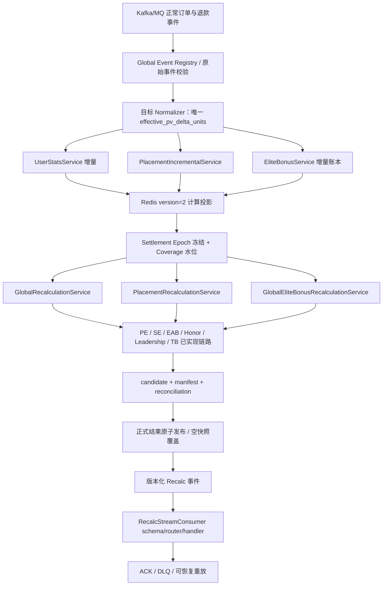
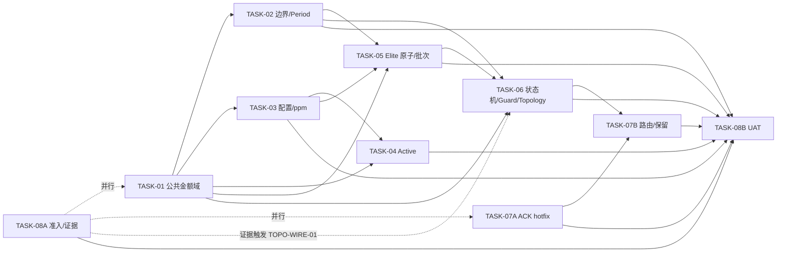

# PVAM 全链路第八轮终局审计整改全文

> 本文件为归档阅读副本；单文件、JSON、校验器、清单与 ZIP 仍以包内对应路径为受控事实源。


---

## `00_B7-01-B7-06_真实性核验与反驳表.md`

# B7-01～B7-06 七轮审计意见真实性核验与反驳表

| 字段 | 内容 |
|---|---|
| 处置编号 | `DISPOSITION-PVAM-B7-v1` |
| 审计来源 | 《全链路项目工程文档七轮终局审查与核验报告》 |
| 受控代码基线 | `2475c6c49e60089b28f8ef1c0b75e86b2ceb6ebb` |
| 文档状态 | `DRAFT` |
| 组织授权 | `PENDING_ORGANIZATIONAL_APPROVAL` |
| 代码结论 | `REJECTED` |
| UAT / Gate C | `PENDING_TEST_ENV / OPEN` |

## 核验与处置

| 编号 | 核验结论 | 事实依据 | 定点修补 |
|---|---|---|---|
| B7-01 注册表信任根与四类工件摘要 | **正确／应采纳** | 旧 `validate_parent_provenance.py` 接受调用方自报 registry 路径；只校验摘要格式，不读取 patch、scope、parent provenance、approval record。伪造同名 registry 可被放行。 | registry 升级 schema v2；校验器从自身发布包推导 canonical path，并同时核验根 `DOCUMENT_MANIFEST.json` 与 `VERSION_REFERENCE_MANIFEST.json` 中的 registry SHA；APPROVED 条目必须提供四类工件路径，逐文件重算 SHA-256。 |
| B7-02 独立自测临时目录预检 | **正确／应采纳** | 旧 `selftest_traceability_v3.sh` 直接使用 `${TMPDIR:-/tmp}`，无 `/tmp` 时独立失败。 | 所有活动 `selftest_*.sh` 在任何 `mktemp` 前加载 `ensure_temp_root.sh` 并选择包外可写临时根；独立入口与统一入口均执行负例。 |
| B7-03 WORK-01 AC-06 来源文本保真 | **正确／应采纳** | TASK 原文不含 `sNaN/±Infinity`；WORK 将扩展断言写入来源 AC 栏，导致 100 条来源 AC 非逐字一致。 | WORK 来源栏恢复 TASK 原文；扩展输入放入“AC-06 实施细化／派生测试”小节。治理校验器新增 TASK→WORK 100 条 AC 文本集合差。 |
| B7-04 当前轮次与版本引用 | **正确／应采纳** | MODPLAN、WORK 总方案及旧版本校验器仍把 F5／第六轮写成当前输入，且标题仍有 `Traceability Manifest v2`。 | 当前受控来源登记为 S6 处置表、七轮终局审计报告及本 B7 处置表；F5 降为 `HISTORICAL_ONLY`。版本 manifest 升级 schema v5，校验当前输入、v3 标题、r8 修订记录及 registry 信任根。 |
| B7-05 组织授权状态 | **正确／应采纳** | 当前无可识别批准人、角色、签名、范围和允许 Wave。 | 保持 `DRAFT / PENDING_ORGANIZATIONAL_APPROVAL / BLOCKED`；技术修订不得代签。 |
| B7-06 真实代码、测试及回滚证据 | **正确／应采纳** | 当前没有真实 WORK commit/patch、DEV/UAT 日志或签署回滚演练。 | 保持代码 `REJECTED`、验证 `PENDING_TEST_ENV`、Gate C `OPEN`；合成控制自测不得冒充真实实施证据。 |

## 结论

B7-01～B7-06 均成立。本轮关闭 B7-01～B7-04 的包内技术缺陷；B7-05、B7-06 是外部授权与后续运行门禁，继续保持未关闭状态。


---

## `01_PLAN/Redemption_PV_Amount_Migration_d74_检查方案_v1.15.md`

# Redemption 项目检查方案（PV Amount Migration · 2475c6c4 基线）

> 使用说明：本方案用于定义“检查什么、依据什么检查、怎样判定通过”。  
> 本文档处于方案阶段，不填写实际缺陷结论；`PV_Amount_Migration_v2.15_第八次复核_d74基线_完整修正版_v34.md` 中的历史结论和疑似缺陷仅转换为待独立执行的检查项。  
> 本方案发布后，执行阶段不得回改检查标准；执行中发现方案未覆盖的问题，应在复核报告中归入“潜在风险 / 后续处置建议”。

---

## 1. 文档控制

| 项目 | 内容 |
|---|---|
| 文档名称 | `Redemption PV Amount Migration（2475c6c4 基线）检查方案` |
| 文档编号 | `PLAN-PVAM-v1.15` |
| 文档版本 | `v1.15` |
| 当前状态 | `DRAFT` |
| 待检查对象 | `l343765828/Redemption master@2475c6c49e60089b28f8ef1c0b75e86b2ceb6ebb` 及本方案第 3.3 节审查材料；`d74cfb77c496e3a1564255f758dba80fa8644e33` 仅作为历史基线对照 |
| 项目仓库 | `https://github.com/l343765828/Redemption.git` |
| 基线分支 | `master` |
| 基线提交 | `2475c6c49e60089b28f8ef1c0b75e86b2ceb6ebb` |
| 编制人 | `AI Agent（方案编制角色）` |
| 复核人 | `AI Agent（全链路审计修订角色）` |
| 编制日期 | `2026-07-29` |
| 对应复核报告 | `REPORT-PVAM-v1.5` / `Redemption_PV_Amount_Migration_d74_复核报告_v1.5.md` |

### 1.0A 当前授权与基线迁移

- 授权状态：`PENDING_ORGANIZATIONAL_APPROVAL`；当前指令仅授权文档复核与修订，不构成组织施工批准。
- 当前唯一代码/SQL事实基线：`2475c6c49e60089b28f8ef1c0b75e86b2ceb6ebb`。
- `097cae32`仅作为历史基线标识；其到当前基线的Python/SQL树无差异，不能继续作为活动证据ref。
- 本方案与`REPORT-PVAM-v1.5`、`MODPLAN-PVAM_v1.2`、`WORK-PLAN-PVAM_v1.3`共同构成统一受控链。

### 1.0B 治理授权边界

- 当前没有可识别组织批准人、角色、签名或不可抵赖批准原文。
- 因此本方案治理状态为 `DRAFT`，施工授权为 `PENDING_ORGANIZATIONAL_APPROVAL`。
- 只有完成 `05_CONTROL/AUTHORIZATION_STATUS-PVAM-v2.md` 所列签署字段后，才可另行升格文档状态；本次修订不得代签。

### 1.1 版本记录

| 版本 | 日期 | 修改人 | 变更内容 | 审批状态 |
|---|---|---|---|---|
| v1.1 | `2026-07-28` | `AI Agent（方案编制角色）` | 合并两份候选方案，固定 d74 基线并收敛检查范围 | `DRAFT` |
| v1.2 | `2026-07-29` | `AI Agent（方案编制角色）` | 依据 `PV_Amount_Migration_检查方案_审查意见_v2.0.md` 定向修订并将历史基线提升至 097cae32（HISTORICAL_ONLY） | `DRAFT` |
| v1.3 | `2026-07-29` | `AI Agent（方案编制角色）` | 依据 `PV_Amount_Migration_检查方案_审查意见_v3.0.md` 修订 CHK-TEST-001 期间夹具处置表标签 | `DRAFT` |
| v1.4 | `2026-07-30` | `用户（业务决策）/ AI Agent（落版）` | 依据用户对 §17 的业务决策关闭 DEC-001、DEC-002、DEC-003、DEC-005、DEC-014，并联动更新预期规则 | `DRAFT` |
| v1.5 | `2026-07-31` | `用户（业务决策）/ AI Agent（落版）` | 依据用户对 DEC-004 与 DEC-011 的业务裁决定向修订，并新增 DEC-016、DEC-017 | `DRAFT` |
| v1.6 | `2026-07-31` | `用户（业务决策）/ AI Agent（落版）` | 依据用户对 §17 的业务决策关闭 DEC-006、DEC-015，并联动更新预期规则 | `DRAFT` |
| v1.7 | `2026-08-01` | `用户（业务决策）/ AI Agent（落版）` | 依据用户对 DEC-007 的业务决策关闭该项，并收窄 CHK-PUB-002/TC-030 为迁移保真度检查 | `DRAFT` |
| v1.8 | `2026-08-01` | `用户（业务决策）/ AI Agent（落版）` | 依据用户对 DEC-008 的业务决策关闭该项（权威存储为 Redis、两表同事务契约转移至业务系统），并收窄 CHK-EVT-005/CHK-PUB-001 及 TC-026/TC-029 | `DRAFT` |
| v1.9 | `2026-08-01` | `用户（业务决策）/ AI Agent（落版）` | 依据用户对 DEC-016 的业务决策关闭该项（负值/超范围由前一业务系统校验；配置行重复时取值函数只取一行），并同步更新 CHK-DATA-006/TC-007 对应判据 | `DRAFT` |
| v1.10 | `2026-08-01` | `用户（业务决策）/ AI Agent（落版）` | 依据用户对 §17 的业务决策关闭 DEC-009、DEC-010，并联动固化最小 schema manifest 范围与“测试阶段豁免、生产 Gate C 保持 OPEN”规则 | `DRAFT` |
| v1.11 | `2026-08-02` | `用户（文档修订）/ AI Agent（落版）` | 依据用户对 DEC-017 的确认（Elite 说明文档已按 DEC-011 完成修订），关闭该项 | `DRAFT` |
| v1.12 | `2026-08-02` | `用户（业务决策）/ AI Agent（落版）` | 依据 RV8-G-01 登记 DEC-018；依据用户对 RV8-G-02 的业务决策收窄 DEC-007/CHK-PUB-002；依据用户业务决策关闭 DEC-012（选 A）；依据 RV8-B1-02/RV8-A-02 完成批量文档整理 | `DRAFT` |
| v1.13 | `2026-08-02` | `用户（业务决策）/ AI Agent（落版）` | 依据用户对 §17 的业务决策关闭 DEC-018，并联动固化活跃结果“无须物化、各消费方按同一派生规则各自现算”的唯一预期行为 | `DRAFT` |
| v1.14 | `2026-08-05` | `用户会话指令 / AI Agent（落版）` | 历史版本：统一受控基线至 `2475c6c4`；后因授权证据不可独立验证而被 v1.15 取代 | `SUPERSEDED` |
| v1.15 | `2026-08-05` | `AI Agent（第四轮文档修订）` | 关闭 F3-01～F3-10 文档内缺陷：八级追溯、治理状态、patch/DEV 门禁、状态枚举、版本引用及设计边界 | `DRAFT` |

本版本变更对照表：

| 编号 | 修订位置 |
|---|---|
| RV-C-01 | §4.4 EX-005、§8/§9 CHK-DATA-004、CHK-BIZ-004、§11 TC-004/TC-013 |
| RV-G-01 | §9 CHK-PUB-001 依赖项 |
| RV-B1-01 | §3.3 BL-015、§17 DEC-014 |
| RV-C-02 | §8/§9 CHK-TEST-004、§15 |
| RV-D-01 | §8/§9 CHK-TEST-004、§15 |
| RV-G-05 | §8/§9 CHK-GOV-001、§11 TC-000、§15.1 |
| RV-A-04 | §11 TC-013 |
| RV-B1-02 | §3.3 BL-006 |
| RV-B1-04 | §3.3 BL-009 |
| RV-B2-01 | §2.3、§4.4 EX-004 |
| RV-D-02 | §8/§9 CHK-BIZ-001、§11 TC-009 |
| RV-D-04 | §8/§9 CHK-TEST-001 及其期间夹具处置表 |
| RV-G-02 | §8 CHK-DATA-002、CHK-TEST-001 |
| RV-G-03 | §3.3 BL-011 及 BL-011 SQL 证据登记表 |
| 基线提升 | 标题、§1、§1.1、§2.1、§3.3、§5.1、§8/§9 CHK-ARCH-001、CHK-GOV-001 |
| 勘误表#2 | §17 DEC-015 |
| USER-DECISION DEC-001 | §8/§9 CHK-DATA-004、§8/§9 CHK-BIZ-004、§8/§9 CHK-BIZ-008、§11 TC-004/TC-013、§17 DEC-001 |
| USER-DECISION DEC-002 | §8/§9 CHK-DATA-004、§8/§9 CHK-DATA-007、§11 TC-004/TC-008、§17 DEC-002 |
| USER-DECISION DEC-003 | §8/§9 CHK-DATA-004、§8/§9 CHK-BIZ-008、§8/§9 CHK-BIZ-011、§11 TC-005、§17 DEC-003 |
| USER-DECISION DEC-005 | §8/§9 CHK-EVT-001、§11 TC-022、§17 DEC-005 |
| USER-DECISION DEC-014 | §3.3 BL-015、§15.1、§17 DEC-014 |
| USER-DECISION DEC-004 | §8/§9 CHK-DATA-006、§11 TC-007、§17 DEC-004、§17 DEC-016（新增）、CHK-TEST-004（T0-17/T0-19 判据） |
| USER-DECISION DEC-011 | §8/§9 CHK-BIZ-001、§11 TC-009、§17 DEC-011、§17 DEC-017（新增）、CHK-TEST-004（T0-10 判据） |
| USER-DECISION DEC-006 | §8/§9 CHK-DATA-005、§8/§9 CHK-EVT-001、§11 TC-006/TC-022、§17 DEC-006 |
| USER-DECISION DEC-015 | §3.3 BL-005、§17 DEC-015、文末联动歧义说明（解除并删除） |
| USER-DECISION DEC-007 | §8/§9 CHK-PUB-002、§11 TC-030、§17 DEC-007 |
| USER-DECISION DEC-008 | §8/§9 CHK-EVT-005、§8/§9 CHK-PUB-001、§11 TC-026/TC-029、§17 DEC-008 |
| USER-DECISION DEC-016 | §8/§9 CHK-DATA-006、§11 TC-007、§17 DEC-016 |
| USER-DECISION DEC-009 | §3.3 BL-014、§4.3 S-015、§5.1、§8/§9 CHK-ARCH-001/CHK-DATA-007/CHK-BIZ-009/CHK-PUB-001/CHK-TEST-004、§11.1、§13～§14、§17 DEC-009 |
| USER-DECISION DEC-010 | §5.2、§6 MAP-011、§8/§9 CHK-EVT-002/CHK-EVT-005/CHK-TEST-003/CHK-TEST-004、§11 TC-023/TC-026/TC-032、§12.3、§14、§17 DEC-010 |
| USER-DECISION DEC-017 | §17 DEC-017 |
| RV8-G-01（登记，非业务决策） | §17 DEC-018、§9 CHK-DATA-006、§9 CHK-TEST-004 |
| USER-DECISION DEC-007（收窄） | §17 DEC-007、§9 CHK-PUB-002 |
| USER-DECISION DEC-012 | §17 DEC-012、§8/§9 CHK-ARCH-002、§8/§9 CHK-BIZ-002 |
| USER-DECISION DEC-018 | 编号引用：§1.1、§9 CHK-DATA-006、§9 CHK-BIZ-004/007/008/009/011、§9 CHK-TEST-004、§17 DEC-018；散文引用：§6 MAP-006/007/008/010、§8 CHK-DATA-006、CHK-BIZ-004/007/008/009/011、CHK-TEST-002、§9 CHK-DATA-006、CHK-BIZ-004/007/008/009/011、CHK-TEST-004、§11 TC-007 |

---

## 2. 检查目标

### 2.1 背景

Redemption 是以 Kafka/MQ、Redis、Dask/RAPIDS、MySQL/MariaDB 和推荐网/安置网为基础的月度奖金计算项目。当前专项拟将 PV/BV/GPV、左右区业绩、结余和奖金基数统一迁移到 `int64 micro-units`，同时保持有效 SQL 的 Legacy 结果或有明确来源的 corrected 决议，并补齐事件身份、结算屏障、正式发布、幂等和恢复能力。本轮以 `2475c6c49e60089b28f8ef1c0b75e86b2ceb6ebb` 为代码、SQL、治理、Skill 和 `Doc/奖金制度.md` 唯一固定基线；历史链路中 d74cfb77 到 097cae32 的唯一差异为新增该业务文档；097cae32 到 2475c6c4 仅修改 Elite 规则 DOCX，Python/SQL不变，Python、SQL、治理及配置内容不变。两份候选检查方案中的范围、断言和验收标准已经按第 15.1 节形成编制记录：可由材料证明的内容进入正式检查项，未经执行即写成“缺陷已确认、Gate 已失败、测试已通过”的内容不得继承为方案结论。预期交付物仅为本检查方案。

### 2.2 核心目标

本轮检查需要回答：

1. `当前 Python 实现、有效 SQL、项目文档、项目 Skill 和奖金制度.md 之间的业务口径是否可追溯且一致；Legacy parity 与 approved corrected 是否被明确分层。`
2. `PV Amount Migration 是否覆盖全部真实入口、金额模型、增量/全量服务、已实现奖金服务、配置、Active、Period、writer 和输出边界，且不存在单位混用、float 链、版本混算或溢出。`
3. `订单/退款事件、Normalizer、Epoch、Coverage、outbox、checkpoint、Recalc consumer、正式发布和恢复是否具备幂等、原子、可审计、可重放和 fail-loud 能力。`
4. `DEV 静态/单元验证与 UAT 真实依赖验证是否能通过固定检查项、回传包和证据索引形成 Loop Engineering 闭环。`

### 2.3 非目标

本轮明确不处理：

- `PB、SFB、GPB、CRB 的 Python 奖金算法正确性；当前无对应 Python 生产实现，用户明确排除。`
- `未经用户或业务/财务/架构裁决的规则变化；开放政策只能登记为 DEC 项或 NEEDS_DECISION。`
- `仅属于性能优化且不影响正确性、可完成性、幂等、资源安全或恢复能力的事项。`
- `本次不修改代码、SQL、Skill、需求文档或生产数据，不生成复核报告、施工方案或其他阶段文档。`
- `附录 B 的排除集合仅为 PB（Performance Bonus）、SFB（Stockist Fees）、GPB（Global Pool Bonus）、CRB（Car/Room Bonus）；不得扩展为未获来源依据的其他奖金类型。`
- `两份候选方案中预先写入的缺陷状态、Gate 状态、行号和执行结果不作为本方案阶段的事实；只能转化为待执行检查项。`

---

## 3. 权威基线与冲突裁决

### 3.1 指令优先级

发生冲突时按以下顺序处理：

1. 用户针对本轮任务的明确要求；
2. 项目根目录 `AGENTS.md`；
3. 当前任务适用且已成功加载的项目 Skill；
4. 用户指定的权威 SQL、需求、代码或文档；
5. 其他项目材料；
6. 通用工程经验。

### 3.2 默认业务规则优先级

若用户未对本轮另行指定，以以下顺序确认业务规则：

1. `PLAN-PVAM-v1.15` 的检查判据和其中已关闭的 `DEC-*`；
2. 已批准的专项规格、MODPLAN/TASK合同及可追溯的 corrected 决议；
3. 当前有效的 `sql_uat/` 生产结算 SQL——仅在不存在已关闭DEC/corrected裁决时作为Legacy行为oracle；
4. `奖金制度.md`；
5. 当前 Python 实现；
6. 测试代码和历史评审材料。

说明：

- 已有正式决策改变业务口径时，以已关闭DEC/批准的corrected合同为准，不得用Legacy SQL反向覆盖。
- Python 与有效 SQL 冲突且不存在DEC/corrected裁决时，默认判定为 Python 实现偏差。
- 有效 SQL 之间存在实质冲突且无既有DEC可裁决时，状态应为 `NEEDS_DECISION`，不得静默选择。
- `LEGACY_PARITY` 与 `CORRECTED_APPROVED` 可同时登记，但双标签仅服务于差分、回放和审计，不替代裁决顺序。

### 3.3 本轮基线清单
| 基线编号 | 类型 | 文件/对象 | 版本或提交 | 权威范围 | 是否成功读取 | 备注 |
|---|---|---|---|---|---|---|
| BL-001 | 用户指令 | 本轮消息中的方案约束 | 2026-07-28 | 唯一交付物、模板 schema、范围及阶段边界 | YES | 本方案最高优先级 |
| BL-002 | 治理 | `AGENTS.md` | 2475c6c49e60089b28f8ef1c0b75e86b2ceb6ebb / blob `57cd62a7` | 证据、优先级、Skill、正式审查流程 | YES | 与 d74 历史基线内容一致 |
| BL-003 | 项目 Skill | `.claude/skills/redemption-file-filter/SKILL.md` | 2475c6c49e60089b28f8ef1c0b75e86b2ceb6ebb / blob `604886c2` | 文件过滤与业务查证顺序 | YES | 已成功读取 |
| BL-004 | 项目 Skill | `.claude/skills/redemption-sql-doc-map/SKILL.md` | 2475c6c49e60089b28f8ef1c0b75e86b2ceb6ebb / blob `29d66be2` | SQL/文档/Python 路由 | YES | 已成功读取 |
| BL-005 | 复核材料 | `PV_Amount_Migration_v2.15_第八次复核_d74基线_完整修正版_v34.md` | v34 | 当前合同编译视图、overlay、开放政策、历史意见和待验收项 | YES | 仅作为检查项和依据来源；不继承其历史结论；其历史意见统计按 DEC-015 固定为“完全成立8、部分成立1”，各条意见仍须逐项核验证据 |
| BL-006 | 专项清单 | `PV_Amount_Migration_Checklist_Final_v2.25_d74.md` | Final v2.25-d74 | 基础合同、Gate、P0/T0、模块范围 | YES | 与 BL-005 组合使用 |
| BL-007 | 业务文档 | 仓库内 `Doc/奖金制度.md` | EKPlan20250324 / 2475c6c49e60089b28f8ef1c0b75e86b2ceb6ebb | 资格、比例、Active、周期、大区等业务意图补充 | YES | 粗糙业务文档；不单独定义 Epoch、manifest、checkpoint 等技术合同 |
| BL-008 | 候选方案 | `Redemption_PV_Amount_Migration_检查方案_v1.0.md` | v1.0 | 候选范围、检查项和 Loop 闭环设计 | YES | 作为比较输入，不自动成为权威标准 |
| BL-009 | 候选方案 | `PV_Amount_Migration_d74_检查方案_v1.0_other.md` | v1.0 | 候选范围、文件定位和验收细化 | YES | 作为比较输入；候选断言按第 15.1 节逐条登记后决定保留、转检查项或删除 |
| BL-010 | SQL | `sql_uat/CALC_PV.sql`、`CALC_BE_E.sql`、`CALC_BE_PE.sql`、`CALC_BE_SE_COUNTRY.sql`、`CALC_BE_EAB.sql`、`CALC_BE_TB.sql` | 2475c6c49e60089b28f8ef1c0b75e86b2ceb6ebb | PV、Elite、PE、SE、EAB 及 TB Legacy oracle | YES | 执行阶段仍须从固定 commit 完整读取并记录 blob/SHA |
| BL-011 | SQL | `CALC_LV_ELITE.sql`、Honor/LB、编排、状态、汇总和发布相关有效 SQL | 2475c6c49e60089b28f8ef1c0b75e86b2ceb6ebb | rank、Honor、Leadership、Period、执行顺序和结果表写入 | YES | 已逐文件读取；rank 0/10/20/30、Honor 12期窗口与2/3次门槛、只升不降、LB双闸门及编排/状态/汇总规则支持§8/§9预期；blob见下表 |
| BL-012 | Python | 第 4.3 节列出的当前实现模块 | 2475c6c49e60089b28f8ef1c0b75e86b2ceb6ebb | 当前实现事实、生产可达性和差异定位 | NO | 方案阶段只固定范围；执行阶段须从 2475c6c4 完整读取 |
| BL-013 | 需求文档 | Skill 映射的 `Doc/` 需求与技术文档 | 2475c6c49e60089b28f8ef1c0b75e86b2ceb6ebb | SQL 解释、历史设计和业务上下文 | 部分 | 阶段 1 按映射逐份读取并验证是否过时；其中 `Doc/CALC_BE_E_需求分析_修订建议版.md` 已读取并用作 CHK-PUB-002 证据（见该项现状定性引用），其余映射需求文档待读 |
| BL-014 | Schema/配置 | `sql/AR_CONFIG.sql`、经 DBA/架构批准的最小 schema manifest、SQL_MODE、Redis/Stream 配置 | 2475c6c49e60089b28f8ef1c0b75e86b2ceb6ebb + 生产/UAT 批准清单待提供 | 覆盖本仓库全部生产可达输入、Redis 权威状态、事件/outbox 接口、有效 SQL oracle 所涉表，以及验证 amount version、金额字段类型与单位、主键/唯一键、数据库 assignment 和发布证明所必需的关系库对象 | NO | 依 DEC-009 采用批准的最小清单；清单须记录生产/UAT 环境、数据库版本、全局及会话 SQL_MODE、DDL 导出时间、对象版本和 SHA-256；清单外对象须有“不影响本专项”的调用链证据；任何必需对象缺失时，对应检查项标记 `BLOCKED` |
| BL-015 | 继承合同原文 | `PV_Amount_Migration_Checklist_Final_v2.15.md` | Final v2.15 | Epoch、coverage、ledger、amount version 等未被 v2.25 覆盖的继承技术条款 | YES | 用户已提供原文副本并成功读取；SHA-256 `c2f52559e4793674de5ed8616facf1f77a260287281f2b2f98d911808e1a2754`；不再因原文缺失将相关继承条款降级为 `UNVERIFIABLE`。实际交付件名为 `PV_Amount_Migration_Checklist_Final_v2.15.md`；本行使用真实文件名，不再维护下划线别名 |

#### BL-011 SQL 证据登记表

| 范围 | 有效 SQL | 2475c6c4 blob SHA |
|---|---|---|
| Elite / rank | `sql_uat/CALC_LV_ELITE.sql` | `45f874573026652bfc1c4ab3a2180573e781db4f` |
| Elite 历史最高 | `sql_uat/CALC_LV_ELITE_HIGHEST.sql` | `2227a913c84f36b993f0ee810ef923f3fd4d8271` |
| Honor 当期 | `sql_uat/CALC_LV_HONOR_LAST.sql` | `4cf7bdd6c7eb344416f57b5634ef8eaed93a7da4` |
| Honor 历史最高 | `sql_uat/CALC_LV_HONOR_HIGH.sql` | `386792f2c1ba6e995958c41e9112003dfb119dd6` |
| Leadership | `sql_uat/CALC_BE_LB_COUNTRY.sql` | `6c1f8749b43cd1380ca07bfde5f9913596ac99a8` |
| 自动调度 | `sql_uat/AUTO_CALC_BONUS.sql` | `5b486a3e4a3ddf5ff9bd84dc91c86e37d1881b25` |
| 主编排 | `sql_uat/CALC_BONUS.sql` | `71dc60991efe06014e3df455ad098fd5a056202a` |
| 前置检查 | `sql_uat/CALC_CHECK.sql` | `ca29016c73762949150f6248709300e9b3108ddd` |
| 周期状态 | `sql_uat/CALC_PERIOD_STATUS.sql` | `7d538615eec6d0ce2483f05de0e8693642f9e9ac` |
| 奖金汇总 | `sql_uat/CALC_BE.sql` | `ab406beca859dd5a9a030b62497c94b78e54d39e` |
| 不发奖明细 | `sql_uat/CALC_INACTIVE_DETAILS.sql` | `2e1d17ad32bfda01d182166ac9f02835cb40d8c9` |
| 结算备份 | `sql_uat/CALC_BACKUP.sql` | `7f4c1e9a9230c50f81a22d2178f3641dfb30da41` |
| 大区备份 | `sql_uat/CALC_BACKUP_COUNTRY_SHARE.sql` | `e9da72b3b13d5801f85fc8aef40cbde0b22bde32` |
| 大区分摊 | `sql_uat/CALC_COUNTRY_SHARE.sql` | `a585ef859638a140e777117a3add1f78d1fed0d8` |
| LB 大区分摊 | `sql_uat/CALC_COUNTRY_SHARE_LB.sql` | `a910e2ab26ef7a59f37037112be7fa4774309de7` |
| 网络层数初始化 | `sql_uat/CALC_BE_NET.sql` | `c078ea2723dd59745ec7d312dc1d9a47131b111b` |
| 结算数据初始化 | `sql_uat/CALC_BE_REM_DATA.sql` | `f8b20f382a7946532984bdf099d88873d412a459` |
| 生效/续约 | `sql_uat/CALC_EFFECT.sql` | `11d27932af918c89c55c9c85be135cd141dc50b9` |

---

## 4. 文件范围与过滤规则

### 4.1 必须加载的项目规则

| 规则 | 适用条件 | 本轮是否需要 | 加载结果 |
|---|---|---|---|
| `redemption-file-filter` | 文件扫描、代码/SQL/迁移/交付物检查 | `YES` | `LOADED` |
| `redemption-sql-doc-map` | SQL、文档与 Python 对齐或映射 | `YES` | `LOADED` |

若后续执行环境无法读取当前 commit 中的 Skill，相关检查项状态必须设为 `BLOCKED`，并记录缺失路径、未生效规则和影响；不得用本方案转述替代实际 Skill 内容。

### 4.2 默认排除范围

在项目 Skill 未规定例外、且用户未明确要求检查时，默认排除：

- 文件名包含英文 `_bak`、`_bakN` 或 `_final` 的文件；
- `redemption-file-filter` 明确列出的旧版、副本或废弃 SQL；
- `GraphService.run_bfs` 演示逻辑；
- 构建产物、缓存、虚拟环境及无关临时文件；
- 与本轮专项无调用关系、无数据关系的模块。

排除文件不得作为当前生产逻辑、业务规则或当前版本缺陷的证据。

### 4.3 纳入检查范围
| 范围编号 | 模块/目录 | 文件或对象 | 纳入原因 | 检查深度 |
|---|---|---|---|---|
| S-001 | 治理与规则 | 固定提交、`AGENTS.md`、两个项目 Skill、两份候选检查方案 | 固定优先级、过滤规则、SQL/文档路由，并核验候选方案是否把结论写入方案 | FULL |
| S-002 | 公共金额域 | 目标 `Common/PvAmount.py`、`Until/Common.py`、金额入口适配器 | 核对 micro-units、integer cents、ppm、两处放大边界和禁止 float 合同 | FULL |
| S-003 | 消息入口与事件治理 | `MessageConsumer/UserConsumer*.py`、`Order/OrderService.py`、`MessageConsumer/RecalcStreamConsumer.py` | 核对权威输入、事件身份、schema、ACK、重试、DLQ 和结算屏障 | FULL |
| S-004 | 金额模型 | `Model/User/UserStats.py`、`EliteBonusStats.py`、`UserPeriodHighestRank.py`、`Redishelper/BaseRedisModel.py` | 核对字段单位、`amount_encoding_version`、序列化与旧数据隔离 | FULL |
| S-005 | 推荐网与全量重算 | `UserStatsService.py`、`GlobalRecalculationService.py`、`GraphService.py`（排除 `run_bfs`）、`TopologyMutationService.py` | 核对 PV 传播、rank、图完整性、期间守卫及全量/增量一致性 | FULL |
| S-006 | 安置网 | `PlacementIncrementalService.py`、`PlacementRecalculationService.py` 及入口/测试 | 核对 1L/2L、结余、单位、闭包腿归属和增量/全量一致性 | FULL |
| S-007 | Elite 奖金 | `EliteBonusService.py`、`GlobalEliteBonusRecalculationService.py` 及测试 | 核对 P0-8 七条、P0-12 SOURCE、增量账本和正式发布 | FULL |
| S-008 | PE 奖金 | `PEBonusService.py`、`PEBonusService_Main.py` 及测试 | 核对 root、资格、Active、期间、费率、截断和 writer | FULL |
| S-009 | SE 奖金 | `SuperEliteBonusService.py` 及测试 | 核对 exact raw canonical、Country/TYPE、Active、公共 units 与 Legacy 金额一致性 | FULL |
| S-010 | EAB 奖金 | `EliteAchievementBonusService.py`、`eab_test_fixed.py` 及使用示例 | 核对 `CORRECTED_EAB_V8`、最终一次 HALF_UP、Active、Country 和发布 | FULL |
| S-011 | Honor 与 Leadership | `HonorLevelGPUService.py`、`HonorLevelHighGPUService.py`、`LeadershipBonusGPUService.py` | 核对 rank、滚动最高奖衔、九代比例、双重拦截、Active 和大区 | FULL |
| S-012 | Team Bonus Python 状态 | `team_bonus_tb.py`、`run_team_bonus_tb.py`、相关测试及生产引用图 | 用户排除未实现奖金业务；只核验 oracle/demo 隔离和是否存在生产可达 Python 路径 | TARGETED |
| S-013 | 有效 SQL | Skill 未排除的 PV、E、PE、SE_COUNTRY、EAB、ELITE、HONOR、LB、编排/状态/汇总过程；`CALC_BE_TB.sql` 仅作 oracle 参照 | 作为 Legacy parity、业务口径、期间、写表和执行顺序依据 | FULL |
| S-014 | 需求与技术文档 | Skill 映射文档、`奖金制度.md`、v2.25 清单、v34 复核材料 | 区分业务制度、Legacy SQL、corrected overlay 和目标技术合同 | FULL |
| S-015 | Schema、配置与发布 | `sql/AR_CONFIG.sql`、DEC-009 批准的最小 schema manifest/SQL_MODE、Redis key、Stream、结果表和唯一键 | 核对批准清单覆盖范围、配置快照、数据结构、发布证明、幂等和恢复；必需对象缺失时阻断对应检查项 | TARGETED |
| S-016 | 测试与 Loop 闭环 | `User/Test`、`MessageConsumer/Test`、脚本、CI、UAT 回传包 | 核对测试是否命中生产代码，并形成 DEV→UAT→报告的证据闭环 | FULL |

### 4.4 明确排除项

| 排除编号 | 文件/模块 | 排除原因 | 是否影响结论 |
|---|---|---|---|
| EX-001 | 文件名含 `_bak`、`_bakN` 或 `_final` 的文件 | 项目过滤 Skill 默认排除 | NO，本轮不得以其证明当前实现或业务规则 |
| EX-002 | Skill 列明的 9 个废弃/副本 SQL | `redemption-file-filter` 明确排除 | NO，本轮使用有效 SQL |
| EX-003 | `GraphService.run_bfs` | 演示逻辑，项目 Skill 默认排除 | NO，图检查使用生产可达闭包和索引路径 |
| EX-004 | PB（Performance Bonus）、SFB（Stockist Fees）、GPB（Global Pool Bonus）、CRB（Car/Room Bonus）的 Python 奖金算法 | v2.25 附录 B 的无 Python 生产实现排除集合 | NO，不评价这四项的 Python 业务正确性，也不以“缺少 Python 实现”登记缺陷 |
| EX-005 | Team Bonus units-int 生产实现建设 | 本轮不承担新增生产服务的建设；但 TB 费率解析、`capping=0`、结余独立更新的配置解析 + SQL/oracle 验收，以及生产可达性/隔离核验仍无条件执行 | YES，生产 units-int 实现缺失按 v2.25 §7.5/§13.3/状态矩阵登记为 Gate 缺口；不判 Python 算法失败，不得用 `NOT_APPLICABLE` 关闭 |
| EX-006 | `.venv`、缓存、IDE 配置、构建产物和无关临时文件 | 非项目业务实现 | NO |
| EX-007 | 仅改善性能但不影响正确性的重构 | 本轮目标是正确性、可审计性和结算可靠性 | NO，除非资源问题会导致漏算、重复计算或无法完成结算 |
| EX-008 | 直接修改代码、SQL、Skill、需求文档或生产数据 | 本次只编制检查方案 | NO |
| EX-009 | `奖金制度.pdf` | 本轮用户指定 `奖金制度.md` 作为业务补充材料 | NO；Markdown 无法证明或与 SQL/approved contract 冲突时按第 3 章裁决 |

---

## 5. 技术与运行基线

### 5.1 代码及依赖基线

| 项目 | 基线值 |
|---|---|
| Git 分支 | `master` |
| Git commit | `2475c6c49e60089b28f8ef1c0b75e86b2ceb6ebb` |
| Python 版本 | `3.11`（来自 `environment.yml`；UAT实际版本须回传） |
| 依赖锁文件 | `requirements.txt`：confluent-kafka 2.8.0、deltalake 1.2.1、delta-spark 3.3.2、pyspark 3.5.7、pydantic 2.11.10、redis 7.1.1、redis-om 1.0.6、apscheduler 3.10.4；`environment.yml` 摘要须入证据包 |
| 数据库及版本 | `MySQL/MariaDB；服务器版本须随 DEC-009 批准的最小 schema manifest 回传，当前待补充` |
| Redis 及版本 | `Python client redis 7.1.1；Redis Server版本/部署形式待补充` |
| Kafka 及版本 | `confluent-kafka 2.8.0；Broker版本、正常订单/退款Topic及consumer group待补充` |
| Dask/RAPIDS/cuDF | `RAPIDS 25.12、Dask/Distributed 2025.9.1、CUDA 12.9、NumPy 2.2.6；UAT实测待补充` |
| Schema 版本 | `待补充（DEC-009 批准的最小 schema manifest；须记录生产/UAT 环境、数据库版本、全局及会话 SQL_MODE、DDL 导出时间、对象版本、Redis/event schema 版本和 SHA-256）` |
| 配置快照 | `仓库 sql/AR_CONFIG.sql + UAT运行时原始行快照；敏感值脱敏，保留row count、raw value、snapshot id和checksum` |

DEC-009 固化规则：本轮不要求无差别提供全部生产 DDL，而采用经 DBA/架构批准的最小 schema manifest。最小范围必须覆盖本仓库全部生产可达输入、Redis 权威状态、事件/outbox 接口、有效 SQL oracle 所涉及的表，以及验证 amount version、金额字段类型与单位、主键/唯一键、数据库 assignment 和发布证明所必需的关系库对象。清单外对象必须有“不影响本专项”的调用链证据；任何必需对象缺失时，对应检查项标记为 `BLOCKED`，不得推定通过。DEC-009 已关闭只固定材料范围，不代表该清单已经提供或任何实现已经通过。

### 5.2 环境能力矩阵

| 验证能力 | 开发环境 | 测试环境 | 本轮执行位置 |
|---|---|---|---|
| 静态检查 | `YES` | `待补充` | `DEV` |
| Python 单元测试 | `YES` | `待补充` | `DEV`；依赖真实中间件/GPU 的用例转 `UAT` |
| MySQL 存储过程执行 | `NO` | `待补充` | `UAT` |
| Kafka 真实消息验证 | `NO` | `待补充` | `UAT` |
| Redis 状态/锁/Stream 验证 | `待补充` | `待补充` | 本地具备独立 Redis 时为 `DEV`，否则 `UAT` |
| Dask/RAPIDS GPU 验证 | `待补充` | `待补充` | `UAT` |
| 全链路月结/回放 | `NO` | `待补充` | `UAT` |

开发环境无法执行的项目，计划状态应为 `PENDING_TEST_ENV`，不得预先写成通过。测试环境能力为“待补充”时，不得在方案阶段假定其可用。

DEC-010 固化规则：生产级 Raw/Normalized checkpoint 与其保留策略在测试阶段豁免，不作为测试阶段单项 FAIL 的依据；但生产 Gate C 必须保持 `OPEN`，在上述生产材料、实现与恢复证据完成前不得宣称具备生产发布条件。该豁免不取消 raw/normalized 内容正确性、revision/幂等、Redis 权威提交顺序、ACK/offset 顺序、Stream ACK 前裁剪、deleted-ID 恢复及其他现有故障恢复测试。

---

## 6. 业务与实现映射

### 6.1 模块映射
| 映射编号 | 业务模块 | 有效 SQL/存储过程 | 需求/规格文档 | Python 服务 | 输入 | 持久化/输出 | 主要测试 |
|---|---|---|---|---|---|---|---|
| MAP-001 | 订单事件、退款与公共 Normalizer | `CALC_PV.sql`、`CALC_PERIOD_STATUS.sql` | v2.25 §4/§6；v34 §5/§6/§8 | `OrderService`、`UserConsumer`、目标 Normalizer（存在性及可达性待查） | Kafka/MQ 正常订单及退款事件 | Global Event Registry、normalized delivery、Redis 投影、outbox | 待新增事件身份/退款/单一 delta 测试 |
| MAP-002 | UserStats 增量与 Global 全量 | `CALC_PV.sql`、`CALC_LV_ELITE.sql` | 双轨制解析；Elite/PE/SE 晋级规则；v2.25 §7.3 | `UserStatsService`、`GlobalRecalculationService` | normalized units、推荐图、上期状态 | UserStats Redis、UserPeriodHighestRank、完成事件 | `UserStatsServiceTests`、`GlobalRecalculationServiceTest` |
| MAP-003 | 安置网 1L/2L | `CALC_PV.sql` | `双轨制1L2L计算逻辑解析_修正版.md`；v2.25 §7.5 | `PlacementIncrementalService`、`PlacementRecalculationService`、`GraphService` | normalized units、安置闭包、上期结余 | UserStats 安置字段、Placement 事件 | `PlacementRecalculationServiceTest` |
| MAP-004 | Team Bonus oracle/可达性 | `CALC_BE_TB.sql` | `团队奖金TB结算需求与技术规范说明书 (1).md`；`奖金制度.md` | `team_bonus_tb.py`（oracle/demo 身份及生产可达性待查） | SQL 等价夹具 | 不适用；未发现生产可达路径时不评价 Python 奖金实现 | `test_team_bonus_tb.py`、`run_team_bonus_tb.py`（证据等级待查） |
| MAP-005 | Elite Bonus | `CALC_BE_E.sql` | `CALC_BE_E_需求分析_修订建议版.md`；v34 §3.4/§3.6 | `EliteBonusService`、`GlobalEliteBonusRecalculationService` | UserStats、PV_PSS 候选、费率、推荐图 | EliteBonusStats、正式 E 与 SOURCE、完成事件 | `EliteBonusServiceTest` |
| MAP-006 | Pro Elite Bonus | `CALC_BE_PE.sql` | `PE奖金_需求与技术实现文档_定稿.md`；`奖金制度.md` | `PEBonusService`、`PEBonusService_Main` | 用户全集、Elite snapshot、UserStats pv + monthActivePV 同规则现算、费率 | PE 奖金结果、writer/manifest 待查 | `PEBonusServiceTest` |
| MAP-007 | Super Elite Bonus | `CALC_BE_SE_COUNTRY.sql` | `SuperEliteBonus_需求说明书_修订版.md`；`奖金制度.md`；v34 §3.5 | `SuperEliteBonusService` | Elite 结果、订单 PV、UserInfo、UserStats pv + monthActivePV 同规则现算、Country、配置 | SE 理论/实际奖金及大区结果 | `SuperEliteBonusServiceTest` |
| MAP-008 | Elite Achievement Bonus | `CALC_BE_EAB.sql` | `EAB_需求与重构规范_修正版.md`；`奖金制度.md`；P0-1/P0-6 | `EliteAchievementBonusService` | Elite PGS、订单 PV、UserStats pv + monthActivePV 同规则现算、Country、eabRate | EAB theoretical/actual/audit/legacy projection | `eab_test_fixed.py` |
| MAP-009 | Honor 当期与历史最高 | `CALC_LV_HONOR_LAST.sql`、`CALC_LV_HONOR_HIGH.sql` | Honor Level 说明书；`奖金制度.md` | `HonorLevelGPUService`、`HonorLevelHighGPUService` | UserStats、SE 层级、历史记录、Member Level | Honor snapshot、UserPeriodHighestRank | 待新增 SQL-Python 差分与滚动窗口测试 |
| MAP-010 | Leadership Bonus | `CALC_BE_LB_COUNTRY.sql` | 跨奖项对齐文档；Honor 说明书；`奖金制度.md` | `LeadershipBonusGPUService` | Honor、LB_PV、UserStats pv + monthActivePV 同规则现算、Country、配置 | Leadership 明细/汇总及 writer 待查 | 待新增 SQL-Python 差分测试 |
| MAP-011 | 结算事件、发布与恢复 | 编排/状态/汇总有效 SQL | v2.25 Gate C；v34 Epoch/Coverage/发布章节；DEC-010 | 三类全量/增量 producer、`RecalcStreamConsumer`、writer | Redis/SQL authority、outbox、checkpoint | 正式 committed 结果、DLQ/PEL、manifest | 状态机、故障注入和恢复测试仍执行；生产级 Raw/Normalized checkpoint 与保留策略在测试阶段豁免，但 Gate C 保持 `OPEN` |

### 6.2 关键调用链

当前实际接线必须在检查阶段从生产入口逐点证明；下图同时标示目标合同和待查实现，不代表各节点已经实现或通过。



---

## 7. 检查维度

| 维度 | 检查重点 | 典型证据 |
|---|---|---|
| 文件与调用链 | 有效入口、实际调用关系、死代码、漏接入 | import、调用点、启动脚本、存储过程调用 |
| 业务规则 | 资格、公式、过滤、封顶、结余、分摊、最终拦截 | SQL 关键语句、规格章节、差分样例 |
| 数据单位与精度 | units/cents/ppm、边界转换、截断/舍入、溢出 | 字段定义、转换函数、边界测试 |
| 数据模型与兼容 | 字段默认值、版本字段、旧数据读取、新旧编码隔离 | 模型定义、迁移脚本、序列化样例 |
| 状态与生命周期 | 周期初始化、重算、封期、跨期桥接、清库与重放 | Redis key、数据库状态、事件时序 |
| 并发与幂等 | 锁、事务、WATCH、重复消息、重试、原子提交 | 并发测试、唯一键、幂等键、失败注入 |
| 异常处理 | 错误是否被吞、白名单是否过宽、失败是否可追踪 | exception 分支、日志、失败测试 |
| 图与层级计算 | 推荐网/安置网、单父、多路径、环、腿归属 | 图校验、闭包/BFS、非法数据测试 |
| 测试有效性 | 测试是否命中生产代码、断言是否正确、mock 是否失真 | 测试收集、覆盖路径、失败注入 |
| 性能与资源 | GPU/内存峰值、批次、持久化、网络/数据库压力 | profile、指标、容量测试 |
| 发布与回滚 | 执行顺序、数据迁移、灰度、回滚条件和恢复路径 | 施工步骤、备份、回滚演练 |

---

## 8. 检查项总表

检查项编号一经发布不得复用。删除的检查项保留编号并标记 `RETIRED`。

| 检查项编号 | 检查对象 | 预期规则 | 检查方法 | 通过标准 | 优先级 | 执行环境 | 计划证据 |
|---|---|---|---|---|---|---|---|
| CHK-GOV-001（RETIRED） | 编制记录已固化于第 15.1 节，非执行阶段检查对象 | 两份候选方案的章节、枚举和断言已分类登记；不再由方案自检其编制质量 | — | `RETIRED`；保留编号，不进入执行状态矩阵 | — | — | 第 15.1 节候选断言处置附录 |
| CHK-ARCH-001 | GitHub `master@2475c6c49e60089b28f8ef1c0b75e86b2ceb6ebb`、`AGENTS.md`、两个项目 Skill、审查包、DEC-009 批准的最小 schema manifest | 审查只能使用固定 commit 和成功读取材料；先应用文件过滤，再建立 SQL/文档/Python 映射；批准的最小 schema manifest 须满足 DEC-009 的范围、元数据和清单外排除证据；排除对象不得作为当前事实证据 | STATIC | commit 固定；必检材料全部读取；schema manifest 中任何必需对象缺失时，对应检查项显式 `BLOCKED`；无排除文件进入证据集 | P1 | DEV | commit/文件 SHA、有效文件清单、schema manifest 批准记录与对象 SHA、清单外调用链排除证据、Skill 加载记录 |
| CHK-ARCH-002 | Kafka/MQ 消费入口、订单服务、增量服务、月结编排、writer、Recalc consumer | 每个目标合同必须落在真实生产可达路径；孤立函数、demo、smoke 和未接线服务不能视为实现 | STATIC | 所有 P0/P1 目标实现均存在生产可达调用点；直接调用和补数路径不能绕过关键守卫 | P0 | BOTH | import/call graph、启动脚本、部署任务、Topic/Stream/存储过程调用记录 |
| CHK-ARCH-003 | 目标 `Common/PvAmount.py`、Until/Common.py、各服务本地金额解析器 | 公共金额模块位于最低层；Common 仅被 User/Placement/Bonus 依赖；不得形成 PvAmount↔奖金模块循环；同一职责不得存在多个不一致实现 | STATIC | 依赖图满足单向规则；所有生产金额边界调用已批准公共适配器 | P1 | DEV | import graph、AST 搜索、重复函数清单 |
| CHK-DATA-001 | 订单/退款消息 schema、DB 批量装载、UserStats/Placement/Elite 增量入口 | 只允许“外部十进制字符串→units”和“DB Decimal/string→units”两处放大；内部服务只接收严格 units-int，拒绝 bool/int raw/float/指数/NaN/Infinity | EXECUTION | 仅两处边界转换；所有内部入口严格类型校验；三路收到相同 int | P0 | BOTH | schema、adapter 单测、入口失败日志、normalized payload |
| CHK-DATA-002 | PV/BV/GPV、1L/2L、结余、奖金基数的 Python、pandas/dask/cuDF/NumPy 数据列 | 计算域统一 int64 micro-units（PV_SCALE=1,000,000）；禁止 float 标量/列、Decimal(str(float))、int(round(float)) 和 join 后静默浮点提升 | EXECUTION | 编码矩阵覆盖全部金额列；无生产 float 链；mutation 均被捕获 | P0 | BOTH | AST/类型扫描、DataFrame dtypes、mutation 测试、运行时断言 |
| CHK-DATA-003 | UserStats、EliteBonusStats、所有持久化金额模型和 Redis 记录 | version=2 表示 micro-units；缺失/None 为 legacy/unknown，禁止直接进入新计算域；其他值 fail-loud；无金额模型不新增 version | EXECUTION | 全部金额模型和入口执行一致版本策略；UserPeriodHighestRank 等无金额模型保持不适用 | P0 | BOTH | 模型定义、Redis 样例、序列化/反序列化测试、迁移清库/重建记录 |
| CHK-DATA-004 | RatesService、AR_CONFIG 快照、E/PE/LB/EAB/SE 配置解析及 TB SQL/oracle | 费率使用整数 ppm；缺失/显式0按已批准合同为0，重复/非法阻断；负费率允许并作为有符号 ppm 按各奖项既有配置及 SQL/oracle 计算，不得仅因负值阻断；费率最大值/专项上限由前一业务系统校验，当前系统不作二次业务校验；Country 空字符串/字面0及 EAB/LB 非 `bonus` TYPE 同样不列为当前系统二次校验项；TB 费率解析与 `capping=0` 无条件按配置 + SQL/oracle 验收；其余 Country/TYPE 路径仍按 EAB/SE/LB 独立矩阵处理 | DIFF | ppm 无 float；审计区分缺失与显式0；负费率按配置及 SQL/oracle 验收；不以已豁免的上游校验项判当前系统 FAIL；TB 费率/capping矩阵完成；SE exact raw TYPE；EAB/LB 不套用 SE 未批准规则 | P0 | BOTH | ConfigRequirementMatrix、原始行快照、解析结果、用户决策原文、TB SQL/oracle及SQL-Python差分 |
| CHK-DATA-005 | AR_PERIOD、PERIOD_NUM、CALC_MONTH、事件时间、各服务入口和 writer | PERIOD_NUM 与 YYYYMM 语义不同；当前期必须唯一映射 AR_PERIOD；首期取 MIN；非首期 period-1 必须存在；CALC_MONTH=1..12；退款以批准时间为唯一权威时间字段，经 GMT+8 转换后映射 AR_PERIOD，业务生效时间、到达时间或本地时间不得替代 | DIFF | 无 YYYYMM 推导 period；缺上一期阻断；退款期以批准时间经 GMT+8 转换后唯一映射；writer/Active/config 与计算 run 一致 | P0 | BOTH | AR_PERIOD 样本、resolver 输出、DEC-006 用户原始决策、SQL/Python 参数、边界测试 |
| CHK-DATA-006 | monthActivePV 唯一取值函数、AR_CONFIG→Delta→Redis 加载/失效链路、UserStats pv 源、PE/SE/Honor/LB/EAB/TB 的 is_active 输入及 Python 持久化活跃表读取路径；CALC_PV/MID7/AR_PERF_ACTIVE 仅作 SQL Legacy 区分性对照 | 门槛为 INTEGER_BV_ONLY、比较域 scale=100，30/30.00 可规范且30.1阻断；依 DEC-018，活跃结果无须物化为共享 snapshot，各消费方每次按同一 pv 源与唯一取值函数返回的 monthActivePV 各自现算，不读取持久化活跃表或把共享 snapshot 作为权威活跃源；PE/SE/LB/EAB/TB 不活跃不发，Elite active=N/A；run 启动取值后固化 manifest/checksum；目标供给链按 DEC-004 执行 Redis 为空等待2秒、再读 Delta、仍为空报错中断；配置行重复、负值、超出合理范围依 DEC-016 处理：负值/超范围由前一业务系统校验、当前系统不作二次业务校验；重复情形下取值函数只取一行、不阻断、不需特定排序规则 | DIFF | 唯一取值函数无默认/回退且所有消费可追溯；各消费方以同一派生规则各自现算，未建立共享 snapshot builder/唯一键不判 FAIL；Python 无持久化活跃表读取路径；供给链、run 冻结和各奖金行为符合 DEC-004；所有消费方 period/run/checksum 一致；缺失按 DEC-004 fail-loud；负值/超出合理范围由前一业务系统校验、当前系统不作二次业务校验；重复情形下取值函数确实只取一行且不阻断 | P0 | BOTH | DEC-004/DEC-018 用户原始决策、取值函数与调用图、配置原始值、Redis/Delta 加载及失败日志、各奖金输入与 manifest/checksum、DEC-016 用户原始决策、AR_CONFIG.CONFIG_NAME UNIQUE KEY 证据 |
| CHK-DATA-007 | 所有聚合、费率乘除、最终奖金 writer 和数据库 assignment | 在费率最大值/专项上限由前一业务系统保证且当前系统不作二次业务校验的前提下，对上游合法输入证明 int64 技术上界；最终奖金使用 integer cents；E/PE/SE/TB 按 SQL 截断点，EAB 中间不舍入且个人最终一次 ROUND_HALF_UP 两位；禁止多次舍入；DDL/SQL_MODE 与 assignment oracle 取证范围按 DEC-009 批准的最小 schema manifest | DIFF | 合法输入的技术上界证明成立；极值测试无 wrap；不把当前系统的费率最大值/专项上限二次校验列为通过条件；writer assignment 与 oracle 一致；必需 schema 对象缺失时本项 `BLOCKED` 而非推定通过 | P0 | BOTH | DEC-009 批准的最小 schema manifest、范围证明、上游合法输入样例、极值测试、MariaDB assignment oracle、逐项差分 |
| CHK-BIZ-001 | UserStatsService、GlobalRecalculationService、EliteBonusService、CALC_PV、CALC_LV_ELITE | 增量与全量公式一致；corrected 有效 PV/派生状态不低于0；GPV/贡献按推荐网传播和1000/2000阈值；rank 0/10/20/30；合格腿和虚拟宽度符合 SQL/已批准合同；合格下线集合/数量变化须在当前节点精确保存并重算，仅当贡献值、分支合格性、资格或紧缩路径任一对上输出变化时继续向上传播，对上输出完全不变时允许安全早停；保守全传播不判 FAIL | DIFF | 数量变化场景的增量、全量重建、SQL oracle 最终状态完全一致；当前节点集合/数量已精确保存重算；对上输出变化时祖先链正确更新；早停与否不作为判据 | P0 | BOTH | DEC-011 用户原始决策、同输入三路最终状态差分、当前节点集合/数量、祖先链快照与传播 trace |
| CHK-BIZ-002 | GraphService（排除 run_bfs）、TopologyMutationService、闭包表和索引 | 推荐/安置关系满足唯一父、父存在、无环、无重复边、安置腿合法、同一祖先-后代无多路径；拓扑变更具有 period/version/guard 并可重算受影响节点 | EXECUTION | 全部非法图 fail-loud；闭包第一跳腿唯一；变更具有可恢复事务/事件证据 | P0 | BOTH | 图校验输出、非法图反例、闭包校验、拓扑变更 trace |
| CHK-BIZ-003 | PlacementIncrementalService、PlacementRecalculationService、CALC_PV | 同一 normalized units delta 按闭包第一跳腿累计；pre/pv/total/remain 全部同单位；首期/上期结余和 MID8 桥接符合合同；重算幂等且不覆盖无关字段 | DIFF | 所有字段单位/值一致；重复运行不变；无活动桥接行为按已批准合同 | P0 | BOTH | SQL/Python 左右区矩阵、Redis 前后快照、幂等结果 |
| CHK-BIZ-004 | `team_bonus_tb.py`、入口/编排引用、`CALC_BE_TB.sql` 和相关测试 | oracle/demo 隔离与生产可达性核验无条件执行；标准对碰、含负费率允许分支的费率解析、`capping=0`、按 DEC-018 由消费方同规则现算的 Active、奖金池、TB_RATE精度、最终奖金及结余独立更新均以配置 + SQL/oracle无条件验收；units-int生产实现缺失登记为Gate缺口 | DIFF | oracle/demo不被生产误用；负费率不得仅因负值阻断且 SQL/oracle验收全部完成；Active 不以共享 snapshot 为权威源，未建设其物化构件不判 FAIL；Gate缺口不被误判为Python算法失败、不要求本轮建设且不以`NOT_APPLICABLE`关闭 | P1 | BOTH | import/call graph、脚本分类、配置解析、DEC-001/DEC-018 用户原始决策、SQL/oracle差分、Gate状态登记 |
| CHK-BIZ-005 | EliteBonusService、GlobalEliteBonusRecalculationService、CALC_BE_E | 逐项验证 PV_PSS>0 候选、初始GPV=PV_PCS、Active=N/A、路径A、路径B、qualified且GPV_REAL>0、退款先撤销旧资格/奖金/SOURCE再过滤 | DIFF | 所有七条差分通过且有正式 writer 资格证明 | P0 | BOTH | 七条独立测试、SQL 中间表、增量/全量候选与奖金差分 |
| CHK-BIZ-006 | 增量 SOURCE tracking、P0-12 正式 SOURCE、Global full rebuild 和双表发布 | 增量 ledger 仅审计/重放/dirty/全量输入；正式键唯一(period,source)；SOURCE_PV 只汇总每事件最新 accepted ACTIVE revision；正式来源仅 Global full rebuild + reconciliation + 双表原子发布 | EXECUTION | 唯一键、汇总公式、原子边界、空覆盖和 committed proof 全部满足 | P0 | BOTH | ledger、revision 链、SOURCE candidate/committed、checksum 与双表事务证明 |
| CHK-BIZ-007 | PEBonusService、PEBonusService_Main、CALC_BE_PE | 用户全集含 root；资格 rank>=20；base=直属合格来源 GPV_REAL + 本人 GPV_UNREAL；Active 由 PE 按 DEC-018 使用同一派生规则现算；费率 ppm；最终 SQL 截断；period/month 唯一 | DIFF | root 不丢；Active 派生可追溯且不以共享 snapshot 为权威源；未建设共享 snapshot 物化构件不判 FAIL；非法输入阻断、无硬编码率、writer 同 run | P1 | BOTH | DEC-018 用户原始决策、root/orphan/资格/active 派生/截断差分、writer 行集 |
| CHK-BIZ-008 | SuperEliteBonusService、CALC_BE_SE_COUNTRY、Country/TYPE 及 Active 派生输入 | 合规输入保持 Legacy 金额/分母；Active 由 SE 按 DEC-018 使用同一派生规则现算，不以共享 snapshot 为权威源；除 Country 空字符串/字面0不列为当前系统二次校验项外，raw ID/config/country/TYPE 精确校验并禁止 trim/case/.0 修复；C0 identity；SE TYPE 原始精确 `bonus`；period/rank/active 非法 fail-loud；rate缺失/0为0，负费率允许并按配置及 SQL/oracle 计算 | DIFF | exact canonical、同 period Active 派生、公共 units、负费率与金额/分母/不发语义一致；未建设共享 snapshot 物化构件不判 FAIL；不以 Country 空字符串/字面0二次校验判当前系统 FAIL | P0 | BOTH | C0～C4、raw canonical、active 派生 period、DEC-018 用户原始决策、其他用户决策原文、MariaDB parity 差分 |
| CHK-BIZ-009 | EliteAchievementBonusService、CALC_BE_EAB、EAB 规范 | 生产模式为 CORRECTED_EAB_V8；人员池与订单池独立；PGS>=1000；Active 由 EAB 按 DEC-018 使用同一派生规则现算且仅影响实际发放，不以共享 snapshot 为权威源；Country 大区正确；中间不舍入，最终个人奖金一次 ROUND_HALF_UP 两位并落 integer cents；EAB 涉及的 DDL/SQL_MODE/assignment 对象须纳入 DEC-009 批准的最小 schema manifest | DIFF | 无中间舍入、最终一次 HALF_UP、Active 派生/大区/行集/发布 proof 全部满足；未建设共享 snapshot 物化构件不判 FAIL；必需 schema 对象缺失时本项 `BLOCKED` | P0 | BOTH | DEC-009 批准的最小 schema manifest、DEC-018 用户原始决策、模式 manifest、SQL/approved corrected 差分、最终 DB assignment oracle |
| CHK-BIZ-010 | HonorLevelGPUService、HonorLevelHighGPUService、CALC_LV_HONOR_LAST/HIGH | rank 使用0/10/20/30；当期 Honor 与 SE 层级/宽度符合 SQL和制度；历史最高只升不降并按批准窗口；Member Level 上限动态；历史输入与当期待插入记录隔离 | DIFF | 映射、窗口、上限、字段和历史行集全部一致 | P1 | BOTH | 当期/历史窗口 SQL-Python 差分、rank/level映射、重复运行结果 |
| CHK-BIZ-011 | LeadershipBonusGPUService、CALC_BE_LB_COUNTRY、Honor/Active 派生/Country输入 | Active 由 LB 按 DEC-018 使用同一派生规则现算，不以共享 snapshot 为权威源；九代比例4.5/4.5/4.5/3.6/3.6/3.6/1.8/1.8/1.8；每国家/大区分级加权；layer<=ori进入分母、layer<=bonus发放；不活跃算理论不发；Country 空字符串/字面0及 LB 非 `bonus` TYPE 由前一业务系统校验，不列为当前系统二次校验项；其余 Country/TYPE 按 LB 专项矩阵 | DIFF | 双重拦截、Active 派生、合规 Country、ppm、截断和writer proof全部满足；未建设共享 snapshot 物化构件不判 FAIL；不以已豁免的上游校验项判当前系统 FAIL | P1 | BOTH | 逐代逐国 SQL-Python 差分、DEC-018 及其他用户决策原文、分母/理论/实际明细 |
| CHK-EVT-001 | 订单/退款事件、GLOBAL_EVENT_REGISTRY、REFUND_EVENT_LEDGER、原订单状态 | 外部身份至少(source_system,source_event_id)且不含period；相同identity+hash幂等；不同hash冲突；任意商品退款触发原订单整单BV一次全额冲销；同一原订单首次整单冲销完成后的第二次整单冲销请求按 duplicate/no-op 处理，不再扣减；未发回原期、已发进处理当前期；退款期仅由批准时间经 GMT+8 转换后确定 | EXECUTION | registry全局唯一、原订单状态单向、退款期只由批准时间确定且首次解析后稳定、第二次整单冲销幂等 no-op、无二次负BV、证据完整 | P0 | UAT | registry/ledger、原订单和退款状态、DEC-005/DEC-006 用户原始决策、跨期重放日志、金额前后查询 |
| CHK-EVT-002 | raw event、normalized delivery、UserStats/Placement/Elite stage | 每个业务revision只生成一个 immutable effective_pv_delta_units；previous/current revision连续；三个 stage 不重算、不各自钳制；重复幂等、revision gap阻断；依 DEC-010，测试阶段豁免生产级 Raw/Normalized checkpoint 与保留策略材料，但不豁免本项内容正确性与幂等验证 | EXECUTION | 每delivery三stage结果可追踪且无自行解析/钳制；缺少生产级 checkpoint/保留策略不判测试阶段 FAIL，但 Gate C 保持 `OPEN` | P0 | BOTH | DEC-010 用户原始决策、raw/normalized payload、stage ledger、三路输入hash和状态差分、Gate C 状态登记 |
| CHK-EVT-003 | UserStats/Placement/Elite 状态key、消息入口、核心写入口、SETTLEMENT_EPOCH_MANAGER | 权威Epoch仅七状态；局部状态原子映射；消息入口和核心写入口双重守卫；全量前冻结新消费、等待in-flight归零、固定位置；Elite状态包含在统一守卫；persisted=false不得OPENED | EXECUTION | 三个子系统统一快照判定；OPENED仅在committed proof后；epoch单调 | P0 | UAT | 状态转换日志、锁/epoch快照、并发测试、offset/in-flight证明 |
| CHK-EVT-004 | REBUILD_COVERAGE_MANIFEST、NORMALIZED_DELIVERY_LEDGER、EVENT_STAGE_LEDGER | coverage按topic/partition记录next offset/checksum/revision；delivery状态与stage状态分离；唯一(event,generation,stage)；covered逐stage标REBUILT_COVERED；未覆盖旧delivery生成新generation并supersede+映射 | EXECUTION | manifest字段齐全、状态集合正确、replay后金额和stage ledger一致 | P0 | UAT | manifest/ledger记录、旧epoch replay测试、checksum对账 |
| CHK-EVT-005 | Redis 权威提交边界、业务状态、dirty、stage marker、outbox 哨兵、checkpoint | 依 DEC-008 权威存储为 Redis：业务状态、revision、dirty、stage 与 outbox 须在同一 Redis 权威提交（pipeline/Lua/CAS）内完成；哨兵载荷完整可供下游落库；不得声称跨 Redis 与关系库的原子性；ACK/offset 不得早于权威提交；IN_DOUBT 可恢复；checkpoint 与事件持久化顺序可证明。关系库落库及两表同事务由业务系统负责，不在本项验收范围。依 DEC-010，生产级 Raw/Normalized checkpoint/保留策略材料在测试阶段豁免，但本项提交顺序与恢复验证不豁免 | EXECUTION | Redis 侧原子单元与恢复程序有可复现证据；哨兵载荷完整；测试使用的 checkpoint 不越过未完成业务；缺少生产级 Raw/Normalized checkpoint/保留策略材料不判测试阶段 FAIL，但 Gate C 保持 `OPEN` | P0 | UAT | DEC-008/DEC-010 用户原始决策、Redis pipeline/Lua 提交证据、故障注入、outbox/哨兵/checkpoint 前后状态、Gate C 状态登记 |
| CHK-EVT-006 | RecalcStreamConsumer、所有 producer 和事件注册表 | 每个事件变体唯一识别并绑定schema和处置；JSON顶层必须object；未知/空/缺handler不得静默成功；仅在handler/audited noop/DLQ后ACK；同名SETTLEMENT_PERIOD_DONE按可靠discriminator路由 | EXECUTION | 无分支落空/pass默认成功；schema错误进入统一重试/DLQ；同名变体不混淆 | P0 | UAT | registry、schema、handler结果、PEL/ACK/DLQ和重复投递记录 |
| CHK-EVT-007 | system:recalc_outbox_stream、四类producer、consumer group/PEL/XAUTOCLAIM | 权威payload在所有必要group ACK前不得无证明裁剪；若提前裁剪必须有持久重放源；容量按峰值/停机/延迟/group数证明；deleted IDs必须告警并恢复 | EXECUTION | 保留策略有容量证明；deleted ID可从权威源恢复并完成stage | P0 | UAT | 容量模型、stream/group指标、>100000 backlog测试、deleted-ID恢复记录 |
| CHK-PUB-001 | 各奖金writer、Elite bonus/SOURCE、candidate/staging/live表、manifest | candidate未提交不可读；同run相关表原子可见；空candidate清旧period；资格/version/source-clean校验；row/key/amount/checksum/revision对账；依 DEC-008，本仓库不执行关系库落库，哨兵 persisted 恒为 false；若出现 persisted=true 必须有 committed proof；结果对象、唯一键、assignment 与发布证明所需关系库对象须纳入 DEC-009 批准的最小 schema manifest | EXECUTION | 原子可见、唯一键、空覆盖、资格/版本/dirty校验和reconciliation全部满足；必需 schema 对象缺失时本项 `BLOCKED` | P0 | UAT | DEC-009 批准的最小 schema manifest、staging/live切换、空快照查询、manifest/reconciliation/checksum |
| CHK-PUB-002 | 全仓 Web/RPC 框架与读取入口扫描、CALC_BONUS 清空/重建调用时序 | 本引擎不新增任何对外读取入口；AR_CALC_BONUS_E 等结果表的清空/重建时序相对 2475c6c4 基线未扩大或改变；维护期读取一致性机制建设与验收不在本方案范围，不因业务系统如何处理该场景而判本项 FAIL | STATIC | 无新增读取入口；清空/重建时序与基线一致 | P1 | DEV | DEC-007 用户原始决策、API框架扫描记录、CALC_BONUS 调用顺序diff |
| CHK-TEST-001 | User/Test、MessageConsumer/Test、test_*.py、demo/smoke/usage脚本 | 测试必须导入当前commit生产实现、断言业务结果和失败路径；v2.25 §8.1/§8.2 六个具名文件必须逐一处置；§8.3 八个期间夹具必须按分类表登记；demo/print/自造替身不计生产通过 | EXECUTION | 测试命中生产代码；mutation被捕获；六文件处置和八文件分类完整；结果分类真实 | P1 | DEV | pytest收集、import路径、覆盖路径、具名文件处置表、期间夹具分类表、mutation survival |
| CHK-TEST-002 | CALC_PV及已实现Python奖金对应的有效SQL和Python服务 | 同一数据、period、config、topology和精度口径运行 SQL 与 Python；Python Active 依 DEC-018 由各消费方按同一 pv 源与 monthActivePV 派生规则各自现算，不把共享 snapshot 作为权威源；Legacy parity 与 approved corrected 分列；每个差异可定位到规则/字段/阶段 | DIFF | 所有P0/P1字段差分为0或有已批准差异说明；未建设共享 Active snapshot 物化构件不判 FAIL | P0 | UAT | DEC-018 用户原始决策、fixture、SQL中间表、Python中间结果、逐字段差分和oracle版本 |
| CHK-TEST-003 | 消息入口、锁、revision、Epoch、outbox、writer、consumer、Stream | 覆盖重复/乱序/并发、锁过期、部分提交、broker/Redis/DB失败、进程崩溃、重启reclaim和rollback；任一已执行功能测试不得漏算、双计或假成功；DEC-010 仅豁免测试阶段的生产级 Raw/Normalized checkpoint/保留策略材料 | EXECUTION | 已执行范围无漏/重、无假ACK/OPENED、恢复后checksum与干净重跑一致；生产级材料未提供时 Gate C 保持 `OPEN`，不得据此宣称生产就绪 | P0 | UAT | DEC-010 用户原始决策、故障注入矩阵、每次退出码、状态时间线、最终对账、Gate C 状态登记 |
| CHK-TEST-004 | 检查项、测试执行清单、审计包、证据包、复核报告 | 开发环境不能执行的项标PENDING_TEST_ENV；UAT按固定commit/镜像/配置执行并回传原始证据；DEC-009 批准清单与 DEC-009/010 原始用户确认文本必须入审计包；DEC-010 豁免项须与 Gate C `OPEN` 状态分别登记；报告须逐项列出P0-0～P0-12和T0-1～T0-30状态，不回改方案 | STATIC | P0/P1全有明确状态；P0/T0矩阵无合并省略；schema manifest 范围及缺失对象可追踪；测试豁免不被误写成生产 Gate 关闭；overlay有原始确认文本而非报告转述；证据可重放且与方案ID一一对应 | P1 | BOTH | UAT回传包、DEC-009 批准清单、DEC-009/010 原始确认文本、Gate C 状态登记、P0/T0逐项矩阵、证据索引、报告交叉引用 |
---

## 9. 单项检查定义模板

以下小节按已发布检查项编号展开；执行阶段只能填写状态和证据，不得修改本节的目的、依据、步骤、预期和判定标准。

### `CHK-GOV-001` — `RETIRED：候选方案编制复核`

| 属性 | 内容 |
|---|---|
| 状态 | `RETIRED` |
| 保留原因 | 保留已发布编号；该项属于方案编制动作，不能由方案自身作为独立可执行检查项认定编制质量 |
| 编制记录 | 两份候选方案的章节、枚举、断言及处置分类已固化于第 15.1 节 |
| 执行约束 | 不进入 §14 执行排程、P0/P1 完成率或复核报告检查项状态矩阵 |

### `CHK-ARCH-001` — `固定提交、材料清单与过滤规则完整性`

| 属性 | 内容 |
|---|---|
| 检查目的 | 证明本轮审查对象唯一、材料可追溯，且不会混入备份、副本、演示逻辑或未读取材料。 |
| 关联范围 | S-001 / S-012 / S-013 / S-015 |
| 权威依据 | BL-001～BL-007、BL-014；AGENTS.md §2～§9；两个项目 Skill；DEC-009 用户业务决策 |
| 待查实现 | 仓库树、Git commit、文件 SHA、过滤脚本、SQL/文档映射表、DEC-009 批准的最小 schema manifest |
| 前置条件 | 可访问 GitHub `master@2475c6c49e60089b28f8ef1c0b75e86b2ceb6ebb` 和全部审查包；DBA/架构批准主体可追溯 |
| 检查方法 | STATIC |
| 执行步骤 | 1. 固定 branch、完整 commit SHA 与仓库文件树<br>2. 按 Skill 生成纳入/排除清单并计算摘要<br>3. 逐项验证 SQL/文档/Python 路径存在且映射未过时<br>4. 核验最小 schema manifest 的 DBA/架构批准记录、DEC-009 覆盖对象与必填元数据；对清单外对象逐项检查“不影响本专项”的调用链证据 |
| 输入数据 | 2475c6c4 仓库文件树、d74cfb77 历史差异对照、审查包文件、Skill 排除清单、DEC-009 批准的最小 schema manifest |
| 预期结果 | 形成唯一有效材料清单；每个排除项有规则来源；每个映射对象可定位；schema manifest 覆盖全部生产可达输入、Redis 权威状态、事件/outbox、有效 SQL oracle 表及 version/金额/键/assignment/发布证明必需对象 |
| 通过标准 | commit 固定；必检材料全部读取；schema manifest 的批准主体、环境、数据库版本、全局/会话 SQL_MODE、DDL 导出时间、对象版本和 SHA-256 完整；清单外对象排除证据成立；无排除文件进入证据集 |
| 失败标准 | commit 不唯一、必检材料未读取却被引用、schema manifest 未获批准/范围或元数据不完整、清单外对象无“不影响本专项”的调用链证据、排除对象用于证明当前行为或映射失效未记录；任何必需对象缺失时不得推定通过，须将受影响检查项标记 `BLOCKED` |
| 所需证据 | DEC-009 用户原始决策、GitHub compare/commit 输出、文件 SHA、schema manifest 与批准记录、清单外调用链证据、清单差分、读取日志 |
| 执行环境 | DEV |
| 严重级别 | P1 |
| 依赖项 | 无 |

### `CHK-ARCH-002` — `生产入口、实际调用链与可达性`

| 属性 | 内容 |
|---|---|
| 检查目的 | 确认金额迁移、守卫、奖金服务和发布逻辑实际被生产入口调用，并识别不可达或绕过路径。 |
| 关联范围 | S-003 / S-005～S-015 |
| 权威依据 | BL-003～BL-006；v2.25 §6.7/§7；v34 §4 |
| 待查实现 | MessageConsumer、OrderService、run_monthly_bonus_pipeline_v2.py、各 Service main/writer、Crontab/部署配置；TopologyMutationService 依 DEC-012 选 A，属 P0/P1 目标实现，须存在生产可达调用点 |
| 前置条件 | 取得当前部署入口、进程启动参数、Topic/consumer group 和定时任务配置 |
| 检查方法 | STATIC |
| 执行步骤 | 1. 从 Kafka、定时任务和人工补数入口向下追踪调用<br>2. 标注每个 service 的生产、测试、demo 或不可达属性<br>3. 在 UAT 通过 trace/log 证明关键入口实际命中目标函数 |
| 输入数据 | 源码、部署清单、UAT 日志与 trace id |
| 预期结果 | 每条业务链有唯一可追踪入口，守卫、转换、计算、writer、ACK 均在链上 |
| 通过标准 | 所有 P0/P1 目标实现均存在生产可达调用点；直接调用和补数路径不能绕过关键守卫 |
| 失败标准 | 仅存在孤立函数/示例；生产入口绕过转换或守卫；服务实际未接线却被视为已实现 |
| 所需证据 | 调用图、配置、进程清单、入口日志、UAT trace；`User/Test/` 下的示例/smoke 测试脚本不构成生产可达性证明 |
| 执行环境 | BOTH |
| 严重级别 | P0 |
| 依赖项 | CHK-ARCH-001 |

### `CHK-ARCH-003` — `公共金额模块依赖方向与单一实现`

| 属性 | 内容 |
|---|---|
| 检查目的 | 证明公共金额合同可以被所有生产链复用且不会因循环依赖或本地复制产生单位分叉。 |
| 关联范围 | S-002 / S-004～S-011 |
| 权威依据 | BL-005/BL-006；v2.25 §7.1；v34 §5 |
| 待查实现 | Common/PvAmount.py（若不存在则记录待实现对象）、Until/Common.py、各 `_parse_*`/`int`/`round` 路径 |
| 前置条件 | 完成有效 Python 文件清单 |
| 检查方法 | STATIC |
| 执行步骤 | 1. 生成模块 import graph<br>2. 搜索所有金额解析、缩放、格式化和费率解析函数<br>3. 核对依赖方向、API 责任和生产调用点 |
| 输入数据 | 全部有效 Python 源码 |
| 预期结果 | 公共 API 单一、无循环、无业务模块反向依赖、无重复放大实现 |
| 通过标准 | 依赖图满足单向规则；所有生产金额边界调用已批准公共适配器 |
| 失败标准 | 循环依赖、Common 依赖业务层、服务内部重复放大或公共模块不可达 |
| 所需证据 | import graph、grep/AST 结果、API 对照表 |
| 执行环境 | DEV |
| 严重级别 | P1 |
| 依赖项 | CHK-ARCH-001 |

### `CHK-DATA-001` — `外部金额字符串与两个放大边界`

| 属性 | 内容 |
|---|---|
| 检查目的 | 防止双重放大、漏放大、JSON number 精度损失和三条增量链各自解释金额。 |
| 关联范围 | S-002 / S-003 / MAP-001～MAP-005 |
| 权威依据 | BL-005/BL-006；v2.25 §4.3/§4.4；v34 §5.3 |
| 待查实现 | OrderPayload、UserConsumer、OrderService、目标公共 parser、三个增量 service 参数 |
| 前置条件 | 冻结外部事件 schema 和 DB 字段类型 |
| 检查方法 | INTEGRATION |
| 执行步骤 | 1. 静态定位全部金额入口及放大调用<br>2. 用规范字符串、非法类型和精度边界执行 adapter/入口测试<br>3. 验证 normalized units 在三个下游保持不变且无再次缩放 |
| 输入数据 | `"0"`、`"30.00"`、`"0.01"`、负退款、JSON number、bool、指数、NaN、超两位小数 |
| 预期结果 | 规范字符串产生确定 units；非法类型 fail-loud；内部 units 不被二次缩放 |
| 通过标准 | 仅两处边界转换；所有内部入口严格类型校验；三路收到相同 int |
| 失败标准 | 接受 float/JSON number、服务内再次乘 scale、不同下游得到不同 delta |
| 所需证据 | payload、转换结果、异常类型、调用 trace |
| 执行环境 | BOTH |
| 严重级别 | P0 |
| 依赖项 | CHK-ARCH-002 / CHK-ARCH-003 |

### `CHK-DATA-002` — `micro-units 全链路与生产 float 清除`

| 属性 | 内容 |
|---|---|
| 检查目的 | 证明所有金额状态在 CPU/GPU/Redis/Dask 中保持精确定点整数，避免隐式精度和舍入偏差。 |
| 关联范围 | S-002 / S-004～S-011 |
| 权威依据 | BL-005/BL-006；v2.25 §4.1/§4.5；v34 §5.1/§5.4 |
| 待查实现 | 全部有效 Python 金额字段、聚合、join、转换、writer 前数据框 |
| 前置条件 | 建立逐字段编码矩阵 |
| 检查方法 | MUTATION |
| 执行步骤 | 1. 静态扫描 float/round/astype(float)/to_numeric 金额路径<br>2. 在关键 join、groupby、GPU 聚合前后记录 dtype<br>3. 以 ×100/×1e6 和 float 注入 mutation 验证测试能失败 |
| 输入数据 | 小数边界、负值、跨分区聚合、空值 join、极大 int64 值 |
| 预期结果 | 金额列始终为受控 int64/nullable integer；非法提升立即阻断 |
| 通过标准 | 编码矩阵覆盖全部金额列；无生产 float 链；mutation 均被捕获 |
| 失败标准 | 金额列出现 float、round 洗白、GPU/CPU 聚合改变单位或测试未捕获缩放突变 |
| 所需证据 | AST 报告、dtype 快照、mutation 输出、差分样例 |
| 执行环境 | BOTH |
| 严重级别 | P0 |
| 依赖项 | CHK-DATA-001 |

### `CHK-DATA-003` — `amount_encoding_version 与新旧数据隔离`

| 属性 | 内容 |
|---|---|
| 检查目的 | 避免旧值 ×1 与新值 ×1,000,000 在同一周期或同一模型中混算。 |
| 关联范围 | S-004 / MAP-002～MAP-011 |
| 权威依据 | BL-005/BL-006；v2.25 §4.2/§7.2；v34 §5.2 |
| 待查实现 | Model/User/UserStats.py、EliteBonusStats.py、构造器、load/save、上期读取、writer |
| 前置条件 | 取得 Redis 现存样本和生产模型 schema |
| 检查方法 | INTEGRATION |
| 执行步骤 | 1. 列出所有带金额持久化模型和字段<br>2. 验证新建、读取、复制、跨期桥接和清库重建的 version 行为<br>3. 注入 None、1、2、未知版本和混合版本记录 |
| 输入数据 | legacy 无版本、version=2、未知版本、同一批次混合版本 |
| 预期结果 | 仅 version=2 进入新域；legacy 经隔离 adapter/重建；未知与混合阻断 |
| 通过标准 | 全部金额模型和入口执行一致版本策略；UserPeriodHighestRank 等无金额模型保持不适用 |
| 失败标准 | 默认把缺失当新编码、静默兼容未知版本、跨期读取混合单位 |
| 所需证据 | 字段清单、Redis dump、测试输出、重建步骤 |
| 执行环境 | BOTH |
| 严重级别 | P0 |
| 依赖项 | CHK-DATA-002 |

### `CHK-DATA-004` — `费率 ppm、配置 requiredness、Country/TYPE 路径矩阵`

| 属性 | 内容 |
|---|---|
| 检查目的 | 证明已实现 Python 奖金链的费率、专项配置和 Country/TYPE 解析符合当前合同，并无条件完成 Team Bonus 配置解析 + SQL/oracle 验收 |
| 关联范围 | S-007～S-012、S-015 / MAP-004～MAP-010 |
| 权威依据 | BL-005 配置矩阵；BL-006；用户业务决策 DEC-001/DEC-002/DEC-003；有效 E/PE/SE/EAB/LB/TB SQL；`Doc/奖金制度.md` 的比例和大区意图 |
| 待查实现 | `RatesService`、`AR_CONFIG` 快照、Elite/PE/SE/EAB/LB 的配置解析，以及 `CALC_BE_TB.sql`/TB oracle 的费率与 capping 解析 |
| 前置条件 | 配置原始行、快照 ID、schema version 和 checksum 可取得 |
| 检查方法 | SQL-PYTHON-DIFF |
| 执行步骤 | 1. 对已实现奖金逐项构造缺失、显式0、合法正值、重复、非法值和负值输入；<br>2. 按当前合同区分 required/optional、0 行与显式0；负费率必须允许并作为有符号 ppm 按各奖项既有配置及 SQL/oracle 计算，不得仅因负值阻断；费率最大值和专项上限由前一业务系统校验，当前系统不作二次业务校验；<br>3. 对 SE/EAB/LB 的合规输入分别执行 Country/TYPE 路径矩阵，禁止互相套用；Country 空字符串/字面0及 EAB/LB 非 `bonus` TYPE 不作为当前系统二次校验用例，SE exact raw TYPE 及其他路径规则仍须验证；<br>4. 核验解析、计算和输出全程使用 ppm/units，不使用 float；<br>5. 无条件执行 TB `teamTouchRate{CALC_ID}` 与 `teamTouchCapping{CALC_ID}` 的缺失/0/正/负/重复/非法矩阵；负 rate 按前述允许规则及 SQL/oracle 验收，并验证 `capping=0` 取全额 |
| 输入数据 | 配置 0/1/>1 行、0/正/负/非法值；TB rate/capping 矩阵；上游已校验的合法 Country/TYPE；Country 空字符串/字面0、EAB/LB 非 `bonus` TYPE 及费率最大值/专项上限不作为当前系统二次业务校验用例；SE TYPE 精确/大小写/空白变体仍保留 |
| 预期结果 | 负费率按各奖项既有配置及 SQL/oracle 产生结果，不得仅因负值阻断；当前系统不二次验证费率最大值/专项上限、Country 空字符串/字面0及 EAB/LB 非 `bonus` TYPE；其余已实现路径及 TB SQL/oracle 按已批准矩阵产生值或受控阻断；TB 验收不依赖生产 Python 可达性 |
| 通过标准 | 配置 manifest 可追溯；负费率与各奖项配置及 SQL/oracle 一致；不以已豁免的上游校验项判当前系统 FAIL；其余已实现奖金矩阵全部通过；TB 费率/capping 矩阵与 SQL/oracle 一致；SE exact raw TYPE；EAB/LB 合规路径一致 |
| 失败标准 | 负费率仅因负值被阻断；把费率最大值/专项上限、Country 空字符串/字面0或 EAB/LB 非 `bonus` TYPE 二次校验作为当前系统通过条件；静默默认、重复行静默取值、float 费率、跨奖金套用 TYPE 规则、TB 因无生产可达 Python 路径而跳过或标记 `NOT_APPLICABLE` |
| 所需证据 | 配置快照、解析日志、差分表、DEC-001/DEC-002/DEC-003 用户原始决策、TB SQL/oracle 输出与可达性记录 |
| 执行环境 | BOTH |
| 严重级别 | P0 |
| 依赖项 | 无（TB 可达性证据由 CHK-BIZ-004 提供，仅作交叉引用） |

### `CHK-DATA-005` — `Period Resolver、GMT+8 与相邻期合同`

| 属性 | 内容 |
|---|---|
| 检查目的 | 防止硬编码首期、把 YYYYMM 当期号、跨年/缺期误读和不同奖金使用不同周期快照。 |
| 关联范围 | S-005～S-014 / MAP-001～MAP-012 |
| 权威依据 | BL-005/BL-006；v2.25 §5.1/§6.2；奖金制度.md 结算周期；用户业务决策 DEC-006 |
| 待查实现 | 各 `_get_previous_period`、入口参数、PE Main、SE/EAB/Honor/LB/TB writer |
| 前置条件 | 取得完整 AR_PERIOD 数据；DEC-006 已 `CLOSED` |
| 检查方法 | SQL-PYTHON-DIFF |
| 执行步骤 | 1. 静态列出所有 period/month 解析点<br>2. 测试首期非1、缺上一期、跨年、合法六位期号和 period/month 不匹配<br>3. 构造批准时间、业务生效时间、到达时间分别跨 GMT+8 月界的退款，验证仅批准时间决定退款期并经 AR_PERIOD 唯一映射<br>4. 比较 SQL 编排参数与所有 Python 服务 snapshot/run |
| 输入数据 | 首期非1、period gap、跨年、calc_month 0/13、YYYYMM 恰与 period 相同/不同、批准时间与业务生效时间/到达时间分属不同期间、GMT+8 月边界 |
| 预期结果 | 所有模块使用同一 resolver 和 period snapshot；退款仅以批准时间经 GMT+8 转换后映射 AR_PERIOD；非法组合 fail-loud |
| 通过标准 | 无 YYYYMM 推导 period；缺上一期阻断；退款期只由批准时间决定且首次解析后保持稳定；writer/Active/config 与计算 run 一致 |
| 失败标准 | 硬编码1、period-1 行不存在仍继续、不同模块周期不一致，或使用业务生效时间、到达时间、本地时间替代批准时间确定退款期 |
| 所需证据 | resolver 日志、AR_PERIOD 查询、DEC-006 用户原始决策、各候选时间字段原始值、各服务参数和 manifest |
| 执行环境 | BOTH |
| 严重级别 | P0 |
| 依赖项 | CHK-ARCH-002；DEC-006 已 `CLOSED`，作为固化规则引用 |

### `CHK-DATA-006` — `INTEGER_BV 活跃门槛、唯一取值函数与加载链路`

| 属性 | 内容 |
|---|---|
| 检查目的 | 证明 Python 活跃值无须物化为共享 snapshot，而是由各消费方按同一 pv 源和唯一 monthActivePV 取值函数在每次判定时各自现算；供给侧加载失败 fail-loud，并避免持久化活跃表、共享 snapshot 权威源、各奖金自定义门槛、不活跃分母/发放行为漂移及小数门槛被错误接受。 |
| 关联范围 | S-005～S-014 / MAP-002～MAP-012 |
| 权威依据 | DEC-004/DEC-018 用户业务决策（CURRENT_CONTRACT overlay）；DEC-016 用户业务决策；BL-005/BL-006；v34 §3.3/§7.2；v2.25 §5.2/§5.3；Final v2.15 §2.4/§2.5（其中读取 AR_PERF_ACTIVE 的既有要素已被 DEC-004 取代）；奖金制度.md 活跃资格 |
| 待查实现 | 消费侧：monthActivePV 取值方法/静态函数（`2475c6c4` 中不存在）、`User/PEBonusService.py` 的 IS_ACTIVE 派生点、`PEBonusService_Main.py` 的 `ddf_user_perf=None` 入口、`SuperEliteBonusService.required_perf` 注入及其生产 producer（当前不存在）、Honor 的 is_active 缺省处理、UserStats 的 pv 聚合；供给侧：AR_CONFIG→Python 的同步链路、目标 Redis 缓存/失效重载及 Delta 兜底（`2475c6c4` 中均不存在）。CALC_PV/MID7/AR_PERF_ACTIVE 仅作为 SQL Legacy 区分性对照，不作为 Python 应读取的活跃源。 |
| 前置条件 | P0-10 的 INTEGER_BV_ONLY/scale=100 核心已冻结；缺失情形按 DEC-004 fail-loud；活跃结果形态按 DEC-018 已 `CLOSED`，无须物化共享 snapshot、各消费方按同一派生规则各自现算；重复、负值、超出合理范围按 DEC-016 已 `CLOSED`，负值/超范围不作二次业务校验、重复取一行。 |
| 检查方法 | SQL-PYTHON-DIFF |
| 执行步骤 | 1. 反向核验 Python 代码路径中不存在读取 MySQL 活跃表（含 `AR_PERF_ACTIVE`）的调用，并与 SQL Legacy 的 MID7/AR_PERF_ACTIVE 用途分开登记<br>2. 核验唯一 monthActivePV 取值函数及 PE/SE/Honor/LB/EAB/TB 调用链；确认各消费方均以同一 pv 源和同一派生规则各自现算，且不把共享 snapshot 作为权威活跃源；追踪 SE 注入值的生产 producer 与来源<br>3. 测试 30、30.00、30.1、缺失、重复、负值和极大值配置：30/30.00 规范化、30.1 阻断；缺失按 DEC-004；重复/负值/极大值按 DEC-016：负值、极大值（超出合理范围）由前一业务系统校验、不作二次业务校验；重复情形下核验取值函数确实只取一行且不阻断，不自造排序规则<br>4. 核验 AR_CONFIG 数据按 tb_user 同步模式进入 Delta 和 Redis；变更时删除并重载 Redis；Redis 为空时等待2秒并重新读取 Redis，仍为空才转读 Delta，Delta 仍为空则报错中断<br>5. 在 run 启动时取值并固化 manifest/checksum，验证 run 期间缓存失效/重载不改变已固化门槛；核对各奖金理论计算、分母与最终发放语义 |
| 输入数据 | 30、30.00、30.1、缺失、重复、负值、极大值；Redis/Delta 空与非空；同一 run 中途配置变更；inactive qualified、Elite qualified inactive；可追溯与不可追溯的 SE is_active 注入 |
| 预期结果 | 消费侧：门槛值只经唯一取值函数取得，所有活跃判定按同一 pv 源与 `pv >= 取值函数返回的 monthActivePV` 由各消费方每次现算；依 DEC-018，无须物化共享活跃结果 snapshot，也不要求 snapshot builder、唯一键或写入时点；不读取 `AR_PERF_ACTIVE` 或任何持久化活跃表，不把共享 snapshot 作为权威活跃源，不接受无法追溯到该函数和派生规则的外部活跃值；取值函数不得内置默认值或回退值（编辑推论，依据 DEC-004 的最终加载失败中断语义）；PE/SE/LB/EAB/TB 不活跃不发，Elite 不受 active 限制。供给侧：AR_CONFIG 同步数据加载至 Redis；数据变更删除 Redis 数据并重新加载；Redis 为空等待2秒，仍为空从 Delta 获取，Delta 仍为空直接报错中断计算且不产生奖金结果；不得直连 MySQL 或回退默认门槛。Redis 是 DEC-004 指定缓存层，改用 Dask dataset 或其他缓存层须另经用户确认。加载层缓存可失效重载；每次 run 仅在启动取值并固化 manifest/checksum，run 期间不受后续重载影响，报错中断仅作用于 run 启动取值。DEC-018 固化的是唯一预期形态，不代表当前实现已符合：仍须在执行阶段验证各消费方确实按同一派生规则各自现算。现状定性：2A 的取值函数不存在，PE 硬编码30、SE 依赖无生产 producer 的外部注入、Honor 另有缺省处理，构成当期可判偏差；2B 链路不存在，登记实现缺口；两者均不据以判任何 Python 奖金算法失败。DEC-016 项：负值、超出合理范围由前一业务系统校验，当前系统不作二次业务校验，不得因未实现该二次校验而判 FAIL；配置行重复情形下，取值函数只取一行即可，不要求特定排序或择一规则，且"取一行"取的是 AR_CONFIG 真实 VALUE 之一，不属于 DEC-004 禁止的"内置默认值/回退值"。现状定性（核验发现，非用户原文）：源表 AR_CONFIG.CONFIG_NAME 存在 UNIQUE KEY 约束（sql/AR_CONFIG.sql），源头层面重复不可能；但同步下游（Delta/Redis）目前无对应唯一性约束，理论上仍可能在同步链路中途出现多行，取一行的行为须在取值函数中明确实现，不依赖"恰好不会发生"。 |
| 通过标准 | 唯一取值函数、同源 pv 和全消费调用链可追溯；各消费方按同一派生规则各自现算，未建设共享 snapshot、builder、唯一键或写入时点不判 FAIL；Python 无持久化活跃表读取路径；SE 注入可追溯到统一函数及现算结果；供给侧严格完成 Redis→等待2秒→Delta→报错中断语义；同一 run 的门槛、period/run/config/schema checksum 唯一且稳定；各奖金活跃行为符合合同；重复情形下取值函数确实只取一行且行为可复现、不阻断；负值/超出合理范围未被当前系统二次校验且未因此判 FAIL。 |
| 失败标准 | ① 门槛加载最终失败时未中断，而是回退默认值、跳过活跃判定或按全员活跃处理；② 门槛来源绕过唯一取值函数或供给链，包括直连 MySQL 或函数内置默认/回退值；③ Python 存在读取 `AR_PERF_ACTIVE` 或其他持久化活跃表的调用路径；④ 各奖金口径不一致，外部活跃注入无法追溯到统一取值函数与现算结果，或任一消费方把共享 snapshot 当作权威活跃源而未按统一派生规则各自现算；⑤ 硬编码裸30——当前基线已命中 `User/PEBonusService.py:367`，非假想项；⑥ 同一 run 因缓存重载使用两个门槛值；⑦ SE 不活跃份额被重分配、TB inactive 进入基数、PE/SE/LB/EAB/TB 对不活跃用户发奖或 Elite 被 active 归零；⑧ 取值函数在遇到配置行重复时报错阻断、跳过活跃判定或按全员活跃处理，而非取一行；⑨ 本检查项被用于对负值或超出合理范围的配置值提出业务合法性验收要求（该验收依 DEC-016 属前一业务系统职责）；⑩ 因未建设共享 snapshot、builder、唯一键或写入时点而判 FAIL。 |
| 所需证据 | DEC-004/DEC-018 用户原始决策；全 Python 调用/导入搜索；取值函数、SE producer 与各奖金输入追踪；AR_CONFIG→Delta→Redis 同步、失效、等待及兜底日志；配置原始值；run manifest/checksum；失败时无奖金结果证明；SQL Legacy 区分性证据；DEC-016 用户原始决策；AR_CONFIG.CONFIG_NAME UNIQUE KEY 证据（sql/AR_CONFIG.sql）。 |
| 执行环境 | BOTH |
| 严重级别 | P0 |
| 依赖项 | CHK-DATA-004 / CHK-DATA-005；DEC-016/DEC-018 已 `CLOSED`，作为固化规则引用 |

### `CHK-DATA-007` — `int64 溢出、最终 cents 与截断/舍入点`

| 属性 | 内容 |
|---|---|
| 检查目的 | 在费率最大值/专项上限由前一业务系统保证、当前系统不作二次业务校验的前提下，防止上游合法输入在单位迁移后溢出，以及整数除法次序变化和错误舍入导致金额差异。 |
| 关联范围 | S-002 / S-006～S-014 |
| 权威依据 | BL-005/BL-006；v34 §5.1；P0-1；有效奖金 SQL |
| 待查实现 | 各奖金计算器、`_truncate_gpu`、`_apply_truncate`、EAB Decimal 量化、writer |
| 前置条件 | 取得 DEC-009 批准的最小 schema manifest 中与本项有关的真实结果表 DDL、全局/会话 SQL_MODE、对象版本/SHA-256 和业务最大容量；任一必需对象缺失时本项 `BLOCKED` |
| 检查方法 | SQL-PYTHON-DIFF |
| 执行步骤 | 1. 以前一业务系统已校验的合法费率为输入，计算每字段/中间式最大值和乘法技术上界，不在当前系统重新定义或验证费率最大值/专项上限<br>2. 构造截断边界、HALF_UP 边界和接近 int64 上限数据<br>3. 用同一输入比较 SQL 临时表、Python 中间值和最终 DB 值 |
| 输入数据 | 上游已校验的合法费率、0.005、1500.99×15%、TB rate 6位截断、极大用户/订单/层级聚合；不构造当前系统费率最大值/专项上限业务拒绝用例 |
| 预期结果 | 合法输入无溢出；每个模块仅在合同位置截断/舍入；最终 cents 与 SQL/approved corrected 一致；当前系统不承担费率最大值/专项上限二次业务校验 |
| 通过标准 | 合法输入的技术上界证明成立；极值测试无 wrap；未把费率最大值/专项上限二次校验列为当前系统通过条件；writer assignment 与 oracle 一致 |
| 失败标准 | 合法输入发生溢出、提前/重复舍入、float 中转、不同数据库 assignment 结果或负零异常；以当前系统缺少费率最大值/专项上限二次业务校验判 FAIL |
| 所需证据 | 上游合法输入前提、DEC-002/DEC-009 用户原始决策、DEC-009 批准的最小 schema manifest、数学上界、测试输出、SQL/Python 中间值、DDL/SQL_MODE |
| 执行环境 | BOTH |
| 严重级别 | P0 |
| 依赖项 | CHK-DATA-002 / CHK-DATA-004 |

### `CHK-BIZ-001` — `UserStats/Global 推荐网传播、rank 与 corrected PV 下限`

| 属性 | 内容 |
|---|---|
| 检查目的 | 证明核心推荐网状态在正单、退款、资格变化、合格下线集合/数量变化和全量重建后确定且三路最终状态一致。 |
| 关联范围 | S-005 / MAP-002 |
| 权威依据 | DEC-011 用户业务决策（CURRENT_CONTRACT overlay）；有效 CALC_PV/CALC_LV_ELITE；v34 T0-10/§4.7/§十四第6条；相反的 Elite 文档表述另由 DEC-017 跟踪，不作为本 P0 系统行为检查的通过条件 |
| 待查实现 | UserStatsService.update_elite_performance、GlobalRecalculationService.settle_period、EliteBonusService._evaluate_node/_propagate_upward、rank/contrib/GPV_REAL/UNREAL 相关函数 |
| 前置条件 | 准备合法推荐树和同一 normalized delta |
| 检查方法 | SQL-PYTHON-DIFF |
| 执行步骤 | 1. 按节点深度比较正向累计和截断<br>2. 执行退款、跨阈值、虚拟宽度边界和资格回退<br>3. 执行两类集合/数量变化场景：场景A为数量变化且贡献值、分支合格性、资格、紧缩路径四项对上输出均不变，核验当前节点已更新且祖先链最终状态与全量重建一致；场景B为变化导致对上输出变化，分别构造①贡献值变化、②分支合格性变化、③资格变化、④紧缩路径变化、⑤合格下线集合成员替换但数量不变，核验对上输出变化已触发传播且祖先链正确更新。子用例⑤源于对 `_evaluate_node` 仅比较集合长度的核验发现，并非用户原文，只做三路差分、不预设结论<br>4. 比较增量后状态、全量重建状态和 SQL oracle |
| 输入数据 | 0、正/负 delta、999.99/1000/1999.99/2000、兄弟腿、缺祖先；场景A的数量变化但四项对上输出均不变；场景B的贡献值、分支合格性、资格、紧缩路径变化及集合成员替换但数量不变五个子用例 |
| 预期结果 | 三路最终状态一致；负状态按 corrected floor；当前节点的合格下线集合/数量始终精确保存并重算；仅当贡献值、分支合格性、资格或紧缩路径任一对上输出变化时祖先链必须正确更新；对上输出完全不变时允许安全早停。现状定性：`EliteBonusService` 已保存 `qualified_downlines` 集合本身；数量变化继续传播属于保守实现，按本契约判 PASS；但早停判据只比较集合长度，集合成员替换但数量不变须由子用例⑤做三路差分，不预设缺陷结论。 |
| 通过标准 | 数量变化场景下，增量结果、全量重建结果、SQL oracle 三路最终状态完全一致；当前节点的合格下线集合/数量已精确保存并重算；凡贡献值、分支合格性、资格、紧缩路径四者之一发生变化，祖先链均已正确更新。早停与否属实现策略，本身不构成通过或失败条件；保守的全量向上传播只要最终状态正确即判 PASS。 |
| 失败标准 | ① 当前节点未精确保存/重算合格下线集合或数量，即“数量变化一律不处理”；② 对上输出确已变化却提前停止，导致祖先链漏更新；③ 增量与全量重建或 SQL oracle 最终状态不一致；④ 传播规则由测试自造而非依据 DEC-011 契约。 |
| 所需证据 | DEC-011 用户原始决策、逐节点集合/数量与状态表、SQL 中间表、增量/全量/SQL 三路最终状态差分、祖先链与传播 trace、事件 identity |
| 执行环境 | BOTH |
| 严重级别 | P0 |
| 依赖项 | CHK-DATA-001～CHK-DATA-006 |

### `CHK-BIZ-002` — `推荐网/安置网图完整性与拓扑变更`

| 属性 | 内容 |
|---|---|
| 检查目的 | 防止 PV 双计、漏计、错误腿归属和拓扑变更期间状态不一致。 |
| 关联范围 | S-005 / S-006 / MAP-002～MAP-004 |
| 权威依据 | BL-002/BL-003；CALC_PV；双轨制解析；v2.25 §7.4；DEC-012 已 `CLOSED`（选 A），TopologyMutationService 确认在迁移范围内，验收对象为接线后的生产路径 |
| 待查实现 | validate_graph_integrity、build_placement_closure_table、dedup guard、TopologyMutationService |
| 前置条件 | 准备合法图和单父/环/多路径/非法腿数据 |
| 检查方法 | INTEGRATION |
| 执行步骤 | 1. 静态核对所有生产图入口调用完整性校验<br>2. 执行合法图与各类非法图反例<br>3. 执行拓扑变更并验证受影响状态、版本、事件和回滚 |
| 输入数据 | 无父、重复父、环、D→B→A 与 D→C→A、多腿值、断裂 parent |
| 预期结果 | 合法图唯一结果；非法图在写金额前熔断；拓扑变更不产生半状态 |
| 通过标准 | 全部非法图 fail-loud；闭包第一跳腿唯一；变更具有可恢复事务/事件证据 |
| 失败标准 | 非法图继续结算、重复路径双计、拓扑服务签名/period 不兼容或局部更新成功 |
| 所需证据 | 图边集、闭包结果、异常日志、状态前后对比 |
| 执行环境 | BOTH |
| 严重级别 | P0 |
| 依赖项 | CHK-ARCH-002 / CHK-EVT-003 |

### `CHK-BIZ-003` — `Placement 1L/2L、期初结余与增量/全量一致性`

| 属性 | 内容 |
|---|---|
| 检查目的 | 证明安置业绩、期初桥接和结余在正单、退款、纯结余及重算中不丢失、不双计。 |
| 关联范围 | S-006 / MAP-003 |
| 权威依据 | CALC_PV；双轨制解析；v2.25 §7.5；v34 T0-1 |
| 待查实现 | update_placement_performance、settle_placement_period、_apply_mid8_logic、_write_back_placement_matrix |
| 前置条件 | 有效安置闭包、上期 version=2 状态和 period resolver |
| 检查方法 | SQL-PYTHON-DIFF |
| 执行步骤 | 1. 构造左右腿、深层树和期初结余场景<br>2. 分别执行增量累计和全量重建<br>3. 比较 SQL MID 表、Redis 字段、事件和重复运行结果 |
| 输入数据 | 左/右单边、双边、纯结余零活动、负 delta、上期缺失、极深树 |
| 预期结果 | pre+pv=total，碰后 remain/结余满足规则；增量/全量/SQL 一致 |
| 通过标准 | 所有字段单位/值一致；重复运行不变；无活动桥接行为按已批准合同 |
| 失败标准 | ×100/×1e6 混用、float/round、结余被冲掉、跨期取错或多路径双计 |
| 所需证据 | 逐用户安置矩阵、SQL MID 结果、Redis 快照、事件记录 |
| 执行环境 | BOTH |
| 严重级别 | P0 |
| 依赖项 | CHK-BIZ-002 / CHK-DATA-003 / CHK-DATA-005 |

### `CHK-BIZ-004` — `Team Bonus oracle、生产可达性与无条件验收`

| 属性 | 内容 |
|---|---|
| 检查目的 | 确认现有 Team Bonus 文件是 oracle/demo 还是生产可达实现，同时无条件完成配置解析 + SQL/oracle 业务验收，并如实登记 units-int 生产实现 Gate 状态 |
| 关联范围 | S-012 / MAP-004 |
| 权威依据 | BL-005/BL-006；v2.25 §7.5/§13.3/状态矩阵；v34 §14；DEC-018 用户业务决策；`redemption-file-filter`；`redemption-sql-doc-map`；`CALC_BE_TB.sql`；Team Bonus 文档和 `Doc/奖金制度.md` |
| 待查实现 | `User/team_bonus_tb.py`、`User/run_team_bonus_tb.py`、相关测试、启动脚本、编排、import/call graph、writer |
| 前置条件 | 固定 2475c6c4 代码树、真实部署/启动清单、AR_CONFIG 快照及隔离 SQL/oracle fixture 可读取 |
| 检查方法 | SQL-PYTHON-DIFF |
| 执行步骤 | 1. 从启动脚本、编排和 import/call graph 判断 Team Bonus Python 是否生产可达；<br>2. 核验 oracle/demo 显式标记及生产隔离；<br>3. 不依赖生产可达性，无条件以配置 + SQL/oracle 执行标准对碰、rate矩阵、`capping=0`、Active、奖金池、TB_RATE六位截断、最终奖金及结余独立更新验收；其中 Python Active 必须按 DEC-018 由消费方使用同一 pv 源与 monthActivePV 派生规则现算，不把共享 snapshot 作为权威源，未建设 snapshot builder/唯一键/写入时点不判 FAIL；负 rate 必须允许并按有符号 ppm 与 SQL/oracle 计算，不得仅因负值阻断；<br>4. 将units-int生产实现缺失按v2.25既有状态登记为Gate缺口，不判Python算法失败、不要求本轮建设；<br>5. 核验测试证据等级，demo/print不能计为生产通过 |
| 输入数据 | 生产部署/启动清单、import graph；标准对碰、rate缺失/0/正/负/重复/非法、`capping=0`、inactive、零分母、仅一侧结余变化样例 |
| 预期结果 | oracle/demo身份清晰且不会被生产误用；负费率按配置及 SQL/oracle 计算且不因负值阻断；其余配置解析、SQL/oracle金额和结余无条件可判；生产实现状态在Gate矩阵中如实呈现 |
| 通过标准 | 可达性证据完整；oracle隔离；负费率允许规则及费率/capping/Active/奖金池/精度/结余验收完成；Active 按统一派生规则现算且未把共享 snapshot 作为权威源，未建设 snapshot 物化构件不判 FAIL；Gate缺口未被误判为Python算法失败且未以`NOT_APPLICABLE`关闭 |
| 失败标准 | 负费率仅因负值被阻断；Active 依赖共享 snapshot 权威源或各消费方派生规则不一致；因未建设共享 snapshot、builder、唯一键或写入时点而判 FAIL；oracle被生产误用；无证据即声称可达或不可达；因生产路径缺失跳过SQL/oracle验收；把Gate缺口等同Python算法失败，或以`NOT_APPLICABLE`关闭 |
| 所需证据 | import/call graph、启动/部署记录、文件标记、配置快照、DEC-001/DEC-018 用户原始决策、Active 派生 trace、SQL/oracle中间/最终结果、结余差分、Gate状态矩阵 |
| 执行环境 | BOTH |
| 严重级别 | P1 |
| 依赖项 | CHK-ARCH-002 |

### `CHK-BIZ-005` — `Elite corrected gate 七条合同`

| 属性 | 内容 |
|---|---|
| 检查目的 | 防止 Elite 候选、资格、金额和退款顺序在迁移后偏离已批准 P0-8。 |
| 关联范围 | S-007 / MAP-005 |
| 权威依据 | CALC_BE_E.sql；v34 §3.4；P0-8 overlay |
| 待查实现 | _evaluate_node、update_elite_bonus_incremental、Global settle、snapshot writer |
| 前置条件 | 权威 PV_PSS、PV_PCS、推荐图、费率和同一 period snapshot |
| 检查方法 | SQL-PYTHON-DIFF |
| 执行步骤 | 1. 为七条合同分别构造最小正/反例<br>2. 比较增量、Global 全量和 SQL 候选/资格/奖金<br>3. 执行退款与推荐关系变化，观察撤销顺序和旧行清理 |
| 输入数据 | PV_PSS=0/>0、GPV临界、路径A/B、inactive、退款、关系变更 |
| 预期结果 | 七条合同独立满足；Elite 不受 active；旧资格/奖金/SOURCE 不残留 |
| 通过标准 | 所有七条差分通过且有正式 writer 资格证明 |
| 失败标准 | Global 缺权威 PV_PSS 仍发布、以金额>0替代完整资格、退款先过滤造成旧结果残留 |
| 所需证据 | 七条用例输出、SQL/Python 行集、撤销日志、writer proof |
| 执行环境 | BOTH |
| 严重级别 | P0 |
| 依赖项 | CHK-BIZ-001 / CHK-DATA-004 / CHK-DATA-007 |

### `CHK-BIZ-006` — `Elite SOURCE、assignment ledger 与期间汇总`

| 属性 | 内容 |
|---|---|
| 检查目的 | 防止 SOURCE 与 stats 非原子、重复累计、退款二次抵销、重新归属双计和增量 hash 被误作正式依据。 |
| 关联范围 | S-007 / MAP-005 / MAP-011 |
| 权威依据 | v34 §3.6/§3.7；P0-12 overlay |
| 待查实现 | _track_bonus_source、_batch_save、Global source rebuild、snapshot_period_to_db、正式 SOURCE 表 |
| 前置条件 | 事件身份、business/topology/source revision、authority store 和 writer 方案已固定 |
| 检查方法 | INTEGRATION |
| 执行步骤 | 1. 验证 stats、assignment、dirty、outbox、stage marker 的原子单元<br>2. 构造多订单、重放、revision replacement、退款和重新归属<br>3. 执行 Global rebuild/reconciliation，并验证 bonus/SOURCE 同 run 原子可见 |
| 输入数据 | 同 source 多订单、同 delivery 重放、旧/新 revision、整单退款、upline 变化、空事件集 |
| 预期结果 | SOURCE_PV 仅计最新有效事件；dirty 与 run failure 分层；正式两表一致 |
| 通过标准 | 唯一键、汇总公式、原子边界、空覆盖和 committed proof 全部满足 |
| 失败标准 | HSET 与 stats 分离、旧新 revision 同计、退款二次抵销、增量 SOURCE 直接发布或双表不同 run |
| 所需证据 | ledger dump、事务/Lua 记录、candidate/committed checksum、reconciliation 报告 |
| 执行环境 | BOTH |
| 严重级别 | P0 |
| 依赖项 | CHK-EVT-001 / CHK-EVT-002 / CHK-PUB-001 |

### `CHK-BIZ-007` — `Pro Elite 奖金 SQL/approved 规则一致性`

| 属性 | 内容 |
|---|---|
| 检查目的 | 防止 root 被 edge 表过滤、错误网络紧缩、Active 漂移、硬编码15%和期间参数缺失。 |
| 关联范围 | S-008 / MAP-006 |
| 权威依据 | CALC_BE_PE.sql；PE 文档；奖金制度.md；v2.25 §7.7；DEC-018 用户业务决策 |
| 待查实现 | execute_batch、fetch_ddf_users、PE Main、rate loader、writer/manifest |
| 前置条件 | UserStats/Elite snapshot、用户全集、同一 run 的 UserStats pv、monthActivePV 取值函数、config 与 period；Active 由 PE 按同一派生规则现算，不要求共享 Active snapshot |
| 检查方法 | SQL-PYTHON-DIFF |
| 执行步骤 | 1. 构造 root、orphan、正常直属和虚拟宽度输入<br>2. 比较 base、资格、按 DEC-018 现算的 active 和最终金额，并核验未把共享 snapshot 作为权威活跃源<br>3. 从生产入口执行并验证 writer、唯一键和 manifest |
| 输入数据 | root有业绩、无边用户、rank 10/20/30、inactive、1500.99截断 |
| 预期结果 | 行集、base、资格和金额与 SQL/approved corrected 一致；Active 由 PE 按同一派生规则现算，无须共享 snapshot、builder、唯一键或写入时点 |
| 通过标准 | root 不丢；Active 派生可追溯且不以共享 snapshot 为权威源，未建设 snapshot 物化构件不判 FAIL；非法输入阻断、无硬编码率、writer 同 run |
| 失败标准 | 仅用 edge 表；Active 依赖共享 snapshot 权威源或派生规则与其他消费方不一致；因未建设共享 snapshot、builder、唯一键或写入时点而判 FAIL；null active 静默通过/归零、period缺失或提前舍入 |
| 所需证据 | DEC-018 用户原始决策、用户全集、Active 派生 trace、SQL/Python差分、入口日志、writer查询 |
| 执行环境 | BOTH |
| 严重级别 | P1 |
| 依赖项 | CHK-BIZ-001 / CHK-DATA-004～CHK-DATA-007 |

### `CHK-BIZ-008` — `Super Elite exact canonical 与 Legacy 金额一致性`

| 属性 | 内容 |
|---|---|
| 检查目的 | 防止脏输入被静默规范化、非活跃分母改变、float PV round 和配置策略错误改变 SE 奖金。 |
| 关联范围 | S-009 / MAP-007 |
| 权威依据 | CALC_BE_SE_COUNTRY.sql；SE 文档；v34 §3.2/§3.5；用户业务决策 DEC-001/DEC-003/DEC-018 |
| 待查实现 | _normalize_id_series、_parse_se_rate、_parse_country_mapping、calculate_se_bonus |
| 前置条件 | 冻结上游已校验的合法 raw schema、SE exact TYPE 矩阵、同一 run 的 UserStats pv、monthActivePV 取值函数和 period；Active 由 SE 按同一派生规则现算，不要求共享 Active snapshot；Country 空字符串/字面0不作为当前系统二次校验项 |
| 检查方法 | SQL-PYTHON-DIFF |
| 执行步骤 | 1. 对 raw ID、period、rank、PV、monthActivePV 和 config 做 mutation，并核验 active 由统一派生规则现算且不把共享 snapshot 作为权威源；但不以 Country 空字符串/字面0构造当前系统二次校验失败用例<br>2. 对上游合法 Country 执行 C0～C4、SE exact TYPE 和非活跃 SE 分母场景<br>3. 对完全合规输入及负费率允许分支逐行比较 SQL 与 Python 金额/行集 |
| 输入数据 | `01`/`1`/`1.0`、BONUS/空白、无映射、duplicate、inactive、rate缺失/0/负值 |
| 预期结果 | 除 Country 空字符串/字面0不列为当前系统二次校验项外，非法 raw 值受控失败；合规数据 Legacy parity；Active 由 SE 按同一派生规则现算，无须共享 snapshot 物化构件；负费率允许并按配置及 SQL/oracle 计算，不得仅因负值阻断 |
| 通过标准 | exact canonical、同 period Active 派生、公共 units、负费率、金额/分母/不发语义一致；Active 不以共享 snapshot 为权威源且未建设 snapshot 物化构件不判 FAIL；未以 Country 空字符串/字面0二次校验判当前系统 FAIL |
| 失败标准 | 负费率仅因负值被阻断；Active 依赖共享 snapshot 权威源、与其他消费方派生规则不一致，或因未建设 snapshot 物化构件而判 FAIL；把 Country 空字符串/字面0二次校验作为当前系统通过条件；strip/lower/upper/.0 合并、rank/active coerce为0、float round、rate 0被错误阻断 |
| 所需证据 | 原始输入、校验错误、DEC-001/DEC-003/DEC-018 用户原始决策、Active 派生 trace、SQL/Python逐行差分、配置决议 |
| 执行环境 | BOTH |
| 严重级别 | P0 |
| 依赖项 | CHK-DATA-004 / CHK-DATA-006 / CHK-DATA-007 |

### `CHK-BIZ-009` — `EAB corrected 模式、资格、Active 与舍入`

| 属性 | 内容 |
|---|---|
| 检查目的 | 证明 EAB 本地 corrected 算法、公共 units adapter、Active 和正式发布形成一致闭环。 |
| 关联范围 | S-010 / MAP-008 |
| 权威依据 | CALC_BE_EAB.sql；EAB 规范；奖金制度.md；P0-1/P0-6；DEC-018 用户业务决策 |
| 待查实现 | build_eab_service_for_prod、calculate_eab_bonus、amount/rate/country parser、writer |
| 前置条件 | 冻结 eabRate、Country mapping、同一 run 的 UserStats pv 与 monthActivePV 取值函数；Active 由 EAB 按同一派生规则现算，不要求共享 Active snapshot；取得 DEC-009 批准的最小 schema manifest 中 EAB SQL oracle、结果 assignment 与发布证明所必需的 DDL/SQL_MODE；必需对象缺失时本项 `BLOCKED` |
| 检查方法 | SQL-PYTHON-DIFF |
| 执行步骤 | 1. 验证显式生产模式和 Legacy 隔离<br>2. 分别测试人员资格、订单池、国家合并和 inactive 理论/实际，并核验 Active 按 DEC-018 现算且不把共享 snapshot 作为权威源<br>3. 比较中间精确值、最终一次量化、integer cents 和数据库值 |
| 输入数据 | 单国/大区、零人数/零PV、inactive、舍入边界、rate缺失/0/重复 |
| 预期结果 | corrected 结果符合批准合同；Active 由 EAB 按同一派生规则现算，无须共享 snapshot、builder、唯一键或写入时点；Legacy oracle 隔离；最终 DB 与 SQL 目标一致 |
| 通过标准 | 无中间舍入、最终一次 HALF_UP、Active 派生/大区/行集/发布 proof 全部满足；Active 不以共享 snapshot 为权威源，未建设 snapshot 物化构件不判 FAIL |
| 失败标准 | Active 依赖共享 snapshot 权威源、与其他消费方派生规则不一致，或因未建设 snapshot 物化构件而判 FAIL；本地×100与公共units混用、模式不显式、inactive份额重分配、多次舍入或writer漂移 |
| 所需证据 | DEC-009 批准的最小 schema manifest、DEC-018 用户原始决策、Active 派生 trace、mode/config manifest、计算明细、SQL/Python差分、DB查询 |
| 执行环境 | BOTH |
| 严重级别 | P0 |
| 依赖项 | CHK-DATA-004～CHK-DATA-007 / CHK-PUB-001 |

### `CHK-BIZ-010` — `Honor 当期判定、滚动最高奖衔与数据治理`

| 属性 | 内容 |
|---|---|
| 检查目的 | 防止旧0/1/2/3映射、固定上限90、滚动窗口或历史记录混入导致奖衔错误。 |
| 关联范围 | S-011 / MAP-009 |
| 权威依据 | Honor SQL；Honor 文档；奖金制度.md；v2.25 §7.9 |
| 待查实现 | recompute_all_gpu、compute_highest_honor_gpu、UserPeriodHighestRank |
| 前置条件 | 冻结 period、用户等级、历史记录和制度中缺失/冲突项的裁决 |
| 检查方法 | SQL-PYTHON-DIFF |
| 执行步骤 | 1. 比较当期层级、宽度、ori/bonus honor<br>2. 构造连续3月、6月4次、2/3 Star Crown窗口和只升不降<br>3. 验证历史记录唯一键、输入输出隔离和重复执行 |
| 输入数据 | rank非法、不同Member Level上限、窗口边界、缺月/重复月、降级场景 |
| 预期结果 | 当期和最高奖衔与权威规则一致，记录可审计且幂等 |
| 通过标准 | 映射、窗口、上限、字段和历史行集全部一致 |
| 失败标准 | 非法rank静默转换、固定90、旧/新记录混算、重复运行多写或制度/SQL冲突未标 NEEDS_DECISION |
| 所需证据 | SQL/Python快照、历史窗口表、level映射、决议记录 |
| 执行环境 | BOTH |
| 严重级别 | P1 |
| 依赖项 | CHK-BIZ-001 / CHK-DATA-005 |

### `CHK-BIZ-011` — `Leadership 九代、大区、双重拦截与Active`

| 属性 | 内容 |
|---|---|
| 检查目的 | 证明 Honor、Country、Active、rate 和截断在 Leadership 链路中保持 SQL/批准规则。 |
| 关联范围 | S-011 / MAP-010 |
| 权威依据 | CALC_BE_LB_COUNTRY.sql；Honor/LB文档；奖金制度.md；v34 §3.2；用户业务决策 DEC-003/DEC-018 |
| 待查实现 | compute_leadership_bonus、_build_inputs_from_honor_snapshot、_truncate_gpu、writer |
| 前置条件 | Honor/config/country snapshot、UserStats pv 与 monthActivePV 取值函数同 run；Active 由 LB 按同一派生规则现算，不要求共享 Active snapshot；Country 与 LB TYPE 已由前一业务系统校验 |
| 检查方法 | SQL-PYTHON-DIFF |
| 执行步骤 | 1. 构造9代、多个国家/合并大区和不同Honor上限<br>2. 逐层比较分母、pool、weighted rate、理论/实际金额，并核验 Active 按 DEC-018 现算且不把共享 snapshot 作为权威源<br>3. 验证inactive、旁线不合格及 Country 缺失/重复；Country 空字符串/字面0和 LB 非 `bonus` TYPE 不作为当前系统二次校验用例 |
| 输入数据 | 层级边界、ori/bonus差异、inactive、C0～C4、rate/limit 0 |
| 预期结果 | 对上游已校验的合规 Country/TYPE，逐层行集、分母、金额和不发语义一致；Active 由 LB 按同一派生规则现算，无须共享 snapshot、builder、唯一键或写入时点；当前系统不二次验证 Country 空字符串/字面0及 LB 非 `bonus` TYPE |
| 通过标准 | 双重拦截、Active 派生、合规 Country、ppm、截断和writer proof全部满足；Active 不以共享 snapshot 为权威源，未建设 snapshot 物化构件不判 FAIL；未以已豁免的上游校验项判当前系统 FAIL |
| 失败标准 | Active 依赖共享 snapshot 权威源、与其他消费方派生规则不一致，或因未建设 snapshot 物化构件而判 FAIL；把 Country 空字符串/字面0或 LB 非 `bonus` TYPE 二次校验作为当前系统通过条件；旁线不合格仍计、inactive重分配、套用SE TYPE政策、伪造active=1或rank映射错误 |
| 所需证据 | 逐层明细、DEC-003/DEC-018 用户原始决策、Active 派生 trace、SQL临时表、snapshot checksum、writer查询 |
| 执行环境 | BOTH |
| 严重级别 | P1 |
| 依赖项 | CHK-BIZ-010 / CHK-DATA-004 / CHK-DATA-006 / CHK-DATA-007 |

### `CHK-EVT-001` — `全局事件身份、整单退款一次性冲销与归期`

| 属性 | 内容 |
|---|---|
| 检查目的 | 防止跨期重复扣减、部分冲销、占用其他订单和身份冲突被静默接受。 |
| 关联范围 | S-003 / MAP-001 / MAP-011 |
| 权威依据 | P0-2B/P0-3/P0-11；v34 §6；v2.25 §6.1/§6.2；用户业务决策 DEC-005/DEC-006 |
| 待查实现 | Kafka消息入口、订单幂等键、退款resolver、registry/ledger（目标对象） |
| 前置条件 | DEC-005、DEC-006 已 `CLOSED` |
| 检查方法 | INTEGRATION |
| 执行步骤 | 1. 注册正常订单和退款 identity/hash/original order<br>2. 执行相同消息重放、同一原订单首次整单冲销完成后的第二次整单冲销请求、identity/hash冲突、金额不符和跨期重试<br>3. 构造批准时间与业务生效时间/到达时间分属不同期间的退款，验证仅批准时间经 GMT+8 转换后决定首次归期<br>4. 验证首次归期固化、第二次整单冲销按 duplicate/no-op 且只产生一次 effective reversal，其他异常按既有合同留证 |
| 输入数据 | 正常订单、同退款重复、同一原订单不同identity的第二次整单冲销请求、identity/hash冲突、金额不符、未发/已发期、批准时间与业务生效时间/到达时间分属不同期间、迟到事件 |
| 预期结果 | 合法退款一次性全额抵销；同一原订单第二次整单冲销请求按 duplicate/no-op，不再扣减；identity/hash冲突仍按既有合同阻断；批准时间经 GMT+8 转换后唯一决定退款期且首次归期稳定 |
| 通过标准 | registry全局唯一、原订单状态单向、退款期只由批准时间决定且首次解析后保持稳定、第二次整单冲销幂等 no-op、无二次负BV、证据完整 |
| 失败标准 | 第二次整单冲销再次扣减、被作为 conflict 或要求人工 override；period参与唯一键导致跨期重复、部分应用，或使用业务生效时间、到达时间、本地时间替代批准时间确定或重新确定退款期 |
| 所需证据 | 原始消息、hash、registry/ledger、DEC-005/DEC-006 用户原始决策、各候选时间字段原始值、period resolver、Redis/DB前后值 |
| 执行环境 | UAT |
| 严重级别 | P0 |
| 依赖项 | CHK-DATA-005；DEC-005、DEC-006 已 `CLOSED`，作为固化规则引用 |

### `CHK-EVT-002` — `Normalizer 单一 delta、revision 与三下游一致消费`

| 属性 | 内容 |
|---|---|
| 检查目的 | 防止同一订单在三个计算域产生不同金额、重复投递双计或乱序覆盖。 |
| 关联范围 | S-003 / S-005～S-007 / MAP-001～MAP-005 |
| 权威依据 | NORMALIZER_SINGLE_DELTA_CONTRACT；v34 §5.5/§8.2；DEC-010 用户业务决策 |
| 待查实现 | 目标 Normalizer、normalized topic/stream、三个增量service入口 |
| 前置条件 | 事件身份、corrected floor、amount version 和 authority store已固定；生产级 Raw/Normalized checkpoint/保留策略可缺席测试阶段，但 Gate C 必须保持 `OPEN` |
| 检查方法 | INTEGRATION |
| 执行步骤 | 1. 生成正单、退款和replacement revision链<br>2. 将同一normalized delivery投递到三个stage并重复/乱序<br>3. 比较stage输入hash、revision CAS和最终金额状态 |
| 输入数据 | rev1、rev2 replacement、重复generation、revision gap、负delta过零 |
| 预期结果 | 三路使用同一delta/version/hash；重复无变化；gap阻断；生产级 Raw/Normalized checkpoint/保留策略材料缺席不改变测试阶段功能判定，且 Gate C 继续登记为 `OPEN` |
| 通过标准 | 每delivery三stage结果可追踪且无自行解析/钳制；未把测试阶段豁免误写成 Gate C 已关闭或生产就绪 |
| 失败标准 | 服务内int/×100/重新聚合、三路delta不同、gap继续执行或重复双计；因生产级 checkpoint/保留策略材料缺席而判测试阶段功能 FAIL；或以测试阶段豁免关闭 Gate C |
| 所需证据 | DEC-010 用户原始决策、normalized记录、stage ledger、三路日志、状态前后差分、Gate C 状态登记 |
| 执行环境 | BOTH |
| 严重级别 | P0 |
| 依赖项 | CHK-DATA-001～CHK-DATA-003 / CHK-EVT-001；DEC-010 已 `CLOSED`，作为测试豁免与生产 Gate 规则引用 |

### `CHK-EVT-003` — `统一结算守卫、全量/增量屏障与 Epoch 状态机`

| 属性 | 内容 |
|---|---|
| 检查目的 | 防止全量重建期间增量写入、守卫可绕过、假DONE/假发布和epoch倒退。 |
| 关联范围 | S-003 / S-005～S-007 / MAP-011 |
| 权威依据 | v34 §4.1～§4.3/§8.1；P0-4 CODE ACCEPTANCE；T0-2/T0-21 |
| 待查实现 | assert_period_settlement_available、各settle方法、consumer pause、lock/status/epoch |
| 前置条件 | UAT可控制消费者、Redis状态和失败注入 |
| 检查方法 | INTEGRATION |
| 执行步骤 | 1. 从consumer/direct-call/补数脚本触发并验证双重守卫<br>2. 在有in-flight写入时启动全量，验证冻结和排空顺序<br>3. 覆盖正常、失败、同run重试、new epoch rollback和persisted=false |
| 输入数据 | Global/Placement/Elite分别RUNNING、并发消息、锁失效、发布失败、重试 |
| 预期结果 | 任何写入不跨越冻结边界；状态转换合法且可恢复 |
| 通过标准 | 三个子系统统一快照判定；OPENED仅在committed proof后；epoch单调 |
| 失败标准 | 守卫只有定义无调用、遗漏Elite、DONE+persisted=false放行、同run增加epoch或回滚倒退 |
| 所需证据 | consumer/lock/epoch日志、offset、in-flight计数、状态表 |
| 执行环境 | UAT |
| 严重级别 | P0 |
| 依赖项 | CHK-ARCH-002 / CHK-EVT-002 |

### `CHK-EVT-004` — `Coverage manifest、delivery ledger 与 stage ledger`

| 属性 | 内容 |
|---|---|
| 检查目的 | 证明全量重建与未完成增量之间不会漏单、双计或用一个总状态掩盖部分stage未覆盖。 |
| 关联范围 | S-003 / S-015 / MAP-011 |
| 权威依据 | v34 §8.2/§8.3；T0-12/T0-21/T0-26 |
| 待查实现 | 目标coverage和ledger存储、replay coordinator、stage CAS |
| 前置条件 | Epoch、event identity、checkpoint和authority store方案可用 |
| 检查方法 | INTEGRATION |
| 执行步骤 | 1. 冻结一个包含已覆盖/未覆盖事件的rebuild水位<br>2. 验证每stage独立覆盖状态<br>3. 重放未覆盖旧delivery并核对generation、supersede、mapping和最终金额 |
| 输入数据 | 三stage完成度不同、旧epoch delivery、coverage边界前后事件、checksum mismatch |
| 预期结果 | 每事件每stage状态明确；旧/新delivery映射完整；无重复应用 |
| 通过标准 | manifest字段齐全、状态集合正确、replay后金额和stage ledger一致 |
| 失败标准 | delivery/stage混字段、只写总REBUILT、未生成新generation或mapping缺失 |
| 所需证据 | coverage、delivery/stage ledger、replay日志、金额对账 |
| 执行环境 | UAT |
| 严重级别 | P0 |
| 依赖项 | CHK-EVT-002 / CHK-EVT-003 |

### `CHK-EVT-005` — `权威存储、outbox、checkpoint 与原子边界`

| 属性 | 内容 |
|---|---|
| 检查目的 | 防止状态成功而事件未发布、事件成功而状态未保存、offset 先提交，以及在 Redis 权威之外虚假声称跨存储原子。依 DEC-008，关系库落库及其两表同事务要求已转移至业务系统，本项不验收该部分。 |
| 关联范围 | S-003 / S-007 / S-014 / MAP-001/MAP-005/MAP-011 |
| 权威依据 | DEC-008 用户业务决策（确定权威存储为 Redis，narrows v34 §3.7/§8.4、v2.25 §6.4 中的 MariaDB 事务 authority 分支）；DEC-010 用户业务决策；T0-2/T0-16/T0-25 |
| 待查实现 | _save_models_pipeline、_save_placement_pipeline、_track_bonus_source、_emit_settlement_done 的 Redis pipeline(transaction=True) 提交边界、producer/consumer；关系库 authority 事务依 DEC-008 不在本仓库范围 |
| 前置条件 | DEC-008 已 `CLOSED`，权威存储为 Redis；DEC-010 已 `CLOSED`，生产级 Raw/Normalized checkpoint/保留策略材料在测试阶段可缺席但 Gate C 保持 `OPEN` |
| 检查方法 | INTEGRATION |
| 执行步骤 | 1. 列出每个 stage 的权威对象与 Redis 提交边界，确认业务状态与 outbox 哨兵在同一权威提交内<br>2. 在 Redis 权威提交前/中/后、哨兵发布前/后、checkpoint 前/后注入崩溃<br>3. 重启恢复并验证无丢失、无双计、IN_DOUBT 可判定<br>4. 核验哨兵载荷字段完整（period/run_id/persisted/bonus_count/source_count），足以支撑下游落库；不验收业务系统侧的落库实现 |
| 输入数据 | Redis 超时、broker 失败、进程 kill、重复恢复、哨兵发布前后崩溃 |
| 预期结果 | 每个已执行失败点恢复到完整旧状态或完整新状态；不出现跨 Redis 与关系库的原子性虚假声明；哨兵载荷完整；测试使用的 checkpoint 不越过未完成业务；生产级 Raw/Normalized checkpoint/保留策略材料缺席不判测试阶段 FAIL，且 Gate C 保持 `OPEN`。现状定性：_emit_settlement_done 已使用 redis_conn.pipeline(transaction=True) 将状态键与 outbox xadd 放入同一提交，与本裁决方向一致；但 MessageConsumer/RecalcStreamConsumer.py 对 SETTLEMENT_PERIOD_DONE 的处理分支目前为 pass，下游落库消费者尚未实现，按实现缺口登记，不据以判 Python 奖金算法失败（此段为核验发现，非用户原文）。 |
| 通过标准 | Redis 侧原子单元与恢复程序有可复现证据；哨兵载荷完整；测试使用的 checkpoint 不越过未完成业务；本项判定不依赖、也不要求业务系统的落库实现方式；未把 DEC-010 测试豁免误写为生产 Gate 已关闭。 |
| 失败标准 | ① 独立 HSET/批量 save 分离，业务状态与 outbox 未在同一 Redis 权威提交内；② ACK/offset 早于权威提交；③ 已执行场景半提交无法判定；④ 声称本系统保证 Redis 与关系库之间的跨存储原子性；⑤ 哨兵载荷缺字段导致下游无法落库；⑥ 以业务系统未实现落库为由判本项 FAIL；⑦ 因生产级 Raw/Normalized checkpoint/保留策略材料缺席而判测试阶段功能 FAIL，或据豁免关闭 Gate C。 |
| 所需证据 | DEC-008/DEC-010 用户原始决策、Redis pipeline/Lua 提交证据、故障时间线、outbox/哨兵/checkpoint 查询、Gate C 状态登记 |
| 执行环境 | UAT |
| 严重级别 | P0 |
| 依赖项 | CHK-EVT-001～CHK-EVT-004；DEC-008、DEC-010 已 `CLOSED`，作为固化规则引用 |

### `CHK-EVT-006` — `Recalc 事件无歧义路由、schema 与 ACK`

| 属性 | 内容 |
|---|---|
| 检查目的 | 防止未处理事件被ACK、合法JSON非对象无限留PEL和同名异构完成事件触发错误后置动作。 |
| 关联范围 | S-003 / MAP-011 |
| 权威依据 | v34 §4.8；v2.25 §6.5/§7.11 |
| 待查实现 | process_event、_dispatch_business、producer payload、consumer group/DLQ |
| 前置条件 | 列出全部可达事件和目标处置 |
| 检查方法 | INTEGRATION |
| 执行步骤 | 1. 建立事件变体→schema→handler/disposition表<br>2. 注入空payload、非法JSON、array/null/string/number、未知事件和缺字段<br>3. 分别发布Global与Elite完成事件并验证路由、幂等和ACK条件 |
| 输入数据 | 所有已知event_type、两类SETTLEMENT_PERIOD_DONE、PLACEMENT_*、未知/非法消息 |
| 预期结果 | 每条消息只有明确受控终态；业务未完成不ACK |
| 通过标准 | 无分支落空/pass默认成功；schema错误进入统一重试/DLQ；同名变体不混淆 |
| 失败标准 | print/pass后ACK、未知事件ACK、非object保护区外异常、persisted=false未完成writer却ACK |
| 所需证据 | 事件注册表、payload、consumer日志、PEL/ACK/DLQ查询 |
| 执行环境 | UAT |
| 严重级别 | P0 |
| 依赖项 | CHK-EVT-003 / CHK-EVT-005 |

### `CHK-EVT-007` — `Redis Stream 保留、ACK前裁剪与 deleted-ID 恢复`

| 属性 | 内容 |
|---|---|
| 检查目的 | 防止 MAXLEN~100000 在消费前删除payload造成永久事件丢失。 |
| 关联范围 | S-003 / S-014 / MAP-011 |
| 权威依据 | v34 §4.8；v2.25 §6.6 |
| 待查实现 | 所有XADD maxlen、retention job、XAUTOCLAIM、durable replay |
| 前置条件 | UAT可模拟消费者停机和大backlog |
| 检查方法 | INTEGRATION |
| 执行步骤 | 1. 计算峰值容量和安全裁剪水位<br>2. 制造多group进度差和超过100000条backlog<br>3. 执行trim/reclaim/restart，验证deleted IDs处理和权威重放 |
| 输入数据 | 长时间停机、慢handler、多group、ACK前trim、重启reclaim |
| 预期结果 | 无事件不可恢复丢失；达到水位触发背压/告警或安全扩容 |
| 通过标准 | 保留策略有容量证明；deleted ID可从权威源恢复并完成stage |
| 失败标准 | 固定maxlen无证明、payload丢失后直接ACK、deleted IDs未记录 |
| 所需证据 | 指标曲线、stream/PEL详情、重放源查询、最终stage结果 |
| 执行环境 | UAT |
| 严重级别 | P0 |
| 依赖项 | CHK-EVT-005 / CHK-EVT-006 |

### `CHK-PUB-001` — `正式 writer、空快照、双表发布与 committed proof`

| 属性 | 内容 |
|---|---|
| 检查目的 | 防止旧行残留、部分发布、金额>0替代资格证明和“调用返回”被误作持久化成功。依 DEC-008，关系库落库及 AR_CALC_BONUS_E 与 _SOURCE 的两表同事务要求已随落库职责转移至业务系统，不在本项验收范围；本项就该部分只验收本仓库是否如实交付且不谎报持久化成功。 |
| 关联范围 | S-007～S-014 / MAP-004～MAP-011 |
| 权威依据 | v34 §4.3～§4.6/§8.5；P0-12；T0-6/T0-9/T0-15；DEC-009 用户业务决策 |
| 待查实现 | snapshot_period_to_db（含未提供 db_executor 时的 Redis 重算阶段分支）、各奖金 writer、结果表唯一键、哨兵 persisted 标志；SETTLEMENT_RUN_MANIFEST 与关系库 transaction 方案依 DEC-008 不在本仓库范围 |
| 前置条件 | 取得 DEC-009 批准的最小 schema manifest 中结果对象、唯一键、assignment 与发布证明所必需的 DDL/SQL_MODE，以及正式读取路径；任一必需对象缺失时本项 `BLOCKED`；DEC-008 已 `CLOSED`，关系库 transaction 方案不再作为本项前置 |
| 检查方法 | INTEGRATION |
| 执行步骤 | 1. 验证非空和空candidate的按期完整覆盖<br>2. 复用 CHK-EVT-005 在 Redis 候选态写入前/中/后及哨兵发布前/后的故障注入结果；本项不重复设计相同故障矩阵，聚焦空 candidate 清旧 period、资格/version/source-clean 校验以及 row/key/amount/checksum/revision 对账<br>3. 校验正式读仅看到同run committed版本及完整proof |
| 输入数据 | 正常快照、空快照、资格为false但金额残留、混合version、哨兵发布前后的部分失败 |
| 预期结果 | 旧期数据被正确替换；半发布不可见；proof可反向追踪计算输入 |
| 通过标准 | 原子可见、唯一键、空覆盖、资格/版本/dirty校验和reconciliation全部满足 |
| 失败标准 | 空结果不调用writer、persisted=true 但无 committed proof（含本仓库在未实际落库时将哨兵 persisted 置为 true）、旧行残留。“两表不同事务”依 DEC-008 已随落库职责转移至业务系统，不再作为本项失败标准。 |
| 所需证据 | DEC-009 用户原始决策及批准的最小 schema manifest、前后查询、事务日志、manifest、checksum、正式读结果 |
| 执行环境 | UAT |
| 严重级别 | P0 |
| 依赖项 | CHK-DATA-003 / CHK-EVT-005 / CHK-ARCH-001 |

### `CHK-PUB-002` — `维护期读取责任边界与迁移保真度`

| 属性 | 内容 |
|---|---|
| 检查目的 | 证明本结算引擎自身不新增任何正式读取入口，且其对共享结果表（如 AR_CALC_BONUS_E）的清空/重建时序相对 2475c6c4 迁移前基线未发生扩大或改变；维护期读取一致性机制（含面向正式读取的 epoch/候选态暴露、BLOCK_ALL/SERVE_LAST_COMMITTED 读取策略与读取门控、正式版本切换）依 DEC-007 确立为业务系统职责，不在本项验收范围内，不因未实现而判 FAIL。 |
| 关联范围 | S-014 / MAP-011 |
| 权威依据 | DEC-007 用户业务决策（narrows v34 §8.1/§8.6 提出的面向正式读取的 epoch/候选态暴露与读取门控机制为超出本仓库范围；引擎内部 epoch 生命周期仍属本仓库范围，由 CHK-EVT-003/CHK-EVT-004 验收） |
| 待查实现 | 本仓库（SQL legacy 与 Python 迁移双侧）是否存在任何对外读取 API/RPC 框架；CALC_BONUS 主编排中 CALC_BE_REM_DATA 的 TRUNCATE 与 CALC_BE_E/CALC_BE 的重建时序，相对 2475c6c4 基线是否保持不变；面向正式读取的 epoch/候选态暴露（read path、status API）、BLOCK_ALL/SERVE_LAST_COMMITTED 读取策略与读取门控，以及业务系统落库后的正式版本切换，明确为业务系统职责，不在本仓库待建设范围；publish 的 retry/rollback 按提交方分层——Redis 权威提交/outbox 发送/引擎内部 run 失败恢复仍属本仓库职责（由 CHK-EVT-003/CHK-EVT-004/CHK-EVT-005 承接），业务系统落库后的正式读版本切换及其失败重试/回滚为业务系统职责 |
| 前置条件 | DEC-007 已 `CLOSED` |
| 检查方法 | STATIC |
| 执行步骤 | 1. 全仓（SQL legacy 与 Python 迁移双侧）静态扫描 Web/RPC 框架引用（Flask/FastAPI/gRPC 等）及 epoch/candidate/staging/manifest 相关命名，确认无新增对外读取入口<br>2. 对比 2475c6c4 基线中 CALC_BONUS 的 CALC_BE_REM_DATA（TRUNCATE）与 CALC_BE_E/CALC_BE（重建）调用顺序，确认 Python 迁移侧未改变该清空/重建时序、也未使其扩大<br>3. 核对本项通过/失败不依赖业务系统如何处理维护期读取，也不对业务系统提出验收要求 |
| 输入数据 | 全仓 API/RPC 框架与 epoch 关键词扫描结果；CALC_BONUS 调用顺序基线与迁移后对比 |
| 预期结果 | 本引擎不暴露任何新读取入口；AR_CALC_BONUS_E 等结果表的清空/重建时序相对基线未扩大或改变；维护期读取一致性机制的建设与验收不在本方案范围，无论业务系统查询的是本仓库结果表本身还是独立同步副本，均不因此判本检查项 FAIL。现状定性：Doc/CALC_BE_E_需求分析_修订建议版.md 明确该表供客服查询/财务对账使用，且 CALC_BACKUP 归档发生在整个 run 提交之后而非运行前——该窗口在 SQL legacy 系统中已长期存在；本决议不改变、也不要求消除该窗口，只明确其处置责任不在本仓库（此段为核验发现，非用户原文）。 |
| 通过标准 | 全仓无新增 Web/RPC 框架或读取入口；CALC_BONUS 清空/重建调用顺序与 2475c6c4 基线一致；本检查项的判定不依赖、也不要求业务系统的读取处理方式。 |
| 失败标准 | ① Python 迁移侧新增任何对外读取 API/RPC 端点；② 迁移后 CALC_BE_REM_DATA 的 TRUNCATE 与后续重建之间的时序相对基线被扩大或改变，且未同步告知；③ 本检查项被用于对业务系统提出验收要求，或以业务系统未处理该场景为由判本项 FAIL。 |
| 所需证据 | DEC-007 用户原始决策；全仓 API/RPC 框架扫描记录；CALC_BONUS 调用顺序 diff（基线 vs 迁移后）；Doc/CALC_BE_E_需求分析_修订建议版.md 客服查询/财务对账用途引用（核验发现，非用户原文）。 |
| 执行环境 | DEV |
| 严重级别 | P1 |
| 依赖项 | CHK-ARCH-002；DEC-007 已 `CLOSED`，作为固化规则引用 |

### `CHK-TEST-001` — `现有测试是否命中生产代码及断言有效性`

| 属性 | 内容 |
|---|---|
| 检查目的 | 防止“测试全绿”来自未收集、未断言、复制算法、错误mock或只跑示例。 |
| 关联范围 | S-015 |
| 权威依据 | BL-002；v2.25 §8/附录C；v34 §14/§15 |
| 待查实现 | 全部有效测试和脚本；§8.1 失效脚本 `User/test_bonus_pipeline_auto_check.py`、`User/test_userstatsservice_elite_report.py`、`User/Test/run_mutation_test.py`；§8.2 demo/smoke/usage 文件 `User/eab_usage_example.py`、`User/run_team_bonus_tb.py`、`User/run_monthly_bonus_pipeline_v2.py` |
| 前置条件 | 当前commit源码可导入，依赖安装完成 |
| 检查方法 | MUTATION |
| 执行步骤 | 1. 列出测试收集结果和实际import目标<br>2. 对§8.1三个失效脚本逐一记录“修复”或“从CI明确排除”，且不得计入验收覆盖率<br>3. 对§8.2三个demo/smoke/usage文件逐一显式标记，且不得计作生产通过<br>4. 按下表对§8.3八个期间夹具逐文件分类，fixture缺口不得冒充生产代码失败，也不得关闭AR_PERIOD验收<br>5. 对关键公式、scale、guard、ACK、writer注入mutation并确认测试失败 |
| 输入数据 | 现有测试套件、六个具名脚本、八个期间夹具及受控代码mutation |
| 预期结果 | 关键合同有可失败断言；失效脚本、demo及期间夹具分类准确；未执行/跳过/环境限制明确 |
| 通过标准 | 测试命中生产代码；mutation被捕获；三个失效脚本均修复或从CI明确排除；三个demo文件均显式标记；八文件期间夹具分类表完整；结果分类真实 |
| 失败标准 | 零测试收集、失效脚本计入覆盖率、demo计作生产通过、期间夹具误作AR_PERIOD证据、只print、复制实现、mock绕过关键路径或mutation存活 |
| 所需证据 | collect输出、coverage/trace、六文件处置记录、八文件期间夹具分类表、mutation报告、测试分类表 |
| 执行环境 | DEV |
| 严重级别 | P1 |
| 依赖项 | CHK-ARCH-001 |

#### CHK-TEST-001 期间夹具处置表（v2.25 §8.3）

| 文件 | 分类 | 处置要求 |
|---|---|---|
| `User/Test/GlobalRecalculationServiceTest.py` | `YYYYMM-LIKE / NOT PERIOD-CONTRACT EVIDENCE` | 可保留为局部 fixture，但不得宣称已验证 `PERIOD_NUM` 与 `CALC_MONTH` 的真实映射 |
| `User/Test/PEBonusServiceTest.py` | `PERIOD-CONTRACT EVIDENCE INVALID / YYYYMM-BOUND FIXTURE OBSERVED` | 不得作为真实 `AR_PERIOD` 合同证据；需由具名期间解析验收补证，fixture 缺口不得冒充生产代码失败 |
| `User/Test/SuperEliteBonusServiceTest.py` | `PERIOD-CONTRACT EVIDENCE INVALID / YYYYMM-BOUND FIXTURE OBSERVED` | 不得作为真实 `AR_PERIOD` 合同证据；需由具名期间解析验收补证，fixture 缺口不得冒充生产代码失败 |
| `User/Test/eab_test_fixed.py` | `PERIOD-CONTRACT EVIDENCE INVALID / YYYYMM-BOUND FIXTURE OBSERVED` | 不得作为真实 `AR_PERIOD` 合同证据；需由具名期间解析验收补证，fixture 缺口不得冒充生产代码失败 |
| `User/Test/test_team_bonus_tb.py` | `YYYYMM-LIKE` | 可保留为 SQL/oracle fixture，但不得宣称已验证真实 `AR_PERIOD` 合同 |
| `User/Test/PlacementRecalculationServiceTest.py` | `SYNTHETIC ADJACENT-INTEGER FIXTURE` | 仅用于相邻整数场景；真实前后期必须由 `AR_PERIOD` 解析与存在性测试另行验证 |
| `User/Test/UserStatsServiceTests.py` | `OPAQUE REDIS-ISOLATION KEY` | 仅证明按 key 隔离，不作为日历或相邻期语义证据 |
| `User/Test/EliteBonusServiceTest.py` | `YYYYMM-LIKE / NOT PERIOD-CONTRACT EVIDENCE` | 可保留为局部 fixture，但不得宣称已验证 `PERIOD_NUM` 与 `CALC_MONTH` 的真实映射 |

### `CHK-TEST-002` — `SQL-Python 同输入差分验收集`

| 属性 | 内容 |
|---|---|
| 检查目的 | 以可执行证据验证金额迁移未改变已实现奖金的资格、行集、分母和金额。 |
| 关联范围 | S-005～S-012 / MAP-002～MAP-010 |
| 权威依据 | 第3章权威优先级；两个Skill映射；v2.25 Gate A/B |
| 待查实现 | UserStats、Placement、E、PE、SE、EAB、Honor、LB、TB |
| 前置条件 | UAT有隔离数据库、相同输入装载器和可重复清理脚本 |
| 检查方法 | SQL-PYTHON-DIFF |
| 执行步骤 | 1. 为每模块建立最小与综合fixture<br>2. 运行有效SQL并导出中间/最终结果<br>3. 运行Python并按业务键、字段、精度和行集差分 |
| 输入数据 | 正常、临界、inactive、退款、国家合并、配置异常、空结果 |
| 预期结果 | Legacy项匹配SQL；corrected项匹配有来源overlay且保留Legacy对账 |
| 通过标准 | 所有P0/P1字段差分为0或有已批准差异说明 |
| 失败标准 | 输入/周期/配置不一致、只比最终总额、用失效SQL或未批准差异 |
| 所需证据 | fixture checksum、SQL/Python输出、diff文件、批准差异表 |
| 执行环境 | UAT |
| 严重级别 | P0 |
| 依赖项 | CHK-DATA-004～CHK-DATA-007 / CHK-BIZ-001～CHK-BIZ-011 |

### `CHK-TEST-003` — `并发、重复、乱序、故障与恢复测试`

| 属性 | 内容 |
|---|---|
| 检查目的 | 验证 Loop Engineering 的闭环不只覆盖正常路径，且每个失败点都有可恢复证据。 |
| 关联范围 | S-003 / S-014 / S-015 |
| 权威依据 | v2.25 Gate C；v34 §8/§14；DEC-010 用户业务决策 |
| 待查实现 | 全部event/settlement/publish链 |
| 前置条件 | UAT可隔离数据、控制依赖和重启服务；生产级 Raw/Normalized checkpoint/保留策略材料可依 DEC-010 在测试阶段缺席，但 Gate C 必须保持 `OPEN` |
| 检查方法 | INTEGRATION |
| 执行步骤 | 1. 建立故障点×预期状态矩阵<br>2. 在每个原子边界前后注入失败并重试/重启<br>3. 对账事件、stage、Redis、DB、正式结果和checkpoint |
| 输入数据 | 重复delivery、revision gap、锁过期、Redis/DB/broker失败、kill -9、trim |
| 预期结果 | 已执行范围内失败可判定、可重试或DLQ；最终状态唯一且金额守恒；测试阶段未提交生产级 Raw/Normalized checkpoint/保留策略材料不判功能 FAIL，Gate C 继续 `OPEN` |
| 通过标准 | 已执行范围无漏/重、无假ACK/OPENED、恢复后checksum与干净重跑一致；测试结论与生产 Gate C 状态分开登记 |
| 失败标准 | 已执行范围部分状态无法判断、重试重复金额、消息永久丢失或人工无法恢复；因生产级材料缺席而判测试阶段功能 FAIL；或以测试阶段通过/豁免宣称 Gate C 关闭、具备生产就绪条件 |
| 所需证据 | DEC-010 用户原始决策、故障脚本、日志、状态查询、干净重跑diff、Gate C 状态登记 |
| 执行环境 | UAT |
| 严重级别 | P0 |
| 依赖项 | CHK-EVT-001～CHK-PUB-002 |

### `CHK-TEST-004` — `DEV→UAT 回传包与复核报告追踪闭环`

| 属性 | 内容 |
|---|---|
| 检查目的 | 解决开发与测试环境分离导致无法闭环的问题，并保持方案、执行、报告三阶段边界。 |
| 关联范围 | S-015 |
| 权威依据 | 用户本轮 Loop Engineering 要求；模板 §5.2/§11.1/§12/§14；v34 §3.1；v2.25 §十二；DEC-009/DEC-010/DEC-018 用户业务决策 |
| 待查实现 | 执行手册、审计包、证据目录、报告生成流程及P0/T0状态矩阵 |
| 前置条件 | 测试环境执行人、权限、窗口和证据存储位置已指定 |
| 检查方法 | MANUAL |
| 执行步骤 | 1. 冻结方案编号和检查项ID<br>2. 生成仅含命令/数据/预期/证据要求的UAT执行包<br>3. 将P0-5B/7/8/9/10/12及 §17 全部 CLOSED 决策的原始用户确认文本收入审计包，不得只留报告转述；收入 DEC-009 批准的最小 schema manifest、批准记录和清单外排除证据<br>4. 独立登记更新后的 T0 判据：T0-17 按 DEC-004 核验 Python 不存在 MySQL 活跃表读取路径；T0-19 按 DEC-004/DEC-018 核验活跃结果由各消费方仅以同一 pv 源与 `pv >= 取值函数返回的 monthActivePV` 的同一派生规则各自现算，run/config 冻结与 checksum 要求不变；无须物化共享 snapshot，不要求 builder、唯一键或写入时点，缺少这些物化构件不得判 FAIL；使用共享 snapshot 作为权威活跃源或各消费方派生规则不一致则判 FAIL；T0-10 按 DEC-011 以当前节点集合/数量精确保存重算及增量/全量/SQL oracle 最终状态等价为判据，保守全传播不判 FAIL；T0-21 判据不变，仍由 CHK-EVT-003 承接，与 DEC-007 收窄范围无关；T0-28 判据见 CHK-TEST-003，依 DEC-010 测试豁免与 Gate C 状态分开登记；五项均保留独立状态行，不合并省略<br>5. 将 DEC-010 的“测试阶段豁免”与“生产 Gate C 保持 OPEN”分成两个独立状态字段：不得因生产级 Raw/Normalized checkpoint/保留策略材料缺席判测试阶段功能 FAIL，也不得因测试通过或豁免关闭 Gate C<br>6. 接收回传包后按方案状态写复核报告，并逐项列出P0-0～P0-12与T0-1～T0-30的状态、证据编号及不适用理由，不得合并省略<br>7. 新增发现仅进潜在风险/建议 |
| 输入数据 | 固定commit、镜像、配置摘要、DEC-009 批准的最小 schema manifest、命令、退出码、DB/Redis/Kafka/log证据、overlay原始用户确认文本（含 DEC-004/DEC-009/DEC-010/DEC-011/DEC-018） |
| 预期结果 | 每个检查项有状态和证据；P0/T0逐项可追踪；T0-17/T0-19/T0-10 各自使用更新后判据并保留独立状态行，其中 T0-19 以各消费方同规则各自现算为唯一预期，不设置共享 snapshot 物化门槛；schema manifest 覆盖/缺失可追踪；DEC-010 测试豁免与 Gate C `OPEN` 独立登记；overlay决议可回溯到原始确认；方案不被事后修改以适配结果 |
| 通过标准 | P0/P1全有明确状态；P0-0～P0-12与T0-1～T0-30逐项状态矩阵完整且未合并省略；T0-17/T0-19/T0-10 独立行的判据分别与 DEC-004、DEC-004 + DEC-018、DEC-011 一致；T0-21/T0-28 各自独立登记且判据分别来自 CHK-EVT-003、CHK-TEST-003；DEC-009 manifest 的批准、范围、元数据和缺失对象状态完整；DEC-010 未被误写成 Gate C 已关闭；P0-5B/7/8/9/10/12及 §17 全部 CLOSED 决策的原始用户确认文本在审计包中可定位；证据可重放；报告与方案ID一一对应 |
| 失败标准 | 口头确认、只保留overlay报告转述、P0/T0合并或省略、T0-19 仍保留现算/物化双分支或把共享 snapshot 的 builder/唯一键/写入时点列为通过前提、schema manifest 必需对象缺失却推定通过、把 DEC-010 测试豁免写成生产 Gate C 已关闭、无原始输出、环境/commit不明、报告新增标准或回头改方案 |
| 所需证据 | 完整回传包、DEC-009 批准的最小 schema manifest 与批准记录、§17 全部 CLOSED 决策的原始确认文本、Gate C 状态登记、证据hash、含 T0-10/T0-17/T0-19/T0-21/T0-28 独立行的P0/T0逐项状态矩阵、报告索引 |
| 执行环境 | BOTH |
| 严重级别 | P1 |
| 依赖项 | 全部检查项；UAT权限 |

---

## 10. 检查方法

### 10.1 静态核对

- 确认文件真实存在并成功读取；
- 从生产入口追踪实际调用链，不仅检查孤立函数；
- 对照有效 SQL、规格和 Python 的资格、公式、过滤及输出；
- 检查字段类型、默认值、序列化和兼容分支；
- 检查异常是否被吞掉、是否错误降级为成功；
- 静态阅读只能形成“静态证据”，不得写成“测试通过”。

### 10.2 可执行验证

- 单元测试必须命中当前待审实现；
- 集成测试应记录真实依赖或替身边界；
- SQL 与 Python 差分测试必须使用同一输入、同一周期和同一精度口径；
- 并发、重复消息、失败重试及部分提交必须包含失败路径；
- 所有命令记录退出码、环境、时间及完整结果摘要。

### 10.3 边界与反例

至少覆盖：

- 0、负值、空值、极大值；
- 金额小数边界及截断点；
- 旧编码、新编码和非法混合编码；
- 重复订单、重复消息、乱序消息；
- 跨期、已封期、期初结余；
- 无父节点、非法腿、环、多路径；
- 不活跃、资格临界值、封顶临界值；
- 依赖中断、写入失败、重试及回滚。

### 10.4 第三方意见复核

每条第三方意见必须独立验证并归类：

- `CONFIRMED`：证据完整，当前版本仍存在；
- `FIXED`：历史存在，当前版本已修复；
- `FALSE_POSITIVE`：意见与当前材料不符；
- `RISK_ONLY`：存在风险，但证据不足以确认缺陷；
- `UNVERIFIABLE`：材料或环境不足；
- `OUT_OF_SCOPE`：不属于本轮范围。

v34 中列出的缺陷标签、Gate 状态和实现矩阵均按本节处理；不得因其版本号或“完整修正版”名称直接继承裁决。

---

## 11. 测试数据与用例规划

| 用例编号 | 关联检查项 | 场景 | 输入/前置数据 | 预期结果 | 执行环境 | 自动化 | 证据要求 |
|---|---|---|---|---|---|---|---|
| TC-000 | CHK-GOV-001（RETIRED） | RETIRED：候选方案编制记录已转第15.1节附录 | 模板、候选方案A/B、固定材料清单 | 不执行；保留编号，不进入测试完成率 | DEV | NO | 第15.1节候选断言处置附录 |
| TC-001 | CHK-DATA-001 | 外部金额规范字符串与非法类型 | 正/负两位小数字符串；JSON number、float、bool、指数、NaN | 仅规范字符串转换为确定units；非法输入受控失败 | BOTH | YES | adapter结果、异常和normalized payload |
| TC-002 | CHK-DATA-002 | ×100/×1e6及float mutation | 对关键聚合注入scale和float mutation | 所有mutation被测试捕获，dtype保持整数 | DEV | YES | mutation报告、dtype快照 |
| TC-003 | CHK-DATA-003 | 新旧编码隔离 | None/1/2/未知及混合version Redis记录 | 仅version=2进入新域，其他按合同阻断/隔离 | BOTH | YES | Redis前后值、异常 |
| TC-004 | CHK-DATA-004 | 已实现奖金费率矩阵及TB无条件费率/capping矩阵 | 缺失、0、正值、负值、重复、非法值；TB `teamTouchRate{CALC_ID}` / `teamTouchCapping{CALC_ID}`；不构造当前系统费率最大值/专项上限业务拒绝用例 | 负费率允许并按有符号 ppm、既有配置及 SQL/oracle 计算，不得仅因负值阻断；当前系统不二次验证费率最大值/专项上限；TB费率与`capping=0`按SQL/oracle执行，不依赖生产可达性 | BOTH | YES | 原始配置、DEC-001/DEC-002 用户原始决策、解析结果、TB SQL/oracle及可达性记录 |
| TC-005 | CHK-DATA-004 | 合规 Country 路径与 SE exact TYPE | Country 无行/合法/重复及 SE TYPE 精确/大小写/空白变体；Country 空字符串/字面0和 EAB/LB 非 `bonus` TYPE 不作为当前系统二次校验用例 | 合规 Country 路径按各奖金矩阵处理；SE非exact阻断；未以已豁免的上游校验项判当前系统 FAIL | UAT | YES | 配置、DEC-003 用户原始决策、校验和奖金差分 |
| TC-006 | CHK-DATA-005 | 期间边界与退款批准时间归期 | 首期非1、缺上一期、跨年、period/month不匹配；批准时间与业务生效时间/到达时间分属不同期间；GMT+8月边界 | 唯一AR_PERIOD映射；退款期只由批准时间经GMT+8转换后确定；非法组合阻断 | BOTH | YES | DEC-006 用户原始决策、各候选时间字段原始值、resolver输出与查询 |
| TC-007 | CHK-DATA-006 | 活跃门槛唯一取值、各消费方同规则各自现算、MySQL活跃表隔离、run冻结与供给链失败 | 30、30.00、30.1、缺失/重复/负值/极大值；Redis/Delta 空；同一 run 中途配置变更；inactive qualified、Elite qualified inactive；可追溯/不可追溯 SE 注入；无共享活跃 snapshot、存在但被误作权威源的共享 snapshot | 唯一取值函数、无硬编码字面量门槛且各奖金门槛同源；各消费方按同一派生规则各自现算，未建设共享 snapshot、builder、唯一键或写入时点不判 FAIL，把共享 snapshot 作为权威活跃源或各消费方派生规则不一致则判 FAIL；Python 不存在 MySQL 活跃表读取路径；Redis 与 Delta 均为空时报错中断、无奖金结果且不按全员活跃；同一 run 门槛不漂移；PE/SE/LB/EAB/TB 不活跃不发，Elite active=N/A。取值函数建成前对应2A当期偏差挂起，供给链建成前对应2B实现缺口挂起，均不计为 Python 奖金算法失败。重复情形下取值函数只取一行、不阻断；负值/超出合理范围不作当前系统二次业务校验、不因此判 FAIL。 | UAT | YES | DEC-004/DEC-018 用户原始决策、取值函数/调用图、各消费方派生 trace、SE producer 追踪、Redis/Delta 日志、run manifest/checksum、无奖金结果证明、DEC-016 用户原始决策、AR_CONFIG.CONFIG_NAME UNIQUE KEY 证据 |
| TC-008 | CHK-DATA-007 | 截断、HALF_UP及溢出 | 上游已校验的合法费率、PE 1500.99、TB 6位rate、EAB 0.005、int64极值；不构造当前系统费率最大值/专项上限业务拒绝用例 | 合法输入仅在合同位置量化且不溢出；当前系统不承担费率最大值/专项上限二次业务校验；必需 schema 对象缺失时本用例 `BLOCKED` | UAT | YES | DEC-002/DEC-009 用户原始决策、DEC-009 批准的最小 schema manifest、中间值、最终DB值 |
| TC-009 | CHK-BIZ-001 | 推荐网正向传播、阈值及合格下线集合/数量变化的最终状态等价 | 1000/2000边界、兄弟腿、虚拟宽度；场景A：数量变化但贡献值/分支合格性/资格/紧缩路径均不变；场景B：①贡献值变化、②分支合格性变化、③资格变化、④紧缩路径变化、⑤集合成员替换但数量不变 | 三路最终状态一致；当前节点集合/数量必精确保存重算；对上输出变化时祖先链正确更新；早停与否不作为判据，保守全传播只要最终状态正确即 PASS | UAT | YES | DEC-011 用户原始决策、逐节点集合/数量、增量/全量/SQL最终状态差分、祖先链与传播trace |
| TC-010 | CHK-BIZ-001 | 退款回退与corrected floor | 正PV后整单退款，跨越资格阈值 | 状态不低于0，资格/rank/贡献正确回退 | UAT | YES | 事件与状态差分 |
| TC-011 | CHK-BIZ-002 | 非法图熔断 | 单父冲突、环、多路径、非法腿、断父 | 金额写入前fail-loud | BOTH | YES | 图校验输出 |
| TC-012 | CHK-BIZ-003 | Placement结余和幂等 | 纯结余、当期活动、负delta、重复全量 | pre/pv/total/remain一致且重跑不变 | UAT | YES | SQL/Python安置矩阵 |
| TC-013 | CHK-BIZ-004 | Team Bonus可达性、oracle隔离与无条件业务验收 | 启动/部署/import graph；标准对碰、含负费率允许分支的rate矩阵、`capping=0`、inactive、零分母、仅一侧结余变化 | oracle/demo隔离；负费率不得仅因负值阻断；配置+SQL/oracle验收无条件完成；生产units-int实现缺失登记Gate缺口且不以`NOT_APPLICABLE`关闭 | BOTH | YES | 可达性记录、DEC-001 用户原始决策、配置解析、MID/bonus/结余差分、Gate状态矩阵 |
| TC-014 | CHK-BIZ-005 | Elite P0-8七条 | 七条各自最小正反例 | 候选、资格、金额和退款顺序全部满足 | UAT | YES | 七条独立结果 |
| TC-015 | CHK-BIZ-006 | SOURCE多订单与重放 | 同source多订单、同delivery重复 | 期间求和且重复不双计 | UAT | YES | ledger与SOURCE结果 |
| TC-016 | CHK-BIZ-006 | SOURCE revision/refund/reassign | replacement、整单退款、upline变更 | 仅最新accepted ACTIVE；总量不因重新归属双计 | UAT | YES | revision链和reconciliation |
| TC-017 | CHK-BIZ-007 | PE root/orphan/active/截断 | root有业绩、无边用户、inactive、1500.99 | 行集/base/金额与SQL一致 | UAT | YES | SQL-Python diff |
| TC-018 | CHK-BIZ-008 | SE exact canonical与Legacy parity | ID/TYPE/rank/active/PV mutation及合法数据 | 脏数据阻断；合法输入金额/分母一致 | UAT | YES | 校验日志和逐行diff |
| TC-019 | CHK-BIZ-009 | EAB大区/active/最终舍入 | 单国/合并区、inactive、舍入边界、空池 | corrected结果、理论/实际和最终cents正确；必需 schema 对象缺失时本用例 `BLOCKED` | UAT | YES | DEC-009 批准的最小 schema manifest、EAB明细和DB值 |
| TC-020 | CHK-BIZ-010 | Honor滚动最高 | 连续3月、6月4次、2/3 Crown次数、降级 | 最高奖衔按批准规则只升不降 | UAT | YES | 窗口记录与diff |
| TC-021 | CHK-BIZ-011 | LB九代双重拦截 | ori与bonus不同、inactive、多国家/大区 | 分母/发放/金额逐层一致 | UAT | YES | 逐层逐国diff |
| TC-022 | CHK-EVT-001 | 退款幂等/冲突/批准时间归期 | 同消息重放、同一原订单首次整单冲销完成后的第二次整单冲销请求、identity/hash冲突、金额不符、已发/未发；批准时间与业务生效时间/到达时间分属不同期间 | 只冲销一次；第二次整单冲销按 duplicate/no-op；其他冲突留证；退款期只由批准时间经GMT+8转换后确定且首次归期固定 | UAT | YES | DEC-005/DEC-006 用户原始决策、各候选时间字段原始值、registry/ledger/period |
| TC-023 | CHK-EVT-002 | revision CAS和三stage | 重复、乱序、gap、replacement；生产级 Raw/Normalized checkpoint/保留策略材料可缺席测试阶段 | 三路同delta；重复幂等；gap阻断；生产级材料缺席不判本功能用例 FAIL，Gate C 保持 `OPEN` | UAT | YES | DEC-010 用户原始决策、normalized和stage ledger、Gate C 状态登记 |
| TC-024 | CHK-EVT-003 | 守卫与Epoch并发 | 三类全量运行时注入消息及direct-call | 写入被阻断/排空；状态转换合法 | UAT | YES | 状态/锁/offset时间线 |
| TC-025 | CHK-EVT-004 | coverage与旧epoch replay | 各stage覆盖度不同、未覆盖旧delivery | 逐stage覆盖；新generation+supersede+mapping完整 | UAT | YES | manifest/ledger |
| TC-026 | CHK-EVT-005 | Redis 权威提交边界故障注入 | Redis 超时/broker 失败/进程 kill；权威提交前后、哨兵发布前后、测试 checkpoint 前后；生产级 Raw/Normalized checkpoint/保留策略材料可缺席测试阶段 | 旧/新状态完整且可恢复；业务状态与哨兵同一权威提交；哨兵载荷完整；不声称跨存储原子；生产级材料缺席不判本功能用例 FAIL，Gate C 保持 `OPEN` | UAT | YES | DEC-008/DEC-010 用户原始决策、Redis pipeline 提交证据、outbox/哨兵/checkpoint、Gate C 状态登记 |
| TC-027 | CHK-EVT-006 | Recalc schema/ACK | 空、非法JSON、array/null、未知、两类done事件 | 受控DLQ/重试/handler后才ACK | UAT | YES | PEL/ACK/DLQ |
| TC-028 | CHK-EVT-007 | Stream超过100000与deleted ID | 消费者停机、多group、ACK前trim | 无永久丢失；deleted ID恢复/告警 | UAT | YES | 指标、replay结果 |
| TC-029 | CHK-PUB-001 | 空快照、旧行清除与 persisted 反向核验 | 空candidate、资格脏行、未落库时的哨兵标志；DEC-009 批准清单内必需结果对象 | 旧行清除；proof完整；未实际落库时哨兵 persisted 恒为 false，不谎报持久化成功；必需 schema 对象缺失时本用例 `BLOCKED` | UAT | YES | DEC-008/DEC-009 用户原始决策、DEC-009 批准的最小 schema manifest、manifest/查询、哨兵载荷 |
| TC-030 | CHK-PUB-002 | 读取入口扫描与清空/重建时序基线比对 | 全仓 API/RPC 框架扫描、CALC_BONUS 调用顺序与 2475c6c4 基线对比 | 无新增读取入口；清空/重建时序与基线一致；不对业务系统提出验收要求 | DEV | YES | DEC-007 用户原始决策、扫描记录、调用顺序diff |
| TC-031 | CHK-TEST-001 | 测试收集与mutation有效性 | 当前全部测试及关键mutation | 真实收集、命中生产、关键mutation失败 | DEV | YES | collect/coverage/mutation |
| TC-032 | CHK-TEST-004 | UAT全链路回传 | 固定commit/镜像，DEC-009 批准的最小 schema manifest，订单→月结→writer→consumer；DEC-010 生产级材料可缺席测试阶段 | 回传包字段完整，P0/P1可形成状态；必需 schema 对象缺失时对应项 `BLOCKED`；DEC-010 测试豁免与 Gate C `OPEN` 分别登记 | UAT | NO | DEC-009/DEC-010 用户原始决策、批准清单、Gate C 状态、命令、退出码、DB/Redis/Kafka/log证据 |

编辑推论（TC-029）：`bonus成功SOURCE失败` 属业务系统侧落库失败点；因 DEC-008 已将两表同事务要求随落库职责转移，本仓库无法构造该失败点，故从本用例移出。

### 11.1 测试环境回传包

测试环境执行者必须回传：

- Git commit、镜像版本或发布包摘要；
- 环境及配置摘要，敏感内容脱敏；
- DEC-009 经 DBA/架构批准的最小 schema manifest、批准记录、生产/UAT 环境、数据库版本、全局及会话 SQL_MODE、DDL 导出时间、对象版本和 SHA-256，以及清单外对象“不影响本专项”的调用链证据；必需对象缺失时须明确列出受影响的 `BLOCKED` 检查项；
- 执行命令或任务编号；
- 开始/结束时间；
- 测试输出及退出码；
- 数据库前后查询结果；
- Redis/Kafka/日志证据；
- 失败用例的原始错误和最小复现步骤。

附加要求：回传包必须包含 `PLAN-PVAM-v1.15` 和检查项/用例编号；原始输出只追加不覆盖；每个文件计算 SHA-256；UAT 执行者不得修改通过标准。依 DEC-010，测试阶段可不提供生产级 Raw/Normalized checkpoint 与保留策略材料，但必须在回传包中把该豁免与生产 Gate C `OPEN` 状态分开登记，不得将豁免写成 Gate 已关闭或生产就绪。

---

## 12. 判定规则

### 12.1 单项状态

| 状态 | 定义 |
|---|---|
| `PASS` | 已执行计划要求的检查，证据完整，全部通过标准满足 |
| `FAIL` | 已确认不满足通过标准，且证据可复现 |
| `PENDING_TEST_ENV` | 静态或开发环境检查已完成，但必须等待测试环境证据 |
| `BLOCKED` | 因材料、权限、依赖或环境问题无法继续 |
| `NEEDS_DECISION` | 权威材料冲突或缺少业务裁决 |
| `NOT_APPLICABLE` | 经说明后确认不适用 |
| `NOT_RUN` | 尚未执行，不能计入通过 |
| `RETIRED` | 检查项已废弃但保留编号 |

### 12.2 严重级别

| 级别 | 判定参考 |
|---|---|
| P0 | 可能导致重复发奖、错误发奖、金额/数据不可逆损坏、全局结算错误或无法安全回滚 |
| P1 | 核心业务规则偏差、关键链路失效、幂等/并发缺陷、迁移不完整或上线阻断 |
| P2 | 边界场景错误、局部兼容/可运维性问题，存在明确影响但不阻断全部主流程 |
| P3 | 不影响当前正确性的改进建议、可读性或低风险优化 |

严重级别必须根据实际影响判定，不能仅凭问题所在文件或意见来源决定。

### 12.3 总体结论

复核报告只能使用：

- `ACCEPTED`
- `ACCEPTED WITH CONDITIONS`
- `REJECTED`
- `UNVERIFIABLE`

建议判定：

| 条件 | 总体结论 |
|---|---|
| 存在未关闭的 P0/P1 已确认错误 | `REJECTED` |
| 无阻断缺陷，但存在明确前置条件或可接受剩余风险 | `ACCEPTED WITH CONDITIONS` |
| 关键材料缺失或核心测试环境证据缺失，无法形成结论 | `UNVERIFIABLE` |
| 所有必检项通过，且无未处置阻断项 | `ACCEPTED` |

本节只定义后续复核报告的判定标准；本检查方案不填写总体结论。

DEC-010 的判定约束：测试阶段缺少生产级 Raw/Normalized checkpoint 与保留策略材料，不单独导致相关功能检查 `FAIL`；但只要该生产材料、实现和恢复证据尚未完成，Gate C 必须保持 `OPEN`，总体结论不得据测试豁免解释为已满足生产发布条件。该规则不豁免本方案其他已定义的功能、顺序、幂等、裁剪与恢复失败。

---

## 13. 证据规范

每条已确认错误至少包含：

1. 当前版本或 commit；
2. 文件路径；
3. 类、函数、字段、SQL 对象或文档章节；
4. 原始代码、SQL、日志或测试输出；
5. 权威预期；
6. 从证据到结论的推导；
7. 影响范围；
8. 是否已实际执行验证。

补充规则：

- 行号仅在准确且绑定当前 commit 时使用；否则引用稳定的函数、字段或 SQL 对象。
- 不能引用未读取文件、历史版本内容或被排除文件证明当前缺陷。
- 不得把推测写成事实。
- 当前版本已经修复的问题不得继续计入缺陷总数。
- 测试失败需区分“产品缺陷、测试缺陷、环境缺陷和数据缺陷”。
- 每份证据必须带 `PLAN-PVAM-v1.15`、检查项ID、用例ID、环境、时间、执行人/角色和SHA-256。
- Schema/DDL 证据必须能追溯到 DEC-009 经 DBA/架构批准的最小 schema manifest；批准清单须完整记录生产/UAT 环境、数据库版本、全局及会话 SQL_MODE、DDL 导出时间、对象版本和 SHA-256。清单外对象必须附“不影响本专项”的调用链证据；任何必需对象缺失时，对应检查项只能标记 `BLOCKED`，不得推定通过。
- DEC-010 证据必须把“测试阶段豁免”与“生产 Gate C `OPEN`”分别记录；测试结果、豁免记录或材料缺席均不得被改写成生产 Gate 已关闭。
- SQL-Python差分必须保留原始输入、SQL中间表、Python中间结果和差分算法版本；只保留截图不满足金额验收。

---

## 14. 计划执行顺序

| 阶段 | 工作 | 输入 | 输出 | 完成条件 |
|---|---|---|---|---|
| 1 | 固定版本及材料清单 | 仓库/交付包 | 基线清单、DEC-009 批准的最小 schema manifest | commit、文件摘要及 manifest 批准主体/范围/元数据明确；必需对象缺失的受影响项已标 `BLOCKED` |
| 2 | 应用文件过滤与映射 | 项目规则 | 有效范围 | 排除项和映射可追踪 |
| 3 | 静态检查 | SQL/文档/Python | 静态证据 | 必检对象全部处理 |
| 4 | 开发环境测试 | 代码/测试数据 | 测试结果 | 可执行项全部完成 |
| 5 | 测试环境验证 | 验证包 | 环境证据、Gate 状态登记 | 待验证项有明确结果；DEC-010 测试豁免与生产 Gate C `OPEN` 已分开登记 |
| 6 | 形成复核报告 | 全部证据 | 复核报告 | 结论可追踪到检查项 |

阶段约束：阶段1～5不写总体结论；阶段3发现的疑似缺陷登记到对应检查项；阶段5发现方案未覆盖的问题只进入后续报告的潜在风险/处置建议，不回改本方案。

---

## 15. 交付物

本轮受控输出：

- `Redemption_PV_Amount_Migration_d74_检查方案_v1.15.md`
- `REPORT-PVAM-v1.5.md` / `Redemption_PV_Amount_Migration_d74_复核报告_v1.5.md`
- `MODPLAN-PVAM_v1.2_终稿修改方案套件.zip`
- `WORK-PLAN-PVAM_v1.3_终稿施工方案套件.zip`
- `TRACEABILITY_MANIFEST.json`、`TRACEABILITY_MANIFEST.md` 及机器校验结果
- `PATCH_DELIVERY_POLICY.md`、`DEV_VALIDATION_POLICY.md`、`ROLLBACK_MANIFEST_SPEC.md`、`STATUS_SCHEMA.md`
- 本轮不生成真实实施 patch、DEV 通过结果、UAT 通过结果或生产发布批准；这些只能由后续实施与真实环境证据产生。

后续执行/复核阶段的审计包与复核报告最低内容（不构成本次编辑任务的额外交付物）：

- `P0-5B/7/8/9/10/12 等 overlay 决议的原始用户确认文本；不得仅保存报告转述。`
- `P0-0～P0-12 逐项状态、证据编号及不适用理由矩阵；不得合并省略。`
- `T0-1～T0-30 逐项状态、证据编号及不适用理由矩阵；不得合并省略。`

### 15.1 候选方案断言处置附录

本附录是 CHK-GOV-001 退役前已完成的编制记录，不是执行阶段检查结论。

| 对比维度/候选内容 | BL-008 `Redemption_PV_Amount_Migration_检查方案_v1.0.md` | BL-009 `PV_Amount_Migration_d74_检查方案_v1.0_other.md` | 处置分类 | v1.2 落点/理由 |
|---|---|---|---|---|
| 1～18章结构与标题编号 | 提供完整模板骨架 | 提供完整模板骨架 | 保留标准 | v1.2 保持模板18章不变 |
| 模板枚举与阶段边界 | 提供检查项、环境、状态与证据边界 | 提供相同边界及更细的逐文件承载 | 保留标准 | §8～§14；枚举按模板合法值 |
| 事件、Epoch、Coverage、outbox、checkpoint、发布/恢复检查体系 | 以 CHK-EVT-*、CHK-PUB-* 形成完整骨架 | 采用不同编号体系承载同类断言 | 保留标准 | 保留 BL-008 已发布编号体系，避免复用 BL-009 不兼容编号 |
| 具名文件、P0/T0与overlay审计承载 | 以概括检查项为主 | 明确六个脚本、八个期间夹具、P0/T0逐项矩阵及overlay原始确认文本 | 转检查项 | CHK-TEST-001/004、§15 后续审计包要求 |
| Final v2.15原文提供要求 | 未单独登记 | 明确登记缺席及降级分支 | 转检查项（材料阻断已解除） | v1.2 落点为 BL-015、DEC-014；v1.4 已读取用户提供的原文，DEC-014 `CLOSED`，不再因原文缺失降级为 `UNVERIFIABLE` |
| Team Bonus费率、capping与结余验收 | 作为在范围内的DIFF检查 | 作为在范围内的Legacy oracle/生产合同检查 | 保留标准 | CHK-DATA-004、CHK-BIZ-004、TC-004/013无条件执行配置+SQL/oracle验收 |
| Team Bonus units-int生产实现 | 要求核验现有实现/状态 | 登记生产实现存在性和合同状态 | 转检查项 | 生产实现缺失如实登记Gate缺口；不判Python算法失败、不要求本轮建设、不以`NOT_APPLICABLE`关闭 |
| 候选中的Gate/缺陷/测试既成状态 | 不作为方案阶段结果继承 | 背景中含既有Gate状态转述 | 删除无依据或阶段越界 | 只保留为待执行检查标准；v1.2不预写本轮结果 |
| 未实现奖金业务 | 依用户范围排除 | 依用户范围排除 | 删除范围外 | EX-004仅保留v2.25附录B四项PB/SFB/GPB/CRB |
| 未绑定固定commit的行号或执行结果 | 要求执行阶段重新取证 | 含编制阶段定位信息 | 转检查项 | 固定2475c6c4后重新读取；准确定位可入证据，不能替代执行结果 |
| 候选方案编号冲突 | 采用BL-008编号体系 | CHK-ARCH/DATA等编号与BL-008指向不同对象 | 删除无依据或阶段越界 | 不复用或重排已发布编号；内容按现有检查项吸收 |
| 候选方案编制质量自检 | 未设独立执行方 | 作为候选合并输入 | 删除无依据或阶段越界 | CHK-GOV-001标记`RETIRED`，本表固化编制处置，不进入执行状态矩阵 |

---

## 16. 完成与中止条件

### 16.1 完成条件

- 所有 `P0/P1` 检查项均有明确状态；
- 所有必检文件均确认成功读取或记录无法读取；
- 所有执行型结论都有真实测试证据；
- 所有冲突均已裁决或列入 `NEEDS_DECISION`；
- 开发环境与测试环境的验证边界已明确；
- 复核报告中的每项结论都能反向追踪到检查项和证据。

本次第四轮文档修订完成条件为：第1～18章齐全、活动版本引用一致、八级追溯无孤儿/悬边、治理状态不自相矛盾、状态枚举合法；不把文档修订写成代码或UAT已通过。

### 16.2 中止条件

出现以下情况时暂停并请求补充：

- 无法确定待审版本或交付包；
- 权威基线存在重大冲突且未裁决；
- 核心文件损坏或无法读取；
- 执行测试可能影响生产或不可恢复数据；
- 缺少完成核心判断所必需的权限、环境或数据。

---

## 17. 开放问题

| 决策编号 | 问题 | 可选方案 | 影响 | 责任人 | 截止日期 | 状态 |
|---|---|---|---|---|---|---|
| DEC-001 | 负费率最终政策 | 已决定 B：允许并定义业务语义。负费率作为有符号 ppm 按各奖项既有配置及 SQL/oracle 计算，不得仅因负值阻断。理由（用户原文）：在前一个业务系统中有验证，所以在当前系统中调用的时候一定是对的 | 这是 E/PE/LB/EAB/SE/TB 配置验收的唯一预期行为；偏离即判 FAIL；决议关闭不代表实现已经通过 | 用户（业务方） | 2026-07-30 | CLOSED |
| DEC-002 | 费率最大值和专项上限范围 | 已决定：不用验证。理由（用户原文）：在前一个业务系统中有验证，所以在当前系统中调用的时候一定是对的 | 费率最大值和专项上限由前一业务系统校验，当前系统不作二次业务校验；对上游合法输入的 int64 技术溢出验证仍保留；不得因当前系统未实现该二次业务校验而判 FAIL | 用户（业务方） | 2026-07-30 | CLOSED |
| DEC-003 | Country空字符串/字面0及EAB/LB非bonus TYPE政策 | 已决定：不用验证。理由（用户原文）：在前一个业务系统中有验证，所以在当前系统中调用的时候一定是对的 | Country 空字符串/字面0及 EAB/LB 非 `bonus` TYPE 由前一业务系统校验，不列为当前系统二次校验项；SE exact TYPE 与其他合规 Country/TYPE 路径仍按合同验收；不得以已豁免项判当前系统 FAIL | 用户（业务方） | 2026-07-30 | CLOSED |
| DEC-004 | 活跃判定规则与 monthActivePV 门槛取用契约 | 已决定。用户原文（第一部分）：“Python 项目不读取 MySQL 活跃表，活跃状态由 Python 内部统一按 `pv >= 30` 整数 BV 自动判断，不活跃用户在 PE/SE/LB/EAB/TB 中按规范执行不发奖拦截，Elite 奖金不受活跃限制。”<br>用户原文（2A 消费侧）：“monthActivePV对应python项目中的30，我想的是有一个获取monthActivePV的方法或静态函数，读取monthActivePV，替换30，然后是否活跃根据每次判断获得，不读取AR_PERF_ACTIVE”<br>用户原文（2B 供给侧之一）：“monthActivePV的所在表同步数据到python项目中，和同步tb_user一样，然后这个表加载到redis中，然后出现数据变更删除redis数据，重新加载，当redis数据为空时，等待2两秒，两秒之后还为空从delta获取数据”<br>编辑注：原文“2两秒”按2秒理解，不作其他解读。<br>用户原文（2B 供给侧之二）：“Delta 兜底之后仍为空直接报错中断计算”<br>契约分层：2A 为消费侧契约，当前部分实现且存在偏差；2B 为目标架构，当前未实现。取值函数不得内置默认值或回退值（编辑推论，依据2B最终失败语义）。缓存层按用户原文为 Redis；以 Dask dataset 或其他缓存层替代须另经用户确认，不得静默偏离。 | 确立 Python 唯一活跃数据源、门槛取值入口、判定规则与门槛加载失败语义，取代原 A/B 两个错误选项。本决议取代 v2.25 §5.3/T0-17 中“Active Snapshot 须消费 AR_PERF_ACTIVE 强制覆盖”的既有要素，属用户 overlay 对已确认合同的修订，非对 OPEN 子政策的关闭。决议关闭不代表实现已经通过。 | 用户（业务方） | 2026-07-31 | CLOSED |
| DEC-005 | 第二次整单冲销和异常人工处置 | 已决定 A：duplicate（按重复事件/幂等无视处理）。理由（用户原文）：认为第二次请求只是网络重试或重复投递，第一次已经冲销过了，做到“幂等”即可。 | 同一原订单首次整单冲销完成后的第二次整单冲销请求必须按 duplicate/no-op 处理且不得再次扣减；将其判为 conflict、要求人工 override 或再次冲销均判 FAIL；决议关闭不代表实现已经通过 | 用户（业务方） | 2026-07-30 | CLOSED |
| DEC-006 | 退款权威时间字段与GMT+8 cutoff | 已决定 A：采用批准时间。用户原文：“DEC-006：选 A，采用批准时间” | 退款批准时间是唯一权威时间字段，须经 GMT+8 转换后唯一映射 AR_PERIOD；业务生效时间、到达时间或本地时间不得替代，偏离即判 FAIL；决议关闭不代表实现已经通过 | 用户（业务方） | 2026-07-31 | CLOSED |
| DEC-007 | 维护期正式读取策略 | 经业务方进一步确认（选方案 a）。已决定：维护期读取一致性机制（BLOCK_ALL/SERVE_LAST_COMMITTED 二选一、epoch/候选态管理）不属于本结算系统职责范围，无论业务系统实际查询的是本仓库结果表本身，还是独立同步的副本，风险处置均由业务系统负责。理由（用户原文）："我觉得不管是哪种情况，跟当前的计算系统都没有关系，即使有风险也是由业务系统解决，不应该在当前的系统考虑"<br>用户原文（细化边界）："选择方案 (a)。<br>Python 结算引擎仍负责内部 Settlement Epoch、全量/增量冻结与排空、run 状态、epoch 单调性、Coverage、旧事件重放以及 Redis 权威提交和恢复。<br>业务系统负责面向正式读取的 epoch/候选态暴露、BLOCK_ALL/SERVE_LAST_COMMITTED 读取策略、读取门控，以及业务系统落库后的正式版本切换。<br>`CHK-EVT-003`、`CHK-EVT-004` 保持不变；收窄 `DEC-007` 影响列和 `CHK-PUB-002` 中"epoch manager、publish retry/rollback、status API"的宽泛出库表述。<br>还需要特别区分 `publish retry/rollback`：<br>   * Redis权威提交、outbox发送、引擎内部run失败恢复：Python引擎负责；<br>   * 业务系统落库、正式读版本切换及其失败重试/回滚：业务系统负责。" | 确立维护期读取一致性机制的建设与验收边界不在本仓库，但仅限于面向正式读取的 epoch/候选态暴露（BLOCK_ALL/SERVE_LAST_COMMITTED 读取策略、读取门控）与业务系统落库后的正式版本切换；Python 结算引擎内部的 Settlement Epoch、全量/增量冻结与排空、run 状态、epoch 单调性、Coverage、旧事件重放及 Redis 权威提交与恢复，仍属本仓库职责，由 CHK-EVT-003/CHK-EVT-004 承接验收，不受本决议影响；CHK-PUB-002 收窄为迁移保真度检查（本引擎是否新增读取入口、清空/重建时序是否相对基线未变），不再要求实现面向正式读取的 epoch/候选态暴露与门控机制；publish 的 retry/rollback 按提交方分层：Redis 权威提交/outbox 发送/引擎内部 run 失败恢复仍由本仓库负责（CHK-EVT-003/004/005 承接），业务系统落库后的正式读版本切换及其失败重试/回滚为业务系统职责；不因当前系统未实现后者而判 CHK-PUB-002 FAIL；不代表维护窗口本身已被证明安全，该风险（如存在）由业务系统负责处置；决议关闭不代表实现已经通过。 | 用户（业务方） | 2026-08-02 | CLOSED |
| DEC-008 | 事件与状态权威存储 | 已决定 A：权威存储为 Redis。用户原文："我的规划是先用 redis 落盘，然后异步发消息给业务系统，然后业务系统再落盘，我的 python 项目中不会出现 MariaDB 落盘"。用户就"两表同事务契约如何处置"明确选择 A（契约转移）：`DbExecutor` 文档中"两张表的 INSERT 应在同一个事务中"这一要求，随落库职责一起转移给业务系统；本仓库只负责发出完整的一批数据。 | 确立本仓库原子边界止于 Redis 权威提交（业务状态 + outbox 哨兵同一提交），MariaDB 事务权威不适用；AR_CALC_BONUS_E 与 _SOURCE 的关系库两表同事务要求随落库职责转移至业务系统，不在本方案验收范围；CHK-EVT-005 收窄为 Redis 侧原子性与哨兵完整性验收，CHK-PUB-001 移除"两表不同事务"失败标准并将 persisted 收窄为反向检查；不因本仓库未实现 MariaDB 落盘而判 FAIL；下游落库消费者当前未实现（RecalcStreamConsumer 对 SETTLEMENT_PERIOD_DONE 仅 pass），按实现缺口登记，不据以判 Python 奖金算法失败；不代表跨存储一致性已被证明安全，该风险（如存在）由业务系统负责处置；决议关闭不代表实现已经通过。 | 用户（业务方） | 2026-08-01 | CLOSED |
| DEC-009 | 全调用链DDL/schema manifest完整范围 | 已决定 B：采用经 DBA/架构批准的最小 schema manifest。用户原文：“选 B：采用经 DBA/架构批准的最小 schema manifest。最小范围必须覆盖本仓库全部生产可达输入、Redis 权威状态、事件/outbox 接口、有效 SQL oracle 所涉及的表，以及验证 amount version、金额字段类型与单位、主键/唯一键、数据库 assignment 和发布证明所必需的关系库对象。清单须记录生产/UAT环境、数据库版本、全局及会话 SQL_MODE、DDL导出时间、对象版本和 SHA-256。清单外对象必须有“不影响本专项”的调用链证据；任何必需对象缺失时，对应检查项标记为 BLOCKED，不得推定通过。” | 固定 schema 材料的批准最小范围、必填元数据、清单外排除证明和缺失对象阻断语义，取代“全部生产 DDL”与“未定义最小清单”双分支；本决议关闭不代表清单已经提供或实现已经通过 | 用户（业务方） | 2026-08-01 | CLOSED |
| DEC-010 | 生产Raw/Normalized checkpoint与保留策略 | 已决定 B：测试阶段豁免但生产 Gate 保持 OPEN。用户原文：“选 B：测试阶段豁免但生产Gate保持OPEN” | 生产级 Raw/Normalized checkpoint 与其保留策略材料不作为测试阶段功能检查的失败依据，但 Gate C 在生产材料、实现与恢复证据完成前必须保持 `OPEN`，不得宣称生产就绪；不豁免 raw/normalized 内容正确性、revision/幂等、Redis 权威提交顺序、ACK/offset、Stream ACK 前裁剪、deleted-ID 恢复及其他既有故障恢复检查；本决议关闭不代表生产 Gate 已关闭或实现已经通过 | 用户（业务方） | 2026-08-01 | CLOSED |
| DEC-011 | 合格下线集合/数量变化的增量传播契约 | 已决定。用户原文：“合格下线集合/数量变化必须在当前节点精确保存并重新计算。仅当该变化导致对上输出发生变化——包括贡献值、分支合格性、资格或紧缩路径变化——才继续向上传播；数量变化但对上输出完全不变时，允许安全早停。”<br>用户定性原文：“数量变化一律不处理”是错误的；“当前节点更新，但对上输出不变就停止”是合理的；“所有数量变化一律向上传播”是保守实现，属性能问题，不是业务正确性问题。 | 确立 Elite 增量传播的唯一预期行为，取代原 A/B 二选一；保守全传播实现不判 FAIL。决议关闭不代表实现已经通过。 | 用户（业务方） | 2026-07-31 | CLOSED |
| DEC-012 | TopologyMutationService生产启用策略 | 已决定：选 A——修复并接线。用户原文："选 A：修复并接线"。（用户未另附理由原文，待补充；不得代拟。） | 确立 TopologyMutationService 的目标合同为修复并接入生产可达路径，取代原 A/B 二选一；该服务确定留在本次迁移范围内（§4.3 S-005 已含，深度 FULL，无需改动范围或排除集）；CHK-ARCH-002 对本服务的判据据此确定为“必须存在生产可达调用点，未接线不得视为已实现”；CHK-BIZ-002 的拓扑变更验收（period/version/guard、受影响节点重算、无半状态）确认适用于接线后的生产路径；决议关闭不代表实现已经通过——“修复”的具体内容与完成度由执行阶段按本方案取证判定，方案阶段不预写任何缺陷结论。 | 用户（业务方） | 2026-08-02 | CLOSED |
| DEC-013 | UAT 可用能力、生产 DDL/SQL_MODE、Redis/Kafka/GPU 版本与权限 | A：提供环境说明和只读/隔离测试权限；B：缺失项保持 `PENDING_TEST_ENV`/`BLOCKED` | 影响 SQL-Python 差分、Stream、GPU 和发布恢复证据 | 待补充（环境/DBA/运维） | 待补充 | OPEN |
| DEC-014 | Final v2.15继承合同原文缺失 | 已决定 A：提供 `PV_Amount_Migration_Checklist_Final_v2.15.md` 原文；本轮已提供并成功读取原文副本，SHA-256 为 `c2f52559e4793674de5ed8616facf1f77a260287281f2b2f98d911808e1a2754` | Epoch、coverage、ledger、amount version 等继承技术条款不再因 v2.15 原文缺失降级为 `UNVERIFIABLE`；仅解除材料阻断，不代表相关实现已经通过 | 用户（业务方） | 2026-07-30 | CLOSED |
| DEC-015 | v34内部统计冲突以何处为准 | 已决定 A：以 §0/第一章“完全成立8、部分成立1”为准。用户原文：“DEC-015：选 A，以 §0/第一章‘完全成立8、部分成立1’为准” | v34 历史意见统计口径固定为“完全成立8、部分成立1”；附录B“完全成立9、部分成立0”不再作为统计口径；各条意见仍须逐项核验证据；决议关闭不代表实现已经通过 | 用户（业务方） | 2026-07-31 | CLOSED |
| DEC-016 | monthActivePV 配置行重复、负值、超出合理范围政策 | 已决定：负值、超出合理范围由前一业务系统校验，当前系统不作二次业务校验，与 DEC-002/003 同一豁免口径。理由（用户原文）："monthActivePV一定不会出错，因为业务系统有验证，python项目只是把业务系统的数据同步过来"。配置行重复：源表 AR_CONFIG.CONFIG_NAME 存在 UNIQUE KEY（sql/AR_CONFIG.sql），源头层面重复不可能；但同步下游（Delta/Redis）无对应唯一性约束，理论上仍可能出现多行——用户就此明确：取值函数在取值时只取一行即可，不要求特定排序/择一规则。理由（用户原文）："取值函数在取值的时候只取一行就好了"。不得把已由 DEC-004 确认的"缺失→Redis等待2秒→Delta→仍为空报错中断"重新并入本条。 | 确立 monthActivePV 配置行重复、负值、超出合理范围三项的处理语义，解除 CHK-DATA-006/TC-007 对这三类边界的待决状态；P0-10 的 INTEGER_BV_ONLY/scale=100 核心（30/30.00 规范化、30.1 阻断）不受本决议影响，二者相互独立；"取一行"取的是 AR_CONFIG 真实 VALUE 之一，不属于 DEC-004 禁止的"内置默认值/回退值"；不得因当前系统未做重复/负值/超范围的二次业务校验而判 FAIL；不得因取值函数在遇到多行时未阻断而判 FAIL；决议关闭不代表实现已经通过。 | 用户（业务方） | 2026-08-01 | CLOSED |
| DEC-017 | Elite 文档传播表述待按 DEC-011 同步修订 | 已确认：文档所有者已完成对《Elite_Bonus_发奖规则说明.docx》的修订——阶段四安全停止条件由两项更正为三项（补入“合格下线集合规模未改变”）；“重要说明”节不再断言数量变化不触发传导，改为说明数量变化会触发传导（保守策略）；示例推演更正为 B 层继续传导、在 A 层停止。用户原文：“我已经修正完'Doc/Elite_Bonus_发奖规则说明.docx'了”。关于任务书原 A0-(4)，“与送审草稿的差异”段落已由文档所有者有意删除；用户本轮明确确认：“关于这点我已经删除，没有保留的必要了”，故不再要求恢复该段或保留“两种叙述下 A 的最终状态一致”结论。前三项已按 A0 逐条核验通过，A0-(4) 按用户当前裁决豁免。 | 确认 Elite 说明文档的传播表述已与 EliteBonusService 的实际行为（三条件安全停止：业绩差值、资格/路径、合格下线集合规模）一致；本决议只确认文档侧修订完成，不改变、也不影响 CHK-BIZ-001 的 P0 系统行为判定标准——该检查项的通过与否始终独立于本决议，与 DEC-017 原始登记的边界一致；决议关闭不代表 CHK-BIZ-001 已执行或已通过，二者互不蕴含。 | 用户（业务方） | 2026-08-02 | CLOSED |
| DEC-018 | 活跃结果物化形态：monthActivePV 现算结果是否需要物化为可复用的共享 snapshot 表（含 builder、唯一键），还是仅需保证“同一 pv 源 + 同一取值函数”的派生规则统一、无须物化 | 已决定 A。用户原文：“选 A：无须物化，各消费方按同一派生规则各自现算即可；”<br>用户未另附理由原文，待补充；不得代拟。 | 确立活跃结果无须物化为共享 snapshot、各消费方按同一 pv 源和同一 monthActivePV 取值函数的派生规则各自现算为唯一预期行为；不要求 snapshot builder、唯一键或写入时点，不得因未建设这些物化构件而判 FAIL；任一消费方把共享 snapshot 作为权威活跃源而不按统一派生规则现算，或各消费方派生规则不一致，均判 FAIL；决议关闭不代表实现已经通过。 | 待补充（用户） | 待补充 | CLOSED |
---

## 18. 审批

| 角色 | 姓名 | 意见 | 日期 | 结论 |
|---|---|---|---|---|
| 编制 | `AI Agent（方案编制角色）` | `待补充` | `2026-07-28` | `待补充` |
| 技术复核 | `待补充` | `待补充` | `待补充` | `待补充` |
| 业务复核 | `待补充` | `待补充` | `待补充` | `待补充` |


---

## `02_REPORT/REPORT-PVAM-v1.5.md`

# Redemption PV Amount Migration 复核报告 v1.5

> 本报告严格执行 `PLAN-PVAM-v1.15`，并依据 `PV_Amount_Migration_Checklist_Final_v2.25_d74.md` 的 P0/T0 权威登记册修正验收追踪矩阵。  
> 代码、SQL、治理、Skill与文档证据统一锚定 `2475c6c49e60089b28f8ef1c0b75e86b2ceb6ebb`。历史 `097cae32` 到当前基线仅变更 `Doc/Elite_Bonus_发奖规则说明.docx`，Python/SQL无差异；R-001～R-013的代码事实经当前ref重新确认。  
> 报告没有把缺少原始日志的测试结果继承为事实，也没有把业务决议关闭写成实现通过。

## 1. 文档控制

| 项目 | 内容 |
|---|---|
| 报告名称 | `Redemption PV Amount Migration 复核报告 v1.5` |
| 报告编号 | `REPORT-PVAM-v1.5` |
| 报告版本 | `v1.5` |
| 当前状态 | `FINAL` |
| 对应检查方案 | `Redemption_PV_Amount_Migration_d74_检查方案_v1.15.md` / `PLAN-PVAM-v1.15` |
| 待审对象 | `l343765828/Redemption master@2475c6c49e60089b28f8ef1c0b75e86b2ceb6ebb` |
| 基线分支 | `master` |
| 基线提交 | `2475c6c49e60089b28f8ef1c0b75e86b2ceb6ebb`（代码、SQL、治理、Skill及当前文档证据的唯一活动基线） |
| 检查开始时间 | `2026-08-04 10:25 GMT+8` |
| 检查结束时间 | `2026-08-04 10:27 GMT+8` |
| 复核人 | `AI Agent（QA 架构与事实核验角色）` |
| 报告日期 | `2026-08-04` |

### 1.1 版本记录

| 版本 | 日期 | 修改人 | 修改内容 | 对应待审版本 |
|---|---|---|---|---|
| v1.0 | `2026-08-03` | 两份候选报告执行者 | 候选复核报告 A/B | `097cae32e0ff7708eb6ee69a7f2ce188e80c060c`（HISTORICAL_ONLY） |
| v1.1 | `2026-08-04` | AI Agent（合并复核角色） | 交叉诊断、证据降级、状态重算与终稿合并 | `097cae32e0ff7708eb6ee69a7f2ce188e80c060c`（HISTORICAL_ONLY） |
| v1.2 | `2026-08-04` | AI Agent（QA 架构与事实核验角色） | 历史版本 | 代码/SQL `097cae32`；文档overlay `2475c6c4`（HISTORICAL_ONLY） |
| v1.3 | `2026-08-04` | AI Agent（QA 架构与事实核验角色） | 历史版本 | 代码/SQL `097cae32`；文档overlay `2475c6c4`（HISTORICAL_ONLY） |
| v1.4 | `2026-08-05` | `用户会话指令 / AI Agent（全链路审计修订角色）` | 历史版本：统一基线、更正函数锚点并补齐专项追踪边 | `2475c6c49e60089b28f8ef1c0b75e86b2ceb6ebb` |
| v1.5 | `2026-08-05` | `AI Agent（第四轮事实与治理修订）` | 修正 compare 证据叙述；绑定 PLAN v1.15、Traceability v3；登记 F3-01～F3-10 的文档闭环边界 | `2475c6c49e60089b28f8ef1c0b75e86b2ceb6ebb` |

---

### 1.2A 基线迁移与证据继承裁决

- 活动证据ref统一为`2475c6c49e60089b28f8ef1c0b75e86b2ceb6ebb`。
- `097cae32e0ff7708eb6ee69a7f2ce188e80c060c`仅保留为`HISTORICAL_ONLY`版本说明。
- Git树比较确认两基线间Python/SQL无差异；唯一变化为Elite规则DOCX，因此静态缺陷事实可继承，但链接、commit元数据和DOCX证据均已改用当前ref。
- 报告治理状态为`FINAL`；报告业务结论仍为`REJECTED`，不得因文档定版而弱化13项缺陷。

### 1.2B 第四轮文档闭环边界

- 本报告是代码事实复核报告，状态 `FINAL`；代码总体结论继续为 `REJECTED`，因为 R-001～R-013 尚无实施 commit、真实 patch、DEV/UAT 证据关闭。
- 文档治理包当前状态为 `DRAFT / GATED`，没有可独立验证的组织施工授权；不得引用历史的 `APPROVED_BY_USER_INSTRUCTION` 作为施工批准。
- 八级追溯的机器事实源为 `TRACEABILITY_MANIFEST.json`；R-012 为父缺陷，R-012A/R-012B 为施工子项，不得重复计入 13 个核心缺陷。
- patch 与 DEV 证据必须绑定 `BASE_SHA + WORK_COMMIT_SHA + patch_sha256 + applied_tree_hash`，设计片段不作为实施证据。

## 2. 总结论

### 2.1 最终结论

> **`REJECTED`**

### 2.2 一句话结论

固定提交存在 13 项可静态确认的未关闭错误（P0 十二项、P1 一项），覆盖金额版本/精度、配置、Active、期间、Elite SOURCE/发布、统一守卫、事件 ACK 与 Stream 保留。依据方案“存在未关闭 P0/P1 已确认错误即 REJECTED”，当前版本不可批准；此外14项仍需UAT、7项因 schema、精确执行证据或审计包缺失而阻塞。

### 2.3 结论依据

- `UserStats`/`EliteBonusStats` 无金额编码版本，公共 `Common/PvAmount.py` 不存在，多条生产金额链仍使用 float/round。
- PE/SE 配置与 Active 路径违反已批准合同；期间仍以本地算术推导。
- Elite SOURCE、正式发布和守卫状态没有形成统一原子/状态边界；Recalc consumer 和 Stream 保留策略存在静态可确认缺口。
- 真实 MySQL/Redis/Kafka/Dask/GPU、同数据 SQL-Python 差分、DDL manifest 和完整测试证据均未提供，不得将相应检查写成 PASS。

### 2.4 结果统计

| 分类 | P0 | P1 | P2 | P3 | 合计 |
|---|---:|---:|---:|---:|---:|
| 已确认错误 | 12 | 1 | 0 | 0 | 13 |
| 潜在风险 | 0 | 2 | 0 | 0 | 2 |
| 建议优化 | — | — | 1 | 1 | 2 |
| 无法验证 | 4 | 1 | 0 | 0 | 5 |
| 已确认修复 | 0 | 1 | 0 | 0 | 1 |

### 2.5 检查项状态

| PASS | FAIL | PENDING_TEST_ENV | BLOCKED | NEEDS_DECISION | NOT_APPLICABLE | NOT_RUN |
|---:|---:|---:|---:|---:|---:|---:|
| 0 | 13 | 14 | 7 | 0 | 0 | 0 |

另有 `CHK-GOV-001=RETIRED`，不计入34个有效检查项。上表与第6节逐项一致。

---

## 3. 复核对象与版本完整性

### 3.1 待审对象

| 项目 | 实际值 | 核验方式 | 结果 |
|---|---|---|---|
| 仓库/交付包 | `l343765828/Redemption` | GitHub repository/commit metadata | PASS |
| 分支 | `master` | repository metadata | PASS |
| Git commit | 代码/SQL `2475c6c49e60089b28f8ef1c0b75e86b2ceb6ebb`；DEC-017 文档 overlay `2475c6c49e60089b28f8ef1c0b75e86b2ceb6ebb` | commit lookup、compare 与固定 ref 读取 | PASS |
| 文件摘要/manifest | 核心代码文件有 blob SHA；`097cae32e0ff7708eb6ee69a7f2ce188e80c060c..2475c6c49e60089b28f8ef1c0b75e86b2ceb6ebb` 仅一份 DOCX 变化；完整 source/archive manifest 未随附件提供 | 固定 ref、commit compare 与附件核对 | PARTIAL |
| 数据库 Schema | DEC-009 批准的最小 schema manifest | 附件核对 | UNVERIFIED |
| 配置版本 | 仓库代码/SQL可静态读取；UAT运行快照未提供 | 固定ref读取 | UNVERIFIED |
| DEC-017 文档 overlay | `Doc/Elite_Bonus_发奖规则说明.docx` @ `2475c6c4`，blob `892640e6…`，SHA-256 `f80ea693…` | 两提交差异核验 + 文档内容核对 | PASS |

### 3.2 可访问材料

#### 已成功读取

| 证据编号 | 文件/对象 | 版本 | 用途 |
|---|---|---|---|
| EV-MRG-001 | `Redemption_PV_Amount_Migration_d74_复核报告_v1.0.md` | v1.0 | 报告A事实声称与结构 |
| EV-MRG-002 | `PV_Amount_Migration_d74_复核报告_v1.0_other.md` | v1.0 | 报告B事实声称与结构 |
| EV-MRG-003 | `Redemption_复核报告模板(1).md` | 用户附件 | 18节+附录 schema |
| EV-MRG-004 | `Redemption_PV_Amount_Migration_d74_检查方案_v1.15.md` | PLAN-PVAM-v1.15 | 检查项、状态、判定规则 |
| EV-MRG-005 | `PLAN-PVAM_v1.13_执行任务书_复核报告.md` | 固定任务书 | DEV/UAT边界及证据纪律 |
| EV-REV-001 | `PV_Amount_Migration_复核报告v1.1_审查意见_v1.0.md` | v1.0 / 2026-08-04 | F-01～F-07 审查意见及其证据声明 |
| EV-REV-002 | `PV_Amount_Migration_复核报告v1.2_二轮审查意见_v1.0.md` | v1.0 / 2026-08-04 | G2-01～G2-04 二轮定点审查意见及独立复验声明 |
| EV-REG-001 | `PV_Amount_Migration_Checklist_Final_v2.25_d74.md` §十一/§十二 | Final v2.25-d74 | P0/T0 权威编号、主题及分层状态 |
| EV-GIT-001 | `097cae32..2475c6c4` commit compare | 2 commits | 区间唯一变化为 `Doc/Elite_Bonus_发奖规则说明.docx` |
| EV-DOC-001 | `Doc/Elite_Bonus_发奖规则说明.docx` | `2475c6c4` / 当前blob重新取证 / SHA-256 `f80ea693…` | DEC-017 三条件停止、数量变化保守传播、示例与删除段核验 |
| EV-CODE-001 | `Model/User/UserStats.py` | `2475c6c49e60089b28f8ef1c0b75e86b2ceb6ebb` / blob `224b9e82…` | 金额模型字段 |
| EV-CODE-002 | `Model/User/EliteBonusStats.py` | `2475c6c49e60089b28f8ef1c0b75e86b2ceb6ebb` / blob `ccaa18d9…` | Elite金额/版本/float |
| EV-CODE-003 | `User/EliteBonusService.py` | `2475c6c49e60089b28f8ef1c0b75e86b2ceb6ebb` / blob `00b95fa0…` | SOURCE、writer、float |
| EV-CODE-004 | `User/PEBonusService.py` | `2475c6c49e60089b28f8ef1c0b75e86b2ceb6ebb` / blob `0504b88b…` | 费率、Active、round/float |
| EV-CODE-005 | `User/SuperEliteBonusService.py` | `2475c6c49e60089b28f8ef1c0b75e86b2ceb6ebb` / blob `fe22615d…` | rate/TYPE/scale |
| EV-CODE-006 | `User/LeadershipBonusGPUService.py` | `2475c6c49e60089b28f8ef1c0b75e86b2ceb6ebb` / blob `022a1e0a…` | float64截断 |
| EV-CODE-007 | `User/GlobalEliteBonusRecalculationService.py` | `2475c6c49e60089b28f8ef1c0b75e86b2ceb6ebb` / blob `0830fd87…` | persisted/DONE/Elite guard/maxlen |
| EV-CODE-008 | `User/UserStatsService.py` | `2475c6c49e60089b28f8ef1c0b75e86b2ceb6ebb` / blob `ac6369dc…` | Global/Placement guard、corrected floor 静态形态 |
| EV-CODE-009 | `MessageConsumer/RecalcStreamConsumer.py` | `2475c6c49e60089b28f8ef1c0b75e86b2ceb6ebb` / blob `d72abe4…` | ACK/路由 |
| EV-CODE-010 | `User/GlobalRecalculationService.py` | `2475c6c49e60089b28f8ef1c0b75e86b2ceb6ebb` / blob `6974cd1c…` | period推导/maxlen |
| EV-CODE-011 | `User/PlacementIncrementalService.py` | `2475c6c49e60089b28f8ef1c0b75e86b2ceb6ebb` / blob `1fbc87da…` | XADD maxlen |
| EV-CODE-012 | `User/PlacementRecalculationService.py` | `2475c6c49e60089b28f8ef1c0b75e86b2ceb6ebb` / blob `616c93f…` | XADD maxlen |
| EV-CODE-013 | `Common/PvAmount.py` | `2475c6c49e60089b28f8ef1c0b75e86b2ceb6ebb` | 固定ref读取为不存在 |
| EV-SQL-001 | `sql_uat/CALC_BE_E.sql` | `2475c6c49e60089b28f8ef1c0b75e86b2ceb6ebb` / blob `84490b5a…` | Elite oracle |
| EV-SQL-002 | `sql_uat/CALC_BE_PE.sql` | `2475c6c49e60089b28f8ef1c0b75e86b2ceb6ebb` / blob `d648b309…` | PE oracle |
| EV-SQL-003 | `sql_uat/CALC_BE_SE_COUNTRY.sql` | `2475c6c49e60089b28f8ef1c0b75e86b2ceb6ebb` / blob `540afa62…` | SE oracle |

#### 未读取或读取失败

| 文件/对象 | 原因 | 对结论的影响 | 处置 |
|---|---|---|---|
| DEC-009 最小 schema manifest、SQL_MODE、DDL assignment | 未随附件提供 | DATA-007/BIZ-009/PUB-001 必须 BLOCKED | DBA/架构提供批准清单与SHA |
| 两份候选报告声称的原始命令日志、Team Bonus 93/93输出、环境探测文件 | 未随附件提供 | 不得继承为实际测试结果；TEST-001/PUB-002受阻 | 提供原始文件、命令、exit code |
| 精确 commit 的完整 source archive/文件 manifest | connector可读取具名文件，但未形成可校验整仓归档 | 不能独立证明全仓“零引用/无调用点” | 提供 archive/CI artifact |
| 真实 MySQL/Redis/Kafka/Dask/RAPIDS/GPU | 无主机、凭据、镜像和数据 | 14项维持 PENDING_TEST_ENV | 落实 DEC-013 |
| P0/T0 用户原始确认审计包 | v2.25/v34 登记册已读取，但部分 overlay 的用户原始确认文本仍未随本轮附件完整提供 | CHK-TEST-004 继续 BLOCKED；P0/T0 标题已可按权威登记册修正 | 补充全部原始确认文本与 SHA |

### 3.3 排除材料

| 文件/对象 | 排除依据 | 是否曾被第三方引用 | 影响 |
|---|---|---|---|
| 文件名含 `_bak`/`_bakN`/`_final` | redemption-file-filter | YES | 不用于当前缺陷证据 |
| Skill列出的9个旧/副本SQL | redemption-file-filter | YES | 只使用有效SQL |
| `GraphService.run_bfs` | 方案/Skill排除 | NO | 不评价演示逻辑 |
| PB/SFB/GPB/CRB Python算法 | 方案 EX-004 | YES | 不因缺生产实现登记当前缺陷 |
| 两份报告中未附原始输出的运行声称 | 模板“不得伪造/必须可追踪” | YES | 仅作差异诊断，不作为PASS证据 |

---

## 4. 权威基线与冲突处理

### 4.1 实际采用的基线

| 优先级 | 基线 | 权威范围 | 实际状态 |
|---:|---|---|---|
| 1 | 用户本轮“核验二轮审查意见并定点修订为 v1.3”要求 | 修改纪律、证据裁决与输出 | APPLIED |
| 2 | `AGENTS.md` | 项目审查规则 | LOADED（经固定提交读取） |
| 3 | `redemption-file-filter` / `redemption-sql-doc-map` | 排除与SQL路由 | LOADED |
| 4 | `PLAN-PVAM-v1.15` + `v2.25` P0/T0 登记册 | 检查标准、状态机、环境边界和编号主题 | READ |
| 5 | 有效 `sql_uat` | Legacy oracle | READ（本报告涉及的E/PE/SE） |
| 6 | 固定提交 Python | 当前实现事实 | READ（具名核心文件） |
| 7 | 报告A/B | 候选结论 | COMPARED，不自动继承 |

### 4.2 基线冲突

| 冲突编号 | 材料 A | 材料 B | 冲突内容 | 裁决依据 | 结果 |
|---|---|---|---|---|---|
| CONFLICT-001 | 报告A | 报告B | 缺陷数10 vs 13 | 模板单问题原则+代码证据 | 拆为13项 |
| CONFLICT-002 | 报告A | 报告B | PASS=0 vs PASS=2 | PASS须有原始证据；附件无日志/完整审计包 | PASS=0 |
| CONFLICT-003 | 报告A | 报告B | UAT-only检查项是否可静态判FAIL | 执行任务书环境表 | EVT-003/005/006/007保持PENDING_TEST_ENV |
| CONFLICT-004 | 报告A | 报告B | Topology无生产调用点是否已确认 | 缺完整call graph原始输出 | 降为风险 |
| CONFLICT-005 | 复核报告 v1.1 | v2.25 §十一权威登记册 | P0-1/2A/5A/5B/7 主题错位且缺 P0-2B-OPS、P0-3-TIME | EV-REG-001 + CHK-TEST-004 的逐项追踪要求 | 按权威登记册纠正并采用“决议/合同状态 + 实现验收状态”双层表达；TEST-004 仍因原始确认包不完整而 BLOCKED |
| CONFLICT-006 | 方案/代码基线 `2475c6c4` | DEC-017 后继文档提交 `2475c6c4` | 文档修订发生于方案基线之后 | EV-GIT-001 证明区间仅 DOCX 变化；EV-DOC-001 证明修订内容 | 代码/SQL结论继续锚定 `2475c6c4`；仅 DEC-017 采用受控文档 overlay，不外推为代码通过 |

---

## 5. 执行范围与验证边界

### 5.1 覆盖情况

| 范围编号 | 模块/对象 | 计划深度 | 实际完成 | 结果摘要 |
|---|---|---|---|---|
| S-001 | 治理、方案、模板、两份报告 | FULL | 完成 | 结构/枚举/统计交叉校验 |
| S-002 | 公共金额域 | FULL | 核心静态完成 | 版本与适配器缺失 |
| S-003 | 消息/事件治理 | TARGETED | consumer与producer静态完成 | ACK与trim问题；运行时待UAT |
| S-004 | 金额模型 | FULL | 核心模型完成 | version/float缺口 |
| S-005 | 推荐网/全量 | TARGETED | period/guard/Elite路径静态完成 | 传播差分未执行 |
| S-006 | Placement | TARGETED | period和Stream路径完成 | 业务差分未执行 |
| S-007 | Elite | FULL | 静态完成 | gate/SOURCE/publish问题 |
| S-008 | PE | FULL | 静态完成 | rate/Active/float问题 |
| S-009 | SE | FULL | 静态完成 | config/TYPE/scale问题 |
| S-010 | EAB | REFERENCE | 接口/金额文档对照 | schema与发布BLOCKED |
| S-011 | Honor/LB | TARGETED | LB float静态完成 | GPU/SQL diff待UAT |
| S-012 | Team Bonus | REFERENCE | 两报告执行声称已比较 | 原始日志未附，不登记通过 |
| S-013 | 有效SQL | TARGETED | E/PE/SE读取 | 真实DB执行未完成 |
| S-014 | Schema/发布 | REFERENCE | 未完成 | manifest缺失 |
| S-015 | 测试/Loop闭环 | FULL（报告层） | 状态与矩阵重算 | 执行证据包不完整 |

### 5.2 已执行命令或测试

| 执行编号 | 环境 | 命令/测试 | 输入或数据集 | 退出码 | 结果 | 证据 |
|---|---|---|---|---:|---|---|
| RUN-MRG-001 | DEV | 读取并解析报告A/B、模板 | 三份用户附件 | 0 | PASS | EV-MRG-001~003 |
| RUN-MRG-002 | DEV | 固定ref读取具名代码/SQL | `2475c6c49e60089b28f8ef1c0b75e86b2ceb6ebb` | 0 | PASS（静态读取） | EV-CODE/EV-SQL |
| RUN-MRG-003 | DEV | 逐项重算34个检查项状态 | PLAN+任务书+证据 | 0 | PASS（报告一致性） | 本报告§6 |
| RUN-MRG-004 | DEV | 统计自检 | 13 FAIL+14 PENDING+7 BLOCKED | 0 | PASS | 本报告§2/§6 |
| RUN-MRG-005 | DEV | 对比 `097cae32e0ff7708eb6ee69a7f2ce188e80c060c..2475c6c49e60089b28f8ef1c0b75e86b2ceb6ebb` 并核验 DEC-017 文档 overlay | Git commit compare + 修订版 DOCX | 0 | PASS（文档侧） | EV-GIT-001、EV-DOC-001 |

### 5.3 未执行命令或测试

| 项目 | 原因 | 是否影响结论 | 后续执行环境 | 状态 |
|---|---|---|---|---|
| 两报告声称的DEV测试重放 | 无精确archive/依赖/原始命令输出 | YES（阻止PASS，不影响静态FAIL） | 固定DEV镜像 | BLOCKED |
| MySQL/MariaDB存储过程与assignment | 无schema/主机/权限 | YES | UAT | PENDING_TEST_ENV |
| Redis/Kafka锁、PEL、DLQ、trim恢复 | 无服务/数据 | YES | UAT | PENDING_TEST_ENV |
| Dask/RAPIDS/GPU测试 | 无镜像/GPU | YES | UAT | PENDING_TEST_ENV |
| SQL-Python同数据差分 | 无同一真实数据环境 | YES | UAT | PENDING_TEST_ENV |
| 全链路月结/发布/checksum | 无manifest/UAT | YES | UAT | BLOCKED |

### 5.4 验证声明

- 静态阅读完成：`YES，限本报告列明的具名核心文件和SQL`
- 实际运行测试：`NO；仅执行文档解析、固定ref静态读取和报告一致性检查`
- 使用真实 MySQL：`NO`
- 使用真实 Redis/Kafka：`NO`
- 使用真实 Dask/RAPIDS/GPU：`NO`
- 完成 SQL 与 Python 同数据差分：`NO`
- 完成测试环境全链路验证：`NO`

---

## 6. 检查项结果总表

| 检查项编号 | 检查内容 | 实际状态 | 严重级别 | 关联发现 | 关键证据 | 备注 |
|---|---|---|---|---|---|---|
| CHK-GOV-001 | 候选方案编制复核 | RETIRED | — | 无 | — | 方案规定保留编号，不进入统计 |
| CHK-ARCH-001 | 版本/材料/manifest 固定 | BLOCKED | P1 | 无 | EV-MRG-001~005 | schema manifest、精确证据包未提供 |
| CHK-ARCH-002 | 入口/调用链与生产可达性 | FAIL | P0 | R-010、R-012 | EV-CODE-007~009 | 统一守卫覆盖与消费者生产处置缺口成立；R-009 保持在发布/状态项 |
| CHK-ARCH-003 | 模块依赖与公共金额适配器 | FAIL | P1 | R-002、R-003 | EV-CODE-001~006 | 公共适配器缺失且金额链分叉 |
| CHK-DATA-001 | 双缩放边界与内部整数域 | FAIL | P0 | R-001、R-003 | EV-CODE-001~006 | 边界/版本/单位合同未闭合 |
| CHK-DATA-002 | 出计算域编码矩阵/禁 float | FAIL | P0 | R-003 | EV-CODE-004~006 | 生产 float/round 路径直接命中失败标准 |
| CHK-DATA-003 | 金额模型版本策略 | FAIL | P0 | R-001 | EV-CODE-001~002 | 金额模型无版本字段 |
| CHK-DATA-004 | 费率矩阵解析（六奖） | FAIL | P0 | R-004 | EV-CODE-004~005、EV-SQL-002~003 | 配置与 SQL/DEC 不一致 |
| CHK-DATA-005 | AR_PERIOD 期间合同 | FAIL | P0 | R-007 | EV-CODE-010 | 本地 period 算术 |
| CHK-DATA-006 | monthActivePV 取值函数与活跃网关 | FAIL | P0 | R-005、R-006 | EV-CODE-004~006 | 硬编码30及外部 Active 输入 |
| CHK-DATA-007 | int64 技术上界 | BLOCKED | P0 | 无 | EV-MRG-004 | 缺 DEC-009 schema manifest |
| CHK-BIZ-001 | 推荐网传播与 DEC-011 契约 | PENDING_TEST_ENV | P0 | 无 | — | 传播最终状态需同数据三路差分 |
| CHK-BIZ-002 | 图完整性与拓扑变更 | PENDING_TEST_ENV | P0 | RISK-001 | — | Topology 生产可达性与图 mutation 待完整工作树/UAT |
| CHK-BIZ-003 | 安置网 1L/2L/结余 | PENDING_TEST_ENV | P0 | 无 | — | Placement 全量/增量一致性待 UAT |
| CHK-BIZ-004 | Team Bonus oracle/费率/capping | PENDING_TEST_ENV | P1 | 无 | — | TB oracle、配置和生产 units 路径待 UAT |
| CHK-BIZ-005 | Global 七条与 writer 资格 | FAIL | P0 | R-011 | EV-CODE-002~003、EV-SQL-001 | Elite 候选/writer gate 不完整 |
| CHK-BIZ-006 | Elite 增量账本与原子边界 | FAIL | P0 | R-008、R-009、R-011 | EV-CODE-003、007 | SOURCE/发布合同不闭合 |
| CHK-BIZ-007 | PE 奖金 | FAIL | P1 | R-004、R-005、R-006 | EV-CODE-004、EV-SQL-002 | PE 配置与 Active 失败 |
| CHK-BIZ-008 | SE 奖金 | FAIL | P0 | R-004、R-006 | EV-CODE-005、EV-SQL-003 | SE rate/Active 失败 |
| CHK-BIZ-009 | EAB 奖金 | BLOCKED | P0 | R-006 | EV-MRG-004 | manifest 缺失使最终验收 BLOCKED；外部 IS_ACTIVE 权威输入的静态缺口另由 R-006 记录 |
| CHK-BIZ-010 | Honor 当期/历史最高 | PENDING_TEST_ENV | P1 | 无 | — | Honor 窗口/历史最高需 GPU+SQL 差分 |
| CHK-BIZ-011 | Leadership 九代/双闸门 | PENDING_TEST_ENV | P1 | R-003、R-006 | EV-CODE-006 | 静态金额/Active缺口已记录，业务差分待 UAT |
| CHK-EVT-001 | 退款权威账本/归期/二次冲销 | PENDING_TEST_ENV | P0 | 无 | — | 退款身份/归期纯 UAT |
| CHK-EVT-002 | 三阶段完成账本/coverage | FAIL | P0 | R-001 | EV-CODE-001~003 | 金额版本与单一 normalized delta 的入口合同未闭合；R-003 不再泛挂本项 |
| CHK-EVT-003 | 统一守卫与 Epoch 状态机 | PENDING_TEST_ENV | P0 | R-009、R-010 | EV-CODE-007~008 | 静态状态缺口；按任务书最终状态须 UAT |
| CHK-EVT-004 | run manifest 与重放 | PENDING_TEST_ENV | P0 | 无 | — | coverage/replay 纯 UAT |
| CHK-EVT-005 | Redis 权威提交边界 | PENDING_TEST_ENV | P0 | R-008 | EV-CODE-003 | 静态非原子形态；故障结果待 UAT |
| CHK-EVT-006 | 消费者 ACK/DLQ 纪律 | PENDING_TEST_ENV | P0 | R-012 | EV-CODE-009 | 静态 ACK 路径；PEL/DLQ待 UAT |
| CHK-EVT-007 | Stream 保留与 deleted-ID 恢复 | PENDING_TEST_ENV | P0 | R-013 | EV-CODE-007/010/011/012 | 四个 producer 固定 trim 已确认；运行时恢复待 UAT |
| CHK-PUB-001 | 正式发布/资格/对账 | BLOCKED | P0 | R-009、R-011 | EV-MRG-004、EV-CODE-007 | manifest 缺失，必须 BLOCKED |
| CHK-PUB-002 | 迁移保真度（读取入口/时序） | BLOCKED | P1 | 无 | UV-005 | 未提供精确全仓扫描/时序命令证据 |
| CHK-TEST-001 | 测试真实性与夹具处置 | BLOCKED | P1 | 无 | UV-005 | 两报告声称的测试日志未附 |
| CHK-TEST-002 | SQL-Python 全量差分 | PENDING_TEST_ENV | P0 | 无 | — | 同一数据库 SQL-Python diff 待 UAT |
| CHK-TEST-003 | 幂等/恢复/checksum | PENDING_TEST_ENV | P0 | 无 | — | 并发/故障/checksum 待 UAT |
| CHK-TEST-004 | Loop 闭环与审计包纪律 | BLOCKED | P1 | 无 | UV-005 | P0/T0 原始审计包及用户确认文本未附 |

统计校验：有效检查项34个=`FAIL 13 + PENDING_TEST_ENV 14 + BLOCKED 7`；另有 `RETIRED 1`。

### 6.1 P0-0～P0-12 状态矩阵

> 本矩阵以 `PV_Amount_Migration_Checklist_Final_v2.25_d74.md` §十一及其有来源 overlay 为编号与主题基准。  
> “决议/合同状态”只说明规则是否已确认；“实现验收状态”才表示当前实现证据。二者不得互相替代，尤其不得用 `PASS` 表示仅完成业务决议。

| 编号 | 权威主题 | 决议/合同状态 | 实现验收状态 | 证据/理由 |
|---|---|---|---|---|
| P0-0 | 全调用链 DDL/schema manifest | OPEN | BLOCKED | DEC-009 批准 manifest 未提供；CHK-DATA-007/BIZ-009/PUB-001 阻塞 |
| P0-1 | EAB 中间不舍入、最终个人奖金一次 `ROUND_HALF_UP` 两位 | CONFIRMED/CLOSED | BLOCKED | 本地算法方向可见，但 DDL/SQL_MODE/assignment oracle 未提供；CHK-BIZ-009 BLOCKED |
| P0-2A | corrected PV 非负下限（floor zero） | CONFIRMED/CLOSED | PENDING_TEST_ENV | 派生态有下限（`UserStatsService.py:173-175`），原始累计器无钳制；完整非负下限等价性待 TC-009/010 三路差分测试验证 |
| P0-2B | 整单一次性冲销及二次冲销不得再次扣减 | CONFIRMED — BUSINESS SCOPE | PENDING_TEST_ENV | 实现状态机、幂等/冲突证据待 CHK-EVT-001、T0-18、TC-022；不使用 PASS |
| P0-2B-OPS | 退款异常、人工 override、权限与专项 reconciliation | OPEN | NEEDS_DECISION | `REFUND_EXCEPTION_POLICY_OPEN` 尚需业务/架构签字；自动路径不得自行补造 |
| P0-3 | 未发回原期、已发进当前期 | CONFIRMED — BUSINESS PRINCIPLE | PENDING_TEST_ENV | 归期实现与发奖状态证据待 CHK-EVT-001、TC-022 |
| P0-3-TIME | 退款权威时间字段、GMT+8 cutoff 与迟到事件边界 | CLOSED CORE（DEC-006：批准时间/GMT+8/AR_PERIOD 唯一映射）/ 迟到事件边界残余 | NEEDS_DECISION | 核心时间字段及映射规则已关闭；字段绑定实现、缺失/冲突处置和迟到事件边界仍须冻结并在 TC-006/TC-022 验收 |
| P0-4 | Kafka/MQ 权威输入、Redis 投影与测试重建范围 | CONFIRMED — TEST SCOPE | PENDING_TEST_ENV | `P0-4-CODE-ACCEPTANCE`、在途排空、offset 与恢复证据待真实事件链 |
| P0-5A | required 配置必须且只能存在一条合法记录 | CONFIRMED/CLOSED | FAIL | PE 硬编码、SE 配置解析与 approved matrix 不一致；R-004 |
| P0-5B | rate/cap/limit/Country/TYPE 路径的剩余 requiredness | CONFIRMED CORE / 子政策 OPEN | FAIL | 已确认部分被 R-004 违反；未确认子政策继续在决议列保持 OPEN，不影响实现列仅记录已确认失败 |
| P0-6 | EAB 生产模式 `CORRECTED_EAB_V8` | CONFIRMED/CLOSED | BLOCKED | 模式/发布/assignment proof 未闭合；CHK-BIZ-009 BLOCKED |
| P0-7 | rate encoding/scale、ppm 与缺失/0处理 | CONFIRMED CORE / 部分政策 OPEN | FAIL | 生产 float/round、PE 固定率、SE 0/负值阻断；R-003、R-004 |
| P0-8 | Elite corrected 七条 gate | CONFIRMED/CLOSED | FAIL | PV_PSS、版本、run/revision 与 writer proof 不完整；R-011 |
| P0-9 | SE exact canonical + Legacy amount parity | CONFIRMED/CLOSED | FAIL | trim/lower、rate 阻断与多 scale；R-004，完整 parity 待 TC-018 |
| P0-10 | `monthActivePV` INTEGER_BV_ONLY / scale=100 | CONFIRMED CORE / 子政策 OPEN | FAIL | PE 裸 30 与外部 IS_ACTIVE 权威输入；R-005、R-006 |
| P0-11 | Event identity、退款因果与 Global Event Registry | OPEN | PENDING_TEST_ENV | 身份、registry、因果和跨期重试需真实事件链验证 |
| P0-12 | Global Elite full rebuild 正式 SOURCE | CONFIRMED/CLOSED | FAIL | SOURCE 非原子且正式 writer proof 不足；R-008、R-011 |

### 6.2 T0-1～T0-30 状态矩阵

| 编号 | 条目 | 状态 | 证据/理由 |
|---|---|---|---|
| T0-1 | CUTOVER_DB_SEED 双轨结余 | PENDING_TEST_ENV | 待 TC-012 |
| T0-2 | Epoch Guard + stage CAS + outbox | PENDING_TEST_ENV | R-009/R-010 静态预检；待 TC-024/026 |
| T0-3 | source-to-units loader | PENDING_TEST_ENV | 待精确入口验证 |
| T0-4 | 出域逐列编码矩阵 | FAIL | R-003 |
| T0-5 | int64 溢出证明 | BLOCKED | 缺 schema/assignment |
| T0-6 | SETTLEMENT_RUN_MANIFEST | PENDING_TEST_ENV | 待 TC-025/029 |
| T0-7 | Elite 费率链无 float | FAIL | R-003 |
| T0-8 | E/PE 无15%默认；缺失/0一致 | FAIL | R-004 |
| T0-9 | corrected EAB 原子发布 | BLOCKED | 缺 manifest |
| T0-10 | 传播契约（DEC-011） | PENDING_TEST_ENV | 待 TC-009/010 |
| T0-11 | SE exact-canonical 与 parity | FAIL | R-004；完整 parity 待 TC-018 |
| T0-12 | Raw/Normalized 双 checkpoint | PENDING_TEST_ENV | Gate C 保持 OPEN |
| T0-13 | PE 用户全集与 INT oracle | PENDING_TEST_ENV | 静态 Active 缺陷归 T0-19 |
| T0-14 | EAB audit/legacy 投影 | BLOCKED | 缺 manifest |
| T0-15 | Elite ledger/SOURCE reconciliation | FAIL | R-008、R-011 |
| T0-16 | registry/raw/outbox/checkpoint 同事务 | PENDING_TEST_ENV | R-008 静态预检；待故障注入 |
| T0-17 | 不读取 MySQL 活跃表（DEC-004） | BLOCKED | 缺精确全仓扫描证据 |
| T0-18 | 整单退款状态机/双revision | PENDING_TEST_ENV | 待 TC-022 |
| T0-19 | 活跃结果各消费方同规则现算 | FAIL | R-005、R-006 |
| T0-20 | PE period/month 校验 | PENDING_TEST_ENV | 待 TC-017 |
| T0-21 | Settlement Epoch Manager 与 coverage | PENDING_TEST_ENV | R-009/R-010 静态预检；待 TC-024/025 |
| T0-22 | TB assignment oracle/rate gate/结余 | PENDING_TEST_ENV | 待 TC-013 |
| T0-23 | 外部金额十进制字符串 schema | PENDING_TEST_ENV | 待消息样本 |
| T0-24 | source mode adapter | PENDING_TEST_ENV | 待 UAT |
| T0-25 | Global Event Registry | PENDING_TEST_ENV | 待 UAT |
| T0-26 | Normalized identity/generation/supersede | PENDING_TEST_ENV | 待 TC-025 |
| T0-27 | 退款/幂等/归期 | PENDING_TEST_ENV | 待 TC-022 |
| T0-28 | 全状态转换与崩溃恢复 | PENDING_TEST_ENV | 待 TC-026/028；Gate C OPEN |
| T0-29 | ConfigRequirementMatrix 与 P0-10 子政策 | FAIL | R-004、R-005、R-006 |
| T0-30 | 术语/旧合同残留清理 | BLOCKED | 原始合同审计包未附，不能据二手报告判PASS |

---

## 7. 已确认错误

### 7.1 汇总

| 问题编号 | 标题 | 级别 | 关联检查项 | 影响模块 | 当前状态 | 是否阻断 |
|---|---|---|---|---|---|---|
| R-001 | 金额模型缺少 amount_encoding_version，新旧编码无法隔离 | P0 | CHK-DATA-001、CHK-DATA-003、CHK-EVT-002 | UserStats、EliteBonusStats 及全部依赖其金额字段的增量/全量链 | OPEN | YES |
| R-002 | 批准的公共金额适配器 Common/PvAmount.py 不存在 | P1 | CHK-ARCH-003 | 全部金额边界转换和公共单位断言 | OPEN | YES |
| R-003 | 生产金额链仍存在 float/round 中转，违反精确定点合同 | P0 | CHK-DATA-001、CHK-DATA-002、CHK-ARCH-003、CHK-BIZ-011 | PE、SE、Elite、Leadership 金额与奖金输出 | OPEN | YES |
| R-004 | PE/SE 配置合同被硬编码、原始值归一化和过严阻断绕过 | P0 | CHK-DATA-004、CHK-BIZ-007、CHK-BIZ-008 | PE/SE 费率、Country/TYPE 解析和奖金结果 | OPEN | YES |
| R-005 | PE 使用裸值 30 派生 IS_ACTIVE | P0 | CHK-DATA-006、CHK-BIZ-007 | PE 发放资格 | OPEN | YES |
| R-006 | 奖金服务仍把外部 IS_ACTIVE 快照作为权威输入 | P0 | CHK-DATA-006、CHK-BIZ-007、CHK-BIZ-008、CHK-BIZ-009、CHK-BIZ-011 | PE、SE、EAB、Leadership、Team Bonus 发放资格一致性 | OPEN | YES |
| R-007 | 期间解析使用本地算术和首期硬编码，绕过 AR_PERIOD 合同 | P0 | CHK-DATA-005 | 跨期结余、历史最高、退款归期、writer period | OPEN | YES |
| R-008 | Elite SOURCE 写入与 stats 保存不在同一 Redis 权威提交 | P0 | CHK-BIZ-006、CHK-EVT-005 | Elite assignment/SOURCE、重放、dirty 与全量输入 | OPEN | YES |
| R-009 | Elite 未持久化正式结果时仍写 DONE 并发布完成事件 | P0 | CHK-BIZ-006、CHK-EVT-003、CHK-PUB-001 | Elite 奖金/SOURCE 发布和下游月结 | OPEN | YES |
| R-010 | 结算守卫被拆成两套，UserStats 守卫未覆盖 Elite 状态 | P0 | CHK-ARCH-002、CHK-EVT-003 | 结算期间订单、拓扑和奖金写入隔离 | OPEN | YES |
| R-011 | Elite 候选与正式 writer 缺少 PV_PSS、版本和提交证明 | P0 | CHK-BIZ-005、CHK-BIZ-006、CHK-PUB-001 | Elite 资格、奖金和正式 SOURCE | OPEN | YES |
| R-012 | Recalc consumer 对空、未知或未处理事件可返回成功并 ACK | P0 | CHK-ARCH-002、CHK-EVT-006 | 重算漂移、晋衔、完成哨兵及恢复链 | OPEN | YES |
| R-013 | 多个 Redis Stream producer 固定 maxlen=100000，在 ACK 水位前裁剪 | P0 | CHK-EVT-007 | 重算事件保留、PEL 与 deleted-ID 恢复 | OPEN | YES |

### 7.2 详细问题

#### `R-001` — `金额模型缺少 amount_encoding_version，新旧编码无法隔离`

| 属性 | 内容 |
|---|---|
| 严重级别 | `P0` |
| 关联检查项 | `CHK-DATA-001、CHK-DATA-003、CHK-EVT-002` |
| 当前状态 | `OPEN` |
| 发现类型 | `DATA` |
| 影响范围 | UserStats、EliteBonusStats 及全部依赖其金额字段的增量/全量链 |
| 是否阻断上线 | `YES` |
| 证据可信度 | `CONFIRMED_STATIC` |

**问题陈述**

金额模型缺少 amount_encoding_version，新旧编码无法隔离。

**预期行为**

目标合同要求新编码记录明确标记 `amount_encoding_version=2`，缺失/未知版本不得静默进入 micro-units 计算域。

**当前行为**

固定提交中的 `UserStats` 与 `EliteBonusStats` 均包含 PV/GPV/奖金字段，但没有 `amount_encoding_version` 或等价版本判定字段。

**定位**

- 文件/类/函数/字段：`Model/User/UserStats.py::UserStats`；`Model/User/EliteBonusStats.py::EliteBonusStats`
- Git commit：`2475c6c49e60089b28f8ef1c0b75e86b2ceb6ebb`
- 行号：不使用行号；以固定提交中的类、函数、字段和 blob 定位

**原始证据**

```text
UserStats: pv/gpv/gpv_real/gpv_unreal/pv_1l/... 为整数金额字段；EliteBonusStats: pv_pcs/gpv/gpv_real/estimated_bonus。两模型字段列表均无 amount_encoding_version。
```

**判定理由**

持久化整数无法区分 legacy 原值与 ×1e6 新编码；同一数值在两种编码下可相差六个数量级，违反 DATA-003 的版本隔离硬门禁。

**复现步骤**

1. 固定读取 `2475c6c49e60089b28f8ef1c0b75e86b2ceb6ebb` 的上述文件；
2. 对照 `PLAN-PVAM-v1.15`、有效 SQL 和已关闭 DEC；
3. 检查稳定函数/字段及最小代码片段；
4. 本轮未执行真实 MySQL/Redis/Kafka/Dask/GPU 运行时复现；运行时结果仍进入第13节。

**根因分析**

迁移模型 schema 尚未落地。

**影响分析**

- 直接影响：新旧金额记录可能在同一 Redis/计算链混算。
- 间接影响：重放、跨期继承、对账无法判断金额单位。
- 数据影响：存在数量级污染风险；是否已影响历史数据仍为 UNVERIFIED。
- 历史数据是否受影响：`UNVERIFIED`
- 可恢复性：需补版本字段、迁移旧数据并按期重建。

**修正建议**

为所有持久化金额模型增加明确版本字段；入口拒绝未知版本；历史数据迁移必须带审计清单。

**建议验证**

- TC-001、TC-003；历史 Redis 混合版本读写与拒绝用例。
- 相关模块回归及干净重跑 checksum

**追踪关系**

| 后续文档 | 编号 | artifact_status |
|---|---|---|
| 本轮修改方案 | `REM-001` | GENERATED |
| 施工方案 | `W-001` | GENERATED |
| 验证报告 | `V-001` | PENDING |


#### `R-002` — `批准的公共金额适配器 Common/PvAmount.py 不存在`

| 属性 | 内容 |
|---|---|
| 严重级别 | `P1` |
| 关联检查项 | `CHK-ARCH-003` |
| 当前状态 | `OPEN` |
| 发现类型 | `DELIVERY` |
| 影响范围 | 全部金额边界转换和公共单位断言 |
| 是否阻断上线 | `YES` |
| 证据可信度 | `CONFIRMED_STATIC` |

**问题陈述**

批准的公共金额适配器 Common/PvAmount.py 不存在。

**预期行为**

金额转换、ppm、cents、micro-units 与边界断言应由 Common 最底层公共实现承载，业务服务不得各自复制。

**当前行为**

对固定提交读取 `Common/PvAmount.py` 返回不存在，仓库可访问文件中也未发现等价已批准适配器。

**定位**

- 文件/类/函数/字段：目标路径 `Common/PvAmount.py`（缺失）
- Git commit：`2475c6c49e60089b28f8ef1c0b75e86b2ceb6ebb`
- 行号：不使用行号；以固定提交中的类、函数、字段和 blob 定位

**原始证据**

```text
固定提交 GitHub Contents 查询结果为 404；PE、SE、EAB、Leadership 各自保留本地转换逻辑。
```

**判定理由**

方案 CHK-ARCH-003 以公共适配器可达为通过前提；目标模块不存在属于实现缺口。

**复现步骤**

1. 固定读取 `2475c6c49e60089b28f8ef1c0b75e86b2ceb6ebb` 的上述文件；
2. 对照 `PLAN-PVAM-v1.15`、有效 SQL 和已关闭 DEC；
3. 检查稳定函数/字段及最小代码片段；
4. 本轮未执行真实 MySQL/Redis/Kafka/Dask/GPU 运行时复现；运行时结果仍进入第13节。

**根因分析**

公共金额域尚未建设。

**影响分析**

- 直接影响：服务无法复用同一边界转换。
- 间接影响：本地 scale/round/float 规则持续分叉。
- 数据影响：结构性风险，是否已造成历史金额错误需差分验证。
- 历史数据是否受影响：`UNVERIFIED`
- 可恢复性：新增模块并逐服务迁移。

**修正建议**

建立 `Common/PvAmount.py`，只允许外部事件边界与批量装载边界进行放大；内部统一 units-int。

**建议验证**

- 公共适配器单元矩阵；TC-001/TC-002 回归。
- 相关模块回归及干净重跑 checksum

**追踪关系**

| 后续文档 | 编号 | artifact_status |
|---|---|---|
| 本轮修改方案 | `REM-002` | GENERATED |
| 施工方案 | `W-002` | GENERATED |
| 验证报告 | `V-002` | PENDING |


#### `R-003` — `生产金额链仍存在 float/round 中转，违反精确定点合同`

| 属性 | 内容 |
|---|---|
| 严重级别 | `P0` |
| 关联检查项 | `CHK-DATA-001、CHK-DATA-002、CHK-ARCH-003、CHK-BIZ-011` |
| 当前状态 | `OPEN` |
| 发现类型 | `DATA` |
| 影响范围 | PE、SE、Elite、Leadership 金额与奖金输出 |
| 是否阻断上线 | `YES` |
| 证据可信度 | `CONFIRMED_STATIC` |

**问题陈述**

生产金额链仍存在 float/round 中转，违反精确定点合同。

**预期行为**

PV/BV/GPV/结余/奖金基数在计算域内保持受控整数；最终金额用 integer cents；禁止生产 `float64`、`round(float)` 或 `/100.0` 输出。

**当前行为**

Leadership `_truncate_gpu` 将值转为 `float64` 并用 `nextafter/trunc`；PE `_apply_truncate` 使用 `cp.round(base*100)` 且 `BONUS_PE=bonus_cents/100.0`；SE 使用 `pv*1000` 后 `.round()`；Elite 的 `estimated_bonus` 模型字段为 float。

**定位**

- 文件/类/函数/字段：`User/LeadershipBonusGPUService.py::_truncate_gpu`；`User/PEBonusService.py::_apply_truncate`；`User/SuperEliteBonusService.py::calculate_se_bonus`；`Model/User/EliteBonusStats.py::estimated_bonus`
- Git commit：`2475c6c49e60089b28f8ef1c0b75e86b2ceb6ebb`
- 行号：不使用行号；以固定提交中的类、函数、字段和 blob 定位

**原始证据**

```text
`scaled = ...astype("float64") * factor`；`base_cents = cp.round(...*100)`；`BONUS_PE = bonus_cents / 100.0`。
```

**判定理由**

上述路径直接命中 CHK-DATA-002 的失败标准“金额列出现 float、round 洗白”；即使尚未运行出差异，也已违反编码合同。

**复现步骤**

1. 固定读取 `2475c6c49e60089b28f8ef1c0b75e86b2ceb6ebb` 的上述文件；
2. 对照 `PLAN-PVAM-v1.15`、有效 SQL 和已关闭 DEC；
3. 检查稳定函数/字段及最小代码片段；
4. 本轮未执行真实 MySQL/Redis/Kafka/Dask/GPU 运行时复现；运行时结果仍进入第13节。

**根因分析**

各奖金模块独立实现财务精度逻辑。

**影响分析**

- 直接影响：边界值与大数截断可能偏离 SQL。
- 间接影响：CPU/GPU、增量/全量结果难以严格对账。
- 数据影响：具体差异量待 UAT；代码形态已确认。
- 历史数据是否受影响：`UNVERIFIED`
- 可恢复性：修复后按周期重算并差分。

**修正建议**

改为 units-int/ppm/integer-cents 运算；所有 join/groupby 前后断言 dtype；禁止最终 writer 接收 float。

**建议验证**

- TC-002、TC-008、TC-017～TC-021；大数、负值、临界小数和跨分区聚合。
- 相关模块回归及干净重跑 checksum

**追踪关系**

| 后续文档 | 编号 | artifact_status |
|---|---|---|
| 本轮修改方案 | `REM-003` | GENERATED |
| 施工方案 | `W-003` | GENERATED |
| 验证报告 | `V-003` | PENDING |


#### `R-004` — `PE/SE 配置合同被硬编码、原始值归一化和过严阻断绕过`

| 属性 | 内容 |
|---|---|
| 严重级别 | `P0` |
| 关联检查项 | `CHK-DATA-004、CHK-BIZ-007、CHK-BIZ-008` |
| 当前状态 | `OPEN` |
| 发现类型 | `BUSINESS` |
| 影响范围 | PE/SE 费率、Country/TYPE 解析和奖金结果 |
| 是否阻断上线 | `YES` |
| 证据可信度 | `CONFIRMED_STATIC` |

**问题陈述**

PE/SE 配置合同被硬编码、原始值归一化和过严阻断绕过。

**预期行为**

费率从冻结配置快照解析为有符号 ppm；缺失/显式0按批准规则为0；负值不得仅因负号阻断；SE exact-canonical 路径不得用 trim/lower 自动修复原始 TYPE。

**当前行为**

PE 构造函数固定 `_pro_elite_rate_ppm=150000`；SE 对 config/type 做 strip/lower，并在费率缺失、value 缺失或 `rate_val<=0` 时直接抛错。

**定位**

- 文件/类/函数/字段：`User/PEBonusService.py::PEBonusService.__init__`；`User/SuperEliteBonusService.py::_parse_se_rate/_parse_country_mapping`
- Git commit：`2475c6c49e60089b28f8ef1c0b75e86b2ceb6ebb`
- 行号：不使用行号；以固定提交中的类、函数、字段和 blob 定位

**原始证据**

```text
`self._pro_elite_rate_ppm = 150000`；`type_norm=...str.strip().str.lower()`；`if rate_val <= 0: raise ValueError(...)`。
```

**判定理由**

有效 PE/SE SQL从 AR_CONFIG 读取费率；当前实现绕过配置或与缺失/0/负值合同相反。

**复现步骤**

1. 固定读取 `2475c6c49e60089b28f8ef1c0b75e86b2ceb6ebb` 的上述文件；
2. 对照 `PLAN-PVAM-v1.15`、有效 SQL 和已关闭 DEC；
3. 检查稳定函数/字段及最小代码片段；
4. 本轮未执行真实 MySQL/Redis/Kafka/Dask/GPU 运行时复现；运行时结果仍进入第13节。

**根因分析**

ConfigRequirementMatrix 与统一 ppm parser 未落地。

**影响分析**

- 直接影响：配置变更不能被 PE 重放；SE 合法0/负配置被拒绝。
- 间接影响：SQL/Python parity 与配置审计失真。
- 数据影响：可能导致阻断或使用错误固定率；历史影响 UNVERIFIED。
- 历史数据是否受影响：`UNVERIFIED`
- 可恢复性：按期重算。

**修正建议**

建设统一配置解析器；PE 删除固定15%；SE 保留 raw 值并按 exact contract 校验，区分缺失、0、负、重复。

**建议验证**

- TC-004、TC-005、TC-017、TC-018。
- 相关模块回归及干净重跑 checksum

**追踪关系**

| 后续文档 | 编号 | artifact_status |
|---|---|---|
| 本轮修改方案 | `REM-004` | GENERATED |
| 施工方案 | `W-004` | GENERATED |
| 验证报告 | `V-004` | PENDING |


#### `R-005` — `PE 使用裸值 30 派生 IS_ACTIVE`

| 属性 | 内容 |
|---|---|
| 严重级别 | `P0` |
| 关联检查项 | `CHK-DATA-006、CHK-BIZ-007` |
| 当前状态 | `OPEN` |
| 发现类型 | `BUSINESS` |
| 影响范围 | PE 发放资格 |
| 是否阻断上线 | `YES` |
| 证据可信度 | `CONFIRMED_STATIC` |

**问题陈述**

PE 使用裸值 30 派生 IS_ACTIVE。

**预期行为**

Active 阈值只能经批准的 monthActivePV 取值函数取得，并在同一 run 冻结。

**当前行为**

`PEBonusService` 在未提供外部活跃表时直接执行 `UserStats.pv >= 30`。

**定位**

- 文件/类/函数/字段：`User/PEBonusService.py::execute_batch` 的活跃派生分支
- Git commit：`2475c6c49e60089b28f8ef1c0b75e86b2ceb6ebb`
- 行号：不使用行号；以固定提交中的类、函数、字段和 blob 定位

**原始证据**

```text
日志声明“基于 UserStats.pv >= 30”；代码 `ddf_perf['IS_ACTIVE']=(... >= 30).astype('int32')`。
```

**判定理由**

直接命中 CHK-DATA-006 的“硬编码裸30”失败标准；当前配置即使恰为30，也不能证明可配置和可重放。

**复现步骤**

1. 固定读取 `2475c6c49e60089b28f8ef1c0b75e86b2ceb6ebb` 的上述文件；
2. 对照 `PLAN-PVAM-v1.15`、有效 SQL 和已关闭 DEC；
3. 检查稳定函数/字段及最小代码片段；
4. 本轮未执行真实 MySQL/Redis/Kafka/Dask/GPU 运行时复现；运行时结果仍进入第13节。

**根因分析**

统一 Active 阈值供给未接入 PE。

**影响分析**

- 直接影响：monthActivePV 变更时 PE 静默偏离。
- 间接影响：不同奖项 Active 结果分叉。
- 数据影响：当前配置为30时可能偶合；其他周期风险明确。
- 历史数据是否受影响：`UNVERIFIED`
- 可恢复性：修复后重算相关周期。

**修正建议**

改为调用唯一 getter，并把阈值版本/checksum 写入 run manifest。

**建议验证**

- TC-007、TC-017；阈值29.99/30/30.1及配置切换。
- 相关模块回归及干净重跑 checksum

**追踪关系**

| 后续文档 | 编号 | artifact_status |
|---|---|---|
| 本轮修改方案 | `REM-005` | GENERATED |
| 施工方案 | `W-005` | GENERATED |
| 验证报告 | `V-005` | PENDING |


#### `R-006` — `奖金服务仍把外部 IS_ACTIVE 快照作为权威输入`

| 属性 | 内容 |
|---|---|
| 严重级别 | `P0` |
| 关联检查项 | `CHK-DATA-006、CHK-BIZ-007、CHK-BIZ-008、CHK-BIZ-009、CHK-BIZ-011` |
| 当前状态 | `OPEN` |
| 发现类型 | `BUSINESS` |
| 影响范围 | PE、SE、EAB、Leadership、Team Bonus 发放资格一致性 |
| 是否阻断上线 | `YES` |
| 证据可信度 | `CONFIRMED_STATIC` |

**问题陈述**

奖金服务仍把外部 IS_ACTIVE 快照作为权威输入。

**预期行为**

DEC-018 要求各消费方基于同一 UserStats.pv 与同一 monthActivePV 派生规则各自现算，不把共享/持久化 Active snapshot 当权威源。

**当前行为**

PE 的 REQUIRED_PERF_COLS 明确要求 `IS_ACTIVE`；SE/EAB 接收 `ddf_user_perf` 后 merge/fillna；可访问实现未提供这些输入与同一 PV/阈值 run 的可追溯绑定。

**定位**

- 文件/类/函数/字段：`User/PEBonusService.py::REQUIRED_PERF_COLS`；`User/SuperEliteBonusService.py` Step 5；`User/EliteAchievementBonusService.py` 入参合同
- Git commit：`2475c6c49e60089b28f8ef1c0b75e86b2ceb6ebb`
- 行号：不使用行号；以固定提交中的类、函数、字段和 blob 定位

**原始证据**

```text
`REQUIRED_PERF_COLS=['PERIOD_NUM','USER_ID','IS_ACTIVE']`；SE/EAB 结果与外部 `is_active` 关联。
```

**判定理由**

接口本身允许不同调用者注入不同 Active 结果，无法满足“同源、同规则、同 run”证明。

**复现步骤**

1. 固定读取 `2475c6c49e60089b28f8ef1c0b75e86b2ceb6ebb` 的上述文件；
2. 对照 `PLAN-PVAM-v1.15`、有效 SQL 和已关闭 DEC；
3. 检查稳定函数/字段及最小代码片段；
4. 本轮未执行真实 MySQL/Redis/Kafka/Dask/GPU 运行时复现；运行时结果仍进入第13节。

**根因分析**

DEC-018 后的 Active 派生架构尚未迁入奖金接口。

**影响分析**

- 直接影响：同一会员可在不同奖金模块得到不同 Active。
- 间接影响：分母、理论奖金和实际发放不可对账。
- 数据影响：实际差异待 UAT。
- 历史数据是否受影响：`UNVERIFIED`
- 可恢复性：重建 Active 结果后按期重算。

**修正建议**

各奖金内部由同源 PV + 唯一阈值现算；外部输入只可作为审计对照，不能作为权威。

**建议验证**

- TC-007、TC-017～TC-021；同一 run trace 对比。
- 相关模块回归及干净重跑 checksum

**追踪关系**

| 后续文档 | 编号 | artifact_status |
|---|---|---|
| 本轮修改方案 | `REM-006` | GENERATED |
| 施工方案 | `W-006` | GENERATED |
| 验证报告 | `V-006` | PENDING |


#### `R-007` — `期间解析使用本地算术和首期硬编码，绕过 AR_PERIOD 合同`

| 属性 | 内容 |
|---|---|
| 严重级别 | `P0` |
| 关联检查项 | `CHK-DATA-005` |
| 当前状态 | `OPEN` |
| 发现类型 | `STATE` |
| 影响范围 | 跨期结余、历史最高、退款归期、writer period |
| 是否阻断上线 | `YES` |
| 证据可信度 | `CONFIRMED_STATIC` |

**问题陈述**

期间解析使用本地算术和首期硬编码，绕过 AR_PERIOD 合同。

**预期行为**

当前期与上一期必须由权威 AR_PERIOD 唯一解析；系统首期取权威最小期；退款按批准时间映射 GMT+8 期间；缺期 fail-loud。

**当前行为**

Global `_get_previous_period` 把 period 转 int，`period==1` 视为首期，其余直接减1；Placement 路径还支持 YYYYMM 算术推导。

**定位**

- 文件/类/函数/字段：`User/GlobalRecalculationService.py::_get_previous_period`；`User/PlacementRecalculationService.py::_get_prev_period`；`User/PlacementIncrementalService.py::_get_prev_period`
- Git commit：`2475c6c49e60089b28f8ef1c0b75e86b2ceb6ebb`
- 行号：不使用行号；以固定提交中的类、函数、字段和 blob 定位

**原始证据**

```text
`if period_int == 1: return ""`；`return str(period_int-1)`；Placement 包含跨年 YYYYMM 计算。
```

**判定理由**

期号连续性和首期值属于数据合同，不能由整数格式假设代替；直接命中 DATA-005 的硬编码失败标准。

**复现步骤**

1. 固定读取 `2475c6c49e60089b28f8ef1c0b75e86b2ceb6ebb` 的上述文件；
2. 对照 `PLAN-PVAM-v1.15`、有效 SQL 和已关闭 DEC；
3. 检查稳定函数/字段及最小代码片段；
4. 本轮未执行真实 MySQL/Redis/Kafka/Dask/GPU 运行时复现；运行时结果仍进入第13节。

**根因分析**

缺少统一 PeriodResolver。

**影响分析**

- 直接影响：上一期结余或历史最高可能读取错误期。
- 间接影响：退款归期、完成状态和发布表错位。
- 数据影响：历史影响 UNVERIFIED。
- 历史数据是否受影响：`UNVERIFIED`
- 可恢复性：需按权威期间表重算和核账。

**修正建议**

建设唯一 PeriodResolver；所有入口和 writer 绑定 period snapshot；删除 `==1` 与 YYYYMM 推导。

**建议验证**

- TC-006、TC-022；跨年、缺期、非1首期、GMT+8 月界。
- 相关模块回归及干净重跑 checksum

**追踪关系**

| 后续文档 | 编号 | artifact_status |
|---|---|---|
| 本轮修改方案 | `REM-007` | GENERATED |
| 施工方案 | `W-007` | GENERATED |
| 验证报告 | `V-007` | PENDING |


#### `R-008` — `Elite SOURCE 写入与 stats 保存不在同一 Redis 权威提交`

| 属性 | 内容 |
|---|---|
| 严重级别 | `P0` |
| 关联检查项 | `CHK-BIZ-006、CHK-EVT-005` |
| 当前状态 | `OPEN` |
| 发现类型 | `CONCURRENCY` |
| 影响范围 | Elite assignment/SOURCE、重放、dirty 与全量输入 |
| 是否阻断上线 | `YES` |
| 证据可信度 | `CONFIRMED_STATIC` |

**问题陈述**

Elite SOURCE 写入与 stats 保存不在同一 Redis 权威提交。

**预期行为**

stats mutation、assignment ledger、revision、dirty、outbox 必须在同一 Redis 原子单元提交。

**当前行为**

`_track_bonus_source` 立即执行 HSET/EXPIRE；业务节点随后才由 `_batch_save` 通过另一个 pipeline 保存。

**定位**

- 文件/类/函数/字段：`User/EliteBonusService.py::_track_bonus_source/update_elite_bonus_incremental/_batch_save`
- Git commit：`2475c6c49e60089b28f8ef1c0b75e86b2ceb6ebb`
- 行号：不使用行号；以固定提交中的类、函数、字段和 blob 定位

**原始证据**

```text
SOURCE hash 写入发生在 `_batch_save(models_to_save)` 之前，二者没有共享 transaction pipeline。
```

**判定理由**

两次提交间崩溃可产生 SOURCE 已更新而 stats 未更新，或反之，命中 BIZ-006 的原子边界失败标准。

**复现步骤**

1. 固定读取 `2475c6c49e60089b28f8ef1c0b75e86b2ceb6ebb` 的上述文件；
2. 对照 `PLAN-PVAM-v1.15`、有效 SQL 和已关闭 DEC；
3. 检查稳定函数/字段及最小代码片段；
4. 本轮未执行真实 MySQL/Redis/Kafka/Dask/GPU 运行时复现；运行时结果仍进入第13节。

**根因分析**

SOURCE 作为旁路 hash 后加到既有保存流程。

**影响分析**

- 直接影响：SOURCE 与资格/业绩状态分裂。
- 间接影响：全量重建和 reconciliation 输入不可信。
- 数据影响：故障窗口内可能漏计/错归属；历史影响 UNVERIFIED。
- 历史数据是否受影响：`UNVERIFIED`
- 可恢复性：需从权威事件重建。

**修正建议**

改为不可变 assignment ledger，并与 stats/revision/dirty/outbox 在同一 Redis Function/Lua/CAS 单元提交。

**建议验证**

- TC-015、TC-016、TC-026；提交前后 kill/timeout。
- 相关模块回归及干净重跑 checksum

**追踪关系**

| 后续文档 | 编号 | artifact_status |
|---|---|---|
| 本轮修改方案 | `REM-008` | GENERATED |
| 施工方案 | `W-008` | GENERATED |
| 验证报告 | `V-008` | PENDING |


#### `R-009` — `Elite 未持久化正式结果时仍写 DONE 并发布完成事件`

| 属性 | 内容 |
|---|---|
| 严重级别 | `P0` |
| 关联检查项 | `CHK-BIZ-006、CHK-EVT-003、CHK-PUB-001` |
| 当前状态 | `OPEN` |
| 发现类型 | `STATE` |
| 影响范围 | Elite 奖金/SOURCE 发布和下游月结 |
| 是否阻断上线 | `YES` |
| 证据可信度 | `CONFIRMED_STATIC` |

**问题陈述**

Elite 未持久化正式结果时仍写 DONE 并发布完成事件。

**预期行为**

`persisted=false` 只能表示 Redis 重算完成待发布，不得进入最终 DONE/OPENED；正式 bonus/SOURCE 与 proof 完成后才能发布最终完成。

**当前行为**

没有 `db_executor` 时 `persisted=False`，流程仍调用 `_emit_settlement_done`；该函数把状态写为 DONE 并 XADD `SETTLEMENT_PERIOD_DONE`。

**定位**

- 文件/类/函数/字段：`User/GlobalEliteBonusRecalculationService.py::settle_period/_emit_settlement_done`
- Git commit：`2475c6c49e60089b28f8ef1c0b75e86b2ceb6ebb`
- 行号：不使用行号；以固定提交中的类、函数、字段和 blob 定位

**原始证据**

```text
代码明确记录“仅完成 Redis 重算、尚未落库”，随后仍执行 `_emit_settlement_done(... persisted=False)`；done payload 的 status 为 DONE。
```

**判定理由**

局部计算完成和正式发布完成共用终态，下游无法据状态判断结果是否可用。

**复现步骤**

1. 固定读取 `2475c6c49e60089b28f8ef1c0b75e86b2ceb6ebb` 的上述文件；
2. 对照 `PLAN-PVAM-v1.15`、有效 SQL 和已关闭 DEC；
3. 检查稳定函数/字段及最小代码片段；
4. 本轮未执行真实 MySQL/Redis/Kafka/Dask/GPU 运行时复现；运行时结果仍进入第13节。

**根因分析**

重算状态与发布状态未分层。

**影响分析**

- 直接影响：下游可能在正式表未更新时继续月结。
- 间接影响：增量入口可能提前放行。
- 数据影响：可产生旧表/新Redis混合视图。
- 历史数据是否受影响：`UNVERIFIED`
- 可恢复性：需冻结并重新发布/对账。

**修正建议**

拆分 RECALC_DONE_PENDING_PUBLISH、PUBLISHING、PUBLISHED；persisted=false 不发送最终完成事件。

**建议验证**

- TC-024、TC-029；无 db_executor、空 candidate、发布崩溃。
- 相关模块回归及干净重跑 checksum

**追踪关系**

| 后续文档 | 编号 | artifact_status |
|---|---|---|
| 本轮修改方案 | `REM-009` | GENERATED |
| 施工方案 | `W-009` | GENERATED |
| 验证报告 | `V-009` | PENDING |


#### `R-010` — `结算守卫被拆成两套，UserStats 守卫未覆盖 Elite 状态`

| 属性 | 内容 |
|---|---|
| 严重级别 | `P0` |
| 关联检查项 | `CHK-ARCH-002、CHK-EVT-003` |
| 当前状态 | `OPEN` |
| 发现类型 | `CONCURRENCY` |
| 影响范围 | 结算期间订单、拓扑和奖金写入隔离 |
| 是否阻断上线 | `YES` |
| 证据可信度 | `CONFIRMED_STATIC` |

**问题陈述**

结算守卫被拆成两套，UserStats 守卫未覆盖 Elite 状态。

**预期行为**

消息入口和核心写入口使用同一 guard，一次性检查 Global、Placement、Elite、Epoch 与 in-flight 水位。

**当前行为**

`UserStatsService.assert_period_settlement_available` 只检查 global lock/status 与 placement status；Global Elite 另有独立 guard，只检查 Elite lock/status，并仅阻断 RUNNING/FAILED。

**定位**

- 文件/类/函数/字段：`User/UserStatsService.py::assert_period_settlement_available`；`User/GlobalEliteBonusRecalculationService.py::assert_period_settlement_available`
- Git commit：`2475c6c49e60089b28f8ef1c0b75e86b2ceb6ebb`
- 行号：不使用行号；以固定提交中的类、函数、字段和 blob 定位

**原始证据**

```text
UserStats guard 的状态键集合中没有 Elite；Elite guard 不读取 Global/Placement。
```

**判定理由**

不同入口调用不同 guard 时无法证明三类全量状态的统一快照安全。注意：本终稿不声称“全仓零调用点”，该否定性结论未独立复现。

**复现步骤**

1. 固定读取 `2475c6c49e60089b28f8ef1c0b75e86b2ceb6ebb` 的上述文件；
2. 对照 `PLAN-PVAM-v1.15`、有效 SQL 和已关闭 DEC；
3. 检查稳定函数/字段及最小代码片段；
4. 本轮未执行真实 MySQL/Redis/Kafka/Dask/GPU 运行时复现；运行时结果仍进入第13节。

**根因分析**

各服务独立增加状态键，未形成 Settlement Coordinator。

**影响分析**

- 直接影响：Elite 重算期间其他入口存在放行窗口。
- 间接影响：与 R-009 叠加产生假完成后的竞态。
- 数据影响：运行时影响待 UAT。
- 历史数据是否受影响：`UNVERIFIED`
- 可恢复性：需状态审计和按期重建。

**修正建议**

建立统一 guard/coordinator，入口与核心方法双层防绕过；记录 offset 与 in-flight 排空证据。

**建议验证**

- TC-024；三状态组合、direct-call、补数和并发切换。
- 相关模块回归及干净重跑 checksum

**追踪关系**

| 后续文档 | 编号 | artifact_status |
|---|---|---|
| 本轮修改方案 | `REM-010` | GENERATED |
| 施工方案 | `W-010` | GENERATED |
| 验证报告 | `V-010` | PENDING |


#### `R-011` — `Elite 候选与正式 writer 缺少 PV_PSS、版本和提交证明`

| 属性 | 内容 |
|---|---|
| 严重级别 | `P0` |
| 关联检查项 | `CHK-BIZ-005、CHK-BIZ-006、CHK-PUB-001` |
| 当前状态 | `OPEN` |
| 发现类型 | `BUSINESS` |
| 影响范围 | Elite 资格、奖金和正式 SOURCE |
| 是否阻断上线 | `YES` |
| 证据可信度 | `CONFIRMED_STATIC` |

**问题陈述**

Elite 候选与正式 writer 缺少 PV_PSS、版本和提交证明。

**预期行为**

有效 SQL/批准合同要求 PV_PSS>0 候选、初始 GPV=PV_PCS、A/B 路径及 qualified+GPV_REAL>0；writer 还须校验 version、run/revision、SOURCE_CLEAN 和 committed proof。

**当前行为**

EliteBonusStats 不含 PV_PSS；增量入口直接创建/更新节点；snapshot writer 只按 `gpv_real>0` 与 `estimated_bonus>0` 选行，并把 rate/bonus 转为 float。

**定位**

- 文件/类/函数/字段：`Model/User/EliteBonusStats.py::EliteBonusStats`；`User/EliteBonusService.py::update_elite_bonus_incremental/snapshot_period_to_db`
- Git commit：`2475c6c49e60089b28f8ef1c0b75e86b2ceb6ebb`
- 行号：不使用行号；以固定提交中的类、函数、字段和 blob 定位

**原始证据**

```text
`CALC_BE_E.sql` 初始化行要求 `PV_PSS>0` 且 `GPV=PV_PCS`；Python model/writer 没有对应候选字段和 proof 校验。
```

**判定理由**

金额大于0不能替代完整候选资格和发布证明，无法证明 Python 正式行集等价于 oracle。

**复现步骤**

1. 固定读取 `2475c6c49e60089b28f8ef1c0b75e86b2ceb6ebb` 的上述文件；
2. 对照 `PLAN-PVAM-v1.15`、有效 SQL 和已关闭 DEC；
3. 检查稳定函数/字段及最小代码片段；
4. 本轮未执行真实 MySQL/Redis/Kafka/Dask/GPU 运行时复现；运行时结果仍进入第13节。

**根因分析**

增量状态与 P0-8/P0-12 正式发布合同未闭合。

**影响分析**

- 直接影响：不合格来源可能进入或合格来源可能漏出。
- 间接影响：正式 SOURCE 与奖金无法 reconciliation。
- 数据影响：行集/金额影响待差分。
- 历史数据是否受影响：`UNVERIFIED`
- 可恢复性：按权威候选重建。

**修正建议**

补权威 PV_PSS 输入与七条 gate；正式 writer 只消费带 manifest/proof 的全量 candidate。

**建议验证**

- TC-014～TC-016、TC-029；Elite 全期 SQL-Python diff。
- 相关模块回归及干净重跑 checksum

**追踪关系**

| 后续文档 | 编号 | artifact_status |
|---|---|---|
| 本轮修改方案 | `REM-011` | GENERATED |
| 施工方案 | `W-011` | GENERATED |
| 验证报告 | `V-011` | PENDING |


#### `R-012` — `Recalc consumer 对空、未知或未处理事件可返回成功并 ACK`

| 属性 | 内容 |
|---|---|
| 严重级别 | `P0` |
| 关联检查项 | `CHK-ARCH-002、CHK-EVT-006` |
| 当前状态 | `OPEN` |
| 发现类型 | `STATE` |
| 影响范围 | 重算漂移、晋衔、完成哨兵及恢复链 |
| 是否阻断上线 | `YES` |
| 证据可信度 | `CONFIRMED_STATIC` |

**问题陈述**

Recalc consumer 对空、未知或未处理事件可返回成功并 ACK。

**预期行为**

每个事件变体必须通过 schema 校验并绑定 handler、审计 noop 或 DLQ；未知、空、缺 handler 不得成功 ACK。

**当前行为**

空 payload 直接返回 True；多个已知事件在 `_dispatch_business` 中仅 print/pass；未知 event_type 没有显式拒绝，调用返回后仍视为成功。

**定位**

- 文件/类/函数/字段：`MessageConsumer/RecalcStreamConsumer.py::process_event/_dispatch_business/_reclaim_stale`
- Git commit：`2475c6c49e60089b28f8ef1c0b75e86b2ceb6ebb`
- 行号：不使用行号；以固定提交中的类、函数、字段和 blob 定位

**原始证据**

```text
`if not payload_str: return True`；`RECALC_STATE_DRIFT/HIGHEST_RANK_UPDATED/SETTLEMENT_PERIOD_DONE` 分支仅 print/pass。
```

**判定理由**

ACK 表示消息已完成，但代码没有产生业务副作用或受控 disposition，直接命中 EVT-006 的失败形态。

**复现步骤**

1. 固定读取 `2475c6c49e60089b28f8ef1c0b75e86b2ceb6ebb` 的上述文件；
2. 对照 `PLAN-PVAM-v1.15`、有效 SQL 和已关闭 DEC；
3. 检查稳定函数/字段及最小代码片段；
4. 本轮未执行真实 MySQL/Redis/Kafka/Dask/GPU 运行时复现；运行时结果仍进入第13节。

**根因分析**

consumer 骨架已建，正式路由和 schema registry 未实现。

**影响分析**

- 直接影响：事件可能被静默吞掉。
- 间接影响：状态投影、晋衔和完成链不可恢复。
- 数据影响：实际丢失数量待 PEL/UAT。
- 历史数据是否受影响：`UNVERIFIED`
- 可恢复性：若 Stream 未被裁剪可重放；否则需权威源重建。

**修正建议**

引入版本化 envelope/schema；所有 event_type 显式路由；未知/空进入 DLQ；仅处理成功或审计 noop 后 ACK。

**建议验证**

- TC-027；空、非法JSON、array/null、unknown、两类 done。
- 相关模块回归及干净重跑 checksum

**追踪关系**

| 后续文档 | 编号 | artifact_status |
|---|---|---|
| 本轮修改方案 | `REM-012A` / `REM-012B` | GENERATED |
| 施工方案 | `W-012A` / `W-012B` | GENERATED |
| 验证报告 | `V-012A` / `V-012B` | PENDING |


#### `R-013` — `多个 Redis Stream producer 固定 maxlen=100000，在 ACK 水位前裁剪`

| 属性 | 内容 |
|---|---|
| 严重级别 | `P0` |
| 关联检查项 | `CHK-EVT-007` |
| 当前状态 | `OPEN` |
| 发现类型 | `STATE` |
| 影响范围 | 重算事件保留、PEL 与 deleted-ID 恢复 |
| 是否阻断上线 | `YES` |
| 证据可信度 | `CONFIRMED_STATIC` |

**问题陈述**

多个 Redis Stream producer 固定 maxlen=100000，在 ACK 水位前裁剪。

**预期行为**

保留策略须有容量证明并与 consumer-group ACK/PEL 水位协调；被裁剪 ID 必须能从权威源恢复。

**当前行为**

Global、Global Elite、Placement Incremental、Placement Recalculation 的 XADD 均使用固定 `maxlen=100000`，多处还启用 `approximate=True`，与 ACK 水位无耦合。

**定位**

- 文件/类/函数/字段：`User/GlobalRecalculationService.py`、`User/GlobalEliteBonusRecalculationService.py`、`User/PlacementIncrementalService.py`、`User/PlacementRecalculationService.py` 的 outbox XADD
- Git commit：`2475c6c49e60089b28f8ef1c0b75e86b2ceb6ebb`
- 行号：不使用行号；以固定提交中的类、函数、字段和 blob 定位

**原始证据**

```text
固定提交中可直接读取 `maxlen=100000, approximate=True`；至少四类 producer 使用同一硬上限。
```

**判定理由**

消费者停机或多 group 积压超过阈值时，未 ACK 条目可先被 trim；方案明确该项不受测试阶段 checkpoint 豁免。

**复现步骤**

1. 固定读取 `2475c6c49e60089b28f8ef1c0b75e86b2ceb6ebb` 的上述文件；
2. 对照 `PLAN-PVAM-v1.15`、有效 SQL 和已关闭 DEC；
3. 检查稳定函数/字段及最小代码片段；
4. 本轮未执行真实 MySQL/Redis/Kafka/Dask/GPU 运行时复现；运行时结果仍进入第13节。

**根因分析**

经验容量常量替代了 ACK-aware retention。

**影响分析**

- 直接影响：PEL 对应原始 entry 可能成为 deleted ID。
- 间接影响：重放与审计链断裂。
- 数据影响：实际峰值和丢失需 UAT；代码风险形态已确认。
- 历史数据是否受影响：`UNVERIFIED`
- 可恢复性：当前恢复能力未证明。

**修正建议**

改为 ACK-aware/时间窗口+容量证明策略；记录 deleted IDs 并提供权威重建。

**建议验证**

- TC-028；多 group、停机、积压>100000、trim与恢复。
- 相关模块回归及干净重跑 checksum

**追踪关系**

| 后续文档 | 编号 | artifact_status |
|---|---|---|
| 本轮修改方案 | `REM-013` | GENERATED |
| 施工方案 | `W-013` | GENERATED |
| 验证报告 | `V-013` | PENDING |


---

## 8. 潜在风险

| 风险编号 | 级别 | 风险描述 | 支持证据 | 尚缺证据 | 可能影响 | 建议动作 |
|---|---|---|---|---|---|---|
| RISK-001 | P1 | `TopologyMutationService` 是否存在生产可达调用点未能由本轮完整归档独立证明 | 报告B及审查意见声称全仓仅测试引用 | 精确 source archive、部署 manifest、可复核 call graph 输出 | DEC-012 接线可能未完成 | 获取完整归档后重跑引用/部署扫描；未确认前保持风险，不升级为第14项缺陷 |
| RISK-002 | P1 | 两份报告的环境、命令和测试声称缺少原始证据包 | 报告A/B均列出具体命令或时间，但附件只有报告文本 | stdout/stderr、exit、镜像、文件SHA、测试结果XML | 可能存在误报PASS、漏报失败或基线错位 | 按第13节UAT-012重新执行并回传 |

---

## 9. 建议优化

| 建议编号 | 建议 | 收益 | 成本/风险 | 优先级 |
|---|---|---|---|---|
| OPT-001 | 将脚本式测试统一包装为可收集的 pytest/unittest，同时保留CLI smoke | 统一exit code、CI报告和证据格式 | 中 | P2 |
| OPT-002 | 自动生成检查项→证据→R/REM/W/V的机器可读manifest | 防止统计漂移与状态错配 | 低 | P3 |

---

## 10. 无法验证

| 编号 | 级别 | 待验证事项 | 无法验证原因 | 已完成部分 | 所需补充 | 对总体结论的影响 |
|---|---|---|---|---|---|---|
| UV-001 | P0 | 真实MySQL/Redis/Kafka/Dask/RAPIDS/GPU全链路 | 无环境/权限/镜像 | 核心静态证据 | DEC-013准入、固定版本、数据 | P0功能不能转PASS；不改变既有REJECTED |
| UV-002 | P0 | DEC-009 schema manifest、DDL、SQL_MODE、assignment | 未提供 | SQL/模型静态预检 | DBA批准清单和SHA | DATA-007/BIZ-009/PUB-001 BLOCKED |
| UV-003 | P0 | SQL-Python同数据差分 | 无同一数据库和数据集 | 读取E/PE/SE SQL与Python | 隔离UAT库、过程权限、固定数据 | BIZ/TEST多项维持PENDING |
| UV-004 | P0 | 事件并发、ACK、PEL、trim、崩溃恢复checksum | 无真实中间件与故障注入 | 静态发现R-008/R-012/R-013 | Redis/Kafka、故障脚本、权威重建源 | EVT项维持PENDING |
| UV-005 | P1 | 精确整仓调用图、全套测试和原始P0/T0用户确认审计包 | 未附source archive/日志/全部原始确认文本 | 具名文件、v2.25/v34登记册与两报告交叉比对 | archive、manifest、测试输出、用户决议原文 | ARCH/PUB/TEST部分项BLOCKED |

---

## 11. 已确认修复

| 历史问题编号 | 历史问题 | 当前修复证据 | 验证方式 | 结果 |
|---|---|---|---|---|
| FIX-001 | DEC-017：Elite 说明文档仍使用两项停止条件、称数量变化不触发传导、示例在 B 层停止，并保留“与送审草稿的差异”段 | `097cae32e0ff7708eb6ee69a7f2ce188e80c060c..2475c6c49e60089b28f8ef1c0b75e86b2ceb6ebb` 唯一变化为该 DOCX；后继版本 blob `892640e6…` / SHA-256 `f80ea693…` 已改为三项停止条件、数量变化触发保守传导、B 层继续到 A 层，并删除差异段 | STATIC / DOCUMENT DIFF（受控后继 overlay） | CONFIRMED（P1 文档修复；不表示 CHK-BIZ-001 已执行或通过） |

---

## 12. 第三方评审意见复核

| 意见编号 | 第三方原始意见 | 独立核验证据 | 裁决 | 是否形成当前问题 | 说明 |
|---|---|---|---|---|---|
| EXT-001 | 金额版本/公共适配器缺失 | EV-CODE-001/002/013 | CONFIRMED | R-001/R-002 | 拆分为模型版本与公共实现 |
| EXT-002 | 生产金额链存在float/多scale | EV-CODE-003~006 | CONFIRMED | R-003 | 只确认代码形态；具体金额差异待UAT |
| EXT-003 | 费率/SE exact合同不一致 | EV-CODE-004/005、EV-SQL-002/003 | CONFIRMED | R-004 | PE硬编码、SE阻断均可直接读取 |
| EXT-004 | 期间硬编码 | EV-CODE-010 | CONFIRMED | R-007 | `period==1`/`period-1`成立 |
| EXT-005 | Recalc consumer假ACK | EV-CODE-009 | CONFIRMED | R-012 | 运行时PEL仍待UAT |
| EXT-006 | Elite persisted=false仍DONE | EV-CODE-007 | CONFIRMED | R-009 | 状态与发布未分层 |
| EXT-007 | Elite SOURCE非原子 | EV-CODE-003 | CONFIRMED | R-008 | 两次提交 |
| EXT-008 | Active同源现算未实现 | EV-CODE-004/005及接口 | CONFIRMED | R-005/R-006 | 避免使用“全仓getter不存在”的绝对表述 |
| EXT-009 | Unified guard零调用点 | 两报告转述；无完整call graph | RISK_ONLY | 否 | 状态覆盖分裂形成R-010；零调用点不确认 |
| EXT-010 | TopologyMutationService无生产调用点 | 报告B转述 | UNVERIFIABLE | 否 | 降为RISK-001 |
| EXT-011 | Stream trim-before-ACK | EV-CODE-007/010~012 | CONFIRMED | R-013 | 固定maxlen代码成立 |
| EXT-012 | Elite候选/writer proof缺失 | EV-CODE-002/003、EV-SQL-001 | CONFIRMED | R-011 | PV_PSS与proof不完整 |
| EXT-013 | Elite文档传播冲突已修复 | EV-GIT-001、EV-DOC-001；blob `892640e6…` / SHA-256 `f80ea693…` | FIXED | 否 | 在 `2475c6c4` 文档 overlay 已核验；仅关闭文档侧 DEC-017，不改变 CHK-BIZ-001=PENDING_TEST_ENV |

---

## 13. 测试环境待验证清单

### 13.1 验证项

| 验证编号 | 关联检查项/问题 | 测试目标 | 前置数据 | 执行步骤 | 预期结果 | 回传证据 |
|---|---|---|---|---|---|---|
| UAT-001 | CHK-DATA-001/002/003；R-001~R-003 | 金额边界、version、float/scale mutation | legacy/new Redis记录、字符串订单、极值 | 执行 TC-001~003/008，记录每阶段 dtype/units | 非法类型和未知版本 fail-loud；全链整数；SQL差分满足批准规则 | 命令、dtype快照、Redis前后、diff |
| UAT-002 | CHK-DATA-004/BIZ-007/008；R-004 | 配置矩阵 | 缺失/0/负/重复/非法 TYPE/Country | 执行 TC-004/005/017/018 | PE/SE 使用冻结配置；exact raw 与 SQL/DEC 一致 | 配置快照、parser trace、SQL/Python输出 |
| UAT-003 | CHK-DATA-006；R-005/R-006 | Active 同源现算 | 29.99/30/30.1、配置切换、五消费方 | 执行 TC-007 与各奖金差分 | 同一PV/阈值/run下各模块结果一致 | 阈值版本、trace、逐用户结果 |
| UAT-004 | CHK-DATA-005/EVT-001；R-007 | 期间与退款归期 | 非1首期、缺期、跨年、GMT+8月界 | 执行 TC-006/022 | 只由 AR_PERIOD 解析；批准时间唯一归期 | AR_PERIOD查询、事件与writer period |
| UAT-005 | CHK-BIZ-001/002/003/004 | 传播、图、Placement、TB | 合法/非法图、阈值/退款/结余、TB配置 | 执行 TC-009~013 | 三路最终状态等价；非法图先阻断；TB结果与oracle一致 | 节点快照、Redis、SQL/Python diff |
| UAT-006 | CHK-BIZ-005/006；R-008/R-011 | Elite gate、SOURCE、原子提交 | 七条gate、多订单、revision/refund | 执行 TC-014~016/026 | 候选行集一致；stats/source/outbox同成败 | Redis dump、candidate、SOURCE、故障日志 |
| UAT-007 | CHK-BIZ-010/011；R-003/R-006 | Honor/LB窗口、九代、Active和截断 | Honor窗口、大区、9代、边界金额 | 执行 TC-020/021 | SQL/Python逐层一致，金额无float | 逐层分母/率/金额 diff |
| UAT-008 | CHK-EVT-003；R-009/R-010 | 统一 guard/Epoch/发布状态 | Global/Placement/Elite组合状态、并发消息 | 执行 TC-024/029 | 冻结、排空、阻断；persisted=false不进入最终完成 | 状态时间线、offset、锁、writer proof |
| UAT-009 | CHK-EVT-004 | coverage与旧epoch replay | 多partition、各stage覆盖差异 | 执行 TC-025 | 逐stage coverage正确，新generation映射完整 | manifest、ledger、checksum |
| UAT-010 | CHK-EVT-005/006/007；R-008/R-012/R-013 | 原子提交、ACK、trim恢复 | 故障点、空/非法/unknown、多group积压>100000 | 执行 TC-026~028 | 无半提交/假ACK/永久丢失；deleted-ID可恢复 | PEL、ACK、DLQ、stream、replay日志 |
| UAT-011 | CHK-PUB-001/BIZ-009/DATA-007 | DDL、assignment、原子发布 | DEC-009批准manifest、SQL_MODE、空/非空candidate | 执行 TC-008/019/029 | DDL单位/上界正确；空结果清旧行；发布原子可见 | manifest、DDL、事务查询、checksum |
| UAT-012 | CHK-TEST-001~004 | 固定镜像全套件与回传包 | 精确source archive、依赖、原始P0/T0材料 | 执行 TC-030~032并生成证据包 | 所有测试可收集；结果与指定commit绑定；审计链完整 | archive SHA、命令/exit、报告、证据索引 |

### 13.2 环境信息要求

测试执行者必须记录：

- 分支、完整 commit、source archive/镜像 SHA；
- Python、MySQL/MariaDB、Redis、Kafka、Dask/RAPIDS/GPU版本；
- DEC-009 schema manifest、SQL_MODE、DDL导出时间与SHA；
- 配置快照和checksum，敏感值脱敏；
- 测试数据生成方式、period、event identity；
- 执行时间、执行人、任务编号、命令、退出码和完整输出；
- 数据库、Redis、Kafka、PEL/DLQ、日志的前后证据。

### 13.3 回传后的裁决规则

| 测试环境结果 | 后续动作 |
|---|---|
| 与预期一致 | 对应项更新为 PASS，记录证据并重算总体结论 |
| 与预期不一致 | 新建或更新 R-xxx，并按严重级别重新裁决 |
| 环境失败 | 标记 BLOCKED，不得判为产品缺陷或通过 |
| 数据构造错误 | 修正后重测，保留无效记录 |
| 版本不一致 | 证据作废，必须基于报告指定commit重测 |

---

## 14. SQL、文档与 Python 差异

| 差异编号 | 业务点 | 有效SQL | 文档/决议 | Python当前实现 | 裁决 | 关联问题 |
|---|---|---|---|---|---|---|
| DIFF-001 | Elite候选 | `CALC_BE_E`: `PV_PSS>0`，初始`GPV=PV_PCS` | P0-8七条gate | model无PV_PSS；writer按金额筛选 | MISMATCH | R-011 |
| DIFF-002 | PE费率 | `CALC_BE_PE`: 从AR_CONFIG取`proEliteRate` | 配置冻结/ppm合同 | 固定150000ppm | MISMATCH | R-004 |
| DIFF-003 | SE费率 | `IFNULL(MIN(VALUE),0)/100` | 缺失/0→0；负值不得仅因负阻断 | 缺失/0/负均raise | MISMATCH | R-004 |
| DIFF-004 | Active | Legacy可作对照；corrected要求同源PV+monthActivePV现算 | DEC-018 | PE裸30；服务可消费外部IS_ACTIVE | MISMATCH | R-005/R-006 |
| DIFF-005 | Period | 权威AR_PERIOD/期间状态 | DEC-006批准时间 | `period==1`、`period-1`/YYYYMM算术 | MISMATCH | R-007 |
| DIFF-006 | 财务精度 | SQL TRUNCATE/DECIMAL | micro-units/ppm/cents、禁float | float64/round//100.0 | MISMATCH | R-003 |
| DIFF-007 | Elite完成语义 | 正式结果完成后才能进入后续编排 | Epoch/publish分层 | persisted=false仍DONE/事件 | MISMATCH | R-009 |
| DIFF-008 | SOURCE | SQL正式SOURCE由期末行集产生 | P0-12原子/reconciliation | 增量hash与stats分开提交 | MISMATCH | R-008/R-011 |
| DIFF-009 | Recalc事件 | 技术协议要求受控处理/重放 | EVT-006/007 | print/pass后成功；固定maxlen | MISMATCH | R-012/R-013 |

---

## 15. 测试结果

### 15.1 自动化测试

| 测试组 | 收集数 | 通过 | 失败 | 跳过 | Characterization | 环境 | 证据 |
|---|---:|---:|---:|---:|---:|---|---|
| 两份候选报告声称的DEV测试 | 0（本轮未收集） | 0 | 0 | 0 | 0 | NOT RUN | 原始日志/精确环境未附 |
| 固定提交全套测试 | 0 | 0 | 0 | 0 | 0 | BLOCKED | UV-005 |
| UAT全链路 | 0 | 0 | 0 | 0 | 0 | PENDING_TEST_ENV | UV-001~004 |

### 15.2 差分/边界/故障注入

| 测试编号 | 类型 | 场景 | 结果 | 发现 |
|---|---|---|---|---|
| TC-000 | — | RETIRED（随 CHK-GOV-001） | NOT_RUN | RETIRED |
| TC-001 | BOUNDARY | 双缩放边界三路一致 | NOT_RUN | R-001/R-003（静态） |
| TC-002 | MUTATION | 编码矩阵突变 | NOT_RUN | R-003（静态） |
| TC-003 | BOUNDARY | 版本策略 | NOT_RUN | R-001（静态） |
| TC-004 | DIFF | 费率矩阵（含负值） | NOT_RUN | R-004（静态） |
| TC-005 | MUTATION | Country/TYPE 变体 | NOT_RUN | R-004（静态） |
| TC-006 | DIFF | 期间/归期 | NOT_RUN | R-007（静态） |
| TC-007 | DIFF | 活跃门槛/供给链 | NOT_RUN | R-005/R-006（静态） |
| TC-008 | BOUNDARY | int64 上界 | BLOCKED | 缺 schema、精确源码/测试证据包或 UAT 回传包 |
| TC-009 | DIFF | 传播场景 A/B | NOT_RUN | 无；待 UAT/固定 DEV 镜像 |
| TC-010 | DIFF | 子用例⑤等 | NOT_RUN | 无；待 UAT/固定 DEV 镜像 |
| TC-011 | MUTATION | 图完整性/拓扑变更 | NOT_RUN | 无；待 UAT/固定 DEV 镜像 |
| TC-012 | DIFF | 安置网 | NOT_RUN | 无；待 UAT/固定 DEV 镜像 |
| TC-013 | DIFF | Team Bonus oracle | NOT_RUN | 无；待 UAT/固定 DEV 镜像 |
| TC-014 | DIFF | Global 七条 | NOT_RUN | R-011（静态） |
| TC-015 | FAILURE | Elite 原子边界 | NOT_RUN | R-008（静态） |
| TC-016 | DIFF | Elite 汇总 | NOT_RUN | R-008/R-011（静态） |
| TC-017 | DIFF | PE | NOT_RUN | R-004/R-005/R-006（静态） |
| TC-018 | DIFF | SE | NOT_RUN | R-004（静态） |
| TC-019 | DIFF | EAB | BLOCKED | 缺 schema、精确源码/测试证据包或 UAT 回传包 |
| TC-020 | DIFF | Honor | NOT_RUN | 无；待 UAT/固定 DEV 镜像 |
| TC-021 | DIFF | Leadership | NOT_RUN | R-003/R-006（静态） |
| TC-022 | FAILURE | 退款账本/归期/duplicate | NOT_RUN | 无；待 UAT/固定 DEV 镜像 |
| TC-023 | FAILURE | coverage 账本 | NOT_RUN | 无；待 UAT/固定 DEV 镜像 |
| TC-024 | FAILURE | 守卫/状态机负向 | NOT_RUN | R-009/R-010（静态） |
| TC-025 | FAILURE | manifest/replay | NOT_RUN | 无；待 UAT/固定 DEV 镜像 |
| TC-026 | FAILURE | Redis 权威提交注入 | NOT_RUN | R-008（静态） |
| TC-027 | FAILURE | 消费者 ACK/DLQ | NOT_RUN | R-012（静态） |
| TC-028 | FAILURE | 保留/deleted-ID 恢复 | NOT_RUN | R-013（静态） |
| TC-029 | FAILURE | 正式发布/空 candidate | BLOCKED | 缺 schema、精确源码/测试证据包或 UAT 回传包 |
| TC-030 | STATIC | 读取入口/时序保真 | BLOCKED | 缺 schema、精确源码/测试证据包或 UAT 回传包 |
| TC-031 | MUTATION | 套件真实性 | BLOCKED | 缺 schema、精确源码/测试证据包或 UAT 回传包 |
| TC-032 | DIFF | Loop 回传核对 | BLOCKED | 缺 schema、精确源码/测试证据包或 UAT 回传包 |

### 15.3 测试可信度说明

- 测试是否直接导入生产类/函数：`本轮未执行，无法确认`
- 是否过度 mock 核心计算：`本轮未执行，无法确认`
- 是否验证失败路径：`NO`
- 是否验证持久化结果：`NO`
- 是否验证幂等/重复执行：`NO`
- 是否包含 Characterization 测试：`两报告有相关描述，但原始输出未附，终稿不将其登记为已执行`

---

## 16. 剩余风险与上线条件

### 16.1 剩余风险

| 风险 | 发生可能性 | 影响 | 接受人 | 缓解措施 | 截止时间 |
|---|---|---|---|---|---|
| legacy与micro-units混入同一计算域 | HIGH | 数量级污染 | 技术/数据负责人 | 关闭R-001~R-003并重建对账 | 上线前 |
| 配置/Active/Period不可重放 | HIGH | 奖金资格和周期错位 | 业务/技术负责人 | 关闭R-004~R-007 | 上线前 |
| Elite假完成或SOURCE半提交 | HIGH | 正式结果不一致 | 结算负责人 | 关闭R-008~R-011，执行故障注入 | 上线前 |
| 消息假ACK/Stream裁剪 | HIGH | 事件永久丢失 | 平台负责人 | 关闭R-012/R-013，完成TC-027/028 | 上线前 |
| 测试与审计包不完整 | HIGH | 无法证明生产就绪 | 项目负责人 | 落实DEC-013和UAT-012 | 上线前 |

### 16.2 上线前置条件

- [ ] 关闭 R-001～R-013，或由有权限责任人书面接受非P0风险；
- [ ] 提供并批准 DEC-009 schema manifest、SQL_MODE 与DDL证据；
- [ ] 完成 UAT-001～UAT-012及对应回传包；
- [ ] SQL-Python同数据差分满足 Legacy/approved-corrected 双模式要求；
- [ ] 完成数据备份、干净重跑、回滚与恢复演练；
- [ ] Gate C 从 OPEN 转为有证据的通过状态；
- [ ] 技术负责人、业务负责人正式签署。

### 16.3 回滚触发条件

- 任一金额字段出现未知version、float或单位不明；
- SQL-Python金额/行集差异超出已批准差异；
- persisted=false却出现最终完成/下游读取；
- stats/SOURCE/outbox/checkpoint不一致；
- 未处理事件被ACK、PEL出现不可恢复deleted ID；
- 重跑checksum不一致或出现重复发放。

---

## 17. 后续处置建议

复核报告只提出处置建议，不直接授权修改。

| 问题/风险 | 建议处置 | 建议进入本轮 | 理由 | 责任角色 |
|---|---|---|---|---|
| R-001～R-003 | FIX | YES | 金额域基础阻断 | 架构/数据/开发 |
| R-004～R-007 | FIX | YES | 配置、Active、Period影响全奖项 | 业务架构/开发 |
| R-008～R-011 | FIX | YES | Elite原子、发布、guard与writer阻断 | 结算架构/开发 |
| R-012～R-013 | FIX + UAT_VERIFY | YES | 消息丢失与恢复风险 | 平台/消息开发 |
| RISK-001 | UAT_VERIFY | YES | 生产可达性证据不足 | 代码/部署负责人 |
| RISK-002 | PROVIDE_EVIDENCE | YES | 防止继承虚假测试结果 | QA/执行人 |
| UV-002 | PROVIDE_SCHEMA_MANIFEST | YES | 解除3项核心BLOCKED | DBA/架构 |
| UV-005 | PROVIDE_EXACT_ARCHIVE_AND_AUDIT_PACK | YES | 解除PUB/TEST/Loop阻塞 | 代码/QA/业务 |
| DEC-013 | ENABLE_UAT | YES | 14项等待真实环境 | 平台/项目负责人 |

后续《本轮修改方案》应对每项作出 `ACCEPTED / REJECTED / DEFERRED / NEEDS_DECISION / UAT_VERIFY` 的正式决定。

---

## 18. 最终签署

### 18.1 复核人声明

本人确认：

- 结论仅依据本报告列明并实际读取的材料；
- 已区分静态代码形态、文档交叉比对与实际运行测试；
- 未继承两份报告中缺少原始输出的测试通过声称；
- 未把纯UAT检查项仅凭静态证据标为PASS或最终FAIL；
- 已确认错误均有固定提交、真实文件和稳定定位；
- 统计数字与第6节逐项一致。

| 角色 | 姓名 | 结论 | 日期 | 备注 |
|---|---|---|---|---|
| 复核人 | AI Agent（QA 架构与事实核验角色） | REJECTED | 2026-08-04 | F-01～F-07、G2-01～G2-04 已完成核验与定点修订；等待人工签署 |
| 技术负责人 | 待签署 | — | — | 需审核证据与修正方案 |
| 业务负责人 | 待签署 | — | — | 已关闭DEC不在本报告回改 |

---

## 附录 A：证据索引

| 证据编号 | 类型 | 来源 | 版本/时间 | 内容摘要 | 完整性 |
|---|---|---|---|---|---|
| EV-MRG-001 | DOC | 报告A | v1.0 / 2026-08-03 | 10项P0、0 PASS、受限执行声称 | COMPLETE |
| EV-MRG-002 | DOC | 报告B | v1.0 / 2026-08-03 | 13项缺陷、2 PASS、完整克隆声称 | COMPLETE |
| EV-MRG-003 | DOC | 复核报告模板 | 用户附件 | 18节与证据纪律 | COMPLETE |
| EV-MRG-004 | DOC | PLAN-PVAM-v1.15 | 2026-08-02 | 35检查项、33用例、DEC与判定 | COMPLETE |
| EV-MRG-005 | DOC | 执行任务书 | 2026-08-03 | DEV/UAT分类、schema门禁 | COMPLETE |
| EV-REV-001 | DOC | 复核报告 v1.1 审查意见 | 2026-08-04 | F-01～F-07 与独立复验声明 | COMPLETE |
| EV-REV-002 | DOC | 复核报告 v1.2 二轮审查意见 | 2026-08-04 | G2-01～G2-04 与独立复验声明 | COMPLETE |
| EV-REG-001 | DOC | v2.25 §十一/§十二 P0/T0 登记册 | Final v2.25-d74 | 权威编号、主题与分层状态 | COMPLETE |
| EV-GIT-001 | QUERY | `097cae32..2475c6c4` commit compare | 2026-08-04 核验 | 唯一变化为 DEC-017 DOCX | COMPLETE |
| EV-DOC-001 | DOC | `Doc/Elite_Bonus_发奖规则说明.docx` | `2475c6c4` / 当前blob重新取证 | 三条件停止、保守传导、示例改写及删除段 | COMPLETE |
| EV-CODE-001~012 | CODE | 固定提交具名Python文件 | `2475c6c49e60089b28f8ef1c0b75e86b2ceb6ebb` | 模型、金额、Active、Period、Elite、guard、consumer、Stream | COMPLETE（具名范围） |
| EV-CODE-013 | QUERY | `Common/PvAmount.py` | `2475c6c49e60089b28f8ef1c0b75e86b2ceb6ebb` | 路径不存在 | COMPLETE |
| EV-SQL-001~003 | SQL | CALC_BE_E/PE/SE_COUNTRY | `2475c6c49e60089b28f8ef1c0b75e86b2ceb6ebb` | 候选、费率、TRUNCATE | COMPLETE |
| UV-001~005 | MISSING | 环境/schema/archive/audit pack | 本轮 | 无法验证边界 | PARTIAL |

## 附录 B：问题追踪矩阵

| 检查项 | 发现 | 处置项 | 施工项 | 验证项 | 当前闭环状态 |
|---|---|---|---|---|---|
| CHK-DATA-001/003/EVT-002 | R-001 | REM-001 | W-001 | V-001 | OPEN |
| CHK-ARCH-003 | R-002 | REM-002 | W-002 | V-002 | OPEN |
| CHK-DATA-001/CHK-DATA-002/CHK-ARCH-003/CHK-BIZ-011 | R-003 | REM-003 | W-003 | V-003 | OPEN |
| CHK-DATA-004/BIZ-007/008 | R-004 | REM-004 | W-004 | V-004 | OPEN |
| CHK-DATA-006/CHK-BIZ-007 | R-005 | REM-005 | W-005 | V-005 | OPEN |
| CHK-DATA-006/CHK-BIZ-007/CHK-BIZ-008/CHK-BIZ-009/CHK-BIZ-011 | R-006 | REM-006 | W-006 | V-006 | OPEN |
| CHK-DATA-005 | R-007 | REM-007 | W-007 | V-007 | OPEN |
| CHK-BIZ-006/EVT-005 | R-008 | REM-008 | W-008 | V-008 | OPEN |
| CHK-BIZ-006/EVT-003/PUB-001 | R-009 | REM-009 | W-009 | V-009 | OPEN |
| CHK-ARCH-002/EVT-003 | R-010 | REM-010 | W-010 | V-010 | OPEN |
| CHK-BIZ-005/006/PUB-001 | R-011 | REM-011 | W-011 | V-011 | OPEN |
| CHK-ARCH-002/CHK-EVT-006 | R-012（父项） | REM-012 | W-012 | V-012 | OPEN |
| CHK-ARCH-002/CHK-EVT-006/CHK-EVT-007/CHK-TEST-001/CHK-TEST-003 | R-012A（紧急ACK子项） | REM-012A | W-012A | V-012A | OPEN |
| CHK-ARCH-002/CHK-EVT-006/CHK-EVT-007/CHK-TEST-003 | R-012B（最终路由子项） | REM-012B | W-012B | V-012B | OPEN |
| CHK-EVT-007 | R-013 | REM-013 | W-013 | V-013 | OPEN |
| CHK-BIZ-002 | RISK-001 | — | — | UAT-005/012 | OPEN |
| CHK-DATA-007/BIZ-009/PUB-001 | UV-002 | — | — | UAT-011 | BLOCKED |

## 附录 C：报告自检清单

- [x] 待审版本和 commit 唯一、明确；
- [x] 已读取与未读取材料分别列出；
- [x] 排除项未被用于证明当前缺陷；
- [x] 所有 PASS 都有证据（本报告主状态无 PASS）；
- [x] 所有 FAIL 都有关联问题；
- [x] 所有已确认错误都有文件、稳定定位、原始证据和判定理由；
- [x] v1.4已更正历史版本中的3个错误函数名，当前活动锚点均在固定基线存在；
- [x] 静态检查未描述为运行测试；
- [x] 第三方意见已独立复核；
- [x] 后继文档修复已与代码实现状态分层登记；
- [x] 开发环境和测试环境验证边界明确；
- [x] 统计数字与明细一致；
- [x] P0 矩阵含 P0-2B-OPS、P0-3-TIME，且决议状态与实现状态分层；
- [x] 代码证据索引仅使用 `EV-CODE-001～013`；F-05/G2-03 点名的 R↔CHK 不对称已修复；
- [x] 最终结论符合检查方案判定规则。


---

## `03_MODPLAN/MODPLAN-PVAM_v1.2_终稿修改方案套件/MODPLAN-PVAM_v1.2_完整套件全文.md`

# MODPLAN-PVAM v1.2 完整套件全文


---

<!-- BEGIN MODPLAN-PVAM_v1.2_总方案.md -->

# Redemption PV Amount Migration 本轮修改方案 v1.2（主控总方案）

> 文档编号：`MODPLAN-PVAM_v1.2`  
> 受控代码基线：`l343765828/Redemption@2475c6c49e60089b28f8ef1c0b75e86b2ceb6ebb`  
> 当前状态：`DRAFT`  
> 授权状态：`PENDING_ORGANIZATIONAL_APPROVAL`  
> 状态含义：本轮只完成技术文档修订；当前未提供可识别组织批准人、角色、签名或批准原文，不构成施工授权。

---

## 0A. 正式授权与受控链

- 授权状态：`PENDING_ORGANIZATIONAL_APPROVAL`；权威登记见 `05_CONTROL/AUTHORIZATION_STATUS-PVAM-v2.md`。历史 `APPROVAL-PVAM-20260805-01` 仅作 `UNVERIFIED/HISTORICAL_ONLY` 记录。
- 上游检查/复核：`PLAN-PVAM-v1.15`、`REPORT-PVAM-v1.5`。
- 受控代码基线：`2475c6c49e60089b28f8ef1c0b75e86b2ceb6ebb`。
- 拟申请批准范围：R-001～R-013及TASK-01～08的既定处置；不关闭DEC-013、Gate C或任何UAT AC。

## 1. 文档控制

| 项目 | 内容 |
|---|---|
| 文档名称 | `Redemption PV Amount Migration 本轮修改方案 v1.2` |
| 文档编号 | `MODPLAN-PVAM_v1.2` |
| 文档版本 | `v1.2` |
| 当前状态 | `DRAFT` |
| 受控仓库 | `l343765828/Redemption` |
| 受控提交 | `2475c6c49e60089b28f8ef1c0b75e86b2ceb6ebb` |
| 代码/SQL事实基线 | 与 `097cae32e0ff7708eb6ee69a7f2ce188e80c060c` 一致；两提交区间仅 Elite 规则 DOCX 变化 |
| 对应检查方案 | `Redemption_PV_Amount_Migration_d74_检查方案_v1.15.md` / `PLAN-PVAM-v1.15` |
| 对应复核报告 | `Redemption_PV_Amount_Migration_d74_复核报告_v1.5.md` |
| 权威登记册 | `PV_Amount_Migration_Checklist_Final_v2.25_d74.md`（附件副本名可能含 `(3)`，逻辑文档名以此为准） |
| 本轮审核意见 | `PLAN-PVAM修改方案套件_审核与核验报告_v1.0.md` |
| 七轮终局审计 | `全链路项目工程文档七轮终局审查与核验报告.md` |
| B7-01～B7-06 当前处置 | `00_B7-01-B7-06_真实性核验与反驳表.md` |
| S6-01～S6-06 前轮处置 | `06_HISTORY/00_S6-01-S6-06_真实性核验与反驳表.md`（`HISTORICAL_ONLY`） |
| 编制角色 | 高级技术架构师 / 研发负责人 |
| 编制日期 | `2026-08-04` |
| 审批人 | `待组织授权人签署` |
| 审批日期 | `待签署` |

### 1.1 编号与状态治理

1. `PLAN-PVAM-*` 保留给检查方案家族；本修改方案使用 `MODPLAN-PVAM-*`，避免同号异物。
2. 所有任务书状态与总方案一致为 `DRAFT`；只有取得可核验的组织批准人、角色、批准原文/签名、时间、范围和允许 Wave 后，才允许统一改为 `APPROVED`。
3. `DRAFT/APPROVED/SUPERSEDED` 是文档治理状态；实施状态使用 `NOT_STARTED、READY、IN_PROGRESS、DEV_VERIFIED、BLOCKED、ROLLED_BACK`；验证状态使用 `NOT_RUN、PASS、FAIL、PENDING_TEST_ENV、BLOCKED`。

### 1.2 基线裁决

1. R-001～R-013 是复核报告 v1.5 已独立确认的 13 项代码错误（P0×12、P1×1），本方案全部保留为 `ACCEPTED`。
2. RISK-001～002、UV-001～005 保留原证据等级，不因审核意见自动升级为代码缺陷或 PASS。
3. G2-01～G2-04 是复核报告登记/矩阵修正，不重复生成代码任务。
4. 有效 SQL 用于 Legacy parity；已批准 corrected 合同独立保留，二者不得静默互相覆盖。

### 1.3 版本记录补充

| 版本 | 日期 | 变更 | 治理状态 |
|---|---|---|---|
| v1.1 | 2026-08-05 | 历史全链路修订版；其自述批准记录因不可独立验证而由本版取代 | SUPERSEDED |
| v1.2 | 2026-08-05 | 第四轮关闭追溯、状态、patch/DEV、版本和设计边界问题 | DRAFT |
| v1.2-r8 | 2026-08-06 | 七轮 B7：registry 发布信任根、工件摘要、独立临时目录、AC 来源保真及当前轮次引用 | DRAFT |

## 2. 本轮目标与边界

### 2.1 目标

本方案保持 8 个逻辑任务组；为降低 R-012 的紧急风险，将 TASK-07 拆为 07A/07B，因此实际交付 9 份施工任务书：

- 关闭 R-001～R-013 的设计缺口并给出可执行 AC；
- 金额域统一为 int64 micro-units、费率 ppm、最终奖金 integer cents；
- 只允许外部事件和 DB loader 两处放大；
- monthActivePV 使用唯一读取 getter，各消费方同源现算 Active；
- Elite stats/SOURCE/revision/outbox 原子化并输出外部发布 proof；
- 统一 epoch/state/guard，分离计算、批次就绪与正式发布；
- 先行修复未处理 ACK，再完成最终事件 schema、handler 与 ACK-aware retention；
- 建立固定环境、TC 映射、机器可读追踪和 UAT 证据闭环。

### 2.2 红线

1. 不修改无 R/CHK/P0/T0 证据的业务算法。
2. 不重新打开已 CLOSED DEC，也不把 DEC 关闭写成实现通过。
3. 不代替业务/财务/DBA/运维决定退款人工 override、迟到边界、生产 DDL、权限和主机。
4. 不把静态阅读、fixture 或 shadow 结果写成 UAT/生产 PASS。
5. 不允许 float/round(float)/Decimal(str(float)) 金额洗白。
6. PERIOD_NUM 不得由 YYYYMM 推导，首期不得硬编码 1。
7. Python 不新增未经 DEC-008 授权的 MariaDB 正式奖金 writer。
8. 不物化共享 Active 权威 snapshot；各消费方按统一规则现算。
9. 不把 `team_bonus_tb.py` oracle 冒充生产服务。
10. 不读取默认排除文件、废弃 SQL 或 `GraphService.run_bfs`。
11. 不以固定 MAXLEN、unknown ACK 或未审计 no-op 代替可靠性。
12. 不以 UAT fixture 冒充 DEC-004 2B 生产同步链。
13. 不以测试脚本引用证明 Topology 生产接线。

### 2.3 本轮不承担

- PB/SFB/GPB/CRB Python 算法；
- 新建生产 Team Bonus 服务；
- 业务系统 MariaDB 正式 writer/read switch；
- DEC-004 2B 的 AR_CONFIG→Delta→Redis 写入/失效 producer（本轮登记 `DEFERRED`）；
- 未签字退款人工政策；
- 与正确性/幂等/恢复无关的性能重构。

## 3. 统一技术合同

| 合同 | 唯一规则 |
|---|---|
| PV/BV/GPV/1L/2L/结余/奖金基数 | `int64 micro-units`，`PV_SCALE=1_000_000` |
| amount version | 新计算记录显式 `amount_encoding_version=2`；缺失/None 为 legacy/unknown，默认阻断 |
| 费率 | 有符号整数 ppm，scale=1_000_000 |
| 最终奖金 | 内部 integer cents；外部两位 Decimal string |
| 放大边界 | 外部规范十进制字符串→units；DB Decimal/string→units |
| Active | 同一 UserStats.pv + 唯一 getter，各消费方现算；无共享权威 snapshot |
| monthActivePV 读取 | Redis→等待2秒→Redis→Delta→fail-loud |
| monthActivePV 写入 | `GAP-DEC004-2B / DEFERRED`；fixture 不等于生产链 |
| Period | AR_PERIOD resolver；退款批准时间经 GMT+8 映射 |
| Python 权威状态 | Redis；关键账本、状态和 outbox 同一权威提交 |
| 正式发布 | 业务系统负责正式读模型；Python 交付 batch/manifest/checksum/receipt 协议 |
| ACK | handler 后置条件或批准 audited no-op 完成后才 ACK |
| retention | 所有 group ACK 安全水位前不得裁剪；具备容量、告警和 durable replay |

## 4. DEC 绑定与实施边界

| DEC | 状态 | 本方案绑定 | 主要 TASK |
|---|---|---|---|
| DEC-001 | CLOSED | 负费率 signed ppm，不因负号阻断 | 03 |
| DEC-002 | CLOSED | 业务上限由上游保证；本仓做 int64 技术保护 | 01、03、08 |
| DEC-003 | CLOSED | EAB/LB 上游豁免与 SE exact raw 分离 | 03 |
| DEC-004 | CLOSED CONTRACT | 2A getter/现算由 T04；2B 写入侧 `DEFERRED`，未完成不得关闭 CHK-DATA-006/TC-007 | 04、08 |
| DEC-005 | CLOSED | 第二次整单冲销 duplicate/no-op | 02 |
| DEC-006 | CLOSED CORE | 批准时间/GMT+8/AR_PERIOD；迟到残余不代决 | 02、08 |
| DEC-007 | CLOSED | 本仓 epoch/freeze/drain；业务系统正式发布 | 06 |
| DEC-008 | CLOSED | Redis 权威；Python 不写正式 MariaDB 奖金表 | 05、06 |
| DEC-009 | CLOSED CONTRACT | DBA 最小 schema manifest 缺失即 BLOCKED | 08 |
| DEC-010 | CLOSED | 测试 checkpoint 豁免不关闭生产 Gate C，不豁免 ACK/trim/recovery | 06、07A、07B、08 |
| DEC-011 | CLOSED | 当前节点精确保存；仅对上输出变化才需继续传播，保守全传播可接受 | 05、08 |
| DEC-012 | CLOSED | T06 固定承接 `TOPO-WIRE-01`；T08 证据只决定执行分支 | 06、08 |
| DEC-013 | OPEN | UAT 环境/版本/权限/数据准入 | 08 |
| DEC-014 | CLOSED | Final v2.15 合同已提供 | 全部 |
| DEC-015 | CLOSED | 历史统计按“完全成立8、部分成立1” | 08 |
| DEC-016 | CLOSED | monthActivePV 重复取真实行一条；负/上限不二次业务阻断 | 04 |
| DEC-017 | CLOSED | 文档已修；不等于代码行为 PASS | 05、08 |
| DEC-018 | CLOSED | 无须物化 Active，各消费方同规则现算 | 04 |

## 5. 问题处置与双向追踪矩阵

### 5.1 R-001～R-013

| 问题 | 级别 | 状态 | REM | W | V | 所属任务 | 本轮结果要求 |
|---|---:|---|---|---|---|---|---|
| R-001 amount version 缺失 | P0 | ACCEPTED | REM-001 | W-001 | V-001 | 01 | 新记录 v2；legacy/unknown 隔离 |
| R-002 PvAmount 公共层缺失 | P1 | ACCEPTED | REM-002 | W-002 | V-002 | 01 | 唯一公共金额 API |
| R-003 float/round 链 | P0 | ACCEPTED | REM-003 | W-003 | V-003 | 02 | 生产金额整数化 |
| R-004 配置合同偏差 | P0 | ACCEPTED | REM-004 | W-004 | V-004 | 03 | signed ppm、snapshot、exact raw |
| R-005 PE 裸30 | P0 | ACCEPTED | REM-005 | W-005 | V-005 | 04 | 唯一 getter |
| R-006 外部 IS_ACTIVE 权威 | P0 | ACCEPTED | REM-006 | W-006 | V-006 | 04 | 消费方同源现算 |
| R-007 本地 period 算术 | P0 | ACCEPTED | REM-007 | W-007 | V-007 | 02 | AR_PERIOD resolver |
| R-008 Elite SOURCE 非原子 | P0 | ACCEPTED | REM-008 | W-008 | V-008 | 05 | stats/SOURCE/revision/outbox 同提交 |
| R-009 persisted=false 仍 DONE | P0 | ACCEPTED | REM-009 | W-009 | V-009 | 06 | 计算/ready/published 分层 |
| R-010 guard 分裂 | P0 | ACCEPTED | REM-010 | W-010 | V-010 | 06 | 单一 guard/epoch |
| R-011 Elite gate/writer proof | P0 | ACCEPTED | REM-011 | W-011 | V-011 | 05 | gate、manifest、receipt |
| R-012 未处理仍 ACK | P0 | ACCEPTED | REM-012A、REM-012B（父项 R-012） | W-012A、W-012B | V-012A、V-012B | 07A、07B | 先 fail-closed，再完成最终 handler/schema；机器清单保留 parent_issue=R-012 |
| R-013 ACK 前裁剪 | P0 | ACCEPTED | REM-013 | W-013 | V-013 | 07B | ACK-aware retention/replay |

### 5.2 RISK 与 UV

| 编号 | 级别 | 状态 | 子状态 | 所属任务 | 裁决 |
|---|---:|---|---|---|---|
| RISK-001 Topology 可达性 | P1 | UAT_VERIFY | BLOCKED_EXTERNAL_EVIDENCE | 08→触发06 | archive/部署/call graph 决定 T06 接线分支，不预先改写为缺陷 |
| RISK-002 原始测试证据缺失 | P1 | UAT_VERIFY | PENDING_RERUN_EVIDENCE | 08 | 固定镜像重跑 |
| UV-001 全链路环境 | P0 | UAT_VERIFY | PENDING_TEST_ENV | 08 | DEC-013 后执行 |
| UV-002 schema/DDL/SQL_MODE | P0 | UAT_VERIFY | BLOCKED_EXTERNAL_EVIDENCE | 08 | DBA manifest |
| UV-003 SQL-Python 同数据差分 | P0 | UAT_VERIFY | PENDING_TEST_ENV | 08 | 隔离 UAT |
| UV-004 ACK/PEL/trim/恢复 | P0 | UAT_VERIFY | PENDING_TEST_ENV | 08 | 真实中间件/故障注入 |
| UV-005 archive/全测/审计包 | P1 | UAT_VERIFY | BLOCKED_EXTERNAL_EVIDENCE | 08 | 精确归档和原始包 |

### 5.3 其他发现与派生缺口

| 编号 | 状态 | 所属任务 | 说明 |
|---|---|---|---|
| OPT-001 | ACCEPTED | 08 | pytest/unittest 收集包装，保留 CLI smoke |
| OPT-002 | ACCEPTED | 08 | 机器可读双向追踪 manifest |
| FIX-001 | N/A — CONFIRMED_CLOSED | 文档基线 | DEC-017 文档修复，不计当前缺陷 |
| GAP-DEC004-2B | DEFERRED | 08 | 本轮不建设写入/失效链；生产前必须另有施工任务 |

### 5.4 五状态统计

- R/RISK/UV 强制范围：`ACCEPTED=13`、`UAT_VERIFY=7`、`REJECTED=0`、`DEFERRED=0`、`NEEDS_DECISION=0`。
- `GAP-DEC004-2B` 是本方案派生的实现缺口，不改变复核报告 13+7 统计。
- FIX-001 为已关闭修复，不进入五状态统计。

## 6. 模块化任务拆分

| 任务 | 标题 | 主问题 | Gate | 独立交付边界 |
|---|---|---|---|---|
| 01 | 金额编码公共层与模型适配 | R-001/002 | A | API、version、legacy 隔离 |
| 02 | 订单/退款边界与 Period | R-003/007 | A/B/C | normalizer、resolver、无 float |
| 03 | 配置/ppm | R-004 | A/B | matrix、snapshot、signed ppm |
| 04 | monthActivePV/Active | R-005/006 | B | 读取 getter、消费方现算；2B 写入侧延期 |
| 05 | Elite SOURCE/Writer Proof | R-008/011 | A/B/C | Redis 原子账本、candidate/batch |
| 06 | 状态机/Guard/Topology 条件接线 | R-009/010、RISK-001 条件项 | C | epoch、guard、发布分层、TOPO-WIRE-01 |
| 07A | ACK 紧急修复 | R-012 子集 | C | 当前 payload 内 fail-closed，可先行 |
| 07B | 最终路由与 Stream 保留 | R-012/013 | C | schema、handler、retention/replay |
| 08 | 风险/UAT/证据治理 | RISK/UV、OPT、2B gap | A/B/C | 环境、TC、证据、追踪 |

## 7. 执行顺序与依赖拓扑



### 7.1 推荐 Wave

| Wave | 任务 | 说明 |
|---|---|---|
| 0 | 08A | archive、DDL、镜像、权限、fixture 准入 |
| 1 | 01、07A | 公共金额域与 ACK hotfix 并行；07A 不依赖金额/状态机 |
| 2 | 02、03 | 依赖 01，可并行 |
| 3 | 04 | 依赖 01/03；只做读取侧和 Active |
| 4 | 05 | 依赖 01/02/03 |
| 5 | 06 | 状态机、发布分层、Topology 条件接线 |
| 6 | 07B | 依赖 06 和 07A |
| 7 | 08B | 固定环境全量 UAT |

### 7.2 合并门禁

- 每个任务独立 PR、变更清单、测试报告和 rollback；07A/07B 独立开关。
- 后续任务不得复制前置公共函数。
- DEV AC 未满足不得进入相应 UAT。
- 08A 最小准入未完成，UAT 结果不得关闭问题。
- 2B fixture 只允许验证读取侧；不得据此关闭生产供给链。

## 8. P0/T0 承载摘要

| 主题 | TASK |
|---|---|
| P0-0/DEC-009 schema | 08 |
| P0-1/2A/3/7 金额、舍入、Period | 01、02、03、05、08 |
| P0-2B/3-TIME/4 退款与入口屏障 | 02、06、08 |
| P0-5A/5B/9 配置与 SE | 03、08 |
| P0-8/12 Elite | 05、06、08 |
| P0-10 Active | 04；2B gap 由 08 管理 |
| P0-11 事件身份/路由 | 02、06、07A、07B、08 |
| T0-2/6/16/21/28 状态、提交、恢复 | 05、06、07B、08 |
| T0-17/19 Active 输入 | 04、08 |
| T0-30 治理/审计 | 08 |

详细 T0-1～30 与 TC-000～032 映射以各任务 AC 和 T08 §8.3 为准；不得合并省略状态行。

## 9. AC 环境与 TC 纪律

1. 每个任务书 §9 使用 `AC / 验收标准 / 环境 / 关联 TC` 四列。
2. `DEV` 可在固定源码与隔离 fixture 关闭；`UAT` 依赖 DEC-013；`DEV+UAT` 两类证据均需存在。
3. UAT 不可用时，所有含 UAT 的 AC 只能 `PENDING_TEST_ENV` 或 `BLOCKED`。
4. TC-000 为 RETIRED；TC-001～032 必须逐项保留结果。
5. UAT-001～012 只是执行包分组，不能替代受控 TC 编号和通过标准。

## 10. 总体验收标准

### 10.1 DEV

- compile/AST/import graph 通过；公共层无反向依赖；
- production-reachable 金额无 float；version/ppm/period/Active/Elite/state/ACK mutation 有效；
- pytest/unittest 可收集且 CLI smoke 保留；
- 每任务提供命令、exit、stdout/stderr、文件清单、前后行为和 rollback 结果。

### 10.2 UAT

- commit/archive/image/schema/config/data 全有 checksum；
- MySQL/Redis/Kafka/Dask/RAPIDS/GPU/时区/权限完整；
- 同数据 SQL-Python 差分；
- 故障注入覆盖锁、进程、Redis/Kafka、重复/乱序、PEL、DLQ、trim、空批次、重跑；
- Topology 生产接线有部署+trace 证据；
- 2B 写入链未建设时明确 BLOCKED，不用 fixture 替代；
- 每个问题只在所属 AC/TC 证据齐全后关闭。

### 10.3 Gate

| Gate | 关闭条件 |
|---|---|
| A | units/version/边界/ppm/int64/period 通过；unknown/float mutation 被阻断 |
| B | 各奖金 oracle/corrected 同数据差分、Active/配置/2B供给条件满足 |
| C | epoch/guard/atomic outbox/publish proof/ACK/retention/recovery 通过；生产豁免有批准计划 |

任一 Gate OPEN/FAILED/BLOCKED/PENDING_TEST_ENV，整体仍为 `INCOMPLETE / NOT READY FOR PRODUCTION`。

## 11. 通用回滚原则

1. 独立 feature flag/schema/event version；additive-first。
2. v2 units 禁止降格写回 legacy；保留新字段/键审计。
3. 07A 回滚不得恢复 unknown/ghost 自动 ACK；必要时停消费并保留 PEL。
4. 07B retention 默认 dry-run；IN_DOUBT/ghost 未关闭禁止 trim。
5. 状态失败进入 FAILED/IN_DOUBT，不删除键伪装 OPEN。
6. 外部发布失败继续服务上一 committed 版本。
7. 回滚证据含操作者、时间、原因、period/run/epoch、前后 checksum。

## 12. 交付物清单

| 文件 | 作用 |
|---|---|
| `00_B7-01-B7-06_真实性核验与反驳表.md` | 当前七轮审计意见的本轮独立裁决 |
| `全链路项目工程文档七轮终局审查与核验报告.md` | 当前审计来源；随顶层包归档 |
| `00_S6-01-S6-06_真实性核验与反驳表.md` | `HISTORICAL_ONLY`；前轮处置来源 |
| `00_F1-F7_审核意见核验与反驳表.md` | `HISTORICAL_ONLY`；不属于当前包，不参与活动门禁 |
| `MODPLAN-PVAM_v1.2_总方案.md` | 主索引、范围、DEC、追踪、依赖、总验收 |
| `TASK-PVAM-01_金额编码公共层与基础模型适配器.md` | R-001/002 |
| `TASK-PVAM-02_订单退款入口金额放大与边界转换.md` | R-003/007 |
| `TASK-PVAM-03_配置解析ppm与硬编码清理.md` | R-004 |
| `TASK-PVAM-04_monthActivePV与Active同源现算.md` | R-005/006；2B读取侧/延期边界 |
| `TASK-PVAM-05_Elite_SOURCE原子性与Writer_Proof.md` | R-008/011 |
| `TASK-PVAM-06_全量重算状态机发布分层与统一Guard.md` | R-009/010；TOPO-WIRE-01 |
| `TASK-PVAM-07A_Consumer_ACK紧急修复.md` | R-012 hotfix |
| `TASK-PVAM-07B_事件路由与Stream保留.md` | R-012 final/R-013 |
| `TASK-PVAM-08_风险延期与UAT准入证据包.md` | RISK/UV/OPT/2B gap |
| `MODPLAN-PVAM_v1.2_完整套件全文.md` | 按要求合并的完整 Markdown 全文 |
| `SHA256SUMS.txt` | 完整性清单 |

## 13. 审批与授权状态

本文件当前治理状态为 `DRAFT`，授权状态为 `PENDING_ORGANIZATIONAL_APPROVAL`。当前会话指令授权的是 B7-01～B7-06 的事实核验和文档/控制资产修订，不是代码施工、部署或生产发布授权。

升格为 `APPROVED` 前必须提供并归档：

1. 可识别批准人姓名、组织角色与权限范围；
2. 不可抵赖的批准原文、签名或受控审批系统记录；
3. 批准时间、适用基线、批准的 TASK/WORK/Wave；
4. 保留的 `BLOCKED/DEFERRED/PENDING_TEST_ENV` 项、责任人和截止时间；
5. 明确声明文档批准不等于代码、DEV、UAT、部署或 Gate C 通过。

上述证据缺失时，所有 TASK/WORK 均保持 `DRAFT/BLOCKED`；不得使用历史 `APPROVED_BY_USER_INSTRUCTION` 记录代签。

<!-- END MODPLAN-PVAM_v1.2_总方案.md -->


---

<!-- BEGIN TASK-PVAM-01_金额编码公共层与基础模型适配器.md -->

# TASK-PVAM-01 金额编码公共层与基础模型适配器

## 1. 文档信息

| 项目 | 内容 |
|---|---|
| 所属总方案 | `MODPLAN-PVAM_v1.2` |
| 任务编号 | `TASK-PVAM-01` |
| 来源检查项 | `CHK-ARCH-003、CHK-DATA-001、CHK-DATA-003、CHK-EVT-002` |
| 来源问题 | `R-001、R-002` |
| 处置项 | `REM-001、REM-002` |
| 施工项 | `W-001、W-002` |
| 验证项 | `V-001、V-002` |
| 关联决策 | `DEC-002、DEC-008、DEC-014` |
| 严重级别 | `P0 / P1` |
| 当前状态 | `DRAFT` |
| 受控基线 | `l343765828/Redemption@2475c6c49e60089b28f8ef1c0b75e86b2ceb6ebb` |
| 编制日期 | `2026-08-04` |
| 审批人 | `待组织授权人签署` |
| 审批日期 | `待签署` |
| 前置任务 | 无（所有代码任务的根前置） |

> `DRAFT` 表示技术内容已修订但尚无可核验组织施工授权；不得启动代码施工、部署或生产发布。


### 1.1A 授权与执行状态分层

- 授权状态依据：`AUTHORIZATION_STATUS-PVAM-v2`；当前为 `PENDING_ORGANIZATIONAL_APPROVAL`。
- 本TASK治理状态：`DRAFT`；授权状态：`PENDING_ORGANIZATIONAL_APPROVAL`。
- 代码实现状态：`NOT_STARTED`；UAT依赖项：`PENDING_TEST_ENV`。
- 批准不改变来源报告的`REJECTED`结论，也不允许绕过WORK级patch、rollback和环境门禁。

## 2. 问题与代码证据

### 2.1 已核实事实

- `Model/User/UserStats.py::UserStats` 持有 `pv/gpv/gpv_real/gpv_unreal/pv_1l/pv_2l/pre_surplus/total/remain` 等金额字段，但没有 `amount_encoding_version`。
- `Model/User/EliteBonusStats.py::EliteBonusStats` 持有 `pv_pcs/gpv/gpv_real/estimated_bonus`，同样没有金额编码版本；`estimated_bonus` 还是 float 字段。
- 固定提交中 `Common/PvAmount.py` 不存在；PE、SE、EAB、Leadership、Elite 各自保留金额/精度处理，形成多套 scale 和舍入语义。
- `UserPeriodHighestRank` 不持有金额字段，不属于 amount version 模型，禁止误加版本字段。

### 2.2 稳定定位

| 证据 | 稳定定位 | 当前事实 |
|---|---|---|
| EV-CODE-001 | `Model/User/UserStats.py::UserStats` | 无 amount version |
| EV-CODE-002 | `Model/User/EliteBonusStats.py::EliteBonusStats` | 无 amount version；奖金 float |
| EV-CODE-013 | `Common/PvAmount.py` | 文件不存在 |
| 目标合同 | v2.25 §四、T0-3/4/5/7 | units/version/ppm/cents/无 float |

## 3. 本任务修改目标

1. 建立项目唯一的公共金额域，统一 micro-units、integer cents、ppm、严格类型检查和 int64 上界保护。
2. 为所有持久化金额模型建立可审计的编码版本；新记录显式为 v2，legacy/unknown 不得静默混入。
3. 提供只在两个批准边界使用的转换 API，并为后续 TASK 提供稳定、无业务反向依赖的底层接口。
4. 采用 additive-first 兼容策略，使本任务可先独立合入、独立测试和独立回滚。

## 4. 处置决定与方案选择

### 4.1 采用方案

新增 `Common/PvAmount.py`，作为最低层纯函数模块；模型增加可空 `amount_encoding_version`，但所有新建 v2 记录必须由工厂显式传入 `2`。

核心常量：

```python
PV_SCALE = 1_000_000
BONUS_CENT_SCALE = 100
RATE_PPM_SCALE = 1_000_000
AMOUNT_ENCODING_VERSION_V2 = 2
INT64_MIN = -(2**63)
INT64_MAX = 2**63 - 1
```

目标 API 至少包含：

```text
parse_external_decimal_to_units(raw: str, *, max_decimals: int = 2) -> int
parse_db_amount_to_units(raw: Decimal | str, *, max_decimals: int = 2) -> int
require_units_int(value, field_name: str) -> int
require_amount_version(value, *, allow_legacy: bool = False) -> int
units_to_decimal_string(units: int) -> str
parse_percent_to_ppm(raw: Decimal | str) -> int
mul_units_by_ppm(units: int, ppm: int) -> int
units_ppm_to_bonus_cents(units: int, ppm: int, rounding_mode: str) -> int
checked_add_int64(*values: int) -> int
checked_mul_int64(a: int, b: int) -> int
assert_integer_amount_dtype(df, columns, df_name: str) -> None
```

### 4.2 版本策略

- 模型字段定义采用 `Optional[int] = None`，防止旧 Redis JSON 因字段缺失而无法反序列化。
- 新记录工厂必须显式写 `amount_encoding_version=2`；禁止把模型默认值设置为 2，因为这会把旧记录静默伪装成新编码。
- 读路径：`2` 可进入新计算域；`None/缺失` 只允许进入隔离的 legacy adapter 或迁移工具；其他值 fail-loud。
- 不在本任务自动把 legacy 数值乘以 `1_000_000`。历史转换必须由有来源、有审计清单的 migration/rebuild 完成。

### 4.3 被否决方案

| 方案 | 否决理由 |
|---|---|
| 给 version 字段默认值 2 | 旧 JSON 缺字段时会被静默解释成新编码 |
| 在每个奖金服务各自写转换函数 | 延续 R-002 的多实现漂移 |
| 接受 float 后 `Decimal(str(float))` | 已经发生二进制精度损失，不是修复 |
| 在 `Until/Common.py` 混入奖金规则 | 公共层会反向依赖业务模块，破坏单向依赖 |
| 给 `UserPeriodHighestRank` 加 version | 该模型无金额，属于范围越界 |

## 5. 修改范围与受影响模块

### 5.1 新增文件

- `Common/PvAmount.py`：公共金额、ppm、cents、int64/dtype 守卫。
- `Common/AmountModelAdapter.py`（可选独立文件）：模型版本读取、legacy 隔离、序列化辅助。
- `User/Test/test_pv_amount_common.py`：公共 API 测试。
- `User/Test/test_amount_model_version.py`：版本和旧 JSON 兼容测试。

### 5.2 修改文件

| 文件 | 修改点 |
|---|---|
| `Model/User/UserStats.py` | 新增 `amount_encoding_version: Optional[int] = None`；金额字段注释统一为 units |
| `Model/User/EliteBonusStats.py` | 新增 version；增加 integer-cents 目标字段或标注 legacy float 字段只读 |
| `Redishelper/BaseRedisModel.py` | 如需，增加模型后置版本校验 hook；不得耦合奖金业务 |
| `User/UserStatsService.py` | 新建/零值工厂显式传 v2 |
| `User/GlobalRecalculationService.py` | `_new_zero_user_stats` 显式传 v2；反序列化校验 version |
| `User/PlacementIncrementalService.py` | 新对象显式传 v2 |
| `User/PlacementRecalculationService.py` | 新对象/批量读取校验 version |
| `User/EliteBonusService.py` | `_get_or_create_node` 显式传 v2 |
| `User/GlobalEliteBonusRecalculationService.py` | 新节点/批量读取校验 version |

## 6. 明确排除项（防越界红线）

- 不在本任务重写 PE/SE/EAB/LB/Elite 具体奖金公式；它们在 TASK-02/03/04/05 迁移到公共 API。
- 不自动转换现有 Redis 数据，不执行生产清库，不生成没有审计来源的 seed。
- 不修改 `UserPeriodHighestRank`。
- 不修改有效 SQL 的业务公式。
- 不删除旧 `estimated_bonus` 字段；先 additive 兼容，最终停写由 TASK-02/05 完成。
- 不读取 `_bak`/`_final`、废弃 SQL 或 `GraphService.run_bfs`。

## 7. 前置条件与依赖关系

- 无前置 TASK。
- 依赖 P0-0/DEC-009 的 schema manifest 仅用于最终 UAT，不阻止公共层 DEV 实施。
- 本任务完成后，TASK-02～07 只能调用本任务 API，不得复制实现。

## 8. 修改后行为与技术设计

### 8.1 类型门禁

`require_units_int` 必须拒绝：

- `bool`（Python 中是 int 子类）；
- Python/NumPy/CuPy float；
- Decimal/string（内部域不负责转换）；
- NaN、Infinity、指数文本；
- 超出 int64 的值。

允许 Python int 与明确支持的 NumPy/CuPy signed integer，转换后再次检查 int64。

### 8.2 模型读取状态机

```text
version=2            -> NEW_DOMAIN_OK
version=None/缺字段   -> LEGACY_UNKNOWN，默认阻断
version=其他          -> INCOMPATIBLE，阻断并记录
```

所有异常日志包含：模型、Redis key、period、user_id、version、run_id，不打印敏感业务内容。

### 8.3 算术与舍入

- units 计算保持整数；每次加、乘、聚合前后检查 int64。
- `mul_units_by_ppm` 明确向零截断，不使用 `/` 产生 float。
- 最终奖金到 cents 的 rounding mode 由奖项合同调用参数决定：E/PE/SE/LB/TB 使用 SQL 对应截断；EAB 使用已确认最终一次 `ROUND_HALF_UP`。
- 公共层只实现算法，不自行选择奖项 rounding mode。

### 8.4 依赖方向

```text
Common/PvAmount
  ↑
Model adapters / User / Placement / Bonus
```

`Common` 禁止导入 `User`、`Model.User` 或任何奖金服务。

## 9. 任务验收标准（AC）

| AC | 验收标准 | 环境 | 关联 TC |
|---|---|---|---|
| AC-01 | `Common/PvAmount.py` 存在，import graph 无循环，公共层无业务模块 import | DEV | TC-002、TC-031 |
| AC-02 | UserStats、EliteBonusStats 新建记录均显式写 version=2 | DEV+UAT | TC-003 |
| AC-03 | 旧 JSON 缺 version 可反序列化，但进入 v2 计算入口时必定阻断 | DEV+UAT | TC-003 |
| AC-04 | version=1、3、字符串2、bool 等非法值全部阻断 | DEV | TC-003 |
| AC-05 | 外部/DB 边界 parser 与内部 `require_units_int` 职责分离 | DEV | TC-001、TC-002 |
| AC-06 | `0.1` float、`True`、NaN、Infinity、指数文本均被相应用例拒绝 | DEV | TC-001、TC-002 |
| AC-07 | 正负边界、int64 最大值、乘法溢出测试通过 | DEV+UAT | TC-008 |
| AC-08 | 只有持久化金额模型新增 version；无金额模型零误加 | DEV | TC-003、TC-030 |
| AC-09 | 全仓新增代码没有 `Decimal(str(float))`、`int(round(float))` 等洗白模式 | DEV | TC-002、TC-031 |
| AC-10 | TASK-01 独立回滚测试通过，旧代码在不写 v2 新数据时可启动 | DEV+UAT | TC-031、TC-032 |

> 环境规则：仅标记 UAT 或 DEV+UAT 的条目在环境不可用时只能记为 `PENDING_TEST_ENV`，不得以 DEV 结果替代最终关闭。

## 10. 环境验证与回传证据

### 10.1 DEV

- `python -m compileall` 与 AST/import graph。
- 公共 parser/version/int64/dtype 单元测试。
- Redis OM 旧 JSON/new JSON 序列化往返测试（可用隔离 Redis）。
- mutation：把 version 校验删除、把 bool 当 int、把 float 放行，测试必须失败。

### 10.2 UAT

关联 `UAT-001、UAT-011`：

- 混合 legacy/new Redis 样本读取；
- schema manifest 中金额字段、范围和 assignment 核对；
- 大批量聚合 int64 上界与错误阻断；
- 回传 Redis 前后样本、dtype、命令、exit code、完整输出、checksum。

无法提供 UAT 时，本任务只能标记 `DEV_ACCEPTED / PENDING_TEST_ENV`，不得关闭 Gate A。

## 11. 独立回滚与风险控制

1. 先通过 feature flag `PV_AMOUNT_V2_READ/WRITE` 开启新域；默认 shadow-read，不直接切生产。
2. 回滚时关闭 v2 新写并恢复旧读路径，但保留 version 字段和 v2 键供审计。
3. 已经写入的 v2 数值禁止除以 `1_000_000` 回写旧键；需要回退时以最后一个 committed legacy snapshot 服务。
4. 如果模型新增字段导致兼容问题，只回滚 reader enforcement，不删除 Redis JSON 字段。
5. 回滚后重跑版本扫描，确保没有 v2 数据被 legacy 代码误读。


### 第四轮补充：有符号整数除法合同

`trunc_div_zero(numerator, denominator)` 必须支持任意非零分母，并对 `(+,+)、(+,-)、(-,+)、(-,-)` 四象限均向零截断；分母为零必须抛出异常。

<!-- END TASK-PVAM-01_金额编码公共层与基础模型适配器.md -->


---

<!-- BEGIN TASK-PVAM-02_订单退款入口金额放大与边界转换.md -->

# TASK-PVAM-02 订单/退款入口金额放大与边界转换

## 1. 文档信息

| 项目 | 内容 |
|---|---|
| 所属总方案 | `MODPLAN-PVAM_v1.2` |
| 任务编号 | `TASK-PVAM-02` |
| 来源检查项 | `CHK-DATA-001、CHK-DATA-002、CHK-ARCH-003、CHK-BIZ-011、CHK-DATA-005` |
| 来源问题 | `R-003、R-007` |
| 处置项 | `REM-003、REM-007` |
| 施工项 | `W-003、W-007` |
| 验证项 | `V-003、V-007` |
| 关联决策 | `DEC-002、DEC-005、DEC-006、DEC-007、DEC-010` |
| 严重级别 | `P0` |
| 当前状态 | `DRAFT` |
| 受控基线 | `l343765828/Redemption@2475c6c49e60089b28f8ef1c0b75e86b2ceb6ebb` |
| 编制日期 | `2026-08-04` |
| 审批人 | `待组织授权人签署` |
| 审批日期 | `待签署` |
| 前置任务 | `TASK-PVAM-01` |

> `DRAFT` 表示技术内容已修订但尚无可核验组织施工授权；不得启动代码施工、部署或生产发布。


### 1.1A 授权与执行状态分层

- 授权状态依据：`AUTHORIZATION_STATUS-PVAM-v2`；当前为 `PENDING_ORGANIZATIONAL_APPROVAL`。
- 本TASK治理状态：`DRAFT`；授权状态：`PENDING_ORGANIZATIONAL_APPROVAL`。
- 代码实现状态：`NOT_STARTED`；UAT依赖项：`PENDING_TEST_ENV`。
- 批准不改变来源报告的`REJECTED`结论，也不允许绕过WORK级patch、rollback和环境门禁。

## 2. 问题与代码证据

### 2.1 金额链事实

- `PEBonusService._apply_truncate` 使用 `cp.round`，并以 `/100.0` 输出奖金 float。
- `SuperEliteBonusService` 在金额/比例路径存在 Decimal 与后续 DataFrame 数值转换分叉。
- `LeadershipBonusGPUService._truncate_gpu` 显式转换 `float64`，再 `nextafter/trunc`。
- `EliteBonusStats.estimated_bonus` 与 Elite 服务写入 float。
- `PlacementRecalculationService` 从 Redis 读取金额时调用 `float(...)`，空表也构造 `float64` PV 列。

### 2.2 Period 事实

- `GlobalRecalculationService._get_previous_period` 硬编码首期为 1，并直接 `period-1`。
- `PlacementIncrementalService._get_prev_period` 同样硬编码首期 1。
- `PlacementRecalculationService._get_prev_period` 同时接受 `YYYYMM` 并做自然月减一，或接受正整数减一。
- 这些实现绕过“由 AR_PERIOD 唯一解析 current/first/previous/calc_month”的目标合同。

### 2.3 入口事实

- 当前 `Order/OrderService.py` 是 Dask/BFS 演示入口，不是受控 PV 订单消费边界。
- `MessageConsumer/UserConsumer.py` 消费用户变更并更新图，不是订单/退款金额 Normalizer。
- 因此实施不得把演示脚本或用户拓扑 consumer 直接宣称为生产金额入口；必须建立并证明真实接线。

## 3. 本任务修改目标

1. 建立外部订单/退款和 DB 批量装载的唯一金额转换边界。
2. 生成不可变 normalized delivery，提供唯一 `effective_pv_delta_units` 给 UserStats、Placement、Elite 三路。
3. 清除所有生产可达金额链中的 float/round 中转，使用 TASK-01 的 units/ppm/cents API。
4. 建立唯一 `PeriodResolver`，所有服务、Active、配置、writer 和退款归期共用同一 period snapshot。
5. 落实已确认的整单退款、一次冲销和批准时间归期原则，同时不越权决定人工 override/迟到边界。

## 4. 处置决定与方案选择

### 4.1 目标组件

建议新增：

- `Common/PeriodResolver.py`
- `MessageConsumer/PvEventSchema.py`
- `MessageConsumer/PvEventNormalizer.py`
- `MessageConsumer/PvEventConsumer.py`（或接入实际部署入口的等价模块）
- `Model/Order/NormalizedPvEvent.py`
- `Order/RefundReversalLedger.py`（Redis 权威接口/协议；事务落地与 epoch 在 TASK-06 联动）

### 4.2 两处放大边界

```text
A. Kafka/MQ raw event：canonical decimal string -> units
B. DB batch loader：Decimal/string -> units
```

内部服务只接收：

```text
period_num
source_system
source_event_id
normalized_event_id
business_revision / previous_business_revision
effective_pv_delta_units (strict int)
amount_encoding_version=2
approved_at / resolved_period_snapshot
```

### 4.3 PeriodResolver

解析动作必须：

1. 查询 `AR_PERIOD` 并验证 current period 唯一；
2. 读取 `CALC_YEAR/CALC_MONTH`；
3. 读取系统首期 `MIN(PERIOD_NUM)`；
4. 非首期验证 `current-1` 行真实存在；
5. 为退款把批准时间转换 GMT+8 后查询唯一 period；
6. 产出 immutable `PeriodSnapshot`，包含源查询 checksum/版本。

### 4.4 被否决方案

| 方案 | 否决理由 |
|---|---|
| 入口 `bv=int(bv)` | 会截断或误收非规范输入，且无法判断原单位 |
| 内部服务再次 `pv_to_units` | 导致双放大 |
| 根据 6 位字符串猜 YYYYMM | PERIOD_NUM 与 YYYYMM 语义不同 |
| 首期固定 1 | AR_PERIOD 首期可能不是 1 |
| 以 Kafka 到达时间决定退款期 | DEC-006 指定批准时间 |
| 把 `OrderService.py` demo 直接部署 | 没有 schema、幂等、period、guard 与三路分发合同 |
| 用 float64 提升 GPU 性能 | 违反财务定点合同 |

## 5. 修改范围与受影响模块

### 5.1 边界与 Normalizer

- 新订单/退款消息 schema 和 Normalizer。
- 实际 Kafka/MQ 部署入口及启动脚本。
- DB batch loader/全量重建入口。
- UserStats/Placement/Elite 增量调用签名。

### 5.2 float 清理

| 文件 | 目标修改 |
|---|---|
| `User/PEBonusService.py` | TOTAL_BASE_GPV/bonus 全整数；取消 `cp.round` 与 `/100.0` |
| `User/SuperEliteBonusService.py` | orders/pool/bonus 使用 units/cents；禁止 float dtype |
| `User/LeadershipBonusGPUService.py` | `_truncate_gpu` 改为整数比例/截断；gpv 列 int64 |
| `User/EliteBonusService.py` | estimated bonus 迁移到 integer cents；不写 float |
| `Model/User/EliteBonusStats.py` | v2 路径只写 integer-cents 字段 |
| `User/PlacementRecalculationService.py` | 去掉 Redis `float()`、float64 PV 列和 round |
| `User/PlacementIncrementalService.py` | 入口严格 units-int；period resolver |
| `User/GlobalRecalculationService.py` | period resolver；金额 version/dtype 守卫 |
| `User/EliteAchievementBonusService.py` | 保留其已批准最终 HALF_UP，但接入公共 units/cents 边界，避免多 scale 混用 |

### 5.3 测试

- raw schema/parser 测试；
- DB loader 测试；
- normalized single-delta 三路一致测试；
- period/退款边界测试；
- 各奖金和 Placement 金额 mutation/dtype 测试。

## 6. 明确排除项（防越界红线）

- 不改变 E/PE/SE/EAB/LB/TB 的资格、分母、比例和网络公式。
- 不把 corrected floor-zero 冒充 Legacy SQL；两种模式必须可追溯。
- 不决定退款金额不符后的人工 override、授权角色或专项池 reconciliation。
- 不自行定义“迟到事件 cutoff”；未签字场景自动路径拒绝并留证。
- 不在本任务完成 settlement epoch/发布状态机；由 TASK-06 实现。
- 不建设生产 TB 服务；只保证已有 oracle/验收输入单位不被混淆。

## 7. 前置条件与依赖关系

- 必须先完成 TASK-PVAM-01 的公共 API 与模型 version。
- 配置相关比例必须通过 TASK-PVAM-03 接口获取；本任务只负责金额运算迁移。
- 最终三路事件提交、epoch 和 coverage 依赖 TASK-PVAM-06。
- UAT 归期测试依赖 DEC-013 环境准入和 AR_PERIOD 只读权限。

## 8. 修改后行为与技术设计

### 8.1 外部金额 schema

只接受 JSON string：`"30"`、`"30.00"`、`"-100.25"`。拒绝 JSON number、bool、null、指数、NaN、Infinity、超过两位小数和空白修复式输入。

### 8.2 Normalized delivery

Normalizer 只计算一次：

```text
old_business_units
new_business_units
effective_pv_delta_units = new_business_units - old_business_units
```

`effective_pv_delta_units` 与 identity/hash 固化后，UserStats、Placement、Elite 只消费该字段，禁止重新聚合、钳制或放大。corrected floor-zero 仅在批准的业务状态计算点执行，并保留原始 signed event。

### 8.3 退款

- 任一商品退款触发原订单整单有效 BV 等额负向事件。
- 同一原订单从未冲销到已整单冲销只允许一次。
- 相同身份/hash 重投为幂等 no-op；第二个冲销请求按 DEC-005 识别 duplicate/no-op，不再次扣减。
- 金额与原订单不一致、身份冲突：自动路径拒绝，记录永久冲突；不做部分应用。
- 未发奖回原期，已发奖进入批准时间映射出的当前期；不重开已发历史期。

### 8.4 出计算域

- units -> cents 或 Decimal string 只在 writer/event adapter 做。
- 每个输出字段在编码矩阵中登记：字段名、内部单位、外部单位、舍入模式、调用点。
- DataFrame merge/groupby 前后调用 dtype assertion。

## 9. 任务验收标准（AC）

| AC | 验收标准 | 环境 | 关联 TC |
|---|---|---|---|
| AC-01 | 全仓只有两个批准的放大调用点；生产内部无第三处 `*1_000_000` | DEV+UAT | TC-001、TC-002、TC-023 |
| AC-02 | JSON number/float/bool/null/指数/NaN/Infinity 全部拒绝并进入明确错误处置 | DEV+UAT | TC-001 |
| AC-03 | 同一 normalized event 三路收到相同 int delta、version、revision 和 identity | DEV+UAT | TC-023、TC-026 |
| AC-04 | PE/SE/Elite/LB/Placement 生产金额列无 float dtype；EAB scale 不与公共 units 混用 | DEV+UAT | TC-002、TC-012、TC-017、TC-018、TC-021 |
| AC-05 | 最终奖金不以 float 输出，外部只输出两位 Decimal string 或 integer cents | DEV+UAT | TC-008、TC-017、TC-018、TC-019、TC-021 |
| AC-06 | PeriodResolver 不接受 YYYYMM 推导；首期来自 MIN(AR_PERIOD) | DEV+UAT | TC-006 |
| AC-07 | current/previous period 缺失、多行或不连续时 fail-loud | DEV+UAT | TC-006 |
| AC-08 | 退款批准时间经 GMT+8 在月界前后映射正确；到达时间不影响归期 | UAT | TC-006、TC-022 |
| AC-09 | 整单退款重复和第二次冲销不产生第二个负 delta | DEV+UAT | TC-010、TC-022 |
| AC-10 | SQL-Python 边界、极值、负值、跨分区差分符合 Legacy/Corrected 标签 | UAT | TC-008、TC-012、TC-017、TC-018、TC-019、TC-021 |
| AC-11 | demo/图 consumer 未被冒充金额入口；真实启动/部署接线有证据 | DEV+UAT | TC-024、TC-030、TC-032 |
| AC-12 | 本任务 feature flag 关闭后，不影响 TASK-01 模型/API | DEV | TC-031 |

> UAT 专属 AC 未取得 DEC-013 环境、真实 AR_PERIOD/消息数据或同数据 SQL oracle 时保持 `PENDING_TEST_ENV`。

## 10. 环境验证与回传证据

### DEV

- parser/normalizer/property-based 测试；
- 全仓 AST/dtype/forbidden-pattern 扫描；
- period resolver 使用固定 AR_PERIOD fixture；
- 三路 mock consumer identity/delta 一致性；
- E/PE/SE/EAB/LB/Placement 边界 fixture。

### UAT

关联 `UAT-001、UAT-004、UAT-005、UAT-007、UAT-011`：

- 真实 Kafka/MQ订单和退款；
- AR_PERIOD 跨月/跨年/非1首期/缺期；
- MySQL SQL 与 Python 同数据差分；
- GPU 大数和分区聚合 dtype；
- 重复、乱序、迟到、负值、整单冲销；
- 回传 topic/partition/offset、normalized payload、Redis前后、SQL/Python结果和 checksum。

## 11. 独立回滚与风险控制

1. Normalizer 以 `schema_version=2` 双轨发布；旧 consumer 不接收 v2 事件。
2. 先 shadow-compute 并比对，不写业务状态；通过后按 consumer 逐路切换。
3. 回滚时停止 v2 consumer，保留 normalized ledger 和 v2 Redis 状态；不得把 units 当 legacy BV 重放。
4. PeriodResolver 回滚时冻结结算，不允许恢复本地 period 算术继续生产写入。
5. 任一三路结果不一致时阻断该 normalized event，不能只回滚其中一路继续累计。

<!-- END TASK-PVAM-02_订单退款入口金额放大与边界转换.md -->


---

<!-- BEGIN TASK-PVAM-03_配置解析ppm与硬编码清理.md -->

# TASK-PVAM-03 配置解析、ppm Parser 与硬编码清理

## 1. 文档信息

| 项目 | 内容 |
|---|---|
| 所属总方案 | `MODPLAN-PVAM_v1.2` |
| 任务编号 | `TASK-PVAM-03` |
| 来源检查项 | `CHK-DATA-004、CHK-BIZ-007、CHK-BIZ-008` |
| 来源问题 | `R-004` |
| 处置项 | `REM-004` |
| 施工项 | `W-004` |
| 验证项 | `V-004` |
| 关联决策 | `DEC-001、DEC-002、DEC-003、DEC-009、DEC-014` |
| 严重级别 | `P0` |
| 当前状态 | `DRAFT` |
| 受控基线 | `l343765828/Redemption@2475c6c49e60089b28f8ef1c0b75e86b2ceb6ebb` |
| 编制日期 | `2026-08-04` |
| 审批人 | `待组织授权人签署` |
| 审批日期 | `待签署` |
| 前置任务 | `TASK-PVAM-01` |

> `DRAFT` 表示技术内容已修订但尚无可核验组织施工授权；不得启动代码施工、部署或生产发布。


### 1.1A 授权与执行状态分层

- 授权状态依据：`AUTHORIZATION_STATUS-PVAM-v2`；当前为 `PENDING_ORGANIZATIONAL_APPROVAL`。
- 本TASK治理状态：`DRAFT`；授权状态：`PENDING_ORGANIZATIONAL_APPROVAL`。
- 代码实现状态：`NOT_STARTED`；UAT依赖项：`PENDING_TEST_ENV`。
- 批准不改变来源报告的`REJECTED`结论，也不允许绕过WORK级patch、rollback和环境门禁。

## 2. 问题与代码证据

- `PEBonusService.__init__` 固定 `_pro_elite_rate_ppm = 150000`，绕过冻结配置。
- `SuperEliteBonusService._parse_se_rate` 对 name/type 执行 strip/lower，并对 `rate_val<=0` 阻断；这与 signed rate、显式0和 exact raw 合同不一致。
- Elite 服务在未提供 loader 时默认 `0.15`，属于 T0-8 要求清理的无来源默认。
- 各奖金模块分别解析百分比、Country、TYPE，缺少统一 ConfigRequirementMatrix、snapshot id 和 checksum。

## 3. 本任务修改目标

1. 建立统一、可配置的 signed ppm parser 和 ConfigRequirementMatrix。
2. 删除 PE/Elite 等无来源硬编码默认；每次 run 冻结配置行、raw value、canonical value、snapshot id、checksum。
3. 严格区分各奖项的 requiredness、missing/0、负值、重复、Country/TYPE 和 exact raw 规则，禁止用一个“万能 normalize”覆盖差异。
4. 为 TASK-04 的 monthActivePV getter提供底层配置快照接口，但不在本任务决定 Active。

## 4. 处置决定与方案选择

### 4.1 采用方案

新增 `Common/BonusConfig.py`（或等价低层模块），定义：

```python
ConfigRequirement(
    key,
    type_rule,
    cardinality,
    missing_policy,
    zero_policy,
    signed_policy,
    raw_canonical_policy,
    value_encoding,
)
```

统一 API：

```text
load_frozen_config_snapshot(source, period_snapshot) -> ConfigSnapshot
parse_rate_ppm(snapshot, requirement) -> int
parse_country_mapping(snapshot, requirement) -> Mapping
snapshot_manifest(snapshot) -> dict
```

### 4.2 奖项差异

- PE/Elite/EAB/SE/LB/TB 的配置逐项登记，不允许从另一个奖项推断。
- DEC-001：负费率不得仅因负号阻断，作为有符号 ppm 进入既有公式。
- DEC-002：不重复验证业务最大值；仍检查 int64 运算安全。
- DEC-003：EAB/LB 的 Country 空/0和非 bonus TYPE 属上游校验豁免；SE 的 exact raw TYPE/name 仍按其批准合同执行。
- required config 的缺失/重复按具体矩阵处理；SQL/DEC 定义 missing=0 的配置返回0，不能一概强制报错。

### 4.3 被否决方案

- 保留 15% 默认作为“兜底”；会隐藏配置缺失和版本漂移。
- 对所有 name/type `.strip().lower()`；会把不规范原始配置自动修复，破坏 exact canonical 审计。
- 所有负值一律报错；违反 DEC-001。
- 在每个服务里自行读 AR_CONFIG；无法冻结同一 run 快照。
- 用数据库唯一键代替 DataFrame/Delta/Redis 同步后的 cardinality 校验。

## 5. 修改范围与受影响模块

- 新增 `Common/BonusConfig.py`、`Model/Config/ConfigSnapshot.py`（或等价结构）。
- 修改 `User/PEBonusService.py`：删除 `_pro_elite_rate_ppm=150000`，接收冻结 ppm。
- 修改 `User/EliteBonusService.py` 与 `GlobalEliteBonusRecalculationService.py`：删除默认 0.15 生产路径。
- 修改 `User/SuperEliteBonusService.py`：按 exact raw/配置矩阵解析，不做未授权 normalize/阻断。
- 修改 `User/EliteAchievementBonusService.py`、`LeadershipBonusGPUService.py` 的配置入口，复用 snapshot/ppm。
- `User/team_bonus_tb.py` 保持 SQL oracle 身份；增加/更新配置矩阵测试，不把其接入生产。
- 修改结算 orchestrator：run 启动时冻结一次配置并传给所有模块。

## 6. 明确排除项（防越界红线）

- 不更改各奖金业务比例本身；比例来自受控配置。
- 不新增 P0-5B 未签字的 requiredness；未确认子项进入 TASK-08 外部边界。
- 不在本任务实现 monthActivePV Redis/Delta 回退；由 TASK-04 完成。
- 不对 DEC-002/003 已明确由上游校验的业务值做二次阻断。
- 不建设生产 Team Bonus 服务。
- 不修改有效 SQL。

## 7. 前置条件与依赖关系

- 依赖 TASK-01 的 ppm、int64 和版本 API。
- TASK-04、TASK-05 依赖本任务的冻结配置 snapshot。
- UAT 最终验收依赖 TASK-08 提供有来源的 AR_CONFIG 快照及 checksum。
- DEC-004 2B 写入侧本轮选择“缓建”；T03 不得预设真实 Delta/Redis 同步链已存在，只消费 T04 getter 可读取的受控 fixture。

## 8. 修改后行为与技术设计

### 8.1 ConfigSnapshot

至少记录：

```text
period_num / calc_month
source (Redis/Delta/DB fixture)
source_version
loaded_at
raw_row_count
raw_rows_checksum
requirements_version
canonical_values
canonical_checksum
```

同一 run 的所有服务只使用同一 snapshot，不在运行中刷新。

### 8.2 ppm

- 通过 Decimal/string 精确解析百分比到有符号 ppm。
- 显式0保留为0；缺失按 requirement 的 missing policy。
- 任何 float raw value 阻断；不接受科学计数法。
- 负值允许，但后续乘法进行 int64 checked arithmetic。

### 8.3 exact raw

SE 要求 exact raw 的字段使用原始字符串精确比较；不能先 strip/lower。用于审计的 raw row必须原样进入 manifest。非 exact 项可有独立 canonicalizer，但必须由 requirement 明确声明。

## 9. 任务验收标准（AC）

| AC | 验收标准 | 环境 | 关联 TC |
|---|---|---|---|
| AC-01 | PE 和 Elite 生产路径无硬编码 15%/150000 默认 | DEV+UAT | TC-004、TC-031 |
| AC-02 | 所有生产奖金费率使用同一 signed ppm parser | DEV+UAT | TC-004 |
| AC-03 | 缺失、0、负值、重复、非法文本、float、exact raw 的逐奖项矩阵通过 | DEV+UAT | TC-004、TC-005 |
| AC-04 | 负费率不因负号被拒绝，结果按既有有符号公式计算 | DEV+UAT | TC-004 |
| AC-05 | SE raw TYPE/name 的空格和大小写变体不会被静默修复 | DEV+UAT | TC-005、TC-018 |
| AC-06 | DEC-003 豁免项不被错误判失败；SE 独立规则不被豁免覆盖 | DEV+UAT | TC-005、TC-018 |
| AC-07 | run manifest 含 raw/canonical checksum，同一 run 各服务一致 | DEV+UAT | TC-004、TC-032 |
| AC-08 | 配置运行中变化不影响已启动 run；下一个 run 使用新 snapshot | DEV+UAT | TC-004、TC-032 |
| AC-09 | TB oracle 的 missing/0/capping=0 测试保持 SQL parity | DEV+UAT | TC-004、TC-013 |
| AC-10 | ConfigRequirementMatrix 可机器读取并覆盖当前范围内所有配置键 | DEV | TC-031、TC-032 |

> 本任务只验证配置读取/解析契约，不把 DEC-004 2B 写入侧 fixture 冒充真实生产同步链。

## 10. 环境验证与回传证据

### DEV

- parser、matrix、exact raw、checksum 单元测试；
- mutation：恢复硬编码、添加 `.lower()`、拒绝负值，测试必须失败；
- E/PE/SE/EAB/LB/TB 配置 fixture 差分。

### UAT

关联 `UAT-002、UAT-005`：

- DBA/环境方受控注入的 AR_CONFIG/Delta/Redis fixture；记录来源、注入人、版本和 checksum，不据此宣称生产同步链已存在；
- 缺失/0/负/重复/非法 TYPE/Country；
- 同一 snapshot 运行 PE/SE/EAB/LB；
- 与有效 SQL 同数据差分；
- 回传 raw rows、snapshot/checksum、parser trace、奖金结果。

## 11. 独立回滚与风险控制

1. 新 parser 通过 `CONFIG_PARSER_V2` 开关逐服务切换。
2. 回滚时使用最后一个已验证冻结 snapshot，不恢复硬编码默认。
3. snapshot 格式版本化；旧 reader 不读取新字段时仍可启动。
4. 若某奖项矩阵存在争议，只冻结该奖项切换，不影响其他已通过模块。
5. 所有回滚记录 snapshot id、受影响 run/period 和前后 checksum。

<!-- END TASK-PVAM-03_配置解析ppm与硬编码清理.md -->


---

<!-- BEGIN TASK-PVAM-04_monthActivePV与Active同源现算.md -->

# TASK-PVAM-04 monthActivePV 唯一取值函数与奖金 Active 同源现算

## 1. 文档信息

| 项目 | 内容 |
|---|---|
| 所属总方案 | `MODPLAN-PVAM_v1.2` |
| 任务编号 | `TASK-PVAM-04` |
| 来源检查项 | `CHK-DATA-006、CHK-BIZ-007、CHK-BIZ-008、CHK-BIZ-009、CHK-BIZ-011` |
| 来源问题 | `R-005、R-006` |
| 处置项 | `REM-005、REM-006` |
| 施工项 | `W-005、W-006` |
| 验证项 | `V-005、V-006` |
| 派生缺口 | `GAP-DEC004-2B / DEFERRED` |
| 关联决策 | `DEC-004、DEC-016、DEC-018` |
| 严重级别 | `P0` |
| 当前状态 | `DRAFT` |
| 受控基线 | `l343765828/Redemption@2475c6c49e60089b28f8ef1c0b75e86b2ceb6ebb` |
| 编制日期 | `2026-08-04` |
| 审批人 | `待组织授权人签署` |
| 审批日期 | `待签署` |
| 前置任务 | `TASK-PVAM-01、TASK-PVAM-03` |

> `DRAFT` 表示技术内容已修订但尚无可核验组织施工授权；不得启动代码施工、部署或生产发布。


### 1.1A 授权与执行状态分层

- 授权状态依据：`AUTHORIZATION_STATUS-PVAM-v2`；当前为 `PENDING_ORGANIZATIONAL_APPROVAL`。
- 本TASK治理状态：`DRAFT`；授权状态：`PENDING_ORGANIZATIONAL_APPROVAL`。
- 代码实现状态：`NOT_STARTED`；UAT依赖项：`PENDING_TEST_ENV`。
- 批准不改变来源报告的`REJECTED`结论，也不允许绕过WORK级patch、rollback和环境门禁。

## 2. 问题与代码证据

- PE 当前以裸常量 30 派生活跃，绕过 `monthActivePV` 配置。
- PE/SE/EAB/Leadership 的输入合同仍要求或使用外部 `IS_ACTIVE`/活跃底表，形成多个权威源。
- Team Bonus oracle 接收 SQL `IS_ACTIVE` 是 Legacy correctness 输入，不能据此把该表变成新 Python 生产 Active 权威源。
- DEC-018 已明确不建设共享权威 snapshot；目标是各消费方使用同一 PV 源和唯一 getter 各自现算。

## 3. 本任务修改目标

1. 建立唯一 `monthActivePV` 取值函数和可审计读取链；本轮不实现 AR_CONFIG→Delta→Redis 写入/失效供给侧。
2. PE、SE、EAB、Leadership、TB（仅存在生产消费方时）都基于同一 `UserStats.pv` units 和同一 threshold 现算。
3. 移除外部 `IS_ACTIVE` 作为生产权威输入；如保留字段，只能作为审计比对，不参与发奖裁决。
4. 实现 INTEGER_BV_ONLY/scale=100 的门禁，并冻结 run manifest。

## 4. 处置决定与方案选择

### 4.1 唯一 getter

建议新增 `Common/MonthActivePvProvider.py`：

```text
1. 读 Redis 配置投影
2. 空 -> 等待 2 秒
3. 再读 Redis
4. 仍空 -> 读 Delta
5. 仍空 -> fail-loud，中止 run
```

重复同步行按 DEC-016 任取真实行一条，不要求排序；负值/超业务范围由上游校验，不在本系统二次业务阻断。

### 4.2 阈值规范

- 比较配置解析域为 scale=100；`30` 与 `30.00` 均规范为 30BV。
- `30.1` 含非零小数，按 INTEGER_BV_ONLY 阻断。
- 规范后的阈值再精确转换为 micro-units，用于与 `UserStats.pv` 比较。

### 4.3 DEC-004 2B 写入侧的本轮处置

本版明确选择 **缓建 / DEFERRED**：

- 本任务实现 Redis→等待2秒→Redis→Delta→fail-loud 的读取侧 getter、缓存冻结和消费方接线；
- 本任务不新增 AR_CONFIG CDC/批量同步、Delta 写入、Redis 装载/删除重载 producer；
- DEV 使用固定 fixture；UAT 由 TASK-08 协调 DBA/环境方受控注入 Redis/Delta fixture，并记录来源、注入人、版本、有效期和 checksum；
- fixture 只能验证读取侧，不能把 `GAP-DEC004-2B`、CHK-DATA-006 或 TC-007 的真实供给侧写成 PASS；
- 生产发布前必须另有受控施工任务完成写入/失效链，并通过 TC-007。

该处置不重新打开 DEC-004：目标合同已 CLOSED，未实现的是工程交付。

### 4.4 被否决方案

- 在每个服务写 `pv>=30`；会继续漂移。
- 读取 `AR_PERF_ACTIVE` 或共享 snapshot 作为权威；违反 DEC-004/018。
- 为方便审计物化共享 Active 表并要求所有服务消费；属于被否决的实现形态。
- 阈值缺失时默认30；违反 fail-loud 供给链。
- 用 float 比较 29.99/30.0；违反金额域。

## 5. 修改范围与受影响模块

- 新增 `Common/MonthActivePvProvider.py`、`Common/ActiveRule.py`。
- 修改 `User/PEBonusService.py`：输入改为 UserStats PV/version；删除 `IS_ACTIVE` 权威列和裸30。
- 修改 `User/SuperEliteBonusService.py`：不再要求 ddf_user_perf 的 is_active 作为裁决源。
- 修改 `User/EliteAchievementBonusService.py`：Active 由 pv+threshold 派生，理论/实际行保留现有业务语义。
- 修改 `User/LeadershipBonusGPUService.py`：从同 run 的 UserStats PV 派生最终发放闸门。
- 检查生产可达 TB 消费方；若不存在，仅维护 oracle 测试，不新增生产服务。
- 修改 orchestrator/run manifest：冻结 threshold raw/canonical/source/checksum。
- 明确不修改或新建 AR_CONFIG→Delta→Redis 写入侧 producer；该缺口由 TASK-08 登记并阻断生产关闭。
- 新增 cross-consumer consistency 测试。

## 6. 明确排除项（防越界红线）

- Elite Bonus 不受 Active 限制，不得新增闸门。
- 不建设共享 Active snapshot、表、唯一键或 builder。
- 不删除 SQL oracle 中的 `IS_ACTIVE` 字段；oracle 要保留 Legacy SQL 输入。
- 不改 SE 分母、EAB 理论行、LB理论金额、TB结余等既有业务规则。
- 不在 Python 读取 MySQL Active 表。
- 不把 UAT fixture、手工预置 Redis 或 Delta 行冒充生产 AR_CONFIG 同步链。
- 不对 DEC-016 已豁免的负值/上限/重复行做新的业务阻断。

## 7. 前置条件与依赖关系

- 依赖 TASK-01 的 units/version API。
- 依赖 TASK-03 的 ConfigSnapshot 和原始配置获取接口。
- 实际 UAT 依赖 TASK-08 的 Redis/Delta 受控 fixture 和固定环境；该 fixture 不关闭 `GAP-DEC004-2B`。

## 8. 修改后行为与技术设计

### 8.1 ActiveRule

```python
is_active = require_units_int(user_pv_units) >= threshold_units
```

输入必须属于同一 `period/run_id/config_snapshot_id`；version 不为2时阻断。

### 8.2 消费方接口

每个奖金服务接收：

```text
period_snapshot
config_snapshot / month_active_threshold_units
user_stats(user_id, pv_units, amount_encoding_version)
```

服务内部调用同一 `ActiveRule`。可选外部 `is_active` 只进入 `observed_active` 审计列；若不一致记录告警/差分，不覆盖派生值。

### 8.3 缓存与失效

getter 可按 config source version 缓存 canonical threshold；Delta/Redis 版本变化时只影响新 run。运行中不刷新，避免同一结算部分用户用旧阈值、部分用新阈值。

## 9. 任务验收标准（AC）

| AC | 验收标准 | 环境 | 关联 TC |
|---|---|---|---|
| AC-01 | 全仓生产路径不再出现裸 `>=30` Active 判定 | DEV+UAT | TC-007、TC-031 |
| AC-02 | 唯一 getter 的 Redis→2秒→Redis→Delta→fail 顺序有单测和故障测试 | DEV+UAT | TC-007 |
| AC-03 | 30、30.00 可规范；30.1 阻断；29.99PV不活跃，30PV活跃 | DEV+UAT | TC-007 |
| AC-04 | PE/SE/EAB/LB 在同一 user/period/run 下 Active 结果逐行一致 | UAT | TC-007、TC-017、TC-018、TC-019、TC-021 |
| AC-05 | 各服务不读取持久化 Active 表或共享 snapshot 作为权威 | DEV+UAT | TC-007、TC-030 |
| AC-06 | 外部 `IS_ACTIVE` 修改不改变奖金裁决，只产生审计差异 | DEV+UAT | TC-007 |
| AC-07 | Elite Bonus 结果不因 Active 变化而变化 | DEV+UAT | TC-007、TC-014 |
| AC-08 | SE 分母、EAB理论行、LB理论计算和TB结余语义不被改写 | UAT | TC-007、TC-013、TC-018、TC-019、TC-021 |
| AC-09 | run manifest 包含 threshold raw/canonical/source/version/checksum | DEV+UAT | TC-007、TC-032 |
| AC-10 | 配置在运行中变化不造成 run 内结果分裂 | DEV+UAT | TC-007 |
| AC-11 | UAT fixture 明确标记来源与 checksum；不得据 fixture 将 2B 生产供给链标为 PASS | UAT | TC-007、TC-032 |

> `GAP-DEC004-2B` 未关闭前，AC-02 在 DEV 可证明 getter 行为，但 CHK-DATA-006/TC-007 的真实供给侧验收仍保持 `BLOCKED` 或 `PENDING_TEST_ENV`。

## 10. 环境验证与回传证据

### DEV

- getter source chain、cache/invalidator、INTEGER_BV_ONLY 测试；
- 五消费方同一 fixture 的逐行结果；
- 全仓扫描 `IS_ACTIVE` 读取路径与裸30；
- mutation：让某消费方继续用外部 IS_ACTIVE，测试必须失败。

### UAT

关联 `UAT-003、UAT-005、UAT-007`：

- 29.99/30/30.00/30.1、配置切换、Redis缺失/Delta回退；
- PE/SE/EAB/LB同一用户全集；
- SQL Legacy active 与 corrected 派生结果并列差分；
- 回传 config snapshot、UserStats PV/version、各服务Active trace、奖金结果。

## 11. 独立回滚与风险控制

1. 以 `ACTIVE_RULE_V2` 按消费方切换；shadow 模式先比对，不发奖。
2. 回滚只能退回最后一个已验证的统一 getter 版本，不能恢复各服务硬编码。
3. 若某消费方切换失败，冻结该奖项发布；其他奖项可保持 shadow，不允许形成混合正式发奖。
4. threshold/config snapshot 永久保留用于复盘。

<!-- END TASK-PVAM-04_monthActivePV与Active同源现算.md -->


---

<!-- BEGIN TASK-PVAM-05_Elite_SOURCE原子性与Writer_Proof.md -->

# TASK-PVAM-05 Elite SOURCE 写入原子性与正式 Writer Proof

## 1. 文档信息

| 项目 | 内容 |
|---|---|
| 所属总方案 | `MODPLAN-PVAM_v1.2` |
| 任务编号 | `TASK-PVAM-05` |
| 来源检查项 | `CHK-BIZ-005、CHK-BIZ-006、CHK-EVT-005、CHK-PUB-001` |
| 来源问题 | `R-008、R-011` |
| 处置项 | `REM-008、REM-011` |
| 施工项 | `W-008、W-011` |
| 验证项 | `V-008、V-011` |
| 关联决策 | `DEC-007、DEC-008、DEC-011、DEC-017` |
| 严重级别 | `P0` |
| 当前状态 | `DRAFT` |
| 受控基线 | `l343765828/Redemption@2475c6c49e60089b28f8ef1c0b75e86b2ceb6ebb` |
| 编制日期 | `2026-08-04` |
| 审批人 | `待组织授权人签署` |
| 审批日期 | `待签署` |
| 前置任务 | `TASK-PVAM-01、TASK-PVAM-02、TASK-PVAM-03` |

> `DRAFT` 表示技术内容已修订但尚无可核验组织施工授权；不得启动代码施工、部署或生产发布。


### 1.1A 授权与执行状态分层

- 授权状态依据：`AUTHORIZATION_STATUS-PVAM-v2`；当前为 `PENDING_ORGANIZATIONAL_APPROVAL`。
- 本TASK治理状态：`DRAFT`；授权状态：`PENDING_ORGANIZATIONAL_APPROVAL`。
- 代码实现状态：`NOT_STARTED`；UAT依赖项：`PENDING_TEST_ENV`。
- 批准不改变来源报告的`REJECTED`结论，也不允许绕过WORK级patch、rollback和环境门禁。

## 2. 问题与代码证据

- `EliteBonusService._track_bonus_source` 直接 `HSET/EXPIRE` SOURCE；随后 `_batch_save` 再保存 stats，二者不是同一 Redis 事务。
- 异常发生在两次写之间时，SOURCE 与 EliteBonusStats、revision、dirty 状态可分裂。
- Elite candidate/writer 缺少完整 `PV_PSS` gate、amount version、run/revision/coverage 和正式提交证明。
- 当前服务包含 `snapshot_period_to_db/db_executor` 思路，但 DEC-008 已把关系库正式写职责移交业务系统；Python 只能提供完整、可校验的发布批次。

## 3. 本任务修改目标

1. 将 Elite stats、SOURCE assignment、revision/dirty、幂等标记和 outbox 纳入单一 Redis 权威原子提交。
2. 将 Elite 七条 gate 编译成可审计 candidate builder，缺任一 proof 时不产生正式批次。
3. 输出业务系统可消费的完整 batch + manifest + checksums + empty snapshot 语义，形成 Writer Proof。
4. 保持 DEC-011 的传播语义，不因为本任务重新修改已修订文档或扩散算法。

## 4. 处置决定与方案选择

### 4.1 原子边界

采用 Redis Function/Lua 或经证明的 `WATCH/MULTI/EXEC`，一次提交：

```text
EliteBonusStats mutations
SOURCE assignment ledger
source-to-bonus minimal-layer decision
business revision / dirty flags
idempotency marker
outbox event / batch-ready pointer
```

`_track_bonus_source` 改为生成 mutation intent，不再直接写 Redis。

### 4.2 正式 Writer Proof

Python 不直接写 MariaDB。新增发布批次：

```text
ELITE_BONUS_BATCH_READY
- batch_id / period / run_id / epoch / generation
- amount_encoding_version
- config_snapshot_id / period_snapshot_id
- candidate_gate_version
- bonus_rows_count / source_rows_count
- bonus_rows_checksum / source_rows_checksum
- empty_snapshot flag
- coverage / revision watermark
- payload_hash / created_at
```

业务系统写正式表后返回可验证 receipt；状态转换由 TASK-06 管理。

### 4.3 被否决方案

- 在 `_track_bonus_source` 外层加普通 Python 锁；进程崩溃仍可能半写。
- 先写 SOURCE 再写 stats，失败后补偿；补偿本身不可证明完整。
- 继续让 Python 直接写 MariaDB；违反 DEC-008，且跨 Redis/DB 不具备原子性。
- 只凭 `estimated_bonus>0` 作为 candidate gate；缺 PV_PSS/version/coverage proof。
- `persisted=False` 也视作正式完成；由 TASK-06 明确禁止。

## 5. 修改范围与受影响模块

- `User/EliteBonusService.py`：SOURCE intent、原子提交、integer cents、gate input。
- `User/GlobalEliteBonusRecalculationService.py`：candidate builder、完整批次、manifest，不再把 db_executor 作为生产正式路径。
- `Model/User/EliteBonusStats.py`：version、revision、integer cents、run/generation/dirty 字段（按 additive schema）。
- 新增 `Model/User/EliteSourceAssignment.py` 或 Redis ledger schema。
- 新增 `User/EliteBonusPublishBatch.py` / `User/EliteBonusCandidateBuilder.py`。
- 新增 Redis Function/Lua 与单元/故障测试。
- 业务系统接收协议由接口文档约束，实际关系库 writer 不在本仓库修改范围。

## 6. 明确排除项（防越界红线）

- 不修改 Elite/PE/SE 网络和 DEC-011 传播规则。
- 不恢复已经删除的 DEC-017 文档“差异段”。
- 不直接写 MariaDB，不声称 Redis+DB 跨存储原子。
- 不把无奖金顶端 SOURCE fallback 擅自恢复或删除；必须按现有批准 gate/SQL parity 标签处理。
- 不改变 EAB、PE、SE、LB 等其他奖金公式。
- 不在本任务实现全局 state machine；由 TASK-06 管理。

## 7. 前置条件与依赖关系

- TASK-01：amount version、units/cents API。
- TASK-02：normalized delta、period snapshot、无 float。
- TASK-03：冻结 Elite rate/config snapshot。
- TASK-06 依赖本任务的 batch-ready/receipt 合同。
- UAT 依赖 TASK-08 的 Redis/业务系统模拟 receiver 与故障注入权限。

## 8. 修改后行为与技术设计

### 8.1 SOURCE ledger

每个 source assignment 至少包含：

```text
period, source_user_id, bonus_user_id, layer
amount_encoding_version, business_revision
normalized_event_id, run_id, epoch, generation
assignment_hash, updated_at
```

条件更新“最小 layer”与 stats mutation 在同一 Redis 脚本内完成。

### 8.2 Candidate gate

正式候选必须同时证明：

1. period/run/epoch/generation 一致；
2. `amount_encoding_version=2`；
3. `PV_PSS > 0`（按有效 SQL/批准合同提供独立字段/证据）；
4. 初始化/传播输入与 `PV_PCS`、GPV、A/B path 一致；
5. `is_qualified=True` 且 `gpv_real_units>0`；
6. 配置 snapshot/费率/rounding 合法；
7. coverage/revision 无 gap；
8. SOURCE 每个 source 唯一归属，counts/checksum 对账。

缺任一项时 batch 状态为 `BLOCKED_CANDIDATE_PROOF`，不发 ready 事件。

### 8.3 空快照

无合格行也必须生成 `empty_snapshot=true` 的 batch manifest，明确表示“本期正式结果应为空”；不能因零行而不发批次，导致业务系统保留旧结果。

## 9. 任务验收标准（AC）

| AC | 验收标准 | 环境 | 关联 TC |
|---|---|---|---|
| AC-01 | `_track_bonus_source` 不再直接执行 HSET/EXPIRE | DEV | TC-026、TC-031 |
| AC-02 | 任一 Redis 命令点故障时 stats/SOURCE/revision/outbox 全成或全不成 | DEV+UAT | TC-026 |
| AC-03 | 重复 normalized event/revision 幂等，冲突 hash fail-loud | DEV+UAT | TC-015、TC-016、TC-023、TC-026 |
| AC-04 | 每个 source 最多一个正式 assignment，minimal layer 可复核 | DEV+UAT | TC-015、TC-016 |
| AC-05 | candidate 缺 PV_PSS/version/run/revision/coverage 任一字段时阻断 | DEV+UAT | TC-014、TC-029 |
| AC-06 | 奖金和 SOURCE counts/checksum 与 manifest 一致 | DEV+UAT | TC-015、TC-016、TC-029 |
| AC-07 | 空快照生成显式 batch，模拟器可清空旧正式结果 | DEV+UAT | TC-029 |
| AC-08 | 生产代码不调用 MariaDB db_executor；旧接口隔离并有扫描证明 | DEV | TC-029、TC-030 |
| AC-09 | receipt 不存在时只到 `READY_FOR_EXTERNAL_PUBLISH`，不标 PUBLISHED | DEV+UAT | TC-029 |
| AC-10 | DEC-011 数量变化/输出变化传播测试保持通过 | DEV+UAT | TC-009、TC-010 |
| AC-11 | 同一 run/generation 重跑幂等；新 generation 新 batch，不覆盖旧审计 | DEV+UAT | TC-015、TC-016、TC-025、TC-029 |

## 10. 环境验证与回传证据

### DEV

- Redis Lua/Function 原子性测试；
- SOURCE minimal layer、重复/冲突、revision gap；
- 七条 gate/candidate/empty batch；
- 模拟 receiver receipt/checksum；
- mutation：拆开 SOURCE/stats 两次写，测试必须失败。

### UAT

关联 `UAT-006、UAT-010、UAT-011`：

- 多订单、退款、并发 SOURCE；
- Redis中途断线/脚本超时/进程 kill；
- 完整和空批次；
- 业务系统写入模拟或隔离接口，receipt 与 checksum 回传；
- 回传 Redis dump、batch manifest、SOURCE、日志、receiver receipt、故障时间线。

## 11. 独立回滚与风险控制

1. 使用 `ELITE_ATOMIC_LEDGER_V2` 和 batch schema version 双开关。
2. shadow 阶段同时计算旧 SOURCE 与新 ledger，只比较，不双发正式批次。
3. 回滚时停止 v2 batch-ready，保留 ledger/manifest；不恢复非原子生产写入继续发奖。
4. 若 receiver 不兼容，新批次保持 READY/FAILED，不转 DONE；业务系统继续服务上一个 committed 版本。
5. 原子脚本和模型 schema 均 additive，回滚不删除字段/键。

<!-- END TASK-PVAM-05_Elite_SOURCE原子性与Writer_Proof.md -->


---

<!-- BEGIN TASK-PVAM-06_全量重算状态机发布分层与统一Guard.md -->

# TASK-PVAM-06 全量重算状态机、发布分层与统一 Guard

## 1. 文档信息

| 项目 | 内容 |
|---|---|
| 所属总方案 | `MODPLAN-PVAM_v1.2` |
| 任务编号 | `TASK-PVAM-06` |
| 来源检查项 | `CHK-BIZ-006、CHK-ARCH-002、CHK-EVT-003、CHK-PUB-001` |
| 来源问题 | `R-009、R-010` |
| 处置项 | `REM-009、REM-010` |
| 施工项 | `W-009、W-010` |
| 验证项 | `V-009、V-010` |
| 外部触发约束 | `TOPO-WIRE-01` 仅可在 WORK-08 证据触发且受控追溯边更新后实施；当前关联决策为 `DEC-012` |
| 关联决策 | `DEC-007、DEC-008、DEC-010、DEC-012` |
| 严重级别 | `P0` |
| 当前状态 | `DRAFT` |
| 受控基线 | `l343765828/Redemption@2475c6c49e60089b28f8ef1c0b75e86b2ceb6ebb` |
| 编制日期 | `2026-08-04` |
| 审批人 | `待组织授权人签署` |
| 审批日期 | `待签署` |
| 前置任务 | `TASK-PVAM-01、TASK-PVAM-02、TASK-PVAM-05` |

> `DRAFT` 表示技术内容已修订但尚无可核验组织施工授权；不得启动代码施工、部署或生产发布。


### 1.1A 授权与执行状态分层

- 授权状态依据：`AUTHORIZATION_STATUS-PVAM-v2`；当前为 `PENDING_ORGANIZATIONAL_APPROVAL`。
- 本TASK治理状态：`DRAFT`；授权状态：`PENDING_ORGANIZATIONAL_APPROVAL`。
- 代码实现状态：`NOT_STARTED`；UAT依赖项：`PENDING_TEST_ENV`。
- 批准不改变来源报告的`REJECTED`结论，也不允许绕过WORK级patch、rollback和环境门禁。

## 2. 问题与代码证据

- Elite 全量在 `db_executor` 缺失时令 `persisted=False`，但 `_emit_settlement_done` 仍把状态写为 DONE 并发布 `SETTLEMENT_PERIOD_DONE`。
- `UserStatsService.assert_period_settlement_available` 只检查 Global 与 Placement；Elite 全量另有独立 guard，导致状态覆盖分裂。
- 现有 Global/Placement/Elite 各自维护 status/lock/event，没有统一 epoch、freeze、in-flight drain、coverage、candidate/published 分层。
- 同名完成事件还存在 schema 冲突，具体消费路由由 TASK-07B 处理。

## 3. 本任务修改目标

1. 建立统一 SettlementCoordinator/Epoch Manager 和单一 Guard API。
2. 区分“重算完成”“发布批次就绪”“外部正式发布确认”，禁止 persisted=false 进入最终 DONE。
3. 在真实消息入口、增量服务、拓扑变更、全量入口、奖金读取/发布入口统一执行 guard。
4. 实现 freeze、drain、watermark、coverage、manifest、失败恢复和幂等重跑。
5. 遵守 DEC-007/008：Redis 是 Python 权威，业务系统负责正式读模型发布。
6. 预先承接 DEC-012 的 `TOPO-WIRE-01`：证据确认后验证现有生产接线或实施缺失接线，不再临时另立任务。

## 4. 处置决定与方案选择

### 4.1 状态机

建议状态：

```text
OPEN
QUIESCING
DRAINING
RECALCULATING
RECALC_DONE_PENDING_BATCH
BATCH_READY
PUBLISHING_EXTERNAL
PUBLISHED
FAILED
IN_DOUBT
```

Global、Placement、Elite 是同一 epoch 下的 stage，不再各自宣称全局 DONE。

### 4.2 Guard

唯一 API：

```python
SettlementGuard.assert_write_allowed(period, domain, event_identity)
SettlementGuard.assert_read_allowed(period, required_stage)
SettlementGuard.assert_transition(expected, target, run_id, epoch)
```

检查：global lock/epoch、所有 stage 状态、period closed、in-flight counter、coverage、version、run/generation。

### 4.3 被否决方案

- 在 UserStats guard 里简单再加一个 Elite key；仍是分散硬编码，未来会继续漏。
- `persisted` 布尔值同时表示计算和发布；语义不足。
- 失败时删除状态键回到 OPEN；会丢失恢复证据。
- 用 Redis 锁冒充跨 Redis/业务系统原子发布。
- 只在全量入口检查 guard；消息入口和核心写函数仍可绕过。

## 5. 修改范围与受影响模块

- 新增 `Settlement/SettlementCoordinator.py`、`Settlement/SettlementGuard.py`、`Settlement/SettlementRunManifest.py`。
- 修改 `GlobalRecalculationService`、`PlacementRecalculationService`、`GlobalEliteBonusRecalculationService` 使用统一 stage API。
- 修改 `UserStatsService`、`PlacementIncrementalService`、`EliteBonusService` 核心写入口调用 guard。
- 修改真实 PV Message Consumer 和 `TopologyMutationService` 接入 guard。
- `TOPO-WIRE-01`：由本任务负责把生产拓扑变更入口接入 `TopologyMutationService.orchestrate_topology_mutation` 或证明已有等价正式接线，并补齐 period/version/guard/影响范围重算/回滚。
- 修改 period closed/lock/status key 命名和兼容 adapter。
- 接入 TASK-05 的 `BATCH_READY`/receipt；定义业务系统发布回执 API/event。
- 状态事件 envelope 的详细路由交给 TASK-07B。

## 6. 明确排除项（防越界红线）

- 不在 Python 实现业务系统关系库 writer/read switch。
- 不承诺测试期豁免的生产双 checkpoint 已完成；Gate C 保持 OPEN。
- 不修改奖金公式、Active 规则或与 DEC-012 无关的图算法；Topology 接线只修复生产编排和一致性边界。
- 不用“最后写入者获胜”处理状态冲突。
- 不自动清除 FAILED/IN_DOUBT；人工恢复必须有 by/reason/audit。

## 7. 前置条件与依赖关系

- TASK-01：version/金额域。
- TASK-02：真实消息入口、PeriodSnapshot、normalized identity。
- TASK-05：Elite batch/receipt 合同。
- TASK-07B 依赖本任务冻结最终事件变体与 ACK 后置条件；TASK-07A 可独立先行。
- UAT 依赖 TASK-08 的中间件、部署和故障注入准入。
- T08 的固定 archive/部署 call graph 决定 `TOPO-WIRE-01` 执行“核验现有接线”还是“实施新接线”，不改变 T06 的归属。

## 8. 修改后行为与技术设计

### 8.1 启动序列

```text
CAS OPEN -> QUIESCING
阻断新消息进入写阶段
等待所有 in-flight 增量归零
记录 Kafka/normalized watermark
冻结 period/config/topology/amount schema snapshot
CAS -> RECALCULATING
按 Global -> Placement -> Elite/Bonus stage 执行
每 stage 写 coverage/checksum
全部 stage 完成 -> RECALC_DONE_PENDING_BATCH
生成完整 batch -> BATCH_READY
业务系统接收/写入/校验 -> receipt
receipt 验证 -> PUBLISHED
```

### 8.2 失败与恢复

- 任何 stage 失败 -> FAILED；跨存储结果不确定 -> IN_DOUBT。
- 恢复读取 run manifest、stage ledger、coverage、outbox，决定幂等续跑或新 generation。
- 不允许把 `persisted=False`、零行或 consumer 未处理当作 PUBLISHED。

### 8.3 统一 manifest

至少包含 commit/image/config/period/topology/amount schema、epoch/run/generation、ingress watermarks、stage counts/checksums、batch id、receipt、状态时间线。

### 8.4 `TOPO-WIRE-01` 条件分支

1. T08 提供固定 archive、部署 manifest、consumer/cron/人工入口和 call graph。
2. 若已有生产可达接线：核验其确实调用 TopologyMutationService 或等价事务编排，补齐统一 guard、PeriodSnapshot、amount version、CDC 幂等和 rollback 证据。
3. 若无生产可达接线：修改真实拓扑变更 consumer/启动配置，使其通过 TopologyMutationService 执行旧链提取→图变更→新链提取→影响节点重算；禁止继续直接 `graph_actor.run_update` 后不修复状态。
4. 两种分支都必须通过 TC-011/TC-024，并由 TC-030/TC-032 证明生产可达；测试脚本引用不构成接线证明。

## 9. 任务验收标准（AC）

| AC | 验收标准 | 环境 | 关联 TC |
|---|---|---|---|
| AC-01 | 全仓只存在一个公开 SettlementGuard；旧 guard 仅为弃用 adapter 且无生产直连 | DEV+UAT | TC-024、TC-030 |
| AC-02 | Global/Placement/Elite 任一 RUNNING/FAILED/IN_DOUBT 阻断所有生产写入口 | DEV+UAT | TC-024 |
| AC-03 | 真实消息入口和核心写函数都执行 guard，direct-call 不能绕过 | DEV+UAT | TC-024、TC-030 |
| AC-04 | `persisted=False` 只能进入 pending/batch-ready 前状态，不能 DONE/PUBLISHED | DEV+UAT | TC-029 |
| AC-05 | freeze 后新消息不进入本 epoch；in-flight 归零并有 watermark | DEV+UAT | TC-023、TC-024 |
| AC-06 | 全部 stage 的 period/run/epoch/generation/config/topology/version 一致 | DEV+UAT | TC-025、TC-026 |
| AC-07 | 空结果也生成 manifest/batch 并等待外部 receipt | DEV+UAT | TC-029 |
| AC-08 | 每个状态点崩溃后可恢复，最终 checksum 与干净重跑一致 | UAT | TC-026、TC-028、TC-032 |
| AC-09 | 重复 transition/CAS 幂等；非法跳转阻断并审计 | DEV+UAT | TC-024、TC-026 |
| AC-10 | 业务系统未回 receipt 时，正式读保持上一 committed 版本 | UAT | TC-029、TC-032 |
| AC-11 | 测试 checkpoint 豁免有显式标记，生产 Gate C 不被误关闭 | DEV+UAT | TC-023、TC-026、TC-032 |
| AC-12 | `TOPO-WIRE-01` 有固定 archive/部署证据，并已选择“验证现有接线”或“实施新接线”分支 | DEV+UAT | TC-011、TC-024、TC-030、TC-032 |
| AC-13 | 接线后的拓扑变更入口具备 period/version/guard、影响范围重算、失败/回滚证据；测试脚本不作为生产证明 | UAT | TC-011、TC-024、TC-032 |

> `assert_read_allowed` 仅用于本仓结算引擎内部一致性读取，不构成业务系统正式读模型的门控，避免越过 DEC-007。

## 10. 环境验证与回传证据

### DEV

- 状态转移表、非法跳转、CAS、guard coverage、manifest 单测；
- mock in-flight/watermark、stage failure、receipt failure；
- 全仓调用图证明各入口接线；
- mutation：允许 persisted=false DONE、漏 Elite guard，测试必须失败。

### UAT

关联 `UAT-008、UAT-009、UAT-010、UAT-011`：

- 真实并发订单与全量启动；
- Global/Placement/Elite 组合状态；
- Redis/Kafka/进程/业务系统 receiver 故障；
- 空批次、重复run、旧epoch replay；
- 回传状态时间线、locks、in-flight、offset/watermark、coverage、manifest、receipt、checksum。

## 11. 独立回滚与风险控制

1. 新状态机使用独立 key namespace 与 `SETTLEMENT_COORDINATOR_V2` 开关。
2. 先 mirror 旧状态，不控制写；验证后切 guard authority。
3. 回滚时进入 maintenance/frozen，不能简单恢复旧分散 guard 继续写。
4. 已启动 v2 epoch 必须完成恢复或正式 abort，不能删除 key。
5. 业务系统继续服务上一 committed 版本；candidate/manifest 保留。

<!-- END TASK-PVAM-06_全量重算状态机发布分层与统一Guard.md -->


---

<!-- BEGIN TASK-PVAM-07A_Consumer_ACK紧急修复.md -->

# TASK-PVAM-07A Recalc Consumer ACK 紧急修复

## 1. 文档信息

| 项目 | 内容 |
|---|---|
| 所属总方案 | `MODPLAN-PVAM_v1.2` |
| 任务编号 | `TASK-PVAM-07A` |
| 来源检查项 | `CHK-ARCH-002、CHK-EVT-006、CHK-EVT-007、CHK-TEST-001、CHK-TEST-003` |
| 来源问题 | `R-012A`（parent=`R-012`，紧急 fail-closed 子集） |
| 处置项 | `REM-012A`（由 REM-012 拆分） |
| 施工项 | `W-012A`（由 W-012 拆分） |
| 验证项 | `V-012A`（由 V-012 拆分） |
| 关联决策 | `DEC-010` |
| 严重级别 | `P0` |
| 当前状态 | `DRAFT` |
| 受控基线 | `l343765828/Redemption@2475c6c49e60089b28f8ef1c0b75e86b2ceb6ebb` |
| 编制日期 | `2026-08-04` |
| 审批人 | `待组织授权人签署` |
| 审批日期 | `待签署` |
| 前置任务 | 无；可与 TASK-01、TASK-08A 并行 |

> `DRAFT` 表示技术内容已修订但尚无可核验组织施工授权；不得启动代码施工、部署或生产发布。

### 1.1A 授权与执行状态分层

- 授权状态依据：`AUTHORIZATION_STATUS-PVAM-v2`；当前为 `PENDING_ORGANIZATIONAL_APPROVAL`。
- 本TASK治理状态：`DRAFT`；授权状态：`PENDING_ORGANIZATIONAL_APPROVAL`。
- 代码实现状态：`NOT_STARTED`；UAT依赖项：`PENDING_TEST_ENV`。
- 批准不改变来源报告的`REJECTED`结论，也不允许绕过WORK级patch、rollback和环境门禁。

## 2. 问题与代码证据

- `RecalcStreamConsumer.process_event` 对空 payload 直接返回 True，主循环随后 ACK。
- JSON 解析成功后在保护区外执行 `e.get`，合法 JSON 非 object 会抛出未归类异常并持续卡 PEL/reclaim。
- `RECALC_STATE_DRIFT`、`RECALC_NODE_MATERIALIZED`、`HIGHEST_RANK_UPDATED`、`SETTLEMENT_PERIOD_DONE` 仅 print/pass，却被当作成功。
- 未知事件分支落空，`_dispatch_business` 正常返回，消息被 ACK。
- reclaim 对 deleted-ID/空 fields 直接加入 ACK。
- DLQ 写入若失败，当前异常路径没有统一证明“原消息未 ACK”。

## 3. 本任务修改目标

1. 在不改变 producer payload 的前提下立即消除“未处理即 ACK”。
2. 将空、非法 JSON、非 object、unknown、unhandled、handler failure、DLQ failure 和 ghost PEL 纳入统一 fail-closed 纪律。
3. 正常消费与 PEL reclaim 共用同一处理函数和 disposition 结果。
4. 形成可独立部署、独立回滚的 hotfix，为 TASK-07B 最终 schema/retention 改造建立安全底座。

## 4. 处置决定与方案选择

### 4.1 当前契约内的最小安全结果

处理函数不得仅返回布尔值，至少返回：

```text
HANDLED_ACK
DLQ_WRITTEN_ACK
RETRY_KEEP_PEL
UNHANDLED_KEEP_PEL
GHOST_IN_DOUBT
```

只有前两种允许 ACK；`DLQ_WRITTEN_ACK` 必须先证明 DLQ XADD 成功。

### 4.2 现有事件的临时处置

- 已有真实 handler：执行成功后 ACK；失败留 PEL。
- print/pass 或无 handler 事件：`UNHANDLED_KEEP_PEL`，同时告警和指标；不得编造业务副作用。
- 永久 schema 错误：尝试 DLQ，成功后 ACK，失败留 PEL。
- ghost/deleted-ID：记录 stream/group/message id，进入 `GHOST_IN_DOUBT`；不直接 ACK。

### 4.3 被否决方案

- 等待 TASK-06/07B 后一次性修改；会延长 P0 丢事件窗口。
- 把 unknown 全部当合法 no-op；无批准依据。
- DLQ 失败后仍 ACK；永久丢失原消息。
- 只改主消费循环，不改 xautoclaim；两条路径继续漂移。

## 5. 修改范围与受影响模块

- `MessageConsumer/RecalcStreamConsumer.py`：统一 parse/validate/dispatch/disposition/ack。
- 新增轻量 `MessageConsumer/RecalcProcessResult.py`（或等价 enum）。
- 新增当前 v1 事件允许表；没有 handler 的事件明确 fail-closed。
- 单元测试、隔离 Redis PEL/reclaim/DLQ 测试、mutation 测试。
- 不修改 producer、不引入 v2 envelope、不实施 trim job；这些归 TASK-07B。

## 6. 明确排除项（防越界红线）

- 不臆造 `SETTLEMENT_PERIOD_DONE`、drift、highest-rank 的业务 handler。
- 不把无 handler 事件改为 audited no-op；no-op 需要正式合同和批准编号。
- 不提高或删除 MAXLEN 来冒充 R-013 修复。
- 不修改奖金、状态机和发布规则。
- 不直接 ACK ghost PEL。

## 7. 前置条件与依赖关系

- 无代码前置，可立即开发。
- TASK-07B 必须继承本任务 disposition/ACK 测试，不得回退为布尔成功语义。
- UAT 依赖 TASK-08 的隔离 Redis、consumer group、DLQ 和故障注入权限。

## 8. 修改后行为与技术设计

```text
read entry
-> fields/payload presence validation
-> JSON parse inside common try boundary
-> top-level object validation
-> current-v1 event allowlist lookup
-> handler or UNHANDLED_KEEP_PEL
-> verify handler/DLQ postcondition
-> explicit process result
-> ACK only for HANDLED_ACK / DLQ_WRITTEN_ACK
```

normal read 与 xautoclaim 只调用一个 `process_entry()`；单条异常不得中断整个 reclaim 批次。

## 9. 任务验收标准（AC）

| AC | 验收标准 | 环境 | 关联 TC |
|---|---|---|---|
| AC-01 | 空 payload 不返回成功，不在无处置证据时 ACK | DEV+UAT | TC-027 |
| AC-02 | 非法 JSON 与合法非 object JSON 均进入统一异常边界，不中断 reclaim 批次 | DEV+UAT | TC-027 |
| AC-03 | 未知事件、缺 handler、现有 print/pass 分支不得落空成功 | DEV+UAT | TC-027 |
| AC-04 | handler 失败或后置条件未知时不 ACK，保留 PEL 等待重试/后续合同 | DEV+UAT | TC-027 |
| AC-05 | 永久非法消息只有在 DLQ 写成功后 ACK；DLQ 失败保留 PEL | DEV+UAT | TC-027、TC-028 |
| AC-06 | normal read 与 xautoclaim 使用同一处理函数，对同一 entry 行为一致 | DEV+UAT | TC-027、TC-028 |
| AC-07 | deleted-ID/empty fields 不直接 ACK；至少告警并阻断该批恢复链 | DEV+UAT | TC-028 |
| AC-08 | 本 hotfix 不要求 producer/envelope 变更，能够独立启停和回滚 | DEV | TC-031 |
| AC-09 | mutation 将 unknown 重新设为成功、ghost 直接 ACK、DLQ 失败仍 ACK 时，测试必失败 | DEV | TC-031 |

## 10. 环境验证与回传证据

### DEV

- 空/非法/非 object/unknown/pass/handler failure/DLQ failure 全矩阵；
- normal/reclaim 等价；
- fakeredis 或隔离 Redis 的 PEL、XPENDING、XACK 断言；
- mutation：恢复 unknown=True、ghost ACK、DLQ失败 ACK，测试必须失败。

### UAT

关联 `UAT-010、TC-027、TC-028`：

- 真实 Redis consumer group、PEL reclaim、DLQ 暂停；
- 现有 v1 producer 发送所有可达事件；
- 回传 XINFO/XPENDING、ACK ID、DLQ ID、日志与指标。

## 11. 独立回滚与风险控制

1. 使用 `RECALC_ACK_FAIL_CLOSED_V1` 开关；默认先 shadow 记录 disposition，再切 ACK 权威。
2. 回滚只能在停止消费且保存 PEL 快照后执行；不得回滚到 unknown/ghost 自动 ACK。
3. 新增 enum/指标为 additive；TASK-07B 复用。
4. hotfix 失败时停止 consumer，保留 PEL，由 runbook 人工恢复，不允许“为了清积压”批量 ACK。

<!-- END TASK-PVAM-07A_Consumer_ACK紧急修复.md -->


---

<!-- BEGIN TASK-PVAM-07B_事件路由与Stream保留.md -->

# TASK-PVAM-07B 事件路由、正式 Handler 与 Stream 保留护栏

## 1. 文档信息

| 项目 | 内容 |
|---|---|
| 所属总方案 | `MODPLAN-PVAM_v1.2` |
| 任务编号 | `TASK-PVAM-07B` |
| 来源检查项 | `CHK-ARCH-002、CHK-EVT-006、CHK-EVT-007、CHK-TEST-003` |
| 来源问题 | `R-012B`（parent=`R-012`，最终路由/handler）、`R-013` |
| 处置项 | `REM-012B、REM-013` |
| 施工项 | `W-012B、W-013` |
| 验证项 | `V-012B、V-013` |
| 关联决策 | `DEC-007、DEC-010` |
| 严重级别 | `P0` |
| 当前状态 | `DRAFT` |
| 受控基线 | `l343765828/Redemption@2475c6c49e60089b28f8ef1c0b75e86b2ceb6ebb` |
| 编制日期 | `2026-08-04` |
| 审批人 | `待组织授权人签署` |
| 审批日期 | `待签署` |
| 前置任务 | `TASK-PVAM-06、TASK-PVAM-07A` |

> `DRAFT` 表示技术内容已修订但尚无可核验组织施工授权；不得启动代码施工、部署或生产发布。

### 1.1A 授权与执行状态分层

- 授权状态依据：`AUTHORIZATION_STATUS-PVAM-v2`；当前为 `PENDING_ORGANIZATIONAL_APPROVAL`。
- 本TASK治理状态：`DRAFT`；授权状态：`PENDING_ORGANIZATIONAL_APPROVAL`。
- 代码实现状态：`NOT_STARTED`；UAT依赖项：`PENDING_TEST_ENV`。
- 批准不改变来源报告的`REJECTED`结论，也不允许绕过WORK级patch、rollback和环境门禁。

## 2. 问题与代码证据

- 当前事件没有版本化 envelope/schema/handler registry；同名 `SETTLEMENT_PERIOD_DONE` 由 Global 与 Elite 产生不同 payload 和后置动作。
- 当前 pass/unknown 路由不能证明业务处理完成；T07A 只先使其 fail-closed，尚未完成最终 handler。
- Global、Elite、Placement producer 对同一 Stream 使用固定 `MAXLEN ~ 100000`，没有多 group ACK 水位、容量证明或 durable replay。
- ghost PEL 是 ACK 前裁剪/外部删除后的不可恢复信号，必须与 settlement manifest/event registry 联动。

## 3. 本任务修改目标

1. 建立版本化 envelope、schema registry、handler registry 与正式 disposition。
2. 为所有生产可达事件定义唯一 schema、幂等 handler、后置条件和 ACK 条件。
3. 迁移 producer，解决同名异构事件。
4. 取消固定 MAXLEN，实施 ACK-aware retention、容量/延迟告警和 durable replay/ghost recovery。
5. 保持 T07A 的 fail-closed 语义，最终关闭 R-012/R-013 需 DEV+UAT 双证据。

## 4. 处置决定与方案选择

### 4.1 Envelope

```text
schema_version
producer_service / producer_domain
event_type / event_subtype
period_num / run_id / epoch / generation
event_id / idempotency_key
payload_hash / created_at
payload
```

路由键必须唯一确定 schema 和 handler。新事件优先使用清晰专名；旧事件由 compatibility decoder 读取，无法消歧则 DLQ/重试。

### 4.2 Disposition

- `HANDLER_REQUIRED`
- `LEGAL_NOOP_AUDITED`（必须带批准编号）
- `RETRYABLE_FAILURE`
- `REJECT_TO_DLQ`

### 4.3 Retention

producer 不再指定固定 MAXLEN。独立 retention job 仅在以下全部满足时 `XTRIM MINID`：

- 所有注册 group 的 ACK 安全水位超过目标 ID；
- 无 unresolved PEL/claim/DLQ 事务；
- retention window、容量和延迟阈值满足；
- event registry/outbox/manifest 可重放；
- trim manifest 和 checksum 已写入审计存储。

### 4.4 被否决方案

- 只增加 consumer group；不能消除同名 schema 冲突。
- 把 MAXLEN 换成更大常数；仍会 ACK 前裁剪。
- 依赖 T07A 长期保留 unknown PEL 而不建设 handler；只解决不丢，不解决可完成性。
- deleted-ID 直接 ACK；掩盖不可恢复状态。

## 5. 修改范围与受影响模块

- `MessageConsumer/RecalcStreamConsumer.py`：接入 v2 registry/handlers，保留 T07A disposition。
- 新增 `RecalcEventSchema.py`、`RecalcHandlerRegistry.py`、`RecalcDisposition.py`。
- 新增/完善 handlers：Global done、Elite batch ready/published、Placement drift/materialized、highest rank、state drift。
- 修改 Global/Elite/Placement producers 使用统一 publisher。
- 新增 `Settlement/RecalcEventPublisher.py`、event registry/outbox 关联。
- 新增 `Ops/RecalcStreamRetention.py`、lag/PEL/DLQ metrics 和 ghost recovery runbook。

## 6. 明确排除项（防越界红线）

- 不把所有事件强制有副作用；audited no-op 必须有正式批准。
- 不以 DEC-010 测试 checkpoint 豁免豁免 ACK、trim、ghost recovery。
- 不修改奖金公式；handler 后置条件来自 T06 状态机和各业务 TASK。
- 不在有 unresolved ghost/IN_DOUBT 时执行 trim。

## 7. 前置条件与依赖关系

- T07A 已部署或其全部 DEV AC 已通过。
- T06 冻结状态事件、batch/receipt 和 ACK 后置条件。
- 使用 T01 的 strict type/hash 辅助。
- UAT 依赖 T08 的多 group Redis、故障注入和长积压能力。

## 8. 修改后行为与技术设计

### 8.1 最终事件名建议

- `GLOBAL_USERSTATS_RECALC_DONE`
- `PLACEMENT_RECALC_DONE`
- `ELITE_BONUS_BATCH_READY`
- `ELITE_BONUS_PUBLISHED`

### 8.2 处理顺序

继承 T07A 的统一 parse/disposition，再执行 v2 schema、registry、幂等 handler 和后置条件；只有 `HANDLER_REQUIRED` 成功或经批准的 `LEGAL_NOOP_AUDITED` 完成后 ACK。

### 8.3 Ghost 恢复

查询 durable event registry/settlement manifest；可恢复则重建关联事件，不可恢复则将 period/run 标为 IN_DOUBT 并阻断 trim/发布。只有恢复完成或正式人工裁决后清理 PEL。

## 9. 任务验收标准（AC）

| AC | 验收标准 | 环境 | 关联 TC |
|---|---|---|---|
| AC-01 | 所有生产事件变体在 registry 中唯一映射 schema、handler、disposition | DEV+UAT | TC-027 |
| AC-02 | Global/Elite/Placement 完成事件可无歧义区分并执行不同 handler | DEV+UAT | TC-027、TC-029 |
| AC-03 | handler 后置条件不满足时不 ACK；audited no-op 必须有批准编号与审计记录 | DEV+UAT | TC-027 |
| AC-04 | 所有 producer 不再使用固定 `maxlen=100000` | DEV+UAT | TC-028、TC-031 |
| AC-05 | 多 group 慢消费者场景，未 ACK 消息不被 trim | UAT | TC-028 |
| AC-06 | 超过100000消息、长 PEL、DLQ失败、consumer重启均不丢 payload | UAT | TC-027、TC-028 |
| AC-07 | ghost entry 通过 registry/manifest 恢复或进入 IN_DOUBT，不直接 ACK | UAT | TC-028 |
| AC-08 | trim job 生成 group 水位、PEL、范围、checksum 和恢复可用性证明 | UAT | TC-028、TC-032 |
| AC-09 | 旧 `SETTLEMENT_PERIOD_DONE` 兼容 decoder 无法消歧时进入 DLQ/重试，不猜测路由 | DEV+UAT | TC-027 |
| AC-10 | v2 producer/consumer 切换、dual-read/短期 dual-publish 和回滚保持 event_id 幂等 | DEV+UAT | TC-023、TC-025、TC-026、TC-032 |

## 10. 环境验证与回传证据

### DEV

- schema/registry/router/handler contract tests；
- producer scan 禁止固定 MAXLEN；
- compatibility decoder 和 event_id 幂等；
- retention dry-run 的 group/PEL/watermark 计算。

### UAT

关联 `UAT-009、UAT-010、TC-027、TC-028`：

- 至少两个 consumer group，其中一个故意慢/停；
- 发送超过100000条事件；
- handler/Redis/DLQ/consumer 故障；
- ghost PEL 恢复；
- 回传 XINFO/XPENDING、stream范围、ACK/DLQ、retention manifest、replay checksum。

## 11. 独立回滚与风险控制

1. envelope v2 与独立 group shadow consume；shadow 不 ACK v1 group。
2. dual-publish 只用于短期验证，按 event_id 去重；切换完成立即停止旧格式。
3. 回滚 v2 consumer 时同步停止 v2 producer或维持兼容 group，禁止旧 consumer 误读。
4. retention 默认 dry-run；全 group 水位验证后才启用实际 trim。
5. 任何 IN_DOUBT/ghost 未关闭时禁止回滚到固定 MAXLEN。


### 第四轮补充：Stream 回滚边界

默认回滚不得恢复固定 `maxlen=100000`；兼容回退必须保持 producer 无固定 MAXLEN。临时恢复固定上限仅允许在签署的紧急例外中执行，且必须限定窗口、写入速率、容量、告警、停止阈值、未 ACK 保护与再升级路径。

<!-- END TASK-PVAM-07B_事件路由与Stream保留.md -->


---

<!-- BEGIN TASK-PVAM-08_风险延期与UAT准入证据包.md -->

# TASK-PVAM-08 风险、延期事项与 UAT 验证环境准入包

## 1. 文档信息

| 项目 | 内容 |
|---|---|
| 所属总方案 | `MODPLAN-PVAM_v1.2` |
| 任务编号 | `TASK-PVAM-08` |
| 来源检查项 | `CHK-ARCH-001、CHK-DATA-006、CHK-DATA-007、CHK-BIZ-002、CHK-BIZ-007、CHK-BIZ-008、CHK-BIZ-009、CHK-BIZ-011、CHK-EVT-003～007、CHK-PUB-001、CHK-PUB-002、CHK-TEST-001～004` |
| 来源问题 | `RISK-001、RISK-002、UV-001～UV-005、OPT-001、OPT-002、GAP-DEC004-2B` |
| 处置项 | `RISK/UV；OPT-001、OPT-002` |
| 施工项 | `UAT/证据施工项` |
| 验证项 | `UAT-001～UAT-012` |
| 派生缺口 | `GAP-DEC004-2B / DEFERRED` |
| 关联决策 | `DEC-004、DEC-009、DEC-010、DEC-012、DEC-013、DEC-017、DEC-018` |
| 严重级别 | `P0 / P1` |
| 当前状态 | `DRAFT` |
| 受控基线 | `l343765828/Redemption@2475c6c49e60089b28f8ef1c0b75e86b2ceb6ebb` |
| 编制日期 | `2026-08-04` |
| 审批人 | `待组织授权人签署` |
| 审批日期 | `待签署` |
| 前置任务 | 阶段A无；阶段B依赖 TASK-PVAM-01～06、07A、07B |

> `DRAFT` 表示技术内容已修订但尚无可核验组织施工授权；不得启动代码施工、部署或生产发布。


### 1.1A 授权与执行状态分层

- 授权状态依据：`AUTHORIZATION_STATUS-PVAM-v2`；当前为 `PENDING_ORGANIZATIONAL_APPROVAL`。
- 本TASK治理状态：`DRAFT`；授权状态：`PENDING_ORGANIZATIONAL_APPROVAL`。
- 代码实现状态：`NOT_STARTED`；UAT依赖项：`PENDING_TEST_ENV`。
- 批准不改变来源报告的`REJECTED`结论，也不允许绕过WORK级patch、rollback和环境门禁。

## 2. 问题与代码证据

### 2.1 风险

- RISK-001：当前没有固定 source archive、部署 manifest 和可复核 call graph，无法独立确认 `TopologyMutationService` 是否生产可达。二轮审查提到全仓引用可能仅在测试，但在未取得完整归档前不能升级为已确认缺陷。
- RISK-002：候选报告声明的命令、环境和测试没有随附原始 stdout/stderr、exit code、镜像和 XML，不能继承为 PASS。

### 2.2 无法验证

- UV-001：没有真实 MySQL/Redis/Kafka/Dask/RAPIDS/GPU 全链路环境。
- UV-002：DEC-009 最小 schema manifest、DDL、SQL_MODE、assignment 缺失。
- UV-003：无法用同一数据库/数据集做 SQL-Python 差分。
- UV-004：无法运行并发、ACK、PEL、trim、崩溃恢复和 checksum 故障注入。
- UV-005：缺精确整仓调用图、全套测试输出及完整 P0/T0 原始审计包。

## 3. 本任务修改目标

1. 对所有风险/UV 使用受控状态，不把材料缺口误写成代码缺陷或测试通过。
2. 建立 UAT 环境准入清单、证据目录、执行矩阵和回传格式。
3. 关闭 DEC-013 后，按 UAT-001～012 逐项验证 TASK-01～06、TASK-07A、TASK-07B。
4. 为 RISK-001 建立证据触发机制：固定证据决定 T06 `TOPO-WIRE-01` 执行分支，不再临时新增任务。
5. 形成可机器校验的 CHK/TC/R/REM/W/V/TASK/AC→命令→证据→结论链。
6. 承接 OPT-001/002，并管理 `GAP-DEC004-2B` 的受控延期和 fixture 边界。

## 4. 处置决定与方案选择

### 4.1 当前处置状态

| 编号 | 状态 | 子状态 |
|---|---|---|
| RISK-001 | `UAT_VERIFY` | `BLOCKED_EXTERNAL_EVIDENCE` |
| RISK-002 | `UAT_VERIFY` | `PENDING_RERUN_EVIDENCE` |
| UV-001 | `UAT_VERIFY` | `PENDING_TEST_ENV` |
| UV-002 | `UAT_VERIFY` | `BLOCKED_EXTERNAL_EVIDENCE` |
| UV-003 | `UAT_VERIFY` | `PENDING_TEST_ENV` |
| UV-004 | `UAT_VERIFY` | `PENDING_TEST_ENV` |
| UV-005 | `UAT_VERIFY` | `BLOCKED_EXTERNAL_EVIDENCE` |

当前没有针对 R/RISK/UV 的 `REJECTED`、`DEFERRED` 或 `NEEDS_DECISION`。DEC-013 仍 OPEN，作为环境执行门禁。

其他登记：

| 编号 | 状态 | 归属/说明 |
|---|---|---|
| OPT-001 | `ACCEPTED` | 本任务统一 pytest/unittest 收集、CLI smoke、exit/XML 证据 |
| OPT-002 | `ACCEPTED` | 本任务生成机器可读双向追踪 manifest |
| FIX-001 | `N/A — CONFIRMED_CLOSED` | DEC-017 文档 overlay 已核验，不计当前缺陷和施工 |
| GAP-DEC004-2B | `DEFERRED` | 本轮不建设 AR_CONFIG→Delta→Redis 写入/失效链；fixture 不得关闭生产 Gate |

### 4.2 被否决方案

- 根据候选报告文字直接继承测试通过；缺原始证据。
- 根据不完整搜索直接把 RISK-001 升为第14项缺陷；违反证据纪律。
- 因开发环境无法运行就永久延期；应通过 UAT 回传包闭环。
- 只上传截图；截图不能替代命令、exit code、原始输出和数据 checksum。
- 在共享生产环境直接故障注入；必须隔离 UAT。

## 5. 修改范围与受影响模块

本任务主要交付治理/测试资产，不直接修改业务算法：

- `evidence/manifest.schema.json`
- `uat/environment_manifest.yaml`
- `uat/schema_manifest.yaml`
- `uat/config_snapshot_manifest.yaml`
- `uat/test_run_manifest.yaml`
- `uat/callgraph_manifest.json`
- `uat/scripts/`：环境探测、静态扫描、测试编排、故障注入、checksum、SQL-Python diff。
- CI/流水线证据归档配置。
- `TopologyMutationService` 的固定归档、部署/调用图和运行验证，并触发 T06 `TOPO-WIRE-01`。
- pytest/unittest 收集 wrapper、CLI smoke 兼容层、JUnit/XML/coverage/mutation 归档。
- `traceability_manifest.json`：CHK/TC/R/REM/W/V/TASK/AC/命令/证据双向关系。
- DEC-004 2B fixture 注入登记与后续生产施工入口。
- TASK-01～06、TASK-07A、TASK-07B 的 UAT 执行与总验证报告输入。

## 6. 明确排除项（防越界红线）

- 不在未验证前把 RISK 升为确认错误。
- 不代拟 DEC-013 权限、主机和批准人；由环境/DBA/运维提供。
- 不更改业务代码来“让测试通过”；失败应回到所属 TASK 修复。
- 不对生产数据做破坏性清库/故障注入。
- 不把二轮审查 G2-01～G2-04重复登记为代码任务；v1.3 已修正报告。
- 不把 DEC-017 文档修复当作 CHK-BIZ-001 行为通过。

## 7. 前置条件与依赖关系

### 阶段 A：准入

可立即执行，不依赖其他 TASK。必须取得：

1. 固定 commit source archive 与 SHA-256；
2. 容器/conda/pip 镜像和依赖版本；
3. 隔离 MySQL、Redis、Kafka、Dask/RAPIDS/GPU；
4. DBA批准最小 schema manifest、SQL_MODE、DDL和assignment；
5. config、AR_PERIOD、测试数据和脱敏策略；
6. 故障注入及清理权限；
7. 业务系统发布 receiver/模拟器；
8. DEC-013 责任人批准；
9. monthActivePV Redis/Delta fixture 的来源、注入人、版本、有效期和 checksum；明确该 fixture 不等于生产 2B 链。

### 阶段 B：UAT

依赖 TASK-01～06、07A、07B 达到对应 DEV AC；按依赖顺序执行，不允许用后续任务掩盖前置失败。

## 8. 修改后行为与技术设计

### 8.1 环境 manifest

至少记录：

```text
repository / commit / archive_sha256
container_image_digest
python/requirements/conda
mysql/mariadb version + global/session SQL_MODE
redis version/topology/config
kafka broker/client/topics/groups
Dask/Distributed/RAPIDS/cuDF/CUDA/GPU
timezone/locale
schema/config/data snapshot ids + checksums
network/permissions/isolation
```

### 8.2 证据目录

```text
evidence/
  TASK-PVAM-xx/
    UAT-nnn/
      00_manifest.yaml
      01_command.txt
      02_stdout.log
      03_stderr.log
      04_exit_code.txt
      05_input_checksums.json
      06_before_state/
      07_after_state/
      08_diff/
      09_metrics/
      10_conclusion.md
```

原始文件不可覆盖；重跑使用新的 `attempt_id`。

### 8.3 UAT 执行矩阵与受控 TC 映射

| UAT | 主要 TASK/问题 | 对应 TC | 核心验证 |
|---|---|---|---|
| UAT-001 | 01/02；R-001～003 | TC-001、TC-002、TC-003、TC-008 | version、units、非法类型、无float、极值 |
| UAT-002 | 03；R-004 | TC-004、TC-005、TC-013、TC-018 | 配置矩阵、ppm、Country、SE exact raw、TB oracle |
| UAT-003 | 04；R-005/006 | TC-007、TC-017、TC-018、TC-019、TC-021 | Active同源现算及各奖金语义 |
| UAT-004 | 02；R-007/退款归期 | TC-006、TC-022 | AR_PERIOD、批准时间、整单冲销/冲突 |
| UAT-005 | 02/04/06；RISK-001 | TC-009、TC-010、TC-011、TC-012、TC-013、TC-024 | 传播、图、Placement、TB、Topology接线与guard |
| UAT-006 | 05；R-008/011 | TC-014、TC-015、TC-016、TC-026、TC-029 | Elite gate、SOURCE、原子批次、空快照/发布 proof |
| UAT-007 | 02/04；R-003/006 | TC-008、TC-017、TC-018、TC-019、TC-020、TC-021 | PE/SE/EAB/Honor/LB 精度、Active、截断 |
| UAT-008 | 06；R-009/010 | TC-023、TC-024、TC-026、TC-029 | revision、统一guard、epoch、提交边界、发布分层 |
| UAT-009 | 06/07B | TC-025、TC-026、TC-028 | coverage、旧epoch replay、恢复、retention |
| UAT-010 | 05/07A/07B；R-008/012/013 | TC-027、TC-028、TC-026 | outbox、schema、ACK、PEL、DLQ、trim、ghost恢复 |
| UAT-011 | 01/02/05/06；UV-002 | TC-008、TC-019、TC-029、TC-032 | DDL、SQL_MODE、assignment、writer proof、全链回传 |
| UAT-012 | 全部；RISK-002/UV-005 | TC-030、TC-031、TC-032 | 调用图、读取入口、pytest收集、mutation、完整审计包 |

`TC-000` 随 `CHK-GOV-001` 保留为 `RETIRED`，不执行、不计入完成率。上述矩阵覆盖 TC-001～TC-032；每个 TC 的最终状态仍按检查方案独立登记，不能因被某个 UAT 覆盖而合并省略。

### 8.4 RISK-001 证据触发与 T06 固定归属

T08 负责取得固定 archive、部署 manifest、consumer/cron/人工入口、call graph 和 UAT trace；T06 已预先拥有 `TOPO-WIRE-01`，因此不再临时立项。

- 证据证明无生产调用点：RISK-001 升级为确认实现缺口，由 T06 在本轮实施生产接线。
- 证据证明已有调用点：由 T06 核验该入口是否真正经过 TopologyMutationService 或等价事务编排，并补齐 period/version/guard/rollback。
- 证据仍不完整：RISK-001 保持 `BLOCKED_EXTERNAL_EVIDENCE`，T06 条件工作项不得宣称完成。

无论哪一分支，测试脚本、孤立 import 或直接 `graph_actor.run_update` 都不能作为 DEC-012 的生产接线通过证据。

### 8.5 `GAP-DEC004-2B` 延期与 fixture 纪律

- 当前版本明确不建设 AR_CONFIG→Delta→Redis 写入、变更删除/重载 producer。
- UAT fixture 由 DBA/环境方受控注入，必须有来源、注入脚本、操作者、时间、版本、有效期和 checksum。
- getter/Active 测试通过只能关闭消费侧 AC；真实同步链未实施时 CHK-DATA-006/TC-007 的供给侧保持 `BLOCKED`/`PENDING_TEST_ENV`。
- 后续生产施工必须建立独立受控工作项并继承 DEC-004/016，不得以本套件的 fixture 作为完成证据。

## 9. 任务验收标准（AC）

| AC | 验收标准 | 环境 | 关联 TC |
|---|---|---|---|
| AC-01 | DEC-013 有正式环境/权限批准记录 | UAT | TC-032 |
| AC-02 | source archive、commit、image、schema、config、data 均有 checksum | DEV+UAT | TC-030、TC-031、TC-032 |
| AC-03 | DEC-009 最小 manifest 覆盖生产可达输入、Redis状态、事件/outbox和有效SQL对象 | UAT | TC-008、TC-019、TC-029、TC-032 |
| AC-04 | 全局/会话 SQL_MODE 和数据库 assignment 有原始证据 | UAT | TC-008、TC-019、TC-029 |
| AC-05 | RISK-001 有可复核 call graph、部署入口和运行结果；证据触发 T06 `TOPO-WIRE-01` 分支 | DEV+UAT | TC-011、TC-024、TC-030、TC-032 |
| AC-06 | 候选报告测试在固定镜像重跑，保留 stdout/stderr/exit/XML | DEV+UAT | TC-031、TC-032 |
| AC-07 | UAT-001～012 每项均有 manifest、输入、命令、前后状态、diff 和结论 | UAT | TC-001～TC-032 |
| AC-08 | 失败能追踪到所属 TASK/AC/TC，不被总体统计吞掉 | DEV+UAT | TC-031、TC-032 |
| AC-09 | SQL-Python 差分明确标注 Legacy parity/corrected approved | UAT | TC-008～TC-021 |
| AC-10 | 故障注入在隔离环境执行，恢复 checksum 与干净重跑一致 | UAT | TC-022～TC-029 |
| AC-11 | P0/T0、CHK、TC、R/RISK/UV、REM/W/V、TASK、AC、证据形成机器可读双向追踪 | DEV | TC-031、TC-032 |
| AC-12 | 没有仅凭截图、口头结论或二手报告关闭问题 | DEV+UAT | TC-032 |
| AC-13 | OPT-001：脚本测试具有 pytest/unittest 可收集入口并保留 CLI smoke，exit code/报告统一 | DEV | TC-031 |
| AC-14 | `GAP-DEC004-2B` 的 fixture 来源、注入人、checksum、有效期明确，且生产实现状态仍登记 DEFERRED/BLOCKED | UAT | TC-007、TC-032 |

## 10. 环境验证与回传证据

本节即本任务核心交付。每次运行必须回传：

- 环境 manifest；
- 精确命令与工作目录；
- 开始/结束时间 GMT+8；
- exit code；
- 完整 stdout/stderr；
- 输入文件/表/Redis/消息 checksum；
- DB/Redis/Kafka/PEL/DLQ/日志前后快照；
- SQL/Python diff；
- 失败注入点与恢复时间线；
- 结论及审批人。

验证状态只能为：`PASS、FAIL、BLOCKED、PENDING_TEST_ENV`。不能用 `APPROVED` 代替测试结果。

## 11. 独立回滚与风险控制

1. 本任务不直接改生产业务数据，主要回滚 CI/脚本/manifest 配置。
2. 所有 UAT 使用隔离 namespace、topic、consumer group、Redis DB/key prefix 和数据库 schema。
3. 运行前自动备份/快照，运行后校验清理；任何污染立即停止后续 UAT。
4. 证据不可删除或覆盖；错误证据标记 superseded，但保留原件。
5. 外部材料缺失时，环境验证保持 `validation_status=BLOCKED` 或 `validation_status=PENDING_TEST_ENV`；尚未生成的工件使用 `artifact_status=PENDING`，不得使用无域限定的裸 `PENDING`。

<!-- END TASK-PVAM-08_风险延期与UAT准入证据包.md -->


---

## `04_WORKPLAN/WORK-PLAN-PVAM_v1.3_终稿施工方案套件/WORK-PVAM_v1.3_完整套件全文.md`

# WORK-PVAM v1.3 完整套件全文


---

<!-- BEGIN WORK-PLAN-PVAM_v1.3_施工总方案.md -->

# WORK-PLAN-PVAM_v1.3 Redemption PV Amount Migration 施工总方案

> 文档定位：基于 `MODPLAN-PVAM_v1.2` 与九份专项修改任务书定义施工顺序、统一技术合同、停工条件、DEV/UAT证据、发布和回滚。当前尚无可核验组织施工授权，本文件不得被解释为开工批准。

## 0. 使用规则

1. 未知的人员、环境、部署对象和证据均显式登记为 `待签署/BLOCKED/PENDING_TEST_ENV`，不得用假设补齐。
2. 本 v1.3 套件治理状态为 `DRAFT`，施工授权为 `PENDING_ORGANIZATIONAL_APPROVAL`；所有 WORK 当前均为 `BLOCKED`。
3. `REJECTED / NEEDS_DECISION / DEFERRED` 不生成代码动作；`UAT_VERIFY` 只生成验证与证据动作。
4. 追溯链固定为 `CHK → R/RISK/UV → DEC → TASK → WORK → STEP → TC → EV`。
5. 实际执行结果必须写入验证与交付报告；本方案中的预期值不得替代实测。

## 1. 文档信息

| 字段 | 内容 |
|---|---|
| 文档编号 | `WORK-PLAN-PVAM_v1.3` |
| 文档名称 | Redemption PV Amount Migration 施工总方案 |
| 所属本轮修改总方案 | `MODPLAN-PVAM_v1.2`（DRAFT / PENDING_ORGANIZATIONAL_APPROVAL） |
| 复核报告 | `Redemption_PV_Amount_Migration_d74_复核报告_v1.5` |
| 检查方案 | `PLAN-PVAM-v1.15` |
| 七轮审查 | `B7-01～B7-06` 独立核验与第八轮定点修订；S6/F5 为历史来源 |
| 九轮治理修补 | `P0-TRACE-CHAIN-09-01`、`P1-WORK-INDEX-09-02`、`P2-DELIVERY-NAME-09-03` 定点闭环；不改变文档业务版本 |
| 项目代码基线 | `l343765828/Redemption@2475c6c49e60089b28f8ef1c0b75e86b2ceb6ebb` |
| 修改方案套件SHA-256 | `6b6c45fc5d52339cae2ab7fe4cbbc1ff2e179fe45b4ef3aef08cd23410d05c97`（对象：`MODPLAN-PVAM_v1.2_终稿修改方案套件.zip`，随本包提供） |
| SQL业务基线 | `sql_uat/*@2475c6c49e60089b28f8ef1c0b75e86b2ceb6ebb`，排除Skill列明废弃/副本 |
| 编制人 | AI Agent（施工方案编制） |
| 复核人 | 待组织指派（AI Agent 仅完成文档自检，不代签组织审批） |
| 批准人 | 待组织授权人签署 |
| 批准时间 | 待签署 |
| 当前状态 | `DRAFT / GATED` |
| 计划实施窗口 | 未授权开工；仅允许继续修订文档、准备隔离分支和无业务副作用的门禁脚手架 |

### 1.1 权威来源与裁决顺序

1. `PLAN-PVAM-v1.15` 的检查判据与其中已关闭的 `DEC-*`；
2. 本轮受控但待组织授权的 `MODPLAN-PVAM_v1.2`、专项 `TASK-PVAM-*` 和可追溯专项规格；其授权状态以 `AUTHORIZATION_STATUS-PVAM-v2.md` 为准；
3. 已确认有效的 `sql_uat/` 生产结算 SQL——仅在不存在已关闭 DEC/corrected 裁决时作为 Legacy 行为 oracle；
4. `Doc/奖金制度.md` 等制度说明；
5. Python 固定基线实现；
6. 测试、历史报告和第三方评审。

裁决豁免：Python 与有效 SQL 冲突时，默认视为 Python 实现偏差；**已有正式决策改变业务口径时，以已关闭 DEC/批准的 corrected 合同为准**，不得用 Legacy SQL 反向覆盖。SQL 与 corrected 裁决的结果仍须分别登记 `LEGACY_PARITY / CORRECTED_APPROVED`，但双标签仅用于差分、回放与审计，不替代裁决顺位。有效 SQL 之间存在实质冲突且无既有 DEC 可裁决时，新增或重开 DEC 并停工。

### 1.2 文档批准与执行就绪分层

- 文档治理状态：`DRAFT`；授权状态：`PENDING_ORGANIZATIONAL_APPROVAL`。
- 代码审计结论：`REPORT-PVAM-v1.5 = REJECTED`，直至R-001～R-013闭环。
- 施工设计中的代码片段不是补丁；真实patch只在实施commit后生成并执行`git apply --check`。
- 依赖型 WORK 的 parent tree 必须同时通过受信任 `WORK_APPROVED_COMMIT_REGISTRY.json`；provenance 自报的 WORK 标签不构成批准。
- 部署/数据回滚依赖`ROLLBACK-MANIFEST-PVAM-v1`。当前材料未提供真实deployment/release/unit，禁止臆造；没有manifest的WORK不得部署。
- DEC-013和Gate C保持OPEN；依赖UAT的AC保持`PENDING_TEST_ENV`。

## 2. 施工方案生成依据

### 2.1 输入文档

| 输入 | 版本/编号 | 用途 | 治理/事实状态 | 备注 |
|---|---|---|---|---|
| 检查方案 | PLAN-PVAM-v1.15 | CHK/TC/判据 | CONTROLLED_DRAFT | 授权状态见 `AUTHORIZATION_STATUS-PVAM-v2.md` |
| 复核报告 | REPORT-PVAM-v1.5 | R-001~013、RISK、UV | FINAL / 代码结论 REJECTED | 总体 REJECTED 不弱化 |
| 修改总方案 | MODPLAN-PVAM_v1.2 | 范围/状态/依赖 | DRAFT（待组织授权） | 逻辑8组，07拆A/B |
| 专项修改任务书 | TASK-01~06、07A、07B、08 | 目标/排除/AC | DRAFT（待组织授权） | 九份 |
| 正式决策 | DEC-001~018相关项 | 业务/架构裁决 | 按上游CLOSED/OPEN状态 | DEC-013仍是UAT门禁 |
| 代码与SQL快照 | 2475c6c49e60089b28f8ef1c0b75e86b2ceb6ebb | 施工对象 | FROZEN | Python/SQL与097cae32一致 |
| 施工模板 | 两份Redemption模板 | 文档结构/状态/证据 | CONTROLLED | 本套件完整套用 |

### 2.2 开工准入门槛

- [x] R-001～R-013 已在修改方案中处置为 `ACCEPTED`。
- [ ] 已取得可核验组织批准人、角色、批准原文/签名、时间、范围和允许 Wave。
- [x] 代码基线完整SHA固定为 `2475c6c49e60089b28f8ef1c0b75e86b2ceb6ebb`。
- [x] `AUDIT-WORKPLAN-PVAM-v1.1` 唯一条件 G-1 已闭合：07A 统一 `RecalcProcessResult` 并实现 `should_ack`。
- [ ] 当前工作副本、有效SQL blob、项目Skill和MODPLAN套件SHA由执行脚本复验。
- [ ] 每个WORK由实施/复核签署；feature flag、分支、回滚提交点就绪。
- [ ] DEV依赖可安装且测试可收集。
- [ ] UAT前置：DEC-013正式准入、DEC-009最小schema manifest、固定镜像/配置/数据和隔离权限齐备。
- [ ] WORK-06 的 `TOPO-WIRE-01` 必须先取得固定archive/部署manifest；已有接线则核验并修补，无接线则只修改已确认的唯一真实拓扑入口接入 `TopologyMutationService`，不得创建第二topic/group。
- [ ] GAP-DEC004-2B保持DEFERRED；不得将fixture解释为生产供给链通过。
- [ ] WORK-08A已产出部署级入口清单：订单/退款Topic、group、启动命令、镜像与实际consumer文件；在此之前只允许实现纯schema/normalizer，不得创建第二消费者。
- [ ] Redis Server版本必须由UAT `INFO server`实测，不得用Python redis客户端版本代替。

施工套件当前为 `DRAFT / GATED`。在组织授权完成前所有 WORK 均为 `BLOCKED`；授权后仍须按依赖、patch、DEV、rollback 和 UAT 门禁逐项解锁。

## 3. 本轮施工目标与完成定义

### 3.1 总体目标

在固定基线上建立 micro-units/version/ppm/cents 公共合同、唯一订单/退款和period边界、统一配置/Active、Elite原子账本与外部发布batch、统一Settlement Guard/Epoch、fail-closed事件消费和ACK-aware Stream保留，并形成可重放的DEV/UAT证据链；不改变未批准业务公式。

### 3.2 总体完成定义（DoD）

- [ ] 九份WORK全部达到 `VERIFIED`，或仅保留经正式批准且不含P0/P1的偏离。
- [ ] R-001～R-013均有代码diff、测试、EV及对应CHK关闭证据。
- [ ] 所有金额字段内部为version=2 int64 micro-units，最终金额为integer cents/明确Decimal string，无生产float链。
- [ ] 同一normalized event三stage的identity/revision/hash/delta一致且幂等。
- [ ] Global/Placement/Elite统一guard与状态机，receipt前不PUBLISHED。
- [ ] Recalc未处理消息不ACK；所有producer无固定`maxlen=100000`；>100000多group恢复测试通过。
- [ ] DEV全部通过；UAT真实依赖项全部执行并回传原始证据。未执行不得标通过。
- [ ] 相关CHK与TC-001～032（TC-000 RETIRED）完成状态明确；Gate C在生产材料未齐时保持OPEN。
- [ ] 发布/回滚演练与最终验证交付报告完成。

## 4. 施工范围

### 4.1 专项施工任务索引

| 顺序 | 施工任务 | 来源修改任务 | 来源问题 | 关联决策 | 内容摘要 | 前置任务 | 可否并行 | 状态 |
|---|---|---|---|---|---|---|---|---|
| 1 | `WORK-PVAM-01` | `TASK-PVAM-01` | R-001、R-002 | DEC-002、DEC-008、DEC-014 | 金额编码公共层与基础模型适配器 | 无 | 否 | BLOCKED |
| 2 | `WORK-PVAM-02` | `TASK-PVAM-02` | R-003、R-007 | DEC-002、DEC-005、DEC-006、DEC-007、DEC-010 | 订单/退款入口金额放大与边界转换 | WORK-PVAM-01达到DEV_VERIFIED | 条件 | BLOCKED |
| 3 | `WORK-PVAM-03` | `TASK-PVAM-03` | R-004 | DEC-001、DEC-002、DEC-003、DEC-009、DEC-014 | 配置解析、ppm 与硬编码清理 | WORK-PVAM-01 DEV_VERIFIED | 条件 | BLOCKED |
| 4 | `WORK-PVAM-04` | `TASK-PVAM-04` | R-005、R-006 | DEC-004、DEC-016、DEC-018 | monthActivePV 唯一取值与 Active 同源现算 | WORK-PVAM-01、WORK-PVAM-03 DEV_VERIFIED；真实供给链UAT仍BLOCKED | 否 | BLOCKED |
| 5 | `WORK-PVAM-05` | `TASK-PVAM-05` | R-008、R-011 | DEC-007、DEC-008、DEC-011、DEC-017 | Elite SOURCE 原子性与外部发布证明 | WORK-PVAM-01、02、03 DEV_VERIFIED | 否 | BLOCKED |
| 6 | `WORK-PVAM-06` | `TASK-PVAM-06` | R-009、R-010 | DEC-007、DEC-008、DEC-010、DEC-012 | 全量重算状态机、统一 Guard 与发布分层 | WORK-PVAM-01、WORK-PVAM-02、WORK-PVAM-05 DEV_VERIFIED；WORK-08A调用图证据可并行 | 否 | BLOCKED |
| 7 | `WORK-PVAM-07A` | `TASK-PVAM-07A` | R-012A（parent_issue=R-012） | DEC-010 | Recalc Consumer ACK 紧急 fail-closed 修复 | 无金额域依赖；可与WORK-01并行 | 是 | BLOCKED |
| 8 | `WORK-PVAM-07B` | `TASK-PVAM-07B` | R-012B（parent_issue=R-012）、R-013 | DEC-007、DEC-010 | 事件路由、正式 Handler 与 Stream 保留护栏 | WORK-PVAM-06、WORK-PVAM-07A DEV_VERIFIED | 否 | BLOCKED |
| 9 | `WORK-PVAM-08` | `TASK-PVAM-08` | RISK-001、RISK-002、UV-001～UV-005、OPT-001、OPT-002、GAP-DEC004-2B | DEC-004、DEC-009、DEC-010、DEC-012、DEC-013、DEC-017、DEC-018 | 风险、UAT 准入与机器可读证据包 | 阶段A可与所有DEV任务并行；阶段B依赖DEC-013及WORK-01～07B DEV_VERIFIED | 是 | BLOCKED |

说明：逻辑上仍为 `WORK-PVAM-01～08` 八组；`WORK-PVAM-07` 为降低P0 ACK风险拆成 `07A/07B`，因此交付九份专项文件。

### 4.2 纳入范围

- `Common` 金额、period、配置和Active纯函数/adapter。
- UserStats、Placement、Elite、PE、SE、EAB、Leadership生产可达金额/Active/配置路径。
- 订单/退款normalized事件和三个增量stage。
- Redis权威commit、Settlement Epoch/Guard、outbox consumer/schema/handler/retention。
- 测试、UAT脚本、schema/config/callgraph/traceability/evidence manifest。

### 4.3 明确排除范围

- PB、SFB、GPB、CRB算法；Team Bonus units-int生产服务建设。
- `GAP-DEC004-2B` AR_CONFIG→Delta→Redis生产写入/失效producer。
- RISK/UV自身的代码修复；仅验证、取证和阻断。
- 业务系统MariaDB writer、正式读切换和跨Redis/DB原子保证。
- `_bak/_final/copy`、9个废弃SQL、`GraphService.run_bfs`、demo/print脚本作为生产证明。

### 4.4 禁止顺手修改

不得改变奖金资格、分母、Country/TYPE政策、period/退款规则、截断/舍入点或有效SQL结果；任何必须改变这些内容的发现均停工回上游。

## 5. 施工依赖与顺序

### 5.1 依赖矩阵

| 施工任务 | 依赖对象 | 依赖类型 | 依赖满足条件 | 未满足时处理 |
|---|---|---|---|---|
| WORK-08A | 固定基线/材料 | 治理 | 先交付证据schema、原生命令包装与callgraph工具 | BLOCK外部部分，不阻止无关DEV；但各WORK引用其脚本前必须先完成08A |
| WORK-01 | 代码基线 | 代码 | HEAD精确、TASK批准 | BLOCK |
| WORK-07A | 现有consumer | 代码 | 独立hotfix审批 | 可与01并行 |
| WORK-02 | WORK-01 | 接口 | 公共units/version DEV通过 | 不得开工 |
| WORK-03 | WORK-01 | 接口 | 公共ppm API可用 | 不得开工 |
| WORK-04 | WORK-01/03 | 接口/数据 | units+ConfigSnapshot可用 | 读侧可做；真实供给侧保持BLOCKED |
| WORK-05 | WORK-01/02/03 | 数据/事件 | units/event/config合同稳定 | 不得开工 |
| WORK-06 | WORK-01/02/05 | 架构 | units/period与Elite batch/receipt合同稳定 | 不得开工 |
| WORK-07B | WORK-06/07A | 事件 | 状态/receipt与fail-closed结果稳定 | 不得开工 |
| WORK-08B | DEC-013+全部DEV | 环境 | UAT准入与manifest齐全 | PENDING_TEST_ENV/BLOCKED |

### 5.2 执行批次

| 批次 | 任务 | 开始条件 | 批次完成条件 | 失败影响 |
|---|---|---|---|---|
| Wave 0 | WORK-08 阶段A | 施工方案批准 | 基线/manifest/脚本DEV通过 | 缺外部材料只阻断对应UAT |
| Wave 1 | WORK-01 + WORK-07A | 各自批准 | 公共层与ACK hotfix DEV_VERIFIED | 01失败阻断金额链；07A独立 |
| Wave 2 | WORK-02 + WORK-03 | WORK-01通过 | 边界/period/config DEV_VERIFIED | 阻断04/05 |
| Wave 3 | WORK-04 | 01/03通过 | Active读侧与消费者DEV通过 | 真实2B仍BLOCKED |
| Wave 4 | WORK-05 | 01/02/03通过 | Elite atomic/batch DEV通过 | 阻断06 |
| Wave 5 | WORK-06 | 01/02/05通过；08A调用图可用 | Coordinator/Guard/receipt DEV通过 | 阻断07B |
| Wave 6 | WORK-07B | 06/07A通过 | schema/handler/retention DEV通过 | 阻断全链路 |
| Wave 7 | WORK-08 阶段B | DEC-013+全部DEV | TC-001~032证据包完成 | 任何P0失败总体REJECTED |

### 5.3 强制停工条件

- commit/SQL/blob/schema与基线不一致；
- 发现实施会改变未批准业务结果；
- 必须修改排除项、开放DEC或DEFERRED项才能继续；
- 无法独立回滚，或继续会造成不可恢复的混合编码、trim或发布；
- SQL黄金样例、幂等、原子、guard、ACK或恢复出现未解释差异；
- 只能通过删测试、扩大异常白名单或把UAT写成DEV通过来“完成”。

## 6. 全局技术约束

### 6.1 依赖与架构约束

- 依赖方向：`Common → Model adapters / User / Placement / Bonus`；Common禁止反向导入业务层。
- I/O、纯计算、权威提交、发布/receipt、consumer/retention分层。
- Redis是本仓权威状态；关系库正式writer和读切换属于业务系统。
- GPU/Dask仅消费已经规范化的int64列；禁止金额隐式提升为float。

### 6.2 数据契约

| 对象 | 字段/接口 | 单位与类型 | 空值/默认值 | 兼容规则 | 责任任务 |
|---|---|---|---|---|---|
| UserStats/EliteBonusStats | amount_encoding_version | Optional[int]；新域必须2 | 缺失=legacy unknown | 普通计算阻断 | WORK-01 |
| PV/BV/GPV/1L/2L/结余 | 金额字段 | int64 micro-units | 业务零=0，不用None洗白 | 两处边界转换 | WORK-01/02 |
| 费率 | *_rate_ppm | signed int64 ppm | 由键矩阵决定缺失/0 | raw+canonical checksum | WORK-03 |
| 最终奖金 | *_cents | int64 cents | 0明确 | E/PE/SE/LB/TB截断；EAB最终HALF_UP | WORK-01/02 |
| Active | is_active计算结果 | bool/0\|1派生 | 不物化共享权威 | 同pv+monthActivePV现算 | WORK-04 |
| Period | PeriodSnapshot | immutable typed object | 无默认/猜测 | AR_PERIOD唯一解析 | WORK-02 |
| Normalized event | effective_pv_delta_units | strict int64/version2 | 不可空 | 三stage同hash/revision | WORK-02/06 |
| Settlement event | v2 envelope | JSON object+schema/hash | 必填字段不可缺 | v1兼容仅确定映射 | WORK-07B |

### 6.3 精度与舍入

- 内部PV/金额状态：micro-units整数；费率：ppm整数；最终支付：cents整数。
- E/PE/SE/LB/TB只在有效SQL规定点向零截断；TB_RATE先截断6位；EAB中间不舍入，个人最终一次ROUND_HALF_UP两位。
- 禁止 `float`、`Decimal(str(float))`、`int(round(float))` 和 `/100.0` 输出财务值。
- 示例：1,500.99×15%=225.1485，SQL/目标输出22514 cents（225.14）。

### 6.4 并发、幂等和重跑

- event identity不含period；同identity+hash幂等，不同hash冲突。
- Redis权威提交必须把业务状态/revision/dirty/stage/outbox放同一原子单元。
- Settlement transition以run/epoch/generation CAS；receipt前不PUBLISHED。
- ACK只在handler+postcondition、批准noop或DLQ成功后；retention只按全部登记group安全水位。

### 6.5 可观测性与审计

日志/manifest必须含 work/step/tc/ev、period/run/epoch/generation、event id/hash、schema/version、config/topology/checksum、状态前后和错误类别；禁止密钥、完整敏感payload和无界对象。

## 7. 文件与变更总索引

| 施工任务 | 文件/对象 | 变更类型 | 目标符号/表/配置 | 预期行为 | 对应测试 |
|---|---|---|---|---|---|
| WORK-PVAM-01 | `Common/PvAmount.py` | 新增 | 模块级常量与纯函数 | 唯一公共金额 API | TC-PVAM-01-01; TC-PVAM-01-02 |
| WORK-PVAM-01 | `Common/AmountModelAdapter.py` | 新增 | `AmountRecordState`、`classify_amount_record` | 普通计算只能接收 NEW | TC-PVAM-01-01; TC-PVAM-01-02 |
| WORK-PVAM-01 | `Model/User/UserStats.py` | 修改 | `UserStats.amount_encoding_version` | 新记录显式2，旧记录保持None | TC-PVAM-01-01; TC-PVAM-01-02 |
| WORK-PVAM-01 | `Model/User/EliteBonusStats.py` | 修改 | version、`estimated_bonus_cents` | v2 不写 float | TC-PVAM-01-01; TC-PVAM-01-02 |
| WORK-PVAM-01 | `User/UserStatsService.py` | 修改 | `_get_or_init_user` | 单位可审计 | TC-PVAM-01-01; TC-PVAM-01-02 |
| WORK-PVAM-01 | `User/GlobalRecalculationService.py` | 修改 | `_new_zero_user_stats`、`_mget_users_with_exists` | 全量不混算 | TC-PVAM-01-01; TC-PVAM-01-02 |
| WORK-PVAM-01 | `User/PlacementIncrementalService.py` / `User/PlacementRecalculationService.py` | 修改 | 节点构造与批量读取 | placement全字段同单位 | TC-PVAM-01-01; TC-PVAM-01-02 |
| WORK-PVAM-01 | `User/EliteBonusService.py` / `User/GlobalEliteBonusRecalculationService.py` | 修改 | `_build_blank_node` / `_new_blank_stats` 等 | Elite状态可判编码 | TC-PVAM-01-01; TC-PVAM-01-02 |
| WORK-PVAM-01 | `User/Test/test_pv_amount_common.py` / `test_amount_model_version.py` | 新增 | pytest 用例 | 可自动验证 | TC-PVAM-01-01; TC-PVAM-01-02 |
| WORK-PVAM-02 | `Common/PeriodResolver.py` | 新增 | `PeriodRepository`、`PeriodResolver`、`PeriodSnapshot` | 唯一period合同 | TC-PVAM-02-01; TC-PVAM-02-02 |
| WORK-PVAM-02 | `Model/Order/NormalizedPvEvent.py` | 新增 | 不可变事件模型 | 三stage同一payload | TC-PVAM-02-01; TC-PVAM-02-02 |
| WORK-PVAM-02 | `MessageConsumer/PvEventSchema.py` / `PvEventNormalizer.py` | 新增 | schema与normalize | 非法输入fail-loud | TC-PVAM-02-01; TC-PVAM-02-02 |
| WORK-PVAM-02 | `Order/RefundReversalLedger.py` | 新增 | 原订单冲销CAS | 无二次负delta | TC-PVAM-02-01; TC-PVAM-02-02 |
| WORK-PVAM-02 | `User/UserStatsService.py` | 修改 | `update_elite_performance` | 不再缩放 | TC-PVAM-02-01; TC-PVAM-02-02 |
| WORK-PVAM-02 | `User/PlacementIncrementalService.py` | 修改 | `update_placement_performance`、`_get_prev_period` | 与UserStats同输入 | TC-PVAM-02-01; TC-PVAM-02-02 |
| WORK-PVAM-02 | `User/EliteBonusService.py` | 修改 | `update_elite_bonus_incremental`、bonus字段 | 无float | TC-PVAM-02-01; TC-PVAM-02-02 |
| WORK-PVAM-02 | `User/PlacementRecalculationService.py` | 修改 | `_get_prev_period`、`_process_extract_batch`、`_calculate_placement_pv`、`_write_back_placement_matrix` | 无精度漂移 | TC-PVAM-02-01; TC-PVAM-02-02 |
| WORK-PVAM-02 | `User/PEBonusService.py` / `SuperEliteBonusService.py` / `LeadershipBonusGPUService.py` / `EliteAchievementBonusService.py` | 修改 | 金额计算边界 | writer前明确cents/string | TC-PVAM-02-01; TC-PVAM-02-02 |
| WORK-PVAM-02 | `MessageConsumer/PvEventConsumer.py`（CALLGRAPH_GATED） | 条件新增 | 仅在部署证明确认没有现存PV入口且新消费者获批时创建 | 唯一可追踪入口 | TC-PVAM-02-01; TC-PVAM-02-02 |
| WORK-PVAM-03 | `Common/BonusConfig.py` | 新增 | `ConfigRequirement`/`ConfigSnapshot`/parser | 运行期唯一配置对象 | TC-PVAM-03-01; TC-PVAM-03-02 |
| WORK-PVAM-03 | `Model/Config/ConfigSnapshot.py` | 新增 | 可序列化manifest模型 | 证据可追溯 | TC-PVAM-03-01; TC-PVAM-03-02 |
| WORK-PVAM-03 | `User/PEBonusService.py` | 修改 | `__init__`、`execute_batch` | 无硬编码 | TC-PVAM-03-01; TC-PVAM-03-02 |
| WORK-PVAM-03 | `User/EliteBonusService.py` | 修改 | `__init__` | 无占位默认 | TC-PVAM-03-01; TC-PVAM-03-02 |
| WORK-PVAM-03 | `User/GlobalEliteBonusRecalculationService.py` | 修改 | `__init__` | 全量增量同run | TC-PVAM-03-01; TC-PVAM-03-02 |
| WORK-PVAM-03 | `User/SuperEliteBonusService.py` | 修改 | `_parse_se_rate`、`_parse_country_mapping` | 非法与豁免分开 | TC-PVAM-03-01; TC-PVAM-03-02 |
| WORK-PVAM-03 | `User/EliteAchievementBonusService.py` / `LeadershipBonusGPUService.py` | 修改 | 配置读取接口 | 同run checksum | TC-PVAM-03-01; TC-PVAM-03-02 |
| WORK-PVAM-03 | `User/team_bonus_tb.py` 测试适配 | 修改 | oracle config输入 | SQL parity不变 | TC-PVAM-03-01; TC-PVAM-03-02 |
| WORK-PVAM-03 | `User/Test/test_bonus_config.py` | 新增 | pytest | 配置合同可测 | TC-PVAM-03-01; TC-PVAM-03-02 |
| WORK-PVAM-04 | `Common/MonthActivePvProvider.py` | 新增 | provider/repository协议 | 唯一门槛getter | TC-PVAM-04-01; TC-PVAM-04-02 |
| WORK-PVAM-04 | `Common/ActiveRule.py` | 新增 | `is_active` / vector helpers | 同源纯计算 | TC-PVAM-04-01; TC-PVAM-04-02 |
| WORK-PVAM-04 | `User/PEBonusService.py` | 修改 | `execute_batch` | 同源结果 | TC-PVAM-04-01; TC-PVAM-04-02 |
| WORK-PVAM-04 | `User/SuperEliteBonusService.py` | 修改 | `calculate_se_bonus` | 分母/不发规则保持 | TC-PVAM-04-01; TC-PVAM-04-02 |
| WORK-PVAM-04 | `User/EliteAchievementBonusService.py` | 修改 | `calculate_eab_bonus` | 理论池保持 | TC-PVAM-04-01; TC-PVAM-04-02 |
| WORK-PVAM-04 | `User/LeadershipBonusGPUService.py` | 修改 | `compute_leadership_bonus`输入组装 | 九代/双闸门不变 | TC-PVAM-04-01; TC-PVAM-04-02 |
| WORK-PVAM-04 | `User/run_monthly_bonus_pipeline_v2.py` | 修改 | run manifest组装 | run内冻结 | TC-PVAM-04-01; TC-PVAM-04-02 |
| WORK-PVAM-04 | `User/Test/test_month_active_pv.py` | 新增 | pytest | 可自动验证 | TC-PVAM-04-01; TC-PVAM-04-02 |
| WORK-PVAM-05 | `Model/User/EliteSourceAssignment.py` | 新增 | assignment模型/序列化 | 可重放审计 | TC-PVAM-05-01; TC-PVAM-05-02 |
| WORK-PVAM-05 | `User/EliteBonusService.py` | 修改 | `_track_bonus_source`、`update_elite_bonus_incremental`、`_batch_save` | 全成或全不成 | TC-PVAM-05-01; TC-PVAM-05-02 |
| WORK-PVAM-05 | `User/EliteRedisCommit.py` | 新增 | `commit_incremental_stage` | 单一提交API | TC-PVAM-05-01; TC-PVAM-05-02 |
| WORK-PVAM-05 | `User/EliteBonusCandidateBuilder.py` | 新增 | candidate gate | 不合格阻断 | TC-PVAM-05-01; TC-PVAM-05-02 |
| WORK-PVAM-05 | `User/EliteBonusPublishBatch.py` | 新增 | batch/manifest模型 | external可校验 | TC-PVAM-05-01; TC-PVAM-05-02 |
| WORK-PVAM-05 | `User/GlobalEliteBonusRecalculationService.py` | 修改 | `settle_period`、`_process_parent_batch`、`_emit_settlement_done` | 等待WORK-06 receipt | TC-PVAM-05-01; TC-PVAM-05-02 |
| WORK-PVAM-05 | `User/EliteBonusService.py::snapshot_period_to_db` | 修改 | 旧接口隔离 | 职责边界清晰 | TC-PVAM-05-01; TC-PVAM-05-02 |
| WORK-PVAM-05 | `User/Test/test_elite_atomic_commit.py` / `test_elite_publish_batch.py` | 新增 | pytest | 可重复验证 | TC-PVAM-05-01; TC-PVAM-05-02 |
| WORK-PVAM-06 | `Settlement/SettlementRunManifest.py` | 新增 | run/epoch/generation/watermark/checksum | 统一run合同 | TC-PVAM-06-01; TC-PVAM-06-02 |
| WORK-PVAM-06 | `Settlement/SettlementGuard.py` | 新增 | `assert_write_allowed`/`assert_recalc_allowed` | 全部入口同规则 | TC-PVAM-06-01; TC-PVAM-06-02 |
| WORK-PVAM-06 | `Settlement/SettlementCoordinator.py` | 新增 | transition/freeze/drain/receipt/recover | 单调、幂等 | TC-PVAM-06-01; TC-PVAM-06-02 |
| WORK-PVAM-06 | `User/UserStatsService.py` | 修改 | `assert_period_settlement_available` | 不遗漏Elite | TC-PVAM-06-01; TC-PVAM-06-02 |
| WORK-PVAM-06 | 三个全量服务 | 修改 | settle入口与完成事件 | persisted false不DONE | TC-PVAM-06-01; TC-PVAM-06-02 |
| WORK-PVAM-06 | `MessageConsumer/PvEventConsumer.py`或WORK-08A确认的唯一真实PV入口；三stage核心入口 | 条件修改 | guard调用 | direct call也阻断 | TC-PVAM-06-01; TC-PVAM-06-02 |
| WORK-PVAM-06 | `User/TopologyMutationService.py` / `MessageConsumer/UserConsumer.py` | 修改 | `orchestrate_topology_mutation` / `consume_loop` | 旧链→图变更→新链→受影响节点重算可恢复 | TC-PVAM-06-01; TC-PVAM-06-02 |
| WORK-PVAM-06 | `User/Test/test_settlement_coordinator.py` / `test_settlement_guard.py` | 新增 | pytest | 可自动验证 | TC-PVAM-06-01; TC-PVAM-06-02 |
| WORK-PVAM-07A | `MessageConsumer/RecalcProcessResult.py` | 新增 | 结果枚举 | 可审计 | TC-PVAM-07A-01; TC-PVAM-07A-02 |
| WORK-PVAM-07A | `MessageConsumer/RecalcStreamConsumer.py` | 修改 | `process_event`→`process_entry` | fail-closed | TC-PVAM-07A-01; TC-PVAM-07A-02 |
| WORK-PVAM-07A | 同文件 | 修改 | `start_consuming` | 未处理保PEL | TC-PVAM-07A-01; TC-PVAM-07A-02 |
| WORK-PVAM-07A | 同文件 | 修改 | `_reclaim_stale` | normal/reclaim一致 | TC-PVAM-07A-01; TC-PVAM-07A-02 |
| WORK-PVAM-07A | `MessageConsumer/Test/test_recalc_ack_fail_closed.py` | 新增 | pytest | hotfix可独立验证 | TC-PVAM-07A-01; TC-PVAM-07A-02 |
| WORK-PVAM-07B | `MessageConsumer/RecalcEventSchema.py` | 新增 | v2 envelope/decoder | 唯一可识别 | TC-PVAM-07B-01; TC-PVAM-07B-02 |
| WORK-PVAM-07B | `MessageConsumer/RecalcHandlerRegistry.py` / `RecalcDisposition.py` | 新增 | registry/disposition | 无pass默认 | TC-PVAM-07B-01; TC-PVAM-07B-02 |
| WORK-PVAM-07B | `Settlement/RecalcEventPublisher.py` | 新增 | publisher | 可双写迁移 | TC-PVAM-07B-01; TC-PVAM-07B-02 |
| WORK-PVAM-07B | Global/Elite/Placement producer文件 | 修改 | xadd调用 | 统一事件 | TC-PVAM-07B-01; TC-PVAM-07B-02 |
| WORK-PVAM-07B | `MessageConsumer/RecalcStreamConsumer.py` | 修改 | decoder/dispatch | ACK条件明确 | TC-PVAM-07B-01; TC-PVAM-07B-02 |
| WORK-PVAM-07B | `Ops/RecalcStreamRetention.py` | 新增 | 安全水位/trim/replay | 慢group安全 | TC-PVAM-07B-01; TC-PVAM-07B-02 |
| WORK-PVAM-07B | `MessageConsumer/Test/test_recalc_event_v2.py` / `test_stream_retention.py` | 新增 | pytest | 可验证 | TC-PVAM-07B-01; TC-PVAM-07B-02 |
| WORK-PVAM-08 | `evidence/manifest.schema.json` | 新增 | 证据schema | 统一证据格式 | TC-PVAM-08-01; TC-PVAM-08-02 |
| WORK-PVAM-08 | `uat/*.yaml/json` | 新增 | 环境/schema/config/run/callgraph manifest | 外部材料可审计 | TC-PVAM-08-01; TC-PVAM-08-02 |
| WORK-PVAM-08 | `05_CONTROL/check_baseline_preflight.sh` / `validate_work_patch.sh` / `validate_work_dev.sh`；`uat/scripts/run_work_uat.sh` / `stop_workload.sh` | 受控交付/新增 | DEV 唯一门禁与 UAT 执行器 | DEV 不可绕过控制脚本；UAT 仅在 DEC-013 后运行 | TC-PVAM-08-01; TC-PVAM-08-02 |
| WORK-PVAM-08 | `uat/scripts/run_sql_python_diff.py` | 新增 | 差分器 | Legacy/Corrected分列 | TC-PVAM-08-01; TC-PVAM-08-02 |
| WORK-PVAM-08 | `uat/scripts/redis_stream_probe.py` | 新增 | Stream证据工具 | ACK证据完整 | TC-PVAM-08-01; TC-PVAM-08-02 |
| WORK-PVAM-08 | `uat/scripts/build_callgraph.py` | 新增 | 调用图工具 | Topology与所有P0可达性 | TC-PVAM-08-01; TC-PVAM-08-02 |
| WORK-PVAM-08 | `traceability_manifest.json` / builder | 新增 | 追踪 | 无孤儿编号 | TC-PVAM-08-01; TC-PVAM-08-02 |
| WORK-PVAM-08 | 现有脚本测试包装器 | 新增/修改测试 | pytest entry | OPT-001落地 | TC-PVAM-08-01; TC-PVAM-08-02 |

实际新增未列文件前必须判断是否范围漂移并登记偏离。

## 8. 数据迁移与兼容总策略

### 8.1 迁移对象

| 数据源 | 数据量估计 | 旧格式 | 新格式 | 转换边界 | 校验方式 | 回滚方式 |
|---|---|---|---|---|---|---|
| Redis UserStats/EliteBonusStats | UAT/生产扫描后填写 | 缺version/legacy值 | version=2 units/cents | 受控重建/新写，不自动换算 | 数量/版本/金额汇总 | 停止v2写，读最后committed legacy |
| Kafka/MQ事件 | 按峰值/停机窗口计算 | raw金额/异构payload | normalized v2 event | raw schema边界 | 三stagehash/revision/delta | 关闭v2consumer/dual-read |
| AR_CONFIG快照 | 按run | 服务本地解析 | frozen ConfigSnapshot/ppm | run启动 | raw/canonical/checksum | 关闭snapshot v2 |
| Recalc Stream | 按容量模型 | v1异构/fixed trim | v2 envelope/ACK-aware retention | 统一publisher | 多group/100001/replay | 关闭v2publish，保留事件 |
| 证据包 | 每attempt | 散落日志 | immutable manifest | WORK-08 scripts | schema+SHA | 不删除旧attempt |

### 8.2 兼容窗口

- 旧代码读新数据：禁止；回滚前先停止v2新写。
- 新代码读旧数据：只允许隔离adapter/扫描，普通计算阻断。
- 混合版本运行：只在明确dual-read/dual-publish窗口且event_id幂等时允许；金额状态禁止混合。
- 结束条件：所有UAT、回滚、调用图、版本分布和外部receipt证明通过，且正式批准切换。

### 8.3 迁移安全要求

全部脚本默认dry-run、专用prefix/period、可分批/断点续跑/幂等；输出数量、金额/PV汇总、版本分布、异常和checksum。不可逆操作必须另行批准。

## 9. 验证分层与证据要求

### 9.0 唯一受控 DEV 入口

所有 WORK 必须通过发布包中的 `05_CONTROL/check_baseline_preflight.sh`、`05_CONTROL/validate_parent_provenance.py`、`05_CONTROL/validate_work_patch.sh` 与 `05_CONTROL/validate_work_dev.sh`。后者以签名式 parent provenance 绑定 `PARENT_COMMIT_SHA/PARENT_TREE_SHA` 与允许前置 WORK 的完整 first-parent 累积链，只生成 `PARENT_COMMIT_TREE → WORK_COMMIT_TREE` 的当前 WORK patch，并执行 scope、apply、tree-hash、changed-file `py_compile` 和专属测试。任何文档内直接列出的 `compileall`、`py_compile`、`pytest` 仅为附加局部检查，不得绕过上述唯一门禁。


### 9.1 开发环境验证

| 验证项 | 命令/方法 | 通过标准 | 证据 | 责任任务 |
|---|---|---|---|---|
| 基线/patch/语法 | `05_CONTROL/check_baseline_preflight.sh` + `05_CONTROL/validate_parent_provenance.py` + `05_CONTROL/validate_work_patch.sh` + `05_CONTROL/validate_work_dev.sh` | root baseline、parent provenance、PARENT_COMMIT/PARENT_TREE、WORK commit/tree、scope、patch SHA 与 changed-file `py_compile` 全部一致 | EV-BASE/patch/dev | WORK-08/全部 |
| pytest收集 | `python -m pytest --collect-only -q` | 目标测试真实收集 | JUnit/collect | WORK-08 |
| 公共合同/单元 | 各WORK第9.2节命令 | 全部通过，无未解释skip | JUnit/stdout | WORK-01~07B |
| AST/mutation/callgraph | WORK-08工具 | 反模式0、关键mutation被捕获 | JSON/HTML | 全部 |
| CPU/替身 | repository/Redis fake | 只证明纯逻辑与调用，不冒充UAT | manifest | 对应WORK |

### 9.2 测试环境验证

| 验证包 | 前置条件 | 执行脚本/步骤 | 预期结果 | 必须回传证据 | 状态 |
|---|---|---|---|---|---|
| ENV-01 | 专用 Redis DB/前缀；固定commit；WORK-08 manifest已生成 | 见 `WORK-PVAM-01_金额编码公共层与基础模型适配器.md` §9.3 | version=2 正常；legacy/3阻断且原值不变; 新记录全部显式 version=2; 无旧记录被自动放大 | 命令/exit/log/DB/Redis/Kafka/Dask/manifest SHA | PENDING_TEST_ENV |
| ENV-02 | Kafka/Redis/Dask隔离环境；AR_PERIOD只读；专用topic/group/period | 见 `WORK-PVAM-02_订单退款金额边界与期间解析.md` §9.3 | 同一事件三stage delta/hash一致; 整单退款只冲销一次且归期由批准时间决定; 所有金额列int64；差分为0或已批准标签 | 命令/exit/log/DB/Redis/Kafka/Dask/manifest SHA | PENDING_TEST_ENV |
| ENV-03 | 脱敏AR_CONFIG快照；DB/SQL oracle可用；fixture有checksum | 见 `WORK-PVAM-03_配置解析ppm与硬编码清理.md` §9.3 | PE/Elite无硬编码兜底; 负费率按合同计算；SE exact raw成立; TB missing/0/capping=0与SQL一致 | 命令/exit/log/DB/Redis/Kafka/Dask/manifest SHA | PENDING_TEST_ENV |
| ENV-04 | WORK-08批准fixture；Redis/Delta隔离；真实2B状态标DEFERRED | 见 `WORK-PVAM-04_monthActivePV与Active同源现算.md` §9.3 | 当前run所有消费者Active一致; 最终缺失时整run失败且无奖金发布; fixture证据不关闭2B生产缺口 | 命令/exit/log/DB/Redis/Kafka/Dask/manifest SHA | PENDING_TEST_ENV |
| ENV-05 | Redis隔离；图与PV_PSS fixture；外部writer模拟器非生产 | 见 `WORK-PVAM-05_Elite_SOURCE原子提交与发布批次.md` §9.3 | 无半提交/双计; candidate缺任一proof即阻断; receipt前不PUBLISHED；empty batch可清旧 | 命令/exit/log/DB/Redis/Kafka/Dask/manifest SHA | PENDING_TEST_ENV |
| ENV-06 | 可控Kafka/Redis/Dask；部署archive；外部writer receipt模拟器 | 见 `WORK-PVAM-06_结算状态机统一Guard与Topology接线.md` §9.3 | 新消息不跨freeze；direct-call被guard; persisted=false/无receipt不PUBLISHED; 恢复checksum等于干净重跑; Topology真实入口唯一且通过事务编排器；旧/新链状态正确，失败无半状态 | 命令/exit/log/DB/Redis/Kafka/Dask/manifest SHA | PENDING_TEST_ENV |
| ENV-07A | 隔离Redis Stream/group；不启用WORK-07B schema | 见 `WORK-PVAM-07A_Consumer_ACK紧急修复.md` §9.3 | 未处理消息留PEL; 永久格式错仅DLQ成功后ACK; ghost不ACK并有IN_DOUBT告警 | 命令/exit/log/DB/Redis/Kafka/Dask/manifest SHA | PENDING_TEST_ENV |
| ENV-07B | Redis容量隔离；至少2个consumer groups；durable registry/manifest fixture | 见 `WORK-PVAM-07B_事件路由与Stream保留.md` §9.3 | 未ACK不被trim; 同event_id不重复执行; ghost可恢复或IN_DOUBT; manifest完整且无fixed MAXLEN | 命令/exit/log/DB/Redis/Kafka/Dask/manifest SHA | PENDING_TEST_ENV |
| ENV-08 | DEC-013批准；固定镜像；DEC-009 manifest；专用数据/权限 | 见 `WORK-PVAM-08_UAT准入与证据治理.md` §9.3 | 每个TC有明确validation_status ∈ {NOT_RUN, PASS, FAIL, PENDING_TEST_ENV, BLOCKED}; 所有P0/P1证据可重放; DEC-010豁免与Gate C OPEN分开登记; 无截图/二手报告单独关闭问题 | 命令/exit/log/DB/Redis/Kafka/Dask/manifest SHA | PENDING_TEST_ENV |

### 9.3 回归检查项映射

#### Traceability Manifest v3

- 基线：`2475c6c49e60089b28f8ef1c0b75e86b2ceb6ebb`
- 统计域：核心缺陷 13 项；R-012 拆为两个施工子项，但不增加核心缺陷总数。

| CHK | R/parent | DEC | TASK | WORK | REM/W/V | STEP | TC | EV |
|---|---|---|---|---|---|---:|---:|---:|
| CHK-DATA-001、CHK-DATA-003、CHK-EVT-002 | R-001 | DEC-002、DEC-008、DEC-014 | TASK-PVAM-01 | WORK-PVAM-01 | REM-001/W-001/V-001 | 5 | 6 | 15 |
| CHK-ARCH-003 | R-002 | DEC-002、DEC-008、DEC-014 | TASK-PVAM-01 | WORK-PVAM-01 | REM-002/W-002/V-002 | 5 | 6 | 15 |
| CHK-DATA-001、CHK-DATA-002、CHK-ARCH-003、CHK-BIZ-011 | R-003 | DEC-002、DEC-005、DEC-006、DEC-007、DEC-010 | TASK-PVAM-02 | WORK-PVAM-02 | REM-003/W-003/V-003 | 7 | 8 | 17 |
| CHK-DATA-004、CHK-BIZ-007、CHK-BIZ-008 | R-004 | DEC-001、DEC-002、DEC-003、DEC-009、DEC-014 | TASK-PVAM-03 | WORK-PVAM-03 | REM-004/W-004/V-004 | 6 | 7 | 15 |
| CHK-DATA-006、CHK-BIZ-007 | R-005 | DEC-004、DEC-016、DEC-018 | TASK-PVAM-04 | WORK-PVAM-04 | REM-005/W-005/V-005 | 5 | 8 | 16 |
| CHK-DATA-006、CHK-BIZ-007、CHK-BIZ-008、CHK-BIZ-009、CHK-BIZ-011 | R-006 | DEC-004、DEC-016、DEC-018 | TASK-PVAM-04 | WORK-PVAM-04 | REM-006/W-006/V-006 | 5 | 8 | 16 |
| CHK-DATA-005 | R-007 | DEC-002、DEC-005、DEC-006、DEC-007、DEC-010 | TASK-PVAM-02 | WORK-PVAM-02 | REM-007/W-007/V-007 | 7 | 8 | 17 |
| CHK-BIZ-006、CHK-EVT-005 | R-008 | DEC-007、DEC-008、DEC-011、DEC-017 | TASK-PVAM-05 | WORK-PVAM-05 | REM-008/W-008/V-008 | 6 | 8 | 16 |
| CHK-BIZ-006、CHK-EVT-003、CHK-PUB-001 | R-009 | DEC-007、DEC-008、DEC-010、DEC-012 | TASK-PVAM-06 | WORK-PVAM-06 | REM-009/W-009/V-009 | 6 | 9 | 18 |
| CHK-ARCH-002、CHK-EVT-003 | R-010 | DEC-007、DEC-008、DEC-010、DEC-012 | TASK-PVAM-06 | WORK-PVAM-06 | REM-010/W-010/V-010 | 6 | 9 | 18 |
| CHK-BIZ-005、CHK-BIZ-006、CHK-PUB-001 | R-011 | DEC-007、DEC-008、DEC-011、DEC-017 | TASK-PVAM-05 | WORK-PVAM-05 | REM-011/W-011/V-011 | 6 | 8 | 16 |
| CHK-ARCH-002、CHK-EVT-006、CHK-EVT-007、CHK-TEST-001、CHK-TEST-003 | R-012A（parent=R-012） | DEC-010 | TASK-PVAM-07A | WORK-PVAM-07A | REM-012A/W-012A/V-012A | 4 | 7 | 13 |
| CHK-ARCH-002、CHK-EVT-006、CHK-EVT-007、CHK-TEST-003 | R-012B（parent=R-012） | DEC-007、DEC-010 | TASK-PVAM-07B | WORK-PVAM-07B | REM-012B/W-012B/V-012B | 6 | 9 | 15 |
| CHK-EVT-007 | R-013 | DEC-007、DEC-010 | TASK-PVAM-07B | WORK-PVAM-07B | REM-013/W-013/V-013 | 6 | 9 | 15 |

## 10. 发布、切换与回滚总策略

### 10.1 发布/切换步骤

| 顺序 | 操作 | 执行人 | 前置检查 | 成功判据 | 失败动作 |
|---|---|---|---|---|---|
| 1 | 固定commit/镜像/配置/schema/data并备份 | 实施+QA | WORK-08准入 | 所有hash一致 | 停止 |
| 2 | 部署additive模型/公共层，flags关闭 | 实施 | WORK-01 DEV/UAT | 旧路径不变 | revert WORK-01 |
| 3 | 启用shadow normalizer/config/Active/Elite batch | 实施 | WORK-02~05通过 | shadow差分为0/批准差异 | 关闭对应flag |
| 4 | 启用Coordinator/Guard并冻结演练 | 架构/运维 | WORK-06通过 | 状态/恢复/receipt正确 | 回滚v2 coordinator |
| 5 | 先启07A fail-closed，再启07B dual-read/publish | 运维 | 07A/07B通过 | 无假ACK/丢事件 | 关闭v2 publisher，保留PEL |
| 6 | 受控切流并观察至少一个完整period | 业务/QA | 全UAT通过 | checksum、金额、事件、lag正常 | 按WORK独立回滚 |
| 7 | 签署验证与交付报告 | 各角色 | 全部EV完整 | ACCEPTED或明确结论 | 不得带P0/P1通过 |

### 10.2 回滚触发条件

- 单位/version混算、int64溢出、SQL差分非0且无批准标签；
- 重复/漏算、半提交、假PUBLISHED、假ACK、不可恢复trim；
- guard可绕过、状态倒退/卡死、receipt/checksum不一致；
- 错误率、lag、Redis内存或Dask资源超过UAT批准阈值；
- 任何证据无法重放或实际commit/配置漂移。

### 10.3 回滚边界

| 对象 | 可否独立回滚 | 回滚步骤所在任务 | 数据恢复点 | 回滚后验证 |
|---|---|---|---|---|
| WORK-PVAM-01代码/flag | 是 | WORK-PVAM-01 §11 | 最后committed旧状态/保留v2审计 | TC-PVAM-01-01 |
| WORK-PVAM-02代码/flag | 是 | WORK-PVAM-02 §11 | 最后committed旧状态/保留v2审计 | TC-PVAM-02-01 |
| WORK-PVAM-03代码/flag | 是 | WORK-PVAM-03 §11 | 最后committed旧状态/保留v2审计 | TC-PVAM-03-01 |
| WORK-PVAM-04代码/flag | 是 | WORK-PVAM-04 §11 | 最后committed旧状态/保留v2审计 | TC-PVAM-04-01 |
| WORK-PVAM-05代码/flag | 是 | WORK-PVAM-05 §11 | 最后committed旧状态/保留v2审计 | TC-PVAM-05-01 |
| WORK-PVAM-06代码/flag | 是 | WORK-PVAM-06 §11 | 最后committed旧状态/保留v2审计 | TC-PVAM-06-01 |
| WORK-PVAM-07A代码/flag | 是 | WORK-PVAM-07A §11 | 最后committed旧状态/保留v2审计 | TC-PVAM-07A-01 |
| WORK-PVAM-07B代码/flag | 是 | WORK-PVAM-07B §11 | 最后committed旧状态/保留v2审计 | TC-PVAM-07B-01 |
| WORK-PVAM-08代码/flag | 是 | WORK-PVAM-08 §11 | 最后committed旧状态/保留v2审计 | TC-PVAM-08-01 |

## 11. 交付物清单

| 编号 | 交付物 | 责任任务 | 格式/位置 | 完成条件 | artifact_status |
|---|---|---|---|---|---|
| D-01 | 生产代码修改 | WORK-01~07B | commit/diff | 全部CHG完成且复核 | PENDING |
| D-02 | 单元/契约/mutation测试 | 全部 | JUnit/JSON/log | DEV全通过 | PENDING |
| D-03 | 迁移/回滚/安全脚本 | WORK-08+各WORK | uat/scripts | dry-run/幂等/回滚验证 | PENDING |
| D-04 | UAT执行包 | WORK-08 | evidence/attempt-* | TC-001~032状态完整 | PENDING |
| D-05 | 验证与交付报告 | 施工负责人/QA | Markdown+manifest | 正式结论/签署 | PENDING |

## 12. 偏离与变更控制

任何改变业务口径、单位、精度、资格、分母、接口、数据格式、范围或关键测试的偏离必须回TASK/MODPLAN/DEC；不能只在执行记录中批准。

| 偏离编号 | 原施工要求 | 实际需要 | 原因与证据 | 是否改变业务/范围 | 批准人 | 处置 |
|---|---|---|---|---|---|---|
| DEV-PVAM-001 | 待执行 | 待发现 | 待提供 | 待判断 | 待批准 | 更新WORK/回TASK/新增DEC/拒绝 |

## 13. 最终验收与签署

### 13.1 当前施工方案结论

本施工方案套件当前结论：`DRAFT / GATED`。B7-01～B7-04 的包内文档与控制程序问题已定点修订并执行正/负向自测；B7-05 组织授权与 B7-06 真实实施/DEV/UAT/回滚门禁仍未满足：

1. 可识别组织批准人、角色、批准原文/签名、批准范围和允许 Wave；
2. 每个代码 WORK 的真实实施 commit、标准 patch、scope 与 applied-tree 证明；
3. 与实施 commit 绑定的 DEV 原始日志；
4. 真实部署对象及隔离环境 rollback manifest/演练；
5. DEC-013 所需 UAT 环境和 Gate C 关闭证据。

在上述条件满足前，不得按本文件启动正式代码施工、部署或生产发布；仅允许继续准备隔离分支、无业务副作用的控制脚本和文档证据。

### 13.2 签署表

| 角色 | 姓名 | 结论 | 时间 | 备注 |
|---|---|---|---|---|
| 编制 | AI Agent（文档修订角色） | DRAFT | 2026-08-05 | 仅完成第四轮文档修订 |
| 技术复核 | 待组织指派 | 待签署 | 待补充 | 不得由编制者代签 |
| 测试验收 | 待组织指派 | 待签署 | 待补充 | DEV/UAT 尚未执行 |
| 业务/架构批准 | 待组织授权人 | 待签署 | 待补充 | 需附批准原文/签名与范围 |

## 14. 版本记录

| 版本 | 日期 | 变更内容 | 变更来源 | 编制人 | 批准状态 |
|---|---|---|---|---|---|
| v1.0 | 2026-08-04 | 初版完整施工方案套件 | MODPLAN-PVAM_v1.2 + 九份TASK + 两份施工模板 + PLAN-PVAM-v1.15 | AI Agent | DRAFT |
| v1.1 | 2026-08-05 | 依据二轮核验报告定点修复 F-A/F-B/F-H/F-I/F-J/F-K/F-F/F-E/F-L/F-M/F-N；不改变上游范围 | AUDIT-WORKPLAN-PVAM-v1.0 | AI Agent | DRAFT |
| v1.2 | 2026-08-05 | 历史版本曾自述无条件批准；因缺少可独立验证组织授权而由 v1.3 取代 | 历史会话声明（UNVERIFIED） | AI Agent | SUPERSEDED |
| v1.3 | 2026-08-05 | 第四轮关闭 F3-01～F3-10：Traceability v3、治理回退、patch/DEV 双阶段、状态枚举与设计边界 | 三轮审查报告 + 当前文档修订指令 | AI Agent | DRAFT |
| v1.3-r6 | 2026-08-06 | 五轮 F5-01～F5-07：五层双向追溯、TC-020、单一 v3 控制身份、parent provenance、无 `/dev/fd` DEV 门禁与状态字段解耦 | 五轮审计报告 + 当前文档修订指令 | AI Agent | DRAFT |
| v1.3-r7 | 2026-08-06 | 六轮 S6：duplicate-shadow、registry 初版、归档哈希、临时目录与 Decimal finite 防护 | 六轮终局审计报告 | AI Agent | DRAFT |
| v1.3-r8 | 2026-08-06 | 七轮 B7：registry 发布信任根和四类工件实哈希、独立临时目录、AC 来源保真、当前轮次/版本引用 | 七轮终局审计报告 + B7 处置 | AI Agent | DRAFT |
| v1.3-r9 | 2026-08-06 | 九轮 P0-TRACE-CHAIN-09-01 / P1-WORK-INDEX-09-02：跨层权威等价与 §4.1 索引全量同步 | 九轮终局审计报告 + 定点修补 | AI Agent | DRAFT |


## 附录 A：推荐目录结构

```text
04_施工方案/
├── WORK-PLAN-PVAM_v1.3_施工总方案.md
├── WORK-PVAM-01_金额编码公共层与基础模型适配器.md
├── WORK-PVAM-02_订单退款金额边界与期间解析.md
├── WORK-PVAM-03_配置解析ppm与硬编码清理.md
├── WORK-PVAM-04_monthActivePV与Active同源现算.md
├── WORK-PVAM-05_Elite_SOURCE原子提交与发布批次.md
├── WORK-PVAM-06_结算状态机统一Guard与Topology接线.md
├── WORK-PVAM-07A_Consumer_ACK紧急修复.md
├── WORK-PVAM-07B_事件路由与Stream保留.md
├── WORK-PVAM-08_UAT准入与证据治理.md
├── WORK-PVAM_v1.3_完整套件全文.md
├── DOCUMENT_MANIFEST.json
├── SHA256SUMS.txt
└── README.md
```

拆分原则：逻辑上保持 `WORK-PVAM-01～08` 八组；`WORK-PVAM-07` 因紧急 ACK fail-closed 与最终 schema/retention 可独立施工、验证和回滚而物理拆分为 07A/07B。不得将 RISK/UV/DEFERRED 项转成未获批准的生产代码修改。

## 附录 B：追溯编号约定与本轮绑定

| 层级 | 示例 | 本轮含义 |
|---|---|---|
| 检查项 | `CHK-DATA-001` | `PLAN-PVAM-v1.15` 中不可在施工阶段改写的判据 |
| 复核问题 | `R-001` | 复核报告 v1.5 已证实问题 |
| 修改方案闭环 | `REM-001` | 复核报告附录 B 预登记的本轮修改方案编号 |
| 施工闭环 | `W-001` | 复核报告附录 B 预登记的施工编号；通过本套件 WORK 映射承接 |
| 验证闭环 | `V-001` | 复核报告附录 B 预登记的验证编号；由 TC/EV 证据关闭 |
| 正式决策 | `DEC-008` | 已关闭业务/架构裁决；优先于无裁决的 Legacy SQL oracle |
| 修改任务 | `TASK-PVAM-02` | 既定且受控的修复方向、范围、排除项和 AC |
| 施工任务 | `WORK-PVAM-02` | 文件/符号/步骤/测试/回滚的执行说明 |
| 施工步骤 | `STEP-PVAM-02-01` | 可立即检查的最小施工动作 |
| 测试用例 | `TC-PVAM-02-01` | WORK 级用例；另映射受控 TC-001～032 |
| 验证证据 | `EV-PVAM-02-01` | 原始命令、退出码、日志、状态快照和 SHA-256 |
| 阻断项 | `BLOCK-PVAM-02-*` | 必须停工、回上游或等待环境/材料的条件 |

| WORK | R / RISK / UV | REM | W | V / UAT |
|---|---|---|---|---|
| WORK-01 | R-001、R-002 | REM-001、REM-002 | W-001、W-002 | V-001、V-002 |
| WORK-02 | R-003、R-007 | REM-003、REM-007 | W-003、W-007 | V-003、V-007 |
| WORK-03 | R-004 | REM-004 | W-004 | V-004 |
| WORK-04 | R-005、R-006 | REM-005、REM-006 | W-005、W-006 | V-005、V-006 |
| WORK-05 | R-008、R-011 | REM-008、REM-011 | W-008、W-011 | V-008、V-011 |
| WORK-06 | R-009、R-010；RISK-001 条件分支 | REM-009、REM-010 | W-009、W-010 | V-009、V-010；RISK-001 由 WORK-08 AC-05 取证 |
| WORK-07A | R-012A（parent_issue=R-012） | REM-012A | W-012A | V-012A |
| WORK-07B | R-012B（parent_issue=R-012）、R-013 | REM-012B、REM-013 | W-012B、W-013 | V-012B、V-013 |
| WORK-08 | RISK-001/002、UV-001～005、OPT-001/002 | 无预登记 REM | 无预登记 W | UV-002 对应 UAT-011；其余由 AC-11 追踪 manifest 管理 |


## 附录 C：统一状态枚举

- 文档：`DRAFT / APPROVED / SUPERSEDED`
- 实施：`NOT_STARTED / READY / IN_PROGRESS / DEV_VERIFIED / BLOCKED / ROLLED_BACK`
- 验证：`NOT_RUN / PASS / FAIL / PENDING_TEST_ENV / BLOCKED`
- 工件：`PENDING / GENERATED / VERIFIED / REJECTED`（仅用于 patch、日志、EV 文件是否生成，不得用于环境验证）
- 禁止使用：`TEST_ENV_PENDING`、以`APPROVED`代替测试结果。

## 附录 D：Patch与Rollback阶段边界

1. 施工方案负责规定patch生成和验收方法，不在代码尚未实现时伪造标准patch。
2. 每个代码WORK完成前必须交付可在`2475c6c49e60089b28f8ef1c0b75e86b2ceb6ebb`干净树通过`git apply --check`的真实patch。
3. 每个部署WORK在切换前必须有签名的`ROLLBACK-MANIFEST-PVAM-v1`，包含部署系统、workload/release/config、前后镜像、精确命令、健康检查和数据恢复动作。
4. 缺少外部部署信息时状态为`BLOCKED_EXTERNAL_EVIDENCE`，而不是由文档编制者猜测命令。

<!-- END WORK-PLAN-PVAM_v1.3_施工总方案.md -->


---

<!-- BEGIN WORK-PVAM-01_金额编码公共层与基础模型适配器.md -->

# WORK-PVAM-01 金额编码公共层与基础模型适配器施工任务书

> 文档定位：来源于待组织批准的 `TASK-PVAM-01`，在取得组织授权后转化为可执行施工说明。本文件不重新决定业务规则；实际结果只能写入执行记录与验证交付报告。

## 0. 填写与执行规则

1. 上游修改任务与本 v1.3 施工套件当前均为 `DRAFT`；没有组织授权前，本任务保持 `BLOCKED`，不得启动代码施工或部署。
2. 只实施 `R-001、R-002` 中已 `ACCEPTED` 或由来源 TASK 明确批准的条件代码事项。任何 `REJECTED / NEEDS_DECISION / DEFERRED / 未获 TASK 授权的 UAT_VERIFY` 只允许登记、验证或阻断，不得扩展代码范围。
3. 基线必须精确等于 `2475c6c49e60089b28f8ef1c0b75e86b2ceb6ebb`；发现漂移立即登记 `BLOCK-PVAM-01-BASELINE`。
4. 所有新文件/符号已在变更表标为“新增”；其余锚点均来自固定基线。
5. DEV替身不能冒充真实Kafka/Redis/Dask/GPU/MySQL UAT验证。

## 1. 文档信息与追溯关系

| 字段 | 内容 |
|---|---|
| 施工任务编号 | `WORK-PVAM-01` |
| 施工任务名称 | 金额编码公共层与基础模型适配器 |
| 所属施工总方案 | `WORK-PLAN-PVAM_v1.3` |
| 来源修改任务 | `TASK-PVAM-01@MODPLAN-PVAM_v1.2`（authorization=PENDING_ORGANIZATIONAL_APPROVAL） |
| 来源问题 | `R-001、R-002` |
| 复核闭环追踪号 | `REM-001、REM-002 / W-001、W-002 / V-001、V-002` |
| 来源检查项 | `CHK-ARCH-003、CHK-DATA-001、CHK-DATA-003、CHK-EVT-002` |
| 关联决策 | `DEC-002、DEC-008、DEC-014` |
| 代码基线 | `l343765828/Redemption@2475c6c49e60089b28f8ef1c0b75e86b2ceb6ebb` |
| SQL基线 | `sql_uat/*@2475c6c49e60089b28f8ef1c0b75e86b2ceb6ebb`，仅有效SQL |
| 文档版本 | `v1.3` |
| 负责人 | `待指派 / 实施工程师` |
| 复核人 | `待指派 / 架构与QA` |
| 当前状态 | `BLOCKED` |
| 文档治理状态 | `DRAFT`（`PENDING_ORGANIZATIONAL_APPROVAL`） |
| 前置任务 | 无 |
| 功能开关 | `PV_AMOUNT_V2_READ / PV_AMOUNT_V2_WRITE` |

### 1.1 一对一追溯摘要

```text
CHK-ARCH-003、CHK-DATA-001、CHK-DATA-003、CHK-EVT-002
  └─ R-001、R-002
       └─ DEC-002、DEC-008、DEC-014
            └─ TASK-PVAM-01 (DRAFT / PENDING_ORGANIZATIONAL_APPROVAL)
                 └─ WORK-PVAM-01
                      ├─ STEP-PVAM-01-01 / STEP-PVAM-01-02 / STEP-PVAM-01-03 / STEP-PVAM-01-04 / STEP-PVAM-01-05
                      ├─ TC-PVAM-01-01 / TC-PVAM-01-02 / TC-PVAM-01-03 / TC-PVAM-01-04 / TC-PVAM-01-05 / TC-PVAM-01-06
                      └─ EV-PVAM-01-01...
```

## 2. 施工任务生成依据

### 2.1 上游输入

| 输入 | 编号/版本 | 本任务使用的结论 | 状态 |
|---|---|---|---|
| 复核报告 | `Redemption_PV_Amount_Migration_d74_复核报告_v1.5` | R-001、R-002 的代码事实与严重级别 | CONFIRMED |
| 修改任务书 | `TASK-PVAM-01` | 采用方案、范围、排除项、AC | DRAFT（待组织授权） |
| 检查方案 | `PLAN-PVAM-v1.15` | CHK-ARCH-003、CHK-DATA-001、CHK-DATA-003、CHK-EVT-002 | CONTROLLED |
| 正式决策 | DEC-002、DEC-008、DEC-014 | 只执行已关闭裁决；开放项阻断 | CLOSED / 按上游登记 |
| 代码/SQL快照 | 2475c6c49e60089b28f8ef1c0b75e86b2ceb6ebb | 唯一施工对象 | FROZEN |
| 施工模板 | 总方案模板/专项模板 | 章节、状态、证据纪律 | CONTROLLED |

### 2.2 开工条件

- [ ] 当前 HEAD 精确为 `2475c6c49e60089b28f8ef1c0b75e86b2ceb6ebb`，工作树无未登记变更。
- [ ] `TASK-PVAM-01` 的人工批准记录已归档；本 `WORK` 已由施工负责人和复核人签署。
- [ ] 前置关系满足：无。
- [ ] 本任务涉及的接口、单位、精度、兼容和回滚边界已由上游任务固定。
- [ ] DEV测试依赖已安装；UAT项具备WORK-08生成的环境/数据/schema manifest。
- [ ] 功能开关默认关闭，回滚路径已演练。

未满足任一关键项时，本任务状态为 `BLOCKED`；不得用假设替代。

## 3. 问题事实与施工目标

### 3.1 已确认问题

| 项目 | 内容 |
|---|---|
| 预期行为 | 新增最低层公共金额合同，并把所有持久化金额模型的新记录显式标记为 version=2；旧/未知编码只能被隔离读取，不得直接进入 v2 计算域。 |
| 当前行为 | `Model/User/UserStats.py::UserStats` 的 `pv/gpv/gpv_real/gpv_unreal/contrib` 及 1L/2L/结余字段均为 `Optional[int]`，基线没有 `amount_encoding_version`。；`Model/User/EliteBonusStats.py::EliteBonusStats` 没有编码版本，且 `estimated_bonus: Optional[float] = 0.0`。；`Redishelper/BaseRedisModel.py::BaseRedisModel` 仅绑定 Redis OM 连接，没有金额版本后置校验。；固定提交中 `Common/PvAmount.py` 不存在；金额缩放、ppm、cents、截断与溢出校验分散在奖金服务。 |
| 差异 | 当前实现缺少本任务批准的唯一合同、门禁或原子边界。 |
| 影响 | 金额/PV单位、奖金、并发一致性、发布或可恢复性，具体见来源问题。 |
| 严重级别 | P0 / P1 |
| 证据位置 | 固定代码基线 `2475c6c49e60089b28f8ef1c0b75e86b2ceb6ebb`；来源 `TASK-PVAM-01`；检查项 `CHK-ARCH-003、CHK-DATA-001、CHK-DATA-003、CHK-EVT-002` |

### 3.2 已确认代码事实

- `Model/User/UserStats.py::UserStats` 的 `pv/gpv/gpv_real/gpv_unreal/contrib` 及 1L/2L/结余字段均为 `Optional[int]`，基线没有 `amount_encoding_version`。
- `Model/User/EliteBonusStats.py::EliteBonusStats` 没有编码版本，且 `estimated_bonus: Optional[float] = 0.0`。
- `Redishelper/BaseRedisModel.py::BaseRedisModel` 仅绑定 Redis OM 连接，没有金额版本后置校验。
- 固定提交中 `Common/PvAmount.py` 不存在；金额缩放、ppm、cents、截断与溢出校验分散在奖金服务。

### 3.3 本任务目标

新增最低层公共金额合同，并把所有持久化金额模型的新记录显式标记为 version=2；旧/未知编码只能被隔离读取，不得直接进入 v2 计算域。

### 3.4 完成定义

- [ ] 所有 CHG 和 STEP 在批准范围内完成，未触碰排除项。
- [ ] DEV 静态、单元、契约和 mutation 测试全部通过并生成原始证据。
- [ ] UAT 所属用例已执行并回传，或保持 `PENDING_TEST_ENV/BLOCKED`，绝不预标通过。
- [ ] 受影响调用者回归通过，重复执行和失败恢复满足本任务断言。
- [ ] 回滚开关与 `git revert` 路径均可用，回滚后关键读写验证通过。

### 3.5 明确非目标

- 不修改来源 TASK 未批准的业务比例、资格、分母、Country、period、舍入或发布职责。
- 不使用 `_bak`、`_final`、copy、废弃SQL或 `GraphService.run_bfs` 作为施工依据。
- 不把 UAT_VERIFY 风险转化为代码修复；只做验证、证据或阻断。
- 不建设 PB/SFB/GPB/CRB 算法或 Team Bonus units-int 生产服务。

## 4. 修改前调用链与数据流

### 4.1 入口与调用链

| 顺序 | 调用方/入口 | 文件与符号 | 输入契约 | 输出/副作用 | 错误形成点 |
|---|---|---|---|---|---|
| 1 | Redis OM 反序列化 | `Redishelper/BaseRedisModel.py::BaseRedisModel` | 旧 JSON 可能不含 version | 直接构造业务模型 | 无统一版本门禁 |
| 2 | UserStats 新建 | `User/UserStatsService.py::_get_or_init_user` | period/user_id | 创建无 version 的 `UserStats` | 后续服务无法识别单位 |
| 3 | 全量零节点 | `User/GlobalRecalculationService.py::_new_zero_user_stats` | period/uid | 创建无 version 的 `UserStats` | 混合编码不可判定 |
| 4 | Elite 新建 | `User/EliteBonusService.py::_get_or_create_node` / `_build_blank_node` | period/user_id | 创建无 version 的 `EliteBonusStats` | 奖金 float 与 PV 单位不可审计 |

### 4.2 当前错误形成点

当前链路在上述入口缺少本任务目标合同，导致已确认问题在写入、计算、路由或发布边界形成并传播。修改必须落在表中稳定符号或明确标记为“新增”的边界；不得通过外围日志掩盖。

### 4.3 受影响消费者

| 消费者 | 依赖内容 | 预期影响 | 是否同步修改 | 对应步骤/测试 |
|---|---|---|---|---|
| UserStats/Global | 金额字段和版本 | 读写需同步修改 | 是 | STEP-PVAM-01-03/TC-003 |
| Placement | 1L/2L/结余 | 新节点写 v2，旧记录阻断 | 是 | STEP-PVAM-01-03/TC-003 |
| Elite | pv_pcs/gpv/bonus | 新节点写 v2，奖金逐步迁移为 cents | 是 | STEP-PVAM-01-04/TC-003 |
| UserPeriodHighestRank | 无金额字段 | 保持不变 | 否 | TC-003 |

## 5. 施工设计

### 5.1 采用方案

- 新增 `Common/PvAmount.py`，公开 `parse_external_decimal_to_units`、`parse_db_amount_to_units`、`require_units_int`、`require_amount_version` 与受控整数乘除API；只依赖 Python 标准库与可选 NumPy/CuPy 类型探测，不导入 `User`、`Model.User` 或奖金模块。
- 常量固定：`PV_SCALE=1_000_000`、`RATE_PPM_SCALE=1_000_000`、`BONUS_CENT_SCALE=100`、`AMOUNT_ENCODING_VERSION_V2=2`。
- `require_units_int` 先拒绝 `bool`，再接受受控 signed integer，最后检查 int64 范围；内部域不接受 `str/Decimal/float`。
- 模型字段采用 `Optional[int] = None`；所有 v2 工厂显式传 `2`，绝不把默认值设为 2。
- legacy 记录仅允许通过 `Common/AmountModelAdapter.py`（新增）进入扫描、报表或受控重建；普通计算入口调用 `require_amount_version` 后 fail-loud。

选择理由：

- 与有效SQL、已关闭DEC及来源TASK目标一致。
- 采用 additive-first、显式version/manifest/feature flag，支持独立合入和回滚。
- 将纯函数、I/O适配、业务计算、权威提交和证据采集分层，便于DEV替身与UAT真实验证分别取证。

### 5.2 被否决方案

| 方案 | 不采用原因 | 来源 |
|---|---|---|
| version 默认值设为2 | 旧 JSON 缺字段会被静默伪装成新编码 | TASK-PVAM-01/CHK-DATA-003 |
| 服务内复制 parser | 继续产生多套 scale | R-002 |
| 接受 float 后再 Decimal | 精度损失已经发生 | CHK-DATA-001/002 |
| 给 UserPeriodHighestRank 加 version | 该模型不持有金额 | TASK-PVAM-01 |

### 5.3 修改后调用链与数据契约

| 边界 | 输入 | 处理 | 输出 | 断言/错误行为 | 责任符号 |
|---|---|---|---|---|---|
| 施工入口 | 固定commit + 批准TASK + PV_AMOUNT_V2_READ / PV_AMOUNT_V2_WRITE | 先执行基线/前置检查 | 受控diff | 任一前置失败即BLOCK | `Common/PvAmount.py` |
| 核心处理 | strict version/type/period/run合同 | 按STEP顺序执行 | 可测试状态/事件/金额 | 非法类型、状态或proof fail-loud | 见CHG表 |
| 证据出口 | 命令、输入、输出、状态前后 | WORK-08 schema封装 | EV包+SHA-256 | 缺原始证据不得PASS | `uat/scripts/*` |

## 6. 文件与符号级变更清单

| 变更编号 | 文件 | 类/函数/字段/表 | 类型 | 修改前行为 | 要求的修改 | 修改后行为 | 禁止行为 |
|---|---|---|---|---|---|---|---|
| CHG-01 | `Common/PvAmount.py` | 模块级常量与纯函数 | 新增 | 不存在 | 实现上述命名 parser、units/ppm/cents、int64/dtype 守卫 | 唯一公共金额 API | 不得导入业务层 |
| CHG-02 | `Common/AmountModelAdapter.py` | `AmountRecordState`、`classify_amount_record` | 新增 | 不存在 | 隔离 NEW/LEGACY_UNKNOWN/INCOMPATIBLE | 普通计算只能接收 NEW | 不得自动乘 scale |
| CHG-03 | `Model/User/UserStats.py` | `UserStats.amount_encoding_version` | 修改 | 无字段 | 增加 `Optional[int]=None` 与 units 注释 | 新记录显式2，旧记录保持None | 不得默认2 |
| CHG-04 | `Model/User/EliteBonusStats.py` | version、`estimated_bonus_cents` | 修改 | 无version；bonus float | additive 增加 version 与 integer cents；旧 float 只读兼容 | v2 不写 float | 不得删除旧字段 |
| CHG-05 | `User/UserStatsService.py` | `_get_or_init_user` | 修改 | 新节点无version | 显式 version=2；已存在记录校验 | 单位可审计 | 不得转换旧值 |
| CHG-06 | `User/GlobalRecalculationService.py` | `_new_zero_user_stats`、`_mget_users_with_exists` | 修改 | 无version校验 | 新节点写2；批量读阻断旧/未知 | 全量不混算 | 不得把缺失补2 |
| CHG-07 | `User/PlacementIncrementalService.py` / `User/PlacementRecalculationService.py` | 节点构造与批量读取 | 修改 | 无version | 新节点写2；跨期/批量读取校验 | placement全字段同单位 | 不得读取legacy结余 |
| CHG-08 | `User/EliteBonusService.py` / `User/GlobalEliteBonusRecalculationService.py` | `_build_blank_node` / `_new_blank_stats` 等 | 修改 | 无version | 新节点写2；现存节点校验 | Elite状态可判编码 | 不得自动重建 |
| CHG-09 | `User/Test/test_pv_amount_common.py` / `User/Test/test_amount_model_version.py` | pytest 用例 | 新增 | 不存在 | 覆盖类型、边界、序列化、mutation | 可自动验证 | 不得依赖GPU |

### 6.1 固定基线锚点复验

| 文件与符号 | 基线事实 | 施工动作 |
|---|---|---|
| `Model/User/UserStats.py::UserStats` | 金额字段为`Optional[int]`，无`amount_encoding_version` | additive增加`Optional[int]=None`；所有v2工厂显式传2 |
| `Model/User/EliteBonusStats.py::EliteBonusStats` | 无version；`estimated_bonus`为`Optional[float]` | additive增加version与`estimated_bonus_cents`；legacy float只读兼容 |
| `User/GlobalRecalculationService.py::_new_zero_user_stats` | 新节点未写编码版本 | 显式写2，并在批量读取后统一校验 |
| `User/EliteBonusService.py::_build_blank_node`、`User/GlobalEliteBonusRecalculationService.py::_new_blank_stats` | 新Elite节点未写编码版本 | 显式写2；未知版本不得进入计算 |
| `Common/PvAmount.py` | 基线不存在 | 本任务新增；不得反向依赖User/Bonus |

### 6.2 规范补丁片段

以下片段是施工合同，不代替实施后的完整`git diff`：

> **补丁性质：`DESIGN_FRAGMENT`（非逐字可应用补丁）。真实patch须在实施commit后按§12.A生成并校验。**

```diff
--- a/Model/User/UserStats.py
+++ b/Model/User/UserStats.py
@@
 class UserStats(BaseRedisModel, index=True):
+    # None/缺失表示legacy或未知；只有显式2可进入micro-units计算域。
+    amount_encoding_version: Optional[int] = None
     id: str
```

> **补丁性质：`DESIGN_FRAGMENT`（非逐字可应用补丁）。真实patch须在实施commit后按§12.A生成并校验。**

```diff
--- a/Model/User/EliteBonusStats.py
+++ b/Model/User/EliteBonusStats.py
@@
 class EliteBonusStats(BaseRedisModel, index=True):
+    amount_encoding_version: Optional[int] = None
@@
     estimated_bonus: Optional[float] = 0.0
+    # v2权威写字段；legacy float字段仅用于兼容读取与对账。
+    estimated_bonus_cents: Optional[int] = 0
```

`Common/PvAmount.py`最低实现合同：

```python
from __future__ import annotations

import re
from decimal import Decimal, InvalidOperation
from numbers import Integral
from typing import Final

PV_SCALE: Final[int] = 1_000_000
RATE_PPM_SCALE: Final[int] = 1_000_000
BONUS_CENT_SCALE: Final[int] = 100
AMOUNT_ENCODING_VERSION_V2: Final[int] = 2
# 仅供隔离 legacy adapter 返回；不得写入模型或事件。
LEGACY_ADAPTER_VERSION: Final[int] = 0
INT64_MIN: Final[int] = -(2**63)
INT64_MAX: Final[int] = 2**63 - 1
_CANONICAL_DECIMAL = re.compile(r"^-?(?:0|[1-9][0-9]*)(?:\.[0-9]+)?$")


def require_int64(value: object, *, field_name: str) -> int:
    if isinstance(value, bool) or not isinstance(value, Integral):
        raise TypeError(f"{field_name} must be an integer, got {type(value).__name__}")
    result = int(value)
    if result < INT64_MIN or result > INT64_MAX:
        raise OverflowError(f"{field_name} is outside signed int64")
    return result


def require_units_int(value: object, field_name: str = "amount_units") -> int:
    return require_int64(value, field_name=field_name)


def _require_max_decimals(max_decimals: int) -> int:
    if isinstance(max_decimals, bool) or not isinstance(max_decimals, int) or max_decimals < 0:
        raise ValueError("max_decimals must be a non-negative integer")
    return max_decimals


def _decimal_to_units(
    value: Decimal,
    *,
    max_decimals: int,
    field_name: str,
) -> int:
    max_decimals = _require_max_decimals(max_decimals)
    decimal_places = max(0, -value.as_tuple().exponent)
    if decimal_places > max_decimals:
        raise ValueError(
            f"{field_name} has {decimal_places} decimal places; maximum is {max_decimals}"
        )
    scaled = value * PV_SCALE
    if scaled != scaled.to_integral_value():
        raise ValueError(f"{field_name} has precision finer than micro-units")
    return require_int64(int(scaled), field_name=field_name)


def parse_external_decimal_to_units(
    raw: str,
    *,
    max_decimals: int = 2,
) -> int:
    if not isinstance(raw, str) or not _CANONICAL_DECIMAL.fullmatch(raw):
        raise TypeError("external amount must be a canonical decimal string")
    try:
        value = Decimal(raw)
    except InvalidOperation as exc:
        raise ValueError("external amount is not a decimal") from exc
    return _decimal_to_units(
        value,
        max_decimals=max_decimals,
        field_name="external_amount",
    )


def parse_db_amount_to_units(
    raw: Decimal | str,
    *,
    max_decimals: int = 2,
) -> int:
    if isinstance(raw, Decimal):
        value = raw
    elif isinstance(raw, str) and _CANONICAL_DECIMAL.fullmatch(raw):
        try:
            value = Decimal(raw)
        except InvalidOperation as exc:
            raise ValueError("DB amount is not a decimal") from exc
    else:
        raise TypeError("DB amount must be Decimal or canonical decimal string")
    if not value.is_finite():
        raise ValueError("DB amount must be finite")
    return _decimal_to_units(value, max_decimals=max_decimals, field_name="db_amount")


def require_amount_version(
    value: object,
    *,
    allow_legacy: bool = False,
) -> int:
    if value is None:
        if allow_legacy:
            return LEGACY_ADAPTER_VERSION
        raise ValueError("amount_encoding_version is missing/legacy")
    if isinstance(value, bool) or not isinstance(value, Integral):
        raise TypeError("amount_encoding_version must be an integer")
    normalized = int(value)
    if normalized != AMOUNT_ENCODING_VERSION_V2:
        raise ValueError(f"unsupported amount_encoding_version={normalized}")
    return normalized


def trunc_div_zero(numerator: int, denominator: int) -> int:
    """整数除法向零截断；支持任意非零分母。"""
    if denominator == 0:
        raise ZeroDivisionError("denominator must not be zero")
    quotient = abs(numerator) // abs(denominator)
    return -quotient if (numerator < 0) ^ (denominator < 0) else quotient
```

禁止把上述parser用于内部units再次放大；禁止把缺失version补成2后继续计算。

> **DEV 执行口径：** `05_CONTROL/check_baseline_preflight.sh` 与 `05_CONTROL/validate_work_dev.sh` 是唯一强制门禁。STEP 中列出的 `py_compile`、`compileall` 或 `pytest` 命令仅是附加局部检查，不得替代 parent-tree、scope、patch、tree-hash 与专属测试门禁。

## 7. 可执行施工步骤

### STEP-PVAM-01-01：建立公共金额模块

- 目的：建立公共金额模块，落实 `TASK-PVAM-01` 的已批准目标。
- 前置条件：无
- 修改文件：`Common/PvAmount.py`
- 目标符号：模块 API
- 精确操作：
1. 按 TASK 定义常量和类型标注
2. 实现向零整数除法、溢出检查和外部/DB 两类 parser
3. 对异常使用明确 `TypeError/ValueError/OverflowError`。
- 必须保持：不选择具体奖项舍入；不导入业务层
- 禁止实现：不得引入未批准业务规则、默认值、异常白名单或不可逆数据操作。
- 本步静态检查：`python -m py_compile Common/PvAmount.py`
- 本步单元验证：`TC-PVAM-01-01/02`
- 完成证据：`EV-PVAM-01-01`（diff、命令、exit code、stdout/stderr、SHA-256）
- 失败时停止点：任何 parser 接受 float/bool 时停工

### STEP-PVAM-01-02：建立版本适配器

- 目的：建立版本适配器，落实 `TASK-PVAM-01` 的已批准目标。
- 前置条件：STEP-01-01
- 修改文件：`Common/AmountModelAdapter.py`
- 目标符号：版本分类函数
- 精确操作：
1. 实现 `version=2`、legacy unknown、incompatible 三态
2. 普通入口默认不允许 legacy。
- 必须保持：不写数据、不自动转换
- 禁止实现：不得引入未批准业务规则、默认值、异常白名单或不可逆数据操作。
- 本步静态检查：`python -m py_compile Common/AmountModelAdapter.py`
- 本步单元验证：`TC-PVAM-01-03`
- 完成证据：`EV-PVAM-01-02`（diff、命令、exit code、stdout/stderr、SHA-256）
- 失败时停止点：无法区分旧新记录时停工

### STEP-PVAM-01-03：扩展 UserStats 与工厂

- 目的：扩展 UserStats 与工厂，落实 `TASK-PVAM-01` 的已批准目标。
- 前置条件：STEP-01-02
- 修改文件：`Model/User/UserStats.py`、三个 User/Placement 服务
- 目标符号：字段与节点工厂
- 精确操作：
1. additive 增加 version
2. 所有新建对象显式2
3. 批量读与跨期读调用门禁。
- 必须保持：保持字段名/Redis key/业务公式不变
- 禁止实现：不得引入未批准业务规则、默认值、异常白名单或不可逆数据操作。
- 本步静态检查：`python -m py_compile Model/User/UserStats.py User/UserStatsService.py User/GlobalRecalculationService.py User/PlacementIncrementalService.py User/PlacementRecalculationService.py`
- 本步单元验证：`TC-PVAM-01-03/04`
- 完成证据：`EV-PVAM-01-03`（diff、命令、exit code、stdout/stderr、SHA-256）
- 失败时停止点：旧记录被静默写回2时立即回滚

### STEP-PVAM-01-04：扩展 EliteBonusStats 与工厂

- 目的：扩展 EliteBonusStats 与工厂，落实 `TASK-PVAM-01` 的已批准目标。
- 前置条件：STEP-01-02
- 修改文件：`Model/User/EliteBonusStats.py`、Elite两服务
- 目标符号：version与cents additive字段
- 精确操作：
1. 新增 `estimated_bonus_cents`
2. v2 工厂写2
3. 保留 `estimated_bonus` 供旧读。
- 必须保持：不在本步骤改Elite公式
- 禁止实现：不得引入未批准业务规则、默认值、异常白名单或不可逆数据操作。
- 本步静态检查：`python -m py_compile Model/User/EliteBonusStats.py User/EliteBonusService.py User/GlobalEliteBonusRecalculationService.py`
- 本步单元验证：`TC-PVAM-01-03/05`
- 完成证据：`EV-PVAM-01-04`（diff、命令、exit code、stdout/stderr、SHA-256）
- 失败时停止点：旧字段被删除或重新解释时停工

### STEP-PVAM-01-05：补齐自动测试与静态扫描

- 目的：补齐自动测试与静态扫描，落实 `TASK-PVAM-01` 的已批准目标。
- 前置条件：STEP-01-01~04
- 修改文件：`User/Test/test_pv_amount_common.py` 等
- 目标符号：测试
- 精确操作：
1. 加入固定样例、旧JSON、int64、dtype、import graph与反mutation。
- 必须保持：测试不得复制生产算法
- 禁止实现：不得引入未批准业务规则、默认值、异常白名单或不可逆数据操作。
- 本步静态检查：`python -m pytest -q User/Test/test_pv_amount_common.py User/Test/test_amount_model_version.py`
- 本步单元验证：`TC-PVAM-01-01~06`
- 完成证据：`EV-PVAM-01-05`（diff、命令、exit code、stdout/stderr、SHA-256）
- 失败时停止点：任一mutation存活不得合并

## 8. 数据迁移、兼容与重跑

### 8.1 数据变化

| 对象 | 旧格式/状态 | 新格式/状态 | 转换位置 | 版本识别 | 异常数据策略 |
|---|---|---|---|---|---|
| Redis UserStats/EliteBonusStats | 无version/legacy数值 | version=2 micro-units/cents additive字段 | 节点工厂/受控重建 | amount_encoding_version | legacy隔离；未知阻断 |

### 8.2 迁移步骤

| 顺序 | 操作 | 批次/范围 | 幂等键或判定 | 校验 | 失败处理 |
|---|---|---|---|---|---|
| 1 | 只读扫描/dry-run | 专用period/fixture或全量key清单 | run_id + 对象唯一键 | 数量、版本、金额/事件汇总 | 不写入并生成BLOCK |
| 2 | 启用shadow/read验证 | 单个隔离run | event/run/generation或feature flag | 新旧输出逐字段比较 | 关闭flag |
| 3 | 受控新写/切换 | 批准的UAT范围 | idempotency key/CAS | 重复执行结果不变 | 停止consumer/回滚代码 |
| 4 | 保留审计与兼容窗口 | 直到Gate关闭 | manifest checksum | 无新旧混读 | 不删除新字段/证据 |

### 8.3 兼容矩阵

| 读取方 | 旧数据 | 新数据 | 混合数据 | 预期行为 |
|---|---|---|---|---|
| 旧代码 | 原合同内支持 | 默认不保证 | 禁止 | 回滚前必须停止新写；不得让旧代码读取v2数据 |
| 新代码 | 仅隔离adapter/审计 | 支持 | 普通计算阻断 | 不能静默换算 |
| 证据/迁移工具 | 只读支持 | 只读支持 | 分类报告 | 不参与奖金计算 |

### 8.4 幂等与重跑断言

- 第一次执行：产生一个可追踪 run/attempt 及确定结果。
- 相同输入重复执行：以本任务定义的 event/run/generation/idempotency 键 no-op 或得到完全相同结果。
- 中断后续跑：从权威状态判断旧/新完整状态，不把半状态当成功。
- 部分旧/部分新：普通计算阻断，输出精确异常对象与证据；不得自动洗白。

## 9. 测试设计

### 9.1 测试用例总表

| 测试编号 | 层级 | 场景 | 固定输入 | 精确预期 | 对应步骤 | 环境 | 状态 |
|---|---|---|---|---|---|---|---|
| TC-PVAM-01-01 | 单元 | 外部金额字符串 | `"30.00"`,`"-100.25"` | `30_000_000`、`-100_250_000` | STEP-01-01 | DEV | NOT_RUN |
| TC-PVAM-01-02 | 单元 | 非法输入 | `0.1`,`True`,`"1e2"`,`"NaN"`,`"Infinity"`, `Decimal("NaN")`, `Decimal("sNaN")`, `Decimal("Infinity")`, `Decimal("-Infinity")` | 分别抛受控异常；无返回units | STEP-01-01 | DEV | NOT_RUN |
| TC-PVAM-01-03 | 契约 | version隔离 | None/1/2/3/`"2"` | 仅整数2进入新域；None归LEGACY_UNKNOWN；其余阻断 | STEP-01-02~04 | DEV+UAT | NOT_RUN |
| TC-PVAM-01-04 | 迁移 | 旧UserStats JSON | 缺version且pv=100 | 可反序列化；计算入口抛版本错误；值不被乘scale | STEP-01-03 | DEV+UAT | NOT_RUN |
| TC-PVAM-01-05 | 边界 | int64乘法 | 接近INT64_MAX的units*ppm | 溢出前结果精确；越界抛OverflowError | STEP-01-01 | DEV | NOT_RUN |
| TC-PVAM-01-06 | 静态 | 依赖/反模式 | AST全仓 | Common不导入User；新增代码无Decimal(str(float))/int(round(float)) | STEP-01-05 | DEV | NOT_RUN |

受控检查方案用例映射：`TC-001, TC-002, TC-003, TC-008, TC-030, TC-031, TC-032`。`TC-000` 为 RETIRED，不执行、不计完成率。

### 9.2 开发环境自动验证

```bash
set -euo pipefail
REPO_ROOT="$(git rev-parse --show-toplevel)"
BASE_SHA="2475c6c49e60089b28f8ef1c0b75e86b2ceb6ebb"
: "${WORK_COMMIT_SHA:?set the implementation commit for WORK-PVAM-01}"
: "${PARENT_COMMIT_SHA:?set the controlled parent commit; root WORK uses BASE_SHA}"
: "${PARENT_TREE_SHA:?set the tree of PARENT_COMMIT_SHA}"
: "${PARENT_PROVENANCE_JSON:?set schema-v2 parent provenance JSON}"
: "${APPROVED_COMMIT_REGISTRY_JSON:?set canonical WORK_APPROVED_COMMIT_REGISTRY.json}"
CONTROL_ROOT="${PVAM_CONTROL_ROOT:?point to the released 05_CONTROL directory}"

# Phase A：只验证固定基线和既有锚点，不要求 Common/Settlement/Ops 等未来目录存在。
bash "$CONTROL_ROOT/check_baseline_preflight.sh" \
  --repo "$REPO_ROOT" --base "$BASE_SHA" --work-id "WORK-PVAM-01"

# Phase B：在由 parent provenance 证明来源的干净 PARENT_COMMIT worktree 应用当前 WORK 的直接 patch，
# 校验 per-WORK scope、applied tree hash，随后只编译本 WORK 实际变更的 Python 文件并执行专属测试命令。
bash "$CONTROL_ROOT/validate_work_dev.sh" \
  --repo "$REPO_ROOT" \
  --base "$BASE_SHA" \
  --parent-commit "$PARENT_COMMIT_SHA" \
  --parent-tree "$PARENT_TREE_SHA" \
  --parent-provenance "$PARENT_PROVENANCE_JSON" \
  --approved-registry "$APPROVED_COMMIT_REGISTRY_JSON" \
  --work-commit "$WORK_COMMIT_SHA" \
  --work-id "WORK-PVAM-01" \
  --scope "$CONTROL_ROOT/WORK_SCOPE_ALLOWLIST.json" \
  --test-command-file "$CONTROL_ROOT/work-test-commands/WORK-PVAM-01.sh" \
  --out "evidence/WORK-PVAM-01/dev"
```

#### 9.2.1 必须落地的关键 `assert` 契约

以下断言骨架必须进入本任务列出的 pytest 文件；fixture 由测试文件实现，不得用复制生产公式的替身替代被测符号。

```python
import pytest
from Common.PvAmount import (
    parse_external_decimal_to_units,
    require_amount_version,
    require_units_int,
)


def test_pv_amount_contract() -> None:
    assert parse_external_decimal_to_units("30.00") == 30_000_000
    assert parse_external_decimal_to_units("-100.25") == -100_250_000
    assert require_units_int(30_000_000, field_name="pv") == 30_000_000
    assert require_amount_version(2) == 2
    with pytest.raises(TypeError):
        parse_external_decimal_to_units(30.0)  # type: ignore[arg-type]
    with pytest.raises(TypeError):
        require_units_int(True, field_name="pv")
    with pytest.raises(ValueError):
        require_amount_version(None)
```

通过标准：所有命令 exit code 0；pytest 无未解释 skip；证据schema校验通过。GPU/Dask/真实Redis/Kafka/MySQL未在DEV执行时必须标注 `NOT_RUN/PENDING_TEST_ENV`。

### 9.3 测试环境手工执行包

#### ENV-TC-PVAM-01-01：混合编码 Redis 读取

- 对应受控测试：`TC-003、TC-008、TC-031`
- 环境版本：由 `uat/environment_manifest.yaml` 固定 Python/CUDA/RAPIDS/Dask/Redis/Kafka/DB/镜像/commit。
- 前置服务与数据：专用 Redis DB/前缀；固定commit；WORK-08 manifest已生成
- 清理/隔离：必须使用专用 topic/group、Redis前缀、period/run_id；禁止复用生产数据。
- 执行命令：

```bash
RUN_ID=work01-$(date +%Y%m%d%H%M%S)
bash uat/scripts/run_work_uat.sh --work WORK-PVAM-01 --run-id "$RUN_ID" --tc TC-003,TC-008,TC-031
```

- SQL/数据库证据命令（仅在专用 UAT schema 和 WORK-08 manifest 校验通过后执行；N/A 项只保留说明）：

```bash
# N/A：本任务以 Redis JSON/version 与 Python 类型证据为准，不执行关系库写操作。
```

- 执行步骤：
1. 插入 legacy 缺version、version=2、version=3 三类记录
2. 运行批量读取与新节点构造
3. 导出前后JSON和异常日志
- 精确预期：
- version=2 正常；legacy/3阻断且原值不变
- 新记录全部显式 version=2
- 无旧记录被自动放大
- 必须回传：完整命令、exit code、stdout/stderr、JUnit/JSON、输入fixture SHA-256、代码commit、镜像、环境版本、执行起止时间、Redis/DB/Kafka/Dask前后证据。
- 失败停止与清理：停止专用consumer/job；保留PEL/状态和证据；禁止在未分析前清理失败现场；按第11节回滚。

### 9.4 SQL 对账样例

| 样例 | SQL输入/来源 | SQL预期 | Python预期 | 比较口径 | 允许差异 |
|---|---|---|---|---|---|
| 金额编码样例 | `30.00 PV` | N/A（公共层不改SQL） | `30_000_000 units` | 1 PV=1,000,000 units | 0 |

## 10. 验收标准映射

| 验收编号 | 来源TASK验收项 | 实现步骤 | 测试用例 | 所需证据 | 环境 | 通过条件 |
|---|---|---|---|---|---|---|
| AC-01 | `Common/PvAmount.py` 存在，import graph 无循环，公共层无业务模块 import | STEP-PVAM-01-01/05 | TC-002、TC-031 | EV-PVAM-01-01 | DEV | 来源AC全部断言满足；命令exit code 0；原始证据与SHA-256齐全 |
| AC-02 | UserStats、EliteBonusStats 新建记录均显式写 version=2 | STEP-PVAM-01-03/04 | TC-003 | EV-PVAM-01-02 | DEV+UAT | 来源AC全部断言满足；命令exit code 0；原始证据与SHA-256齐全 |
| AC-03 | 旧 JSON 缺 version 可反序列化，但进入 v2 计算入口时必定阻断 | STEP-PVAM-01-02/03/04 | TC-003 | EV-PVAM-01-03 | DEV+UAT | 来源AC全部断言满足；命令exit code 0；原始证据与SHA-256齐全 |
| AC-04 | version=1、3、字符串2、bool 等非法值全部阻断 | STEP-PVAM-01-02/05 | TC-003 | EV-PVAM-01-04 | DEV | 来源AC全部断言满足；命令exit code 0；原始证据与SHA-256齐全 |
| AC-05 | 外部/DB 边界 parser 与内部 `require_units_int` 职责分离 | STEP-PVAM-01-01/05 | TC-001、TC-002 | EV-PVAM-01-05 | DEV | 来源AC全部断言满足；命令exit code 0；原始证据与SHA-256齐全 |
| AC-06 | `0.1` float、`True`、NaN、Infinity、指数文本均被相应用例拒绝 | STEP-PVAM-01-01/05 | TC-001、TC-002 | EV-PVAM-01-06 | DEV | 来源AC全部断言满足；命令exit code 0；原始证据与SHA-256齐全 |
| AC-07 | 正负边界、int64 最大值、乘法溢出测试通过 | STEP-PVAM-01-01/05 | TC-008 | EV-PVAM-01-07 | DEV+UAT | 来源AC全部断言满足；命令exit code 0；原始证据与SHA-256齐全 |
| AC-08 | 只有持久化金额模型新增 version；无金额模型零误加 | STEP-PVAM-01-03/04/05 | TC-003、TC-030 | EV-PVAM-01-08 | DEV | 来源AC全部断言满足；命令exit code 0；原始证据与SHA-256齐全 |
| AC-09 | 全仓新增代码没有 `Decimal(str(float))`、`int(round(float))` 等洗白模式 | STEP-PVAM-01-05 | TC-002、TC-031 | EV-PVAM-01-09 | DEV | 来源AC全部断言满足；命令exit code 0；原始证据与SHA-256齐全 |
| AC-10 | TASK-01 独立回滚测试通过，旧代码在不写 v2 新数据时可启动 | STEP-PVAM-01-05 | TC-031、TC-032 | EV-PVAM-01-10 | DEV+UAT | 来源AC全部断言满足；命令exit code 0；原始证据与SHA-256齐全 |

### 10.1 AC-06 实施细化 / 派生测试

本小节只细化 `AC-06` 的实现测试边界，不改写上游 TASK 的来源验收文本，也不增加新的业务规则。来源 AC 仍严格限定为：`0.1` float、`True`、NaN、Infinity、指数文本均被相应用例拒绝。

| 类型 | 派生输入 | 预期异常合同 | TC 映射 | EV 映射 | 环境 |
|---|---|---|---|---|---|
| Decimal 非数扩展 | `Decimal("sNaN")` | 在缩放、指数或整数转换前显式抛 `ValueError("DB amount must be finite")` | `TC-PVAM-01-02` | `EV-PVAM-01-06` | DEV |
| Decimal 正无穷扩展 | `Decimal("Infinity")` | 在缩放、指数或整数转换前显式抛 `ValueError("DB amount must be finite")` | `TC-PVAM-01-02` | `EV-PVAM-01-06` | DEV |
| Decimal 负无穷扩展 | `Decimal("-Infinity")` | 在缩放、指数或整数转换前显式抛 `ValueError("DB amount must be finite")` | `TC-PVAM-01-02` | `EV-PVAM-01-06` | DEV |

派生输入只允许出现在本小节及其 `TC-PVAM-01-02` / `EV-PVAM-01-06` 映射中；不得回填到 AC 来源文本，不得据此把 DEV 结果解释为 UAT 或生产通过。

没有 STEP、TC 或 EV 映射的AC不得标记完成。任何含UAT的AC在未回传真实环境证据时只能为 `PENDING_TEST_ENV/BLOCKED`。

## 11. 风险、停工与回滚

### 11.1 风险清单

| 风险 | 触发条件 | 影响 | 预防措施 | 监测/证据 | 处置 |
|---|---|---|---|---|---|
| 旧记录被默认成v2 | 模型默认值或反序列化补值 | 历史金额按错误倍率参与 | 字段默认None；入口强校验 | version扫描 | 停工并回滚reader enforcement |
| int64越界 | 极大聚合/乘ppm | wrap导致财务错误 | checked_add/mul | 异常与上界报告 | 阻断该run |

### 11.2 本任务强制停工条件

- HEAD、SQL blob、模型schema或上游TASK与受控基线不一致。
- 实施必须改变未批准的业务规则、精度、资格、分母、Country或发布职责才能继续。
- 需要修改排除文件/模块或扩大异常白名单才能通过测试。
- 关键mutation存活、SQL黄金样例出现未批准差异、幂等/原子/回滚断言失败。
- UAT权限、schema、数据或隔离条件不足；此时保持 `validation_status=BLOCKED` 或 `validation_status=PENDING_TEST_ENV`。

### 11.3 部署面与数据面回滚门禁

**当前可执行性：`BLOCKED_EXTERNAL_EVIDENCE`。** 当前材料没有给出真实部署系统、workload/release、镜像、配置对象和健康检查命令，因此不得以本地`export`或通用`git revert`冒充部署回滚。

部署前必须提供并签署`evidence/WORK-PVAM-01/rollback/ROLLBACK-MANIFEST-PVAM-v1.json`，至少包含：

- `deployment_system`、`environment`、`workload_id`、`release_before/after`、`image_before/after`；
- 精确的停止、回滚、恢复、健康检查和重新放量命令；
- Redis/Stream/ledger/run/manifest的备份或快照位置及SHA-256；
- 执行人、复核人、批准时间、允许的数据恢复范围；
- 命令dry-run/隔离演练的退出码和原始日志。

本任务数据面处置：停止v2新写；保留amount version与适配器；禁止把v2数据降级伪装成legacy；恢复旧镜像后仅允许读取旧数据，v2记录继续隔离。

统一执行顺序：

1. 停止新写并完成本任务定义的drain/freeze；
2. 导出任务相关Redis/Stream/ledger/run状态及checksum；
3. 由已签署manifest执行真实部署系统回滚，禁止仅修改当前shell环境变量；
4. 执行数据恢复/重放门禁；
5. 运行健康检查与幂等复验；
6. 保存命令、退出码、stdout/stderr和SHA-256。

缺少manifest、隔离演练或数据恢复证明时，只允许停止工作负载和保留证据，不得执行生产切换或声称“可独立回滚”。

### 11.4 不可逆部分

本任务计划不包含不可逆生产数据删除。若实施中出现清库、物理删除、无法恢复的trim或数据库DDL需求，立即停工并回上游方案审批。

## 12. 交付物与完成证据

| 编号 | 交付物/证据 | 生成步骤 | 位置/格式 | 验收人 | artifact_status |
|---|---|---|---|---|---|
| EV-PVAM-01-01 | AC-01验收证据：`Common/PvAmount.py` 存在，import graph 无循环，公共层无业务模块 import | STEP-PVAM-01-01/05 | evidence/WORK-PVAM-01/attempt-*/ac/AC-01/ | 待指派QA | PENDING |
| EV-PVAM-01-02 | AC-02验收证据：UserStats、EliteBonusStats 新建记录均显式写 version=2 | STEP-PVAM-01-03/04 | evidence/WORK-PVAM-01/attempt-*/ac/AC-02/ | 待指派QA | PENDING |
| EV-PVAM-01-03 | AC-03验收证据：旧 JSON 缺 version 可反序列化，但进入 v2 计算入口时必定阻断 | STEP-PVAM-01-02/03/04 | evidence/WORK-PVAM-01/attempt-*/ac/AC-03/ | 待指派QA | PENDING |
| EV-PVAM-01-04 | AC-04验收证据：version=1、3、字符串2、bool 等非法值全部阻断 | STEP-PVAM-01-02/05 | evidence/WORK-PVAM-01/attempt-*/ac/AC-04/ | 待指派QA | PENDING |
| EV-PVAM-01-05 | AC-05验收证据：外部/DB 边界 parser 与内部 `require_units_int` 职责分离 | STEP-PVAM-01-01/05 | evidence/WORK-PVAM-01/attempt-*/ac/AC-05/ | 待指派QA | PENDING |
| EV-PVAM-01-06 | AC-06验收证据：`0.1` float、`True`、NaN、sNaN、±Infinity（字符串与 Decimal）、指数文本均被相应用例拒绝 | STEP-PVAM-01-01/05 | evidence/WORK-PVAM-01/attempt-*/ac/AC-06/ | 待指派QA | PENDING |
| EV-PVAM-01-07 | AC-07验收证据：正负边界、int64 最大值、乘法溢出测试通过 | STEP-PVAM-01-01/05 | evidence/WORK-PVAM-01/attempt-*/ac/AC-07/ | 待指派QA | PENDING |
| EV-PVAM-01-08 | AC-08验收证据：只有持久化金额模型新增 version；无金额模型零误加 | STEP-PVAM-01-03/04/05 | evidence/WORK-PVAM-01/attempt-*/ac/AC-08/ | 待指派QA | PENDING |
| EV-PVAM-01-09 | AC-09验收证据：全仓新增代码没有 `Decimal(str(float))`、`int(round(float))` 等洗白模式 | STEP-PVAM-01-05 | evidence/WORK-PVAM-01/attempt-*/ac/AC-09/ | 待指派QA | PENDING |
| EV-PVAM-01-10 | AC-10验收证据：TASK-01 独立回滚测试通过，旧代码在不写 v2 新数据时可启动 | STEP-PVAM-01-05 | evidence/WORK-PVAM-01/attempt-*/ac/AC-10/ | 待指派QA | PENDING |
| EV-PVAM-01-P01 | 公共金额模块与版本适配器 diff | 对应STEP/TC | evidence/WORK-PVAM-01/attempt-*/package/ | 待指派QA | PENDING |
| EV-PVAM-01-P02 | 模型/工厂 additive diff | 对应STEP/TC | evidence/WORK-PVAM-01/attempt-*/package/ | 待指派QA | PENDING |
| EV-PVAM-01-P03 | DEV pytest/JUnit与AST报告 | 对应STEP/TC | evidence/WORK-PVAM-01/attempt-*/package/ | 待指派QA | PENDING |
| EV-PVAM-01-P04 | UAT混合编码证据包 | 对应STEP/TC | evidence/WORK-PVAM-01/attempt-*/package/ | 待指派QA | PENDING |
| EV-PVAM-01-P05 | 字段编码矩阵与回滚记录 | 对应STEP/TC | evidence/WORK-PVAM-01/attempt-*/package/ | 待指派QA | PENDING |

> 第 12 节交付物表中的 `PENDING` 属于 `artifact_status`，只表示工件尚未生成；环境验证状态必须使用 `validation_status ∈ {NOT_RUN, PASS, FAIL, PENDING_TEST_ENV, BLOCKED}`。

### 12.A 标准补丁与实施 commit 门禁

文档中的 `diff` 均为 `DESIGN_FRAGMENT`，不是预生成补丁。真实代码完成后必须执行受控脚本；不得手工省略 scope、worktree、tree hash 或测试绑定：

```bash
set -euo pipefail
REPO_ROOT="$(git rev-parse --show-toplevel)"
BASE_SHA="2475c6c49e60089b28f8ef1c0b75e86b2ceb6ebb"
: "${WORK_COMMIT_SHA:?set implementation commit}"
CONTROL_ROOT="${PVAM_CONTROL_ROOT:?point to released 05_CONTROL}"

bash "$CONTROL_ROOT/validate_work_patch.sh" \
  --repo "$REPO_ROOT" \
  --base "$BASE_SHA" \
  --parent-commit "$PARENT_COMMIT_SHA" \
  --parent-tree "$PARENT_TREE_SHA" \
  --parent-provenance "$PARENT_PROVENANCE_JSON" \
  --approved-registry "$APPROVED_COMMIT_REGISTRY_JSON" \
  --work-commit "$WORK_COMMIT_SHA" \
  --work-id "WORK-PVAM-01" \
  --scope "$CONTROL_ROOT/WORK_SCOPE_ALLOWLIST.json" \
  --out "evidence/WORK-PVAM-01/patch"
```

门禁必须证明：

1. `BASE_SHA` 是 `WORK_COMMIT_SHA` 的祖先；
2. 全部新增、修改、删除和 rename 的旧/新路径均落在 `WORK-PVAM-01` 批准 allowlist；
3. patch 非空，由 `git diff --full-index --binary BASE WORK_COMMIT` 生成；
4. 在干净 BASE worktree 上 `git apply --check --index` 与实际 apply 均成功；
5. apply 后 tree hash 与 `WORK_COMMIT_SHA^{tree}` 完全一致；
6. 证据记录 base、work commit、patch SHA-256、applied tree hash、changed paths、命令、退出码和日志；
7. DEV 结果必须在该 applied tree 上重跑，不能用 `HEAD==BASE_SHA` 的预检查冒充实施验证。

无代码变更的 WORK 必须提交受控 `NO_CODE_CHANGE` 裁决，不得生成空 patch 冒充通过。

## 13. 执行记录（实施后填写）

### 13.1 实际修改

| 步骤 | 实际修改文件/符号 | commit | 执行人 | 时间 | 结果 |
|---|---|---|---|---|---|
| STEP-PVAM-01-01 | 待执行 | 待生成 | 待指派 | 待执行 | NOT_RUN |
| STEP-PVAM-01-02 | 待执行 | 待生成 | 待指派 | 待执行 | NOT_RUN |
| STEP-PVAM-01-03 | 待执行 | 待生成 | 待指派 | 待执行 | NOT_RUN |
| STEP-PVAM-01-04 | 待执行 | 待生成 | 待指派 | 待执行 | NOT_RUN |
| STEP-PVAM-01-05 | 待执行 | 待生成 | 待指派 | 待执行 | NOT_RUN |

### 13.2 实际验证

| 测试 | 环境 | 命令/版本 | 结果 | 证据 | 执行时间 |
|---|---|---|---|---|---|
| TC-PVAM-01-01 | DEV | 待执行 | NOT_RUN | EV-PVAM-01-* | 待执行 |
| TC-PVAM-01-02 | DEV | 待执行 | NOT_RUN | EV-PVAM-01-* | 待执行 |
| TC-PVAM-01-03 | DEV+UAT | 待执行 | NOT_RUN | EV-PVAM-01-* | 待执行 |
| TC-PVAM-01-04 | DEV+UAT | 待执行 | NOT_RUN | EV-PVAM-01-* | 待执行 |
| TC-PVAM-01-05 | DEV | 待执行 | NOT_RUN | EV-PVAM-01-* | 待执行 |
| TC-PVAM-01-06 | DEV | 待执行 | NOT_RUN | EV-PVAM-01-* | 待执行 |

### 13.3 未完成项

| 项目 | 原因 | 风险 | 后续动作 | 责任人 | 截止时间 |
|---|---|---|---|---|---|
| UAT/外部材料 | 当前计划阶段未执行 | 不能关闭P0/P1 | 由WORK-08准入后执行 | 待指派 | 待批准 |

## 14. 偏离、发现项与上游回流

| 编号 | 类型 | 发现事实 | 是否影响业务/范围 | 临时动作 | 需要更新 | 最终裁决 |
|---|---|---|---|---|---|---|
| `DEV-PVAM-01-001` | `预留` | 待执行 | 待判断 | 停工/隔离 | WORK/TASK/DEC/REVIEW | 待裁决 |

任何新增缺陷必须回复核报告登记新的 `R-*`；任何业务/架构歧义必须新增或重开 `DEC-*`。

## 15. 任务结论

本任务结论：`BLOCKED`

说明：本项是**执行/验证结论**，不是文档审批结论。本 v1.3 任务书治理状态为 `DRAFT`、执行状态为 `BLOCKED`；未取得组织授权和实施/DEV/UAT/rollback 证据前不得转为 `READY`。

### 15.1 签署

| 角色 | 姓名 | 结论 | 时间 | 备注 |
|---|---|---|---|---|
| 实施 | 待指派 | 待签署 | 待补充 |  |
| 代码复核 | 待指派 | 待签署 | 待补充 |  |
| 测试环境执行 | 待指派 | 待签署 | 待补充 |  |
| 最终验收 | 待指派 | 待签署 | 待补充 |  |

## 16. 版本记录

| 版本 | 日期 | 变更内容 | 变更原因/来源 | 编制人 | 批准状态 |
|---|---|---|---|---|---|
| v1.0 | 2026-08-04 | 初版施工任务书 | `TASK-PVAM-01` + `PLAN-PVAM-v1.15` + 固定代码基线 | AI Agent（编制） | DRAFT |
| v1.1 | 2026-08-05 | 依据二轮核验报告完成定点修订并补齐治理追溯 | F-A/F-B/F-H/F-I/F-J/F-K/F-F/F-E/F-L/F-M/F-N 中适用项 | AI Agent（编制） | DRAFT |
| v1.2 | 2026-08-05 | 闭合 G-1：统一 `RecalcProcessResult` 类名并补齐 `should_ack`；历史版本曾调整施工套件审批状态，不改变 CHK/DEC/TASK/WORK 范围 | 历史会话声明（未形成可独立验证组织授权，现由 v1.3 取代） | AI Agent（编制） | SUPERSEDED |
| v1.3 | 2026-08-05 | 第四轮关闭 F3-01～F3-10：治理回退 DRAFT、Traceability v3、patch/DEV 双阶段、状态枚举及设计边界 | 三轮审查报告 + 当前文档修订指令 | AI Agent（编制） | DRAFT |
| v1.3-r6 | 2026-08-06 | 五轮 F5 定点修订：规范 v3 追溯、parent provenance/DEV CLI、控制状态字段及单一事实源 | 五轮审计报告 + 当前文档修订指令 | AI Agent（编制） | DRAFT |
| v1.3-r7 | 2026-08-06 | 六轮 S6：信任 registry 初版、归档哈希、临时目录与 Decimal finite 防护 | 六轮终局审计报告 | AI Agent（编制） | DRAFT |
| v1.3-r8 | 2026-08-06 | 七轮 B7：registry 发布信任根、四工件摘要、AC 来源保真及当前轮次引用 | 七轮终局审计报告 + B7 处置 | AI Agent（编制） | DRAFT |

<!-- END WORK-PVAM-01_金额编码公共层与基础模型适配器.md -->


---

<!-- BEGIN WORK-PVAM-02_订单退款金额边界与期间解析.md -->

# WORK-PVAM-02 订单/退款入口金额放大与边界转换施工任务书

> 文档定位：来源于待组织批准的 `TASK-PVAM-02`，在取得组织授权后转化为可执行施工说明。本文件不重新决定业务规则；实际结果只能写入执行记录与验证交付报告。

## 0. 填写与执行规则

1. 上游修改任务与本 v1.3 施工套件当前均为 `DRAFT`；没有组织授权前，本任务保持 `BLOCKED`，不得启动代码施工或部署。
2. 只实施 `R-003、R-007` 中已 `ACCEPTED` 或由来源 TASK 明确批准的条件代码事项。任何 `REJECTED / NEEDS_DECISION / DEFERRED / 未获 TASK 授权的 UAT_VERIFY` 只允许登记、验证或阻断，不得扩展代码范围。
3. 基线必须精确等于 `2475c6c49e60089b28f8ef1c0b75e86b2ceb6ebb`；发现漂移立即登记 `BLOCK-PVAM-02-BASELINE`。
4. 所有新文件/符号已在变更表标为“新增”；其余锚点均来自固定基线。
5. DEV替身不能冒充真实Kafka/Redis/Dask/GPU/MySQL UAT验证。

## 1. 文档信息与追溯关系

| 字段 | 内容 |
|---|---|
| 施工任务编号 | `WORK-PVAM-02` |
| 施工任务名称 | 订单/退款入口金额放大与边界转换 |
| 所属施工总方案 | `WORK-PLAN-PVAM_v1.3` |
| 来源修改任务 | `TASK-PVAM-02@MODPLAN-PVAM_v1.2`（authorization=PENDING_ORGANIZATIONAL_APPROVAL） |
| 来源问题 | `R-003、R-007` |
| 复核闭环追踪号 | `REM-003、REM-007 / W-003、W-007 / V-003、V-007` |
| 来源检查项 | `CHK-DATA-001、CHK-DATA-002、CHK-ARCH-003、CHK-BIZ-011、CHK-DATA-005` |
| 关联决策 | `DEC-002、DEC-005、DEC-006、DEC-007、DEC-010` |
| 代码基线 | `l343765828/Redemption@2475c6c49e60089b28f8ef1c0b75e86b2ceb6ebb` |
| SQL基线 | `sql_uat/*@2475c6c49e60089b28f8ef1c0b75e86b2ceb6ebb`，仅有效SQL |
| 文档版本 | `v1.3` |
| 负责人 | `待指派 / 实施工程师` |
| 复核人 | `待指派 / 架构与QA` |
| 当前状态 | `BLOCKED` |
| 文档治理状态 | `DRAFT`（`PENDING_ORGANIZATIONAL_APPROVAL`） |
| 前置任务 | WORK-PVAM-01 达到 DEV_VERIFIED；WORK-PVAM-03 的配置 API 在奖金切换前可用 |
| 功能开关 | `PV_NORMALIZER_V2 / PERIOD_RESOLVER_V2` |

### 1.1 一对一追溯摘要

```text
CHK-DATA-001、CHK-DATA-002、CHK-ARCH-003、CHK-BIZ-011、CHK-DATA-005
  └─ R-003、R-007
       └─ DEC-002、DEC-005、DEC-006、DEC-007、DEC-010
            └─ TASK-PVAM-02 (DRAFT / PENDING_ORGANIZATIONAL_APPROVAL)
                 └─ WORK-PVAM-02
                      ├─ STEP-PVAM-02-01 / STEP-PVAM-02-02 / STEP-PVAM-02-03 / STEP-PVAM-02-04 / STEP-PVAM-02-05 / STEP-PVAM-02-06 / STEP-PVAM-02-07
                      ├─ TC-PVAM-02-01 / TC-PVAM-02-02 / TC-PVAM-02-03 / TC-PVAM-02-04 / TC-PVAM-02-05 / TC-PVAM-02-06 / TC-PVAM-02-07 / TC-PVAM-02-08
                      └─ EV-PVAM-02-01...
```

## 2. 施工任务生成依据

### 2.1 上游输入

| 输入 | 编号/版本 | 本任务使用的结论 | 状态 |
|---|---|---|---|
| 复核报告 | `Redemption_PV_Amount_Migration_d74_复核报告_v1.5` | R-003、R-007 的代码事实与严重级别 | CONFIRMED |
| 修改任务书 | `TASK-PVAM-02` | 采用方案、范围、排除项、AC | DRAFT（待组织授权） |
| 检查方案 | `PLAN-PVAM-v1.15` | CHK-DATA-001、CHK-DATA-002、CHK-ARCH-003、CHK-BIZ-011、CHK-DATA-005 | CONTROLLED |
| 正式决策 | DEC-002、DEC-005、DEC-006、DEC-007、DEC-010 | 只执行已关闭裁决；开放项阻断 | CLOSED / 按上游登记 |
| 代码/SQL快照 | 2475c6c49e60089b28f8ef1c0b75e86b2ceb6ebb | 唯一施工对象 | FROZEN |
| 施工模板 | 总方案模板/专项模板 | 章节、状态、证据纪律 | CONTROLLED |

### 2.2 开工条件

- [ ] 当前 HEAD 精确为 `2475c6c49e60089b28f8ef1c0b75e86b2ceb6ebb`，工作树无未登记变更。
- [ ] `TASK-PVAM-02` 的人工批准记录已归档；本 `WORK` 已由施工负责人和复核人签署。
- [ ] 前置关系满足：WORK-PVAM-01 达到 DEV_VERIFIED；WORK-PVAM-03 的配置 API 在奖金切换前可用。
- [ ] 本任务涉及的接口、单位、精度、兼容和回滚边界已由上游任务固定。
- [ ] DEV测试依赖已安装；UAT项具备WORK-08生成的环境/数据/schema manifest。
- [ ] 功能开关默认关闭，回滚路径已演练。

未满足任一关键项时，本任务状态为 `BLOCKED`；不得用假设替代。

## 3. 问题事实与施工目标

### 3.1 已确认问题

| 项目 | 内容 |
|---|---|
| 预期行为 | 实现唯一 raw→normalized PV 入口和唯一 PeriodResolver；三条增量链只消费同一 strict units-int delta；清除生产可达金额链中的 float/round 中转。 |
| 当前行为 | `User/PEBonusService.py::_apply_truncate` 使用 `cp.round` 并通过 `/100.0` 产生奖金 float。；`User/LeadershipBonusGPUService.py::_truncate_gpu` 将金额转为 `float64` 后使用 `nextafter/trunc`。；`User/PlacementRecalculationService.py::_process_extract_batch` 从 Redis 调用 `float(...)`，空表构造 `float64` PV 列，回写包含 `int(round(float(...)))`。；`GlobalRecalculationService._get_previous_period`、`PlacementIncrementalService._get_prev_period` 和 `PlacementRecalculationService._get_prev_period` 存在本地 period 算术/首期硬编码。；`Order/OrderService.py` 是 Dask/BFS 演示，`MessageConsumer/UserConsumer.py` 是拓扑变更 consumer；二者都不是受控金额入口。 |
| 差异 | 当前实现缺少本任务批准的唯一合同、门禁或原子边界。 |
| 影响 | 金额/PV单位、奖金、并发一致性、发布或可恢复性，具体见来源问题。 |
| 严重级别 | P0 |
| 证据位置 | 固定代码基线 `2475c6c49e60089b28f8ef1c0b75e86b2ceb6ebb`；来源 `TASK-PVAM-02`；检查项 `CHK-DATA-001、CHK-DATA-002、CHK-ARCH-003、CHK-BIZ-011、CHK-DATA-005` |

### 3.2 已确认代码事实

- `User/PEBonusService.py::_apply_truncate` 使用 `cp.round` 并通过 `/100.0` 产生奖金 float。
- `User/LeadershipBonusGPUService.py::_truncate_gpu` 将金额转为 `float64` 后使用 `nextafter/trunc`。
- `User/PlacementRecalculationService.py::_process_extract_batch` 从 Redis 调用 `float(...)`，空表构造 `float64` PV 列，回写包含 `int(round(float(...)))`。
- `User/SuperEliteBonusService.py:404`（基线稳定语句）以 `(orders['pv'] * 1000).round().astype('int64')` 生成 `pv_mills`，属于 R-003 登记的本地放大/round 链，必须改由公共金额边界与整数列合同承接。
- `Model/User/EliteBonusStats.py::estimated_bonus` 的 float 持久化字段由 WORK-PVAM-01 的 `estimated_bonus_cents` 兼容改造承接，本任务只负责入口和计算链不再继续制造 float。
- `GlobalRecalculationService._get_previous_period`、`PlacementIncrementalService._get_prev_period` 和 `PlacementRecalculationService._get_prev_period` 存在本地 period 算术/首期硬编码。
- `Order/OrderService.py` 是 Dask/BFS 演示，`MessageConsumer/UserConsumer.py` 是拓扑变更 consumer；二者都不是受控金额入口。

### 3.3 本任务目标

实现唯一 raw→normalized PV 入口和唯一 PeriodResolver；三条增量链只消费同一 strict units-int delta；清除生产可达金额链中的 float/round 中转。

### 3.4 完成定义

- [ ] 所有 CHG 和 STEP 在批准范围内完成，未触碰排除项。
- [ ] DEV 静态、单元、契约和 mutation 测试全部通过并生成原始证据。
- [ ] UAT 所属用例已执行并回传，或保持 `PENDING_TEST_ENV/BLOCKED`，绝不预标通过。
- [ ] 受影响调用者回归通过，重复执行和失败恢复满足本任务断言。
- [ ] 回滚开关与 `git revert` 路径均可用，回滚后关键读写验证通过。

### 3.5 明确非目标

- 不修改来源 TASK 未批准的业务比例、资格、分母、Country、period、舍入或发布职责。
- 不使用 `_bak`、`_final`、copy、废弃SQL或 `GraphService.run_bfs` 作为施工依据。
- 不把 UAT_VERIFY 风险转化为代码修复；只做验证、证据或阻断。
- 不建设 PB/SFB/GPB/CRB 算法或 Team Bonus units-int 生产服务。

## 4. 修改前调用链与数据流

### 4.1 入口与调用链

| 顺序 | 调用方/入口 | 文件与符号 | 输入契约 | 输出/副作用 | 错误形成点 |
|---|---|---|---|---|---|
| 1 | 用户变更消息 | `MessageConsumer/UserConsumer.py::consume_loop` | ChangeUserMsg | 直接 `actor.run_update` | 不是PV入口 |
| 2 | 订单演示 | `Order/OrderService.py::main` | OrderPayload示例 | 打印BFS结果 | 没有schema/幂等/period |
| 3 | 增量UserStats | `User/UserStatsService.py::update_elite_performance` | `bv` 后 `int(bv)` | 更新Redis | 原单位不可证明 |
| 4 | Placement全量 | `User/PlacementRecalculationService.py::_process_extract_batch` | Redis JSON | float转换/round回写 | 精度漂移 |
| 5 | Period | 三个本地 `_get_prev*` | 字符串/整数 | 本地减一或YYYYMM推导 | 绕过AR_PERIOD |

### 4.2 当前错误形成点

当前链路在上述入口缺少本任务目标合同，导致已确认问题在写入、计算、路由或发布边界形成并传播。修改必须落在表中稳定符号或明确标记为“新增”的边界；不得通过外围日志掩盖。

### 4.3 受影响消费者

| 消费者 | 依赖内容 | 预期影响 | 是否同步修改 | 对应步骤/测试 |
|---|---|---|---|---|
| UserStatsService | effective delta | 改为接收NormalizedPvEvent/strict units | 是 | STEP-02-04/TC-023 |
| PlacementIncrementalService | 同上 | 同一delta，不再转换 | 是 | STEP-02-04/TC-012/023 |
| EliteBonusService | 同上 | 同一delta，不再转换 | 是 | STEP-02-04/TC-015/023 |
| 批量全量服务 | DB金额/period snapshot | DB boundary转换一次 | 是 | STEP-02-03/05 |
| 奖金服务 | units/cents | 移除float中转 | 是 | STEP-02-06 |

## 5. 施工设计

### 5.1 采用方案

- 新增 `Common/PeriodResolver.py`，以可注入 repository 查询 AR_PERIOD；输出不可变 `PeriodSnapshot(period_num, calc_year, calc_month, first_period_num, previous_period_num, source_checksum)`。
- 新增 `Model/Order/NormalizedPvEvent.py`、`MessageConsumer/PvEventSchema.py`、`PvEventNormalizer.py`；raw 金额字段只接受 canonical JSON string。
- 事件身份不含 period；normalized event 固化 source identity、hash、business revision、previous revision、effective_pv_delta_units、version=2 和 resolved period snapshot。
- 退款用 `Order/RefundReversalLedger.py`（新增 Redis authority接口）保证同一原订单只产生一次整单负delta；批准时间按 GMT+8 映射。
- PE/SE/LB/Elite/Placement 的金额列改用 int64 units/cents；EAB 保留最终一次 HALF_UP，但入口统一使用公共units。

选择理由：

- 与有效SQL、已关闭DEC及来源TASK目标一致。
- 采用 additive-first、显式version/manifest/feature flag，支持独立合入和回滚。
- 将纯函数、I/O适配、业务计算、权威提交和证据采集分层，便于DEV替身与UAT真实验证分别取证。

### 5.2 被否决方案

| 方案 | 不采用原因 | 来源 |
|---|---|---|
| 入口 `int(bv)` | 会截断/误收原始单位 | R-003 |
| 内部再次乘1e6 | 双放大 | CHK-DATA-001 |
| YYYYMM猜period | PERIOD_NUM不是日历值 | DEC-006/CHK-DATA-005 |
| 到达时间定退款期 | 违反批准时间裁决 | DEC-006 |
| 部署OrderService demo | 没有生产合同 | CHK-ARCH-002 |

### 5.3 修改后调用链与数据契约

| 边界 | 输入 | 处理 | 输出 | 断言/错误行为 | 责任符号 |
|---|---|---|---|---|---|
| 施工入口 | 固定commit + 批准TASK + PV_NORMALIZER_V2 / PERIOD_RESOLVER_V2 | 先执行基线/前置检查 | 受控diff | 任一前置失败即BLOCK | `Common/PeriodResolver.py` |
| 核心处理 | strict version/type/period/run合同 | 按STEP顺序执行 | 可测试状态/事件/金额 | 非法类型、状态或proof fail-loud | 见CHG表 |
| 证据出口 | 命令、输入、输出、状态前后 | WORK-08 schema封装 | EV包+SHA-256 | 缺原始证据不得PASS | `uat/scripts/*` |

## 6. 文件与符号级变更清单

| 变更编号 | 文件 | 类/函数/字段/表 | 类型 | 修改前行为 | 要求的修改 | 修改后行为 | 禁止行为 |
|---|---|---|---|---|---|---|---|
| CHG-01 | `Common/PeriodResolver.py` | `PeriodRepository`、`PeriodResolver`、`PeriodSnapshot` | 新增 | 不存在 | 从AR_PERIOD解析current/first/previous/approval-time period | 唯一period合同 | 不得本地减一猜测 |
| CHG-02 | `Model/Order/NormalizedPvEvent.py` | 不可变事件模型 | 新增 | 不存在 | 定义identity/revision/delta/version/period | 三stage同一payload | 不得含float |
| CHG-03 | `MessageConsumer/PvEventSchema.py` / `MessageConsumer/PvEventNormalizer.py` | schema与normalize | 新增 | 无受控金额入口 | canonical string→units一次，生成hash/delta | 非法输入fail-loud | 不得trim/指数/number洗白 |
| CHG-04 | `Order/RefundReversalLedger.py` | 原订单冲销CAS | 新增 | 不存在 | 一次整单冲销、重复no-op、冲突阻断 | 无二次负delta | 不得决定人工override |
| CHG-05 | `User/UserStatsService.py` | `update_elite_performance` | 修改 | 接收bv并int转换 | 改接收strict units/int + identity/revision；保留兼容adapter为非生产 | 不再缩放 | 不得绕过guard |
| CHG-06 | `User/PlacementIncrementalService.py` | `update_placement_performance`、`_get_prev_period` | 修改 | bv int、本地period | 接收同一delta；注入PeriodSnapshot | 与UserStats同输入 | 不得period算术 |
| CHG-07 | `User/EliteBonusService.py` | `update_elite_bonus_incremental`、bonus字段 | 修改 | pv_delta int但无version；bonus float | strict units/version；写cents | 无float | 不得改资格公式 |
| CHG-08 | `User/PlacementRecalculationService.py` | `_get_prev_period`、`_process_extract_batch`、`_calculate_placement_pv`、`_write_back_placement_matrix` | 修改 | float读取/float64/round | int64 units与PeriodSnapshot | 无精度漂移 | 不得改闭包腿逻辑 |
| CHG-09 | `User/PEBonusService.py` / `User/SuperEliteBonusService.py` / `User/LeadershipBonusGPUService.py` / `User/EliteAchievementBonusService.py` | 金额计算边界 | 修改 | 多处float/本地scale | 接公共units/ppm/cents；整数运算 | writer前明确cents/string | 不得改变SQL公式 |
| CHG-10 | `MessageConsumer/PvEventConsumer.py`或WORK-08A证明的现有部署入口 | 生产消费编排 | 条件新增/修改 | 当前仓库未证明订单PV入口 | normalize一次后分发三stage；先guard后权威提交 | 唯一可追踪入口 | 无callgraph不得创建第二consumer/topic/group |

### 6.1 固定基线锚点与生产入口门禁

| 文件与符号 | 基线事实 | 裁决 |
|---|---|---|
| `Order/OrderService.py::main` | 构造`OrderPayload`后调用Dask图演示并打印，非生产金额入口 | 不得直接改造成生产consumer |
| `MessageConsumer/UserConsumer.py::consume_loop` | 消费`change-user`并直接调用`graph_actor.run_update` | 这是拓扑入口候选，不得当作订单PV入口 |
| `User/PlacementRecalculationService.py::_extract_period_data/_process_extract_batch` | 使用`float64`、`float(...)`和`int(round(float(...)))`链 | 改为严格int64/version读取 |
| `User/GlobalRecalculationService.py::_get_previous_period` | 以1为首期并做period-1 | 改为注入的`PeriodResolver` |
| `User/PEBonusService.py::_apply_truncate` | `cp.round(...*100)`与`/100.0` | 改为units/ppm/cents整数公式 |

`MessageConsumer/PvEventConsumer.py`是上游TASK允许的候选新文件，不是当前基线事实。施工分支必须由WORK-08A部署证据选择：

1. 已存在唯一订单/退款consumer：修改该真实文件并保留原Topic/group；
2. 没有现存consumer且部署方案明确批准新入口：才新增`PvEventConsumer.py`；
3. 证据不完整：只完成schema、normalizer、repository和单测，生产接线步骤标记`BLOCKED_CALLGRAPH`。

### 6.2 Period与Normalized事件接口合同

```python
from dataclasses import dataclass
from datetime import datetime
from typing import Protocol

@dataclass(frozen=True)
class PeriodSnapshot:
    period_num: int
    calc_year: int
    calc_month: int
    previous_period_num: int | None
    source_checksum: str

class PeriodRepository(Protocol):
    def resolve_current(self, period_num: int) -> PeriodSnapshot: ...
    def resolve_approved_at(self, approved_at: datetime) -> PeriodSnapshot: ...
```

Normalized delivery必须冻结：`source_system/source_event_id/payload_hash/business_revision/previous_business_revision/effective_pv_delta_units/amount_encoding_version=2/period_snapshot`。三个stage只能消费该delta，不得重新解析raw金额、再次乘scale或自行钳制。

### 6.3 金额改造公式纪律

- GPU/CPU中间列保持signed int64；join后立即断言dtype。
- 比例计算使用`trunc_div_zero(base_units * rate_ppm, 1_000_000)`；最终支付转换到cents时按对应SQL截断点执行。
- EAB保留批准的“中间不舍入、个人最终一次HALF_UP”；本任务只替换输入/输出单位适配，不改变模式。
- 任何需要猜测真实Topic、group、退款字段名或DB loader位置的施工都必须停止并登记`BLOCK-PVAM-02-CALLGRAPH`。

> **DEV 执行口径：** `05_CONTROL/check_baseline_preflight.sh` 与 `05_CONTROL/validate_work_dev.sh` 是唯一强制门禁。STEP 中列出的 `py_compile`、`compileall` 或 `pytest` 命令仅是附加局部检查，不得替代 parent-tree、scope、patch、tree-hash 与专属测试门禁。

## 7. 可执行施工步骤

### STEP-PVAM-02-01：实现PeriodResolver

- 目的：实现PeriodResolver，落实 `TASK-PVAM-02` 的已批准目标。
- 前置条件：WORK-01 DEV_VERIFIED
- 修改文件：`Common/PeriodResolver.py`
- 目标符号：resolver/repository
- 精确操作：
1. 按AR_PERIOD唯一性、MIN首期、真实前期行和GMT+8批准时间实现
2. repository接口不绑定具体ORM。
- 必须保持：不猜YYYYMM；不固定首期1
- 禁止实现：不得引入未批准业务规则、默认值、异常白名单或不可逆数据操作。
- 本步静态检查：`python -m py_compile Common/PeriodResolver.py`
- 本步单元验证：`TC-PVAM-02-01/02`
- 完成证据：`EV-PVAM-02-01`（diff、命令、exit code、stdout/stderr、SHA-256）
- 失败时停止点：缺少AR_PERIOD字段合同则BLOCK

### STEP-PVAM-02-02：定义normalized事件与raw schema

- 目的：定义normalized事件与raw schema，落实 `TASK-PVAM-02` 的已批准目标。
- 前置条件：STEP-02-01
- 修改文件：`Model/Order/NormalizedPvEvent.py`、`MessageConsumer/PvEventSchema.py`
- 目标符号：数据类/校验
- 精确操作：
1. 严格字符串金额、identity/hash/revision
2. 模型冻结不可变。
- 必须保持：不接受JSON number/bool/null/指数
- 禁止实现：不得引入未批准业务规则、默认值、异常白名单或不可逆数据操作。
- 本步静态检查：`python -m py_compile Model/Order/NormalizedPvEvent.py MessageConsumer/PvEventSchema.py`
- 本步单元验证：`TC-PVAM-02-03`
- 完成证据：`EV-PVAM-02-02`（diff、命令、exit code、stdout/stderr、SHA-256）
- 失败时停止点：外部真实schema未确认则只做adapter不接生产

### STEP-PVAM-02-03：实现Normalizer和退款ledger

- 目的：实现Normalizer和退款ledger，落实 `TASK-PVAM-02` 的已批准目标。
- 前置条件：STEP-02-02
- 修改文件：`MessageConsumer/PvEventNormalizer.py`、`Order/RefundReversalLedger.py`
- 目标符号：normalize/CAS
- 精确操作：
1. 只在raw或DB边界转换
2. 计算effective delta
3. 退款whole-order CAS。
- 必须保持：不得部分退款；不得自行定义迟到cutoff
- 禁止实现：不得引入未批准业务规则、默认值、异常白名单或不可逆数据操作。
- 本步静态检查：`python -m py_compile MessageConsumer/PvEventNormalizer.py Order/RefundReversalLedger.py`
- 本步单元验证：`TC-PVAM-02-03~05`
- 完成证据：`EV-PVAM-02-03`（diff、命令、exit code、stdout/stderr、SHA-256）
- 失败时停止点：原订单权威状态不可取时BLOCK

### STEP-PVAM-02-04：改造三stage增量入口

- 目的：改造三stage增量入口，落实 `TASK-PVAM-02` 的已批准目标。
- 前置条件：STEP-02-03
- 修改文件：UserStats/Placement/Elite服务
- 目标符号：三个入口函数
- 精确操作：
1. 接收同一normalized payload或严格字段
2. 校验version/revision/hash
3. 删除本地转换。
- 必须保持：保持业务传播/锁/幂等公式
- 禁止实现：不得引入未批准业务规则、默认值、异常白名单或不可逆数据操作。
- 本步静态检查：`python -m py_compile User/UserStatsService.py User/PlacementIncrementalService.py User/EliteBonusService.py`
- 本步单元验证：`TC-PVAM-02-06`
- 完成证据：`EV-PVAM-02-04`（diff、命令、exit code、stdout/stderr、SHA-256）
- 失败时停止点：三路hash不一致立即停工

### STEP-PVAM-02-05：替换本地period算术

- 目的：替换本地period算术，落实 `TASK-PVAM-02` 的已批准目标。
- 前置条件：STEP-02-01
- 修改文件：Global/Placement/奖金入口
- 目标符号：`_get_previous_period`/`_get_prev_period`调用点
- 精确操作：
1. 改为注入PeriodSnapshot
2. 旧方法只做deprecated adapter并禁止生产直连。
- 必须保持：保留Redis key格式
- 禁止实现：不得引入未批准业务规则、默认值、异常白名单或不可逆数据操作。
- 本步静态检查：`python -m py_compile User/GlobalRecalculationService.py User/PlacementIncrementalService.py User/PlacementRecalculationService.py`
- 本步单元验证：`TC-PVAM-02-01/02`
- 完成证据：`EV-PVAM-02-05`（diff、命令、exit code、stdout/stderr、SHA-256）
- 失败时停止点：任一生产入口仍本地算period不合并

### STEP-PVAM-02-06：清除生产float金额链

- 目的：清除生产float金额链，落实 `TASK-PVAM-02` 的已批准目标。
- 前置条件：WORK-01与WORK-03接口可用
- 修改文件：PE/SE/LB/Elite/EAB/Placement文件
- 目标符号：金额符号
- 精确操作：
1. 逐字段换成units/ppm/cents
2. merge/groupby前后dtype断言。
- 必须保持：保持各奖项SQL舍入点
- 禁止实现：不得引入未批准业务规则、默认值、异常白名单或不可逆数据操作。
- 本步静态检查：`python -m compileall -q User Model Common MessageConsumer Order`
- 本步单元验证：`TC-PVAM-02-07/08`
- 完成证据：`EV-PVAM-02-06`（diff、命令、exit code、stdout/stderr、SHA-256）
- 失败时停止点：SQL黄金样例差1分立即停止

### STEP-PVAM-02-07：建立生产入口与回归测试

- 目的：建立生产入口与回归测试，落实 `TASK-PVAM-02` 的已批准目标。
- 前置条件：STEP-02-02~06
- 修改文件：由WORK-08A选定的唯一真实部署入口；仅在“无现存入口且新consumer获批”分支新增`MessageConsumer/PvEventConsumer.py`，并同步测试/部署文件
- 目标符号：consumer/pytest
- 精确操作：
1. 接入实际配置通过依赖注入
2. 先guard、后normalize、后stage提交、最后ACK由事件任务处理。
- 必须保持：不得写真实地址/密钥
- 禁止实现：不得引入未批准业务规则、默认值、异常白名单或不可逆数据操作。
- 本步静态检查：`python -m pytest -q User/Test/test_pv_event_normalizer.py User/Test/test_period_resolver.py User/Test/test_amount_dtype_migration.py`
- 本步单元验证：`TC-PVAM-02-01~08`
- 完成证据：`EV-PVAM-02-07`（diff、命令、exit code、stdout/stderr、SHA-256）
- 失败时停止点：部署入口未获确认时保持BLOCKED

## 8. 数据迁移、兼容与重跑

### 8.1 数据变化

| 对象 | 旧格式/状态 | 新格式/状态 | 转换位置 | 版本识别 | 异常数据策略 |
|---|---|---|---|---|---|
| Kafka/MQ raw amount | 字符串/number混杂风险 | canonical string→units的NormalizedPvEvent | Normalizer唯一边界 | schema_version=2 | 非法输入DLQ/拒绝 |
| Redis金额状态 | 旧单位/float路径 | version=2 int64 units | 三stage/全量入口 | amount_encoding_version | legacy阻断/重建 |

### 8.2 迁移步骤

| 顺序 | 操作 | 批次/范围 | 幂等键或判定 | 校验 | 失败处理 |
|---|---|---|---|---|---|
| 1 | 只读扫描/dry-run | 专用period/fixture或全量key清单 | run_id + 对象唯一键 | 数量、版本、金额/事件汇总 | 不写入并生成BLOCK |
| 2 | 启用shadow/read验证 | 单个隔离run | event/run/generation或feature flag | 新旧输出逐字段比较 | 关闭flag |
| 3 | 受控新写/切换 | 批准的UAT范围 | idempotency key/CAS | 重复执行结果不变 | 停止consumer/回滚代码 |
| 4 | 保留审计与兼容窗口 | 直到Gate关闭 | manifest checksum | 无新旧混读 | 不删除新字段/证据 |

### 8.3 兼容矩阵

| 读取方 | 旧数据 | 新数据 | 混合数据 | 预期行为 |
|---|---|---|---|---|
| 旧代码 | 原合同内支持 | 默认不保证 | 禁止 | 回滚前必须停止新写；不得让旧代码读取v2数据 |
| 新代码 | 仅隔离adapter/审计 | 支持 | 普通计算阻断 | 不能静默换算 |
| 证据/迁移工具 | 只读支持 | 只读支持 | 分类报告 | 不参与奖金计算 |

### 8.4 幂等与重跑断言

- 第一次执行：产生一个可追踪 run/attempt 及确定结果。
- 相同输入重复执行：以本任务定义的 event/run/generation/idempotency 键 no-op 或得到完全相同结果。
- 中断后续跑：从权威状态判断旧/新完整状态，不把半状态当成功。
- 部分旧/部分新：普通计算阻断，输出精确异常对象与证据；不得自动洗白。

## 9. 测试设计

### 9.1 测试用例总表

| 测试编号 | 层级 | 场景 | 固定输入 | 精确预期 | 对应步骤 | 环境 | 状态 |
|---|---|---|---|---|---|---|---|
| TC-PVAM-02-01 | 单元 | Period首期/前期 | fixture period 40(2025/12),41(2026/01) | first=40,current=41,previous=40 | STEP-02-01 | DEV | NOT_RUN |
| TC-PVAM-02-02 | 单元/集成 | 批准时间GMT+8 | `2026-01-31T16:00:00Z` | 转换为GMT+8的2026-02-01 00:00并匹配唯一二月period | STEP-02-01 | DEV+UAT | NOT_RUN |
| TC-PVAM-02-03 | 契约 | raw金额类型 | `"30.00"`与JSON number 30.0 | 字符串→30,000,000；number受控失败 | STEP-02-02/03 | DEV | NOT_RUN |
| TC-PVAM-02-04 | 幂等 | 整单退款重复 | 原订单100.25，两次退款请求 | 首个delta=-100,250,000；第二个duplicate/no-op，累计仍-100,250,000 | STEP-02-03 | DEV+UAT | NOT_RUN |
| TC-PVAM-02-05 | 冲突 | 同identity不同hash | 同source id两payload | 阻断并记录冲突；无stage写入 | STEP-02-03 | DEV+UAT | NOT_RUN |
| TC-PVAM-02-06 | 集成 | 三stage同delta | 同normalized event | UserStats/Placement/Elite输入hash、revision、delta完全相同 | STEP-02-04 | DEV+UAT | NOT_RUN |
| TC-PVAM-02-07 | 差分 | PE截断样例 | 1,500.99 BV、15% | 1,500,990,000 units；奖金22514 cents=225.14 | STEP-02-06 | DEV+UAT | NOT_RUN |
| TC-PVAM-02-08 | 静态/mutation | float清除 | AST与dtype mutation | 生产金额路径无float64/round洗白；mutation被捕获 | STEP-02-06/07 | DEV | NOT_RUN |

受控检查方案用例映射：`TC-001, TC-002, TC-006, TC-008, TC-010, TC-012, TC-017, TC-018, TC-019, TC-021, TC-022, TC-023, TC-024, TC-026, TC-030, TC-031, TC-032`。`TC-000` 为 RETIRED，不执行、不计完成率。

### 9.2 开发环境自动验证

```bash
set -euo pipefail
REPO_ROOT="$(git rev-parse --show-toplevel)"
BASE_SHA="2475c6c49e60089b28f8ef1c0b75e86b2ceb6ebb"
: "${WORK_COMMIT_SHA:?set the implementation commit for WORK-PVAM-02}"
: "${PARENT_COMMIT_SHA:?set the controlled parent commit; root WORK uses BASE_SHA}"
: "${PARENT_TREE_SHA:?set the tree of PARENT_COMMIT_SHA}"
: "${PARENT_PROVENANCE_JSON:?set schema-v2 parent provenance JSON}"
: "${APPROVED_COMMIT_REGISTRY_JSON:?set canonical WORK_APPROVED_COMMIT_REGISTRY.json}"
CONTROL_ROOT="${PVAM_CONTROL_ROOT:?point to the released 05_CONTROL directory}"

# Phase A：只验证固定基线和既有锚点，不要求 Common/Settlement/Ops 等未来目录存在。
bash "$CONTROL_ROOT/check_baseline_preflight.sh" \
  --repo "$REPO_ROOT" --base "$BASE_SHA" --work-id "WORK-PVAM-02"

# Phase B：在由 parent provenance 证明来源的干净 PARENT_COMMIT worktree 应用当前 WORK 的直接 patch，
# 校验 per-WORK scope、applied tree hash，随后只编译本 WORK 实际变更的 Python 文件并执行专属测试命令。
bash "$CONTROL_ROOT/validate_work_dev.sh" \
  --repo "$REPO_ROOT" \
  --base "$BASE_SHA" \
  --parent-commit "$PARENT_COMMIT_SHA" \
  --parent-tree "$PARENT_TREE_SHA" \
  --parent-provenance "$PARENT_PROVENANCE_JSON" \
  --approved-registry "$APPROVED_COMMIT_REGISTRY_JSON" \
  --work-commit "$WORK_COMMIT_SHA" \
  --work-id "WORK-PVAM-02" \
  --scope "$CONTROL_ROOT/WORK_SCOPE_ALLOWLIST.json" \
  --test-command-file "$CONTROL_ROOT/work-test-commands/WORK-PVAM-02.sh" \
  --out "evidence/WORK-PVAM-02/dev"
```

#### 9.2.1 必须落地的关键 `assert` 契约

以下断言骨架必须进入本任务列出的 pytest 文件；fixture 由测试文件实现，不得用复制生产公式的替身替代被测符号。

```python
import pytest
from datetime import datetime, timezone
from Common.PeriodResolver import PeriodResolver
from MessageConsumer.PvEventNormalizer import PvEventNormalizer


def test_period_and_refund_contract(period_repository, event_registry, refund_ledger) -> None:
    resolver = PeriodResolver(period_repository)
    snap = resolver.resolve_approval_time(datetime(2026, 1, 31, 16, 0, tzinfo=timezone.utc))
    assert snap.calc_year == 2026
    assert snap.calc_month == 2
    normalizer = PvEventNormalizer(resolver, event_registry, refund_ledger)
    first = normalizer.normalize_refund({"source_event_id": "R-1", "original_order_id": "O-1", "amount": "100.25", "approved_at": "2026-01-31T16:00:00Z"})
    second = normalizer.normalize_refund({"source_event_id": "R-2", "original_order_id": "O-1", "amount": "100.25", "approved_at": "2026-01-31T16:00:00Z"})
    assert first.effective_pv_delta_units == -100_250_000
    assert second.disposition == "DUPLICATE_NOOP"
    assert second.effective_pv_delta_units == 0
    with pytest.raises((TypeError, ValueError)):
        normalizer.normalize_order({"source_event_id": "O-X", "amount": 30.0})
```

通过标准：所有命令 exit code 0；pytest 无未解释 skip；证据schema校验通过。GPU/Dask/真实Redis/Kafka/MySQL未在DEV执行时必须标注 `NOT_RUN/PENDING_TEST_ENV`。

### 9.3 测试环境手工执行包

#### ENV-TC-PVAM-02-01：真实订单/退款/period与三stage

- 对应受控测试：`TC-001、TC-006、TC-008、TC-010、TC-022、TC-023`
- 环境版本：由 `uat/environment_manifest.yaml` 固定 Python/CUDA/RAPIDS/Dask/Redis/Kafka/DB/镜像/commit。
- 前置服务与数据：Kafka/Redis/Dask隔离环境；AR_PERIOD只读；专用topic/group/period
- 清理/隔离：必须使用专用 topic/group、Redis前缀、period/run_id；禁止复用生产数据。
- 执行命令：

```bash
RUN_ID=work02-$(date +%Y%m%d%H%M%S)
bash uat/scripts/run_work_uat.sh --work WORK-PVAM-02 --run-id "$RUN_ID" --tc TC-001,TC-006,TC-008,TC-010,TC-022,TC-023
```

- SQL/数据库证据命令（仅在专用 UAT schema 和 WORK-08 manifest 校验通过后执行；N/A 项只保留说明）：

```bash
test "${UAT_SCHEMA_ISOLATED:?must equal 1}" = "1"
mysql --defaults-extra-file="${MYSQL_CNF:?}" --batch --raw <<SQL
SELECT PERIOD_NUM, CALC_MONTH, IS_PERFING, IS_PERFED, IS_CALCING, IS_CALCULATED
  FROM AR_PERIOD
 ORDER BY PERIOD_NUM;
CALL CALC_BE_PE(${PERIOD_NUM:?}, ${CALC_MONTH:?});
SELECT PERIOD_NUM, CALC_MONTH, USER_ID, GPV_REAL, PE_RATE, BONUS_PE, IS_ACTIVE
  FROM AR_CALC_BONUS_PE
 WHERE PERIOD_NUM = ${PERIOD_NUM}
 ORDER BY USER_ID;
SQL
```

- 执行步骤：
1. 导入固定AR_PERIOD和原订单fixture
2. 发布正常订单、重复订单、首次/第二次退款和冲突事件
3. 导出normalized、三stage输入及Redis前后状态
4. 运行SQL-Python金额差分
- 精确预期：
- 同一事件三stage delta/hash一致
- 整单退款只冲销一次且归期由批准时间决定
- 所有金额列int64；差分为0或已批准标签
- 必须回传：完整命令、exit code、stdout/stderr、JUnit/JSON、输入fixture SHA-256、代码commit、镜像、环境版本、执行起止时间、Redis/DB/Kafka/Dask前后证据。
- 失败停止与清理：停止专用consumer/job；保留PEL/状态和证据；禁止在未分析前清理失败现场；按第11节回滚。

### 9.4 SQL 对账样例

| 样例 | SQL输入/来源 | SQL预期 | Python预期 | 比较口径 | 允许差异 |
|---|---|---|---|---|---|
| PE截断 | `GPV_REAL+GPV_UNREAL=1500.99`, `proEliteRate=15` | `TRUNCATE(1500.99*0.15,2)=225.14` | `22514 cents` | SQL两位向零截断 | 0 cents |
| 退款 | 原订单100.25 | SQL/approved contract整单反向 | `-100_250_000 units`一次 | signed units | 0 |

## 10. 验收标准映射

| 验收编号 | 来源TASK验收项 | 实现步骤 | 测试用例 | 所需证据 | 环境 | 通过条件 |
|---|---|---|---|---|---|---|
| AC-01 | 全仓只有两个批准的放大调用点；生产内部无第三处 `*1_000_000` | STEP-PVAM-02-02/03/04/06/07 | TC-001、TC-002、TC-023 | EV-PVAM-02-01 | DEV+UAT | 来源AC全部断言满足；命令exit code 0；原始证据与SHA-256齐全 |
| AC-02 | JSON number/float/bool/null/指数/NaN/Infinity 全部拒绝并进入明确错误处置 | STEP-PVAM-02-02/03/07 | TC-001 | EV-PVAM-02-02 | DEV+UAT | 来源AC全部断言满足；命令exit code 0；原始证据与SHA-256齐全 |
| AC-03 | 同一 normalized event 三路收到相同 int delta、version、revision 和 identity | STEP-PVAM-02-02/03/04/07 | TC-023、TC-026 | EV-PVAM-02-03 | DEV+UAT | 来源AC全部断言满足；命令exit code 0；原始证据与SHA-256齐全 |
| AC-04 | PE/SE/Elite/LB/Placement 生产金额列无 float dtype；EAB scale 不与公共 units 混用 | STEP-PVAM-02-04/06/07 | TC-002、TC-012、TC-017、TC-018、TC-021 | EV-PVAM-02-04 | DEV+UAT | 来源AC全部断言满足；命令exit code 0；原始证据与SHA-256齐全 |
| AC-05 | 最终奖金不以 float 输出，外部只输出两位 Decimal string 或 integer cents | STEP-PVAM-02-06/07 | TC-008、TC-017、TC-018、TC-019、TC-021 | EV-PVAM-02-05 | DEV+UAT | 来源AC全部断言满足；命令exit code 0；原始证据与SHA-256齐全 |
| AC-06 | PeriodResolver 不接受 YYYYMM 推导；首期来自 MIN(AR_PERIOD) | STEP-PVAM-02-01/05 | TC-006 | EV-PVAM-02-06 | DEV+UAT | 来源AC全部断言满足；命令exit code 0；原始证据与SHA-256齐全 |
| AC-07 | current/previous period 缺失、多行或不连续时 fail-loud | STEP-PVAM-02-01/05 | TC-006 | EV-PVAM-02-07 | DEV+UAT | 来源AC全部断言满足；命令exit code 0；原始证据与SHA-256齐全 |
| AC-08 | 退款批准时间经 GMT+8 在月界前后映射正确；到达时间不影响归期 | STEP-PVAM-02-01/03 | TC-006、TC-022 | EV-PVAM-02-08 | UAT | 来源AC全部断言满足；命令exit code 0；原始证据与SHA-256齐全 |
| AC-09 | 整单退款重复和第二次冲销不产生第二个负 delta | STEP-PVAM-02-03/07 | TC-010、TC-022 | EV-PVAM-02-09 | DEV+UAT | 来源AC全部断言满足；命令exit code 0；原始证据与SHA-256齐全 |
| AC-10 | SQL-Python 边界、极值、负值、跨分区差分符合 Legacy/Corrected 标签 | STEP-PVAM-02-06/07 | TC-008、TC-012、TC-017、TC-018、TC-019、TC-021 | EV-PVAM-02-10 | UAT | 来源AC全部断言满足；命令exit code 0；原始证据与SHA-256齐全 |
| AC-11 | demo/图 consumer 未被冒充金额入口；真实启动/部署接线有证据 | STEP-PVAM-02-07 | TC-024、TC-030、TC-032 | EV-PVAM-02-11 | DEV+UAT | 来源AC全部断言满足；命令exit code 0；原始证据与SHA-256齐全 |
| AC-12 | 本任务 feature flag 关闭后，不影响 TASK-01 模型/API | STEP-PVAM-02-07 | TC-031 | EV-PVAM-02-12 | DEV | 来源AC全部断言满足；命令exit code 0；原始证据与SHA-256齐全 |

没有 STEP、TC 或 EV 映射的AC不得标记完成。任何含UAT的AC在未回传真实环境证据时只能为 `PENDING_TEST_ENV/BLOCKED`。

## 11. 风险、停工与回滚

### 11.1 风险清单

| 风险 | 触发条件 | 影响 | 预防措施 | 监测/证据 | 处置 |
|---|---|---|---|---|---|
| 真实入口不明 | 只有demo/拓扑consumer | 新代码不可达 | WORK-08 call graph与部署manifest | 入口trace | BLOCK并回上游 |
| period字段合同缺失 | 无批准schema | 错误归期 | repository adapter+manifest | resolver查询证据 | BLOCK |
| 双写期间单位混用 | 旧/新consumer并行 | 金额放大 | event version+feature flag | 三stage hash | 停止v2写 |

### 11.2 本任务强制停工条件

- HEAD、SQL blob、模型schema或上游TASK与受控基线不一致。
- 实施必须改变未批准的业务规则、精度、资格、分母、Country或发布职责才能继续。
- 需要修改排除文件/模块或扩大异常白名单才能通过测试。
- 关键mutation存活、SQL黄金样例出现未批准差异、幂等/原子/回滚断言失败。
- UAT权限、schema、数据或隔离条件不足；此时保持 `validation_status=BLOCKED` 或 `validation_status=PENDING_TEST_ENV`。

### 11.3 部署面与数据面回滚门禁

**当前可执行性：`BLOCKED_EXTERNAL_EVIDENCE`。** 当前材料没有给出真实部署系统、workload/release、镜像、配置对象和健康检查命令，因此不得以本地`export`或通用`git revert`冒充部署回滚。

部署前必须提供并签署`evidence/WORK-PVAM-02/rollback/ROLLBACK-MANIFEST-PVAM-v1.json`，至少包含：

- `deployment_system`、`environment`、`workload_id`、`release_before/after`、`image_before/after`；
- 精确的停止、回滚、恢复、健康检查和重新放量命令；
- Redis/Stream/ledger/run/manifest的备份或快照位置及SHA-256；
- 执行人、复核人、批准时间、允许的数据恢复范围；
- 命令dry-run/隔离演练的退出码和原始日志。

本任务数据面处置：停止订单/退款consumer并完成in-flight drain；保存normalized event与reversal ledger；恢复旧镜像后按event_id/revision受控重放，禁止重复冲销。

统一执行顺序：

1. 停止新写并完成本任务定义的drain/freeze；
2. 导出任务相关Redis/Stream/ledger/run状态及checksum；
3. 由已签署manifest执行真实部署系统回滚，禁止仅修改当前shell环境变量；
4. 执行数据恢复/重放门禁；
5. 运行健康检查与幂等复验；
6. 保存命令、退出码、stdout/stderr和SHA-256。

缺少manifest、隔离演练或数据恢复证明时，只允许停止工作负载和保留证据，不得执行生产切换或声称“可独立回滚”。

### 11.4 不可逆部分

本任务计划不包含不可逆生产数据删除。若实施中出现清库、物理删除、无法恢复的trim或数据库DDL需求，立即停工并回上游方案审批。

## 12. 交付物与完成证据

| 编号 | 交付物/证据 | 生成步骤 | 位置/格式 | 验收人 | artifact_status |
|---|---|---|---|---|---|
| EV-PVAM-02-01 | AC-01验收证据：全仓只有两个批准的放大调用点；生产内部无第三处 `*1_000_000` | STEP-PVAM-02-02/03/04/06/07 | evidence/WORK-PVAM-02/attempt-*/ac/AC-01/ | 待指派QA | PENDING |
| EV-PVAM-02-02 | AC-02验收证据：JSON number/float/bool/null/指数/NaN/Infinity 全部拒绝并进入明确错误处置 | STEP-PVAM-02-02/03/07 | evidence/WORK-PVAM-02/attempt-*/ac/AC-02/ | 待指派QA | PENDING |
| EV-PVAM-02-03 | AC-03验收证据：同一 normalized event 三路收到相同 int delta、version、revision 和 identity | STEP-PVAM-02-02/03/04/07 | evidence/WORK-PVAM-02/attempt-*/ac/AC-03/ | 待指派QA | PENDING |
| EV-PVAM-02-04 | AC-04验收证据：PE/SE/Elite/LB/Placement 生产金额列无 float dtype；EAB scale 不与公共 units 混用 | STEP-PVAM-02-04/06/07 | evidence/WORK-PVAM-02/attempt-*/ac/AC-04/ | 待指派QA | PENDING |
| EV-PVAM-02-05 | AC-05验收证据：最终奖金不以 float 输出，外部只输出两位 Decimal string 或 integer cents | STEP-PVAM-02-06/07 | evidence/WORK-PVAM-02/attempt-*/ac/AC-05/ | 待指派QA | PENDING |
| EV-PVAM-02-06 | AC-06验收证据：PeriodResolver 不接受 YYYYMM 推导；首期来自 MIN(AR_PERIOD) | STEP-PVAM-02-01/05 | evidence/WORK-PVAM-02/attempt-*/ac/AC-06/ | 待指派QA | PENDING |
| EV-PVAM-02-07 | AC-07验收证据：current/previous period 缺失、多行或不连续时 fail-loud | STEP-PVAM-02-01/05 | evidence/WORK-PVAM-02/attempt-*/ac/AC-07/ | 待指派QA | PENDING |
| EV-PVAM-02-08 | AC-08验收证据：退款批准时间经 GMT+8 在月界前后映射正确；到达时间不影响归期 | STEP-PVAM-02-01/03 | evidence/WORK-PVAM-02/attempt-*/ac/AC-08/ | 待指派QA | PENDING |
| EV-PVAM-02-09 | AC-09验收证据：整单退款重复和第二次冲销不产生第二个负 delta | STEP-PVAM-02-03/07 | evidence/WORK-PVAM-02/attempt-*/ac/AC-09/ | 待指派QA | PENDING |
| EV-PVAM-02-10 | AC-10验收证据：SQL-Python 边界、极值、负值、跨分区差分符合 Legacy/Corrected 标签 | STEP-PVAM-02-06/07 | evidence/WORK-PVAM-02/attempt-*/ac/AC-10/ | 待指派QA | PENDING |
| EV-PVAM-02-11 | AC-11验收证据：demo/图 consumer 未被冒充金额入口；真实启动/部署接线有证据 | STEP-PVAM-02-07 | evidence/WORK-PVAM-02/attempt-*/ac/AC-11/ | 待指派QA | PENDING |
| EV-PVAM-02-12 | AC-12验收证据：本任务 feature flag 关闭后，不影响 TASK-01 模型/API | STEP-PVAM-02-07 | evidence/WORK-PVAM-02/attempt-*/ac/AC-12/ | 待指派QA | PENDING |
| EV-PVAM-02-P01 | PeriodResolver与测试 | 对应STEP/TC | evidence/WORK-PVAM-02/attempt-*/package/ | 待指派QA | PENDING |
| EV-PVAM-02-P02 | normalized schema/normalizer/退款ledger | 对应STEP/TC | evidence/WORK-PVAM-02/attempt-*/package/ | 待指派QA | PENDING |
| EV-PVAM-02-P03 | 三stage入口与float清理diff | 对应STEP/TC | evidence/WORK-PVAM-02/attempt-*/package/ | 待指派QA | PENDING |
| EV-PVAM-02-P04 | DEV测试/mutation报告 | 对应STEP/TC | evidence/WORK-PVAM-02/attempt-*/package/ | 待指派QA | PENDING |
| EV-PVAM-02-P05 | UAT订单退款/SQL差分证据 | 对应STEP/TC | evidence/WORK-PVAM-02/attempt-*/package/ | 待指派QA | PENDING |

> 第 12 节交付物表中的 `PENDING` 属于 `artifact_status`，只表示工件尚未生成；环境验证状态必须使用 `validation_status ∈ {NOT_RUN, PASS, FAIL, PENDING_TEST_ENV, BLOCKED}`。

### 12.A 标准补丁与实施 commit 门禁

文档中的 `diff` 均为 `DESIGN_FRAGMENT`，不是预生成补丁。真实代码完成后必须执行受控脚本；不得手工省略 scope、worktree、tree hash 或测试绑定：

```bash
set -euo pipefail
REPO_ROOT="$(git rev-parse --show-toplevel)"
BASE_SHA="2475c6c49e60089b28f8ef1c0b75e86b2ceb6ebb"
: "${WORK_COMMIT_SHA:?set implementation commit}"
CONTROL_ROOT="${PVAM_CONTROL_ROOT:?point to released 05_CONTROL}"

bash "$CONTROL_ROOT/validate_work_patch.sh" \
  --repo "$REPO_ROOT" \
  --base "$BASE_SHA" \
  --parent-commit "$PARENT_COMMIT_SHA" \
  --parent-tree "$PARENT_TREE_SHA" \
  --parent-provenance "$PARENT_PROVENANCE_JSON" \
  --approved-registry "$APPROVED_COMMIT_REGISTRY_JSON" \
  --work-commit "$WORK_COMMIT_SHA" \
  --work-id "WORK-PVAM-02" \
  --scope "$CONTROL_ROOT/WORK_SCOPE_ALLOWLIST.json" \
  --out "evidence/WORK-PVAM-02/patch"
```

门禁必须证明：

1. `BASE_SHA` 是 `WORK_COMMIT_SHA` 的祖先；
2. 全部新增、修改、删除和 rename 的旧/新路径均落在 `WORK-PVAM-02` 批准 allowlist；
3. patch 非空，由 `git diff --full-index --binary BASE WORK_COMMIT` 生成；
4. 在干净 BASE worktree 上 `git apply --check --index` 与实际 apply 均成功；
5. apply 后 tree hash 与 `WORK_COMMIT_SHA^{tree}` 完全一致；
6. 证据记录 base、work commit、patch SHA-256、applied tree hash、changed paths、命令、退出码和日志；
7. DEV 结果必须在该 applied tree 上重跑，不能用 `HEAD==BASE_SHA` 的预检查冒充实施验证。

无代码变更的 WORK 必须提交受控 `NO_CODE_CHANGE` 裁决，不得生成空 patch 冒充通过。

## 13. 执行记录（实施后填写）

### 13.1 实际修改

| 步骤 | 实际修改文件/符号 | commit | 执行人 | 时间 | 结果 |
|---|---|---|---|---|---|
| STEP-PVAM-02-01 | 待执行 | 待生成 | 待指派 | 待执行 | NOT_RUN |
| STEP-PVAM-02-02 | 待执行 | 待生成 | 待指派 | 待执行 | NOT_RUN |
| STEP-PVAM-02-03 | 待执行 | 待生成 | 待指派 | 待执行 | NOT_RUN |
| STEP-PVAM-02-04 | 待执行 | 待生成 | 待指派 | 待执行 | NOT_RUN |
| STEP-PVAM-02-05 | 待执行 | 待生成 | 待指派 | 待执行 | NOT_RUN |
| STEP-PVAM-02-06 | 待执行 | 待生成 | 待指派 | 待执行 | NOT_RUN |
| STEP-PVAM-02-07 | 待执行 | 待生成 | 待指派 | 待执行 | NOT_RUN |

### 13.2 实际验证

| 测试 | 环境 | 命令/版本 | 结果 | 证据 | 执行时间 |
|---|---|---|---|---|---|
| TC-PVAM-02-01 | DEV | 待执行 | NOT_RUN | EV-PVAM-02-* | 待执行 |
| TC-PVAM-02-02 | DEV+UAT | 待执行 | NOT_RUN | EV-PVAM-02-* | 待执行 |
| TC-PVAM-02-03 | DEV | 待执行 | NOT_RUN | EV-PVAM-02-* | 待执行 |
| TC-PVAM-02-04 | DEV+UAT | 待执行 | NOT_RUN | EV-PVAM-02-* | 待执行 |
| TC-PVAM-02-05 | DEV+UAT | 待执行 | NOT_RUN | EV-PVAM-02-* | 待执行 |
| TC-PVAM-02-06 | DEV+UAT | 待执行 | NOT_RUN | EV-PVAM-02-* | 待执行 |
| TC-PVAM-02-07 | DEV+UAT | 待执行 | NOT_RUN | EV-PVAM-02-* | 待执行 |
| TC-PVAM-02-08 | DEV | 待执行 | NOT_RUN | EV-PVAM-02-* | 待执行 |

### 13.3 未完成项

| 项目 | 原因 | 风险 | 后续动作 | 责任人 | 截止时间 |
|---|---|---|---|---|---|
| UAT/外部材料 | 当前计划阶段未执行 | 不能关闭P0/P1 | 由WORK-08准入后执行 | 待指派 | 待批准 |

## 14. 偏离、发现项与上游回流

| 编号 | 类型 | 发现事实 | 是否影响业务/范围 | 临时动作 | 需要更新 | 最终裁决 |
|---|---|---|---|---|---|---|
| `DEV-PVAM-02-001` | `预留` | 待执行 | 待判断 | 停工/隔离 | WORK/TASK/DEC/REVIEW | 待裁决 |

任何新增缺陷必须回复核报告登记新的 `R-*`；任何业务/架构歧义必须新增或重开 `DEC-*`。

## 15. 任务结论

本任务结论：`BLOCKED`

说明：本项是**执行/验证结论**，不是文档审批结论。本 v1.3 任务书治理状态为 `DRAFT`、执行状态为 `BLOCKED`；未取得组织授权和实施/DEV/UAT/rollback 证据前不得转为 `READY`。

### 15.1 签署

| 角色 | 姓名 | 结论 | 时间 | 备注 |
|---|---|---|---|---|
| 实施 | 待指派 | 待签署 | 待补充 |  |
| 代码复核 | 待指派 | 待签署 | 待补充 |  |
| 测试环境执行 | 待指派 | 待签署 | 待补充 |  |
| 最终验收 | 待指派 | 待签署 | 待补充 |  |

## 16. 版本记录

| 版本 | 日期 | 变更内容 | 变更原因/来源 | 编制人 | 批准状态 |
|---|---|---|---|---|---|
| v1.0 | 2026-08-04 | 初版施工任务书 | `TASK-PVAM-02` + `PLAN-PVAM-v1.15` + 固定代码基线 | AI Agent（编制） | DRAFT |
| v1.1 | 2026-08-05 | 依据二轮核验报告完成定点修订并补齐治理追溯 | F-A/F-B/F-H/F-I/F-J/F-K/F-F/F-E/F-L/F-M/F-N 中适用项 | AI Agent（编制） | DRAFT |
| v1.2 | 2026-08-05 | 闭合 G-1：统一 `RecalcProcessResult` 类名并补齐 `should_ack`；历史版本曾调整施工套件审批状态，不改变 CHK/DEC/TASK/WORK 范围 | 历史会话声明（未形成可独立验证组织授权，现由 v1.3 取代） | AI Agent（编制） | SUPERSEDED |
| v1.3 | 2026-08-05 | 第四轮关闭 F3-01～F3-10：治理回退 DRAFT、Traceability v3、patch/DEV 双阶段、状态枚举及设计边界 | 三轮审查报告 + 当前文档修订指令 | AI Agent（编制） | DRAFT |
| v1.3-r6 | 2026-08-06 | 五轮 F5 定点修订：规范 v3 追溯、parent provenance/DEV CLI、控制状态字段及单一事实源 | 五轮审计报告 + 当前文档修订指令 | AI Agent（编制） | DRAFT |
| v1.3-r7 | 2026-08-06 | 六轮 S6：信任 registry 初版、归档哈希、临时目录与 Decimal finite 防护 | 六轮终局审计报告 | AI Agent（编制） | DRAFT |
| v1.3-r8 | 2026-08-06 | 七轮 B7：registry 发布信任根、四工件摘要、AC 来源保真及当前轮次引用 | 七轮终局审计报告 + B7 处置 | AI Agent（编制） | DRAFT |

<!-- END WORK-PVAM-02_订单退款金额边界与期间解析.md -->


---

<!-- BEGIN WORK-PVAM-03_配置解析ppm与硬编码清理.md -->

# WORK-PVAM-03 配置解析、ppm 与硬编码清理施工任务书

> 文档定位：来源于待组织批准的 `TASK-PVAM-03`，在取得组织授权后转化为可执行施工说明。本文件不重新决定业务规则；实际结果只能写入执行记录与验证交付报告。

## 0. 填写与执行规则

1. 上游修改任务与本 v1.3 施工套件当前均为 `DRAFT`；没有组织授权前，本任务保持 `BLOCKED`，不得启动代码施工或部署。
2. 只实施 `R-004` 中已 `ACCEPTED` 或由来源 TASK 明确批准的条件代码事项。任何 `REJECTED / NEEDS_DECISION / DEFERRED / 未获 TASK 授权的 UAT_VERIFY` 只允许登记、验证或阻断，不得扩展代码范围。
3. 基线必须精确等于 `2475c6c49e60089b28f8ef1c0b75e86b2ceb6ebb`；发现漂移立即登记 `BLOCK-PVAM-03-BASELINE`。
4. 所有新文件/符号已在变更表标为“新增”；其余锚点均来自固定基线。
5. DEV替身不能冒充真实Kafka/Redis/Dask/GPU/MySQL UAT验证。

## 1. 文档信息与追溯关系

| 字段 | 内容 |
|---|---|
| 施工任务编号 | `WORK-PVAM-03` |
| 施工任务名称 | 配置解析、ppm 与硬编码清理 |
| 所属施工总方案 | `WORK-PLAN-PVAM_v1.3` |
| 来源修改任务 | `TASK-PVAM-03@MODPLAN-PVAM_v1.2`（authorization=PENDING_ORGANIZATIONAL_APPROVAL） |
| 来源问题 | `R-004` |
| 复核闭环追踪号 | `REM-004 / W-004 / V-004` |
| 来源检查项 | `CHK-DATA-004、CHK-BIZ-007、CHK-BIZ-008` |
| 关联决策 | `DEC-001、DEC-002、DEC-003、DEC-009、DEC-014` |
| 代码基线 | `l343765828/Redemption@2475c6c49e60089b28f8ef1c0b75e86b2ceb6ebb` |
| SQL基线 | `sql_uat/*@2475c6c49e60089b28f8ef1c0b75e86b2ceb6ebb`，仅有效SQL |
| 文档版本 | `v1.3` |
| 负责人 | `待指派 / 实施工程师` |
| 复核人 | `待指派 / 架构与QA` |
| 当前状态 | `BLOCKED` |
| 文档治理状态 | `DRAFT`（`PENDING_ORGANIZATIONAL_APPROVAL`） |
| 前置任务 | WORK-PVAM-01 DEV_VERIFIED |
| 功能开关 | `BONUS_CONFIG_SNAPSHOT_V2` |

### 1.1 一对一追溯摘要

```text
CHK-DATA-004、CHK-BIZ-007、CHK-BIZ-008
  └─ R-004
       └─ DEC-001、DEC-002、DEC-003、DEC-009、DEC-014
            └─ TASK-PVAM-03 (DRAFT / PENDING_ORGANIZATIONAL_APPROVAL)
                 └─ WORK-PVAM-03
                      ├─ STEP-PVAM-03-01 / STEP-PVAM-03-02 / STEP-PVAM-03-03 / STEP-PVAM-03-04 / STEP-PVAM-03-05 / STEP-PVAM-03-06
                      ├─ TC-PVAM-03-01 / TC-PVAM-03-02 / TC-PVAM-03-03 / TC-PVAM-03-04 / TC-PVAM-03-05 / TC-PVAM-03-06 / TC-PVAM-03-07
                      └─ EV-PVAM-03-01...
```

## 2. 施工任务生成依据

### 2.1 上游输入

| 输入 | 编号/版本 | 本任务使用的结论 | 状态 |
|---|---|---|---|
| 复核报告 | `Redemption_PV_Amount_Migration_d74_复核报告_v1.5` | R-004 的代码事实与严重级别 | CONFIRMED |
| 修改任务书 | `TASK-PVAM-03` | 采用方案、范围、排除项、AC | DRAFT（待组织授权） |
| 检查方案 | `PLAN-PVAM-v1.15` | CHK-DATA-004、CHK-BIZ-007、CHK-BIZ-008 | CONTROLLED |
| 正式决策 | DEC-001、DEC-002、DEC-003、DEC-009、DEC-014 | 只执行已关闭裁决；开放项阻断 | CLOSED / 按上游登记 |
| 代码/SQL快照 | 2475c6c49e60089b28f8ef1c0b75e86b2ceb6ebb | 唯一施工对象 | FROZEN |
| 施工模板 | 总方案模板/专项模板 | 章节、状态、证据纪律 | CONTROLLED |

### 2.2 开工条件

- [ ] 当前 HEAD 精确为 `2475c6c49e60089b28f8ef1c0b75e86b2ceb6ebb`，工作树无未登记变更。
- [ ] `TASK-PVAM-03` 的人工批准记录已归档；本 `WORK` 已由施工负责人和复核人签署。
- [ ] 前置关系满足：WORK-PVAM-01 DEV_VERIFIED。
- [ ] 本任务涉及的接口、单位、精度、兼容和回滚边界已由上游任务固定。
- [ ] DEV测试依赖已安装；UAT项具备WORK-08生成的环境/数据/schema manifest。
- [ ] 功能开关默认关闭，回滚路径已演练。

未满足任一关键项时，本任务状态为 `BLOCKED`；不得用假设替代。

## 3. 问题事实与施工目标

### 3.1 已确认问题

| 项目 | 内容 |
|---|---|
| 预期行为 | 建立不可变、可审计的 ConfigSnapshot 和逐奖项 ConfigRequirementMatrix；费率只以 signed ppm 进入计算，移除生产硬编码默认并保持各奖项独立的 raw/TYPE/requiredness 规则。 |
| 当前行为 | `PEBonusService.__init__` 固定 `_pro_elite_rate_ppm = 150000`。；`EliteBonusService.__init__` 在未提供 loader 时告警后使用 `Decimal('0.15')`。；`SuperEliteBonusService._parse_se_rate` 对 name/type 执行 strip/lower，要求 rate>0；这与 signed ppm、exact raw SE 合同不一致。；当前各奖项 requiredness、0/负值/重复/非法值处理不集中，run 也没有统一配置 checksum。 |
| 差异 | 当前实现缺少本任务批准的唯一合同、门禁或原子边界。 |
| 影响 | 金额/PV单位、奖金、并发一致性、发布或可恢复性，具体见来源问题。 |
| 严重级别 | P0 |
| 证据位置 | 固定代码基线 `2475c6c49e60089b28f8ef1c0b75e86b2ceb6ebb`；来源 `TASK-PVAM-03`；检查项 `CHK-DATA-004、CHK-BIZ-007、CHK-BIZ-008` |

### 3.2 已确认代码事实

- `PEBonusService.__init__` 固定 `_pro_elite_rate_ppm = 150000`。
- `EliteBonusService.__init__` 在未提供 loader 时告警后使用 `Decimal('0.15')`。
- `SuperEliteBonusService._parse_se_rate` 对 name/type 执行 strip/lower，要求 rate>0；这与 signed ppm、exact raw SE 合同不一致。
- 当前各奖项 requiredness、0/负值/重复/非法值处理不集中，run 也没有统一配置 checksum。

### 3.3 本任务目标

建立不可变、可审计的 ConfigSnapshot 和逐奖项 ConfigRequirementMatrix；费率只以 signed ppm 进入计算，移除生产硬编码默认并保持各奖项独立的 raw/TYPE/requiredness 规则。

### 3.4 完成定义

- [ ] 所有 CHG 和 STEP 在批准范围内完成，未触碰排除项。
- [ ] DEV 静态、单元、契约和 mutation 测试全部通过并生成原始证据。
- [ ] UAT 所属用例已执行并回传，或保持 `PENDING_TEST_ENV/BLOCKED`，绝不预标通过。
- [ ] 受影响调用者回归通过，重复执行和失败恢复满足本任务断言。
- [ ] 回滚开关与 `git revert` 路径均可用，回滚后关键读写验证通过。

本任务不存在附件二提出的新增`BLOCK-PVAM-03`；逐键missing/duplicate/exact规则已由上游TASK固定。

### 3.5 明确非目标

- 不修改来源 TASK 未批准的业务比例、资格、分母、Country、period、舍入或发布职责。
- 不使用 `_bak`、`_final`、copy、废弃SQL或 `GraphService.run_bfs` 作为施工依据。
- 不把 UAT_VERIFY 风险转化为代码修复；只做验证、证据或阻断。
- 不建设 PB/SFB/GPB/CRB 算法或 Team Bonus units-int 生产服务。

## 4. 修改前调用链与数据流

### 4.1 入口与调用链

| 顺序 | 调用方/入口 | 文件与符号 | 输入契约 | 输出/副作用 | 错误形成点 |
|---|---|---|---|---|---|
| 1 | PE初始化 | `User/PEBonusService.py::PEBonusService.__init__` | 无配置参数 | 固定150000ppm | 绕过AR_CONFIG |
| 2 | Elite初始化 | `User/EliteBonusService.py::EliteBonusService.__init__` | 可选loader | 缺失时0.15 | 假成功 |
| 3 | SE配置 | `User/SuperEliteBonusService.py::_parse_se_rate` | DataFrame config | strip/lower、rate<=0阻断 | 误改raw/负值 |
| 4 | TB oracle | `User/team_bonus_tb.py` 配置函数 | AR_CONFIG fixture | 按SQL模拟 | 必须保持oracle |

### 4.2 当前错误形成点

当前链路在上述入口缺少本任务目标合同，导致已确认问题在写入、计算、路由或发布边界形成并传播。修改必须落在表中稳定符号或明确标记为“新增”的边界；不得通过外围日志掩盖。

### 4.3 受影响消费者

| 消费者 | 依赖内容 | 预期影响 | 是否同步修改 | 对应步骤/测试 |
|---|---|---|---|---|
| PE | proEliteRate | 从snapshot读signed ppm | 是 | STEP-03-03/TC-004 |
| Elite | eliteRate | 删除0.15 fallback | 是 | STEP-03-03/TC-014 |
| SE | superEliteRate/Country* | exact raw TYPE与signed ppm | 是 | STEP-03-04/TC-005/018 |
| EAB/LB | 各自配置 | 使用同一snapshot但独立矩阵 | 是 | STEP-03-04/TC-019/021 |
| TB oracle | teamBisectRate/TouchRate/Capping | 保持SQL忠实，仅接snapshot fixture | 测试调整 | TC-004/013 |

## 5. 施工设计

### 5.1 采用方案

- 新增 `Common/BonusConfig.py`，定义 `ConfigRequirement`、`ConfigSnapshot`、`ConfigSnapshotLoader` 和 `parse_signed_percent_to_ppm`。
- snapshot 保留 raw 行、canonical 值、row count、source/version/checksum；run 启动后冻结。
- 矩阵逐键声明 missing/zero/negative/duplicate/invalid/type/country 行为，不将 SE exact raw 规则套给 EAB/LB。
- 负费率允许为 signed ppm；最大值/专项上限由上游系统保证，本仓不二次决定。
- DEC-004 2B 写入侧不在本任务建设，配置 snapshot 可由UAT受控fixture或现有只读加载适配器提供。

选择理由：

- 与有效SQL、已关闭DEC及来源TASK目标一致。
- 采用 additive-first、显式version/manifest/feature flag，支持独立合入和回滚。
- 将纯函数、I/O适配、业务计算、权威提交和证据采集分层，便于DEV替身与UAT真实验证分别取证。

### 5.2 被否决方案

| 方案 | 不采用原因 | 来源 |
|---|---|---|
| 硬编码15%兜底 | 缺配置应fail-loud或按矩阵为0 | R-004 |
| 统一strip/lower所有配置 | 改变SE exact raw | DEC-003 |
| rate<=0一律阻断 | 负费率已允许，0按键矩阵 | DEC-001/002 |
| 重写TB生产服务 | 超出范围 | EX-005 |

### 5.3 修改后调用链与数据契约

| 边界 | 输入 | 处理 | 输出 | 断言/错误行为 | 责任符号 |
|---|---|---|---|---|---|
| 施工入口 | 固定commit + 批准TASK + BONUS_CONFIG_SNAPSHOT_V2 | 先执行基线/前置检查 | 受控diff | 任一前置失败即BLOCK | `Common/BonusConfig.py`、`Model/Config/ConfigSnapshot.py` |
| 核心处理 | strict version/type/period/run合同 | 按STEP顺序执行 | 可测试状态/事件/金额 | 非法类型、状态或proof fail-loud | 见CHG表 |
| 证据出口 | 命令、输入、输出、状态前后 | WORK-08 schema封装 | EV包+SHA-256 | 缺原始证据不得PASS | `uat/scripts/*` |

## 6. 文件与符号级变更清单

| 变更编号 | 文件 | 类/函数/字段/表 | 类型 | 修改前行为 | 要求的修改 | 修改后行为 | 禁止行为 |
|---|---|---|---|---|---|---|---|
| CHG-01 | `Common/BonusConfig.py` | `ConfigRequirement`/`ConfigSnapshot`/parser | 新增 | 不存在 | 建立矩阵、raw/canonical/checksum和signed ppm | 运行期唯一配置对象 | 不得包含业务默认 |
| CHG-02 | `Model/Config/ConfigSnapshot.py` | 可序列化manifest模型 | 新增 | 不存在 | 记录period/run/source/raw checksum | 证据可追溯 | 不得含密钥 |
| CHG-03 | `User/PEBonusService.py` | `__init__`、`execute_batch` | 修改 | 固定150000 | 强制注入snapshot/ppm | 无硬编码 | 不得改PE base公式 |
| CHG-04 | `User/EliteBonusService.py` | `__init__` | 修改 | loader缺失用0.15 | 生产模式缺snapshot fail-loud；测试显式fixture | 无占位默认 | 不得改资格 |
| CHG-05 | `User/GlobalEliteBonusRecalculationService.py` | `__init__` | 修改 | 默认elite_rate=0.15 | 改显式ConfigSnapshot/ppm | 全量增量同run | 不得保留生产默认 |
| CHG-06 | `User/SuperEliteBonusService.py` | `_parse_se_rate`、`_parse_country_mapping` | 修改 | strip/lower与正值限制 | 按SE矩阵exact raw、signed ppm | 非法与豁免分开 | 不得把EAB/LB规则套入 |
| CHG-07 | `User/EliteAchievementBonusService.py` / `User/LeadershipBonusGPUService.py` | 配置读取接口 | 修改 | 各自解析 | 接snapshot与公共ppm，保留专项规则 | 同run checksum | 不得改业务公式 |
| CHG-08 | `User/team_bonus_tb.py` 测试适配 | oracle config输入 | 修改 | DataFrame直接读 | 接受受控snapshot导出的等价fixture | SQL parity不变 | 不得生产接线 |
| CHG-09 | `User/Test/test_bonus_config.py` | pytest | 新增 | 不存在 | 矩阵、checksum、freeze、mutation | 配置合同可测 | 不得依赖真实DB |

### 6.1 固定基线锚点复验

| 文件与符号 | 基线事实 | 施工动作 |
|---|---|---|
| `User/PEBonusService.py::PEBonusService.__init__` | `_pro_elite_rate_ppm=150000` | 改为必传冻结ConfigSnapshot |
| `User/EliteBonusService.py::EliteBonusService.__init__` | loader缺失时回退`Decimal('0.15')` | 生产路径缺配置必须fail-loud |
| `User/GlobalEliteBonusRecalculationService.py::__init__` | `elite_rate: float=0.15` | 改为signed ppm或受控Decimal/string，不接受float默认 |
| `User/SuperEliteBonusService.py::_parse_se_rate` | strip/lower并拒绝`rate<=0` | 按逐键矩阵解析；负值不因负号被拒绝 |
| `User/SuperEliteBonusService.py::_normalize_id_series` | strip/upper/删除`.0` | exact-raw字段先校验原值，禁止洗白 |
| `User/team_bonus_tb.py` | SQL faithful oracle | 只补配置矩阵测试，不接入生产 |

### 6.2 ConfigRequirementMatrix合同

```python
from dataclasses import dataclass
from enum import Enum

class MissingPolicy(str, Enum):
    ZERO = "ZERO"
    ERROR = "ERROR"

@dataclass(frozen=True)
class ConfigRequirement:
    config_name: str
    type_exact: str | None
    missing_policy: MissingPolicy
    duplicate_is_error: bool
    exact_raw_name: bool = False
    exact_raw_type: bool = False
    allow_negative: bool = True
```

`missing_policy`不得由施工人员重新决定，必须来自TASK-03已批准的逐奖项矩阵和有效SQL：SQL/DEC定义缺失为0的键使用ZERO；正式required键使用ERROR；重复、TYPE、Country规则按奖项独立处理。附件二提出的新`BLOCK-PVAM-03`不成立，本终稿不新增DEC。

### 6.3 费率转换约束

- raw只允许Decimal或canonical decimal string；float、NaN、Infinity和科学计数法阻断。
- 百分数转ppm必须证明乘法结果为整数；显式0保留为0，负值保留符号。
- 同一run只加载一次ConfigSnapshot，并记录raw rows、source、version、checksum和canonical checksum。
- 不因上游负责的最大值/Country空值/EAB或LB非bonus TYPE而新增二次业务阻断；SE exact TYPE规则仍独立执行。

> **DEV 执行口径：** `05_CONTROL/check_baseline_preflight.sh` 与 `05_CONTROL/validate_work_dev.sh` 是唯一强制门禁。STEP 中列出的 `py_compile`、`compileall` 或 `pytest` 命令仅是附加局部检查，不得替代 parent-tree、scope、patch、tree-hash 与专属测试门禁。

## 7. 可执行施工步骤

### STEP-PVAM-03-01：建立配置矩阵与snapshot

- 目的：建立配置矩阵与snapshot，落实 `TASK-PVAM-03` 的已批准目标。
- 前置条件：WORK-01 DEV_VERIFIED
- 修改文件：`Common/BonusConfig.py`、`Model/Config/ConfigSnapshot.py`
- 目标符号：新模块
- 精确操作：
1. 编码每个配置键的requiredness/0/负值/重复/exact规则
2. 计算稳定SHA-256。
- 必须保持：不读取MySQL；不内置比例
- 禁止实现：不得引入未批准业务规则、默认值、异常白名单或不可逆数据操作。
- 本步静态检查：`python -m py_compile Common/BonusConfig.py Model/Config/ConfigSnapshot.py`
- 本步单元验证：`TC-PVAM-03-01/02`
- 完成证据：`EV-PVAM-03-01`（diff、命令、exit code、stdout/stderr、SHA-256）
- 失败时停止点：矩阵与DEC冲突时BLOCK

### STEP-PVAM-03-02：实现signed ppm解析

- 目的：实现signed ppm解析，落实 `TASK-PVAM-03` 的已批准目标。
- 前置条件：STEP-03-01
- 修改文件：`Common/BonusConfig.py`
- 目标符号：parser
- 精确操作：
1. 只接受Decimal/string
2. 15→150000、-15→-150000、0→0
3. 拒绝float/NaN。
- 必须保持：不设业务最大值
- 禁止实现：不得引入未批准业务规则、默认值、异常白名单或不可逆数据操作。
- 本步静态检查：`python -m pytest -q User/Test/test_bonus_config.py -k ppm`
- 本步单元验证：`TC-PVAM-03-01`
- 完成证据：`EV-PVAM-03-02`（diff、命令、exit code、stdout/stderr、SHA-256）
- 失败时停止点：出现float中转立即停工

### STEP-PVAM-03-03：移除PE/Elite硬编码

- 目的：移除PE/Elite硬编码，落实 `TASK-PVAM-03` 的已批准目标。
- 前置条件：STEP-03-01/02
- 修改文件：PE与Elite两套服务
- 目标符号：构造器与执行入口
- 精确操作：
1. 强制显式snapshot
2. 生产缺失fail-loud
3. 测试传fixture。
- 必须保持：保持公式/资格/表结构
- 禁止实现：不得引入未批准业务规则、默认值、异常白名单或不可逆数据操作。
- 本步静态检查：`python -m py_compile User/PEBonusService.py User/EliteBonusService.py User/GlobalEliteBonusRecalculationService.py`
- 本步单元验证：`TC-PVAM-03-03`
- 完成证据：`EV-PVAM-03-03`（diff、命令、exit code、stdout/stderr、SHA-256）
- 失败时停止点：任何生产fallback残留不合并

### STEP-PVAM-03-04：改造SE/EAB/LB配置入口

- 目的：改造SE/EAB/LB配置入口，落实 `TASK-PVAM-03` 的已批准目标。
- 前置条件：STEP-03-01/02
- 修改文件：三个奖金服务
- 目标符号：parse/compute入口
- 精确操作：
1. 接snapshot
2. SE exact raw
3. EAB/LB按自身矩阵
4. 负ppm可计算。
- 必须保持：不新增上游合法性校验
- 禁止实现：不得引入未批准业务规则、默认值、异常白名单或不可逆数据操作。
- 本步静态检查：`python -m compileall -q User Common Model`
- 本步单元验证：`TC-PVAM-03-04/05`
- 完成证据：`EV-PVAM-03-04`（diff、命令、exit code、stdout/stderr、SHA-256）
- 失败时停止点：合法SQL样例变化则停工

### STEP-PVAM-03-05：保护TB oracle并补回归

- 目的：保护TB oracle并补回归，落实 `TASK-PVAM-03` 的已批准目标。
- 前置条件：STEP-03-01
- 修改文件：`User/team_bonus_tb.py`与测试
- 目标符号：配置fixture
- 精确操作：
1. 保持SQL的missing/0/capping=0/重复行为
2. snapshot仅做输入适配。
- 必须保持：不把oracle接生产
- 禁止实现：不得引入未批准业务规则、默认值、异常白名单或不可逆数据操作。
- 本步静态检查：`python -m pytest -q User/Test/test_team_bonus_tb.py User/Test/test_bonus_config.py`
- 本步单元验证：`TC-PVAM-03-06`
- 完成证据：`EV-PVAM-03-05`（diff、命令、exit code、stdout/stderr、SHA-256）
- 失败时停止点：oracle结果变化阻断

### STEP-PVAM-03-06：建立run冻结与manifest测试

- 目的：建立run冻结与manifest测试，落实 `TASK-PVAM-03` 的已批准目标。
- 前置条件：STEP-03-01~05
- 修改文件：测试与run入口
- 目标符号：manifest
- 精确操作：
1. 同一run各奖项使用相同snapshot id/checksum
2. 中途源变化不影响当前run。
- 必须保持：不实现DEC-004 2B producer
- 禁止实现：不得引入未批准业务规则、默认值、异常白名单或不可逆数据操作。
- 本步静态检查：`python -m pytest -q User/Test/test_bonus_config.py`
- 本步单元验证：`TC-PVAM-03-02/07`
- 完成证据：`EV-PVAM-03-06`（diff、命令、exit code、stdout/stderr、SHA-256）
- 失败时停止点：checksum不稳定不得合并

## 8. 数据迁移、兼容与重跑

### 8.1 数据变化

| 对象 | 旧格式/状态 | 新格式/状态 | 转换位置 | 版本识别 | 异常数据策略 |
|---|---|---|---|---|---|
| AR_CONFIG快照 | 原始行由各服务解析 | ConfigSnapshot + signed ppm | run启动适配 | snapshot_id/checksum | 缺失按矩阵fail-loud |

### 8.2 迁移步骤

| 顺序 | 操作 | 批次/范围 | 幂等键或判定 | 校验 | 失败处理 |
|---|---|---|---|---|---|
| 1 | 只读扫描/dry-run | 专用period/fixture或全量key清单 | run_id + 对象唯一键 | 数量、版本、金额/事件汇总 | 不写入并生成BLOCK |
| 2 | 启用shadow/read验证 | 单个隔离run | event/run/generation或feature flag | 新旧输出逐字段比较 | 关闭flag |
| 3 | 受控新写/切换 | 批准的UAT范围 | idempotency key/CAS | 重复执行结果不变 | 停止consumer/回滚代码 |
| 4 | 保留审计与兼容窗口 | 直到Gate关闭 | manifest checksum | 无新旧混读 | 不删除新字段/证据 |

### 8.3 兼容矩阵

| 读取方 | 旧数据 | 新数据 | 混合数据 | 预期行为 |
|---|---|---|---|---|
| 旧代码 | 原合同内支持 | 默认不保证 | 禁止 | 回滚前必须停止新写；不得让旧代码读取v2数据 |
| 新代码 | 仅隔离adapter/审计 | 支持 | 普通计算阻断 | 不能静默换算 |
| 证据/迁移工具 | 只读支持 | 只读支持 | 分类报告 | 不参与奖金计算 |

### 8.4 幂等与重跑断言

- 第一次执行：产生一个可追踪 run/attempt 及确定结果。
- 相同输入重复执行：以本任务定义的 event/run/generation/idempotency 键 no-op 或得到完全相同结果。
- 中断后续跑：从权威状态判断旧/新完整状态，不把半状态当成功。
- 部分旧/部分新：普通计算阻断，输出精确异常对象与证据；不得自动洗白。

## 9. 测试设计

### 9.1 测试用例总表

| 测试编号 | 层级 | 场景 | 固定输入 | 精确预期 | 对应步骤 | 环境 | 状态 |
|---|---|---|---|---|---|---|---|
| TC-PVAM-03-01 | 单元 | signed ppm | `15`,`0`,`-15`,`float(15)` | 150000、0、-150000；float拒绝 | STEP-03-02 | DEV | NOT_RUN |
| TC-PVAM-03-02 | 单元 | snapshot checksum/freeze | 同一行集不同输入顺序；run中改源 | canonical checksum相同；已冻结对象不变 | STEP-03-01/06 | DEV | NOT_RUN |
| TC-PVAM-03-03 | 回归 | 硬编码清理 | PE/Elite缺配置 | 生产模式抛明确错误；无150000/0.15 fallback | STEP-03-03 | DEV+UAT | NOT_RUN |
| TC-PVAM-03-04 | 契约 | SE exact TYPE | `bonus`,` BONUS `,`Bonus` | 只按已批准exact raw接受；变体不被strip/lower救回 | STEP-03-04 | DEV+UAT | NOT_RUN |
| TC-PVAM-03-05 | 差分 | 负费率 | 合法输入1000 BV、-15% | 产生signed结果并与专项SQL/oracle口径比较；不因负号阻断 | STEP-03-04 | DEV+UAT | NOT_RUN |
| TC-PVAM-03-06 | oracle | TB capping=0 | touch=600,rate=10%,capping=0 | TOUCH_BASE=60 | STEP-03-05 | DEV+UAT | NOT_RUN |
| TC-PVAM-03-07 | 集成 | 多服务同snapshot | PE/SE/EAB/LB同run | manifest中的snapshot id/checksum一致 | STEP-03-06 | DEV+UAT | NOT_RUN |

受控检查方案用例映射：`TC-004, TC-005, TC-013, TC-018, TC-031, TC-032`。`TC-000` 为 RETIRED，不执行、不计完成率。

### 9.2 开发环境自动验证

```bash
set -euo pipefail
REPO_ROOT="$(git rev-parse --show-toplevel)"
BASE_SHA="2475c6c49e60089b28f8ef1c0b75e86b2ceb6ebb"
: "${WORK_COMMIT_SHA:?set the implementation commit for WORK-PVAM-03}"
: "${PARENT_COMMIT_SHA:?set the controlled parent commit; root WORK uses BASE_SHA}"
: "${PARENT_TREE_SHA:?set the tree of PARENT_COMMIT_SHA}"
: "${PARENT_PROVENANCE_JSON:?set schema-v2 parent provenance JSON}"
: "${APPROVED_COMMIT_REGISTRY_JSON:?set canonical WORK_APPROVED_COMMIT_REGISTRY.json}"
CONTROL_ROOT="${PVAM_CONTROL_ROOT:?point to the released 05_CONTROL directory}"

# Phase A：只验证固定基线和既有锚点，不要求 Common/Settlement/Ops 等未来目录存在。
bash "$CONTROL_ROOT/check_baseline_preflight.sh" \
  --repo "$REPO_ROOT" --base "$BASE_SHA" --work-id "WORK-PVAM-03"

# Phase B：在由 parent provenance 证明来源的干净 PARENT_COMMIT worktree 应用当前 WORK 的直接 patch，
# 校验 per-WORK scope、applied tree hash，随后只编译本 WORK 实际变更的 Python 文件并执行专属测试命令。
bash "$CONTROL_ROOT/validate_work_dev.sh" \
  --repo "$REPO_ROOT" \
  --base "$BASE_SHA" \
  --parent-commit "$PARENT_COMMIT_SHA" \
  --parent-tree "$PARENT_TREE_SHA" \
  --parent-provenance "$PARENT_PROVENANCE_JSON" \
  --approved-registry "$APPROVED_COMMIT_REGISTRY_JSON" \
  --work-commit "$WORK_COMMIT_SHA" \
  --work-id "WORK-PVAM-03" \
  --scope "$CONTROL_ROOT/WORK_SCOPE_ALLOWLIST.json" \
  --test-command-file "$CONTROL_ROOT/work-test-commands/WORK-PVAM-03.sh" \
  --out "evidence/WORK-PVAM-03/dev"
```

#### 9.2.1 必须落地的关键 `assert` 契约

以下断言骨架必须进入本任务列出的 pytest 文件；fixture 由测试文件实现，不得用复制生产公式的替身替代被测符号。

```python
import pytest
from Common.BonusConfig import ConfigSnapshot, parse_signed_percent_to_ppm


def test_signed_ppm_and_snapshot_contract() -> None:
    assert parse_signed_percent_to_ppm("15") == 150_000
    assert parse_signed_percent_to_ppm("0") == 0
    assert parse_signed_percent_to_ppm("-15") == -150_000
    with pytest.raises(TypeError):
        parse_signed_percent_to_ppm(15.0)  # type: ignore[arg-type]
    a = ConfigSnapshot.from_rows([{"config_name": "proEliteRate", "type": "bonus", "value": "15"}])
    b = ConfigSnapshot.from_rows([{"value": "15", "type": "bonus", "config_name": "proEliteRate"}])
    assert a.checksum == b.checksum
    assert a.require_ppm("proEliteRate") == 150_000
```

通过标准：所有命令 exit code 0；pytest 无未解释 skip；证据schema校验通过。GPU/Dask/真实Redis/Kafka/MySQL未在DEV执行时必须标注 `NOT_RUN/PENDING_TEST_ENV`。

### 9.3 测试环境手工执行包

#### ENV-TC-PVAM-03-01：真实配置快照与SQL/oracle差分

- 对应受控测试：`TC-004、TC-005、TC-013、TC-017、TC-018、TC-021`
- 环境版本：由 `uat/environment_manifest.yaml` 固定 Python/CUDA/RAPIDS/Dask/Redis/Kafka/DB/镜像/commit。
- 前置服务与数据：脱敏AR_CONFIG快照；DB/SQL oracle可用；fixture有checksum
- 清理/隔离：必须使用专用 topic/group、Redis前缀、period/run_id；禁止复用生产数据。
- 执行命令：

```bash
RUN_ID=work03-$(date +%Y%m%d%H%M%S)
bash uat/scripts/run_work_uat.sh --work WORK-PVAM-03 --run-id "$RUN_ID" --tc TC-004,TC-005,TC-013,TC-017,TC-018,TC-021
```

- SQL/数据库证据命令（仅在专用 UAT schema 和 WORK-08 manifest 校验通过后执行；N/A 项只保留说明）：

```bash
mysql --defaults-extra-file="${MYSQL_CNF:?}" --batch --raw <<'SQL'
SELECT CONFIG_NAME, TYPE, VALUE
  FROM AR_CONFIG
 WHERE CONFIG_NAME IN ('eliteRate','proEliteRate','superEliteRate','teamBisectRate')
    OR CONFIG_NAME LIKE 'teamTouchRate%'
    OR CONFIG_NAME LIKE 'teamTouchCapping%'
 ORDER BY CONFIG_NAME, TYPE, VALUE;
SQL
```

- 执行步骤：
1. 导出配置原始行及checksum
2. 执行各奖项配置矩阵和TB oracle
3. 导出manifest、解析ppm和SQL/Python差分
- 精确预期：
- PE/Elite无硬编码兜底
- 负费率按合同计算；SE exact raw成立
- TB missing/0/capping=0与SQL一致
- 必须回传：完整命令、exit code、stdout/stderr、JUnit/JSON、输入fixture SHA-256、代码commit、镜像、环境版本、执行起止时间、Redis/DB/Kafka/Dask前后证据。
- 失败停止与清理：停止专用consumer/job；保留PEL/状态和证据；禁止在未分析前清理失败现场；按第11节回滚。

### 9.4 SQL 对账样例

| 样例 | SQL输入/来源 | SQL预期 | Python预期 | 比较口径 | 允许差异 |
|---|---|---|---|---|---|
| PE 15% | AR_CONFIG proEliteRate=15 | `MIN(VALUE)/100=0.15` | `150000 ppm` | signed ppm | 0 |
| TB capping=0 | touch=600,rate=10%,capping=0 | TOUCH_BASE=60 | 60 units-domain equivalent | SQL capping semantics | 0 |

## 10. 验收标准映射

| 验收编号 | 来源TASK验收项 | 实现步骤 | 测试用例 | 所需证据 | 环境 | 通过条件 |
|---|---|---|---|---|---|---|
| AC-01 | PE 和 Elite 生产路径无硬编码 15%/150000 默认 | STEP-PVAM-03-03 | TC-004、TC-031 | EV-PVAM-03-01 | DEV+UAT | 来源AC全部断言满足；命令exit code 0；原始证据与SHA-256齐全 |
| AC-02 | 所有生产奖金费率使用同一 signed ppm parser | STEP-PVAM-03-01/02/03/04 | TC-004 | EV-PVAM-03-02 | DEV+UAT | 来源AC全部断言满足；命令exit code 0；原始证据与SHA-256齐全 |
| AC-03 | 缺失、0、负值、重复、非法文本、float、exact raw 的逐奖项矩阵通过 | STEP-PVAM-03-01/02/04/05 | TC-004、TC-005 | EV-PVAM-03-03 | DEV+UAT | 来源AC全部断言满足；命令exit code 0；原始证据与SHA-256齐全 |
| AC-04 | 负费率不因负号被拒绝，结果按既有有符号公式计算 | STEP-PVAM-03-02/04 | TC-004 | EV-PVAM-03-04 | DEV+UAT | 来源AC全部断言满足；命令exit code 0；原始证据与SHA-256齐全 |
| AC-05 | SE raw TYPE/name 的空格和大小写变体不会被静默修复 | STEP-PVAM-03-01/04 | TC-005、TC-018 | EV-PVAM-03-05 | DEV+UAT | 来源AC全部断言满足；命令exit code 0；原始证据与SHA-256齐全 |
| AC-06 | DEC-003 豁免项不被错误判失败；SE 独立规则不被豁免覆盖 | STEP-PVAM-03-01/04 | TC-005、TC-018 | EV-PVAM-03-06 | DEV+UAT | 来源AC全部断言满足；命令exit code 0；原始证据与SHA-256齐全 |
| AC-07 | run manifest 含 raw/canonical checksum，同一 run 各服务一致 | STEP-PVAM-03-01/06 | TC-004、TC-032 | EV-PVAM-03-07 | DEV+UAT | 来源AC全部断言满足；命令exit code 0；原始证据与SHA-256齐全 |
| AC-08 | 配置运行中变化不影响已启动 run；下一个 run 使用新 snapshot | STEP-PVAM-03-06 | TC-004、TC-032 | EV-PVAM-03-08 | DEV+UAT | 来源AC全部断言满足；命令exit code 0；原始证据与SHA-256齐全 |
| AC-09 | TB oracle 的 missing/0/capping=0 测试保持 SQL parity | STEP-PVAM-03-05 | TC-004、TC-013 | EV-PVAM-03-09 | DEV+UAT | 来源AC全部断言满足；命令exit code 0；原始证据与SHA-256齐全 |
| AC-10 | ConfigRequirementMatrix 可机器读取并覆盖当前范围内所有配置键 | STEP-PVAM-03-01/06 | TC-031、TC-032 | EV-PVAM-03-10 | DEV | 来源AC全部断言满足；命令exit code 0；原始证据与SHA-256齐全 |

没有 STEP、TC 或 EV 映射的AC不得标记完成。任何含UAT的AC在未回传真实环境证据时只能为 `PENDING_TEST_ENV/BLOCKED`。

## 11. 风险、停工与回滚

### 11.1 风险清单

| 风险 | 触发条件 | 影响 | 预防措施 | 监测/证据 | 处置 |
|---|---|---|---|---|---|
| 配置矩阵误合并奖项 | 一套规则套所有奖项 | 合法输入被拒/脏值被洗白 | 逐奖项矩阵 | TC-004/005差分 | 回滚相关consumer |
| snapshot不稳定 | 源顺序影响hash | 同run不一致 | canonical排序与hash | manifest | 停工 |
| 2B链不存在 | UAT误把fixture当生产 | 虚假PASS | 显式DEFERRED标签 | evidence manifest | 保持BLOCKED |

### 11.2 本任务强制停工条件

- HEAD、SQL blob、模型schema或上游TASK与受控基线不一致。
- 实施必须改变未批准的业务规则、精度、资格、分母、Country或发布职责才能继续。
- 需要修改排除文件/模块或扩大异常白名单才能通过测试。
- 关键mutation存活、SQL黄金样例出现未批准差异、幂等/原子/回滚断言失败。
- UAT权限、schema、数据或隔离条件不足；此时保持 `validation_status=BLOCKED` 或 `validation_status=PENDING_TEST_ENV`。

### 11.3 部署面与数据面回滚门禁

**当前可执行性：`BLOCKED_EXTERNAL_EVIDENCE`。** 当前材料没有给出真实部署系统、workload/release、镜像、配置对象和健康检查命令，因此不得以本地`export`或通用`git revert`冒充部署回滚。

部署前必须提供并签署`evidence/WORK-PVAM-03/rollback/ROLLBACK-MANIFEST-PVAM-v1.json`，至少包含：

- `deployment_system`、`environment`、`workload_id`、`release_before/after`、`image_before/after`；
- 精确的停止、回滚、恢复、健康检查和重新放量命令；
- Redis/Stream/ledger/run/manifest的备份或快照位置及SHA-256；
- 执行人、复核人、批准时间、允许的数据恢复范围；
- 命令dry-run/隔离演练的退出码和原始日志。

本任务数据面处置：冻结配置snapshot与run checksum；恢复旧镜像和上一个已批准配置对象；保留新snapshot审计，不删除负ppm或raw证据。

统一执行顺序：

1. 停止新写并完成本任务定义的drain/freeze；
2. 导出任务相关Redis/Stream/ledger/run状态及checksum；
3. 由已签署manifest执行真实部署系统回滚，禁止仅修改当前shell环境变量；
4. 执行数据恢复/重放门禁；
5. 运行健康检查与幂等复验；
6. 保存命令、退出码、stdout/stderr和SHA-256。

缺少manifest、隔离演练或数据恢复证明时，只允许停止工作负载和保留证据，不得执行生产切换或声称“可独立回滚”。

### 11.4 不可逆部分

本任务计划不包含不可逆生产数据删除。若实施中出现清库、物理删除、无法恢复的trim或数据库DDL需求，立即停工并回上游方案审批。

## 12. 交付物与完成证据

| 编号 | 交付物/证据 | 生成步骤 | 位置/格式 | 验收人 | artifact_status |
|---|---|---|---|---|---|
| EV-PVAM-03-01 | AC-01验收证据：PE 和 Elite 生产路径无硬编码 15%/150000 默认 | STEP-PVAM-03-03 | evidence/WORK-PVAM-03/attempt-*/ac/AC-01/ | 待指派QA | PENDING |
| EV-PVAM-03-02 | AC-02验收证据：所有生产奖金费率使用同一 signed ppm parser | STEP-PVAM-03-01/02/03/04 | evidence/WORK-PVAM-03/attempt-*/ac/AC-02/ | 待指派QA | PENDING |
| EV-PVAM-03-03 | AC-03验收证据：缺失、0、负值、重复、非法文本、float、exact raw 的逐奖项矩阵通过 | STEP-PVAM-03-01/02/04/05 | evidence/WORK-PVAM-03/attempt-*/ac/AC-03/ | 待指派QA | PENDING |
| EV-PVAM-03-04 | AC-04验收证据：负费率不因负号被拒绝，结果按既有有符号公式计算 | STEP-PVAM-03-02/04 | evidence/WORK-PVAM-03/attempt-*/ac/AC-04/ | 待指派QA | PENDING |
| EV-PVAM-03-05 | AC-05验收证据：SE raw TYPE/name 的空格和大小写变体不会被静默修复 | STEP-PVAM-03-01/04 | evidence/WORK-PVAM-03/attempt-*/ac/AC-05/ | 待指派QA | PENDING |
| EV-PVAM-03-06 | AC-06验收证据：DEC-003 豁免项不被错误判失败；SE 独立规则不被豁免覆盖 | STEP-PVAM-03-01/04 | evidence/WORK-PVAM-03/attempt-*/ac/AC-06/ | 待指派QA | PENDING |
| EV-PVAM-03-07 | AC-07验收证据：run manifest 含 raw/canonical checksum，同一 run 各服务一致 | STEP-PVAM-03-01/06 | evidence/WORK-PVAM-03/attempt-*/ac/AC-07/ | 待指派QA | PENDING |
| EV-PVAM-03-08 | AC-08验收证据：配置运行中变化不影响已启动 run；下一个 run 使用新 snapshot | STEP-PVAM-03-06 | evidence/WORK-PVAM-03/attempt-*/ac/AC-08/ | 待指派QA | PENDING |
| EV-PVAM-03-09 | AC-09验收证据：TB oracle 的 missing/0/capping=0 测试保持 SQL parity | STEP-PVAM-03-05 | evidence/WORK-PVAM-03/attempt-*/ac/AC-09/ | 待指派QA | PENDING |
| EV-PVAM-03-10 | AC-10验收证据：ConfigRequirementMatrix 可机器读取并覆盖当前范围内所有配置键 | STEP-PVAM-03-01/06 | evidence/WORK-PVAM-03/attempt-*/ac/AC-10/ | 待指派QA | PENDING |
| EV-PVAM-03-P01 | BonusConfig/ConfigSnapshot源码 | 对应STEP/TC | evidence/WORK-PVAM-03/attempt-*/package/ | 待指派QA | PENDING |
| EV-PVAM-03-P02 | PE/Elite/SE/EAB/LB接入diff | 对应STEP/TC | evidence/WORK-PVAM-03/attempt-*/package/ | 待指派QA | PENDING |
| EV-PVAM-03-P03 | ConfigRequirementMatrix机器文件 | 对应STEP/TC | evidence/WORK-PVAM-03/attempt-*/package/ | 待指派QA | PENDING |
| EV-PVAM-03-P04 | DEV矩阵与TB oracle报告 | 对应STEP/TC | evidence/WORK-PVAM-03/attempt-*/package/ | 待指派QA | PENDING |
| EV-PVAM-03-P05 | UAT配置快照/SQL差分包 | 对应STEP/TC | evidence/WORK-PVAM-03/attempt-*/package/ | 待指派QA | PENDING |

> 第 12 节交付物表中的 `PENDING` 属于 `artifact_status`，只表示工件尚未生成；环境验证状态必须使用 `validation_status ∈ {NOT_RUN, PASS, FAIL, PENDING_TEST_ENV, BLOCKED}`。

### 12.A 标准补丁与实施 commit 门禁

文档中的 `diff` 均为 `DESIGN_FRAGMENT`，不是预生成补丁。真实代码完成后必须执行受控脚本；不得手工省略 scope、worktree、tree hash 或测试绑定：

```bash
set -euo pipefail
REPO_ROOT="$(git rev-parse --show-toplevel)"
BASE_SHA="2475c6c49e60089b28f8ef1c0b75e86b2ceb6ebb"
: "${WORK_COMMIT_SHA:?set implementation commit}"
CONTROL_ROOT="${PVAM_CONTROL_ROOT:?point to released 05_CONTROL}"

bash "$CONTROL_ROOT/validate_work_patch.sh" \
  --repo "$REPO_ROOT" \
  --base "$BASE_SHA" \
  --parent-commit "$PARENT_COMMIT_SHA" \
  --parent-tree "$PARENT_TREE_SHA" \
  --parent-provenance "$PARENT_PROVENANCE_JSON" \
  --approved-registry "$APPROVED_COMMIT_REGISTRY_JSON" \
  --work-commit "$WORK_COMMIT_SHA" \
  --work-id "WORK-PVAM-03" \
  --scope "$CONTROL_ROOT/WORK_SCOPE_ALLOWLIST.json" \
  --out "evidence/WORK-PVAM-03/patch"
```

门禁必须证明：

1. `BASE_SHA` 是 `WORK_COMMIT_SHA` 的祖先；
2. 全部新增、修改、删除和 rename 的旧/新路径均落在 `WORK-PVAM-03` 批准 allowlist；
3. patch 非空，由 `git diff --full-index --binary BASE WORK_COMMIT` 生成；
4. 在干净 BASE worktree 上 `git apply --check --index` 与实际 apply 均成功；
5. apply 后 tree hash 与 `WORK_COMMIT_SHA^{tree}` 完全一致；
6. 证据记录 base、work commit、patch SHA-256、applied tree hash、changed paths、命令、退出码和日志；
7. DEV 结果必须在该 applied tree 上重跑，不能用 `HEAD==BASE_SHA` 的预检查冒充实施验证。

无代码变更的 WORK 必须提交受控 `NO_CODE_CHANGE` 裁决，不得生成空 patch 冒充通过。

## 13. 执行记录（实施后填写）

### 13.1 实际修改

| 步骤 | 实际修改文件/符号 | commit | 执行人 | 时间 | 结果 |
|---|---|---|---|---|---|
| STEP-PVAM-03-01 | 待执行 | 待生成 | 待指派 | 待执行 | NOT_RUN |
| STEP-PVAM-03-02 | 待执行 | 待生成 | 待指派 | 待执行 | NOT_RUN |
| STEP-PVAM-03-03 | 待执行 | 待生成 | 待指派 | 待执行 | NOT_RUN |
| STEP-PVAM-03-04 | 待执行 | 待生成 | 待指派 | 待执行 | NOT_RUN |
| STEP-PVAM-03-05 | 待执行 | 待生成 | 待指派 | 待执行 | NOT_RUN |
| STEP-PVAM-03-06 | 待执行 | 待生成 | 待指派 | 待执行 | NOT_RUN |

### 13.2 实际验证

| 测试 | 环境 | 命令/版本 | 结果 | 证据 | 执行时间 |
|---|---|---|---|---|---|
| TC-PVAM-03-01 | DEV | 待执行 | NOT_RUN | EV-PVAM-03-* | 待执行 |
| TC-PVAM-03-02 | DEV | 待执行 | NOT_RUN | EV-PVAM-03-* | 待执行 |
| TC-PVAM-03-03 | DEV+UAT | 待执行 | NOT_RUN | EV-PVAM-03-* | 待执行 |
| TC-PVAM-03-04 | DEV+UAT | 待执行 | NOT_RUN | EV-PVAM-03-* | 待执行 |
| TC-PVAM-03-05 | DEV+UAT | 待执行 | NOT_RUN | EV-PVAM-03-* | 待执行 |
| TC-PVAM-03-06 | DEV+UAT | 待执行 | NOT_RUN | EV-PVAM-03-* | 待执行 |
| TC-PVAM-03-07 | DEV+UAT | 待执行 | NOT_RUN | EV-PVAM-03-* | 待执行 |

### 13.3 未完成项

| 项目 | 原因 | 风险 | 后续动作 | 责任人 | 截止时间 |
|---|---|---|---|---|---|
| UAT/外部材料 | 当前计划阶段未执行 | 不能关闭P0/P1 | 由WORK-08准入后执行 | 待指派 | 待批准 |

## 14. 偏离、发现项与上游回流

| 编号 | 类型 | 发现事实 | 是否影响业务/范围 | 临时动作 | 需要更新 | 最终裁决 |
|---|---|---|---|---|---|---|
| `DEV-PVAM-03-001` | `预留` | 待执行 | 待判断 | 停工/隔离 | WORK/TASK/DEC/REVIEW | 待裁决 |

任何新增缺陷必须回复核报告登记新的 `R-*`；任何业务/架构歧义必须新增或重开 `DEC-*`。

## 15. 任务结论

本任务结论：`BLOCKED`

说明：本项是**执行/验证结论**，不是文档审批结论。本 v1.3 任务书治理状态为 `DRAFT`、执行状态为 `BLOCKED`；未取得组织授权和实施/DEV/UAT/rollback 证据前不得转为 `READY`。

### 15.1 签署

| 角色 | 姓名 | 结论 | 时间 | 备注 |
|---|---|---|---|---|
| 实施 | 待指派 | 待签署 | 待补充 |  |
| 代码复核 | 待指派 | 待签署 | 待补充 |  |
| 测试环境执行 | 待指派 | 待签署 | 待补充 |  |
| 最终验收 | 待指派 | 待签署 | 待补充 |  |

## 16. 版本记录

| 版本 | 日期 | 变更内容 | 变更原因/来源 | 编制人 | 批准状态 |
|---|---|---|---|---|---|
| v1.0 | 2026-08-04 | 初版施工任务书 | `TASK-PVAM-03` + `PLAN-PVAM-v1.15` + 固定代码基线 | AI Agent（编制） | DRAFT |
| v1.1 | 2026-08-05 | 依据二轮核验报告完成定点修订并补齐治理追溯 | F-A/F-B/F-H/F-I/F-J/F-K/F-F/F-E/F-L/F-M/F-N 中适用项 | AI Agent（编制） | DRAFT |
| v1.2 | 2026-08-05 | 闭合 G-1：统一 `RecalcProcessResult` 类名并补齐 `should_ack`；历史版本曾调整施工套件审批状态，不改变 CHK/DEC/TASK/WORK 范围 | 历史会话声明（未形成可独立验证组织授权，现由 v1.3 取代） | AI Agent（编制） | SUPERSEDED |
| v1.3 | 2026-08-05 | 第四轮关闭 F3-01～F3-10：治理回退 DRAFT、Traceability v3、patch/DEV 双阶段、状态枚举及设计边界 | 三轮审查报告 + 当前文档修订指令 | AI Agent（编制） | DRAFT |
| v1.3-r6 | 2026-08-06 | 五轮 F5 定点修订：规范 v3 追溯、parent provenance/DEV CLI、控制状态字段及单一事实源 | 五轮审计报告 + 当前文档修订指令 | AI Agent（编制） | DRAFT |
| v1.3-r7 | 2026-08-06 | 六轮 S6：信任 registry 初版、归档哈希、临时目录与 Decimal finite 防护 | 六轮终局审计报告 | AI Agent（编制） | DRAFT |
| v1.3-r8 | 2026-08-06 | 七轮 B7：registry 发布信任根、四工件摘要、AC 来源保真及当前轮次引用 | 七轮终局审计报告 + B7 处置 | AI Agent（编制） | DRAFT |

<!-- END WORK-PVAM-03_配置解析ppm与硬编码清理.md -->


---

<!-- BEGIN WORK-PVAM-04_monthActivePV与Active同源现算.md -->

# WORK-PVAM-04 monthActivePV 唯一取值与 Active 同源现算施工任务书

> 文档定位：来源于待组织批准的 `TASK-PVAM-04`，在取得组织授权后转化为可执行施工说明。本文件不重新决定业务规则；实际结果只能写入执行记录与验证交付报告。

## 0. 填写与执行规则

1. 上游修改任务与本 v1.3 施工套件当前均为 `DRAFT`；没有组织授权前，本任务保持 `BLOCKED`，不得启动代码施工或部署。
2. 只实施 `R-005、R-006` 中已 `ACCEPTED` 或由来源 TASK 明确批准的条件代码事项。任何 `REJECTED / NEEDS_DECISION / DEFERRED / 未获 TASK 授权的 UAT_VERIFY` 只允许登记、验证或阻断，不得扩展代码范围。
3. 基线必须精确等于 `2475c6c49e60089b28f8ef1c0b75e86b2ceb6ebb`；发现漂移立即登记 `BLOCK-PVAM-04-BASELINE`。
4. 所有新文件/符号已在变更表标为“新增”；其余锚点均来自固定基线。
5. DEV替身不能冒充真实Kafka/Redis/Dask/GPU/MySQL UAT验证。

## 1. 文档信息与追溯关系

| 字段 | 内容 |
|---|---|
| 施工任务编号 | `WORK-PVAM-04` |
| 施工任务名称 | monthActivePV 唯一取值与 Active 同源现算 |
| 所属施工总方案 | `WORK-PLAN-PVAM_v1.3` |
| 来源修改任务 | `TASK-PVAM-04@MODPLAN-PVAM_v1.2`（authorization=PENDING_ORGANIZATIONAL_APPROVAL） |
| 来源问题 | `R-005、R-006` |
| 复核闭环追踪号 | `REM-005、REM-006 / W-005、W-006 / V-005、V-006` |
| 来源检查项 | `CHK-DATA-006、CHK-BIZ-007、CHK-BIZ-008、CHK-BIZ-009、CHK-BIZ-011` |
| 关联决策 | `DEC-004、DEC-016、DEC-018` |
| 代码基线 | `l343765828/Redemption@2475c6c49e60089b28f8ef1c0b75e86b2ceb6ebb` |
| SQL基线 | `sql_uat/*@2475c6c49e60089b28f8ef1c0b75e86b2ceb6ebb`，仅有效SQL |
| 文档版本 | `v1.3` |
| 负责人 | `待指派 / 实施工程师` |
| 复核人 | `待指派 / 架构与QA` |
| 当前状态 | `BLOCKED` |
| 文档治理状态 | `DRAFT`（`PENDING_ORGANIZATIONAL_APPROVAL`） |
| 前置任务 | WORK-PVAM-01、WORK-PVAM-03 DEV_VERIFIED；真实供给链UAT仍BLOCKED |
| 功能开关 | `ACTIVE_RULE_V2` |

### 1.1 一对一追溯摘要

```text
CHK-DATA-006、CHK-BIZ-007、CHK-BIZ-008、CHK-BIZ-009、CHK-BIZ-011
  └─ R-005、R-006
       └─ DEC-004、DEC-016、DEC-018
            └─ TASK-PVAM-04 (DRAFT / PENDING_ORGANIZATIONAL_APPROVAL)
                 └─ WORK-PVAM-04
                      ├─ STEP-PVAM-04-01 / STEP-PVAM-04-02 / STEP-PVAM-04-03 / STEP-PVAM-04-04 / STEP-PVAM-04-05
                      ├─ TC-PVAM-04-01 / TC-PVAM-04-02 / TC-PVAM-04-03 / TC-PVAM-04-04 / TC-PVAM-04-05 / TC-PVAM-04-06 / TC-PVAM-04-07 / TC-PVAM-04-08
                      └─ EV-PVAM-04-01...
```

## 2. 施工任务生成依据

### 2.1 上游输入

| 输入 | 编号/版本 | 本任务使用的结论 | 状态 |
|---|---|---|---|
| 复核报告 | `Redemption_PV_Amount_Migration_d74_复核报告_v1.5` | R-005、R-006 的代码事实与严重级别 | CONFIRMED |
| 修改任务书 | `TASK-PVAM-04` | 采用方案、范围、排除项、AC | DRAFT（待组织授权） |
| 检查方案 | `PLAN-PVAM-v1.15` | CHK-DATA-006、CHK-BIZ-007、CHK-BIZ-008、CHK-BIZ-009、CHK-BIZ-011 | CONTROLLED |
| 正式决策 | DEC-004、DEC-016、DEC-018 | 只执行已关闭裁决；开放项阻断 | CLOSED / 按上游登记 |
| 代码/SQL快照 | 2475c6c49e60089b28f8ef1c0b75e86b2ceb6ebb | 唯一施工对象 | FROZEN |
| 施工模板 | 总方案模板/专项模板 | 章节、状态、证据纪律 | CONTROLLED |

### 2.2 开工条件

- [ ] 当前 HEAD 精确为 `2475c6c49e60089b28f8ef1c0b75e86b2ceb6ebb`，工作树无未登记变更。
- [ ] `TASK-PVAM-04` 的人工批准记录已归档；本 `WORK` 已由施工负责人和复核人签署。
- [ ] 前置关系满足：WORK-PVAM-01、WORK-PVAM-03 DEV_VERIFIED；真实供给链UAT仍BLOCKED。
- [ ] 本任务涉及的接口、单位、精度、兼容和回滚边界已由上游任务固定。
- [ ] DEV测试依赖已安装；UAT项具备WORK-08生成的环境/数据/schema manifest。
- [ ] 功能开关默认关闭，回滚路径已演练。

未满足任一关键项时，本任务状态为 `BLOCKED`；不得用假设替代。

## 3. 问题事实与施工目标

### 3.1 已确认问题

| 项目 | 内容 |
|---|---|
| 预期行为 | 实现唯一 monthActivePV getter 和纯函数 ActiveRule；PE/SE/EAB/LB及适用TB消费者每次从同一 v2 UserStats.pv 现算，外部IS_ACTIVE仅用于审计；本轮不建设延期的2B写入侧。 |
| 当前行为 | `PEBonusService.execute_batch` 在 `ddf_user_perf is None` 时直接以 `UserStats.pv >= 30` 派生。；PE、SE、EAB 等服务可接受外部 `IS_ACTIVE` 表/列并用于发奖，形成多权威源。；固定基线不存在唯一 monthActivePV getter，也不存在可证明的 AR_CONFIG→Delta→Redis 2B producer。；DEC-018 要求不物化共享Active snapshot，各消费方用同一pv源和同一门槛规则各自现算。 |
| 差异 | 当前实现缺少本任务批准的唯一合同、门禁或原子边界。 |
| 影响 | 金额/PV单位、奖金、并发一致性、发布或可恢复性，具体见来源问题。 |
| 严重级别 | P0 / P1 |
| 证据位置 | 固定代码基线 `2475c6c49e60089b28f8ef1c0b75e86b2ceb6ebb`；来源 `TASK-PVAM-04`；检查项 `CHK-DATA-006、CHK-BIZ-007、CHK-BIZ-008、CHK-BIZ-009、CHK-BIZ-011` |

### 3.2 已确认代码事实

- `PEBonusService.execute_batch` 在 `ddf_user_perf is None` 时直接以 `UserStats.pv >= 30` 派生。
- PE、SE、EAB 等服务可接受外部 `IS_ACTIVE` 表/列并用于发奖，形成多权威源。
- 固定基线不存在唯一 monthActivePV getter，也不存在可证明的 AR_CONFIG→Delta→Redis 2B producer。
- DEC-018 要求不物化共享Active snapshot，各消费方用同一pv源和同一门槛规则各自现算。

### 3.3 本任务目标

实现唯一 monthActivePV getter 和纯函数 ActiveRule；PE/SE/EAB/LB及适用TB消费者每次从同一 v2 UserStats.pv 现算，外部IS_ACTIVE仅用于审计；本轮不建设延期的2B写入侧。

### 3.4 完成定义

- [ ] 所有 CHG 和 STEP 在批准范围内完成，未触碰排除项。
- [ ] DEV 静态、单元、契约和 mutation 测试全部通过并生成原始证据。
- [ ] UAT 所属用例已执行并回传，或保持 `PENDING_TEST_ENV/BLOCKED`，绝不预标通过。
- [ ] 受影响调用者回归通过，重复执行和失败恢复满足本任务断言。
- [ ] 回滚开关与 `git revert` 路径均可用，回滚后关键读写验证通过。

### 3.5 明确非目标

- 不修改来源 TASK 未批准的业务比例、资格、分母、Country、period、舍入或发布职责。
- 不使用 `_bak`、`_final`、copy、废弃SQL或 `GraphService.run_bfs` 作为施工依据。
- 不把 UAT_VERIFY 风险转化为代码修复；只做验证、证据或阻断。
- 不建设 PB/SFB/GPB/CRB 算法或 Team Bonus units-int 生产服务。

## 4. 修改前调用链与数据流

### 4.1 入口与调用链

| 顺序 | 调用方/入口 | 文件与符号 | 输入契约 | 输出/副作用 | 错误形成点 |
|---|---|---|---|---|---|
| 1 | PE执行 | `User/PEBonusService.py::execute_batch` | ddf_user_perf可空 | 空时pv>=30；非空时外部权威 | 裸值/双权威 |
| 2 | SE执行 | `User/SuperEliteBonusService.py::calculate_se_bonus` | ddf_user_perf必需 | 直接使用外部is_active | 来源不可追溯 |
| 3 | EAB执行 | `User/EliteAchievementBonusService.py::calculate_eab_bonus` | ddf_user_perf | 外部is_active决定实际发放 | 来源不可追溯 |
| 4 | LB执行 | `LeadershipBonusGPUService`输入快照 | active字段/上游 | 无统一门槛manifest | 跨奖项漂移 |

### 4.2 当前错误形成点

当前链路在上述入口缺少本任务目标合同，导致已确认问题在写入、计算、路由或发布边界形成并传播。修改必须落在表中稳定符号或明确标记为“新增”的边界；不得通过外围日志掩盖。

### 4.3 受影响消费者

| 消费者 | 依赖内容 | 预期影响 | 是否同步修改 | 对应步骤/测试 |
|---|---|---|---|---|
| PE | UserStats.pv + threshold | 替换裸30和外部权威 | 是 | STEP-04-03/TC-007/017 |
| SE | 同源现算 | 外部字段改audit | 是 | STEP-04-03/TC-018 |
| EAB | 同源现算 | 理论行保留，不活跃实际0 | 是 | STEP-04-03/TC-019 |
| LB | 同源现算 | 理论/实际语义不变 | 是 | STEP-04-03/TC-021 |
| Elite | Active=N/A | 不改 | 否 | TC-014 |
| TB oracle/未来consumer | 适用时同规则 | 只适配测试，不建生产服务 | 测试 | TC-007/013 |

## 5. 施工设计

### 5.1 采用方案

- 新增 `Common/MonthActivePvProvider.py`：读取顺序 Redis→sleep(2s)→Redis→Delta→fail-loud；依赖通过接口注入，便于DEV替身。
- 门槛原始值按 INTEGER_BV_ONLY scale=100 解析：30/30.00可规范，30.1阻断；随后转换为30,000,000 micro-units。
- 新增 `Common/ActiveRule.py::is_active(pv_units, threshold_units) -> bool`，先校验version/units，比较结果不持久化。
- run启动时取值一次并写 `threshold_raw/canonical/source/version/checksum` 到run manifest。
- `GAP-DEC004-2B` 保持DEFERRED：不得新增AR_CONFIG同步、Redis失效或Delta生产writer；UAT通过fixture只验证getter读侧。

选择理由：

- 与有效SQL、已关闭DEC及来源TASK目标一致。
- 采用 additive-first、显式version/manifest/feature flag，支持独立合入和回滚。
- 将纯函数、I/O适配、业务计算、权威提交和证据采集分层，便于DEV替身与UAT真实验证分别取证。

### 5.2 被否决方案

| 方案 | 不采用原因 | 来源 |
|---|---|---|
| 共享Active表/snapshot | 违反DEC-018 | DEC-018 |
| 硬编码30 | 配置变更无法生效 | R-005 |
| 最终失败回退30/全员活跃 | 违反DEC-004 fail-loud | DEC-004 |
| 本轮顺手建设2B producer | DEFERRED，无批准 | GAP-DEC004-2B |
| 外部IS_ACTIVE作为权威 | R-006 | R-006 |

### 5.3 修改后调用链与数据契约

| 边界 | 输入 | 处理 | 输出 | 断言/错误行为 | 责任符号 |
|---|---|---|---|---|---|
| 施工入口 | 固定commit + 批准TASK + ACTIVE_RULE_V2 | 先执行基线/前置检查 | 受控diff | 任一前置失败即BLOCK | `Common/MonthActivePvProvider.py` |
| 核心处理 | strict version/type/period/run合同 | 按STEP顺序执行 | 可测试状态/事件/金额 | 非法类型、状态或proof fail-loud | 见CHG表 |
| 证据出口 | 命令、输入、输出、状态前后 | WORK-08 schema封装 | EV包+SHA-256 | 缺原始证据不得PASS | `uat/scripts/*` |

## 6. 文件与符号级变更清单

| 变更编号 | 文件 | 类/函数/字段/表 | 类型 | 修改前行为 | 要求的修改 | 修改后行为 | 禁止行为 |
|---|---|---|---|---|---|---|---|
| CHG-01 | `Common/MonthActivePvProvider.py` | provider/repository协议 | 新增 | 不存在 | 实现严格读取顺序与manifest | 唯一门槛getter | 不得写配置 |
| CHG-02 | `Common/ActiveRule.py` | `is_active` / vector helpers | 新增 | 不存在 | 以strict units比较 | 同源纯计算 | 不得物化结果 |
| CHG-03 | `User/PEBonusService.py` | `execute_batch` | 修改 | 裸30或外部perf | 注入threshold+从stats.pv现算；perf仅audit | 同源结果 | 不得改base/资格 |
| CHG-04 | `User/SuperEliteBonusService.py` | `calculate_se_bonus` | 修改 | 外部is_active权威 | 接UserStats pv与threshold现算 | 分母/不发规则保持 | 不得重分配份额 |
| CHG-05 | `User/EliteAchievementBonusService.py` | `calculate_eab_bonus` | 修改 | 外部is_active权威 | 现算；仅实际奖金受影响 | 理论池保持 | 不得改HALF_UP |
| CHG-06 | `User/LeadershipBonusGPUService.py` | `compute_leadership_bonus`输入组装 | 修改 | 上游active | 现算并审计差异 | 九代/双闸门不变 | 不得改Country政策 |
| CHG-07 | `User/run_monthly_bonus_pipeline_v2.py` | run manifest组装 | 修改 | 无统一threshold | 启动一次取值并传各消费者 | run内冻结 | 不得实现2B写侧 |
| CHG-08 | `User/Test/test_month_active_pv.py` | pytest | 新增 | 不存在 | provider顺序、阈值、跨奖项一致性 | 可自动验证 | 不得伪造生产供给链PASS |

### 6.1 固定基线锚点复验

| 文件与符号 | 基线事实 | 施工动作 |
|---|---|---|
| `User/PEBonusService.py::execute_batch` | `ddf_user_perf is None`时按`pv>=30`派生 | 删除裸30与外部Active权威输入 |
| `User/SuperEliteBonusService.py` | 要求注入`ddf_user_perf.is_active` | 改为同run UserStats PV + threshold现算 |
| EAB/LB消费者 | 各自存在Active输入/组装路径 | 接入同一ActiveRule，不改变理论池/分母规则 |
| AR_CONFIG→Delta→Redis写入侧 | 固定基线无完整生产实现 | 保持`GAP-DEC004-2B / DEFERRED`，本任务不建设 |

### 6.2 读取侧参考接口

```python
from __future__ import annotations

import time
from dataclasses import dataclass
from decimal import Decimal
from typing import Protocol, Sequence

@dataclass(frozen=True)
class MonthActivePv:
    raw_value: str
    threshold_units: int
    source: str
    source_version: str
    checksum: str

class ConfigRowsReader(Protocol):
    def read_redis_rows(self, config_name: str) -> Sequence[dict]: ...
    def read_delta_rows(self, config_name: str) -> Sequence[dict]: ...

class MonthActivePvProvider:
    def __init__(self, reader: ConfigRowsReader, sleep_fn=time.sleep):
        self._reader = reader
        self._sleep = sleep_fn

    def load_for_run(self) -> MonthActivePv:
        rows = list(self._reader.read_redis_rows("monthActivePV"))
        source = "redis"
        if not rows:
            self._sleep(2)
            rows = list(self._reader.read_redis_rows("monthActivePV"))
        if not rows:
            rows = list(self._reader.read_delta_rows("monthActivePV"))
            source = "delta"
        if not rows:
            raise RuntimeError("monthActivePV missing from Redis and Delta")
        # 重复时按DEC-016取真实行之一；不得使用内置默认值。
        raw = str(rows[0]["value"])
        value = Decimal(raw)
        if value != value.to_integral_value():
            raise ValueError("monthActivePV must be INTEGER_BV_ONLY")
        threshold_units = int(value) * 1_000_000
        source_version = rows[0].get("source_version")
        checksum = rows[0].get("checksum")
        if not source_version or not checksum:
            raise RuntimeError("monthActivePV source_version/checksum missing")
        return MonthActivePv(raw, threshold_units, source,
                             str(source_version), str(checksum))


def derive_active(*, user_pv_units: int, threshold_units: int) -> bool:
    return user_pv_units >= threshold_units
```

实际实现必须由WORK-03公共parser校验类型/checksum；source_version或checksum缺失必须fail-loud，示例不授权自造排序规则。30与30.00规范到相同整数阈值；30.1因非INTEGER_BV阻断。

### 6.3 供给链边界

UAT可由DBA受控注入Redis/Delta fixture验证读取顺序，但证据必须记录来源、注入人、有效期和SHA-256；fixture通过不得把2B生产写入/失效链改为CLOSED或VERIFIED。

> **DEV 执行口径：** `05_CONTROL/check_baseline_preflight.sh` 与 `05_CONTROL/validate_work_dev.sh` 是唯一强制门禁。STEP 中列出的 `py_compile`、`compileall` 或 `pytest` 命令仅是附加局部检查，不得替代 parent-tree、scope、patch、tree-hash 与专属测试门禁。

## 7. 可执行施工步骤

### STEP-PVAM-04-01：实现provider读侧

- 目的：实现provider读侧，落实 `TASK-PVAM-04` 的已批准目标。
- 前置条件：WORK-01/03 DEV_VERIFIED
- 修改文件：`Common/MonthActivePvProvider.py`
- 目标符号：provider接口
- 精确操作：
1. 实现Redis两读间隔2秒、Delta兜底和最终异常
2. 返回值含source/version/checksum。
- 必须保持：不新增写入/失效producer
- 禁止实现：不得引入未批准业务规则、默认值、异常白名单或不可逆数据操作。
- 本步静态检查：`python -m py_compile Common/MonthActivePvProvider.py`
- 本步单元验证：`TC-PVAM-04-01/02`
- 完成证据：`EV-PVAM-04-01`（diff、命令、exit code、stdout/stderr、SHA-256）
- 失败时停止点：无法证明读源字段时BLOCK UAT，不猜

### STEP-PVAM-04-02：实现ActiveRule

- 目的：实现ActiveRule，落实 `TASK-PVAM-04` 的已批准目标。
- 前置条件：STEP-04-01
- 修改文件：`Common/ActiveRule.py`
- 目标符号：纯函数/vector helper
- 精确操作：
1. 门槛scale=100规范后转units
2. pv/version严格校验。
- 必须保持：不写共享snapshot
- 禁止实现：不得引入未批准业务规则、默认值、异常白名单或不可逆数据操作。
- 本步静态检查：`python -m py_compile Common/ActiveRule.py`
- 本步单元验证：`TC-PVAM-04-03`
- 完成证据：`EV-PVAM-04-02`（diff、命令、exit code、stdout/stderr、SHA-256）
- 失败时停止点：30.1未阻断则停工

### STEP-PVAM-04-03：改造奖金消费者

- 目的：改造奖金消费者，落实 `TASK-PVAM-04` 的已批准目标。
- 前置条件：STEP-04-02
- 修改文件：PE/SE/EAB/LB服务
- 目标符号：执行入口
- 精确操作：
1. 移除外部active权威
2. 从同run stats.pv+threshold现算
3. 外部列只做audit mismatch。
- 必须保持：保持资格/分母/理论/实际业务语义
- 禁止实现：不得引入未批准业务规则、默认值、异常白名单或不可逆数据操作。
- 本步静态检查：`python -m compileall -q User Common`
- 本步单元验证：`TC-PVAM-04-04~07`
- 完成证据：`EV-PVAM-04-03`（diff、命令、exit code、stdout/stderr、SHA-256）
- 失败时停止点：任何奖项结果非Active部分变化则停工

### STEP-PVAM-04-04：冻结门槛manifest

- 目的：冻结门槛manifest，落实 `TASK-PVAM-04` 的已批准目标。
- 前置条件：STEP-04-01
- 修改文件：`User/run_monthly_bonus_pipeline_v2.py`
- 目标符号：run启动
- 精确操作：
1. 取一次threshold，记录manifest并显式传入全部消费者。
- 必须保持：不在run中热刷新
- 禁止实现：不得引入未批准业务规则、默认值、异常白名单或不可逆数据操作。
- 本步静态检查：`python -m py_compile User/run_monthly_bonus_pipeline_v2.py`
- 本步单元验证：`TC-PVAM-04-08`
- 完成证据：`EV-PVAM-04-04`（diff、命令、exit code、stdout/stderr、SHA-256）
- 失败时停止点：同run出现两个checksum即失败

### STEP-PVAM-04-05：补齐fixture纪律与测试

- 目的：补齐fixture纪律与测试，落实 `TASK-PVAM-04` 的已批准目标。
- 前置条件：STEP-04-01~04
- 修改文件：测试/uat fixture manifest
- 目标符号：pytest与manifest
- 精确操作：
1. DEV用repository替身
2. UAT fixture必须标记人工注入、来源/checksum/有效期，真实2B仍BLOCKED。
- 必须保持：不得把fixture当生产链
- 禁止实现：不得引入未批准业务规则、默认值、异常白名单或不可逆数据操作。
- 本步静态检查：`python -m pytest -q User/Test/test_month_active_pv.py`
- 本步单元验证：`TC-PVAM-04-01~08`
- 完成证据：`EV-PVAM-04-05`（diff、命令、exit code、stdout/stderr、SHA-256）
- 失败时停止点：证据标签缺失不得验收

## 8. 数据迁移、兼容与重跑

### 8.1 数据变化

| 对象 | 旧格式/状态 | 新格式/状态 | 转换位置 | 版本识别 | 异常数据策略 |
|---|---|---|---|---|---|
| monthActivePV配置 | 裸30/外部Active | 门槛units + 每消费方现算 | run启动getter | threshold checksum | 最终缺失阻断 |
| 外部IS_ACTIVE | 权威输入 | 仅审计字段 | 奖金入口 | audit flag | 不参与裁决 |

### 8.2 迁移步骤

| 顺序 | 操作 | 批次/范围 | 幂等键或判定 | 校验 | 失败处理 |
|---|---|---|---|---|---|
| 1 | 只读扫描/dry-run | 专用period/fixture或全量key清单 | run_id + 对象唯一键 | 数量、版本、金额/事件汇总 | 不写入并生成BLOCK |
| 2 | 启用shadow/read验证 | 单个隔离run | event/run/generation或feature flag | 新旧输出逐字段比较 | 关闭flag |
| 3 | 受控新写/切换 | 批准的UAT范围 | idempotency key/CAS | 重复执行结果不变 | 停止consumer/回滚代码 |
| 4 | 保留审计与兼容窗口 | 直到Gate关闭 | manifest checksum | 无新旧混读 | 不删除新字段/证据 |

### 8.3 兼容矩阵

| 读取方 | 旧数据 | 新数据 | 混合数据 | 预期行为 |
|---|---|---|---|---|
| 旧代码 | 原合同内支持 | 默认不保证 | 禁止 | 回滚前必须停止新写；不得让旧代码读取v2数据 |
| 新代码 | 仅隔离adapter/审计 | 支持 | 普通计算阻断 | 不能静默换算 |
| 证据/迁移工具 | 只读支持 | 只读支持 | 分类报告 | 不参与奖金计算 |

### 8.4 幂等与重跑断言

- 第一次执行：产生一个可追踪 run/attempt 及确定结果。
- 相同输入重复执行：以本任务定义的 event/run/generation/idempotency 键 no-op 或得到完全相同结果。
- 中断后续跑：从权威状态判断旧/新完整状态，不把半状态当成功。
- 部分旧/部分新：普通计算阻断，输出精确异常对象与证据；不得自动洗白。

## 9. 测试设计

### 9.1 测试用例总表

| 测试编号 | 层级 | 场景 | 固定输入 | 精确预期 | 对应步骤 | 环境 | 状态 |
|---|---|---|---|---|---|---|---|
| TC-PVAM-04-01 | 单元 | Redis首读命中 | Redis=30,Delta=空 | 不sleep/不读Delta；返回30,000,000及Redis来源 | STEP-04-01 | DEV | NOT_RUN |
| TC-PVAM-04-02 | 故障 | Redis空→2s→空→Delta/空 | 受控clock与repositories | Delta有30则成功；Delta空抛明确错误且无奖金结果 | STEP-04-01 | DEV+UAT | NOT_RUN |
| TC-PVAM-04-03 | 边界 | 阈值与PV | threshold 30/30.00/30.1；pv29.99/30 | 30.1阻断；29.99 inactive；30 active | STEP-04-02 | DEV | NOT_RUN |
| TC-PVAM-04-04 | 差分 | 跨奖项同源 | 同user/period/run pv=30 | PE/SE/EAB/LB active均1 | STEP-04-03 | DEV+UAT | NOT_RUN |
| TC-PVAM-04-05 | 审计 | 外部active冲突 | 现算1、外部0 | 奖金按1裁决；产生audit mismatch | STEP-04-03 | DEV+UAT | NOT_RUN |
| TC-PVAM-04-06 | 回归 | Elite不受Active | 同Elite输入，active切换 | Elite候选/奖金完全相同 | STEP-04-03 | DEV+UAT | NOT_RUN |
| TC-PVAM-04-07 | 业务回归 | inactive语义 | qualified但pv29.99 | PE/SE/EAB/LB实际不发；理论/分母按各自SQL合同 | STEP-04-03 | UAT | NOT_RUN |
| TC-PVAM-04-08 | 集成 | run冻结 | 启动后源从30改40 | 当前run仍30/checksum不变；下一run40 | STEP-04-04 | DEV+UAT | NOT_RUN |

受控检查方案用例映射：`TC-007, TC-013, TC-014, TC-017, TC-018, TC-019, TC-021, TC-030, TC-031, TC-032`。`TC-000` 为 RETIRED，不执行、不计完成率。

### 9.2 开发环境自动验证

```bash
set -euo pipefail
REPO_ROOT="$(git rev-parse --show-toplevel)"
BASE_SHA="2475c6c49e60089b28f8ef1c0b75e86b2ceb6ebb"
: "${WORK_COMMIT_SHA:?set the implementation commit for WORK-PVAM-04}"
: "${PARENT_COMMIT_SHA:?set the controlled parent commit; root WORK uses BASE_SHA}"
: "${PARENT_TREE_SHA:?set the tree of PARENT_COMMIT_SHA}"
: "${PARENT_PROVENANCE_JSON:?set schema-v2 parent provenance JSON}"
: "${APPROVED_COMMIT_REGISTRY_JSON:?set canonical WORK_APPROVED_COMMIT_REGISTRY.json}"
CONTROL_ROOT="${PVAM_CONTROL_ROOT:?point to the released 05_CONTROL directory}"

# Phase A：只验证固定基线和既有锚点，不要求 Common/Settlement/Ops 等未来目录存在。
bash "$CONTROL_ROOT/check_baseline_preflight.sh" \
  --repo "$REPO_ROOT" --base "$BASE_SHA" --work-id "WORK-PVAM-04"

# Phase B：在由 parent provenance 证明来源的干净 PARENT_COMMIT worktree 应用当前 WORK 的直接 patch，
# 校验 per-WORK scope、applied tree hash，随后只编译本 WORK 实际变更的 Python 文件并执行专属测试命令。
bash "$CONTROL_ROOT/validate_work_dev.sh" \
  --repo "$REPO_ROOT" \
  --base "$BASE_SHA" \
  --parent-commit "$PARENT_COMMIT_SHA" \
  --parent-tree "$PARENT_TREE_SHA" \
  --parent-provenance "$PARENT_PROVENANCE_JSON" \
  --approved-registry "$APPROVED_COMMIT_REGISTRY_JSON" \
  --work-commit "$WORK_COMMIT_SHA" \
  --work-id "WORK-PVAM-04" \
  --scope "$CONTROL_ROOT/WORK_SCOPE_ALLOWLIST.json" \
  --test-command-file "$CONTROL_ROOT/work-test-commands/WORK-PVAM-04.sh" \
  --out "evidence/WORK-PVAM-04/dev"
```

#### 9.2.1 必须落地的关键 `assert` 契约

以下断言骨架必须进入本任务列出的 pytest 文件；fixture 由测试文件实现，不得用复制生产公式的替身替代被测符号。

```python
import pytest
from Common.ActiveRule import is_active
from Common.MonthActivePvProvider import MonthActivePvProvider


def test_active_threshold_contract(redis_repo, delta_repo, fake_clock) -> None:
    provider = MonthActivePvProvider(redis_repo=redis_repo, delta_repo=delta_repo, clock=fake_clock)
    threshold = provider.get_for_run(period="41", run_id="r1")
    assert threshold.units == 30_000_000
    assert is_active(29_990_000, threshold.units) is False
    assert is_active(30_000_000, threshold.units) is True
    redis_repo.clear()
    delta_repo.clear()
    with pytest.raises(RuntimeError):
        provider.get_for_run(period="42", run_id="r2")
```

通过标准：所有命令 exit code 0；pytest 无未解释 skip；证据schema校验通过。GPU/Dask/真实Redis/Kafka/MySQL未在DEV执行时必须标注 `NOT_RUN/PENDING_TEST_ENV`。

### 9.3 测试环境手工执行包

#### ENV-TC-PVAM-04-01：Active同源与读链故障

- 对应受控测试：`TC-007、TC-013、TC-017、TC-018、TC-019、TC-021`
- 环境版本：由 `uat/environment_manifest.yaml` 固定 Python/CUDA/RAPIDS/Dask/Redis/Kafka/DB/镜像/commit。
- 前置服务与数据：WORK-08批准fixture；Redis/Delta隔离；真实2B状态标DEFERRED
- 清理/隔离：必须使用专用 topic/group、Redis前缀、period/run_id；禁止复用生产数据。
- 执行命令：

```bash
RUN_ID=work04-$(date +%Y%m%d%H%M%S)
bash uat/scripts/run_work_uat.sh --work WORK-PVAM-04 --run-id "$RUN_ID" --tc TC-007,TC-013,TC-017,TC-018,TC-019,TC-021
```

- SQL/数据库证据命令（仅在专用 UAT schema 和 WORK-08 manifest 校验通过后执行；N/A 项只保留说明）：

```bash
mysql --defaults-extra-file="${MYSQL_CNF:?}" --batch --raw <<SQL
SELECT CONFIG_NAME, TYPE, VALUE
  FROM AR_CONFIG
 WHERE CONFIG_NAME = 'monthActivePV';
SELECT PERIOD_NUM, USER_ID, PV_PCS, IS_ACTIVE
  FROM AR_PERF_MONTH
 WHERE PERIOD_NUM = ${PERIOD_NUM:?}
 ORDER BY USER_ID;
SQL
```

- 执行步骤：
1. 分别注入Redis命中、Redis空Delta命中、两者皆空
2. 以pv=29.99/30执行PE/SE/EAB/LB与TB oracle
3. 运行中改变fixture并启动下一run
- 精确预期：
- 当前run所有消费者Active一致
- 最终缺失时整run失败且无奖金发布
- fixture证据不关闭2B生产缺口
- 必须回传：完整命令、exit code、stdout/stderr、JUnit/JSON、输入fixture SHA-256、代码commit、镜像、环境版本、执行起止时间、Redis/DB/Kafka/Dask前后证据。
- 失败停止与清理：停止专用consumer/job；保留PEL/状态和证据；禁止在未分析前清理失败现场；按第11节回滚。

### 9.4 SQL 对账样例

| 样例 | SQL输入/来源 | SQL预期 | Python预期 | 比较口径 | 允许差异 |
|---|---|---|---|---|---|
| Active边界 | monthActivePV=30; pv=29.99/30 | SQL legacy active对照 | 0/1 | micro-units比较 | 0 |
| PE inactive | qualified, pv<30 | 理论金额存在但IS_ACTIVE=0不发（按当前合同） | 实际0 cents | Active仅最终拦截 | 0 |

## 10. 验收标准映射

| 验收编号 | 来源TASK验收项 | 实现步骤 | 测试用例 | 所需证据 | 环境 | 通过条件 |
|---|---|---|---|---|---|---|
| AC-01 | 全仓生产路径不再出现裸 `>=30` Active 判定 | STEP-PVAM-04-03/05 | TC-007、TC-031 | EV-PVAM-04-01 | DEV+UAT | 来源AC全部断言满足；命令exit code 0；原始证据与SHA-256齐全 |
| AC-02 | 唯一 getter 的 Redis→2秒→Redis→Delta→fail 顺序有单测和故障测试 | STEP-PVAM-04-01/05 | TC-007 | EV-PVAM-04-02 | DEV+UAT | 来源AC全部断言满足；命令exit code 0；原始证据与SHA-256齐全 |
| AC-03 | 30、30.00 可规范；30.1 阻断；29.99PV不活跃，30PV活跃 | STEP-PVAM-04-01/02/05 | TC-007 | EV-PVAM-04-03 | DEV+UAT | 来源AC全部断言满足；命令exit code 0；原始证据与SHA-256齐全 |
| AC-04 | PE/SE/EAB/LB 在同一 user/period/run 下 Active 结果逐行一致 | STEP-PVAM-04-03/05 | TC-007、TC-017、TC-018、TC-019、TC-021 | EV-PVAM-04-04 | UAT | 来源AC全部断言满足；命令exit code 0；原始证据与SHA-256齐全 |
| AC-05 | 各服务不读取持久化 Active 表或共享 snapshot 作为权威 | STEP-PVAM-04-03/05 | TC-007、TC-030 | EV-PVAM-04-05 | DEV+UAT | 来源AC全部断言满足；命令exit code 0；原始证据与SHA-256齐全 |
| AC-06 | 外部 `IS_ACTIVE` 修改不改变奖金裁决，只产生审计差异 | STEP-PVAM-04-03/05 | TC-007 | EV-PVAM-04-06 | DEV+UAT | 来源AC全部断言满足；命令exit code 0；原始证据与SHA-256齐全 |
| AC-07 | Elite Bonus 结果不因 Active 变化而变化 | STEP-PVAM-04-03/05 | TC-007、TC-014 | EV-PVAM-04-07 | DEV+UAT | 来源AC全部断言满足；命令exit code 0；原始证据与SHA-256齐全 |
| AC-08 | SE 分母、EAB理论行、LB理论计算和TB结余语义不被改写 | STEP-PVAM-04-03/05 | TC-007、TC-013、TC-018、TC-019、TC-021 | EV-PVAM-04-08 | UAT | 来源AC全部断言满足；命令exit code 0；原始证据与SHA-256齐全 |
| AC-09 | run manifest 包含 threshold raw/canonical/source/version/checksum | STEP-PVAM-04-04/05 | TC-007、TC-032 | EV-PVAM-04-09 | DEV+UAT | 来源AC全部断言满足；命令exit code 0；原始证据与SHA-256齐全 |
| AC-10 | 配置在运行中变化不造成 run 内结果分裂 | STEP-PVAM-04-04/05 | TC-007 | EV-PVAM-04-10 | DEV+UAT | 来源AC全部断言满足；命令exit code 0；原始证据与SHA-256齐全 |
| AC-11 | UAT fixture 明确标记来源与 checksum；不得据 fixture 将 2B 生产供给链标为 PASS | STEP-PVAM-04-05 | TC-007、TC-032 | EV-PVAM-04-11 | UAT | 来源AC全部断言满足；命令exit code 0；原始证据与SHA-256齐全 |

没有 STEP、TC 或 EV 映射的AC不得标记完成。任何含UAT的AC在未回传真实环境证据时只能为 `PENDING_TEST_ENV/BLOCKED`。

## 11. 风险、停工与回滚

### 11.1 风险清单

| 风险 | 触发条件 | 影响 | 预防措施 | 监测/证据 | 处置 |
|---|---|---|---|---|---|
| fixture误判生产链 | UAT只测读侧 | 虚假关闭CHK-DATA-006 | manifest标DEFERRED | evidence review | 保持BLOCKED |
| 多消费者接口不齐 | 任一继续用外部active | 结果漂移 | 全仓AST/callgraph | mismatch trace | 停工 |
| 门槛中途变化 | 重复getter | 同run分裂 | run冻结 | checksum | 回滚到旧run |

### 11.2 本任务强制停工条件

- HEAD、SQL blob、模型schema或上游TASK与受控基线不一致。
- 实施必须改变未批准的业务规则、精度、资格、分母、Country或发布职责才能继续。
- 需要修改排除文件/模块或扩大异常白名单才能通过测试。
- 关键mutation存活、SQL黄金样例出现未批准差异、幂等/原子/回滚断言失败。
- UAT权限、schema、数据或隔离条件不足；此时保持 `validation_status=BLOCKED` 或 `validation_status=PENDING_TEST_ENV`。

### 11.3 部署面与数据面回滚门禁

**当前可执行性：`BLOCKED_EXTERNAL_EVIDENCE`。** 当前材料没有给出真实部署系统、workload/release、镜像、配置对象和健康检查命令，因此不得以本地`export`或通用`git revert`冒充部署回滚。

部署前必须提供并签署`evidence/WORK-PVAM-04/rollback/ROLLBACK-MANIFEST-PVAM-v1.json`，至少包含：

- `deployment_system`、`environment`、`workload_id`、`release_before/after`、`image_before/after`；
- 精确的停止、回滚、恢复、健康检查和重新放量命令；
- Redis/Stream/ledger/run/manifest的备份或快照位置及SHA-256；
- 执行人、复核人、批准时间、允许的数据恢复范围；
- 命令dry-run/隔离演练的退出码和原始日志。

本任务数据面处置：停止奖金run；固定回滚前threshold checksum；恢复旧镜像后对受影响period干净重跑；不得物化共享Active结果或把fixture当生产供给链。

统一执行顺序：

1. 停止新写并完成本任务定义的drain/freeze；
2. 导出任务相关Redis/Stream/ledger/run状态及checksum；
3. 由已签署manifest执行真实部署系统回滚，禁止仅修改当前shell环境变量；
4. 执行数据恢复/重放门禁；
5. 运行健康检查与幂等复验；
6. 保存命令、退出码、stdout/stderr和SHA-256。

缺少manifest、隔离演练或数据恢复证明时，只允许停止工作负载和保留证据，不得执行生产切换或声称“可独立回滚”。

### 11.4 不可逆部分

本任务计划不包含不可逆生产数据删除。若实施中出现清库、物理删除、无法恢复的trim或数据库DDL需求，立即停工并回上游方案审批。

## 12. 交付物与完成证据

| 编号 | 交付物/证据 | 生成步骤 | 位置/格式 | 验收人 | artifact_status |
|---|---|---|---|---|---|
| EV-PVAM-04-01 | AC-01验收证据：全仓生产路径不再出现裸 `>=30` Active 判定 | STEP-PVAM-04-03/05 | evidence/WORK-PVAM-04/attempt-*/ac/AC-01/ | 待指派QA | PENDING |
| EV-PVAM-04-02 | AC-02验收证据：唯一 getter 的 Redis→2秒→Redis→Delta→fail 顺序有单测和故障测试 | STEP-PVAM-04-01/05 | evidence/WORK-PVAM-04/attempt-*/ac/AC-02/ | 待指派QA | PENDING |
| EV-PVAM-04-03 | AC-03验收证据：30、30.00 可规范；30.1 阻断；29.99PV不活跃，30PV活跃 | STEP-PVAM-04-01/02/05 | evidence/WORK-PVAM-04/attempt-*/ac/AC-03/ | 待指派QA | PENDING |
| EV-PVAM-04-04 | AC-04验收证据：PE/SE/EAB/LB 在同一 user/period/run 下 Active 结果逐行一致 | STEP-PVAM-04-03/05 | evidence/WORK-PVAM-04/attempt-*/ac/AC-04/ | 待指派QA | PENDING |
| EV-PVAM-04-05 | AC-05验收证据：各服务不读取持久化 Active 表或共享 snapshot 作为权威 | STEP-PVAM-04-03/05 | evidence/WORK-PVAM-04/attempt-*/ac/AC-05/ | 待指派QA | PENDING |
| EV-PVAM-04-06 | AC-06验收证据：外部 `IS_ACTIVE` 修改不改变奖金裁决，只产生审计差异 | STEP-PVAM-04-03/05 | evidence/WORK-PVAM-04/attempt-*/ac/AC-06/ | 待指派QA | PENDING |
| EV-PVAM-04-07 | AC-07验收证据：Elite Bonus 结果不因 Active 变化而变化 | STEP-PVAM-04-03/05 | evidence/WORK-PVAM-04/attempt-*/ac/AC-07/ | 待指派QA | PENDING |
| EV-PVAM-04-08 | AC-08验收证据：SE 分母、EAB理论行、LB理论计算和TB结余语义不被改写 | STEP-PVAM-04-03/05 | evidence/WORK-PVAM-04/attempt-*/ac/AC-08/ | 待指派QA | PENDING |
| EV-PVAM-04-09 | AC-09验收证据：run manifest 包含 threshold raw/canonical/source/version/checksum | STEP-PVAM-04-04/05 | evidence/WORK-PVAM-04/attempt-*/ac/AC-09/ | 待指派QA | PENDING |
| EV-PVAM-04-10 | AC-10验收证据：配置在运行中变化不造成 run 内结果分裂 | STEP-PVAM-04-04/05 | evidence/WORK-PVAM-04/attempt-*/ac/AC-10/ | 待指派QA | PENDING |
| EV-PVAM-04-11 | AC-11验收证据：UAT fixture 明确标记来源与 checksum；不得据 fixture 将 2B 生产供给链标为 PASS | STEP-PVAM-04-05 | evidence/WORK-PVAM-04/attempt-*/ac/AC-11/ | 待指派QA | PENDING |
| EV-PVAM-04-P01 | MonthActivePvProvider/ActiveRule源码 | 对应STEP/TC | evidence/WORK-PVAM-04/attempt-*/package/ | 待指派QA | PENDING |
| EV-PVAM-04-P02 | PE/SE/EAB/LB接入diff | 对应STEP/TC | evidence/WORK-PVAM-04/attempt-*/package/ | 待指派QA | PENDING |
| EV-PVAM-04-P03 | run threshold manifest | 对应STEP/TC | evidence/WORK-PVAM-04/attempt-*/package/ | 待指派QA | PENDING |
| EV-PVAM-04-P04 | DEV provider/Active测试 | 对应STEP/TC | evidence/WORK-PVAM-04/attempt-*/package/ | 待指派QA | PENDING |
| EV-PVAM-04-P05 | UAT跨奖项/失败链证据与2B缺口登记 | 对应STEP/TC | evidence/WORK-PVAM-04/attempt-*/package/ | 待指派QA | PENDING |

> 第 12 节交付物表中的 `PENDING` 属于 `artifact_status`，只表示工件尚未生成；环境验证状态必须使用 `validation_status ∈ {NOT_RUN, PASS, FAIL, PENDING_TEST_ENV, BLOCKED}`。

### 12.A 标准补丁与实施 commit 门禁

文档中的 `diff` 均为 `DESIGN_FRAGMENT`，不是预生成补丁。真实代码完成后必须执行受控脚本；不得手工省略 scope、worktree、tree hash 或测试绑定：

```bash
set -euo pipefail
REPO_ROOT="$(git rev-parse --show-toplevel)"
BASE_SHA="2475c6c49e60089b28f8ef1c0b75e86b2ceb6ebb"
: "${WORK_COMMIT_SHA:?set implementation commit}"
CONTROL_ROOT="${PVAM_CONTROL_ROOT:?point to released 05_CONTROL}"

bash "$CONTROL_ROOT/validate_work_patch.sh" \
  --repo "$REPO_ROOT" \
  --base "$BASE_SHA" \
  --parent-commit "$PARENT_COMMIT_SHA" \
  --parent-tree "$PARENT_TREE_SHA" \
  --parent-provenance "$PARENT_PROVENANCE_JSON" \
  --approved-registry "$APPROVED_COMMIT_REGISTRY_JSON" \
  --work-commit "$WORK_COMMIT_SHA" \
  --work-id "WORK-PVAM-04" \
  --scope "$CONTROL_ROOT/WORK_SCOPE_ALLOWLIST.json" \
  --out "evidence/WORK-PVAM-04/patch"
```

门禁必须证明：

1. `BASE_SHA` 是 `WORK_COMMIT_SHA` 的祖先；
2. 全部新增、修改、删除和 rename 的旧/新路径均落在 `WORK-PVAM-04` 批准 allowlist；
3. patch 非空，由 `git diff --full-index --binary BASE WORK_COMMIT` 生成；
4. 在干净 BASE worktree 上 `git apply --check --index` 与实际 apply 均成功；
5. apply 后 tree hash 与 `WORK_COMMIT_SHA^{tree}` 完全一致；
6. 证据记录 base、work commit、patch SHA-256、applied tree hash、changed paths、命令、退出码和日志；
7. DEV 结果必须在该 applied tree 上重跑，不能用 `HEAD==BASE_SHA` 的预检查冒充实施验证。

无代码变更的 WORK 必须提交受控 `NO_CODE_CHANGE` 裁决，不得生成空 patch 冒充通过。

## 13. 执行记录（实施后填写）

### 13.1 实际修改

| 步骤 | 实际修改文件/符号 | commit | 执行人 | 时间 | 结果 |
|---|---|---|---|---|---|
| STEP-PVAM-04-01 | 待执行 | 待生成 | 待指派 | 待执行 | NOT_RUN |
| STEP-PVAM-04-02 | 待执行 | 待生成 | 待指派 | 待执行 | NOT_RUN |
| STEP-PVAM-04-03 | 待执行 | 待生成 | 待指派 | 待执行 | NOT_RUN |
| STEP-PVAM-04-04 | 待执行 | 待生成 | 待指派 | 待执行 | NOT_RUN |
| STEP-PVAM-04-05 | 待执行 | 待生成 | 待指派 | 待执行 | NOT_RUN |

### 13.2 实际验证

| 测试 | 环境 | 命令/版本 | 结果 | 证据 | 执行时间 |
|---|---|---|---|---|---|
| TC-PVAM-04-01 | DEV | 待执行 | NOT_RUN | EV-PVAM-04-* | 待执行 |
| TC-PVAM-04-02 | DEV+UAT | 待执行 | NOT_RUN | EV-PVAM-04-* | 待执行 |
| TC-PVAM-04-03 | DEV | 待执行 | NOT_RUN | EV-PVAM-04-* | 待执行 |
| TC-PVAM-04-04 | DEV+UAT | 待执行 | NOT_RUN | EV-PVAM-04-* | 待执行 |
| TC-PVAM-04-05 | DEV+UAT | 待执行 | NOT_RUN | EV-PVAM-04-* | 待执行 |
| TC-PVAM-04-06 | DEV+UAT | 待执行 | NOT_RUN | EV-PVAM-04-* | 待执行 |
| TC-PVAM-04-07 | UAT | 待执行 | NOT_RUN | EV-PVAM-04-* | 待执行 |
| TC-PVAM-04-08 | DEV+UAT | 待执行 | NOT_RUN | EV-PVAM-04-* | 待执行 |

### 13.3 未完成项

| 项目 | 原因 | 风险 | 后续动作 | 责任人 | 截止时间 |
|---|---|---|---|---|---|
| UAT/外部材料 | 当前计划阶段未执行 | 不能关闭P0/P1 | 由WORK-08准入后执行 | 待指派 | 待批准 |

## 14. 偏离、发现项与上游回流

| 编号 | 类型 | 发现事实 | 是否影响业务/范围 | 临时动作 | 需要更新 | 最终裁决 |
|---|---|---|---|---|---|---|
| `DEV-PVAM-04-001` | `预留` | 待执行 | 待判断 | 停工/隔离 | WORK/TASK/DEC/REVIEW | 待裁决 |

任何新增缺陷必须回复核报告登记新的 `R-*`；任何业务/架构歧义必须新增或重开 `DEC-*`。

## 15. 任务结论

本任务结论：`BLOCKED`

说明：本项是**执行/验证结论**，不是文档审批结论。本 v1.3 任务书治理状态为 `DRAFT`、执行状态为 `BLOCKED`；未取得组织授权和实施/DEV/UAT/rollback 证据前不得转为 `READY`。

### 15.1 签署

| 角色 | 姓名 | 结论 | 时间 | 备注 |
|---|---|---|---|---|
| 实施 | 待指派 | 待签署 | 待补充 |  |
| 代码复核 | 待指派 | 待签署 | 待补充 |  |
| 测试环境执行 | 待指派 | 待签署 | 待补充 |  |
| 最终验收 | 待指派 | 待签署 | 待补充 |  |

## 16. 版本记录

| 版本 | 日期 | 变更内容 | 变更原因/来源 | 编制人 | 批准状态 |
|---|---|---|---|---|---|
| v1.0 | 2026-08-04 | 初版施工任务书 | `TASK-PVAM-04` + `PLAN-PVAM-v1.15` + 固定代码基线 | AI Agent（编制） | DRAFT |
| v1.1 | 2026-08-05 | 依据二轮核验报告完成定点修订并补齐治理追溯 | F-A/F-B/F-H/F-I/F-J/F-K/F-F/F-E/F-L/F-M/F-N 中适用项 | AI Agent（编制） | DRAFT |
| v1.2 | 2026-08-05 | 闭合 G-1：统一 `RecalcProcessResult` 类名并补齐 `should_ack`；历史版本曾调整施工套件审批状态，不改变 CHK/DEC/TASK/WORK 范围 | 历史会话声明（未形成可独立验证组织授权，现由 v1.3 取代） | AI Agent（编制） | SUPERSEDED |
| v1.3 | 2026-08-05 | 第四轮关闭 F3-01～F3-10：治理回退 DRAFT、Traceability v3、patch/DEV 双阶段、状态枚举及设计边界 | 三轮审查报告 + 当前文档修订指令 | AI Agent（编制） | DRAFT |
| v1.3-r6 | 2026-08-06 | 五轮 F5 定点修订：规范 v3 追溯、parent provenance/DEV CLI、控制状态字段及单一事实源 | 五轮审计报告 + 当前文档修订指令 | AI Agent（编制） | DRAFT |
| v1.3-r7 | 2026-08-06 | 六轮 S6：信任 registry 初版、归档哈希、临时目录与 Decimal finite 防护 | 六轮终局审计报告 | AI Agent（编制） | DRAFT |
| v1.3-r8 | 2026-08-06 | 七轮 B7：registry 发布信任根、四工件摘要、AC 来源保真及当前轮次引用 | 七轮终局审计报告 + B7 处置 | AI Agent（编制） | DRAFT |

<!-- END WORK-PVAM-04_monthActivePV与Active同源现算.md -->


---

<!-- BEGIN WORK-PVAM-05_Elite_SOURCE原子提交与发布批次.md -->

# WORK-PVAM-05 Elite SOURCE 原子性与外部发布证明施工任务书

> 文档定位：来源于待组织批准的 `TASK-PVAM-05`，在取得组织授权后转化为可执行施工说明。本文件不重新决定业务规则；实际结果只能写入执行记录与验证交付报告。

## 0. 填写与执行规则

1. 上游修改任务与本 v1.3 施工套件当前均为 `DRAFT`；没有组织授权前，本任务保持 `BLOCKED`，不得启动代码施工或部署。
2. 只实施 `R-008、R-011` 中已 `ACCEPTED` 或由来源 TASK 明确批准的条件代码事项。任何 `REJECTED / NEEDS_DECISION / DEFERRED / 未获 TASK 授权的 UAT_VERIFY` 只允许登记、验证或阻断，不得扩展代码范围。
3. 基线必须精确等于 `2475c6c49e60089b28f8ef1c0b75e86b2ceb6ebb`；发现漂移立即登记 `BLOCK-PVAM-05-BASELINE`。
4. 所有新文件/符号已在变更表标为“新增”；其余锚点均来自固定基线。
5. DEV替身不能冒充真实Kafka/Redis/Dask/GPU/MySQL UAT验证。

## 1. 文档信息与追溯关系

| 字段 | 内容 |
|---|---|
| 施工任务编号 | `WORK-PVAM-05` |
| 施工任务名称 | Elite SOURCE 原子性与外部发布证明 |
| 所属施工总方案 | `WORK-PLAN-PVAM_v1.3` |
| 来源修改任务 | `TASK-PVAM-05@MODPLAN-PVAM_v1.2`（authorization=PENDING_ORGANIZATIONAL_APPROVAL） |
| 来源问题 | `R-008、R-011` |
| 复核闭环追踪号 | `REM-008、REM-011 / W-008、W-011 / V-008、V-011` |
| 来源检查项 | `CHK-BIZ-005、CHK-BIZ-006、CHK-EVT-005、CHK-PUB-001` |
| 关联决策 | `DEC-007、DEC-008、DEC-011、DEC-017` |
| 代码基线 | `l343765828/Redemption@2475c6c49e60089b28f8ef1c0b75e86b2ceb6ebb` |
| SQL基线 | `sql_uat/*@2475c6c49e60089b28f8ef1c0b75e86b2ceb6ebb`，仅有效SQL |
| 文档版本 | `v1.3` |
| 负责人 | `待指派 / 实施工程师` |
| 复核人 | `待指派 / 架构与QA` |
| 当前状态 | `BLOCKED` |
| 文档治理状态 | `DRAFT`（`PENDING_ORGANIZATIONAL_APPROVAL`） |
| 前置任务 | WORK-PVAM-01、02、03 DEV_VERIFIED |
| 功能开关 | `ELITE_ATOMIC_LEDGER_V2` |

### 1.1 一对一追溯摘要

```text
CHK-BIZ-005、CHK-BIZ-006、CHK-EVT-005、CHK-PUB-001
  └─ R-008、R-011
       └─ DEC-007、DEC-008、DEC-011、DEC-017
            └─ TASK-PVAM-05 (DRAFT / PENDING_ORGANIZATIONAL_APPROVAL)
                 └─ WORK-PVAM-05
                      ├─ STEP-PVAM-05-01 / STEP-PVAM-05-02 / STEP-PVAM-05-03 / STEP-PVAM-05-04 / STEP-PVAM-05-05 / STEP-PVAM-05-06
                      ├─ TC-PVAM-05-01 / TC-PVAM-05-02 / TC-PVAM-05-03 / TC-PVAM-05-04 / TC-PVAM-05-05 / TC-PVAM-05-06 / TC-PVAM-05-07 / TC-PVAM-05-08
                      └─ EV-PVAM-05-01...
```

## 2. 施工任务生成依据

### 2.1 上游输入

| 输入 | 编号/版本 | 本任务使用的结论 | 状态 |
|---|---|---|---|
| 复核报告 | `Redemption_PV_Amount_Migration_d74_复核报告_v1.5` | R-008、R-011 的代码事实与严重级别 | CONFIRMED |
| 修改任务书 | `TASK-PVAM-05` | 采用方案、范围、排除项、AC | DRAFT（待组织授权） |
| 检查方案 | `PLAN-PVAM-v1.15` | CHK-BIZ-005、CHK-BIZ-006、CHK-EVT-005、CHK-PUB-001 | CONTROLLED |
| 正式决策 | DEC-007、DEC-008、DEC-011、DEC-017 | 只执行已关闭裁决；开放项阻断 | CLOSED / 按上游登记 |
| 代码/SQL快照 | 2475c6c49e60089b28f8ef1c0b75e86b2ceb6ebb | 唯一施工对象 | FROZEN |
| 施工模板 | 总方案模板/专项模板 | 章节、状态、证据纪律 | CONTROLLED |

### 2.2 开工条件

- [ ] 当前 HEAD 精确为 `2475c6c49e60089b28f8ef1c0b75e86b2ceb6ebb`，工作树无未登记变更。
- [ ] `TASK-PVAM-05` 的人工批准记录已归档；本 `WORK` 已由施工负责人和复核人签署。
- [ ] 前置关系满足：WORK-PVAM-01、02、03 DEV_VERIFIED。
- [ ] 本任务涉及的接口、单位、精度、兼容和回滚边界已由上游任务固定。
- [ ] DEV测试依赖已安装；UAT项具备WORK-08生成的环境/数据/schema manifest。
- [ ] 功能开关默认关闭，回滚路径已演练。

未满足任一关键项时，本任务状态为 `BLOCKED`；不得用假设替代。

## 3. 问题事实与施工目标

### 3.1 已确认问题

| 项目 | 内容 |
|---|---|
| 预期行为 | 把 Elite stats、source assignment、revision/dirty、idempotency与outbox写入同一Redis权威提交；全量只在通过八项candidate gate后产生带checksum的ELITE_BONUS_BATCH_READY，等待外部receipt。 |
| 当前行为 | `EliteBonusService._track_bonus_source` 直接执行独立 `HSET` 与 `EXPIRE`。；`EliteBonusService.update_elite_bonus_incremental` 最后才通过 `_batch_save` 保存 stats；source 与 stats 不在同一权威提交。；`GlobalEliteBonusRecalculationService` 可在未提供 `db_executor` 时完成Redis重算并发 persisted=false 哨兵；正式candidate gate、PV_PSS、version、coverage及external receipt证明不完整。；DEC-008 已把关系库写入职责转给业务系统，本仓只能发布可验证的 batch/manifest，不能声称跨Redis/DB原子。 |
| 差异 | 当前实现缺少本任务批准的唯一合同、门禁或原子边界。 |
| 影响 | 金额/PV单位、奖金、并发一致性、发布或可恢复性，具体见来源问题。 |
| 严重级别 | P0 |
| 证据位置 | 固定代码基线 `2475c6c49e60089b28f8ef1c0b75e86b2ceb6ebb`；来源 `TASK-PVAM-05`；检查项 `CHK-BIZ-005、CHK-BIZ-006、CHK-EVT-005、CHK-PUB-001` |

### 3.2 已确认代码事实

- `EliteBonusService._track_bonus_source` 直接执行独立 `HSET` 与 `EXPIRE`。
- `EliteBonusService.update_elite_bonus_incremental` 最后才通过 `_batch_save` 保存 stats；source 与 stats 不在同一权威提交。
- `GlobalEliteBonusRecalculationService` 可在未提供 `db_executor` 时完成Redis重算并发 persisted=false 哨兵；正式candidate gate、PV_PSS、version、coverage及external receipt证明不完整。
- DEC-008 已把关系库写入职责转给业务系统，本仓只能发布可验证的 batch/manifest，不能声称跨Redis/DB原子。

### 3.3 本任务目标

把 Elite stats、source assignment、revision/dirty、idempotency与outbox写入同一Redis权威提交；全量只在通过八项candidate gate后产生带checksum的ELITE_BONUS_BATCH_READY，等待外部receipt。

### 3.4 完成定义

- [ ] 所有 CHG 和 STEP 在批准范围内完成，未触碰排除项。
- [ ] DEV 静态、单元、契约和 mutation 测试全部通过并生成原始证据。
- [ ] UAT 所属用例已执行并回传，或保持 `PENDING_TEST_ENV/BLOCKED`，绝不预标通过。
- [ ] 受影响调用者回归通过，重复执行和失败恢复满足本任务断言。
- [ ] 回滚开关与 `git revert` 路径均可用，回滚后关键读写验证通过。

### 3.5 明确非目标

- 不修改来源 TASK 未批准的业务比例、资格、分母、Country、period、舍入或发布职责。
- 不使用 `_bak`、`_final`、copy、废弃SQL或 `GraphService.run_bfs` 作为施工依据。
- 不把 UAT_VERIFY 风险转化为代码修复；只做验证、证据或阻断。
- 不建设 PB/SFB/GPB/CRB 算法或 Team Bonus units-int 生产服务。

## 4. 修改前调用链与数据流

### 4.1 入口与调用链

| 顺序 | 调用方/入口 | 文件与符号 | 输入契约 | 输出/副作用 | 错误形成点 |
|---|---|---|---|---|---|
| 1 | Elite增量 | `EliteBonusService.update_elite_bonus_incremental` | user_id/pv_delta | 调用_track_bonus_source后_batch_save | source可能先落 |
| 2 | SOURCE | `EliteBonusService._track_bonus_source` | source/bonus/layer | HSET+EXPIRE | 独立写 |
| 3 | stats | `EliteBonusService._batch_save` | models | Redis OM pipeline | 不含source/outbox |
| 4 | 全量 | `GlobalEliteBonusRecalculationService.settle_period` | period | 可选db_executor或persisted=false | gate/proof不足 |

### 4.2 当前错误形成点

当前链路在上述入口缺少本任务目标合同，导致已确认问题在写入、计算、路由或发布边界形成并传播。修改必须落在表中稳定符号或明确标记为“新增”的边界；不得通过外围日志掩盖。

### 4.3 受影响消费者

| 消费者 | 依赖内容 | 预期影响 | 是否同步修改 | 对应步骤/测试 |
|---|---|---|---|---|
| Elite增量重放 | assignment ledger | 需幂等revision | 是 | STEP-05-02/TC-015/016 |
| Global Elite全量 | candidate/manifest | 需gate与空batch | 是 | STEP-05-03/04 |
| 外部业务writer | ELITE_BONUS_BATCH_READY | 本仓只发batch，不写DB | 接口 | TC-029 |
| SettlementCoordinator | receipt/state | WORK-06承接 | 后续 | TC-024/029 |

## 5. 施工设计

### 5.1 采用方案

- 新增 `Model/User/EliteSourceAssignment.py`，唯一键 `(period_num, source_user_id)`，记录chosen bonus user、minimal layer、accepted revision、event hash、status。
- 将 `_track_bonus_source` 改成纯 mutation intent，不执行Redis命令；统一由 Redis Function/Lua 或经证明的 WATCH/MULTI/EXEC 提交。
- 权威提交包含 stats JSON、assignment、revision/dirty、idempotency/stage marker、outbox；任一点失败全不成。
- 新增 `User/EliteBonusCandidateBuilder.py` 和 `User/EliteBonusPublishBatch.py`，验证 PV_PSS、version、资格/gpv_real、source-clean、run/revision/coverage/config/topology八项证明。
- 空candidate也产生显式batch，external receipt前状态只能READY_FOR_EXTERNAL_PUBLISH。

选择理由：

- 与有效SQL、已关闭DEC及来源TASK目标一致。
- 采用 additive-first、显式version/manifest/feature flag，支持独立合入和回滚。
- 将纯函数、I/O适配、业务计算、权威提交和证据采集分层，便于DEV替身与UAT真实验证分别取证。

### 5.2 被否决方案

| 方案 | 不采用原因 | 来源 |
|---|---|---|
| 继续独立HSET | R-008仍存在 | R-008 |
| Python直接写MariaDB | 违反DEC-008职责边界 | DEC-008 |
| estimated_bonus>0即视为资格proof | 缺PV_PSS/version/source-clean | R-011 |
| 空结果不发batch | 外部无法清旧期 | CHK-PUB-001 |
| 声称Redis+DB原子 | 跨存储虚假保证 | DEC-008 |

### 5.3 修改后调用链与数据契约

| 边界 | 输入 | 处理 | 输出 | 断言/错误行为 | 责任符号 |
|---|---|---|---|---|---|
| 施工入口 | 固定commit + 批准TASK + ELITE_ATOMIC_LEDGER_V2 | 先执行基线/前置检查 | 受控diff | 任一前置失败即BLOCK | 新增三个模型/模块 |
| 核心处理 | strict version/type/period/run合同 | 按STEP顺序执行 | 可测试状态/事件/金额 | 非法类型、状态或proof fail-loud | 见CHG表 |
| 证据出口 | 命令、输入、输出、状态前后 | WORK-08 schema封装 | EV包+SHA-256 | 缺原始证据不得PASS | `uat/scripts/*` |

## 6. 文件与符号级变更清单

| 变更编号 | 文件 | 类/函数/字段/表 | 类型 | 修改前行为 | 要求的修改 | 修改后行为 | 禁止行为 |
|---|---|---|---|---|---|---|---|
| CHG-01 | `Model/User/EliteSourceAssignment.py` | assignment模型/序列化 | 新增 | 不存在 | 定义唯一归属与revision状态 | 可重放审计 | 不得直接当正式DB行 |
| CHG-02 | `User/EliteBonusService.py` | `_track_bonus_source`、`update_elite_bonus_incremental`、`_batch_save` | 修改 | source独立HSET | 生成intent并统一权威提交 | 全成或全不成 | 不得吞WatchError |
| CHG-03 | `User/EliteRedisCommit.py` | `commit_incremental_stage` | 新增 | 不存在 | 封装Function/Lua或WATCH事务 | 单一提交API | 不得调用MariaDB |
| CHG-04 | `User/EliteBonusCandidateBuilder.py` | candidate gate | 新增 | 不存在 | 执行八项proof与reconciliation | 不合格阻断 | 不得用金额代替资格 |
| CHG-05 | `User/EliteBonusPublishBatch.py` | batch/manifest模型 | 新增 | 不存在 | 生成nonempty/empty batch、counts/checksum | external可校验 | 不得标persisted=true |
| CHG-06 | `User/GlobalEliteBonusRecalculationService.py` | `settle_period`、`_process_parent_batch`、`_emit_settlement_done` | 修改 | 重算后DONE/可选db_executor | 构建candidate/batch并发ready事件 | 等待WORK-06 receipt | 不得生产调用db_executor |
| CHG-07 | `User/EliteBonusService.py::snapshot_period_to_db` | 旧接口隔离 | 修改 | 本仓可调用DB executor | 标legacy/test-only并从生产调用图移除 | 职责边界清晰 | 不得删除历史测试入口 |
| CHG-08 | `User/Test/test_elite_atomic_commit.py` / `User/Test/test_elite_publish_batch.py` | pytest | 新增 | 不存在 | 命令点故障、revision、空batch、gate | 可重复验证 | 不得用mock证明跨存储原子 |

### 6.1 固定基线锚点复验

| 文件与符号 | 基线事实 | 施工动作 |
|---|---|---|
| `EliteBonusService._track_bonus_source` | 独立`hget/hset/expire`，立即写Redis | 改为生成assignment命令，不在函数内提交 |
| `EliteBonusService._batch_save` | 单独pipeline保存stats | 扩展为唯一原子提交入口 |
| `GlobalEliteBonusRecalculationService._track_bonus_source` | 全量路径可在传入pipeline中写SOURCE | 与增量共享统一assignment/序列化合同 |
| `snapshot_period_to_db`/`db_executor` | 当前代码宣称本仓可写关系库 | 生产路径隔离；本仓输出batch/manifest，业务系统回receipt |

### 6.2 原子实现选择

本终稿固化使用`WATCH/MULTI/EXEC`，而不是直接用Lua重写redis-om JSON。理由是基线已使用`model.save(pipeline=pipe)`，该路径能保持redis-om序列化兼容；SOURCE最小layer读取、幂等marker和冲突检查放在WATCH阶段，stats JSON、SOURCE HSET/EXPIRE、revision、dirty、stage marker和outbox在同一MULTI内排队。发生`WatchError`必须整单重读并有限重试，禁止只补写SOURCE或只补写stats。

伪代码合同：

```python
for attempt in range(max_retries):
    with redis_conn.pipeline(transaction=True) as pipe:
        try:
            pipe.watch(*watched_keys)
            current = load_and_validate_under_watch(pipe)
            commands = build_complete_commit(current, event)
            pipe.multi()
            for model in commands.models:
                model.save(pipeline=pipe)
            queue_source_assignment(pipe, commands.assignment)
            queue_revision_dirty_stage(pipe, commands)
            queue_outbox(pipe, commands.outbox_event)
            pipe.execute()
            break
        except WatchError:
            if attempt + 1 == max_retries:
                raise
```

### 6.3 Candidate与receipt门禁

- Candidate必须独立证明PV_PSS、七条Elite gate、version=2、source-clean、revision/dirty、row/key/amount/checksum。
- 缺PV_PSS权威来源时状态为`BLOCKED_CANDIDATE_PROOF`；不得以`gpv_real>0`近似。
- 空candidate也生成batch，明确表达清空该period旧结果。
- 本仓只发`BATCH_READY`及manifest；业务系统返回签名/可校验receipt后，WORK-06才能转PUBLISHED。

> **DEV 执行口径：** `05_CONTROL/check_baseline_preflight.sh` 与 `05_CONTROL/validate_work_dev.sh` 是唯一强制门禁。STEP 中列出的 `py_compile`、`compileall` 或 `pytest` 命令仅是附加局部检查，不得替代 parent-tree、scope、patch、tree-hash 与专属测试门禁。

## 7. 可执行施工步骤

### STEP-PVAM-05-01：定义assignment与batch模型

- 目的：定义assignment与batch模型，落实 `TASK-PVAM-05` 的已批准目标。
- 前置条件：WORK-01/02/03完成
- 修改文件：新增三个模型/模块
- 目标符号：数据合同
- 精确操作：
1. 字段含period/run/generation/source/revision/hash/layer/status/counts/checksum
2. 类型均严格。
- 必须保持：不设计业务DB表
- 禁止实现：不得引入未批准业务规则、默认值、异常白名单或不可逆数据操作。
- 本步静态检查：`python -m py_compile Model/User/EliteSourceAssignment.py User/EliteBonusPublishBatch.py User/EliteBonusCandidateBuilder.py`
- 本步单元验证：`TC-PVAM-05-01/02`
- 完成证据：`EV-PVAM-05-01`（diff、命令、exit code、stdout/stderr、SHA-256）
- 失败时停止点：唯一键/字段与TASK不一致则BLOCK

### STEP-PVAM-05-02：实现Redis原子提交

- 目的：实现Redis原子提交，落实 `TASK-PVAM-05` 的已批准目标。
- 前置条件：STEP-05-01
- 修改文件：`User/EliteRedisCommit.py`、`EliteBonusService.py`
- 目标符号：commit API/_track/_batch
- 精确操作：
1. 把source改为intent
2. 通过单一原子单元写stats/assignment/revision/dirty/idempotency/outbox。
- 必须保持：不允许先source后stats
- 禁止实现：不得引入未批准业务规则、默认值、异常白名单或不可逆数据操作。
- 本步静态检查：`python -m py_compile User/EliteRedisCommit.py User/EliteBonusService.py`
- 本步单元验证：`TC-PVAM-05-03/04`
- 完成证据：`EV-PVAM-05-02`（diff、命令、exit code、stdout/stderr、SHA-256）
- 失败时停止点：任一故障产生半状态立即停工

### STEP-PVAM-05-03：实现candidate八项gate

- 目的：实现candidate八项gate，落实 `TASK-PVAM-05` 的已批准目标。
- 前置条件：STEP-05-01/WORK-01~04接口
- 修改文件：`User/EliteBonusCandidateBuilder.py`
- 目标符号：build/validate
- 精确操作：
1. 逐条校验PV_PSS、version、资格、gpv_real、source-clean、run/revision/coverage/config/topology
2. 生成reconciliation。
- 必须保持：不得只看bonus>0
- 禁止实现：不得引入未批准业务规则、默认值、异常白名单或不可逆数据操作。
- 本步静态检查：`python -m py_compile User/EliteBonusCandidateBuilder.py`
- 本步单元验证：`TC-PVAM-05-05/06`
- 完成证据：`EV-PVAM-05-03`（diff、命令、exit code、stdout/stderr、SHA-256）
- 失败时停止点：权威PV_PSS不可得则BLOCK

### STEP-PVAM-05-04：重构全量为batch-ready

- 目的：重构全量为batch-ready，落实 `TASK-PVAM-05` 的已批准目标。
- 前置条件：STEP-05-02/03
- 修改文件：`GlobalEliteBonusRecalculationService.py`
- 目标符号：settle/emit
- 精确操作：
1. 移除生产db_executor路径
2. 构建非空/空batch，写manifest与outbox
3. 状态交WORK-06。
- 必须保持：不写PUBLISHED/DONE persisted true
- 禁止实现：不得引入未批准业务规则、默认值、异常白名单或不可逆数据操作。
- 本步静态检查：`python -m py_compile User/GlobalEliteBonusRecalculationService.py`
- 本步单元验证：`TC-PVAM-05-06/07`
- 完成证据：`EV-PVAM-05-04`（diff、命令、exit code、stdout/stderr、SHA-256）
- 失败时停止点：无batch却标完成立即回滚

### STEP-PVAM-05-05：隔离旧writer并补扫描

- 目的：隔离旧writer并补扫描，落实 `TASK-PVAM-05` 的已批准目标。
- 前置条件：STEP-05-04
- 修改文件：`EliteBonusService.py`与调用图测试
- 目标符号：snapshot接口
- 精确操作：
1. 保留测试兼容但加显式legacy/test-only标记
2. 生产入口扫描不得调用。
- 必须保持：不删除历史对账能力
- 禁止实现：不得引入未批准业务规则、默认值、异常白名单或不可逆数据操作。
- 本步静态检查：`grep -R "snapshot_period_to_db" -n --include="*.py" .`
- 本步单元验证：`TC-PVAM-05-08`
- 完成证据：`EV-PVAM-05-05`（diff、命令、exit code、stdout/stderr、SHA-256）
- 失败时停止点：发现生产调用则BLOCK

### STEP-PVAM-05-06：故障/重放/空批测试

- 目的：故障/重放/空批测试，落实 `TASK-PVAM-05` 的已批准目标。
- 前置条件：STEP-05-02~05
- 修改文件：新增测试
- 目标符号：pytest
- 精确操作：
1. 在每个Redis命令点注错
2. 重复revision、hash冲突、退款、reassign、empty candidate。
- 必须保持：测试不得跳过
- 禁止实现：不得引入未批准业务规则、默认值、异常白名单或不可逆数据操作。
- 本步静态检查：`python -m pytest -q User/Test/test_elite_atomic_commit.py User/Test/test_elite_publish_batch.py`
- 本步单元验证：`TC-PVAM-05-01~08`
- 完成证据：`EV-PVAM-05-06`（diff、命令、exit code、stdout/stderr、SHA-256）
- 失败时停止点：mutation存活或半状态不得合并

## 8. 数据迁移、兼容与重跑

### 8.1 数据变化

| 对象 | 旧格式/状态 | 新格式/状态 | 转换位置 | 版本识别 | 异常数据策略 |
|---|---|---|---|---|---|
| Elite source hash | 独立HSET | revisioned assignment ledger | Redis权威提交 | event/revision/hash | 冲突阻断 |
| Elite发布 | 可选DB writer/DONE | batch+manifest+external receipt | 全量收尾 | batch/run/generation | receipt前不PUBLISHED |

### 8.2 迁移步骤

| 顺序 | 操作 | 批次/范围 | 幂等键或判定 | 校验 | 失败处理 |
|---|---|---|---|---|---|
| 1 | 只读扫描/dry-run | 专用period/fixture或全量key清单 | run_id + 对象唯一键 | 数量、版本、金额/事件汇总 | 不写入并生成BLOCK |
| 2 | 启用shadow/read验证 | 单个隔离run | event/run/generation或feature flag | 新旧输出逐字段比较 | 关闭flag |
| 3 | 受控新写/切换 | 批准的UAT范围 | idempotency key/CAS | 重复执行结果不变 | 停止consumer/回滚代码 |
| 4 | 保留审计与兼容窗口 | 直到Gate关闭 | manifest checksum | 无新旧混读 | 不删除新字段/证据 |

### 8.3 兼容矩阵

| 读取方 | 旧数据 | 新数据 | 混合数据 | 预期行为 |
|---|---|---|---|---|
| 旧代码 | 原合同内支持 | 默认不保证 | 禁止 | 回滚前必须停止新写；不得让旧代码读取v2数据 |
| 新代码 | 仅隔离adapter/审计 | 支持 | 普通计算阻断 | 不能静默换算 |
| 证据/迁移工具 | 只读支持 | 只读支持 | 分类报告 | 不参与奖金计算 |

### 8.4 幂等与重跑断言

- 第一次执行：产生一个可追踪 run/attempt 及确定结果。
- 相同输入重复执行：以本任务定义的 event/run/generation/idempotency 键 no-op 或得到完全相同结果。
- 中断后续跑：从权威状态判断旧/新完整状态，不把半状态当成功。
- 部分旧/部分新：普通计算阻断，输出精确异常对象与证据；不得自动洗白。

## 9. 测试设计

### 9.1 测试用例总表

| 测试编号 | 层级 | 场景 | 固定输入 | 精确预期 | 对应步骤 | 环境 | 状态 |
|---|---|---|---|---|---|---|---|
| TC-PVAM-05-01 | 契约 | assignment唯一键 | 同period/source两候选layer3/1 | 最终仅layer1，revision/hash可审计 | STEP-05-01 | DEV | NOT_RUN |
| TC-PVAM-05-02 | 契约 | batch checksum | 固定bonus/source行集 | 排序无关checksum稳定，counts精确 | STEP-05-01 | DEV | NOT_RUN |
| TC-PVAM-05-03 | 故障注入 | stats后source前失败 | 任一Redis命令异常 | stats/source/revision/outbox均无新状态 | STEP-05-02 | DEV+UAT | NOT_RUN |
| TC-PVAM-05-04 | 幂等 | 同event/revision重放 | 相同hash重复/不同hash | 相同no-op；不同hash fail-loud | STEP-05-02 | DEV+UAT | NOT_RUN |
| TC-PVAM-05-05 | gate | PV_PSS=0或version缺失 | 有estimated bonus脏值 | candidate阻断且产生明确proof failure | STEP-05-03 | DEV+UAT | NOT_RUN |
| TC-PVAM-05-06 | SOURCE重归属 | 旧upline→新upline | 同source仅最新accepted归属；总SOURCE_PV不双计 | STEP-05-03/04 | DEV+UAT | NOT_RUN |
| TC-PVAM-05-07 | 空快照 | 本期无候选，外部旧行存在fixture | 产生empty batch，外部模拟器清旧行 | STEP-05-04 | DEV+UAT | NOT_RUN |
| TC-PVAM-05-08 | 静态 | DB writer边界 | 全仓调用图 | 生产无db_executor/snapshot_period_to_db调用；事件persisted=false | STEP-05-05 | DEV | NOT_RUN |

受控检查方案用例映射：`TC-009, TC-010, TC-014, TC-015, TC-016, TC-023, TC-025, TC-026, TC-029, TC-030, TC-031`。`TC-000` 为 RETIRED，不执行、不计完成率。

### 9.2 开发环境自动验证

```bash
set -euo pipefail
REPO_ROOT="$(git rev-parse --show-toplevel)"
BASE_SHA="2475c6c49e60089b28f8ef1c0b75e86b2ceb6ebb"
: "${WORK_COMMIT_SHA:?set the implementation commit for WORK-PVAM-05}"
: "${PARENT_COMMIT_SHA:?set the controlled parent commit; root WORK uses BASE_SHA}"
: "${PARENT_TREE_SHA:?set the tree of PARENT_COMMIT_SHA}"
: "${PARENT_PROVENANCE_JSON:?set schema-v2 parent provenance JSON}"
: "${APPROVED_COMMIT_REGISTRY_JSON:?set canonical WORK_APPROVED_COMMIT_REGISTRY.json}"
CONTROL_ROOT="${PVAM_CONTROL_ROOT:?point to the released 05_CONTROL directory}"

# Phase A：只验证固定基线和既有锚点，不要求 Common/Settlement/Ops 等未来目录存在。
bash "$CONTROL_ROOT/check_baseline_preflight.sh" \
  --repo "$REPO_ROOT" --base "$BASE_SHA" --work-id "WORK-PVAM-05"

# Phase B：在由 parent provenance 证明来源的干净 PARENT_COMMIT worktree 应用当前 WORK 的直接 patch，
# 校验 per-WORK scope、applied tree hash，随后只编译本 WORK 实际变更的 Python 文件并执行专属测试命令。
bash "$CONTROL_ROOT/validate_work_dev.sh" \
  --repo "$REPO_ROOT" \
  --base "$BASE_SHA" \
  --parent-commit "$PARENT_COMMIT_SHA" \
  --parent-tree "$PARENT_TREE_SHA" \
  --parent-provenance "$PARENT_PROVENANCE_JSON" \
  --approved-registry "$APPROVED_COMMIT_REGISTRY_JSON" \
  --work-commit "$WORK_COMMIT_SHA" \
  --work-id "WORK-PVAM-05" \
  --scope "$CONTROL_ROOT/WORK_SCOPE_ALLOWLIST.json" \
  --test-command-file "$CONTROL_ROOT/work-test-commands/WORK-PVAM-05.sh" \
  --out "evidence/WORK-PVAM-05/dev"
```

#### 9.2.1 必须落地的关键 `assert` 契约

以下断言骨架必须进入本任务列出的 pytest 文件；fixture 由测试文件实现，不得用复制生产公式的替身替代被测符号。

```python
import pytest
from User.EliteRedisCommit import EliteRedisCommit


def test_elite_authority_commit_is_atomic(fake_redis, elite_commit_payload) -> None:
    commit = EliteRedisCommit(fake_redis)
    before = fake_redis.snapshot()
    fake_redis.inject_failure(command_index=3)
    with pytest.raises(RuntimeError):
        commit.commit_incremental_stage(elite_commit_payload)
    assert fake_redis.snapshot() == before
    fake_redis.clear_failure()
    commit.commit_incremental_stage(elite_commit_payload)
    once = fake_redis.snapshot()
    commit.commit_incremental_stage(elite_commit_payload)
    assert fake_redis.snapshot() == once
```

通过标准：所有命令 exit code 0；pytest 无未解释 skip；证据schema校验通过。GPU/Dask/真实Redis/Kafka/MySQL未在DEV执行时必须标注 `NOT_RUN/PENDING_TEST_ENV`。

### 9.3 测试环境手工执行包

#### ENV-TC-PVAM-05-01：Elite原子/重放/candidate/空批

- 对应受控测试：`TC-014、TC-015、TC-016、TC-026、TC-029`
- 环境版本：由 `uat/environment_manifest.yaml` 固定 Python/CUDA/RAPIDS/Dask/Redis/Kafka/DB/镜像/commit。
- 前置服务与数据：Redis隔离；图与PV_PSS fixture；外部writer模拟器非生产
- 清理/隔离：必须使用专用 topic/group、Redis前缀、period/run_id；禁止复用生产数据。
- 执行命令：

```bash
RUN_ID=work05-$(date +%Y%m%d%H%M%S)
bash uat/scripts/run_work_uat.sh --work WORK-PVAM-05 --run-id "$RUN_ID" --tc TC-014,TC-015,TC-016,TC-026,TC-029
```

- SQL/数据库证据命令（仅在专用 UAT schema 和 WORK-08 manifest 校验通过后执行；N/A 项只保留说明）：

```bash
test "${UAT_SCHEMA_ISOLATED:?must equal 1}" = "1"
mysql --defaults-extra-file="${MYSQL_CNF:?}" --batch --raw <<SQL
CALL CALC_BE_E(${PERIOD_NUM:?}, ${CALC_MONTH:?});
SELECT PERIOD_NUM, CALC_MONTH, USER_ID, GPV_REAL, E_RATE, BONUS_E
  FROM AR_CALC_BONUS_E
 WHERE PERIOD_NUM = ${PERIOD_NUM}
 ORDER BY USER_ID;
SELECT PERIOD_NUM, CALC_MONTH, BONUS_USER_ID, SOURCE_USER_ID, SOURCE_PV, BONUS_LAYER
  FROM AR_CALC_BONUS_E_SOURCE
 WHERE PERIOD_NUM = ${PERIOD_NUM}
 ORDER BY SOURCE_USER_ID, BONUS_LAYER;
SQL
```

- 执行步骤：
1. 构造七条Elite gate正反例
2. 注入Redis提交点故障与重复revision
3. 执行重归属/退款/空candidate
4. 运行外部writer模拟器并回传receipt fixture
- 精确预期：
- 无半提交/双计
- candidate缺任一proof即阻断
- receipt前不PUBLISHED；empty batch可清旧
- 必须回传：完整命令、exit code、stdout/stderr、JUnit/JSON、输入fixture SHA-256、代码commit、镜像、环境版本、执行起止时间、Redis/DB/Kafka/Dask前后证据。
- 失败停止与清理：停止专用consumer/job；保留PEL/状态和证据；禁止在未分析前清理失败现场；按第11节回滚。

### 9.4 SQL 对账样例

| 样例 | SQL输入/来源 | SQL预期 | Python预期 | 比较口径 | 允许差异 |
|---|---|---|---|---|---|
| Elite候选 | PV_PSS=0, PV_PCS=1000 | CALC_BE_E不插入NET | candidate=0 | PV_PSS gate | 0 rows |
| Elite奖金 | GPV_REAL=1000.99, rate=15% | TRUNCATE=150.14 | 15014 cents | 向零两位 | 0 cents |
| SOURCE | 同source多个layer | ROW_NUMBER order BONUS_LAYER取最小 | assignment minimal layer | source唯一 | 0 rows |

## 10. 验收标准映射

| 验收编号 | 来源TASK验收项 | 实现步骤 | 测试用例 | 所需证据 | 环境 | 通过条件 |
|---|---|---|---|---|---|---|
| AC-01 | `_track_bonus_source` 不再直接执行 HSET/EXPIRE | STEP-PVAM-05-02/06 | TC-026、TC-031 | EV-PVAM-05-01 | DEV | 来源AC全部断言满足；命令exit code 0；原始证据与SHA-256齐全 |
| AC-02 | 任一 Redis 命令点故障时 stats/SOURCE/revision/outbox 全成或全不成 | STEP-PVAM-05-02/06 | TC-026 | EV-PVAM-05-02 | DEV+UAT | 来源AC全部断言满足；命令exit code 0；原始证据与SHA-256齐全 |
| AC-03 | 重复 normalized event/revision 幂等，冲突 hash fail-loud | STEP-PVAM-05-02/06 | TC-015、TC-016、TC-023、TC-026 | EV-PVAM-05-03 | DEV+UAT | 来源AC全部断言满足；命令exit code 0；原始证据与SHA-256齐全 |
| AC-04 | 每个 source 最多一个正式 assignment，minimal layer 可复核 | STEP-PVAM-05-01/02/06 | TC-015、TC-016 | EV-PVAM-05-04 | DEV+UAT | 来源AC全部断言满足；命令exit code 0；原始证据与SHA-256齐全 |
| AC-05 | candidate 缺 PV_PSS/version/run/revision/coverage 任一字段时阻断 | STEP-PVAM-05-03/06 | TC-014、TC-029 | EV-PVAM-05-05 | DEV+UAT | 来源AC全部断言满足；命令exit code 0；原始证据与SHA-256齐全 |
| AC-06 | 奖金和 SOURCE counts/checksum 与 manifest 一致 | STEP-PVAM-05-03/04/06 | TC-015、TC-016、TC-029 | EV-PVAM-05-06 | DEV+UAT | 来源AC全部断言满足；命令exit code 0；原始证据与SHA-256齐全 |
| AC-07 | 空快照生成显式 batch，模拟器可清空旧正式结果 | STEP-PVAM-05-04/06 | TC-029 | EV-PVAM-05-07 | DEV+UAT | 来源AC全部断言满足；命令exit code 0；原始证据与SHA-256齐全 |
| AC-08 | 生产代码不调用 MariaDB db_executor；旧接口隔离并有扫描证明 | STEP-PVAM-05-05/06 | TC-029、TC-030 | EV-PVAM-05-08 | DEV | 来源AC全部断言满足；命令exit code 0；原始证据与SHA-256齐全 |
| AC-09 | receipt 不存在时只到 `READY_FOR_EXTERNAL_PUBLISH`，不标 PUBLISHED | STEP-PVAM-05-04/06 | TC-029 | EV-PVAM-05-09 | DEV+UAT | 来源AC全部断言满足；命令exit code 0；原始证据与SHA-256齐全 |
| AC-10 | DEC-011 数量变化/输出变化传播测试保持通过 | STEP-PVAM-05-03/06 | TC-009、TC-010 | EV-PVAM-05-10 | DEV+UAT | 来源AC全部断言满足；命令exit code 0；原始证据与SHA-256齐全 |
| AC-11 | 同一 run/generation 重跑幂等；新 generation 新 batch，不覆盖旧审计 | STEP-PVAM-05-01/02/03/04/06 | TC-015、TC-016、TC-025、TC-029 | EV-PVAM-05-11 | DEV+UAT | 来源AC全部断言满足；命令exit code 0；原始证据与SHA-256齐全 |

没有 STEP、TC 或 EV 映射的AC不得标记完成。任何含UAT的AC在未回传真实环境证据时只能为 `PENDING_TEST_ENV/BLOCKED`。

## 11. 风险、停工与回滚

### 11.1 风险清单

| 风险 | 触发条件 | 影响 | 预防措施 | 监测/证据 | 处置 |
|---|---|---|---|---|---|
| Redis OM序列化与Lua不兼容 | 脚本直写格式偏差 | reader失败 | 先做序列化golden test；可选WATCH方案 | roundtrip证据 | BLOCK并选经批准方案 |
| PV_PSS来源缺失 | candidate gate无权威输入 | 错误发奖 | 硬阻断 | proof failure | BLOCK |
| external receipt伪造 | 事件被当已落库 | 假发布 | WORK-06验证签名/checksum | receipt审计 | IN_DOUBT |

### 11.2 本任务强制停工条件

- HEAD、SQL blob、模型schema或上游TASK与受控基线不一致。
- 实施必须改变未批准的业务规则、精度、资格、分母、Country或发布职责才能继续。
- 需要修改排除文件/模块或扩大异常白名单才能通过测试。
- 关键mutation存活、SQL黄金样例出现未批准差异、幂等/原子/回滚断言失败。
- UAT权限、schema、数据或隔离条件不足；此时保持 `validation_status=BLOCKED` 或 `validation_status=PENDING_TEST_ENV`。

### 11.3 部署面与数据面回滚门禁

**当前可执行性：`BLOCKED_EXTERNAL_EVIDENCE`。** 当前材料没有给出真实部署系统、workload/release、镜像、配置对象和健康检查命令，因此不得以本地`export`或通用`git revert`冒充部署回滚。

部署前必须提供并签署`evidence/WORK-PVAM-05/rollback/ROLLBACK-MANIFEST-PVAM-v1.json`，至少包含：

- `deployment_system`、`environment`、`workload_id`、`release_before/after`、`image_before/after`；
- 精确的停止、回滚、恢复、健康检查和重新放量命令；
- Redis/Stream/ledger/run/manifest的备份或快照位置及SHA-256；
- 执行人、复核人、批准时间、允许的数据恢复范围；
- 命令dry-run/隔离演练的退出码和原始日志。

本任务数据面处置：冻结Elite写入口；保留revisioned ledger、SOURCE与outbox；若发布批次已产生则进入IN_DOUBT并按receipt决定重放或废弃，不直接删除证据。

统一执行顺序：

1. 停止新写并完成本任务定义的drain/freeze；
2. 导出任务相关Redis/Stream/ledger/run状态及checksum；
3. 由已签署manifest执行真实部署系统回滚，禁止仅修改当前shell环境变量；
4. 执行数据恢复/重放门禁；
5. 运行健康检查与幂等复验；
6. 保存命令、退出码、stdout/stderr和SHA-256。

缺少manifest、隔离演练或数据恢复证明时，只允许停止工作负载和保留证据，不得执行生产切换或声称“可独立回滚”。

### 11.4 不可逆部分

本任务计划不包含不可逆生产数据删除。若实施中出现清库、物理删除、无法恢复的trim或数据库DDL需求，立即停工并回上游方案审批。

## 12. 交付物与完成证据

| 编号 | 交付物/证据 | 生成步骤 | 位置/格式 | 验收人 | artifact_status |
|---|---|---|---|---|---|
| EV-PVAM-05-01 | AC-01验收证据：`_track_bonus_source` 不再直接执行 HSET/EXPIRE | STEP-PVAM-05-02/06 | evidence/WORK-PVAM-05/attempt-*/ac/AC-01/ | 待指派QA | PENDING |
| EV-PVAM-05-02 | AC-02验收证据：任一 Redis 命令点故障时 stats/SOURCE/revision/outbox 全成或全不成 | STEP-PVAM-05-02/06 | evidence/WORK-PVAM-05/attempt-*/ac/AC-02/ | 待指派QA | PENDING |
| EV-PVAM-05-03 | AC-03验收证据：重复 normalized event/revision 幂等，冲突 hash fail-loud | STEP-PVAM-05-02/06 | evidence/WORK-PVAM-05/attempt-*/ac/AC-03/ | 待指派QA | PENDING |
| EV-PVAM-05-04 | AC-04验收证据：每个 source 最多一个正式 assignment，minimal layer 可复核 | STEP-PVAM-05-01/02/06 | evidence/WORK-PVAM-05/attempt-*/ac/AC-04/ | 待指派QA | PENDING |
| EV-PVAM-05-05 | AC-05验收证据：candidate 缺 PV_PSS/version/run/revision/coverage 任一字段时阻断 | STEP-PVAM-05-03/06 | evidence/WORK-PVAM-05/attempt-*/ac/AC-05/ | 待指派QA | PENDING |
| EV-PVAM-05-06 | AC-06验收证据：奖金和 SOURCE counts/checksum 与 manifest 一致 | STEP-PVAM-05-03/04/06 | evidence/WORK-PVAM-05/attempt-*/ac/AC-06/ | 待指派QA | PENDING |
| EV-PVAM-05-07 | AC-07验收证据：空快照生成显式 batch，模拟器可清空旧正式结果 | STEP-PVAM-05-04/06 | evidence/WORK-PVAM-05/attempt-*/ac/AC-07/ | 待指派QA | PENDING |
| EV-PVAM-05-08 | AC-08验收证据：生产代码不调用 MariaDB db_executor；旧接口隔离并有扫描证明 | STEP-PVAM-05-05/06 | evidence/WORK-PVAM-05/attempt-*/ac/AC-08/ | 待指派QA | PENDING |
| EV-PVAM-05-09 | AC-09验收证据：receipt 不存在时只到 `READY_FOR_EXTERNAL_PUBLISH`，不标 PUBLISHED | STEP-PVAM-05-04/06 | evidence/WORK-PVAM-05/attempt-*/ac/AC-09/ | 待指派QA | PENDING |
| EV-PVAM-05-10 | AC-10验收证据：DEC-011 数量变化/输出变化传播测试保持通过 | STEP-PVAM-05-03/06 | evidence/WORK-PVAM-05/attempt-*/ac/AC-10/ | 待指派QA | PENDING |
| EV-PVAM-05-11 | AC-11验收证据：同一 run/generation 重跑幂等；新 generation 新 batch，不覆盖旧审计 | STEP-PVAM-05-01/02/03/04/06 | evidence/WORK-PVAM-05/attempt-*/ac/AC-11/ | 待指派QA | PENDING |
| EV-PVAM-05-P01 | Elite assignment/commit/candidate/batch模块 | 对应STEP/TC | evidence/WORK-PVAM-05/attempt-*/package/ | 待指派QA | PENDING |
| EV-PVAM-05-P02 | Elite增量/全量diff | 对应STEP/TC | evidence/WORK-PVAM-05/attempt-*/package/ | 待指派QA | PENDING |
| EV-PVAM-05-P03 | DB writer隔离调用图 | 对应STEP/TC | evidence/WORK-PVAM-05/attempt-*/package/ | 待指派QA | PENDING |
| EV-PVAM-05-P04 | DEV故障/重放测试 | 对应STEP/TC | evidence/WORK-PVAM-05/attempt-*/package/ | 待指派QA | PENDING |
| EV-PVAM-05-P05 | UAT Elite SQL/source/empty batch证据 | 对应STEP/TC | evidence/WORK-PVAM-05/attempt-*/package/ | 待指派QA | PENDING |

> 第 12 节交付物表中的 `PENDING` 属于 `artifact_status`，只表示工件尚未生成；环境验证状态必须使用 `validation_status ∈ {NOT_RUN, PASS, FAIL, PENDING_TEST_ENV, BLOCKED}`。

### 12.A 标准补丁与实施 commit 门禁

文档中的 `diff` 均为 `DESIGN_FRAGMENT`，不是预生成补丁。真实代码完成后必须执行受控脚本；不得手工省略 scope、worktree、tree hash 或测试绑定：

```bash
set -euo pipefail
REPO_ROOT="$(git rev-parse --show-toplevel)"
BASE_SHA="2475c6c49e60089b28f8ef1c0b75e86b2ceb6ebb"
: "${WORK_COMMIT_SHA:?set implementation commit}"
CONTROL_ROOT="${PVAM_CONTROL_ROOT:?point to released 05_CONTROL}"

bash "$CONTROL_ROOT/validate_work_patch.sh" \
  --repo "$REPO_ROOT" \
  --base "$BASE_SHA" \
  --parent-commit "$PARENT_COMMIT_SHA" \
  --parent-tree "$PARENT_TREE_SHA" \
  --parent-provenance "$PARENT_PROVENANCE_JSON" \
  --approved-registry "$APPROVED_COMMIT_REGISTRY_JSON" \
  --work-commit "$WORK_COMMIT_SHA" \
  --work-id "WORK-PVAM-05" \
  --scope "$CONTROL_ROOT/WORK_SCOPE_ALLOWLIST.json" \
  --out "evidence/WORK-PVAM-05/patch"
```

门禁必须证明：

1. `BASE_SHA` 是 `WORK_COMMIT_SHA` 的祖先；
2. 全部新增、修改、删除和 rename 的旧/新路径均落在 `WORK-PVAM-05` 批准 allowlist；
3. patch 非空，由 `git diff --full-index --binary BASE WORK_COMMIT` 生成；
4. 在干净 BASE worktree 上 `git apply --check --index` 与实际 apply 均成功；
5. apply 后 tree hash 与 `WORK_COMMIT_SHA^{tree}` 完全一致；
6. 证据记录 base、work commit、patch SHA-256、applied tree hash、changed paths、命令、退出码和日志；
7. DEV 结果必须在该 applied tree 上重跑，不能用 `HEAD==BASE_SHA` 的预检查冒充实施验证。

无代码变更的 WORK 必须提交受控 `NO_CODE_CHANGE` 裁决，不得生成空 patch 冒充通过。

## 13. 执行记录（实施后填写）

### 13.1 实际修改

| 步骤 | 实际修改文件/符号 | commit | 执行人 | 时间 | 结果 |
|---|---|---|---|---|---|
| STEP-PVAM-05-01 | 待执行 | 待生成 | 待指派 | 待执行 | NOT_RUN |
| STEP-PVAM-05-02 | 待执行 | 待生成 | 待指派 | 待执行 | NOT_RUN |
| STEP-PVAM-05-03 | 待执行 | 待生成 | 待指派 | 待执行 | NOT_RUN |
| STEP-PVAM-05-04 | 待执行 | 待生成 | 待指派 | 待执行 | NOT_RUN |
| STEP-PVAM-05-05 | 待执行 | 待生成 | 待指派 | 待执行 | NOT_RUN |
| STEP-PVAM-05-06 | 待执行 | 待生成 | 待指派 | 待执行 | NOT_RUN |

### 13.2 实际验证

| 测试 | 环境 | 命令/版本 | 结果 | 证据 | 执行时间 |
|---|---|---|---|---|---|
| TC-PVAM-05-01 | DEV | 待执行 | NOT_RUN | EV-PVAM-05-* | 待执行 |
| TC-PVAM-05-02 | DEV | 待执行 | NOT_RUN | EV-PVAM-05-* | 待执行 |
| TC-PVAM-05-03 | DEV+UAT | 待执行 | NOT_RUN | EV-PVAM-05-* | 待执行 |
| TC-PVAM-05-04 | DEV+UAT | 待执行 | NOT_RUN | EV-PVAM-05-* | 待执行 |
| TC-PVAM-05-05 | DEV+UAT | 待执行 | NOT_RUN | EV-PVAM-05-* | 待执行 |
| TC-PVAM-05-06 | DEV+UAT | 待执行 | NOT_RUN | EV-PVAM-05-* | 待执行 |
| TC-PVAM-05-07 | DEV+UAT | 待执行 | NOT_RUN | EV-PVAM-05-* | 待执行 |
| TC-PVAM-05-08 | DEV | 待执行 | NOT_RUN | EV-PVAM-05-* | 待执行 |

### 13.3 未完成项

| 项目 | 原因 | 风险 | 后续动作 | 责任人 | 截止时间 |
|---|---|---|---|---|---|
| UAT/外部材料 | 当前计划阶段未执行 | 不能关闭P0/P1 | 由WORK-08准入后执行 | 待指派 | 待批准 |

## 14. 偏离、发现项与上游回流

| 编号 | 类型 | 发现事实 | 是否影响业务/范围 | 临时动作 | 需要更新 | 最终裁决 |
|---|---|---|---|---|---|---|
| `DEV-PVAM-05-001` | `预留` | 待执行 | 待判断 | 停工/隔离 | WORK/TASK/DEC/REVIEW | 待裁决 |

任何新增缺陷必须回复核报告登记新的 `R-*`；任何业务/架构歧义必须新增或重开 `DEC-*`。

## 15. 任务结论

本任务结论：`BLOCKED`

说明：本项是**执行/验证结论**，不是文档审批结论。本 v1.3 任务书治理状态为 `DRAFT`、执行状态为 `BLOCKED`；未取得组织授权和实施/DEV/UAT/rollback 证据前不得转为 `READY`。

### 15.1 签署

| 角色 | 姓名 | 结论 | 时间 | 备注 |
|---|---|---|---|---|
| 实施 | 待指派 | 待签署 | 待补充 |  |
| 代码复核 | 待指派 | 待签署 | 待补充 |  |
| 测试环境执行 | 待指派 | 待签署 | 待补充 |  |
| 最终验收 | 待指派 | 待签署 | 待补充 |  |

## 16. 版本记录

| 版本 | 日期 | 变更内容 | 变更原因/来源 | 编制人 | 批准状态 |
|---|---|---|---|---|---|
| v1.0 | 2026-08-04 | 初版施工任务书 | `TASK-PVAM-05` + `PLAN-PVAM-v1.15` + 固定代码基线 | AI Agent（编制） | DRAFT |
| v1.1 | 2026-08-05 | 依据二轮核验报告完成定点修订并补齐治理追溯 | F-A/F-B/F-H/F-I/F-J/F-K/F-F/F-E/F-L/F-M/F-N 中适用项 | AI Agent（编制） | DRAFT |
| v1.2 | 2026-08-05 | 闭合 G-1：统一 `RecalcProcessResult` 类名并补齐 `should_ack`；历史版本曾调整施工套件审批状态，不改变 CHK/DEC/TASK/WORK 范围 | 历史会话声明（未形成可独立验证组织授权，现由 v1.3 取代） | AI Agent（编制） | SUPERSEDED |
| v1.3 | 2026-08-05 | 第四轮关闭 F3-01～F3-10：治理回退 DRAFT、Traceability v3、patch/DEV 双阶段、状态枚举及设计边界 | 三轮审查报告 + 当前文档修订指令 | AI Agent（编制） | DRAFT |
| v1.3-r6 | 2026-08-06 | 五轮 F5 定点修订：规范 v3 追溯、parent provenance/DEV CLI、控制状态字段及单一事实源 | 五轮审计报告 + 当前文档修订指令 | AI Agent（编制） | DRAFT |
| v1.3-r7 | 2026-08-06 | 六轮 S6：信任 registry 初版、归档哈希、临时目录与 Decimal finite 防护 | 六轮终局审计报告 | AI Agent（编制） | DRAFT |
| v1.3-r8 | 2026-08-06 | 七轮 B7：registry 发布信任根、四工件摘要、AC 来源保真及当前轮次引用 | 七轮终局审计报告 + B7 处置 | AI Agent（编制） | DRAFT |

<!-- END WORK-PVAM-05_Elite_SOURCE原子提交与发布批次.md -->


---

<!-- BEGIN WORK-PVAM-06_结算状态机统一Guard与Topology接线.md -->

# WORK-PVAM-06 全量重算状态机、统一 Guard 与发布分层施工任务书

> 文档定位：来源于待组织批准的 `TASK-PVAM-06`，在取得组织授权后转化为可执行施工说明。本文件不重新决定业务规则；实际结果只能写入执行记录与验证交付报告。

## 0. 填写与执行规则

1. 上游修改任务与本 v1.3 施工套件当前均为 `DRAFT`；没有组织授权前，本任务保持 `BLOCKED`，不得启动代码施工或部署。
2. 当前只实施 `R-009、R-010` 的受控范围。`TOPO-WIRE-01` 仅可由 WORK-08 外部证据触发，并须先更新受控追溯边；任何 `REJECTED / NEEDS_DECISION / DEFERRED / 未获 TASK 授权的 UAT_VERIFY` 只允许登记、验证或阻断，不得扩展代码范围。
3. 基线必须精确等于 `2475c6c49e60089b28f8ef1c0b75e86b2ceb6ebb`；发现漂移立即登记 `BLOCK-PVAM-06-BASELINE`。
4. 所有新文件/符号已在变更表标为“新增”；其余锚点均来自固定基线。
5. DEV替身不能冒充真实Kafka/Redis/Dask/GPU/MySQL UAT验证。

## 1. 文档信息与追溯关系

| 字段 | 内容 |
|---|---|
| 施工任务编号 | `WORK-PVAM-06` |
| 施工任务名称 | 全量重算状态机、统一 Guard 与发布分层 |
| 所属施工总方案 | `WORK-PLAN-PVAM_v1.3` |
| 来源修改任务 | `TASK-PVAM-06@MODPLAN-PVAM_v1.2`（authorization=PENDING_ORGANIZATIONAL_APPROVAL） |
| 来源问题 | `R-009、R-010` |
| 复核闭环追踪号 | `REM-009、REM-010 / W-009、W-010 / V-009、V-010`；RISK-001/TOPO-WIRE-01 无预登记 REM/W/V，由 WORK-08 AC-05 取证触发 |
| 来源检查项 | `CHK-BIZ-006、CHK-ARCH-002、CHK-EVT-003、CHK-PUB-001` |
| 关联决策 | `DEC-007、DEC-008、DEC-010、DEC-012` |
| 代码基线 | `l343765828/Redemption@2475c6c49e60089b28f8ef1c0b75e86b2ceb6ebb` |
| SQL基线 | `sql_uat/*@2475c6c49e60089b28f8ef1c0b75e86b2ceb6ebb`，仅有效SQL |
| 文档版本 | `v1.3` |
| 负责人 | `待指派 / 实施工程师` |
| 复核人 | `待指派 / 架构与QA` |
| 当前状态 | `BLOCKED` |
| 文档治理状态 | `DRAFT`（`PENDING_ORGANIZATIONAL_APPROVAL`） |
| 前置任务 | WORK-PVAM-01、WORK-PVAM-02、WORK-PVAM-05 DEV_VERIFIED；WORK-08A调用图证据可并行 |
| 功能开关 | `SETTLEMENT_COORDINATOR_V2` |

### 1.1 一对一追溯摘要

```text
CHK-BIZ-006、CHK-ARCH-002、CHK-EVT-003、CHK-PUB-001
  └─ R-009、R-010
       └─ DEC-007、DEC-008、DEC-010、DEC-012
            └─ TASK-PVAM-06 (DRAFT / PENDING_ORGANIZATIONAL_APPROVAL)
                 └─ WORK-PVAM-06
                      ├─ STEP-PVAM-06-01 / STEP-PVAM-06-02 / STEP-PVAM-06-03 / STEP-PVAM-06-04 / STEP-PVAM-06-05 / STEP-PVAM-06-06
                      ├─ TC-PVAM-06-01 / TC-PVAM-06-02 / TC-PVAM-06-03 / TC-PVAM-06-04 / TC-PVAM-06-05 / TC-PVAM-06-06 / TC-PVAM-06-07 / TC-PVAM-06-08 / TC-PVAM-06-09
                      └─ EV-PVAM-06-01...
```

## 2. 施工任务生成依据

### 2.1 上游输入

| 输入 | 编号/版本 | 本任务使用的结论 | 状态 |
|---|---|---|---|
| 复核报告 | `Redemption_PV_Amount_Migration_d74_复核报告_v1.5` | R-009、R-010 的代码事实与严重级别；TOPO-WIRE-01 由 WORK-08 外部证据门禁管理 | CONFIRMED |
| 修改任务书 | `TASK-PVAM-06` | 采用方案、范围、排除项、AC | DRAFT（待组织授权） |
| 检查方案 | `PLAN-PVAM-v1.15` | CHK-BIZ-006、CHK-ARCH-002、CHK-EVT-003、CHK-PUB-001 | CONTROLLED |
| 正式决策 | DEC-007、DEC-008、DEC-010、DEC-012 | 只执行已关闭裁决；开放项阻断 | CLOSED / 按上游登记 |
| 代码/SQL快照 | 2475c6c49e60089b28f8ef1c0b75e86b2ceb6ebb | 唯一施工对象 | FROZEN |
| 施工模板 | 总方案模板/专项模板 | 章节、状态、证据纪律 | CONTROLLED |

### 2.2 开工条件

- [ ] 当前 HEAD 精确为 `2475c6c49e60089b28f8ef1c0b75e86b2ceb6ebb`，工作树无未登记变更。
- [ ] `TASK-PVAM-06` 的人工批准记录已归档；本 `WORK` 已由施工负责人和复核人签署。
- [ ] 前置关系满足：WORK-PVAM-01、WORK-PVAM-02、WORK-PVAM-05 DEV_VERIFIED；WORK-08A调用图证据可并行。
- [ ] 本任务涉及的接口、单位、精度、兼容和回滚边界已由上游任务固定。
- [ ] DEV测试依赖已安装；UAT项具备WORK-08生成的环境/数据/schema manifest。
- [ ] 功能开关默认关闭，回滚路径已演练。

未满足任一关键项时，本任务状态为 `BLOCKED`；不得用假设替代。

## 3. 问题事实与施工目标

### 3.1 已确认问题

| 项目 | 内容 |
|---|---|
| 预期行为 | 建立唯一SettlementCoordinator/Guard与run manifest，统一Global/Placement/Elite的freeze、drain、recalc、batch-ready、external receipt与失败恢复；任何入口不可绕过。执行已批准的 TOPO-WIRE-01：有现有接线则核验并修补，无接线则把真实拓扑消息入口接入 TopologyMutationService。 |
| 当前行为 | Global、Placement、Elite 各自维护状态键/锁和guard；`UserStatsService.assert_period_settlement_available` 只覆盖Global+Placement。；`GlobalEliteBonusRecalculationService._emit_settlement_done` 可在 `persisted=False` 时仍把本地状态写DONE并发完成事件。；真实消息入口、direct-call和拓扑变更入口没有可证明的同一原子状态快照守卫。；`TopologyMutationService.orchestrate_topology_mutation` 存在；`MessageConsumer/UserConsumer.py::consume_loop` 仍直接执行 `actor.run_update`，没有通过事务编排器修复旧/新链状态。TASK-PVAM-06 已批准条件工作项 TOPO-WIRE-01，固定archive决定核验现有接线或实施缺失接线。 |
| 差异 | 当前实现缺少本任务批准的唯一合同、门禁或原子边界。 |
| 影响 | 金额/PV单位、奖金、并发一致性、发布或可恢复性，具体见来源问题。 |
| 严重级别 | P0 |
| 证据位置 | 固定代码基线 `2475c6c49e60089b28f8ef1c0b75e86b2ceb6ebb`；来源 `TASK-PVAM-06`；检查项 `CHK-BIZ-006、CHK-ARCH-002、CHK-EVT-003、CHK-PUB-001` |

### 3.2 已确认代码事实

- Global、Placement、Elite 各自维护状态键/锁和guard；`UserStatsService.assert_period_settlement_available` 只覆盖Global+Placement。
- `GlobalEliteBonusRecalculationService._emit_settlement_done` 可在 `persisted=False` 时仍把本地状态写DONE并发完成事件。
- 真实消息入口、direct-call和拓扑变更入口没有可证明的同一原子状态快照守卫。
- `TopologyMutationService.orchestrate_topology_mutation` 存在；`MessageConsumer/UserConsumer.py::consume_loop` 仍直接执行 `actor.run_update`，没有通过事务编排器修复旧/新链状态。TASK-PVAM-06 已批准条件工作项 TOPO-WIRE-01，固定archive决定核验现有接线或实施缺失接线。

### 3.3 本任务目标

建立唯一SettlementCoordinator/Guard与run manifest，统一Global/Placement/Elite的freeze、drain、recalc、batch-ready、external receipt与失败恢复；任何入口不可绕过。执行已批准的 TOPO-WIRE-01：有现有接线则核验并修补，无接线则把真实拓扑消息入口接入 TopologyMutationService。

### 3.4 完成定义

- [ ] 所有 CHG 和 STEP 在批准范围内完成，未触碰排除项。
- [ ] DEV 静态、单元、契约和 mutation 测试全部通过并生成原始证据。
- [ ] UAT 所属用例已执行并回传，或保持 `PENDING_TEST_ENV/BLOCKED`，绝不预标通过。
- [ ] 受影响调用者回归通过，重复执行和失败恢复满足本任务断言。
- [ ] 回滚开关与 `git revert` 路径均可用，回滚后关键读写验证通过。

### 3.5 明确非目标

- 不修改来源 TASK 未批准的业务比例、资格、分母、Country、period、舍入或发布职责。
- 不使用 `_bak`、`_final`、copy、废弃SQL或 `GraphService.run_bfs` 作为施工依据。
- 不把 UAT_VERIFY 风险转化为代码修复；只做验证、证据或阻断。
- 不建设 PB/SFB/GPB/CRB 算法或 Team Bonus units-int 生产服务。

## 4. 修改前调用链与数据流

### 4.1 入口与调用链

| 顺序 | 调用方/入口 | 文件与符号 | 输入契约 | 输出/副作用 | 错误形成点 |
|---|---|---|---|---|---|
| 1 | Global全量 | `GlobalRecalculationService.settle_period` | period | 独立lock/status/DONE | 未统一epoch |
| 2 | Placement全量 | `PlacementRecalculationService.settle_placement_period` | period | 独立状态/哨兵 | 未统一epoch |
| 3 | Elite全量 | `GlobalEliteBonusRecalculationService.settle_period` | period | persisted false也DONE | 假完成 |
| 4 | 增量guard | `UserStatsService.assert_period_settlement_available` | period | global+placement | 遗漏Elite |
| 5 | 拓扑 | `TopologyMutationService.orchestrate_topology_mutation` / `UserConsumer.consume_loop` | cdc_version/change | 测试服务与直接actor更新并存 | 生产归属未证实 |

### 4.2 当前错误形成点

当前链路在上述入口缺少本任务目标合同，导致已确认问题在写入、计算、路由或发布边界形成并传播。修改必须落在表中稳定符号或明确标记为“新增”的边界；不得通过外围日志掩盖。

### 4.3 受影响消费者

| 消费者 | 依赖内容 | 预期影响 | 是否同步修改 | 对应步骤/测试 |
|---|---|---|---|---|
| WORK-02 确认的唯一真实 PV 入口（可能为条件新增 `PvEventConsumer`） | 写入许可/epoch | 入口+核心函数双guard | 是（对象由 WORK-02 调用图裁决） | STEP-06-03/TC-024 |
| 三类全量服务 | state transition/manifest | 统一编排 | 是 | STEP-06-02/04 |
| Elite外部writer | batch receipt | 验证checksum后PUBLISHED | 是 | STEP-06-04/TC-029 |
| Topology入口 | guard/period/version/影响范围重算 | 核验现有接线或实施批准的缺失接线 | 是（条件分支） | STEP-06-05/TC-011/024/030 |
| 业务正式读取 | 不在本仓职责 | 不得建设read switch | 否 | TC-030 |

## 5. 施工设计

### 5.1 采用方案

- 新增 `Settlement/SettlementCoordinator.py`、`SettlementGuard.py`、`SettlementRunManifest.py`。
- 状态固定：OPEN→QUIESCING→DRAINING→RECALCULATING→RECALC_DONE_PENDING_BATCH→BATCH_READY→PUBLISHING_EXTERNAL→PUBLISHED；FAILED/IN_DOUBT为异常态。
- Guard 一次读取统一epoch快照并验证Global/Placement/Elite局部状态、版本、period、锁；消息入口和核心写函数各调用一次。
- freeze后阻止新delivery，等待in-flight归零，冻结topic/partition watermark、config/topology/schema/version；全量使用同一run/generation。
- 外部receipt必须匹配batch id、counts、checksums与run；未回执不能PUBLISHED。
- TOPO-WIRE-01 已由 TASK-PVAM-06 条件性批准：先以固定archive和部署manifest识别真实入口；已有接线则补齐统一Guard/PeriodSnapshot/version/CDC幂等，未接线则修改真实 `UserConsumer.consume_loop` 通过 `TopologyMutationService.orchestrate_topology_mutation` 执行旧链提取→图变更→新链提取→影响节点重算。

选择理由：

- 与有效SQL、已关闭DEC及来源TASK目标一致。
- 采用 additive-first、显式version/manifest/feature flag，支持独立合入和回滚。
- 将纯函数、I/O适配、业务计算、权威提交和证据采集分层，便于DEV替身与UAT真实验证分别取证。

### 5.2 被否决方案

| 方案 | 不采用原因 | 来源 |
|---|---|---|
| persisted=false写DONE | 假完成 | R-009 |
| 保留双guard | 快照不一致/遗漏Elite | R-010 |
| 本仓实现业务DB writer/read switch | 违反DEC-007/008 | DEC-007/008 |
| 仅在service内部guard | direct-call/入口可绕过 | CHK-EVT-003 |
| 绕开TOPO-WIRE-01证据分支直接新造第二个consumer | 会产生双消费与部署歧义 | TASK-PVAM-06/TOPO-WIRE-01 |

### 5.3 修改后调用链与数据契约

| 边界 | 输入 | 处理 | 输出 | 断言/错误行为 | 责任符号 |
|---|---|---|---|---|---|
| 施工入口 | 固定commit + 批准TASK + SETTLEMENT_COORDINATOR_V2 | 先执行基线/前置检查 | 受控diff | 任一前置失败即BLOCK | `Settlement/SettlementRunManifest.py`、`SettlementCoordinator.py` |
| 核心处理 | strict version/type/period/run合同 | 按STEP顺序执行 | 可测试状态/事件/金额 | 非法类型、状态或proof fail-loud | 见CHG表 |
| 证据出口 | 命令、输入、输出、状态前后 | WORK-08 schema封装 | EV包+SHA-256 | 缺原始证据不得PASS | `uat/scripts/*` |

## 6. 文件与符号级变更清单

| 变更编号 | 文件 | 类/函数/字段/表 | 类型 | 修改前行为 | 要求的修改 | 修改后行为 | 禁止行为 |
|---|---|---|---|---|---|---|---|
| CHG-01 | `Settlement/SettlementRunManifest.py` | run/epoch/generation/watermark/checksum | 新增 | 不存在 | 不可变manifest与状态记录 | 统一run合同 | 不得包含敏感payload |
| CHG-02 | `Settlement/SettlementGuard.py` | `assert_write_allowed`/`assert_recalc_allowed` | 新增 | 多个guard | 统一原子快照判定 | 全部入口同规则 | 不得返回模糊bool |
| CHG-03 | `Settlement/SettlementCoordinator.py` | transition/freeze/drain/receipt/recover | 新增 | 不存在 | CAS状态机与审计 | 单调、幂等 | 不得跨Redis/DB声称原子 |
| CHG-04 | `User/UserStatsService.py` | `assert_period_settlement_available` | 修改 | global+placement | deprecated adapter调用SettlementGuard | 不遗漏Elite | 不得独立读状态 |
| CHG-05 | 三个全量服务 | settle入口与完成事件 | 修改 | 各自RUNNING/DONE | 由Coordinator编排并提交manifest/batch | persisted false不DONE | 不得各自打开epoch |
| CHG-06 | WORK-02 确认的唯一真实 PV 入口及三stage核心入口；若为 `MessageConsumer/PvEventConsumer.py`，该文件属于 WORK-02 条件产物且基线不存在 | guard调用 | 条件新增/修改 | 基线无 `PvEventConsumer.py`；现有入口尚待部署调用图确认 | 入口/核心函数双guard | direct call也阻断 | 不得把条件文件写成既有锚点、不得创建第二 Topic/Group |
| CHG-07 | `User/TopologyMutationService.py` / `MessageConsumer/UserConsumer.py` | `orchestrate_topology_mutation` / `consume_loop` | 修改 | 服务无period/统一guard；consumer直接run_update | 加入period/PeriodSnapshot/version/guard并把真实入口接入事务编排；已有等价接线则只修补 | 旧链→图变更→新链→受影响节点重算可恢复 | 不得保留直接run_update绕过路径或创建第二consumer |
| CHG-08 | `User/Test/test_settlement_coordinator.py` / `User/Test/test_settlement_guard.py` | pytest | 新增 | 不存在 | 状态、并发、CAS、receipt、crash | 可自动验证 | 不得冒充真实Kafka UAT |

### 6.1 固定基线锚点复验

| 文件与符号 | 基线事实 | 施工动作 |
|---|---|---|
| `GlobalEliteBonusRecalculationService.settle_period` | 无db_executor时`persisted=False`，仍调用完成收尾 | 分离RECALC_DONE_PENDING_BATCH/BATCH_READY/PUBLISHED |
| `GlobalEliteBonusRecalculationService._emit_settlement_done` | 状态写DONE并发同名事件 | 改由Coordinator合法transition与统一publisher控制 |
| `UserStatsService.assert_period_settlement_available` | 只覆盖Global/Placement语义 | 兼容adapter转调唯一SettlementGuard |
| `GlobalEliteBonusRecalculationService.assert_period_settlement_available` | 独立Elite guard | 转调唯一Guard，保留兼容接口一轮 |
| `TopologyMutationService.orchestrate_topology_mutation` | 真实存在并执行旧链→actor更新→新链→重算 | 作为拓扑事务编排目标 |
| `UserConsumer.consume_loop` | 当前直接`actor.run_update(...)` | 若部署证据确认其为唯一生产入口，改为调用上述编排器 |

附件二声称`TopologyMutationService`存在自身`def run_update`不正确：固定基线只有对`actor.run_update(...)`的调用。终稿不得以不存在的符号施工。

### 6.2 状态转移合同

```text
OPEN -> QUIESCING -> DRAINING -> RECALCULATING
RECALCULATING -> RECALC_DONE_PENDING_BATCH -> BATCH_READY
BATCH_READY -> PUBLISHING_EXTERNAL -> PUBLISHED
任一中间态 -> FAILED 或 IN_DOUBT
```

- Global、Placement、Elite是同一epoch的stage，不能各自宣称全局DONE。
- `persisted=False`只说明Redis重算完成，绝不能进入PUBLISHED。
- transition必须CAS校验`period/epoch/run_id/generation/expected_state`。
- Guard同时用于消息入口、direct call、核心写函数和Topology入口；只在外层检查不构成通过。
- `assert_read_allowed`只用于引擎内部一致性，不建设业务系统正式读门控。

### 6.3 TOPO-WIRE-01唯一分支

1. WORK-08A采集部署进程、Topic/group、启动参数、镜像与import/call graph；
2. 若已存在等价生产编排器：只补Guard、period/version与恢复测试；
3. 若`UserConsumer.consume_loop`是唯一生产入口：把直接`actor.run_update`替换为`TopologyMutationService.orchestrate_topology_mutation`；
4. 若发现第三条未登记入口：停工并回流新R项；
5. 任何分支都禁止创建第二Topic/group或在无证据时改错入口。

> **DEV 执行口径：** `05_CONTROL/check_baseline_preflight.sh` 与 `05_CONTROL/validate_work_dev.sh` 是唯一强制门禁。STEP 中列出的 `py_compile`、`compileall` 或 `pytest` 命令仅是附加局部检查，不得替代 parent-tree、scope、patch、tree-hash 与专属测试门禁。

## 7. 可执行施工步骤

### STEP-PVAM-06-01：定义manifest与状态机

- 目的：定义manifest与状态机，落实 `TASK-PVAM-06` 的已批准目标。
- 前置条件：WORK-01、WORK-02、WORK-05 DEV_VERIFIED
- 修改文件：`Settlement/SettlementRunManifest.py`、`SettlementCoordinator.py`
- 目标符号：状态/transition
- 精确操作：
1. 实现状态枚举、allowed transition、CAS/idempotency和审计字段。
- 必须保持：不实现业务DB写入/读取切换
- 禁止实现：不得引入未批准业务规则、默认值、异常白名单或不可逆数据操作。
- 本步静态检查：`python -m py_compile Settlement/SettlementRunManifest.py Settlement/SettlementCoordinator.py`
- 本步单元验证：`TC-PVAM-06-01/02`
- 完成证据：`EV-PVAM-06-01`（diff、命令、exit code、stdout/stderr、SHA-256）
- 失败时停止点：状态语义需新增业务决策则BLOCK

### STEP-PVAM-06-02：实现统一Guard

- 目的：实现统一Guard，落实 `TASK-PVAM-06` 的已批准目标。
- 前置条件：STEP-06-01
- 修改文件：`Settlement/SettlementGuard.py`、旧adapter
- 目标符号：guard
- 精确操作：
1. 一次读取统一epoch+三局部状态
2. RUNNING/FAILED/IN_DOUBT/pending状态阻断写。
- 必须保持：不吞Redis错误
- 禁止实现：不得引入未批准业务规则、默认值、异常白名单或不可逆数据操作。
- 本步静态检查：`python -m py_compile Settlement/SettlementGuard.py User/UserStatsService.py`
- 本步单元验证：`TC-PVAM-06-03`
- 完成证据：`EV-PVAM-06-02`（diff、命令、exit code、stdout/stderr、SHA-256）
- 失败时停止点：任何旧guard生产直连残留不合并

### STEP-PVAM-06-03：接入消息与核心写入口

- 目的：接入消息与核心写入口，落实 `TASK-PVAM-06` 的已批准目标。
- 前置条件：STEP-06-02；WORK-02 已完成部署级调用图裁决并固定唯一真实 PV 入口
- 修改文件：WORK-02 已确认的唯一真实 PV 入口（若 WORK-02 条件新增 `MessageConsumer/PvEventConsumer.py`，须引用其提交与证据）及 UserStats/Placement/Elite 核心入口
- 目标符号：guard调用
- 精确操作：
1. 入口先guard
2. 核心函数再次guard，使用同一period/epoch token。
- 必须保持：不只在日志层检查
- 禁止实现：不得引入未批准业务规则、默认值、异常白名单或不可逆数据操作。
- 本步静态检查：`python -m compileall -q MessageConsumer User Settlement`
- 本步单元验证：`TC-PVAM-06-03/04`
- 完成证据：`EV-PVAM-06-03`（diff、命令、exit code、stdout/stderr、SHA-256）
- 失败时停止点：direct-call能绕过即失败

### STEP-PVAM-06-04：编排三类全量与external receipt

- 目的：编排三类全量与external receipt，落实 `TASK-PVAM-06` 的已批准目标。
- 前置条件：STEP-06-01~03/WORK-05
- 修改文件：三个全量服务/Coordinator
- 目标符号：settle/emit/receipt
- 精确操作：
1. freeze→drain→watermark→recalc→batch-ready→receipt→published
2. 异常FAILED/IN_DOUBT。
- 必须保持：persisted=false不得DONE
- 禁止实现：不得引入未批准业务规则、默认值、异常白名单或不可逆数据操作。
- 本步静态检查：`python -m compileall -q User Settlement`
- 本步单元验证：`TC-PVAM-06-05~08`
- 完成证据：`EV-PVAM-06-04`（diff、命令、exit code、stdout/stderr、SHA-256）
- 失败时停止点：任一阶段假DONE立即回滚

### STEP-PVAM-06-05：实施TOPO-WIRE-01条件分支

- 目的：实施TOPO-WIRE-01条件分支，落实 `TASK-PVAM-06` 的已批准目标。
- 前置条件：WORK-08固定archive/callgraph初证
- 修改文件：`User/TopologyMutationService.py`、`MessageConsumer/UserConsumer.py`、部署manifest
- 目标符号：验证并修改
- 精确操作：
1. 先确认唯一真实topology topic/group/启动入口
2. 已有编排器调用则补齐period/version/guard
3. 若入口直接run_update或无编排器接线，则把该真实入口改为调用TopologyMutationService
4. 修正服务内部对 `_get_or_init_user` 的period参数传递
5. 补充幂等和失败事件。
- 必须保持：不得把run_mutation_test当生产证据；不得新增第二topic/group或擅改图算法
- 禁止实现：不得引入未批准业务规则、默认值、异常白名单或不可逆数据操作。
- 本步静态检查：`python uat/scripts/build_callgraph.py --symbol TopologyMutationService --out evidence/work06/topology-callgraph.json && python -m py_compile User/TopologyMutationService.py MessageConsumer/UserConsumer.py`
- 本步单元验证：`TC-PVAM-06-09`
- 完成证据：`EV-PVAM-06-05`（diff、命令、exit code、stdout/stderr、SHA-256）
- 失败时停止点：无法确定真实topic/group/部署入口，或需改变业务拓扑规则时BLOCK

### STEP-PVAM-06-06：故障恢复与回归测试

- 目的：故障恢复与回归测试，落实 `TASK-PVAM-06` 的已批准目标。
- 前置条件：STEP-06-01~05
- 修改文件：测试
- 目标符号：pytest/UAT
- 精确操作：
1. 覆盖每个transition前后kill、重复CAS、receipt mismatch、空batch、checkpoint豁免标签。
- 必须保持：不得以DEV替代真实中间件
- 禁止实现：不得引入未批准业务规则、默认值、异常白名单或不可逆数据操作。
- 本步静态检查：`python -m pytest -q User/Test/test_settlement_coordinator.py User/Test/test_settlement_guard.py`
- 本步单元验证：`TC-PVAM-06-01~09`
- 完成证据：`EV-PVAM-06-06`（diff、命令、exit code、stdout/stderr、SHA-256）
- 失败时停止点：恢复checksum不一致不得发布

## 8. 数据迁移、兼容与重跑

### 8.1 数据变化

| 对象 | 旧格式/状态 | 新格式/状态 | 转换位置 | 版本识别 | 异常数据策略 |
|---|---|---|---|---|---|
| 结算状态键 | 三个局部状态 | 统一epoch/run manifest+局部映射 | Coordinator | epoch/run/generation | 非法跳转阻断 |

### 8.2 迁移步骤

| 顺序 | 操作 | 批次/范围 | 幂等键或判定 | 校验 | 失败处理 |
|---|---|---|---|---|---|
| 1 | 只读扫描/dry-run | 专用period/fixture或全量key清单 | run_id + 对象唯一键 | 数量、版本、金额/事件汇总 | 不写入并生成BLOCK |
| 2 | 启用shadow/read验证 | 单个隔离run | event/run/generation或feature flag | 新旧输出逐字段比较 | 关闭flag |
| 3 | 受控新写/切换 | 批准的UAT范围 | idempotency key/CAS | 重复执行结果不变 | 停止consumer/回滚代码 |
| 4 | 保留审计与兼容窗口 | 直到Gate关闭 | manifest checksum | 无新旧混读 | 不删除新字段/证据 |

### 8.3 兼容矩阵

| 读取方 | 旧数据 | 新数据 | 混合数据 | 预期行为 |
|---|---|---|---|---|
| 旧代码 | 原合同内支持 | 默认不保证 | 禁止 | 回滚前必须停止新写；不得让旧代码读取v2数据 |
| 新代码 | 仅隔离adapter/审计 | 支持 | 普通计算阻断 | 不能静默换算 |
| 证据/迁移工具 | 只读支持 | 只读支持 | 分类报告 | 不参与奖金计算 |

### 8.4 幂等与重跑断言

- 第一次执行：产生一个可追踪 run/attempt 及确定结果。
- 相同输入重复执行：以本任务定义的 event/run/generation/idempotency 键 no-op 或得到完全相同结果。
- 中断后续跑：从权威状态判断旧/新完整状态，不把半状态当成功。
- 部分旧/部分新：普通计算阻断，输出精确异常对象与证据；不得自动洗白。

## 9. 测试设计

### 9.1 测试用例总表

| 测试编号 | 层级 | 场景 | 固定输入 | 精确预期 | 对应步骤 | 环境 | 状态 |
|---|---|---|---|---|---|---|---|
| TC-PVAM-06-01 | 单元 | 合法状态链 | 标准run | 按允许顺序到BATCH_READY；无跳跃 | STEP-06-01 | DEV | NOT_RUN |
| TC-PVAM-06-02 | 单元 | 非法/重复transition | OPEN→PUBLISHED、重复同transition | 非法阻断；相同CAS幂等 | STEP-06-01 | DEV | NOT_RUN |
| TC-PVAM-06-03 | 契约 | 统一Guard矩阵 | Global/Placement/Elite各RUNNING/FAILED/IN_DOUBT | 任一状态阻断消息与direct-call | STEP-06-02/03 | DEV+UAT | NOT_RUN |
| TC-PVAM-06-04 | 并发 | freeze与in-flight | 1个在途、1个新消息 | 在途按合同排空；新消息不进入冻结epoch | STEP-06-03/04 | DEV+UAT | NOT_RUN |
| TC-PVAM-06-05 | 状态 | persisted=false | Elite重算完成但无receipt | 只能RECALC_DONE_PENDING_BATCH/BATCH_READY，不DONE/PUBLISHED | STEP-06-04 | DEV+UAT | NOT_RUN |
| TC-PVAM-06-06 | receipt | checksum mismatch | batch A + receipt B | 状态IN_DOUBT/失败；不PUBLISHED | STEP-06-04 | DEV+UAT | NOT_RUN |
| TC-PVAM-06-07 | 空批 | 零结果run | 仍生成manifest/batch并等待receipt | STEP-06-04 | DEV+UAT | NOT_RUN |
| TC-PVAM-06-08 | 故障恢复 | 每状态点进程kill | 恢复后checksum等于干净重跑 | STEP-06-06 | UAT | NOT_RUN |
| TC-PVAM-06-09 | 可达性/集成 | Topology生产接线 | 源码+部署archive+change-user隔离topic | 唯一入口调用TopologyMutationService；period/version/guard有效；无直接run_update绕过；失败不产生半状态 | STEP-06-05 | DEV+UAT | NOT_RUN |

受控检查方案用例映射：`TC-011, TC-023, TC-024, TC-025, TC-026, TC-028, TC-029, TC-030, TC-032`。`TC-000` 为 RETIRED，不执行、不计完成率。

### 9.2 开发环境自动验证

```bash
set -euo pipefail
REPO_ROOT="$(git rev-parse --show-toplevel)"
BASE_SHA="2475c6c49e60089b28f8ef1c0b75e86b2ceb6ebb"
: "${WORK_COMMIT_SHA:?set the implementation commit for WORK-PVAM-06}"
: "${PARENT_COMMIT_SHA:?set the controlled parent commit; root WORK uses BASE_SHA}"
: "${PARENT_TREE_SHA:?set the tree of PARENT_COMMIT_SHA}"
: "${PARENT_PROVENANCE_JSON:?set schema-v2 parent provenance JSON}"
: "${APPROVED_COMMIT_REGISTRY_JSON:?set canonical WORK_APPROVED_COMMIT_REGISTRY.json}"
CONTROL_ROOT="${PVAM_CONTROL_ROOT:?point to the released 05_CONTROL directory}"

# Phase A：只验证固定基线和既有锚点，不要求 Common/Settlement/Ops 等未来目录存在。
bash "$CONTROL_ROOT/check_baseline_preflight.sh" \
  --repo "$REPO_ROOT" --base "$BASE_SHA" --work-id "WORK-PVAM-06"

# Phase B：在由 parent provenance 证明来源的干净 PARENT_COMMIT worktree 应用当前 WORK 的直接 patch，
# 校验 per-WORK scope、applied tree hash，随后只编译本 WORK 实际变更的 Python 文件并执行专属测试命令。
bash "$CONTROL_ROOT/validate_work_dev.sh" \
  --repo "$REPO_ROOT" \
  --base "$BASE_SHA" \
  --parent-commit "$PARENT_COMMIT_SHA" \
  --parent-tree "$PARENT_TREE_SHA" \
  --parent-provenance "$PARENT_PROVENANCE_JSON" \
  --approved-registry "$APPROVED_COMMIT_REGISTRY_JSON" \
  --work-commit "$WORK_COMMIT_SHA" \
  --work-id "WORK-PVAM-06" \
  --scope "$CONTROL_ROOT/WORK_SCOPE_ALLOWLIST.json" \
  --test-command-file "$CONTROL_ROOT/work-test-commands/WORK-PVAM-06.sh" \
  --out "evidence/WORK-PVAM-06/dev"
```

#### 9.2.1 必须落地的关键 `assert` 契约

以下断言骨架必须进入本任务列出的 pytest 文件；fixture 由测试文件实现，不得用复制生产公式的替身替代被测符号。

```python
import pytest
from Settlement.SettlementCoordinator import SettlementCoordinator
from Settlement.SettlementGuard import SettlementGuard


def test_state_and_guard_contract(redis_authority, run_manifest) -> None:
    coordinator = SettlementCoordinator(redis_authority)
    assert coordinator.transition(run_manifest.run_id, expected="OPEN", target="QUIESCING").state == "QUIESCING"
    with pytest.raises(RuntimeError):
        coordinator.transition(run_manifest.run_id, expected="QUIESCING", target="PUBLISHED")
    guard = SettlementGuard(redis_authority)
    redis_authority.set_local_state("ELITE", "RUNNING")
    with pytest.raises(RuntimeError):
        guard.assert_write_allowed(period=run_manifest.period, epoch=run_manifest.epoch)
```

通过标准：所有命令 exit code 0；pytest 无未解释 skip；证据schema校验通过。GPU/Dask/真实Redis/Kafka/MySQL未在DEV执行时必须标注 `NOT_RUN/PENDING_TEST_ENV`。

### 9.3 测试环境手工执行包

#### ENV-TC-PVAM-06-01：Epoch/Guard/重算/receipt/Topology

- 对应受控测试：`TC-011、TC-023、TC-024、TC-025、TC-026、TC-029、TC-030、TC-032`
- 环境版本：由 `uat/environment_manifest.yaml` 固定 Python/CUDA/RAPIDS/Dask/Redis/Kafka/DB/镜像/commit。
- 前置服务与数据：可控Kafka/Redis/Dask；部署archive；外部writer receipt模拟器
- 清理/隔离：必须使用专用 topic/group、Redis前缀、period/run_id；禁止复用生产数据。
- 执行命令：

```bash
RUN_ID=work06-$(date +%Y%m%d%H%M%S)
bash uat/scripts/run_work_uat.sh --work WORK-PVAM-06 --run-id "$RUN_ID" --tc TC-011,TC-023,TC-024,TC-025,TC-026,TC-029,TC-030,TC-032
```

- SQL/数据库证据命令（仅在专用 UAT schema 和 WORK-08 manifest 校验通过后执行；N/A 项只保留说明）：

```bash
mysql --defaults-extra-file="${MYSQL_CNF:?}" --batch --raw <<SQL
SELECT PERIOD_NUM, IS_PERFING, IS_PERFED, IS_CALCING, IS_CALCULATED,
       PERF_STARTED_AT, PERFED_AT, CALCULATE_STARTED_AT, CALCULATED_AT
  FROM AR_PERIOD
 WHERE PERIOD_NUM = ${PERIOD_NUM:?};
SQL
```

- 执行步骤：
1. 启动专用consumer并注入in-flight
2. 执行三类全量，在各状态点kill/restart
3. 发送匹配/不匹配receipt
4. 核验Topology生产入口或生成BLOCK
- 精确预期：
- 新消息不跨freeze；direct-call被guard
- persisted=false/无receipt不PUBLISHED
- 恢复checksum等于干净重跑
- Topology真实入口唯一且通过事务编排器；旧/新链状态正确，失败无半状态
- 必须回传：完整命令、exit code、stdout/stderr、JUnit/JSON、输入fixture SHA-256、代码commit、镜像、环境版本、执行起止时间、Redis/DB/Kafka/Dask前后证据。
- 失败停止与清理：停止专用consumer/job；保留PEL/状态和证据；禁止在未分析前清理失败现场；按第11节回滚。

### 9.4 SQL 对账样例

| 样例 | SQL输入/来源 | SQL预期 | Python预期 | 比较口径 | 允许差异 |
|---|---|---|---|---|---|
| Period状态对照 | AR_PERIOD IV_STEP 2/3/4 | SQL更新perf/calc状态 | Coordinator manifest映射但不改SQL语义 | 状态对照 | N/A |
| 发布证明 | 无外部receipt | SQL侧不构成本仓原子证明 | 状态停BATCH_READY | DEC-008边界 | N/A |

## 10. 验收标准映射

| 验收编号 | 来源TASK验收项 | 实现步骤 | 测试用例 | 所需证据 | 环境 | 通过条件 |
|---|---|---|---|---|---|---|
| AC-01 | 全仓只存在一个公开 SettlementGuard；旧 guard 仅为弃用 adapter 且无生产直连 | STEP-PVAM-06-02/06 | TC-024、TC-030 | EV-PVAM-06-01 | DEV+UAT | 来源AC全部断言满足；命令exit code 0；原始证据与SHA-256齐全 |
| AC-02 | Global/Placement/Elite 任一 RUNNING/FAILED/IN_DOUBT 阻断所有生产写入口 | STEP-PVAM-06-02/03/06 | TC-024 | EV-PVAM-06-02 | DEV+UAT | 来源AC全部断言满足；命令exit code 0；原始证据与SHA-256齐全 |
| AC-03 | 真实消息入口和核心写函数都执行 guard，direct-call 不能绕过 | STEP-PVAM-06-03/06 | TC-024、TC-030 | EV-PVAM-06-03 | DEV+UAT | 来源AC全部断言满足；命令exit code 0；原始证据与SHA-256齐全 |
| AC-04 | `persisted=False` 只能进入 pending/batch-ready 前状态，不能 DONE/PUBLISHED | STEP-PVAM-06-04/06 | TC-029 | EV-PVAM-06-04 | DEV+UAT | 来源AC全部断言满足；命令exit code 0；原始证据与SHA-256齐全 |
| AC-05 | freeze 后新消息不进入本 epoch；in-flight 归零并有 watermark | STEP-PVAM-06-04/06 | TC-023、TC-024 | EV-PVAM-06-05 | DEV+UAT | 来源AC全部断言满足；命令exit code 0；原始证据与SHA-256齐全 |
| AC-06 | 全部 stage 的 period/run/epoch/generation/config/topology/version 一致 | STEP-PVAM-06-01/04/06 | TC-025、TC-026 | EV-PVAM-06-06 | DEV+UAT | 来源AC全部断言满足；命令exit code 0；原始证据与SHA-256齐全 |
| AC-07 | 空结果也生成 manifest/batch 并等待外部 receipt | STEP-PVAM-06-04/06 | TC-029 | EV-PVAM-06-07 | DEV+UAT | 来源AC全部断言满足；命令exit code 0；原始证据与SHA-256齐全 |
| AC-08 | 每个状态点崩溃后可恢复，最终 checksum 与干净重跑一致 | STEP-PVAM-06-06 | TC-026、TC-028、TC-032 | EV-PVAM-06-08 | UAT | 来源AC全部断言满足；命令exit code 0；原始证据与SHA-256齐全 |
| AC-09 | 重复 transition/CAS 幂等；非法跳转阻断并审计 | STEP-PVAM-06-01/06 | TC-024、TC-026 | EV-PVAM-06-09 | DEV+UAT | 来源AC全部断言满足；命令exit code 0；原始证据与SHA-256齐全 |
| AC-10 | 业务系统未回 receipt 时，正式读保持上一 committed 版本 | STEP-PVAM-06-04/06 | TC-029、TC-032 | EV-PVAM-06-10 | UAT | 来源AC全部断言满足；命令exit code 0；原始证据与SHA-256齐全 |
| AC-11 | 测试 checkpoint 豁免有显式标记，生产 Gate C 不被误关闭 | STEP-PVAM-06-01/04/06 | TC-023、TC-026、TC-032 | EV-PVAM-06-11 | DEV+UAT | 来源AC全部断言满足；命令exit code 0；原始证据与SHA-256齐全 |
| AC-12 | `TOPO-WIRE-01` 有固定 archive/部署证据，并已选择“验证现有接线”或“实施新接线”分支 | STEP-PVAM-06-05/06 | TC-011、TC-024、TC-030、TC-032 | EV-PVAM-06-12 | DEV+UAT | 来源AC全部断言满足；命令exit code 0；原始证据与SHA-256齐全 |
| AC-13 | 接线后的拓扑变更入口具备 period/version/guard、影响范围重算、失败/回滚证据；测试脚本不作为生产证明 | STEP-PVAM-06-05/06 | TC-011、TC-024、TC-032 | EV-PVAM-06-13 | UAT | 来源AC全部断言满足；命令exit code 0；原始证据与SHA-256齐全 |

没有 STEP、TC 或 EV 映射的AC不得标记完成。任何含UAT的AC在未回传真实环境证据时只能为 `PENDING_TEST_ENV/BLOCKED`。

## 11. 风险、停工与回滚

### 11.1 风险清单

| 风险 | 触发条件 | 影响 | 预防措施 | 监测/证据 | 处置 |
|---|---|---|---|---|---|
| 状态迁移过度复杂 | 非法/漏transition | 卡死或假完成 | 有限状态表+CAS | transition audit | FAILED/IN_DOUBT |
| 旧guard残留 | 入口读取不同快照 | 并发脏写 | deprecated adapter+AST | callgraph | 回滚v2并冻结 |
| Topology部署信息不完整 | 无法确认真实topic/group/唯一入口 | 可能双消费或改错入口 | 固定archive+部署manifest+唯一入口断言 | callgraph/进程清单 | BLOCK，补齐材料后恢复 |

### 11.2 本任务强制停工条件

- HEAD、SQL blob、模型schema或上游TASK与受控基线不一致。
- 实施必须改变未批准的业务规则、精度、资格、分母、Country或发布职责才能继续。
- 需要修改排除文件/模块或扩大异常白名单才能通过测试。
- 关键mutation存活、SQL黄金样例出现未批准差异、幂等/原子/回滚断言失败。
- UAT权限、schema、数据或隔离条件不足；此时保持 `validation_status=BLOCKED` 或 `validation_status=PENDING_TEST_ENV`。

### 11.3 部署面与数据面回滚门禁

**当前可执行性：`BLOCKED_EXTERNAL_EVIDENCE`。** 当前材料没有给出真实部署系统、workload/release、镜像、配置对象和健康检查命令，因此不得以本地`export`或通用`git revert`冒充部署回滚。

部署前必须提供并签署`evidence/WORK-PVAM-06/rollback/ROLLBACK-MANIFEST-PVAM-v1.json`，至少包含：

- `deployment_system`、`environment`、`workload_id`、`release_before/after`、`image_before/after`；
- 精确的停止、回滚、恢复、健康检查和重新放量命令；
- Redis/Stream/ledger/run/manifest的备份或快照位置及SHA-256；
- 执行人、复核人、批准时间、允许的数据恢复范围；
- 命令dry-run/隔离演练的退出码和原始日志。

本任务数据面处置：进入QUIESCING/IN_DOUBT；保存epoch/run/coverage；恢复旧镜像前确保无in-flight写；不得删除FAILED/IN_DOUBT状态键或伪造OPEN。

统一执行顺序：

1. 停止新写并完成本任务定义的drain/freeze；
2. 导出任务相关Redis/Stream/ledger/run状态及checksum；
3. 由已签署manifest执行真实部署系统回滚，禁止仅修改当前shell环境变量；
4. 执行数据恢复/重放门禁；
5. 运行健康检查与幂等复验；
6. 保存命令、退出码、stdout/stderr和SHA-256。

缺少manifest、隔离演练或数据恢复证明时，只允许停止工作负载和保留证据，不得执行生产切换或声称“可独立回滚”。

### 11.4 不可逆部分

本任务计划不包含不可逆生产数据删除。若实施中出现清库、物理删除、无法恢复的trim或数据库DDL需求，立即停工并回上游方案审批。

## 12. 交付物与完成证据

| 编号 | 交付物/证据 | 生成步骤 | 位置/格式 | 验收人 | artifact_status |
|---|---|---|---|---|---|
| EV-PVAM-06-01 | AC-01验收证据：全仓只存在一个公开 SettlementGuard；旧 guard 仅为弃用 adapter 且无生产直连 | STEP-PVAM-06-02/06 | evidence/WORK-PVAM-06/attempt-*/ac/AC-01/ | 待指派QA | PENDING |
| EV-PVAM-06-02 | AC-02验收证据：Global/Placement/Elite 任一 RUNNING/FAILED/IN_DOUBT 阻断所有生产写入口 | STEP-PVAM-06-02/03/06 | evidence/WORK-PVAM-06/attempt-*/ac/AC-02/ | 待指派QA | PENDING |
| EV-PVAM-06-03 | AC-03验收证据：真实消息入口和核心写函数都执行 guard，direct-call 不能绕过 | STEP-PVAM-06-03/06 | evidence/WORK-PVAM-06/attempt-*/ac/AC-03/ | 待指派QA | PENDING |
| EV-PVAM-06-04 | AC-04验收证据：`persisted=False` 只能进入 pending/batch-ready 前状态，不能 DONE/PUBLISHED | STEP-PVAM-06-04/06 | evidence/WORK-PVAM-06/attempt-*/ac/AC-04/ | 待指派QA | PENDING |
| EV-PVAM-06-05 | AC-05验收证据：freeze 后新消息不进入本 epoch；in-flight 归零并有 watermark | STEP-PVAM-06-04/06 | evidence/WORK-PVAM-06/attempt-*/ac/AC-05/ | 待指派QA | PENDING |
| EV-PVAM-06-06 | AC-06验收证据：全部 stage 的 period/run/epoch/generation/config/topology/version 一致 | STEP-PVAM-06-01/04/06 | evidence/WORK-PVAM-06/attempt-*/ac/AC-06/ | 待指派QA | PENDING |
| EV-PVAM-06-07 | AC-07验收证据：空结果也生成 manifest/batch 并等待外部 receipt | STEP-PVAM-06-04/06 | evidence/WORK-PVAM-06/attempt-*/ac/AC-07/ | 待指派QA | PENDING |
| EV-PVAM-06-08 | AC-08验收证据：每个状态点崩溃后可恢复，最终 checksum 与干净重跑一致 | STEP-PVAM-06-06 | evidence/WORK-PVAM-06/attempt-*/ac/AC-08/ | 待指派QA | PENDING |
| EV-PVAM-06-09 | AC-09验收证据：重复 transition/CAS 幂等；非法跳转阻断并审计 | STEP-PVAM-06-01/06 | evidence/WORK-PVAM-06/attempt-*/ac/AC-09/ | 待指派QA | PENDING |
| EV-PVAM-06-10 | AC-10验收证据：业务系统未回 receipt 时，正式读保持上一 committed 版本 | STEP-PVAM-06-04/06 | evidence/WORK-PVAM-06/attempt-*/ac/AC-10/ | 待指派QA | PENDING |
| EV-PVAM-06-11 | AC-11验收证据：测试 checkpoint 豁免有显式标记，生产 Gate C 不被误关闭 | STEP-PVAM-06-01/04/06 | evidence/WORK-PVAM-06/attempt-*/ac/AC-11/ | 待指派QA | PENDING |
| EV-PVAM-06-12 | AC-12验收证据：`TOPO-WIRE-01` 有固定 archive/部署证据，并已选择“验证现有接线”或“实施新接线”分支 | STEP-PVAM-06-05/06 | evidence/WORK-PVAM-06/attempt-*/ac/AC-12/ | 待指派QA | PENDING |
| EV-PVAM-06-13 | AC-13验收证据：接线后的拓扑变更入口具备 period/version/guard、影响范围重算、失败/回滚证据；测试脚本不作为生产证明 | STEP-PVAM-06-05/06 | evidence/WORK-PVAM-06/attempt-*/ac/AC-13/ | 待指派QA | PENDING |
| EV-PVAM-06-P01 | SettlementCoordinator/Guard/Manifest源码 | 对应STEP/TC | evidence/WORK-PVAM-06/attempt-*/package/ | 待指派QA | PENDING |
| EV-PVAM-06-P02 | 三类全量与入口接入diff | 对应STEP/TC | evidence/WORK-PVAM-06/attempt-*/package/ | 待指派QA | PENDING |
| EV-PVAM-06-P03 | Topology接线diff、调用图与回滚记录 | 对应STEP/TC | evidence/WORK-PVAM-06/attempt-*/package/ | 待指派QA | PENDING |
| EV-PVAM-06-P04 | DEV状态/CAS测试 | 对应STEP/TC | evidence/WORK-PVAM-06/attempt-*/package/ | 待指派QA | PENDING |
| EV-PVAM-06-P05 | UAT并发/故障/receipt证据 | 对应STEP/TC | evidence/WORK-PVAM-06/attempt-*/package/ | 待指派QA | PENDING |

> 第 12 节交付物表中的 `PENDING` 属于 `artifact_status`，只表示工件尚未生成；环境验证状态必须使用 `validation_status ∈ {NOT_RUN, PASS, FAIL, PENDING_TEST_ENV, BLOCKED}`。

### 12.A 标准补丁与实施 commit 门禁

文档中的 `diff` 均为 `DESIGN_FRAGMENT`，不是预生成补丁。真实代码完成后必须执行受控脚本；不得手工省略 scope、worktree、tree hash 或测试绑定：

```bash
set -euo pipefail
REPO_ROOT="$(git rev-parse --show-toplevel)"
BASE_SHA="2475c6c49e60089b28f8ef1c0b75e86b2ceb6ebb"
: "${WORK_COMMIT_SHA:?set implementation commit}"
CONTROL_ROOT="${PVAM_CONTROL_ROOT:?point to released 05_CONTROL}"

bash "$CONTROL_ROOT/validate_work_patch.sh" \
  --repo "$REPO_ROOT" \
  --base "$BASE_SHA" \
  --parent-commit "$PARENT_COMMIT_SHA" \
  --parent-tree "$PARENT_TREE_SHA" \
  --parent-provenance "$PARENT_PROVENANCE_JSON" \
  --approved-registry "$APPROVED_COMMIT_REGISTRY_JSON" \
  --work-commit "$WORK_COMMIT_SHA" \
  --work-id "WORK-PVAM-06" \
  --scope "$CONTROL_ROOT/WORK_SCOPE_ALLOWLIST.json" \
  --out "evidence/WORK-PVAM-06/patch"
```

门禁必须证明：

1. `BASE_SHA` 是 `WORK_COMMIT_SHA` 的祖先；
2. 全部新增、修改、删除和 rename 的旧/新路径均落在 `WORK-PVAM-06` 批准 allowlist；
3. patch 非空，由 `git diff --full-index --binary BASE WORK_COMMIT` 生成；
4. 在干净 BASE worktree 上 `git apply --check --index` 与实际 apply 均成功；
5. apply 后 tree hash 与 `WORK_COMMIT_SHA^{tree}` 完全一致；
6. 证据记录 base、work commit、patch SHA-256、applied tree hash、changed paths、命令、退出码和日志；
7. DEV 结果必须在该 applied tree 上重跑，不能用 `HEAD==BASE_SHA` 的预检查冒充实施验证。

无代码变更的 WORK 必须提交受控 `NO_CODE_CHANGE` 裁决，不得生成空 patch 冒充通过。

## 13. 执行记录（实施后填写）

### 13.1 实际修改

| 步骤 | 实际修改文件/符号 | commit | 执行人 | 时间 | 结果 |
|---|---|---|---|---|---|
| STEP-PVAM-06-01 | 待执行 | 待生成 | 待指派 | 待执行 | NOT_RUN |
| STEP-PVAM-06-02 | 待执行 | 待生成 | 待指派 | 待执行 | NOT_RUN |
| STEP-PVAM-06-03 | 待执行 | 待生成 | 待指派 | 待执行 | NOT_RUN |
| STEP-PVAM-06-04 | 待执行 | 待生成 | 待指派 | 待执行 | NOT_RUN |
| STEP-PVAM-06-05 | 待执行 | 待生成 | 待指派 | 待执行 | NOT_RUN |
| STEP-PVAM-06-06 | 待执行 | 待生成 | 待指派 | 待执行 | NOT_RUN |

### 13.2 实际验证

| 测试 | 环境 | 命令/版本 | 结果 | 证据 | 执行时间 |
|---|---|---|---|---|---|
| TC-PVAM-06-01 | DEV | 待执行 | NOT_RUN | EV-PVAM-06-* | 待执行 |
| TC-PVAM-06-02 | DEV | 待执行 | NOT_RUN | EV-PVAM-06-* | 待执行 |
| TC-PVAM-06-03 | DEV+UAT | 待执行 | NOT_RUN | EV-PVAM-06-* | 待执行 |
| TC-PVAM-06-04 | DEV+UAT | 待执行 | NOT_RUN | EV-PVAM-06-* | 待执行 |
| TC-PVAM-06-05 | DEV+UAT | 待执行 | NOT_RUN | EV-PVAM-06-* | 待执行 |
| TC-PVAM-06-06 | DEV+UAT | 待执行 | NOT_RUN | EV-PVAM-06-* | 待执行 |
| TC-PVAM-06-07 | DEV+UAT | 待执行 | NOT_RUN | EV-PVAM-06-* | 待执行 |
| TC-PVAM-06-08 | UAT | 待执行 | NOT_RUN | EV-PVAM-06-* | 待执行 |
| TC-PVAM-06-09 | DEV+UAT | 待执行 | NOT_RUN | EV-PVAM-06-* | 待执行 |

### 13.3 未完成项

| 项目 | 原因 | 风险 | 后续动作 | 责任人 | 截止时间 |
|---|---|---|---|---|---|
| UAT/外部材料 | 当前计划阶段未执行 | 不能关闭P0/P1 | 由WORK-08准入后执行 | 待指派 | 待批准 |

## 14. 偏离、发现项与上游回流

| 编号 | 类型 | 发现事实 | 是否影响业务/范围 | 临时动作 | 需要更新 | 最终裁决 |
|---|---|---|---|---|---|---|
| `DEV-PVAM-06-001` | `预留` | 待执行 | 待判断 | 停工/隔离 | WORK/TASK/DEC/REVIEW | 待裁决 |

任何新增缺陷必须回复核报告登记新的 `R-*`；任何业务/架构歧义必须新增或重开 `DEC-*`。

## 15. 任务结论

本任务结论：`BLOCKED`

说明：本项是**执行/验证结论**，不是文档审批结论。本 v1.3 任务书治理状态为 `DRAFT`、执行状态为 `BLOCKED`；未取得组织授权和实施/DEV/UAT/rollback 证据前不得转为 `READY`。

### 15.1 签署

| 角色 | 姓名 | 结论 | 时间 | 备注 |
|---|---|---|---|---|
| 实施 | 待指派 | 待签署 | 待补充 |  |
| 代码复核 | 待指派 | 待签署 | 待补充 |  |
| 测试环境执行 | 待指派 | 待签署 | 待补充 |  |
| 最终验收 | 待指派 | 待签署 | 待补充 |  |

## 16. 版本记录

| 版本 | 日期 | 变更内容 | 变更原因/来源 | 编制人 | 批准状态 |
|---|---|---|---|---|---|
| v1.0 | 2026-08-04 | 初版施工任务书 | `TASK-PVAM-06` + `PLAN-PVAM-v1.15` + 固定代码基线 | AI Agent（编制） | DRAFT |
| v1.1 | 2026-08-05 | 依据二轮核验报告完成定点修订并补齐治理追溯 | F-A/F-B/F-H/F-I/F-J/F-K/F-F/F-E/F-L/F-M/F-N 中适用项 | AI Agent（编制） | DRAFT |
| v1.2 | 2026-08-05 | 闭合 G-1：统一 `RecalcProcessResult` 类名并补齐 `should_ack`；历史版本曾调整施工套件审批状态，不改变 CHK/DEC/TASK/WORK 范围 | 历史会话声明（未形成可独立验证组织授权，现由 v1.3 取代） | AI Agent（编制） | SUPERSEDED |
| v1.3 | 2026-08-05 | 第四轮关闭 F3-01～F3-10：治理回退 DRAFT、Traceability v3、patch/DEV 双阶段、状态枚举及设计边界 | 三轮审查报告 + 当前文档修订指令 | AI Agent（编制） | DRAFT |
| v1.3-r6 | 2026-08-06 | 五轮 F5 定点修订：规范 v3 追溯、parent provenance/DEV CLI、控制状态字段及单一事实源 | 五轮审计报告 + 当前文档修订指令 | AI Agent（编制） | DRAFT |
| v1.3-r7 | 2026-08-06 | 六轮 S6：信任 registry 初版、归档哈希、临时目录与 Decimal finite 防护 | 六轮终局审计报告 | AI Agent（编制） | DRAFT |
| v1.3-r8 | 2026-08-06 | 七轮 B7：registry 发布信任根、四工件摘要、AC 来源保真及当前轮次引用 | 七轮终局审计报告 + B7 处置 | AI Agent（编制） | DRAFT |

<!-- END WORK-PVAM-06_结算状态机统一Guard与Topology接线.md -->


---

<!-- BEGIN WORK-PVAM-07A_Consumer_ACK紧急修复.md -->

# WORK-PVAM-07A Recalc Consumer ACK 紧急 fail-closed 修复施工任务书

> 文档定位：来源于待组织批准的 `TASK-PVAM-07A`，在取得组织授权后转化为可执行施工说明。本文件不重新决定业务规则；实际结果只能写入执行记录与验证交付报告。

## 0. 填写与执行规则

1. 上游修改任务与本 v1.3 施工套件当前均为 `DRAFT`；没有组织授权前，本任务保持 `BLOCKED`，不得启动代码施工或部署。
2. 只实施 `R-012A`（parent=`R-012`，紧急子集） 中已 `ACCEPTED` 或由来源 TASK 明确批准的条件代码事项。任何 `REJECTED / NEEDS_DECISION / DEFERRED / 未获 TASK 授权的 UAT_VERIFY` 只允许登记、验证或阻断，不得扩展代码范围。
3. 基线必须精确等于 `2475c6c49e60089b28f8ef1c0b75e86b2ceb6ebb`；发现漂移立即登记 `BLOCK-PVAM-07A-BASELINE`。
4. 所有新文件/符号已在变更表标为“新增”；其余锚点均来自固定基线。
5. DEV替身不能冒充真实Kafka/Redis/Dask/GPU/MySQL UAT验证。

## 1. 文档信息与追溯关系

| 字段 | 内容 |
|---|---|
| 施工任务编号 | `WORK-PVAM-07A` |
| 施工任务名称 | Recalc Consumer ACK 紧急 fail-closed 修复 |
| 所属施工总方案 | `WORK-PLAN-PVAM_v1.3` |
| 来源修改任务 | `TASK-PVAM-07A@MODPLAN-PVAM_v1.2`（authorization=PENDING_ORGANIZATIONAL_APPROVAL） |
| 来源问题 | `R-012A`（parent=`R-012`，紧急子集） |
| 复核闭环追踪号 | `REM-012A / W-012A / V-012A`（R-012 紧急子集） |
| 来源检查项 | `CHK-ARCH-002、CHK-EVT-006、CHK-EVT-007、CHK-TEST-001、CHK-TEST-003` |
| 关联决策 | `DEC-010` |
| 代码基线 | `l343765828/Redemption@2475c6c49e60089b28f8ef1c0b75e86b2ceb6ebb` |
| SQL基线 | `sql_uat/*@2475c6c49e60089b28f8ef1c0b75e86b2ceb6ebb`，仅有效SQL |
| 文档版本 | `v1.3` |
| 负责人 | `待指派 / 实施工程师` |
| 复核人 | `待指派 / 架构与QA` |
| 当前状态 | `BLOCKED` |
| 文档治理状态 | `DRAFT`（`PENDING_ORGANIZATIONAL_APPROVAL`） |
| 前置任务 | 无金额域依赖；可与WORK-01并行 |
| 功能开关 | `RECALC_ACK_FAIL_CLOSED_V1` |

### 1.1 一对一追溯摘要

```text
CHK-ARCH-002、CHK-EVT-006、CHK-EVT-007、CHK-TEST-001、CHK-TEST-003
  └─ R-012A（parent=R-012，紧急子集）
       └─ DEC-010
            └─ TASK-PVAM-07A (DRAFT / PENDING_ORGANIZATIONAL_APPROVAL)
                 └─ WORK-PVAM-07A
                      ├─ STEP-PVAM-07A-01 / STEP-PVAM-07A-02 / STEP-PVAM-07A-03 / STEP-PVAM-07A-04
                      ├─ TC-PVAM-07A-01 / TC-PVAM-07A-02 / TC-PVAM-07A-03 / TC-PVAM-07A-04 / TC-PVAM-07A-05 / TC-PVAM-07A-06 / TC-PVAM-07A-07
                      └─ EV-PVAM-07A-01...
```

## 2. 施工任务生成依据

### 2.1 上游输入

| 输入 | 编号/版本 | 本任务使用的结论 | 状态 |
|---|---|---|---|
| 复核报告 | `Redemption_PV_Amount_Migration_d74_复核报告_v1.5` | R-012A（parent=R-012，紧急子集） 的代码事实与严重级别 | CONFIRMED |
| 修改任务书 | `TASK-PVAM-07A` | 采用方案、范围、排除项、AC | DRAFT（待组织授权） |
| 检查方案 | `PLAN-PVAM-v1.15` | CHK-ARCH-002、CHK-EVT-006、CHK-EVT-007、CHK-TEST-001、CHK-TEST-003 | CONTROLLED |
| 正式决策 | DEC-010 | 只执行已关闭裁决；开放项阻断 | CLOSED / 按上游登记 |
| 代码/SQL快照 | 2475c6c49e60089b28f8ef1c0b75e86b2ceb6ebb | 唯一施工对象 | FROZEN |
| 施工模板 | 总方案模板/专项模板 | 章节、状态、证据纪律 | CONTROLLED |

### 2.2 开工条件

- [ ] 当前 HEAD 精确为 `2475c6c49e60089b28f8ef1c0b75e86b2ceb6ebb`，工作树无未登记变更。
- [ ] `TASK-PVAM-07A` 的人工批准记录已归档；本 `WORK` 已由施工负责人和复核人签署。
- [ ] 前置关系满足：无金额域依赖；可与WORK-01并行。
- [ ] 本任务涉及的接口、单位、精度、兼容和回滚边界已由上游任务固定。
- [ ] DEV测试依赖已安装；UAT项具备WORK-08生成的环境/数据/schema manifest。
- [ ] 功能开关默认关闭，回滚路径已演练。

未满足任一关键项时，本任务状态为 `BLOCKED`；不得用假设替代。

## 3. 问题事实与施工目标

### 3.1 已确认问题

| 项目 | 内容 |
|---|---|
| 预期行为 | 在不修改producer/envelope/retention的前提下，把ACK改为显式结果驱动：只有handler完成、已批准audited no-op或DLQ写成功才ACK；其余保留PEL或进入IN_DOUBT。 |
| 当前行为 | `RecalcStreamConsumer.process_event` 对空payload返回True，调用方随后ACK。；JSON解析后直接 `e.get`，合法JSON array/null/string/number不在受控异常边界。；`_dispatch_business` 的已知分支仅print/pass，未知事件也自然返回成功。；`_reclaim_stale` 遇到empty fields/ghost entry直接加入ack_ids。；DLQ写失败的处置没有独立结果类型，normal read与reclaim逻辑分散。 |
| 差异 | 当前实现缺少本任务批准的唯一合同、门禁或原子边界。 |
| 影响 | 金额/PV单位、奖金、并发一致性、发布或可恢复性，具体见来源问题。 |
| 严重级别 | P0 |
| 证据位置 | 固定代码基线 `2475c6c49e60089b28f8ef1c0b75e86b2ceb6ebb`；来源 `TASK-PVAM-07A`；检查项 `CHK-ARCH-002、CHK-EVT-006、CHK-EVT-007、CHK-TEST-001、CHK-TEST-003` |

### 3.2 已确认代码事实

- `RecalcStreamConsumer.process_event` 对空payload返回True，调用方随后ACK。
- JSON解析后直接 `e.get`，合法JSON array/null/string/number不在受控异常边界。
- `_dispatch_business` 的已知分支仅print/pass，未知事件也自然返回成功。
- `_reclaim_stale` 遇到empty fields/ghost entry直接加入ack_ids。
- DLQ写失败的处置没有独立结果类型，normal read与reclaim逻辑分散。

### 3.3 本任务目标

在不修改producer/envelope/retention的前提下，把ACK改为显式结果驱动：只有handler完成、已批准audited no-op或DLQ写成功才ACK；其余保留PEL或进入IN_DOUBT。

### 3.4 完成定义

- [ ] 所有 CHG 和 STEP 在批准范围内完成，未触碰排除项。
- [ ] DEV 静态、单元、契约和 mutation 测试全部通过并生成原始证据。
- [ ] UAT 所属用例已执行并回传，或保持 `PENDING_TEST_ENV/BLOCKED`，绝不预标通过。
- [ ] 受影响调用者回归通过，重复执行和失败恢复满足本任务断言。
- [ ] 回滚开关与 `git revert` 路径均可用，回滚后关键读写验证通过。

告警数值未定不阻断fail-closed代码与DEV/UAT；生产切换窗口另由总方案发布门控制。

### 3.5 明确非目标

- 不修改来源 TASK 未批准的业务比例、资格、分母、Country、period、舍入或发布职责。
- 不使用 `_bak`、`_final`、copy、废弃SQL或 `GraphService.run_bfs` 作为施工依据。
- 不把 UAT_VERIFY 风险转化为代码修复；只做验证、证据或阻断。
- 不建设 PB/SFB/GPB/CRB 算法或 Team Bonus units-int 生产服务。

## 4. 修改前调用链与数据流

### 4.1 入口与调用链

| 顺序 | 调用方/入口 | 文件与符号 | 输入契约 | 输出/副作用 | 错误形成点 |
|---|---|---|---|---|---|
| 1 | 新消息读取 | `RecalcStreamConsumer.start_consuming` | Stream entry | process_event True→XACK | 假成功 |
| 2 | payload解析 | `process_event` | payload string | 空直接True；JSON后e.get | 非object异常逃逸 |
| 3 | 分发 | `_dispatch_business` | event_type/dict | print/pass/unknown无错误 | 未处理仍ACK |
| 4 | reclaim | `_reclaim_stale` | XAUTOCLAIM entry | empty fields直接ACK | payload不可恢复 |

### 4.2 当前错误形成点

当前链路在上述入口缺少本任务目标合同，导致已确认问题在写入、计算、路由或发布边界形成并传播。修改必须落在表中稳定符号或明确标记为“新增”的边界；不得通过外围日志掩盖。

### 4.3 受影响消费者

| 消费者 | 依赖内容 | 预期影响 | 是否同步修改 | 对应步骤/测试 |
|---|---|---|---|---|
| start_consuming | 处理结果 | 改用统一process_entry结果 | 是 | STEP-07A-03/TC-027 |
| _reclaim_stale | 同一结果 | 不再独立决定ACK | 是 | STEP-07A-03/TC-028 |
| DLQ stream | 永久无效消息 | DLQ成功后ACK | 是 | STEP-07A-02 |
| producer | 现有payload | 不修改 | 否 | 回滚独立 |

## 5. 施工设计

### 5.1 采用方案

- 新增 `MessageConsumer/RecalcProcessResult.py`，枚举 `HANDLED_ACK`、`DLQ_WRITTEN_ACK`、`RETRY_KEEP_PEL`、`UNHANDLED_KEEP_PEL`、`GHOST_IN_DOUBT`。
- 重构为 `process_entry(message_id, fields) -> RecalcProcessResult`；normal/reclaim只根据结果决定XACK。
- 空 payload 固定返回 `UNHANDLED_KEEP_PEL`，不写 DLQ、不 ACK；非空 payload 的非法 JSON 或合法非 object JSON 才尝试写 DLQ，只有 XADD 成功返回 `DLQ_WRITTEN_ACK`。
- 现有print/pass分支全部视为UNHANDLED_KEEP_PEL，直到WORK-07B提供正式handler；不得虚构audited noop。
- ghost entry不ACK，记录高优先级告警并保留恢复证据。

选择理由：

- 与有效SQL、已关闭DEC及来源TASK目标一致。
- 采用 additive-first、显式version/manifest/feature flag，支持独立合入和回滚。
- 将纯函数、I/O适配、业务计算、权威提交和证据采集分层，便于DEV替身与UAT真实验证分别取证。

### 5.2 被否决方案

| 方案 | 不采用原因 | 来源 |
|---|---|---|
| 未知事件直接ACK | 永久丢失 | R-012 |
| empty fields ACK | deleted-ID不可恢复 | CHK-EVT-007 |
| catch-all后ACK | 掩盖处理失败 | CHK-EVT-006 |
| 本hotfix改producer/schema | 破坏独立回滚 | TASK-07A |
| 把pass当noop | 无批准依据 | TASK-07A |

### 5.3 修改后调用链与数据契约

| 边界 | 输入 | 处理 | 输出 | 断言/错误行为 | 责任符号 |
|---|---|---|---|---|---|
| 施工入口 | 固定commit + 批准TASK + RECALC_ACK_FAIL_CLOSED_V1 | 先执行基线/前置检查 | 受控diff | 任一前置失败即BLOCK | `RecalcProcessResult.py` |
| 核心处理 | strict version/type/period/run合同 | 按STEP顺序执行 | 可测试状态/事件/金额 | 非法类型、状态或proof fail-loud | 见CHG表 |
| 证据出口 | 命令、输入、输出、状态前后 | WORK-08 schema封装 | EV包+SHA-256 | 缺原始证据不得PASS | `uat/scripts/*` |

## 6. 文件与符号级变更清单

| 变更编号 | 文件 | 类/函数/字段/表 | 类型 | 修改前行为 | 要求的修改 | 修改后行为 | 禁止行为 |
|---|---|---|---|---|---|---|---|
| CHG-01 | `MessageConsumer/RecalcProcessResult.py` | 结果枚举 | 新增 | 不存在 | 定义ACK/PEL/IN_DOUBT语义 | 可审计 | 不得用bool |
| CHG-02 | `MessageConsumer/RecalcStreamConsumer.py` | `process_event`→`process_entry` | 修改 | bool结果/空payload成功 | dict校验、结果枚举、DLQ成功门禁 | fail-closed | 不得吞异常 |
| CHG-03 | 同文件 | `start_consuming` | 修改 | True即ACK | 仅两种ACK结果进入ack_ids | 未处理保PEL | 不得批量ACK其他结果 |
| CHG-04 | 同文件 | `_reclaim_stale` | 修改 | ghost直接ACK | 统一process_entry；ghost IN_DOUBT | normal/reclaim一致 | 不得删除PEL占位 |
| CHG-05 | `MessageConsumer/Test/test_recalc_ack_fail_closed.py` | pytest | 新增 | 不存在 | payload/JSON/unknown/pass/DLQ/ghost矩阵 | hotfix可独立验证 | 不得依赖WORK-07B |

### 6.1 固定基线锚点复验

`MessageConsumer/RecalcStreamConsumer.py`当前存在四个确定的假ACK入口：

1. `_reclaim_stale`遇到空`fields`直接加入`ack_ids`；
2. `process_event`遇到空payload返回True；
3. `json.loads`返回array/null/string/number后，`e.get`在统一异常边界之外；
4. `_dispatch_business`对已列事件仅print/pass，unknown也落空，随后返回True。

### 6.2 五态结果与ACK函数

> 规范合同：新增文件、枚举类名、类型标注和测试导入统一使用 `MessageConsumer.RecalcProcessResult.RecalcProcessResult`。以下代码块是该新增文件的规范参考实现，包含 §5.1、CHG-01、STEP-01 与 §9.2.1 共同要求的只读 `should_ack` 属性。

```python
from enum import Enum


class RecalcProcessResult(str, Enum):
    HANDLED_ACK = "HANDLED_ACK"
    DLQ_WRITTEN_ACK = "DLQ_WRITTEN_ACK"
    RETRY_KEEP_PEL = "RETRY_KEEP_PEL"
    UNHANDLED_KEEP_PEL = "UNHANDLED_KEEP_PEL"
    GHOST_IN_DOUBT = "GHOST_IN_DOUBT"

    @property
    def should_ack(self) -> bool:
        """只有业务处理完成或 DLQ 已可靠写入时才允许 XACK。"""
        return self in (
            RecalcProcessResult.HANDLED_ACK,
            RecalcProcessResult.DLQ_WRITTEN_ACK,
        )


ACKABLE = frozenset(
    {
        RecalcProcessResult.HANDLED_ACK,
        RecalcProcessResult.DLQ_WRITTEN_ACK,
    }
)
```

> **补丁性质：`DESIGN_FRAGMENT`（非逐字可应用补丁）。真实patch须在实施commit后按§12.A生成并校验。**

```diff
--- a/MessageConsumer/RecalcStreamConsumer.py
+++ b/MessageConsumer/RecalcStreamConsumer.py
@@
             for message_id, fields in claimed:
                 # region 幽灵消息 消息如果在原 Stream 中被删了，但还在 PEL 里，清掉占位
                 if not fields:
-                    ack_ids.append(message_id)
+                    self._record_ghost_in_doubt(message_id)
                     continue
@@
         # region 验证
         if not payload_str:
-            return True
+            return RecalcProcessResult.UNHANDLED_KEEP_PEL
         # endregion
 
         # region 处理消息 如有异常 加入死信队列 (格式级别毒丸)
         try:
             e = json.loads(payload_str)
         except json.JSONDecodeError as err:
             logger.error(f"解析 JSON 失败: {err}, 扔进死信队列 (DLQ)")
-            self.r.xadd(DLQ_STREAM_KEY, {"original_id": message_id, "raw_payload": payload_str, "error": str(err),
-                                         "type": "JSON_ERROR"})
-            return True
+            return self._write_dlq_or_keep_pel(
+                message_id,
+                payload_str,
+                "JSON_ERROR",
+                error=str(err),
+            )
         # endregion
 
+        if not isinstance(e, dict):
+            return self._write_dlq_or_keep_pel(
+                message_id,
+                payload_str,
+                "NON_OBJECT_JSON",
+            )
+
         et = e.get("event_type")
```

主循环和reclaim必须调用同一个`process_entry`，并且只在 `result.should_ack is True` 时执行 XACK；`ACKABLE` 仅作为等价审计集合，不得形成第二套判定。DLQ XADD异常返回`RETRY_KEEP_PEL`；没有真实handler的现有print/pass分支返回`UNHANDLED_KEEP_PEL`，不得编造副作用。

### 6.3 发布纪律

告警阈值、观察窗和运维容量不是核心代码开工前置；它们只影响生产切换批准。07A的DEV/UAT必须先证明“未完成业务绝不ACK”，不能因阈值未定而延后P0修复。

> **DEV 执行口径：** `05_CONTROL/check_baseline_preflight.sh` 与 `05_CONTROL/validate_work_dev.sh` 是唯一强制门禁。STEP 中列出的 `py_compile`、`compileall` 或 `pytest` 命令仅是附加局部检查，不得替代 parent-tree、scope、patch、tree-hash 与专属测试门禁。

## 7. 可执行施工步骤

### STEP-PVAM-07A-01：定义处理结果

- 目的：定义处理结果，落实 `TASK-PVAM-07A` 的已批准目标。
- 前置条件：无
- 修改文件：`RecalcProcessResult.py`
- 目标符号：Enum
- 精确操作：
1. 实现五个结果和`should_ack`只读属性
2. 只两类返回true。
- 必须保持：不加入事件业务语义
- 禁止实现：不得引入未批准业务规则、默认值、异常白名单或不可逆数据操作。
- 本步静态检查：`python -m py_compile MessageConsumer/RecalcProcessResult.py`
- 本步单元验证：`TC-PVAM-07A-01`
- 完成证据：`EV-PVAM-07A-01`（diff、命令、exit code、stdout/stderr、SHA-256）
- 失败时停止点：仍用bool则不合并

### STEP-PVAM-07A-02：重构payload/DLQ边界

- 目的：重构payload/DLQ边界，落实 `TASK-PVAM-07A` 的已批准目标。
- 前置条件：STEP-07A-01
- 修改文件：`MessageConsumer/RecalcStreamConsumer.py::process_entry`（`NEW_SYMBOL`，基线仅有`process_event`）
- 目标符号：处理函数
- 精确操作：
1. fields 缺失/ghost 进入 `GHOST_IN_DOUBT`；空 payload 返回 `UNHANDLED_KEEP_PEL`，不写 DLQ。
2. 非空非法 JSON/非 object JSON 尝试写 DLQ，只有写入成功才可 ACK。
3. unknown/print/pass/handler失败均保留 PEL；DLQ失败返回 `RETRY_KEEP_PEL`。
- 必须保持：unknown/pass不成功
- 禁止实现：不得引入未批准业务规则、默认值、异常白名单或不可逆数据操作。
- 本步静态检查：`python -m py_compile MessageConsumer/RecalcStreamConsumer.py`
- 本步单元验证：`TC-PVAM-07A-02~04`
- 完成证据：`EV-PVAM-07A-02`（diff、命令、exit code、stdout/stderr、SHA-256）
- 失败时停止点：任一未处理返回ACK即停工

### STEP-PVAM-07A-03：统一normal/reclaim ACK决策

- 目的：统一normal/reclaim ACK决策，落实 `TASK-PVAM-07A` 的已批准目标。
- 前置条件：STEP-07A-02
- 修改文件：`start_consuming`、`_reclaim_stale`
- 目标符号：ACK路由
- 精确操作：
1. 两路径均调用process_entry，按should_ack收集ID
2. ghost告警/IN_DOUBT。
- 必须保持：不改group/key/config
- 禁止实现：不得引入未批准业务规则、默认值、异常白名单或不可逆数据操作。
- 本步静态检查：`python -m py_compile MessageConsumer/RecalcStreamConsumer.py`
- 本步单元验证：`TC-PVAM-07A-05/06`
- 完成证据：`EV-PVAM-07A-03`（diff、命令、exit code、stdout/stderr、SHA-256）
- 失败时停止点：行为不一致不得合并

### STEP-PVAM-07A-04：补齐mutation与回归

- 目的：补齐mutation与回归，落实 `TASK-PVAM-07A` 的已批准目标。
- 前置条件：STEP-07A-01~03
- 修改文件：新增测试
- 目标符号：pytest
- 精确操作：
1. 覆盖空/非法/非object/unknown/pass/handler失败/DLQ失败/ghost及reclaim。
- 必须保持：测试不依赖正式handler
- 禁止实现：不得引入未批准业务规则、默认值、异常白名单或不可逆数据操作。
- 本步静态检查：`python -m pytest -q MessageConsumer/Test/test_recalc_ack_fail_closed.py`
- 本步单元验证：`TC-PVAM-07A-01~07`
- 完成证据：`EV-PVAM-07A-04`（diff、命令、exit code、stdout/stderr、SHA-256）
- 失败时停止点：mutation存活不得发布

## 8. 数据迁移、兼容与重跑

### 8.1 数据变化

| 对象 | 旧格式/状态 | 新格式/状态 | 转换位置 | 版本识别 | 异常数据策略 |
|---|---|---|---|---|---|
| PEL/ACK处置 | bool成功 | 显式 `RecalcProcessResult` | consumer两路径 | message_id/result | 未处理保PEL |

### 8.2 迁移步骤

| 顺序 | 操作 | 批次/范围 | 幂等键或判定 | 校验 | 失败处理 |
|---|---|---|---|---|---|
| 1 | 只读扫描/dry-run | 专用period/fixture或全量key清单 | run_id + 对象唯一键 | 数量、版本、金额/事件汇总 | 不写入并生成BLOCK |
| 2 | 启用shadow/read验证 | 单个隔离run | event/run/generation或feature flag | 新旧输出逐字段比较 | 关闭flag |
| 3 | 受控新写/切换 | 批准的UAT范围 | idempotency key/CAS | 重复执行结果不变 | 停止consumer/回滚代码 |
| 4 | 保留审计与兼容窗口 | 直到Gate关闭 | manifest checksum | 无新旧混读 | 不删除新字段/证据 |

### 8.3 兼容矩阵

| 读取方 | 旧数据 | 新数据 | 混合数据 | 预期行为 |
|---|---|---|---|---|
| 旧代码 | 原合同内支持 | 默认不保证 | 禁止 | 回滚前必须停止新写；不得让旧代码读取v2数据 |
| 新代码 | 仅隔离adapter/审计 | 支持 | 普通计算阻断 | 不能静默换算 |
| 证据/迁移工具 | 只读支持 | 只读支持 | 分类报告 | 不参与奖金计算 |

### 8.4 幂等与重跑断言

- 第一次执行：产生一个可追踪 run/attempt 及确定结果。
- 相同输入重复执行：以本任务定义的 event/run/generation/idempotency 键 no-op 或得到完全相同结果。
- 中断后续跑：从权威状态判断旧/新完整状态，不把半状态当成功。
- 部分旧/部分新：普通计算阻断，输出精确异常对象与证据；不得自动洗白。

## 9. 测试设计

### 9.1 测试用例总表

| 测试编号 | 层级 | 场景 | 固定输入 | 精确预期 | 对应步骤 | 环境 | 状态 |
|---|---|---|---|---|---|---|---|
| TC-PVAM-07A-01 | 单元 | ACK结果矩阵 | 五种enum | 仅HANDLED_ACK/DLQ_WRITTEN_ACK should_ack=True | STEP-07A-01 | DEV | NOT_RUN |
| TC-PVAM-07A-02 | 单元 | 空payload | None/empty | UNHANDLED_KEEP_PEL，不XACK | STEP-07A-02 | DEV+UAT | NOT_RUN |
| TC-PVAM-07A-03 | 单元 | JSON非object | `[]`,`null`,`"x"`,`1` | 写DLQ成功后ACK；DLQ失败KEEP_PEL | STEP-07A-02 | DEV+UAT | NOT_RUN |
| TC-PVAM-07A-04 | 单元 | 未知/pass事件 | unknown/现有pass分支 | UNHANDLED_KEEP_PEL | STEP-07A-02 | DEV+UAT | NOT_RUN |
| TC-PVAM-07A-05 | 集成 | normal/reclaim一致 | 同一entry分别投递 | 结果与ACK决定一致 | STEP-07A-03 | DEV+UAT | NOT_RUN |
| TC-PVAM-07A-06 | 集成 | ghost entry | XAUTOCLAIM empty fields | GHOST_IN_DOUBT、告警、无ACK | STEP-07A-03 | DEV+UAT | NOT_RUN |
| TC-PVAM-07A-07 | mutation | 反转fail-closed | unknown→ACK/ghost→ACK/DLQ失败→ACK | 测试全部失败 | STEP-07A-04 | DEV | NOT_RUN |

受控检查方案用例映射：`TC-027, TC-028, TC-031`。`TC-000` 为 RETIRED，不执行、不计完成率。

### 9.2 开发环境自动验证

```bash
set -euo pipefail
REPO_ROOT="$(git rev-parse --show-toplevel)"
BASE_SHA="2475c6c49e60089b28f8ef1c0b75e86b2ceb6ebb"
: "${WORK_COMMIT_SHA:?set the implementation commit for WORK-PVAM-07A}"
: "${PARENT_COMMIT_SHA:?set the controlled parent commit; root WORK uses BASE_SHA}"
: "${PARENT_TREE_SHA:?set the tree of PARENT_COMMIT_SHA}"
: "${PARENT_PROVENANCE_JSON:?set schema-v2 parent provenance JSON}"
: "${APPROVED_COMMIT_REGISTRY_JSON:?set canonical WORK_APPROVED_COMMIT_REGISTRY.json}"
CONTROL_ROOT="${PVAM_CONTROL_ROOT:?point to the released 05_CONTROL directory}"

# Phase A：只验证固定基线和既有锚点，不要求 Common/Settlement/Ops 等未来目录存在。
bash "$CONTROL_ROOT/check_baseline_preflight.sh" \
  --repo "$REPO_ROOT" --base "$BASE_SHA" --work-id "WORK-PVAM-07A"

# Phase B：在由 parent provenance 证明来源的干净 PARENT_COMMIT worktree 应用当前 WORK 的直接 patch，
# 校验 per-WORK scope、applied tree hash，随后只编译本 WORK 实际变更的 Python 文件并执行专属测试命令。
bash "$CONTROL_ROOT/validate_work_dev.sh" \
  --repo "$REPO_ROOT" \
  --base "$BASE_SHA" \
  --parent-commit "$PARENT_COMMIT_SHA" \
  --parent-tree "$PARENT_TREE_SHA" \
  --parent-provenance "$PARENT_PROVENANCE_JSON" \
  --approved-registry "$APPROVED_COMMIT_REGISTRY_JSON" \
  --work-commit "$WORK_COMMIT_SHA" \
  --work-id "WORK-PVAM-07A" \
  --scope "$CONTROL_ROOT/WORK_SCOPE_ALLOWLIST.json" \
  --test-command-file "$CONTROL_ROOT/work-test-commands/WORK-PVAM-07A.sh" \
  --out "evidence/WORK-PVAM-07A/dev"
```

#### 9.2.1 必须落地的关键 `assert` 契约

以下断言骨架必须进入本任务列出的 pytest 文件；fixture 由测试文件实现，不得用复制生产公式的替身替代被测符号。

```python
from MessageConsumer.RecalcProcessResult import RecalcProcessResult


def test_ack_result_contract() -> None:
    assert RecalcProcessResult.HANDLED_ACK.should_ack is True
    assert RecalcProcessResult.DLQ_WRITTEN_ACK.should_ack is True
    assert RecalcProcessResult.RETRY_KEEP_PEL.should_ack is False
    assert RecalcProcessResult.UNHANDLED_KEEP_PEL.should_ack is False
    assert RecalcProcessResult.GHOST_IN_DOUBT.should_ack is False
```

通过标准：所有命令 exit code 0；pytest 无未解释 skip；证据schema校验通过。GPU/Dask/真实Redis/Kafka/MySQL未在DEV执行时必须标注 `NOT_RUN/PENDING_TEST_ENV`。

### 9.3 测试环境手工执行包

#### ENV-TC-PVAM-07A-01：ACK/PEL/DLQ/ghost hotfix

- 对应受控测试：`TC-027、TC-028、TC-031`
- 环境版本：由 `uat/environment_manifest.yaml` 固定 Python/CUDA/RAPIDS/Dask/Redis/Kafka/DB/镜像/commit。
- 前置服务与数据：隔离Redis Stream/group；不启用WORK-07B schema
- 清理/隔离：必须使用专用 topic/group、Redis前缀、period/run_id；禁止复用生产数据。
- 执行命令：

```bash
RUN_ID=work07a-$(date +%Y%m%d%H%M%S)
bash uat/scripts/run_work_uat.sh --work WORK-PVAM-07A --run-id "$RUN_ID" --tc TC-027,TC-028,TC-031
```

- SQL/数据库证据命令（仅在专用 UAT schema 和 WORK-08 manifest 校验通过后执行；N/A 项只保留说明）：

```bash
# N/A：本任务验证 Redis Stream PEL/ACK/DLQ，不执行 SQL。
```

- 执行步骤：
1. 发布空/非法/non-object/unknown/handler失败消息；分别记录 PEL 与 DLQ 变化
2. 模拟DLQ写失败
3. 制造pending后删除stream entry并XAUTOCLAIM
4. 查询XPENDING/XRANGE/DLQ
- 精确预期：
- 未处理消息留PEL
- 空 payload 固定留在 PEL 且不写 DLQ；非法 JSON/非 object JSON 仅在 DLQ 成功后 ACK
- ghost不ACK并有IN_DOUBT告警
- 必须回传：完整命令、exit code、stdout/stderr、JUnit/JSON、输入fixture SHA-256、代码commit、镜像、环境版本、执行起止时间、Redis/DB/Kafka/Dask前后证据。
- 失败停止与清理：停止专用consumer/job；保留PEL/状态和证据；禁止在未分析前清理失败现场；按第11节回滚。

### 9.4 SQL 对账样例

| 样例 | SQL输入/来源 | SQL预期 | Python预期 | 比较口径 | 允许差异 |
|---|---|---|---|---|---|
| N/A | 事件ACK不涉及业务SQL | N/A | N/A | Redis Stream状态 | N/A |

## 10. 验收标准映射

| 验收编号 | 来源TASK验收项 | 实现步骤 | 测试用例 | 所需证据 | 环境 | 通过条件 |
|---|---|---|---|---|---|---|
| AC-01 | 空 payload 不返回成功，不在无处置证据时 ACK | STEP-PVAM-07A-02/04 | TC-027 | EV-PVAM-07A-01 | DEV+UAT | 来源AC全部断言满足；命令exit code 0；原始证据与SHA-256齐全 |
| AC-02 | 非法 JSON 与合法非 object JSON 均进入统一异常边界，不中断 reclaim 批次 | STEP-PVAM-07A-02/04 | TC-027 | EV-PVAM-07A-02 | DEV+UAT | 来源AC全部断言满足；命令exit code 0；原始证据与SHA-256齐全 |
| AC-03 | 未知事件、缺 handler、现有 print/pass 分支不得落空成功 | STEP-PVAM-07A-02/04 | TC-027 | EV-PVAM-07A-03 | DEV+UAT | 来源AC全部断言满足；命令exit code 0；原始证据与SHA-256齐全 |
| AC-04 | handler 失败或后置条件未知时不 ACK，保留 PEL 等待重试/后续合同 | STEP-PVAM-07A-02/03/04 | TC-027 | EV-PVAM-07A-04 | DEV+UAT | 来源AC全部断言满足；命令exit code 0；原始证据与SHA-256齐全 |
| AC-05 | 永久非法消息只有在 DLQ 写成功后 ACK；DLQ 失败保留 PEL | STEP-PVAM-07A-02/04 | TC-027、TC-028 | EV-PVAM-07A-05 | DEV+UAT | 来源AC全部断言满足；命令exit code 0；原始证据与SHA-256齐全 |
| AC-06 | normal read 与 xautoclaim 使用同一处理函数，对同一 entry 行为一致 | STEP-PVAM-07A-03/04 | TC-027、TC-028 | EV-PVAM-07A-06 | DEV+UAT | 来源AC全部断言满足；命令exit code 0；原始证据与SHA-256齐全 |
| AC-07 | deleted-ID/empty fields 不直接 ACK；至少告警并阻断该批恢复链 | STEP-PVAM-07A-03/04 | TC-028 | EV-PVAM-07A-07 | DEV+UAT | 来源AC全部断言满足；命令exit code 0；原始证据与SHA-256齐全 |
| AC-08 | 本 hotfix 不要求 producer/envelope 变更，能够独立启停和回滚 | STEP-PVAM-07A-01/03/04 | TC-031 | EV-PVAM-07A-08 | DEV | 来源AC全部断言满足；命令exit code 0；原始证据与SHA-256齐全 |
| AC-09 | mutation 将 unknown 重新设为成功、ghost 直接 ACK、DLQ 失败仍 ACK 时，测试必失败 | STEP-PVAM-07A-04 | TC-031 | EV-PVAM-07A-09 | DEV | 来源AC全部断言满足；命令exit code 0；原始证据与SHA-256齐全 |

### 10.1 AC-01 实施细化

来源 AC 原文保持为“空 payload 不返回成功，不在无处置证据时 ACK”。本 WORK 的唯一实施细化为：空 payload 返回 `UNHANDLED_KEEP_PEL`，不写 DLQ、不调用 `XACK`；该细化不得反向改写来源 TASK 的 AC 文本。

没有 STEP、TC 或 EV 映射的AC不得标记完成。任何含UAT的AC在未回传真实环境证据时只能为 `PENDING_TEST_ENV/BLOCKED`。

## 11. 风险、停工与回滚

### 11.1 风险清单

| 风险 | 触发条件 | 影响 | 预防措施 | 监测/证据 | 处置 |
|---|---|---|---|---|---|
| PEL增长 | pass/unknown不再ACK | 积压 | 告警/容量临时提升/WORK-07B尽快接handler | XPENDING | 不回退假ACK |
| ghost不可保留payload | 原stream已trim | 恢复困难 | IN_DOUBT和证据 | ghost指标 | WORK-07B恢复 |
| 下游依赖旧假ACK | 积压暴露 | 运维压力 | 灰度flag | group lag | 停消费者但不ACK |

### 11.2 本任务强制停工条件

- HEAD、SQL blob、模型schema或上游TASK与受控基线不一致。
- 实施必须改变未批准的业务规则、精度、资格、分母、Country或发布职责才能继续。
- 需要修改排除文件/模块或扩大异常白名单才能通过测试。
- 关键mutation存活、SQL黄金样例出现未批准差异、幂等/原子/回滚断言失败。
- UAT权限、schema、数据或隔离条件不足；此时保持 `validation_status=BLOCKED` 或 `validation_status=PENDING_TEST_ENV`。

### 11.3 部署面与数据面回滚门禁

**当前可执行性：`BLOCKED_EXTERNAL_EVIDENCE`。** 当前材料没有给出真实部署系统、workload/release、镜像、配置对象和健康检查命令，因此不得以本地`export`或通用`git revert`冒充部署回滚。

部署前必须提供并签署`evidence/WORK-PVAM-07A/rollback/ROLLBACK-MANIFEST-PVAM-v1.json`，至少包含：

- `deployment_system`、`environment`、`workload_id`、`release_before/after`、`image_before/after`；
- 精确的停止、回滚、恢复、健康检查和重新放量命令；
- Redis/Stream/ledger/run/manifest的备份或快照位置及SHA-256；
- 执行人、复核人、批准时间、允许的数据恢复范围；
- 命令dry-run/隔离演练的退出码和原始日志。

本任务数据面处置：停止consumer；导出XPENDING和DLQ；恢复旧镜像前证明回滚窗口内没有未处理消息被ACK；保留PEL并由批准的恢复步骤重新消费。

统一执行顺序：

1. 停止新写并完成本任务定义的drain/freeze；
2. 导出任务相关Redis/Stream/ledger/run状态及checksum；
3. 由已签署manifest执行真实部署系统回滚，禁止仅修改当前shell环境变量；
4. 执行数据恢复/重放门禁；
5. 运行健康检查与幂等复验；
6. 保存命令、退出码、stdout/stderr和SHA-256。

缺少manifest、隔离演练或数据恢复证明时，只允许停止工作负载和保留证据，不得执行生产切换或声称“可独立回滚”。

### 11.4 不可逆部分

本任务计划不包含不可逆生产数据删除。若实施中出现清库、物理删除、无法恢复的trim或数据库DDL需求，立即停工并回上游方案审批。

## 12. 交付物与完成证据

| 编号 | 交付物/证据 | 生成步骤 | 位置/格式 | 验收人 | artifact_status |
|---|---|---|---|---|---|
| EV-PVAM-07A-01 | AC-01验收证据：空 payload 固定返回 UNHANDLED_KEEP_PEL，不写 DLQ且不 ACK | STEP-PVAM-07A-02/04 | evidence/WORK-PVAM-07A/attempt-*/ac/AC-01/ | 待指派QA | PENDING |
| EV-PVAM-07A-02 | AC-02验收证据：非法 JSON 与合法非 object JSON 均进入统一异常边界，不中断 reclaim 批次 | STEP-PVAM-07A-02/04 | evidence/WORK-PVAM-07A/attempt-*/ac/AC-02/ | 待指派QA | PENDING |
| EV-PVAM-07A-03 | AC-03验收证据：未知事件、缺 handler、现有 print/pass 分支不得落空成功 | STEP-PVAM-07A-02/04 | evidence/WORK-PVAM-07A/attempt-*/ac/AC-03/ | 待指派QA | PENDING |
| EV-PVAM-07A-04 | AC-04验收证据：handler 失败或后置条件未知时不 ACK，保留 PEL 等待重试/后续合同 | STEP-PVAM-07A-02/03/04 | evidence/WORK-PVAM-07A/attempt-*/ac/AC-04/ | 待指派QA | PENDING |
| EV-PVAM-07A-05 | AC-05验收证据：永久非法消息只有在 DLQ 写成功后 ACK；DLQ 失败保留 PEL | STEP-PVAM-07A-02/04 | evidence/WORK-PVAM-07A/attempt-*/ac/AC-05/ | 待指派QA | PENDING |
| EV-PVAM-07A-06 | AC-06验收证据：normal read 与 xautoclaim 使用同一处理函数，对同一 entry 行为一致 | STEP-PVAM-07A-03/04 | evidence/WORK-PVAM-07A/attempt-*/ac/AC-06/ | 待指派QA | PENDING |
| EV-PVAM-07A-07 | AC-07验收证据：deleted-ID/empty fields 不直接 ACK；至少告警并阻断该批恢复链 | STEP-PVAM-07A-03/04 | evidence/WORK-PVAM-07A/attempt-*/ac/AC-07/ | 待指派QA | PENDING |
| EV-PVAM-07A-08 | AC-08验收证据：本 hotfix 不要求 producer/envelope 变更，能够独立启停和回滚 | STEP-PVAM-07A-01/03/04 | evidence/WORK-PVAM-07A/attempt-*/ac/AC-08/ | 待指派QA | PENDING |
| EV-PVAM-07A-09 | AC-09验收证据：mutation 将 unknown 重新设为成功、ghost 直接 ACK、DLQ 失败仍 ACK 时，测试必失败 | STEP-PVAM-07A-04 | evidence/WORK-PVAM-07A/attempt-*/ac/AC-09/ | 待指派QA | PENDING |
| EV-PVAM-07A-P01 | 处理结果枚举与consumer diff | 对应STEP/TC | evidence/WORK-PVAM-07A/attempt-*/package/ | 待指派QA | PENDING |
| EV-PVAM-07A-P02 | DEV fail-closed/mutation测试 | 对应STEP/TC | evidence/WORK-PVAM-07A/attempt-*/package/ | 待指派QA | PENDING |
| EV-PVAM-07A-P03 | UAT PEL/DLQ/ghost证据 | 对应STEP/TC | evidence/WORK-PVAM-07A/attempt-*/package/ | 待指派QA | PENDING |
| EV-PVAM-07A-P04 | 运行告警和回滚说明 | 对应STEP/TC | evidence/WORK-PVAM-07A/attempt-*/package/ | 待指派QA | PENDING |

> 第 12 节交付物表中的 `PENDING` 属于 `artifact_status`，只表示工件尚未生成；环境验证状态必须使用 `validation_status ∈ {NOT_RUN, PASS, FAIL, PENDING_TEST_ENV, BLOCKED}`。

### 12.A 标准补丁与实施 commit 门禁

文档中的 `diff` 均为 `DESIGN_FRAGMENT`，不是预生成补丁。真实代码完成后必须执行受控脚本；不得手工省略 scope、worktree、tree hash 或测试绑定：

```bash
set -euo pipefail
REPO_ROOT="$(git rev-parse --show-toplevel)"
BASE_SHA="2475c6c49e60089b28f8ef1c0b75e86b2ceb6ebb"
: "${WORK_COMMIT_SHA:?set implementation commit}"
CONTROL_ROOT="${PVAM_CONTROL_ROOT:?point to released 05_CONTROL}"

bash "$CONTROL_ROOT/validate_work_patch.sh" \
  --repo "$REPO_ROOT" \
  --base "$BASE_SHA" \
  --parent-commit "$PARENT_COMMIT_SHA" \
  --parent-tree "$PARENT_TREE_SHA" \
  --parent-provenance "$PARENT_PROVENANCE_JSON" \
  --approved-registry "$APPROVED_COMMIT_REGISTRY_JSON" \
  --work-commit "$WORK_COMMIT_SHA" \
  --work-id "WORK-PVAM-07A" \
  --scope "$CONTROL_ROOT/WORK_SCOPE_ALLOWLIST.json" \
  --out "evidence/WORK-PVAM-07A/patch"
```

门禁必须证明：

1. `BASE_SHA` 是 `WORK_COMMIT_SHA` 的祖先；
2. 全部新增、修改、删除和 rename 的旧/新路径均落在 `WORK-PVAM-07A` 批准 allowlist；
3. patch 非空，由 `git diff --full-index --binary BASE WORK_COMMIT` 生成；
4. 在干净 BASE worktree 上 `git apply --check --index` 与实际 apply 均成功；
5. apply 后 tree hash 与 `WORK_COMMIT_SHA^{tree}` 完全一致；
6. 证据记录 base、work commit、patch SHA-256、applied tree hash、changed paths、命令、退出码和日志；
7. DEV 结果必须在该 applied tree 上重跑，不能用 `HEAD==BASE_SHA` 的预检查冒充实施验证。

无代码变更的 WORK 必须提交受控 `NO_CODE_CHANGE` 裁决，不得生成空 patch 冒充通过。

## 13. 执行记录（实施后填写）

### 13.1 实际修改

| 步骤 | 实际修改文件/符号 | commit | 执行人 | 时间 | 结果 |
|---|---|---|---|---|---|
| STEP-PVAM-07A-01 | 待执行 | 待生成 | 待指派 | 待执行 | NOT_RUN |
| STEP-PVAM-07A-02 | 待执行 | 待生成 | 待指派 | 待执行 | NOT_RUN |
| STEP-PVAM-07A-03 | 待执行 | 待生成 | 待指派 | 待执行 | NOT_RUN |
| STEP-PVAM-07A-04 | 待执行 | 待生成 | 待指派 | 待执行 | NOT_RUN |

### 13.2 实际验证

| 测试 | 环境 | 命令/版本 | 结果 | 证据 | 执行时间 |
|---|---|---|---|---|---|
| TC-PVAM-07A-01 | DEV | 待执行 | NOT_RUN | EV-PVAM-07A-* | 待执行 |
| TC-PVAM-07A-02 | DEV+UAT | 待执行 | NOT_RUN | EV-PVAM-07A-* | 待执行 |
| TC-PVAM-07A-03 | DEV+UAT | 待执行 | NOT_RUN | EV-PVAM-07A-* | 待执行 |
| TC-PVAM-07A-04 | DEV+UAT | 待执行 | NOT_RUN | EV-PVAM-07A-* | 待执行 |
| TC-PVAM-07A-05 | DEV+UAT | 待执行 | NOT_RUN | EV-PVAM-07A-* | 待执行 |
| TC-PVAM-07A-06 | DEV+UAT | 待执行 | NOT_RUN | EV-PVAM-07A-* | 待执行 |
| TC-PVAM-07A-07 | DEV | 待执行 | NOT_RUN | EV-PVAM-07A-* | 待执行 |

### 13.3 未完成项

| 项目 | 原因 | 风险 | 后续动作 | 责任人 | 截止时间 |
|---|---|---|---|---|---|
| UAT/外部材料 | 当前计划阶段未执行 | 不能关闭P0/P1 | 由WORK-08准入后执行 | 待指派 | 待批准 |

## 14. 偏离、发现项与上游回流

| 编号 | 类型 | 发现事实 | 是否影响业务/范围 | 临时动作 | 需要更新 | 最终裁决 |
|---|---|---|---|---|---|---|
| `DEV-PVAM-07A-001` | `预留` | 待执行 | 待判断 | 停工/隔离 | WORK/TASK/DEC/REVIEW | 待裁决 |

任何新增缺陷必须回复核报告登记新的 `R-*`；任何业务/架构歧义必须新增或重开 `DEC-*`。

## 15. 任务结论

本任务结论：`BLOCKED`

说明：本项是**执行/验证结论**，不是文档审批结论。本 v1.3 任务书治理状态为 `DRAFT`、执行状态为 `BLOCKED`；未取得组织授权和实施/DEV/UAT/rollback 证据前不得转为 `READY`。

### 15.1 签署

| 角色 | 姓名 | 结论 | 时间 | 备注 |
|---|---|---|---|---|
| 实施 | 待指派 | 待签署 | 待补充 |  |
| 代码复核 | 待指派 | 待签署 | 待补充 |  |
| 测试环境执行 | 待指派 | 待签署 | 待补充 |  |
| 最终验收 | 待指派 | 待签署 | 待补充 |  |

## 16. 版本记录

| 版本 | 日期 | 变更内容 | 变更原因/来源 | 编制人 | 批准状态 |
|---|---|---|---|---|---|
| v1.0 | 2026-08-04 | 初版施工任务书 | `TASK-PVAM-07A` + `PLAN-PVAM-v1.15` + 固定代码基线 | AI Agent（编制） | DRAFT |
| v1.1 | 2026-08-05 | 依据二轮核验报告完成定点修订并补齐治理追溯 | F-A/F-B/F-H/F-I/F-J/F-K/F-F/F-E/F-L/F-M/F-N 中适用项 | AI Agent（编制） | DRAFT |
| v1.2 | 2026-08-05 | 闭合 G-1：§6.2 统一使用 `RecalcProcessResult`，补齐只读 `should_ack`，同步 diff、ACK 判定与测试合同；不改变五态语义、CHK/DEC/TASK/WORK 范围 | 历史会话声明（未形成可独立验证组织授权，现由 v1.3 取代） | AI Agent（编制） | SUPERSEDED |
| v1.3 | 2026-08-05 | 第四轮关闭 F3-01～F3-10：治理回退 DRAFT、Traceability v3、patch/DEV 双阶段、状态枚举及设计边界 | 三轮审查报告 + 当前文档修订指令 | AI Agent（编制） | DRAFT |
| v1.3-r6 | 2026-08-06 | 五轮 F5 定点修订：规范 v3 追溯、parent provenance/DEV CLI、控制状态字段及单一事实源 | 五轮审计报告 + 当前文档修订指令 | AI Agent（编制） | DRAFT |
| v1.3-r7 | 2026-08-06 | 六轮 S6：信任 registry 初版、归档哈希、临时目录与 Decimal finite 防护 | 六轮终局审计报告 | AI Agent（编制） | DRAFT |
| v1.3-r8 | 2026-08-06 | 七轮 B7：registry 发布信任根、四工件摘要、AC 来源保真及当前轮次引用 | 七轮终局审计报告 + B7 处置 | AI Agent（编制） | DRAFT |

<!-- END WORK-PVAM-07A_Consumer_ACK紧急修复.md -->


---

<!-- BEGIN WORK-PVAM-07B_事件路由与Stream保留.md -->

# WORK-PVAM-07B 事件路由、正式 Handler 与 Stream 保留护栏施工任务书

> 文档定位：来源于待组织批准的 `TASK-PVAM-07B`，在取得组织授权后转化为可执行施工说明。本文件不重新决定业务规则；实际结果只能写入执行记录与验证交付报告。

## 0. 填写与执行规则

1. 上游修改任务与本 v1.3 施工套件当前均为 `DRAFT`；没有组织授权前，本任务保持 `BLOCKED`，不得启动代码施工或部署。
2. 只实施 `R-012B`（parent=`R-012`，最终路由）、`R-013` 中已 `ACCEPTED` 或由来源 TASK 明确批准的条件代码事项。任何 `REJECTED / NEEDS_DECISION / DEFERRED / 未获 TASK 授权的 UAT_VERIFY` 只允许登记、验证或阻断，不得扩展代码范围。
3. 基线必须精确等于 `2475c6c49e60089b28f8ef1c0b75e86b2ceb6ebb`；发现漂移立即登记 `BLOCK-PVAM-07B-BASELINE`。
4. 所有新文件/符号已在变更表标为“新增”；其余锚点均来自固定基线。
5. DEV替身不能冒充真实Kafka/Redis/Dask/GPU/MySQL UAT验证。

## 1. 文档信息与追溯关系

| 字段 | 内容 |
|---|---|
| 施工任务编号 | `WORK-PVAM-07B` |
| 施工任务名称 | 事件路由、正式 Handler 与 Stream 保留护栏 |
| 所属施工总方案 | `WORK-PLAN-PVAM_v1.3` |
| 来源修改任务 | `TASK-PVAM-07B@MODPLAN-PVAM_v1.2`（authorization=PENDING_ORGANIZATIONAL_APPROVAL） |
| 来源问题 | `R-012B`（parent=`R-012`，最终路由）、`R-013` |
| 复核闭环追踪号 | `REM-012B、REM-013 / W-012B、W-013 / V-012B、V-013` |
| 来源检查项 | `CHK-ARCH-002、CHK-EVT-006、CHK-EVT-007、CHK-TEST-003` |
| 关联决策 | `DEC-007、DEC-010` |
| 代码基线 | `l343765828/Redemption@2475c6c49e60089b28f8ef1c0b75e86b2ceb6ebb` |
| SQL基线 | `sql_uat/*@2475c6c49e60089b28f8ef1c0b75e86b2ceb6ebb`，仅有效SQL |
| 文档版本 | `v1.3` |
| 负责人 | `待指派 / 实施工程师` |
| 复核人 | `待指派 / 架构与QA` |
| 当前状态 | `BLOCKED` |
| 文档治理状态 | `DRAFT`（`PENDING_ORGANIZATIONAL_APPROVAL`） |
| 前置任务 | WORK-PVAM-06、WORK-PVAM-07A DEV_VERIFIED |
| 功能开关 | `RECALC_EVENT_SCHEMA_V2 / RECALC_ACK_AWARE_TRIM` |

### 1.1 一对一追溯摘要

```text
CHK-ARCH-002、CHK-EVT-006、CHK-EVT-007、CHK-TEST-003
  └─ R-012B（parent=R-012，最终路由）、R-013
       └─ DEC-007、DEC-010
            └─ TASK-PVAM-07B (DRAFT / PENDING_ORGANIZATIONAL_APPROVAL)
                 └─ WORK-PVAM-07B
                      ├─ STEP-PVAM-07B-01 / STEP-PVAM-07B-02 / STEP-PVAM-07B-03 / STEP-PVAM-07B-04 / STEP-PVAM-07B-05 / STEP-PVAM-07B-06
                      ├─ TC-PVAM-07B-01 / TC-PVAM-07B-02 / TC-PVAM-07B-03 / TC-PVAM-07B-04 / TC-PVAM-07B-05 / TC-PVAM-07B-06 / TC-PVAM-07B-07 / TC-PVAM-07B-08 / TC-PVAM-07B-09
                      └─ EV-PVAM-07B-01...
```

## 2. 施工任务生成依据

### 2.1 上游输入

| 输入 | 编号/版本 | 本任务使用的结论 | 状态 |
|---|---|---|---|
| 复核报告 | `Redemption_PV_Amount_Migration_d74_复核报告_v1.5` | R-012B（parent=R-012，最终路由）、R-013 的代码事实与严重级别 | CONFIRMED |
| 修改任务书 | `TASK-PVAM-07B` | 采用方案、范围、排除项、AC | DRAFT（待组织授权） |
| 检查方案 | `PLAN-PVAM-v1.15` | CHK-ARCH-002、CHK-EVT-006、CHK-EVT-007、CHK-TEST-003 | CONTROLLED |
| 正式决策 | DEC-007、DEC-010 | 只执行已关闭裁决；开放项阻断 | CLOSED / 按上游登记 |
| 代码/SQL快照 | 2475c6c49e60089b28f8ef1c0b75e86b2ceb6ebb | 唯一施工对象 | FROZEN |
| 施工模板 | 总方案模板/专项模板 | 章节、状态、证据纪律 | CONTROLLED |

### 2.2 开工条件

- [ ] 当前 HEAD 精确为 `2475c6c49e60089b28f8ef1c0b75e86b2ceb6ebb`，工作树无未登记变更。
- [ ] `TASK-PVAM-07B` 的人工批准记录已归档；本 `WORK` 已由施工负责人和复核人签署。
- [ ] 前置关系满足：WORK-PVAM-06、WORK-PVAM-07A DEV_VERIFIED。
- [ ] 本任务涉及的接口、单位、精度、兼容和回滚边界已由上游任务固定。
- [ ] DEV测试依赖已安装；UAT项具备WORK-08生成的环境/数据/schema manifest。
- [ ] 功能开关默认关闭，回滚路径已演练。

未满足任一关键项时，本任务状态为 `BLOCKED`；不得用假设替代。

## 3. 问题事实与施工目标

### 3.1 已确认问题

| 项目 | 内容 |
|---|---|
| 预期行为 | 建立版本化envelope、schema/handler registry和明确disposition；移除producer固定MAXLEN，采用所有已登记group安全水位与durable replay证明驱动的retention。 |
| 当前行为 | 多个producer在同一stream写payload，但事件身份缺稳定schema_version/producer/domain/subtype。；Global与Elite均可使用 `SETTLEMENT_PERIOD_DONE`，payload/后置动作不同。；consumer没有正式handler registry；旧分支print/pass。；Global/Elite/Placement producer多处 `XADD ... maxlen=100000, approximate=True`。；fixed trim可能在所有consumer group ACK前删除payload；ghost恢复源/容量证明缺失。 |
| 差异 | 当前实现缺少本任务批准的唯一合同、门禁或原子边界。 |
| 影响 | 金额/PV单位、奖金、并发一致性、发布或可恢复性，具体见来源问题。 |
| 严重级别 | P0 |
| 证据位置 | 固定代码基线 `2475c6c49e60089b28f8ef1c0b75e86b2ceb6ebb`；来源 `TASK-PVAM-07B`；检查项 `CHK-ARCH-002、CHK-EVT-006、CHK-EVT-007、CHK-TEST-003` |

### 3.2 已确认代码事实

- 多个producer在同一stream写payload，但事件身份缺稳定schema_version/producer/domain/subtype。
- Global与Elite均可使用 `SETTLEMENT_PERIOD_DONE`，payload/后置动作不同。
- consumer没有正式handler registry；旧分支print/pass。
- Global/Elite/Placement producer多处 `XADD ... maxlen=100000, approximate=True`。
- fixed trim可能在所有consumer group ACK前删除payload；ghost恢复源/容量证明缺失。

### 3.3 本任务目标

建立版本化envelope、schema/handler registry和明确disposition；移除producer固定MAXLEN，采用所有已登记group安全水位与durable replay证明驱动的retention。

### 3.4 完成定义

- [ ] 所有 CHG 和 STEP 在批准范围内完成，未触碰排除项。
- [ ] DEV 静态、单元、契约和 mutation 测试全部通过并生成原始证据。
- [ ] UAT 所属用例已执行并回传，或保持 `PENDING_TEST_ENV/BLOCKED`，绝不预标通过。
- [ ] 受影响调用者回归通过，重复执行和失败恢复满足本任务断言。
- [ ] 回滚开关与 `git revert` 路径均可用，回滚后关键读写验证通过。

retention阈值未签署时仅阻断实际trim，不阻断schema/registry/publisher/handler与dry-run实现；初始无批准no-op。

### 3.5 明确非目标

- 不修改来源 TASK 未批准的业务比例、资格、分母、Country、period、舍入或发布职责。
- 不使用 `_bak`、`_final`、copy、废弃SQL或 `GraphService.run_bfs` 作为施工依据。
- 不把 UAT_VERIFY 风险转化为代码修复；只做验证、证据或阻断。
- 不建设 PB/SFB/GPB/CRB 算法或 Team Bonus units-int 生产服务。

## 4. 修改前调用链与数据流

### 4.1 入口与调用链

| 顺序 | 调用方/入口 | 文件与符号 | 输入契约 | 输出/副作用 | 错误形成点 |
|---|---|---|---|---|---|
| 1 | Global producer | `GlobalRecalculationService` outbox xadd | payload JSON | 固定maxlen100000 | 可能提前trim |
| 2 | Elite producer | `GlobalEliteBonusRecalculationService._emit_settlement_done` | 同名done | 固定maxlen100000 | 同名异构 |
| 3 | Placement producer | Placement两服务 outbox | PLACEMENT_* | 固定maxlen100000 | 无统一envelope |
| 4 | consumer | `RecalcStreamConsumer._dispatch_business` | event_type | print/pass | 无handler/postcondition |
| 5 | reclaim | XAUTOCLAIM | PEL/ghost | 无durable replay合同 | 无法恢复 |

### 4.2 当前错误形成点

当前链路在上述入口缺少本任务目标合同，导致已确认问题在写入、计算、路由或发布边界形成并传播。修改必须落在表中稳定符号或明确标记为“新增”的边界；不得通过外围日志掩盖。

### 4.3 受影响消费者

| 消费者 | 依赖内容 | 预期影响 | 是否同步修改 | 对应步骤/测试 |
|---|---|---|---|---|
| RecalcStreamConsumer | schema/registry/handler | 改为registry驱动 | 是 | STEP-07B-03/TC-027 |
| 所有outbox producer | 统一publisher/envelope | 修改 | 是 | STEP-07B-02 |
| consumer groups | ACK水位 | 纳入retention registry | 运维 | STEP-07B-04/TC-028 |
| durable event/settlement manifest | ghost replay | 读取恢复 | 接口 | STEP-07B-05 |

## 5. 施工设计

### 5.1 采用方案

- 新增 `MessageConsumer/RecalcEventSchema.py` 定义v2 envelope和严格decoder；新增 `RecalcHandlerRegistry.py`/`RecalcDisposition.py`。
- 新增 `Settlement/RecalcEventPublisher.py`，所有producer通过该符号发布；event id/hash幂等。
- 建议唯一变体为 domain+event_type+subtype，例如 GLOBAL/RECALC_DONE、ELITE/BATCH_READY、PLACEMENT/RECALC_DONE；旧done由兼容decoder仅在字段足够时映射，否则DLQ/KEEP_PEL。
- 新增 `Ops/RecalcStreamRetention.py`，读取登记group的last-delivered/PEL/ACK safe watermark，只有durable replay可用且不存在未决消息时执行 `XTRIM MINID`。
- trim前后生成manifest：group水位、PEL、范围、checksum、replay availability、operator/time。

选择理由：

- 与有效SQL、已关闭DEC及来源TASK目标一致。
- 采用 additive-first、显式version/manifest/feature flag，支持独立合入和回滚。
- 将纯函数、I/O适配、业务计算、权威提交和证据采集分层，便于DEV替身与UAT真实验证分别取证。

### 5.2 被否决方案

| 方案 | 不采用原因 | 来源 |
|---|---|---|
| 固定MAXLEN调大 | 仍无ACK安全证明 | R-013 |
| 按event_type猜同名变体 | 可能执行错误handler | R-012 |
| unknown audited noop | 没有批准编号 | CHK-EVT-006 |
| ghost直接ACK | 永久丢事件 | CHK-EVT-007 |
| producer各自拼payload | 继续schema漂移 | TASK-07B |

### 5.3 修改后调用链与数据契约

| 边界 | 输入 | 处理 | 输出 | 断言/错误行为 | 责任符号 |
|---|---|---|---|---|---|
| 施工入口 | 固定commit + 批准TASK + RECALC_EVENT_SCHEMA_V2 / RECALC_ACK_AWARE_TRIM | 先执行基线/前置检查 | 受控diff | 任一前置失败即BLOCK | 新schema/registry/disposition文件 |
| 核心处理 | strict version/type/period/run合同 | 按STEP顺序执行 | 可测试状态/事件/金额 | 非法类型、状态或proof fail-loud | 见CHG表 |
| 证据出口 | 命令、输入、输出、状态前后 | WORK-08 schema封装 | EV包+SHA-256 | 缺原始证据不得PASS | `uat/scripts/*` |

## 6. 文件与符号级变更清单

| 变更编号 | 文件 | 类/函数/字段/表 | 类型 | 修改前行为 | 要求的修改 | 修改后行为 | 禁止行为 |
|---|---|---|---|---|---|---|---|
| CHG-01 | `MessageConsumer/RecalcEventSchema.py` | v2 envelope/decoder | 新增 | 不存在 | 严格schema/discriminator/hash | 唯一可识别 | 不得猜路由 |
| CHG-02 | `MessageConsumer/RecalcHandlerRegistry.py` / `MessageConsumer/RecalcDisposition.py` | registry/disposition | 新增 | 不存在 | schema→handler→postcondition→disposition | 无pass默认 | 不得自动noop |
| CHG-03 | `Settlement/RecalcEventPublisher.py` | publisher | 新增 | producer各自xadd | 统一envelope/event_id/hash；不设fixed maxlen | 可双写迁移 | 不得早trim |
| CHG-04 | Global/Elite/Placement producer文件 | xadd调用 | 修改 | 直接xadd fixed maxlen | 改用publisher | 统一事件 | 不得改变业务提交原子边界 |
| CHG-05 | `MessageConsumer/RecalcStreamConsumer.py` | decoder/dispatch | 修改 | event_type if/pass | registry驱动并校验postcondition | ACK条件明确 | 不得绕过07A结果 |
| CHG-06 | `Ops/RecalcStreamRetention.py` | 安全水位/trim/replay | 新增 | 不存在 | ACK-aware MINID与manifest | 慢group安全 | 不得使用MAXLEN |
| CHG-07 | `MessageConsumer/Test/test_recalc_event_v2.py` / `MessageConsumer/Test/test_stream_retention.py` | pytest | 新增 | 不存在 | 同名消歧、兼容、>100k、多group/ghost | 可验证 | 不得依赖单group假设 |

### 6.1 固定基线锚点复验

固定`maxlen=100000, approximate=True`至少存在于：

- `GlobalRecalculationService._save_recalc_pipeline`；
- `GlobalRecalculationService._emit_settlement_done`；
- `GlobalEliteBonusRecalculationService._emit_settlement_done`；
- `PlacementRecalculationService`的事件/完成写入；
- `PlacementIncrementalService._save_placement_pipeline`。

实际施工以全仓AST/grep结果为准，必须清零所有生产XADD固定裁剪点，不能只改列表示例。

### 6.2 v2路由键与兼容边界

路由主键固定为`(schema_version, producer_domain, event_type, event_subtype)`；同名`SETTLEMENT_PERIOD_DONE`不能只凭可选字段猜测。v1 decoder只接受能够唯一映射的旧事件；无法唯一判别的旧事件必须DLQ或保PEL。

初始registry不得登记任何`LEGAL_NOOP_AUDITED`；以后只有携带正式批准编号的事件才能添加。没有handler的事件维持07A的fail-closed结果。

### 6.3 Publisher与Retention

> **模式示意，非逐字可应用补丁。** 基线六处 XADD 的变量名、缩进与 payload 参数不同；实施时必须依据 §6.1 的固定提交逐处生成真实 diff，并以 AST/grep 证明所有生产固定 MAXLEN 已清零。

> **补丁性质：`DESIGN_FRAGMENT`（非逐字可应用补丁）。真实patch须在实施commit后按§12.A生成并校验。**

```diff
- pipe.xadd(name=OUTBOX_STREAM_KEY, fields=fields,
-           maxlen=100000, approximate=True)
+ pipe.xadd(name=OUTBOX_STREAM_KEY, fields=fields)
```

统一publisher附加event_id、idempotency_key、payload_hash和schema信息。独立retention job计算所有登记group的安全水位、PEL、最小保留窗和重放证明；默认`--dry-run`。容量模型/安全水位未签署时，只禁止实际XTRIM，不阻断schema、registry、publisher、handler和dry-run代码开发。

Ghost/deleted-ID不得ACK：先查权威event registry/outbox ledger恢复payload；无法恢复则写IN_DOUBT证据并阻断相关stage关闭。

> **DEV 执行口径：** `05_CONTROL/check_baseline_preflight.sh` 与 `05_CONTROL/validate_work_dev.sh` 是唯一强制门禁。STEP 中列出的 `py_compile`、`compileall` 或 `pytest` 命令仅是附加局部检查，不得替代 parent-tree、scope、patch、tree-hash 与专属测试门禁。

## 7. 可执行施工步骤

### STEP-PVAM-07B-01：定义v2 envelope/registry

- 目的：定义v2 envelope/registry，落实 `TASK-PVAM-07B` 的已批准目标。
- 前置条件：WORK-06/07A完成
- 修改文件：新schema/registry/disposition文件
- 目标符号：数据与handler合同
- 精确操作：
1. 定义必填字段、变体键、schema validator、handler postcondition与audited noop批准字段。
- 必须保持：不实现业务DBwriter
- 禁止实现：不得引入未批准业务规则、默认值、异常白名单或不可逆数据操作。
- 本步静态检查：`python -m py_compile MessageConsumer/RecalcEventSchema.py MessageConsumer/RecalcHandlerRegistry.py MessageConsumer/RecalcDisposition.py`
- 本步单元验证：`TC-PVAM-07B-01/02`
- 完成证据：`EV-PVAM-07B-01`（diff、命令、exit code、stdout/stderr、SHA-256）
- 失败时停止点：任一事件无唯一变体则BLOCK

### STEP-PVAM-07B-02：统一publisher并迁移producer

- 目的：统一publisher并迁移producer，落实 `TASK-PVAM-07B` 的已批准目标。
- 前置条件：STEP-07B-01
- 修改文件：`Settlement/RecalcEventPublisher.py`及四类producer
- 目标符号：publish/xadd
- 精确操作：
1. 生成event_id/hash
2. 支持短期dual-publish/dual-read
3. 移除fixed maxlen。
- 必须保持：保持Redis权威事务边界
- 禁止实现：不得引入未批准业务规则、默认值、异常白名单或不可逆数据操作。
- 本步静态检查：`grep -R "maxlen=100000" -n --include="*.py" User MessageConsumer Settlement`
- 本步单元验证：`TC-PVAM-07B-03/04`
- 完成证据：`EV-PVAM-07B-02`（diff、命令、exit code、stdout/stderr、SHA-256）
- 失败时停止点：仍有生产fixed trim不合并

### STEP-PVAM-07B-03：接正式handler与兼容decoder

- 目的：接正式handler与兼容decoder，落实 `TASK-PVAM-07B` 的已批准目标。
- 前置条件：STEP-07B-01/WORK-07A
- 修改文件：`RecalcStreamConsumer.py`
- 目标符号：process/dispatch
- 精确操作：
1. decoder→registry→handler→postcondition→disposition→07A ACK
2. 旧同名无法消歧不猜。
- 必须保持：unknown保持PEL或DLQ
- 禁止实现：不得引入未批准业务规则、默认值、异常白名单或不可逆数据操作。
- 本步静态检查：`python -m py_compile MessageConsumer/RecalcStreamConsumer.py`
- 本步单元验证：`TC-PVAM-07B-01/02/05`
- 完成证据：`EV-PVAM-07B-03`（diff、命令、exit code、stdout/stderr、SHA-256）
- 失败时停止点：pass/默认成功残留不合并

### STEP-PVAM-07B-04：实现ACK-aware retention

- 目的：实现ACK-aware retention，落实 `TASK-PVAM-07B` 的已批准目标。
- 前置条件：STEP-07B-02
- 修改文件：`Ops/RecalcStreamRetention.py`
- 目标符号：plan/execute trim
- 精确操作：
1. 枚举登记group，计算最小安全ID，检查PEL/DLQ/replay，dry-run后MINID trim并manifest。
- 必须保持：不得MAXLEN/删除未ACK
- 禁止实现：不得引入未批准业务规则、默认值、异常白名单或不可逆数据操作。
- 本步静态检查：`python -m py_compile Ops/RecalcStreamRetention.py`
- 本步单元验证：`TC-PVAM-07B-06/07`
- 完成证据：`EV-PVAM-07B-04`（diff、命令、exit code、stdout/stderr、SHA-256）
- 失败时停止点：任何group状态不可读时不trim

### STEP-PVAM-07B-05：实现ghost恢复

- 目的：实现ghost恢复，落实 `TASK-PVAM-07B` 的已批准目标。
- 前置条件：STEP-07B-03/04/WORK-06
- 修改文件：consumer/retention
- 目标符号：recover
- 精确操作：
1. 从event registry/settlement manifest重建entry或IN_DOUBT
2. 保持event_id幂等。
- 必须保持：不得直接ACK
- 禁止实现：不得引入未批准业务规则、默认值、异常白名单或不可逆数据操作。
- 本步静态检查：`python -m compileall -q MessageConsumer Settlement Ops`
- 本步单元验证：`TC-PVAM-07B-08`
- 完成证据：`EV-PVAM-07B-05`（diff、命令、exit code、stdout/stderr、SHA-256）
- 失败时停止点：无durable source则IN_DOUBT

### STEP-PVAM-07B-06：容量/兼容/故障测试

- 目的：容量/兼容/故障测试，落实 `TASK-PVAM-07B` 的已批准目标。
- 前置条件：STEP-07B-01~05
- 修改文件：新增测试与UAT脚本
- 目标符号：pytest/UAT
- 精确操作：
1. 发布100001+消息、多group、慢handler、重启、DLQ失败、dual-read/publish。
- 必须保持：不得只测单消费者
- 禁止实现：不得引入未批准业务规则、默认值、异常白名单或不可逆数据操作。
- 本步静态检查：`python -m pytest -q MessageConsumer/Test/test_recalc_event_v2.py MessageConsumer/Test/test_stream_retention.py`
- 本步单元验证：`TC-PVAM-07B-01~09`
- 完成证据：`EV-PVAM-07B-06`（diff、命令、exit code、stdout/stderr、SHA-256）
- 失败时停止点：任何不可恢复丢失不得发布

## 8. 数据迁移、兼容与重跑

### 8.1 数据变化

| 对象 | 旧格式/状态 | 新格式/状态 | 转换位置 | 版本识别 | 异常数据策略 |
|---|---|---|---|---|---|
| Stream payload | 无统一schema/同名异构 | v2 envelope | 统一publisher | schema/event_id/hash | v1兼容decoder |
| Stream保留 | MAXLEN~100000 | ACK-aware MINID | retention job | trim manifest | 无证明不trim |

### 8.2 迁移步骤

| 顺序 | 操作 | 批次/范围 | 幂等键或判定 | 校验 | 失败处理 |
|---|---|---|---|---|---|
| 1 | 只读扫描/dry-run | 专用period/fixture或全量key清单 | run_id + 对象唯一键 | 数量、版本、金额/事件汇总 | 不写入并生成BLOCK |
| 2 | 启用shadow/read验证 | 单个隔离run | event/run/generation或feature flag | 新旧输出逐字段比较 | 关闭flag |
| 3 | 受控新写/切换 | 批准的UAT范围 | idempotency key/CAS | 重复执行结果不变 | 停止consumer/回滚代码 |
| 4 | 保留审计与兼容窗口 | 直到Gate关闭 | manifest checksum | 无新旧混读 | 不删除新字段/证据 |

### 8.3 兼容矩阵

| 读取方 | 旧数据 | 新数据 | 混合数据 | 预期行为 |
|---|---|---|---|---|
| 旧代码 | 原合同内支持 | 默认不保证 | 禁止 | 回滚前必须停止新写；不得让旧代码读取v2数据 |
| 新代码 | 仅隔离adapter/审计 | 支持 | 普通计算阻断 | 不能静默换算 |
| 证据/迁移工具 | 只读支持 | 只读支持 | 分类报告 | 不参与奖金计算 |

### 8.4 幂等与重跑断言

- 第一次执行：产生一个可追踪 run/attempt 及确定结果。
- 相同输入重复执行：以本任务定义的 event/run/generation/idempotency 键 no-op 或得到完全相同结果。
- 中断后续跑：从权威状态判断旧/新完整状态，不把半状态当成功。
- 部分旧/部分新：普通计算阻断，输出精确异常对象与证据；不得自动洗白。

## 9. 测试设计

### 9.1 测试用例总表

| 测试编号 | 层级 | 场景 | 固定输入 | 精确预期 | 对应步骤 | 环境 | 状态 |
|---|---|---|---|---|---|---|---|
| TC-PVAM-07B-01 | 契约 | v2变体唯一 | Global/Elite/Placement完成事件 | 各自映射唯一schema+handler | STEP-07B-01/03 | DEV+UAT | NOT_RUN |
| TC-PVAM-07B-02 | 兼容 | 旧同名done | 字段充分/不足两类 | 充分时确定映射；不足时DLQ/KEEP_PEL，不猜 | STEP-07B-03 | DEV+UAT | NOT_RUN |
| TC-PVAM-07B-03 | 幂等 | dual publish/read | 同event_id v1/v2 | handler只执行一次 | STEP-07B-02/03 | DEV+UAT | NOT_RUN |
| TC-PVAM-07B-04 | 静态 | 固定maxlen清除 | 全仓AST/grep | 生产xadd无maxlen=100000 | STEP-07B-02 | DEV | NOT_RUN |
| TC-PVAM-07B-05 | handler | postcondition失败 | handler返回但proof缺失 | KEEP_PEL/RETRY，不ACK | STEP-07B-03 | DEV+UAT | NOT_RUN |
| TC-PVAM-07B-06 | 容量 | 100001消息+慢group | fast已ACK、slow未ACK | trim点不越slow安全水位；所有payload存在 | STEP-07B-04/06 | UAT | NOT_RUN |
| TC-PVAM-07B-07 | 多group | 三group不同PEL | group状态fixture | 取最小安全水位；任一异常不trim | STEP-07B-04 | DEV+UAT | NOT_RUN |
| TC-PVAM-07B-08 | 恢复 | ghost/deleted ID | durable源有/无 | 有则同event_id恢复；无则IN_DOUBT | STEP-07B-05 | UAT | NOT_RUN |
| TC-PVAM-07B-09 | 重启 | consumer kill/reclaim | handler中途kill | 重启后幂等完成，无丢/重 | STEP-07B-06 | UAT | NOT_RUN |

受控检查方案用例映射：`TC-023, TC-025, TC-026, TC-027, TC-028, TC-029, TC-031, TC-032`。`TC-000` 为 RETIRED，不执行、不计完成率。

### 9.2 开发环境自动验证

```bash
set -euo pipefail
REPO_ROOT="$(git rev-parse --show-toplevel)"
BASE_SHA="2475c6c49e60089b28f8ef1c0b75e86b2ceb6ebb"
: "${WORK_COMMIT_SHA:?set the implementation commit for WORK-PVAM-07B}"
: "${PARENT_COMMIT_SHA:?set the controlled parent commit; root WORK uses BASE_SHA}"
: "${PARENT_TREE_SHA:?set the tree of PARENT_COMMIT_SHA}"
: "${PARENT_PROVENANCE_JSON:?set schema-v2 parent provenance JSON}"
: "${APPROVED_COMMIT_REGISTRY_JSON:?set canonical WORK_APPROVED_COMMIT_REGISTRY.json}"
CONTROL_ROOT="${PVAM_CONTROL_ROOT:?point to the released 05_CONTROL directory}"

# Phase A：只验证固定基线和既有锚点，不要求 Common/Settlement/Ops 等未来目录存在。
bash "$CONTROL_ROOT/check_baseline_preflight.sh" \
  --repo "$REPO_ROOT" --base "$BASE_SHA" --work-id "WORK-PVAM-07B"

# Phase B：在由 parent provenance 证明来源的干净 PARENT_COMMIT worktree 应用当前 WORK 的直接 patch，
# 校验 per-WORK scope、applied tree hash，随后只编译本 WORK 实际变更的 Python 文件并执行专属测试命令。
bash "$CONTROL_ROOT/validate_work_dev.sh" \
  --repo "$REPO_ROOT" \
  --base "$BASE_SHA" \
  --parent-commit "$PARENT_COMMIT_SHA" \
  --parent-tree "$PARENT_TREE_SHA" \
  --parent-provenance "$PARENT_PROVENANCE_JSON" \
  --approved-registry "$APPROVED_COMMIT_REGISTRY_JSON" \
  --work-commit "$WORK_COMMIT_SHA" \
  --work-id "WORK-PVAM-07B" \
  --scope "$CONTROL_ROOT/WORK_SCOPE_ALLOWLIST.json" \
  --test-command-file "$CONTROL_ROOT/work-test-commands/WORK-PVAM-07B.sh" \
  --out "evidence/WORK-PVAM-07B/dev"
```

#### 9.2.1 必须落地的关键 `assert` 契约

以下断言骨架必须进入本任务列出的 pytest 文件；fixture 由测试文件实现，不得用复制生产公式的替身替代被测符号。

```python
from MessageConsumer.RecalcEventSchema import decode_recalc_event


def test_event_variant_and_retention_contract(retention_planner) -> None:
    global_event = decode_recalc_event({"schema_version": 2, "domain": "GLOBAL", "event_type": "RECALC_DONE", "subtype": "USER_STATS", "event_id": "e1", "payload": {}})
    elite_event = decode_recalc_event({"schema_version": 2, "domain": "ELITE", "event_type": "BATCH_READY", "subtype": "ELITE_BONUS", "event_id": "e2", "payload": {}})
    assert global_event.variant_key != elite_event.variant_key
    plan = retention_planner.plan(group_safe_ids={"fast": "200-0", "slow": "100-0"}, unresolved_pel_ids=["101-0"])
    assert plan.apply_allowed is False
    assert plan.safe_before_id <= "100-0"
```

通过标准：所有命令 exit code 0；pytest 无未解释 skip；证据schema校验通过。GPU/Dask/真实Redis/Kafka/MySQL未在DEV执行时必须标注 `NOT_RUN/PENDING_TEST_ENV`。

### 9.3 测试环境手工执行包

#### ENV-TC-PVAM-07B-01：事件v2/handler/100001/trim/ghost

- 对应受控测试：`TC-023、TC-025、TC-026、TC-027、TC-028、TC-032`
- 环境版本：由 `uat/environment_manifest.yaml` 固定 Python/CUDA/RAPIDS/Dask/Redis/Kafka/DB/镜像/commit。
- 前置服务与数据：Redis容量隔离；至少2个consumer groups；durable registry/manifest fixture
- 清理/隔离：必须使用专用 topic/group、Redis前缀、period/run_id；禁止复用生产数据。
- 执行命令：

```bash
RUN_ID=work07b-$(date +%Y%m%d%H%M%S)
bash uat/scripts/run_work_uat.sh --work WORK-PVAM-07B --run-id "$RUN_ID" --tc TC-023,TC-025,TC-026,TC-027,TC-028,TC-032
```

- SQL/数据库证据命令（仅在专用 UAT schema 和 WORK-08 manifest 校验通过后执行；N/A 项只保留说明）：

```bash
# N/A：本任务验证 Redis Stream schema/handler/retention，不执行 SQL。
```

- 执行步骤：
1. dual-publish v1/v2并执行handler
2. 制造100001条backlog和多group进度差
3. 执行retention dry-run/commit
4. 删除待处理entry并测试恢复
5. kill/restart consumer
- 精确预期：
- 未ACK不被trim
- 同event_id不重复执行
- ghost可恢复或IN_DOUBT
- manifest完整且无fixed MAXLEN
- 必须回传：完整命令、exit code、stdout/stderr、JUnit/JSON、输入fixture SHA-256、代码commit、镜像、环境版本、执行起止时间、Redis/DB/Kafka/Dask前后证据。
- 失败停止与清理：停止专用consumer/job；保留PEL/状态和证据；禁止在未分析前清理失败现场；按第11节回滚。

### 9.4 SQL 对账样例

| 样例 | SQL输入/来源 | SQL预期 | Python预期 | 比较口径 | 允许差异 |
|---|---|---|---|---|---|
| N/A | 事件/Stream治理 | N/A | N/A | Redis事件合同 | N/A |

## 10. 验收标准映射

| 验收编号 | 来源TASK验收项 | 实现步骤 | 测试用例 | 所需证据 | 环境 | 通过条件 |
|---|---|---|---|---|---|---|
| AC-01 | 所有生产事件变体在 registry 中唯一映射 schema、handler、disposition | STEP-PVAM-07B-01/03/06 | TC-027 | EV-PVAM-07B-01 | DEV+UAT | 来源AC全部断言满足；命令exit code 0；原始证据与SHA-256齐全 |
| AC-02 | Global/Elite/Placement 完成事件可无歧义区分并执行不同 handler | STEP-PVAM-07B-01/03/06 | TC-027、TC-029 | EV-PVAM-07B-02 | DEV+UAT | 来源AC全部断言满足；命令exit code 0；原始证据与SHA-256齐全 |
| AC-03 | handler 后置条件不满足时不 ACK；audited no-op 必须有批准编号与审计记录 | STEP-PVAM-07B-01/03/06 | TC-027 | EV-PVAM-07B-03 | DEV+UAT | 来源AC全部断言满足；命令exit code 0；原始证据与SHA-256齐全 |
| AC-04 | 所有 producer 不再使用固定 `maxlen=100000` | STEP-PVAM-07B-02/06 | TC-028、TC-031 | EV-PVAM-07B-04 | DEV+UAT | 来源AC全部断言满足；命令exit code 0；原始证据与SHA-256齐全 |
| AC-05 | 多 group 慢消费者场景，未 ACK 消息不被 trim | STEP-PVAM-07B-04/06 | TC-028 | EV-PVAM-07B-05 | UAT | 来源AC全部断言满足；命令exit code 0；原始证据与SHA-256齐全 |
| AC-06 | 超过100000消息、长 PEL、DLQ失败、consumer重启均不丢 payload | STEP-PVAM-07B-04/05/06 | TC-027、TC-028 | EV-PVAM-07B-06 | UAT | 来源AC全部断言满足；命令exit code 0；原始证据与SHA-256齐全 |
| AC-07 | ghost entry 通过 registry/manifest 恢复或进入 IN_DOUBT，不直接 ACK | STEP-PVAM-07B-05/06 | TC-028 | EV-PVAM-07B-07 | UAT | 来源AC全部断言满足；命令exit code 0；原始证据与SHA-256齐全 |
| AC-08 | trim job 生成 group 水位、PEL、范围、checksum 和恢复可用性证明 | STEP-PVAM-07B-04/06 | TC-028、TC-032 | EV-PVAM-07B-08 | UAT | 来源AC全部断言满足；命令exit code 0；原始证据与SHA-256齐全 |
| AC-09 | 旧 `SETTLEMENT_PERIOD_DONE` 兼容 decoder 无法消歧时进入 DLQ/重试，不猜测路由 | STEP-PVAM-07B-03/06 | TC-027 | EV-PVAM-07B-09 | DEV+UAT | 来源AC全部断言满足；命令exit code 0；原始证据与SHA-256齐全 |
| AC-10 | v2 producer/consumer 切换、dual-read/短期 dual-publish 和回滚保持 event_id 幂等 | STEP-PVAM-07B-02/03/06 | TC-023、TC-025、TC-026、TC-032 | EV-PVAM-07B-10 | DEV+UAT | 来源AC全部断言满足；命令exit code 0；原始证据与SHA-256齐全 |

没有 STEP、TC 或 EV 映射的AC不得标记完成。任何含UAT的AC在未回传真实环境证据时只能为 `PENDING_TEST_ENV/BLOCKED`。

## 11. 风险、停工与回滚

### 11.1 风险清单

| 风险 | 触发条件 | 影响 | 预防措施 | 监测/证据 | 处置 |
|---|---|---|---|---|---|
| backlog占内存 | 移除fixed trim | Redis压力 | 容量模型/背压/运维告警 | memory/XLEN/lag | 停producer或扩容，不假trim |
| dual-publish双处理 | compat窗口 | 重复副作用 | event_id幂等 | handler ledger | 关闭v2写回滚 |
| group漏登记 | trim越过未知消费者 | 事件丢失 | group registry+deny trim | XINFO GROUPS diff | BLOCK trim |

### 11.2 本任务强制停工条件

- HEAD、SQL blob、模型schema或上游TASK与受控基线不一致。
- 实施必须改变未批准的业务规则、精度、资格、分母、Country或发布职责才能继续。
- 需要修改排除文件/模块或扩大异常白名单才能通过测试。
- 关键mutation存活、SQL黄金样例出现未批准差异、幂等/原子/回滚断言失败。
- UAT权限、schema、数据或隔离条件不足；此时保持 `validation_status=BLOCKED` 或 `validation_status=PENDING_TEST_ENV`。

### 11.3 部署面与数据面回滚门禁

**当前可执行性：`BLOCKED_EXTERNAL_EVIDENCE`。** 当前材料没有给出真实部署系统、workload/release、镜像、配置对象和健康检查命令，因此不得以本地`export`或通用`git revert`冒充部署回滚。

部署前必须提供并签署`evidence/WORK-PVAM-07B/rollback/ROLLBACK-MANIFEST-PVAM-v1.json`，至少包含：

- `deployment_system`、`environment`、`workload_id`、`release_before/after`、`image_before/after`；
- 精确的停止、回滚、恢复、健康检查和重新放量命令；
- Redis/Stream/ledger/run/manifest的备份或快照位置及SHA-256；
- 执行人、复核人、批准时间、允许的数据恢复范围；
- 命令dry-run/隔离演练的退出码和原始日志。

本任务数据面处置：停止 producer/consumer；导出 XLEN/XPENDING/group 水位。默认回滚必须保持 producer 无固定 MAXLEN，仅关闭 v2 schema/handler 与 retention job。任何恢复 fixed MAXLEN 的动作都不得由 XLEN 或 ghost 当前值单独授权，只能进入 §11.3A 的运维/架构双签紧急例外门禁；未完整满足六类容量、速率、告警、停止阈值、未 ACK 保护和再升级条件时禁止执行。

统一执行顺序：

1. 停止新写并完成本任务定义的drain/freeze；
2. 导出任务相关Redis/Stream/ledger/run状态及checksum；
3. 由已签署manifest执行真实部署系统回滚，禁止仅修改当前shell环境变量；
4. 执行数据恢复/重放门禁；
5. 运行健康检查与幂等复验；
6. 保存命令、退出码、stdout/stderr和SHA-256。

缺少manifest、隔离演练或数据恢复证明时，只允许停止工作负载和保留证据，不得执行生产切换或声称“可独立回滚”。

### 11.4 不可逆部分

本任务计划不包含不可逆生产数据删除。若实施中出现清库、物理删除、无法恢复的trim或数据库DDL需求，立即停工并回上游方案审批。


#### 11.3A 固定 MAXLEN 紧急例外门禁

默认回滚**禁止**恢复已知不安全的 `maxlen=100000`。兼容回退应保持 producer 无固定 MAXLEN，只关闭 v2 schema/handler 与 retention job。

只有运维负责人和架构负责人共同签署紧急例外时，才可临时恢复固定 MAXLEN；签署的 rollback manifest 必须同时给出：

1. 最长临时窗口和强制再升级时间；
2. 期间最大写入速率、容量上界与计算依据；
3. `XLEN`、所有 group 的 `XPENDING`、consumer lag、ghost/`IN_DOUBT` 实时告警；
4. 自动停止写入/回滚的阈值和精确执行命令；
5. 未 ACK 消息保护与完整重放证明；
6. 当班责任人、批准人及监控证据 URI/SHA。

缺任一项，或运行期间任一阈值越界，必须保持无固定 MAXLEN 的 producer 版本，不得执行代码 revert。

## 12. 交付物与完成证据

| 编号 | 交付物/证据 | 生成步骤 | 位置/格式 | 验收人 | artifact_status |
|---|---|---|---|---|---|
| EV-PVAM-07B-01 | AC-01验收证据：所有生产事件变体在 registry 中唯一映射 schema、handler、disposition | STEP-PVAM-07B-01/03/06 | evidence/WORK-PVAM-07B/attempt-*/ac/AC-01/ | 待指派QA | PENDING |
| EV-PVAM-07B-02 | AC-02验收证据：Global/Elite/Placement 完成事件可无歧义区分并执行不同 handler | STEP-PVAM-07B-01/03/06 | evidence/WORK-PVAM-07B/attempt-*/ac/AC-02/ | 待指派QA | PENDING |
| EV-PVAM-07B-03 | AC-03验收证据：handler 后置条件不满足时不 ACK；audited no-op 必须有批准编号与审计记录 | STEP-PVAM-07B-01/03/06 | evidence/WORK-PVAM-07B/attempt-*/ac/AC-03/ | 待指派QA | PENDING |
| EV-PVAM-07B-04 | AC-04验收证据：所有 producer 不再使用固定 `maxlen=100000` | STEP-PVAM-07B-02/06 | evidence/WORK-PVAM-07B/attempt-*/ac/AC-04/ | 待指派QA | PENDING |
| EV-PVAM-07B-05 | AC-05验收证据：多 group 慢消费者场景，未 ACK 消息不被 trim | STEP-PVAM-07B-04/06 | evidence/WORK-PVAM-07B/attempt-*/ac/AC-05/ | 待指派QA | PENDING |
| EV-PVAM-07B-06 | AC-06验收证据：超过100000消息、长 PEL、DLQ失败、consumer重启均不丢 payload | STEP-PVAM-07B-04/05/06 | evidence/WORK-PVAM-07B/attempt-*/ac/AC-06/ | 待指派QA | PENDING |
| EV-PVAM-07B-07 | AC-07验收证据：ghost entry 通过 registry/manifest 恢复或进入 IN_DOUBT，不直接 ACK | STEP-PVAM-07B-05/06 | evidence/WORK-PVAM-07B/attempt-*/ac/AC-07/ | 待指派QA | PENDING |
| EV-PVAM-07B-08 | AC-08验收证据：trim job 生成 group 水位、PEL、范围、checksum 和恢复可用性证明 | STEP-PVAM-07B-04/06 | evidence/WORK-PVAM-07B/attempt-*/ac/AC-08/ | 待指派QA | PENDING |
| EV-PVAM-07B-09 | AC-09验收证据：旧 `SETTLEMENT_PERIOD_DONE` 兼容 decoder 无法消歧时进入 DLQ/重试，不猜测路由 | STEP-PVAM-07B-03/06 | evidence/WORK-PVAM-07B/attempt-*/ac/AC-09/ | 待指派QA | PENDING |
| EV-PVAM-07B-10 | AC-10验收证据：v2 producer/consumer 切换、dual-read/短期 dual-publish 和回滚保持 event_id 幂等 | STEP-PVAM-07B-02/03/06 | evidence/WORK-PVAM-07B/attempt-*/ac/AC-10/ | 待指派QA | PENDING |
| EV-PVAM-07B-P01 | v2 schema/registry/disposition源码 | 对应STEP/TC | evidence/WORK-PVAM-07B/attempt-*/package/ | 待指派QA | PENDING |
| EV-PVAM-07B-P02 | 统一publisher与producer diff | 对应STEP/TC | evidence/WORK-PVAM-07B/attempt-*/package/ | 待指派QA | PENDING |
| EV-PVAM-07B-P03 | ACK-aware retention/ghost recovery | 对应STEP/TC | evidence/WORK-PVAM-07B/attempt-*/package/ | 待指派QA | PENDING |
| EV-PVAM-07B-P04 | DEV兼容测试 | 对应STEP/TC | evidence/WORK-PVAM-07B/attempt-*/package/ | 待指派QA | PENDING |
| EV-PVAM-07B-P05 | UAT多group/100001/restart证据 | 对应STEP/TC | evidence/WORK-PVAM-07B/attempt-*/package/ | 待指派QA | PENDING |

> 第 12 节交付物表中的 `PENDING` 属于 `artifact_status`，只表示工件尚未生成；环境验证状态必须使用 `validation_status ∈ {NOT_RUN, PASS, FAIL, PENDING_TEST_ENV, BLOCKED}`。

### 12.A 标准补丁与实施 commit 门禁

文档中的 `diff` 均为 `DESIGN_FRAGMENT`，不是预生成补丁。真实代码完成后必须执行受控脚本；不得手工省略 scope、worktree、tree hash 或测试绑定：

```bash
set -euo pipefail
REPO_ROOT="$(git rev-parse --show-toplevel)"
BASE_SHA="2475c6c49e60089b28f8ef1c0b75e86b2ceb6ebb"
: "${WORK_COMMIT_SHA:?set implementation commit}"
CONTROL_ROOT="${PVAM_CONTROL_ROOT:?point to released 05_CONTROL}"

bash "$CONTROL_ROOT/validate_work_patch.sh" \
  --repo "$REPO_ROOT" \
  --base "$BASE_SHA" \
  --parent-commit "$PARENT_COMMIT_SHA" \
  --parent-tree "$PARENT_TREE_SHA" \
  --parent-provenance "$PARENT_PROVENANCE_JSON" \
  --approved-registry "$APPROVED_COMMIT_REGISTRY_JSON" \
  --work-commit "$WORK_COMMIT_SHA" \
  --work-id "WORK-PVAM-07B" \
  --scope "$CONTROL_ROOT/WORK_SCOPE_ALLOWLIST.json" \
  --out "evidence/WORK-PVAM-07B/patch"
```

门禁必须证明：

1. `BASE_SHA` 是 `WORK_COMMIT_SHA` 的祖先；
2. 全部新增、修改、删除和 rename 的旧/新路径均落在 `WORK-PVAM-07B` 批准 allowlist；
3. patch 非空，由 `git diff --full-index --binary BASE WORK_COMMIT` 生成；
4. 在干净 BASE worktree 上 `git apply --check --index` 与实际 apply 均成功；
5. apply 后 tree hash 与 `WORK_COMMIT_SHA^{tree}` 完全一致；
6. 证据记录 base、work commit、patch SHA-256、applied tree hash、changed paths、命令、退出码和日志；
7. DEV 结果必须在该 applied tree 上重跑，不能用 `HEAD==BASE_SHA` 的预检查冒充实施验证。

无代码变更的 WORK 必须提交受控 `NO_CODE_CHANGE` 裁决，不得生成空 patch 冒充通过。

## 13. 执行记录（实施后填写）

### 13.1 实际修改

| 步骤 | 实际修改文件/符号 | commit | 执行人 | 时间 | 结果 |
|---|---|---|---|---|---|
| STEP-PVAM-07B-01 | 待执行 | 待生成 | 待指派 | 待执行 | NOT_RUN |
| STEP-PVAM-07B-02 | 待执行 | 待生成 | 待指派 | 待执行 | NOT_RUN |
| STEP-PVAM-07B-03 | 待执行 | 待生成 | 待指派 | 待执行 | NOT_RUN |
| STEP-PVAM-07B-04 | 待执行 | 待生成 | 待指派 | 待执行 | NOT_RUN |
| STEP-PVAM-07B-05 | 待执行 | 待生成 | 待指派 | 待执行 | NOT_RUN |
| STEP-PVAM-07B-06 | 待执行 | 待生成 | 待指派 | 待执行 | NOT_RUN |

### 13.2 实际验证

| 测试 | 环境 | 命令/版本 | 结果 | 证据 | 执行时间 |
|---|---|---|---|---|---|
| TC-PVAM-07B-01 | DEV+UAT | 待执行 | NOT_RUN | EV-PVAM-07B-* | 待执行 |
| TC-PVAM-07B-02 | DEV+UAT | 待执行 | NOT_RUN | EV-PVAM-07B-* | 待执行 |
| TC-PVAM-07B-03 | DEV+UAT | 待执行 | NOT_RUN | EV-PVAM-07B-* | 待执行 |
| TC-PVAM-07B-04 | DEV | 待执行 | NOT_RUN | EV-PVAM-07B-* | 待执行 |
| TC-PVAM-07B-05 | DEV+UAT | 待执行 | NOT_RUN | EV-PVAM-07B-* | 待执行 |
| TC-PVAM-07B-06 | UAT | 待执行 | NOT_RUN | EV-PVAM-07B-* | 待执行 |
| TC-PVAM-07B-07 | DEV+UAT | 待执行 | NOT_RUN | EV-PVAM-07B-* | 待执行 |
| TC-PVAM-07B-08 | UAT | 待执行 | NOT_RUN | EV-PVAM-07B-* | 待执行 |
| TC-PVAM-07B-09 | UAT | 待执行 | NOT_RUN | EV-PVAM-07B-* | 待执行 |

### 13.3 未完成项

| 项目 | 原因 | 风险 | 后续动作 | 责任人 | 截止时间 |
|---|---|---|---|---|---|
| UAT/外部材料 | 当前计划阶段未执行 | 不能关闭P0/P1 | 由WORK-08准入后执行 | 待指派 | 待批准 |

## 14. 偏离、发现项与上游回流

| 编号 | 类型 | 发现事实 | 是否影响业务/范围 | 临时动作 | 需要更新 | 最终裁决 |
|---|---|---|---|---|---|---|
| `DEV-PVAM-07B-001` | `预留` | 待执行 | 待判断 | 停工/隔离 | WORK/TASK/DEC/REVIEW | 待裁决 |

任何新增缺陷必须回复核报告登记新的 `R-*`；任何业务/架构歧义必须新增或重开 `DEC-*`。

## 15. 任务结论

本任务结论：`BLOCKED`

说明：本项是**执行/验证结论**，不是文档审批结论。本 v1.3 任务书治理状态为 `DRAFT`、执行状态为 `BLOCKED`；未取得组织授权和实施/DEV/UAT/rollback 证据前不得转为 `READY`。

### 15.1 签署

| 角色 | 姓名 | 结论 | 时间 | 备注 |
|---|---|---|---|---|
| 实施 | 待指派 | 待签署 | 待补充 |  |
| 代码复核 | 待指派 | 待签署 | 待补充 |  |
| 测试环境执行 | 待指派 | 待签署 | 待补充 |  |
| 最终验收 | 待指派 | 待签署 | 待补充 |  |

## 16. 版本记录

| 版本 | 日期 | 变更内容 | 变更原因/来源 | 编制人 | 批准状态 |
|---|---|---|---|---|---|
| v1.0 | 2026-08-04 | 初版施工任务书 | `TASK-PVAM-07B` + `PLAN-PVAM-v1.15` + 固定代码基线 | AI Agent（编制） | DRAFT |
| v1.1 | 2026-08-05 | 依据二轮核验报告完成定点修订并补齐治理追溯 | F-A/F-B/F-H/F-I/F-J/F-K/F-F/F-E/F-L/F-M/F-N 中适用项 | AI Agent（编制） | DRAFT |
| v1.2 | 2026-08-05 | 闭合 G-1：统一 `RecalcProcessResult` 类名并补齐 `should_ack`；历史版本曾调整施工套件审批状态，不改变 CHK/DEC/TASK/WORK 范围 | 历史会话声明（未形成可独立验证组织授权，现由 v1.3 取代） | AI Agent（编制） | SUPERSEDED |
| v1.3 | 2026-08-05 | 第四轮关闭 F3-01～F3-10：治理回退 DRAFT、Traceability v3、patch/DEV 双阶段、状态枚举及设计边界 | 三轮审查报告 + 当前文档修订指令 | AI Agent（编制） | DRAFT |
| v1.3-r6 | 2026-08-06 | 五轮 F5 定点修订：规范 v3 追溯、parent provenance/DEV CLI、控制状态字段及单一事实源 | 五轮审计报告 + 当前文档修订指令 | AI Agent（编制） | DRAFT |
| v1.3-r7 | 2026-08-06 | 六轮 S6：信任 registry 初版、归档哈希、临时目录与 Decimal finite 防护 | 六轮终局审计报告 | AI Agent（编制） | DRAFT |
| v1.3-r8 | 2026-08-06 | 七轮 B7：registry 发布信任根、四工件摘要、AC 来源保真及当前轮次引用 | 七轮终局审计报告 + B7 处置 | AI Agent（编制） | DRAFT |

<!-- END WORK-PVAM-07B_事件路由与Stream保留.md -->


---

<!-- BEGIN WORK-PVAM-08_UAT准入与证据治理.md -->

# WORK-PVAM-08 风险、UAT 准入与机器可读证据包施工任务书

> 文档定位：来源于待组织批准的 `TASK-PVAM-08`，在取得组织授权后转化为可执行施工说明。本文件不重新决定业务规则；实际结果只能写入执行记录与验证交付报告。

## 0. 填写与执行规则

1. 上游修改任务与本 v1.3 施工套件当前均为 `DRAFT`；没有组织授权前，本任务保持 `BLOCKED`，不得启动代码施工或部署。
2. 本任务不修改业务计算代码；RISK/UV 仅生成验证、证据与阻断动作，OPT-001/002 仅生成已批准的测试/治理工具。
3. 基线必须精确等于 `2475c6c49e60089b28f8ef1c0b75e86b2ceb6ebb`；发现漂移立即登记 `BLOCK-PVAM-08-BASELINE`。
4. 所有新文件/符号已在变更表标为“新增”；其余锚点均来自固定基线。
5. DEV替身不能冒充真实Kafka/Redis/Dask/GPU/MySQL UAT验证。

## 1. 文档信息与追溯关系

| 字段 | 内容 |
|---|---|
| 施工任务编号 | `WORK-PVAM-08` |
| 施工任务名称 | 风险、UAT 准入与机器可读证据包 |
| 所属施工总方案 | `WORK-PLAN-PVAM_v1.3` |
| 来源修改任务 | `TASK-PVAM-08@MODPLAN-PVAM_v1.2`（authorization=PENDING_ORGANIZATIONAL_APPROVAL） |
| 来源问题 | `RISK-001、RISK-002、UV-001～UV-005、OPT-001、OPT-002、GAP-DEC004-2B` |
| 复核闭环追踪号 | RISK/UV/OPT 无预登记 REM/W/V；`UV-002 → UAT-011`；由 AC-11 生成机器可读追踪 manifest |
| 来源检查项 | `CHK-ARCH-001、CHK-DATA-006、CHK-DATA-007、CHK-BIZ-002、CHK-BIZ-007、CHK-BIZ-008、CHK-BIZ-009、CHK-BIZ-011、CHK-EVT-003～007、CHK-PUB-001、CHK-PUB-002、CHK-TEST-001～004` |
| 关联决策 | `DEC-004、DEC-009、DEC-010、DEC-012、DEC-013、DEC-017、DEC-018` |
| 代码基线 | `l343765828/Redemption@2475c6c49e60089b28f8ef1c0b75e86b2ceb6ebb` |
| SQL基线 | `sql_uat/*@2475c6c49e60089b28f8ef1c0b75e86b2ceb6ebb`，仅有效SQL |
| 文档版本 | `v1.3` |
| 负责人 | `待指派 / 实施工程师` |
| 复核人 | `待指派 / 架构与QA` |
| 当前状态 | `BLOCKED` |
| 文档治理状态 | `DRAFT`（`PENDING_ORGANIZATIONAL_APPROVAL`） |
| 前置任务 | 阶段A可与所有DEV任务并行；阶段B依赖DEC-013及WORK-01～07B DEV_VERIFIED |
| 功能开关 | `N/A（治理/验证任务）` |

### 1.1 一对一追溯摘要

```text
CHK-ARCH-001、CHK-DATA-006、CHK-DATA-007、CHK-BIZ-002、CHK-BIZ-007、CHK-BIZ-008、CHK-BIZ-009、CHK-BIZ-011、CHK-EVT-003～007、CHK-PUB-001、CHK-PUB-002、CHK-TEST-001～004
  └─ RISK-001、RISK-002、UV-001～UV-005、OPT-001、OPT-002、GAP-DEC004-2B
       └─ DEC-004、DEC-009、DEC-010、DEC-012、DEC-013、DEC-017、DEC-018
            └─ TASK-PVAM-08 (DRAFT / PENDING_ORGANIZATIONAL_APPROVAL)
                 └─ WORK-PVAM-08
                      ├─ STEP-PVAM-08-01 / STEP-PVAM-08-02 / STEP-PVAM-08-03 / STEP-PVAM-08-04 / STEP-PVAM-08-05 / STEP-PVAM-08-06 / STEP-PVAM-08-07
                      ├─ TC-PVAM-08-01 / TC-PVAM-08-02 / TC-PVAM-08-03 / TC-PVAM-08-04 / TC-PVAM-08-05 / TC-PVAM-08-06 / TC-PVAM-08-07 / TC-PVAM-08-08 / TC-PVAM-08-09
                      └─ EV-PVAM-08-01...
```

## 2. 施工任务生成依据

### 2.1 上游输入

| 输入 | 编号/版本 | 本任务使用的结论 | 状态 |
|---|---|---|---|
| 复核报告 | `Redemption_PV_Amount_Migration_d74_复核报告_v1.5` | RISK-001、RISK-002、UV-001～UV-005、OPT-001、OPT-002、GAP-DEC004-2B 的事实、状态与边界 | CONFIRMED |
| 修改任务书 | `TASK-PVAM-08` | 采用方案、范围、排除项、AC | DRAFT（待组织授权） |
| 检查方案 | `PLAN-PVAM-v1.15` | CHK-ARCH-001、CHK-DATA-006、CHK-DATA-007、CHK-BIZ-002、CHK-BIZ-007、CHK-BIZ-008、CHK-BIZ-009、CHK-BIZ-011、CHK-EVT-003～007、CHK-PUB-001、CHK-PUB-002、CHK-TEST-001～004 | CONTROLLED |
| 正式决策 | DEC-004、DEC-009、DEC-010、DEC-012、DEC-013、DEC-017、DEC-018 | 只执行已关闭裁决；开放项阻断 | CLOSED / 按上游登记 |
| 代码/SQL快照 | 2475c6c49e60089b28f8ef1c0b75e86b2ceb6ebb | 唯一施工对象 | FROZEN |
| 施工模板 | 总方案模板/专项模板 | 章节、状态、证据纪律 | CONTROLLED |

### 2.2 开工条件

- [ ] 当前 HEAD 精确为 `2475c6c49e60089b28f8ef1c0b75e86b2ceb6ebb`，工作树无未登记变更。
- [ ] `TASK-PVAM-08` 的人工批准记录已归档；本 `WORK` 已由施工负责人和复核人签署。
- [ ] 前置关系满足：阶段A可与所有DEV任务并行；阶段B依赖DEC-013及WORK-01～07B DEV_VERIFIED。
- [ ] 本任务涉及的接口、单位、精度、兼容和回滚边界已由上游任务固定。
- [ ] DEV测试依赖已安装；UAT项具备WORK-08生成的环境/数据/schema manifest。
- [ ] 功能开关默认关闭，回滚路径已演练。

未满足任一关键项时，本任务状态为 `BLOCKED`；不得用假设替代。

## 3. 问题事实与施工目标

### 3.1 已确认问题

| 项目 | 内容 |
|---|---|
| 预期行为 | 不修改奖金业务代码，建立环境/数据/schema/config/callgraph/执行/证据manifest、可复制UAT脚本和机器追踪链；在 DEC-013 未关闭或外部材料缺失时保持 `validation_status=BLOCKED` 或 `validation_status=PENDING_TEST_ENV`；未生成工件使用 `artifact_status=PENDING`，不伪造 PASS。 |
| 当前行为 | 真实Kafka/Redis/Dask/RAPIDS/MySQL全链路、SQL-Python同数据差分、ACK/PEL/trim/崩溃恢复均未在当前开发环境完成。；DEC-009最小schema manifest、SQL_MODE、assignment对象与批准记录尚需外部提供。；TopologyMutationService生产可达性缺完整archive/部署证明。；候选测试缺原始stdout/stderr/exit/JUnit与固定镜像重跑包。；现有部分测试为脚本/demo，需要pytest可收集包装和机器可读追踪manifest。 |
| 差异 | 当前实现缺少本任务批准的唯一合同、门禁或原子边界。 |
| 影响 | 金额/PV单位、奖金、并发一致性、发布或可恢复性，具体见来源问题。 |
| 严重级别 | P0 / P1 / 优化 |
| 证据位置 | 固定代码基线 `2475c6c49e60089b28f8ef1c0b75e86b2ceb6ebb`；来源 `TASK-PVAM-08`；检查项 `CHK-ARCH-001、CHK-DATA-006、CHK-DATA-007、CHK-BIZ-002、CHK-BIZ-007、CHK-BIZ-008、CHK-BIZ-009、CHK-BIZ-011、CHK-EVT-003～007、CHK-PUB-001、CHK-PUB-002、CHK-TEST-001～004` |

### 3.2 已确认代码事实

- 真实Kafka/Redis/Dask/RAPIDS/MySQL全链路、SQL-Python同数据差分、ACK/PEL/trim/崩溃恢复均未在当前开发环境完成。
- DEC-009最小schema manifest、SQL_MODE、assignment对象与批准记录尚需外部提供。
- TopologyMutationService生产可达性缺完整archive/部署证明。
- 候选测试缺原始stdout/stderr/exit/JUnit与固定镜像重跑包。
- 现有部分测试为脚本/demo，需要pytest可收集包装和机器可读追踪manifest。

### 3.3 本任务目标

不修改奖金业务代码，建立环境/数据/schema/config/callgraph/执行/证据manifest、可复制UAT脚本和机器追踪链；在 DEC-013 未关闭或外部材料缺失时保持 `validation_status=BLOCKED` 或 `validation_status=PENDING_TEST_ENV`；未生成工件使用 `artifact_status=PENDING`，不伪造 PASS。

### 3.4 完成定义

- [ ] 所有 CHG 和 STEP 在批准范围内完成，未触碰排除项。
- [ ] DEV 静态、单元、契约和 mutation 测试全部通过并生成原始证据。
- [ ] UAT 所属用例已执行并回传，或保持 `PENDING_TEST_ENV/BLOCKED`，绝不预标通过。
- [ ] 受影响调用者回归通过，重复执行和失败恢复满足本任务断言。
- [ ] 回滚开关与 `git revert` 路径均可用，回滚后关键读写验证通过。

### 3.5 明确非目标

- 不修改来源 TASK 未批准的业务比例、资格、分母、Country、period、舍入或发布职责。
- 不使用 `_bak`、`_final`、copy、废弃SQL或 `GraphService.run_bfs` 作为施工依据。
- 不把 UAT_VERIFY 风险转化为代码修复；只做验证、证据或阻断。
- 不建设 PB/SFB/GPB/CRB 算法或 Team Bonus units-int 生产服务。

## 4. 修改前调用链与数据流

### 4.1 入口与调用链

| 顺序 | 调用方/入口 | 文件与符号 | 输入契约 | 输出/副作用 | 错误形成点 |
|---|---|---|---|---|---|
| 1 | DEV测试 | 现有test与脚本 | 本地依赖 | 部分可运行 | 不能证明真实中间件 |
| 2 | UAT环境 | 外部测试环境 | 未获准入 | 不可执行 | UV-001等 |
| 3 | Schema | DBA最小manifest | 待提供 | 检查项BLOCKED | UV-002 |
| 4 | Topology | 源码/测试 | 只有代码与测试证据 | 生产可达未知 | RISK-001 |
| 5 | 证据 | 二手报告 | 缺原始包 | 不可复验 | RISK-002 |

### 4.2 当前错误形成点

当前链路在上述入口缺少本任务目标合同，导致已确认问题在写入、计算、路由或发布边界形成并传播。修改必须落在表中稳定符号或明确标记为“新增”的边界；不得通过外围日志掩盖。

### 4.3 受影响消费者

| 消费者 | 依赖内容 | 预期影响 | 是否同步修改 | 对应步骤/测试 |
|---|---|---|---|---|
| 所有WORK任务 | DEV/UAT执行器与证据目录 | 提供统一脚本/manifest | 是 | STEP-08-01~05 |
| 技术复核 | traceability_manifest | 双向追踪 | 是 | TC-031/032 |
| DBA/架构 | schema manifest | 批准与哈希 | 外部 | TC-008/019/029 |
| WORK-06 | Topology callgraph | 触发TOPO-WIRE-01核验现有接线/实施缺失接线分支 | 是 | TC-011/024/030 |

## 5. 施工设计

### 5.1 采用方案

- 新增 `evidence/manifest.schema.json` 和按 `WORK/attempt` 不可覆盖目录；每次执行记录commit/image/config/schema/data/command/exit/time/checksum。
- 新增 `uat/environment_manifest.yaml`、`schema_manifest.yaml`、`config_snapshot_manifest.yaml`、`test_run_manifest.yaml`、`callgraph_manifest.json`。
- 新增 `uat/scripts/check_baseline.sh`、`run_work_dev.sh`、`run_work_uat.sh`、`run_sql_python_diff.py`、`redis_stream_probe.py`、`build_callgraph.py`、`build_traceability_manifest.py`、`verify_evidence_pack.py`。
- 新增 `traceability_manifest.json`，覆盖 CHK→R/RISK/UV→DEC→TASK→WORK→STEP→controlled TC/local TC→EV。
- OPT-001：把脚本测试包成pytest/unittest可收集入口，保留CLI smoke但不计正式通过。
- GAP-DEC004-2B保持DEFERRED；fixture manifest必须明确其不能关闭生产供给链。

选择理由：

- 与有效SQL、已关闭DEC及来源TASK目标一致。
- 采用 additive-first、显式version/manifest/feature flag，支持独立合入和回滚。
- 将纯函数、I/O适配、业务计算、权威提交和证据采集分层，便于DEV替身与UAT真实验证分别取证。

### 5.2 被否决方案

| 方案 | 不采用原因 | 来源 |
|---|---|---|
| 无证据标PASS | 违反Loop闭环 | CHK-TEST-004 |
| 截图代替原始日志 | 不可重放 | 证据规范 |
| 缺schema时推定 | DEC-009要求BLOCK | DEC-009 |
| 基于RISK-001新建生产接线 | UAT_VERIFY不授权代码 | 施工铁律 |
| 把DEC-010测试豁免写成Gate C关闭 | 生产条件仍OPEN | DEC-010 |

### 5.3 修改后调用链与数据契约

| 边界 | 输入 | 处理 | 输出 | 断言/错误行为 | 责任符号 |
|---|---|---|---|---|---|
| 施工入口 | 固定commit + 批准TASK + N/A（治理/验证任务） | 先执行基线/前置检查 | 受控diff | 任一前置失败即BLOCK | `evidence/manifest.schema.json`、目录规范 |
| 核心处理 | strict version/type/period/run合同 | 按STEP顺序执行 | 可测试状态/事件/金额 | 非法类型、状态或proof fail-loud | 见CHG表 |
| 证据出口 | 命令、输入、输出、状态前后 | WORK-08 schema封装 | EV包+SHA-256 | 缺原始证据不得PASS | `uat/scripts/*` |

## 6. 文件与符号级变更清单

| 变更编号 | 文件 | 类/函数/字段/表 | 类型 | 修改前行为 | 要求的修改 | 修改后行为 | 禁止行为 |
|---|---|---|---|---|---|---|---|
| CHG-01 | `evidence/manifest.schema.json` | 证据schema | 新增 | 不存在 | 定义不可变attempt元数据 | 统一证据格式 | 不得覆盖旧attempt |
| CHG-02 | `uat/*.yaml/json` | 环境/schema/config/run/callgraph manifest | 新增 | 不存在 | 模板与校验规则 | 外部材料可审计 | 不得写密钥 |
| CHG-03 | `uat/scripts/check_baseline.sh` / `uat/scripts/run_work_dev.sh` / `uat/scripts/run_work_uat.sh` / `uat/scripts/stop_workload.sh` | 执行器 | 新增 | 不存在 | 固定commit、命令、日志、exit、checksum | 可复制运行 | 不得伪造结果 |
| CHG-04 | `uat/scripts/run_sql_python_diff.py` | 差分器 | 新增 | 不存在 | 保存输入/SQL中间/Python中间/字段diff | Legacy/Corrected分列 | 不得只输出总PASS |
| CHG-05 | `uat/scripts/redis_stream_probe.py` | Stream证据工具 | 新增 | 不存在 | XLEN/XINFO/XPENDING/XRANGE/trim/replay采集 | ACK证据完整 | 不得执行危险trim默认 |
| CHG-06 | `uat/scripts/build_callgraph.py` | 调用图工具 | 新增 | 不存在 | AST/import/entry/deploy引用清单 | Topology与所有P0可达性 | 不得把测试当生产 |
| CHG-07 | `traceability_manifest.json` / `uat/scripts/build_traceability_manifest.py` | 追踪 | 新增 | 不存在 | 机器双向链与完整性校验 | 无孤儿编号 | 不得把TC-000计完成 |
| CHG-08 | 现有脚本测试包装器 | pytest entry | 新增/修改测试 | print/CLI为主 | 可收集且有assert/exit/JUnit | OPT-001落地 | 不得改生产算法 |

### 6.1 本任务代码边界

本任务只能新增测试、证据、manifest、callgraph和执行包装器，不得修改奖金公式、金额转换、业务状态或生产handler。所有RISK/UV保持验证状态；材料缺失不自动升级成代码缺陷。

### 6.2 可复制命令参数规范

所有脚本必须使用强制环境变量，禁止尖括号占位：

```bash
: "${REPO_ROOT:?set REPO_ROOT}"
: "${RUN_ID:?set RUN_ID}"
: "${REDIS_HOST:?set REDIS_HOST}"
: "${REDIS_PORT:?set REDIS_PORT}"
: "${REDIS_DB:?set REDIS_DB}"
: "${UAT_PERIOD:?set UAT_PERIOD}"

git -C "$REPO_ROOT" rev-parse HEAD
redis-cli -h "$REDIS_HOST" -p "$REDIS_PORT" -n "$REDIS_DB" INFO server
```

环境manifest必须分别记录Python redis客户端版本和Redis Server版本，不能互相推断。

### 6.3 Wave 0最小交付

在其他WORK引用`uat/scripts/*`前，08A先交付并DEV验证：

- `check_baseline.sh`：commit、工作树、有效文件过滤、SQL blob；
- `run_work_dev.sh`：原生命令包装，保留exit/stdout/stderr/JUnit；
- `build_callgraph.py`：输出入口、import、启动/部署证据及`CALLGRAPH_CONFIDENCE`；
- `build_traceability_manifest.py`：验证CHK→R→DEC→TASK→WORK→STEP→TC→EV无孤儿；
- `verify_evidence_pack.py`：schema、hash、时间戳、环境与命令完整性。

脚手架只能记录事实，不能生成PASS结论。所有实际执行状态初始为NOT_RUN。

> **DEV 执行口径：** `05_CONTROL/check_baseline_preflight.sh` 与 `05_CONTROL/validate_work_dev.sh` 是唯一强制门禁。STEP 中列出的 `py_compile`、`compileall` 或 `pytest` 命令仅是附加局部检查，不得替代 parent-tree、scope、patch、tree-hash 与专属测试门禁。

## 7. 可执行施工步骤

### STEP-PVAM-08-01：建立证据schema与目录

- 目的：建立证据schema与目录，落实 `TASK-PVAM-08` 的已批准目标。
- 前置条件：无
- 修改文件：`evidence/manifest.schema.json`、目录规范
- 目标符号：schema
- 精确操作：
1. 定义attempt id、hash、环境、命令、exit、stdout/stderr、输入/输出、状态
2. 脚本创建只增不改目录。
- 必须保持：不记录密钥/完整敏感数据
- 禁止实现：不得引入未批准业务规则、默认值、异常白名单或不可逆数据操作。
- 本步静态检查：`python -m json.tool evidence/manifest.schema.json`
- 本步单元验证：`TC-PVAM-08-01`
- 完成证据：`EV-PVAM-08-01`（diff、命令、exit code、stdout/stderr、SHA-256）
- 失败时停止点：schema 无法区分 `validation_status=BLOCKED` 或 `validation_status=PENDING_TEST_ENV` 与 `artifact_status=PENDING` 时停工

### STEP-PVAM-08-02：建立环境与外部材料manifest

- 目的：建立环境与外部材料manifest，落实 `TASK-PVAM-08` 的已批准目标。
- 前置条件：STEP-08-01
- 修改文件：`uat/*.yaml/json`
- 目标符号：manifest
- 精确操作：
1. 列明DEC-009/013批准、版本、SQL_MODE、对象hash、fixture来源/有效期。
- 必须保持：缺失必须BLOCKED
- 禁止实现：不得引入未批准业务规则、默认值、异常白名单或不可逆数据操作。
- 本步静态检查：`python uat/scripts/verify_evidence_pack.py --schema-only`
- 本步单元验证：`TC-PVAM-08-02`
- 完成证据：`EV-PVAM-08-02`（diff、命令、exit code、stdout/stderr、SHA-256）
- 失败时停止点：不得填推测值

### STEP-PVAM-08-03：实现DEV/UAT执行器

- 目的：实现DEV/UAT执行器，落实 `TASK-PVAM-08` 的已批准目标。
- 前置条件：STEP-08-01/02
- 修改文件：`uat/scripts/check_baseline.sh`、`run_work_*.sh`、`stop_workload.sh`
- 目标符号：shell
- 精确操作：
1. 严格 `set -euo pipefail`，校验commit，tee stdout/stderr，保存exit与sha256
2. 支持dry-run。
- 必须保持：不得内置密码/地址
- 禁止实现：不得引入未批准业务规则、默认值、异常白名单或不可逆数据操作。
- 本步静态检查：`bash -n uat/scripts/*.sh`
- 本步单元验证：`TC-PVAM-08-03`
- 完成证据：`EV-PVAM-08-03`（diff、命令、exit code、stdout/stderr、SHA-256）
- 失败时停止点：基线不符立即退出

### STEP-PVAM-08-04：实现SQL差分与Stream探针

- 目的：实现SQL差分与Stream探针，落实 `TASK-PVAM-08` 的已批准目标。
- 前置条件：STEP-08-01/02
- 修改文件：两个Python脚本
- 目标符号：CLI
- 精确操作：
1. 参数化输入/连接从环境读取
2. 默认只读/dry-run
3. 输出机器JSON和原始查询。
- 必须保持：不得默认清表/trim
- 禁止实现：不得引入未批准业务规则、默认值、异常白名单或不可逆数据操作。
- 本步静态检查：`python -m py_compile uat/scripts/run_sql_python_diff.py uat/scripts/redis_stream_probe.py`
- 本步单元验证：`TC-PVAM-08-04/05`
- 完成证据：`EV-PVAM-08-04`（diff、命令、exit code、stdout/stderr、SHA-256）
- 失败时停止点：无法隔离时BLOCK

### STEP-PVAM-08-05：实现调用图与追踪manifest

- 目的：实现调用图与追踪manifest，落实 `TASK-PVAM-08` 的已批准目标。
- 前置条件：STEP-08-01
- 修改文件：callgraph/trace builder
- 目标符号：CLI
- 精确操作：
1. 过滤_bak/_final/demo
2. 区分production/test/demo
3. 校验每个AC有STEP/TC/EV。
- 必须保持：不得把grep命中直接当生产可达
- 禁止实现：不得引入未批准业务规则、默认值、异常白名单或不可逆数据操作。
- 本步静态检查：`python -m py_compile uat/scripts/build_callgraph.py uat/scripts/build_traceability_manifest.py`
- 本步单元验证：`TC-PVAM-08-06/07`
- 完成证据：`EV-PVAM-08-05`（diff、命令、exit code、stdout/stderr、SHA-256）
- 失败时停止点：存在孤儿P0链不得签署

### STEP-PVAM-08-06：包装现有脚本测试

- 目的：包装现有脚本测试，落实 `TASK-PVAM-08` 的已批准目标。
- 前置条件：STEP-08-03
- 修改文件：测试wrapper
- 目标符号：pytest
- 精确操作：
1. 为具名脚本建立可收集assert/exit
2. CLI smoke保留但标SMOKE。
- 必须保持：不复制生产公式
- 禁止实现：不得引入未批准业务规则、默认值、异常白名单或不可逆数据操作。
- 本步静态检查：`python -m pytest --collect-only -q`
- 本步单元验证：`TC-PVAM-08-08`
- 完成证据：`EV-PVAM-08-06`（diff、命令、exit code、stdout/stderr、SHA-256）
- 失败时停止点：收集0或只print不得验收

### STEP-PVAM-08-07：执行准入检查与生成UAT包

- 目的：执行准入检查与生成UAT包，落实 `TASK-PVAM-08` 的已批准目标。
- 前置条件：STEP-08-01~06
- 修改文件：所有manifest/scripts
- 目标符号：验证
- 精确操作：
1. 阶段 A 生成 `validation_status=BLOCKED` 或 `validation_status=PENDING_TEST_ENV` 与 `artifact_status=PENDING` 分域矩阵
2. DEC-013关闭后阶段B逐WORK运行并校验包。
- 必须保持：不把未运行标PASS
- 禁止实现：不得引入未批准业务规则、默认值、异常白名单或不可逆数据操作。
- 本步静态检查：`python uat/scripts/verify_evidence_pack.py --root evidence`
- 本步单元验证：`TC-PVAM-08-01~09`
- 完成证据：`EV-PVAM-08-07`（diff、命令、exit code、stdout/stderr、SHA-256）
- 失败时停止点：任一必需材料缺失保持BLOCKED

## 8. 数据迁移、兼容与重跑

### 8.1 数据变化

| 对象 | 旧格式/状态 | 新格式/状态 | 转换位置 | 版本识别 | 异常数据策略 |
|---|---|---|---|---|---|
| 证据与测试记录 | 散落/二手 | 不可变manifest包 | 执行脚本 | attempt_id/checksum | 缺失保持BLOCKED |

### 8.2 迁移步骤

| 顺序 | 操作 | 批次/范围 | 幂等键或判定 | 校验 | 失败处理 |
|---|---|---|---|---|---|
| 1 | 只读扫描/dry-run | 专用period/fixture或全量key清单 | run_id + 对象唯一键 | 数量、版本、金额/事件汇总 | 不写入并生成BLOCK |
| 2 | 启用shadow/read验证 | 单个隔离run | event/run/generation或feature flag | 新旧输出逐字段比较 | 关闭flag |
| 3 | 受控新写/切换 | 批准的UAT范围 | idempotency key/CAS | 重复执行结果不变 | 停止consumer/回滚代码 |
| 4 | 保留审计与兼容窗口 | 直到Gate关闭 | manifest checksum | 无新旧混读 | 不删除新字段/证据 |

### 8.3 兼容矩阵

| 读取方 | 旧数据 | 新数据 | 混合数据 | 预期行为 |
|---|---|---|---|---|
| 旧代码 | 原合同内支持 | 默认不保证 | 禁止 | 回滚前必须停止新写；不得让旧代码读取v2数据 |
| 新代码 | 仅隔离adapter/审计 | 支持 | 普通计算阻断 | 不能静默换算 |
| 证据/迁移工具 | 只读支持 | 只读支持 | 分类报告 | 不参与奖金计算 |

### 8.4 幂等与重跑断言

- 第一次执行：产生一个可追踪 run/attempt 及确定结果。
- 相同输入重复执行：以本任务定义的 event/run/generation/idempotency 键 no-op 或得到完全相同结果。
- 中断后续跑：从权威状态判断旧/新完整状态，不把半状态当成功。
- 部分旧/部分新：普通计算阻断，输出精确异常对象与证据；不得自动洗白。

## 9. 测试设计

### 9.1 测试用例总表

| 测试编号 | 层级 | 场景 | 固定输入 | 精确预期 | 对应步骤 | 环境 | 状态 |
|---|---|---|---|---|---|---|---|
| TC-PVAM-08-01 | schema | 证据状态枚举 | validation_status ∈ {NOT_RUN, PASS, FAIL, PENDING_TEST_ENV, BLOCKED} | schema全部接受且要求reason/links | STEP-08-01 | DEV | NOT_RUN |
| TC-PVAM-08-02 | 治理 | 缺schema/DEC批准 | 空manifest | 受影响TC自动标BLOCKED，不推定 | STEP-08-02 | DEV | NOT_RUN |
| TC-PVAM-08-03 | CLI | 基线不匹配 | 工作树HEAD非2475c6c4 | 脚本退出非0且未执行测试 | STEP-08-03 | DEV | NOT_RUN |
| TC-PVAM-08-04 | 差分 | 固定PE样例 | SQL/Python同输入 | 输出字段级0差异和原始中间文件 | STEP-08-04 | DEV+UAT | NOT_RUN |
| TC-PVAM-08-05 | 安全 | Stream probe默认 | 无`--apply-trim` | 只读，无XTRIM | STEP-08-04 | DEV | NOT_RUN |
| TC-PVAM-08-06 | 调用图 | Topology符号 | 源码测试引用+部署archive | 分类production/test/demo；不把测试升级为production | STEP-08-05 | DEV+UAT | NOT_RUN |
| TC-PVAM-08-07 | 追踪 | 全套编号 | 当前WORK套件 | 无孤儿R/AC/STEP/TC/EV；TC-000 retired | STEP-08-05 | DEV | NOT_RUN |
| TC-PVAM-08-08 | 测试收集 | pytest collect | 具名脚本包装 | 收集数>0且每用例有assert | STEP-08-06 | DEV | NOT_RUN |
| TC-PVAM-08-09 | 证据不可变 | 同attempt重复写 | 已有目录 | 拒绝覆盖，创建新attempt id | STEP-08-07 | DEV+UAT | NOT_RUN |

受控检查方案用例映射：`TC-001～TC-032` 全量；`TC-000` 为 RETIRED，不执行、不计完成率。

### 9.2 开发环境自动验证

```bash
set -euo pipefail
REPO_ROOT="$(git rev-parse --show-toplevel)"
BASE_SHA="2475c6c49e60089b28f8ef1c0b75e86b2ceb6ebb"
: "${WORK_COMMIT_SHA:?set the implementation commit for WORK-PVAM-08}"
: "${PARENT_COMMIT_SHA:?set the controlled parent commit; root WORK uses BASE_SHA}"
: "${PARENT_TREE_SHA:?set the tree of PARENT_COMMIT_SHA}"
: "${PARENT_PROVENANCE_JSON:?set schema-v2 parent provenance JSON}"
: "${APPROVED_COMMIT_REGISTRY_JSON:?set canonical WORK_APPROVED_COMMIT_REGISTRY.json}"
: "${WORK_STAGE:?set A or B for WORK-PVAM-08}"
CONTROL_ROOT="${PVAM_CONTROL_ROOT:?point to the released 05_CONTROL directory}"

# Phase A：只验证固定基线和既有锚点，不要求 Common/Settlement/Ops 等未来目录存在。
bash "$CONTROL_ROOT/check_baseline_preflight.sh" \
  --repo "$REPO_ROOT" --base "$BASE_SHA" --work-id "WORK-PVAM-08"

# Phase B：在由 parent provenance 证明来源的干净 PARENT_COMMIT worktree 应用当前 WORK 的直接 patch，
# 校验 per-WORK scope、applied tree hash，随后只编译本 WORK 实际变更的 Python 文件并执行专属测试命令。
bash "$CONTROL_ROOT/validate_work_dev.sh" \
  --repo "$REPO_ROOT" \
  --base "$BASE_SHA" \
  --parent-commit "$PARENT_COMMIT_SHA" \
  --parent-tree "$PARENT_TREE_SHA" \
  --parent-provenance "$PARENT_PROVENANCE_JSON" \
  --approved-registry "$APPROVED_COMMIT_REGISTRY_JSON" \
  --work-commit "$WORK_COMMIT_SHA" \
  --work-id "WORK-PVAM-08" \
  --stage "$WORK_STAGE" \
  --scope "$CONTROL_ROOT/WORK_SCOPE_ALLOWLIST.json" \
  --test-command-file "$CONTROL_ROOT/work-test-commands/WORK-PVAM-08.sh" \
  --out "evidence/WORK-PVAM-08/dev"
```

#### 9.2.1 必须落地的关键 `assert` 契约

以下断言骨架必须进入本任务列出的 pytest 文件；fixture 由测试文件实现，不得用复制生产公式的替身替代被测符号。

```python
import json
from pathlib import Path


def test_evidence_and_traceability_contract(tmp_path: Path, evidence_validator, trace_builder) -> None:
    manifest = {"validation_status": "BLOCKED", "reason": "DEC-013 not approved", "command": ["pytest", "-q"], "exit_code": None}
    evidence_validator.validate(manifest)
    out = tmp_path / "traceability.json"
    trace_builder.build(out)
    data = json.loads(out.read_text(encoding="utf-8"))
    assert data["retired_tests"] == ["TC-000"]
    assert data["orphan_required_nodes"] == []
```

通过标准：工作树、index、untracked和rename四类生产目录门禁均为0且输出为空；所有命令 exit code 0；pytest 无未解释 skip；证据schema校验通过。GPU/Dask/真实Redis/Kafka/MySQL未在DEV执行时必须标注 `NOT_RUN/PENDING_TEST_ENV`。

### 9.3 测试环境手工执行包

#### ENV-TC-PVAM-08-01：完整UAT准入与回传

- 对应受控测试：`TC-001～TC-032（TC-000 RETIRED）`
- 环境版本：由 `uat/environment_manifest.yaml` 固定 Python/CUDA/RAPIDS/Dask/Redis/Kafka/DB/镜像/commit。
- 前置服务与数据：DEC-013批准；固定镜像；DEC-009 manifest；专用数据/权限
- 清理/隔离：必须使用专用 topic/group、Redis前缀、period/run_id；禁止复用生产数据。
- 执行命令：

```bash
RUN_ID=full-$(date +%Y%m%d%H%M%S)
bash uat/scripts/run_work_uat.sh --work ALL --run-id "$RUN_ID" --tc TC-001..TC-032
python uat/scripts/verify_evidence_pack.py --root "evidence/$RUN_ID"
```

- SQL/数据库证据命令（仅在专用 UAT schema 和 WORK-08 manifest 校验通过后执行；N/A 项只保留说明）：

```bash
mysql --defaults-extra-file="${MYSQL_CNF:?}" --batch --raw <<'SQL'
SELECT VERSION() AS db_version, @@GLOBAL.sql_mode AS global_sql_mode, @@SESSION.sql_mode AS session_sql_mode;
SHOW CREATE TABLE AR_PERIOD;
SHOW CREATE TABLE AR_CONFIG;
SHOW CREATE TABLE AR_CALC_BONUS_E;
SHOW CREATE TABLE AR_CALC_BONUS_E_SOURCE;
SQL
```

- 执行步骤：
1. 校验commit/image/schema/config/data checksum
2. 按总方案Wave执行各ENV-TC
3. 保存stdout/stderr/exit/JUnit/DB/Redis/Kafka/Dask证据
4. 构建traceability manifest和P0/T0状态矩阵
- 精确预期：
- 每个TC有明确validation_status ∈ {NOT_RUN, PASS, FAIL, PENDING_TEST_ENV, BLOCKED}
- 所有P0/P1证据可重放
- DEC-010豁免与Gate C OPEN分开登记
- 无截图/二手报告单独关闭问题
- 必须回传：完整命令、exit code、stdout/stderr、JUnit/JSON、输入fixture SHA-256、代码commit、镜像、环境版本、执行起止时间、Redis/DB/Kafka/Dask前后证据。
- 失败停止与清理：停止专用consumer/job；保留PEL/状态和证据；禁止在未分析前清理失败现场；按第11节回滚。

### 9.4 SQL 对账样例

| 样例 | SQL输入/来源 | SQL预期 | Python预期 | 比较口径 | 允许差异 |
|---|---|---|---|---|---|
| PE golden | 1500.99*15% | 225.14 | 22514 cents | 字段级diff | 0 |
| TB golden | A total 1000/600, rate10%, pool24 | TOUCH_BASE=60, TB_RATE=.4, BONUS=24.00 | 2400 cents | SQL中间+最终 | 0 |

## 10. 验收标准映射

| 验收编号 | 来源TASK验收项 | 实现步骤 | 测试用例 | 所需证据 | 环境 | 通过条件 |
|---|---|---|---|---|---|---|
| AC-01 | DEC-013 有正式环境/权限批准记录 | STEP-PVAM-08-02/07 | TC-032 | EV-PVAM-08-01 | UAT | 来源AC全部断言满足；命令exit code 0；原始证据与SHA-256齐全 |
| AC-02 | source archive、commit、image、schema、config、data 均有 checksum | STEP-PVAM-08-01/02/03/07 | TC-030、TC-031、TC-032 | EV-PVAM-08-02 | DEV+UAT | 来源AC全部断言满足；命令exit code 0；原始证据与SHA-256齐全 |
| AC-03 | DEC-009 最小 manifest 覆盖生产可达输入、Redis状态、事件/outbox和有效SQL对象 | STEP-PVAM-08-02/07 | TC-008、TC-019、TC-029、TC-032 | EV-PVAM-08-03 | UAT | 来源AC全部断言满足；命令exit code 0；原始证据与SHA-256齐全 |
| AC-04 | 全局/会话 SQL_MODE 和数据库 assignment 有原始证据 | STEP-PVAM-08-02/04/07 | TC-008、TC-019、TC-029 | EV-PVAM-08-04 | UAT | 来源AC全部断言满足；命令exit code 0；原始证据与SHA-256齐全 |
| AC-05 | RISK-001 有可复核 call graph、部署入口和运行结果；证据触发 T06 `TOPO-WIRE-01` 分支 | STEP-PVAM-08-05/07 | TC-011、TC-024、TC-030、TC-032 | EV-PVAM-08-05 | DEV+UAT | 来源AC全部断言满足；命令exit code 0；原始证据与SHA-256齐全 |
| AC-06 | 候选报告测试在固定镜像重跑，保留 stdout/stderr/exit/XML | STEP-PVAM-08-03/06/07 | TC-031、TC-032 | EV-PVAM-08-06 | DEV+UAT | 来源AC全部断言满足；命令exit code 0；原始证据与SHA-256齐全 |
| AC-07 | UAT-001～012 每项均有 manifest、输入、命令、前后状态、diff 和结论 | STEP-PVAM-08-03/04/05/07 | TC-001～TC-032 | EV-PVAM-08-07 | UAT | 来源AC全部断言满足；命令exit code 0；原始证据与SHA-256齐全 |
| AC-08 | 失败能追踪到所属 TASK/AC/TC，不被总体统计吞掉 | STEP-PVAM-08-01/05/07 | TC-031、TC-032 | EV-PVAM-08-08 | DEV+UAT | 来源AC全部断言满足；命令exit code 0；原始证据与SHA-256齐全 |
| AC-09 | SQL-Python 差分明确标注 Legacy parity/corrected approved | STEP-PVAM-08-04/07 | TC-008～TC-021 | EV-PVAM-08-09 | UAT | 来源AC全部断言满足；命令exit code 0；原始证据与SHA-256齐全 |
| AC-10 | 故障注入在隔离环境执行，恢复 checksum 与干净重跑一致 | STEP-PVAM-08-03/04/07 | TC-022～TC-029 | EV-PVAM-08-10 | UAT | 来源AC全部断言满足；命令exit code 0；原始证据与SHA-256齐全 |
| AC-11 | P0/T0、CHK、TC、R/RISK/UV、REM/W/V、TASK、AC、证据形成机器可读双向追踪 | STEP-PVAM-08-05/07 | TC-031、TC-032 | EV-PVAM-08-11 | DEV | 来源AC全部断言满足；命令exit code 0；原始证据与SHA-256齐全 |
| AC-12 | 没有仅凭截图、口头结论或二手报告关闭问题 | STEP-PVAM-08-01/07 | TC-032 | EV-PVAM-08-12 | DEV+UAT | 来源AC全部断言满足；命令exit code 0；原始证据与SHA-256齐全 |
| AC-13 | OPT-001：脚本测试具有 pytest/unittest 可收集入口并保留 CLI smoke，exit code/报告统一 | STEP-PVAM-08-06/07 | TC-031 | EV-PVAM-08-13 | DEV | 来源AC全部断言满足；命令exit code 0；原始证据与SHA-256齐全 |
| AC-14 | `GAP-DEC004-2B` 的 fixture 来源、注入人、checksum、有效期明确，且生产实现状态仍登记 DEFERRED/BLOCKED | STEP-PVAM-08-02/07 | TC-007、TC-032 | EV-PVAM-08-14 | UAT | 来源AC全部断言满足；命令exit code 0；原始证据与SHA-256齐全 |

没有 STEP、TC 或 EV 映射的AC不得标记完成。任何含UAT的AC在未回传真实环境证据时只能为 `PENDING_TEST_ENV/BLOCKED`。

## 11. 风险、停工与回滚

### 11.1 风险清单

| 风险 | 触发条件 | 影响 | 预防措施 | 监测/证据 | 处置 |
|---|---|---|---|---|---|
| 权限不足 | DEC-013未关闭 | UAT不可执行 | 阶段A/B分离 | 批准记录 | BLOCKED |
| 外部材料不完整 | schema/image/archive缺失 | 结果不可复验 | manifest强校验 | 缺失矩阵 | BLOCKED |
| 危险脚本误操作 | trim/清表默认开启 | 数据破坏 | 默认dry-run/专用prefix | command audit | 立即停工 |
| 证据覆盖 | 重跑覆盖旧日志 | 审计丢失 | immutable attempts | hash index | 拒绝覆盖 |

### 11.2 本任务强制停工条件

- HEAD、SQL blob、模型schema或上游TASK与受控基线不一致。
- 实施必须改变未批准的业务规则、精度、资格、分母、Country或发布职责才能继续。
- 需要修改排除文件/模块或扩大异常白名单才能通过测试。
- 关键mutation存活、SQL黄金样例出现未批准差异、幂等/原子/回滚断言失败。
- UAT权限、schema、数据或隔离条件不足；此时保持 `validation_status=BLOCKED` 或 `validation_status=PENDING_TEST_ENV`。

### 11.3 部署面与数据面回滚门禁

**当前可执行性：`BLOCKED_EXTERNAL_EVIDENCE`。** 当前材料没有给出真实部署系统、workload/release、镜像、配置对象和健康检查命令，因此不得以本地`export`或通用`git revert`冒充部署回滚。

部署前必须提供并签署`evidence/WORK-PVAM-08/rollback/ROLLBACK-MANIFEST-PVAM-v1.json`，至少包含：

- `deployment_system`、`environment`、`workload_id`、`release_before/after`、`image_before/after`；
- 精确的停止、回滚、恢复、健康检查和重新放量命令；
- Redis/Stream/ledger/run/manifest的备份或快照位置及SHA-256；
- 执行人、复核人、批准时间、允许的数据恢复范围；
- 命令dry-run/隔离演练的退出码和原始日志。

本任务数据面处置：本任务默认不改生产代码；回滚仅撤销证据脚本/CI配置。执行前后必须证明生产路径工作树、index、untracked及rename均为零。

统一执行顺序：

1. 停止新写并完成本任务定义的drain/freeze；
2. 导出任务相关Redis/Stream/ledger/run状态及checksum；
3. 由已签署manifest执行真实部署系统回滚，禁止仅修改当前shell环境变量；
4. 执行数据恢复/重放门禁；
5. 运行健康检查与幂等复验；
6. 保存命令、退出码、stdout/stderr和SHA-256。

缺少manifest、隔离演练或数据恢复证明时，只允许停止工作负载和保留证据，不得执行生产切换或声称“可独立回滚”。

### 11.4 不可逆部分

本任务计划不包含不可逆生产数据删除。若实施中出现清库、物理删除、无法恢复的trim或数据库DDL需求，立即停工并回上游方案审批。

## 12. 交付物与完成证据

| 编号 | 交付物/证据 | 生成步骤 | 位置/格式 | 验收人 | artifact_status |
|---|---|---|---|---|---|
| EV-PVAM-08-01 | AC-01验收证据：DEC-013 有正式环境/权限批准记录 | STEP-PVAM-08-02/07 | evidence/WORK-PVAM-08/attempt-*/ac/AC-01/ | 待指派QA | PENDING |
| EV-PVAM-08-02 | AC-02验收证据：source archive、commit、image、schema、config、data 均有 checksum | STEP-PVAM-08-01/02/03/07 | evidence/WORK-PVAM-08/attempt-*/ac/AC-02/ | 待指派QA | PENDING |
| EV-PVAM-08-03 | AC-03验收证据：DEC-009 最小 manifest 覆盖生产可达输入、Redis状态、事件/outbox和有效SQL对象 | STEP-PVAM-08-02/07 | evidence/WORK-PVAM-08/attempt-*/ac/AC-03/ | 待指派QA | PENDING |
| EV-PVAM-08-04 | AC-04验收证据：全局/会话 SQL_MODE 和数据库 assignment 有原始证据 | STEP-PVAM-08-02/04/07 | evidence/WORK-PVAM-08/attempt-*/ac/AC-04/ | 待指派QA | PENDING |
| EV-PVAM-08-05 | AC-05验收证据：RISK-001 有可复核 call graph、部署入口和运行结果；证据触发 T06 `TOPO-WIRE-01` 分支 | STEP-PVAM-08-05/07 | evidence/WORK-PVAM-08/attempt-*/ac/AC-05/ | 待指派QA | PENDING |
| EV-PVAM-08-06 | AC-06验收证据：候选报告测试在固定镜像重跑，保留 stdout/stderr/exit/XML | STEP-PVAM-08-03/06/07 | evidence/WORK-PVAM-08/attempt-*/ac/AC-06/ | 待指派QA | PENDING |
| EV-PVAM-08-07 | AC-07验收证据：UAT-001～012 每项均有 manifest、输入、命令、前后状态、diff 和结论 | STEP-PVAM-08-03/04/05/07 | evidence/WORK-PVAM-08/attempt-*/ac/AC-07/ | 待指派QA | PENDING |
| EV-PVAM-08-08 | AC-08验收证据：失败能追踪到所属 TASK/AC/TC，不被总体统计吞掉 | STEP-PVAM-08-01/05/07 | evidence/WORK-PVAM-08/attempt-*/ac/AC-08/ | 待指派QA | PENDING |
| EV-PVAM-08-09 | AC-09验收证据：SQL-Python 差分明确标注 Legacy parity/corrected approved | STEP-PVAM-08-04/07 | evidence/WORK-PVAM-08/attempt-*/ac/AC-09/ | 待指派QA | PENDING |
| EV-PVAM-08-10 | AC-10验收证据：故障注入在隔离环境执行，恢复 checksum 与干净重跑一致 | STEP-PVAM-08-03/04/07 | evidence/WORK-PVAM-08/attempt-*/ac/AC-10/ | 待指派QA | PENDING |
| EV-PVAM-08-11 | AC-11验收证据：P0/T0、CHK、TC、R/RISK/UV、REM/W/V、TASK、AC、证据形成机器可读双向追踪 | STEP-PVAM-08-05/07 | evidence/WORK-PVAM-08/attempt-*/ac/AC-11/ | 待指派QA | PENDING |
| EV-PVAM-08-12 | AC-12验收证据：没有仅凭截图、口头结论或二手报告关闭问题 | STEP-PVAM-08-01/07 | evidence/WORK-PVAM-08/attempt-*/ac/AC-12/ | 待指派QA | PENDING |
| EV-PVAM-08-13 | AC-13验收证据：OPT-001：脚本测试具有 pytest/unittest 可收集入口并保留 CLI smoke，exit code/报告统一 | STEP-PVAM-08-06/07 | evidence/WORK-PVAM-08/attempt-*/ac/AC-13/ | 待指派QA | PENDING |
| EV-PVAM-08-14 | AC-14验收证据：`GAP-DEC004-2B` 的 fixture 来源、注入人、checksum、有效期明确，且生产实现状态仍登记 DEFERRED/BLOCKED | STEP-PVAM-08-02/07 | evidence/WORK-PVAM-08/attempt-*/ac/AC-14/ | 待指派QA | PENDING |
| EV-PVAM-08-P01 | 证据schema与manifest模板 | 对应STEP/TC | evidence/WORK-PVAM-08/attempt-*/package/ | 待指派QA | PENDING |
| EV-PVAM-08-P02 | DEV/UAT执行器和安全探针 | 对应STEP/TC | evidence/WORK-PVAM-08/attempt-*/package/ | 待指派QA | PENDING |
| EV-PVAM-08-P03 | SQL-Python差分器与callgraph工具 | 对应STEP/TC | evidence/WORK-PVAM-08/attempt-*/package/ | 待指派QA | PENDING |
| EV-PVAM-08-P04 | pytest包装/collect报告 | 对应STEP/TC | evidence/WORK-PVAM-08/attempt-*/package/ | 待指派QA | PENDING |
| EV-PVAM-08-P05 | 完整UAT回传包与traceability manifest | 对应STEP/TC | evidence/WORK-PVAM-08/attempt-*/package/ | 待指派QA | PENDING |

> 第 12 节交付物表中的 `PENDING` 属于 `artifact_status`，只表示工件尚未生成；环境验证状态必须使用 `validation_status ∈ {NOT_RUN, PASS, FAIL, PENDING_TEST_ENV, BLOCKED}`。

### 12.A 标准补丁与实施 commit 门禁

文档中的 `diff` 均为 `DESIGN_FRAGMENT`，不是预生成补丁。真实代码完成后必须执行受控脚本；不得手工省略 scope、worktree、tree hash 或测试绑定：

```bash
set -euo pipefail
REPO_ROOT="$(git rev-parse --show-toplevel)"
BASE_SHA="2475c6c49e60089b28f8ef1c0b75e86b2ceb6ebb"
: "${WORK_COMMIT_SHA:?set implementation commit}"
CONTROL_ROOT="${PVAM_CONTROL_ROOT:?point to released 05_CONTROL}"

bash "$CONTROL_ROOT/validate_work_patch.sh" \
  --repo "$REPO_ROOT" \
  --base "$BASE_SHA" \
  --parent-commit "$PARENT_COMMIT_SHA" \
  --parent-tree "$PARENT_TREE_SHA" \
  --parent-provenance "$PARENT_PROVENANCE_JSON" \
  --approved-registry "$APPROVED_COMMIT_REGISTRY_JSON" \
  --work-commit "$WORK_COMMIT_SHA" \
  --work-id "WORK-PVAM-08" \
  --stage "$WORK_STAGE" \
  --scope "$CONTROL_ROOT/WORK_SCOPE_ALLOWLIST.json" \
  --out "evidence/WORK-PVAM-08/patch"
```

门禁必须证明：

1. `BASE_SHA` 是 `WORK_COMMIT_SHA` 的祖先；
2. 全部新增、修改、删除和 rename 的旧/新路径均落在 `WORK-PVAM-08` 批准 allowlist；
3. patch 非空，由 `git diff --full-index --binary BASE WORK_COMMIT` 生成；
4. 在干净 BASE worktree 上 `git apply --check --index` 与实际 apply 均成功；
5. apply 后 tree hash 与 `WORK_COMMIT_SHA^{tree}` 完全一致；
6. 证据记录 base、work commit、patch SHA-256、applied tree hash、changed paths、命令、退出码和日志；
7. DEV 结果必须在该 applied tree 上重跑，不能用 `HEAD==BASE_SHA` 的预检查冒充实施验证。

无代码变更的 WORK 必须提交受控 `NO_CODE_CHANGE` 裁决，不得生成空 patch 冒充通过。

## 13. 执行记录（实施后填写）

### 13.1 实际修改

| 步骤 | 实际修改文件/符号 | commit | 执行人 | 时间 | 结果 |
|---|---|---|---|---|---|
| STEP-PVAM-08-01 | 待执行 | 待生成 | 待指派 | 待执行 | NOT_RUN |
| STEP-PVAM-08-02 | 待执行 | 待生成 | 待指派 | 待执行 | NOT_RUN |
| STEP-PVAM-08-03 | 待执行 | 待生成 | 待指派 | 待执行 | NOT_RUN |
| STEP-PVAM-08-04 | 待执行 | 待生成 | 待指派 | 待执行 | NOT_RUN |
| STEP-PVAM-08-05 | 待执行 | 待生成 | 待指派 | 待执行 | NOT_RUN |
| STEP-PVAM-08-06 | 待执行 | 待生成 | 待指派 | 待执行 | NOT_RUN |
| STEP-PVAM-08-07 | 待执行 | 待生成 | 待指派 | 待执行 | NOT_RUN |

### 13.2 实际验证

| 测试 | 环境 | 命令/版本 | 结果 | 证据 | 执行时间 |
|---|---|---|---|---|---|
| TC-PVAM-08-01 | DEV | 待执行 | NOT_RUN | EV-PVAM-08-* | 待执行 |
| TC-PVAM-08-02 | DEV | 待执行 | NOT_RUN | EV-PVAM-08-* | 待执行 |
| TC-PVAM-08-03 | DEV | 待执行 | NOT_RUN | EV-PVAM-08-* | 待执行 |
| TC-PVAM-08-04 | DEV+UAT | 待执行 | NOT_RUN | EV-PVAM-08-* | 待执行 |
| TC-PVAM-08-05 | DEV | 待执行 | NOT_RUN | EV-PVAM-08-* | 待执行 |
| TC-PVAM-08-06 | DEV+UAT | 待执行 | NOT_RUN | EV-PVAM-08-* | 待执行 |
| TC-PVAM-08-07 | DEV | 待执行 | NOT_RUN | EV-PVAM-08-* | 待执行 |
| TC-PVAM-08-08 | DEV | 待执行 | NOT_RUN | EV-PVAM-08-* | 待执行 |
| TC-PVAM-08-09 | DEV+UAT | 待执行 | NOT_RUN | EV-PVAM-08-* | 待执行 |

### 13.3 未完成项

| 项目 | 原因 | 风险 | 后续动作 | 责任人 | 截止时间 |
|---|---|---|---|---|---|
| UAT/外部材料 | 当前计划阶段未执行 | 不能关闭P0/P1 | 由WORK-08准入后执行 | 待指派 | 待批准 |

## 14. 偏离、发现项与上游回流

| 编号 | 类型 | 发现事实 | 是否影响业务/范围 | 临时动作 | 需要更新 | 最终裁决 |
|---|---|---|---|---|---|---|
| `DEV-PVAM-08-001` | `预留` | 待执行 | 待判断 | 停工/隔离 | WORK/TASK/DEC/REVIEW | 待裁决 |

任何新增缺陷必须回复核报告登记新的 `R-*`；任何业务/架构歧义必须新增或重开 `DEC-*`。

## 15. 任务结论

本任务结论：`BLOCKED`

说明：本项是**执行/验证结论**，不是文档审批结论。本 v1.3 任务书治理状态为 `DRAFT`、执行状态为 `BLOCKED`；未取得组织授权和实施/DEV/UAT/rollback 证据前不得转为 `READY`。

### 15.1 签署

| 角色 | 姓名 | 结论 | 时间 | 备注 |
|---|---|---|---|---|
| 实施 | 待指派 | 待签署 | 待补充 |  |
| 代码复核 | 待指派 | 待签署 | 待补充 |  |
| 测试环境执行 | 待指派 | 待签署 | 待补充 |  |
| 最终验收 | 待指派 | 待签署 | 待补充 |  |

## 16. 版本记录

| 版本 | 日期 | 变更内容 | 变更原因/来源 | 编制人 | 批准状态 |
|---|---|---|---|---|---|
| v1.0 | 2026-08-04 | 初版施工任务书 | `TASK-PVAM-08` + `PLAN-PVAM-v1.15` + 固定代码基线 | AI Agent（编制） | DRAFT |
| v1.1 | 2026-08-05 | 依据二轮核验报告完成定点修订并补齐治理追溯 | F-A/F-B/F-H/F-I/F-J/F-K/F-F/F-E/F-L/F-M/F-N 中适用项 | AI Agent（编制） | DRAFT |
| v1.2 | 2026-08-05 | 闭合 G-1：统一 `RecalcProcessResult` 类名并补齐 `should_ack`；历史版本曾调整施工套件审批状态，不改变 CHK/DEC/TASK/WORK 范围 | 历史会话声明（未形成可独立验证组织授权，现由 v1.3 取代） | AI Agent（编制） | SUPERSEDED |
| v1.3 | 2026-08-05 | 第四轮关闭 F3-01～F3-10：治理回退 DRAFT、Traceability v3、patch/DEV 双阶段、状态枚举及设计边界 | 三轮审查报告 + 当前文档修订指令 | AI Agent（编制） | DRAFT |
| v1.3-r6 | 2026-08-06 | 五轮 F5 定点修订：规范 v3 追溯、parent provenance/DEV CLI、控制状态字段及单一事实源 | 五轮审计报告 + 当前文档修订指令 | AI Agent（编制） | DRAFT |
| v1.3-r7 | 2026-08-06 | 六轮 S6：信任 registry 初版、归档哈希、临时目录与 Decimal finite 防护 | 六轮终局审计报告 | AI Agent（编制） | DRAFT |
| v1.3-r8 | 2026-08-06 | 七轮 B7：registry 发布信任根、四工件摘要、AC 来源保真及当前轮次引用 | 七轮终局审计报告 + B7 处置 | AI Agent（编制） | DRAFT |

<!-- END WORK-PVAM-08_UAT准入与证据治理.md -->


---

## `FINAL_QA_REPORT.md`

# PVAM 第九轮终局审计意见核验、定点修补与终稿交付 QA 报告

| 项目 | 受控值 |
|---|---|
| 受控代码基线 | `2475c6c49e60089b28f8ef1c0b75e86b2ceb6ebb` |
| 被审包基线 | `PVAM_全链路第八轮终局审计整改终稿套件_v8.zip` |
| 被审包 SHA-256 | `5dd1bcd05ef244fa53c85ef2ad5da4a5884d508a5ca10859b00afcd775b0abe1` |
| 本次包级修订 | `round9-trace-chain-work-index-fix-v9` |
| 文档业务版本 | PLAN `v1.15` / REPORT `v1.5` / MODPLAN `v1.2` / WORKPLAN `v1.3`（不升业务版本） |
| 修补范围 | `P0-TRACE-CHAIN-09-01`、`P1-WORK-INDEX-09-02`、`P2-DELIVERY-NAME-09-03` |

## 审计意见核验结论

| 意见 | 核验结论 | v8 可复现事实 | v9 处置 |
|---|---|---|---|
| P0-TRACE-CHAIN-09-01 跨层权威关系缺乏机器双向等价 | **正确/应采纳** | 在 REPORT/MODPLAN/WORK 权威文本保持不变或仅同步非目标层镜像时，`false_report_check_edge`、`wrong_issue_task_route`、`wrong_task_work_pair` 三类 mutation 均由 v8 validator 错误以 `RC=0` 放行 | 建立 REPORT CHK、MODPLAN TASK、WORK 来源 TASK 三条跨层权威等价链；三类 mutation 必须定向非零 |
| P1-WORK-INDEX-09-02 WORK 总方案 §4.1 未同步 | **正确/应采纳** | v8 WORK-08 总索引多挂 `DEC-015`，漏挂 `DEC-004/018` 与 `GAP-DEC004-2B`，但治理校验仍 `RC=0` | §4.1 与九份专项 WORK/Traceability Contract 对 `(source_task_id, source_issues, decisions)` 做全集等价；修正 WORK-08 行 |
| P2-DELIVERY-NAME-09-03 文件名与标题/角色对齐 | **部分重构/折中修正** | v8 已登记两个规范路径且校验 H1，因此并非“完全无文件身份”；缺口是 Manifest 仅存路径字符串，未表达官方标题、文件角色及描述性名称对应关系 | 两份 Manifest 将两项升级为 `path + official_title + file_role` 结构；保留既有文件名，避免制造重复受控副本 |

## v8 独立复现实验

在 pristine v8 副本上同步必要镜像以排除既有 metadata-edge 等价门禁干扰，得到：

```text
false_report_check_edge  RC=0  TRACEABILITY_V3_PASS
wrong_issue_task_route   RC=0  TRACEABILITY_V3_PASS
wrong_task_work_pair     RC=0  TRACEABILITY_V3_PASS
stale WORK-08 §4.1       RC=0  DOCUMENT_GOVERNANCE_PASS
```

这四项结果证明审计报告指向的是实际可利用的结构缺口，而不是静态推测。

## 定点修补闭环

1. `validate_traceability_v3.py` 对每条核心 edge 强制 `edge.checks == REPORT` 对应 R/子 R 的 CHK 集合。
2. validator 以 `parent_issue_id` 将 `R-012A/B` 回归 `R-012`，按顶层 R 聚合 edge TASK，并与 MODPLAN TASK 分配做键集与值集双向等价。
3. 每份 WORK 必须只声明一个来源 TASK，且须等于同号 canonical TASK；所有 core/non-core edge 与 controlled-test mapping 均须继承该来源 TASK。
4. `TRACEABILITY_MANIFEST.json.work_contracts` 新增 `source_task_id`，`counting_rules.cross_layer_authority_equivalence` 固定三条权威规则。
5. `selftest_traceability_v3.sh` 新增三类跨层 mutation，并分别检查 `REPORT check authority`、`MODPLAN task authority`、`WORK source task authority` 的定向错误。
6. `validate_document_governance.py` 结构化解析施工总方案 §4.1，逐 WORK 对账总索引、专项文档与 Traceability Contract 的来源 TASK、来源问题、关联决策。
7. WORK-08 总索引更正为 `GAP-DEC004-2B` 与 `DEC-004/009/010/012/013/017/018`；删除 `DEC-015`。
8. 新的全集校验同时发现 WORK-06 总索引仍写有未接 execution edge 的条件性 `RISK-001 / TOPO-WIRE-01`；该来源问题栏已收敛为专项/contract 的 `R-009、R-010`，条件证据依赖仍保留在前置任务说明中。
9. `VERSION_REFERENCE_MANIFEST.json` 与根 `DOCUMENT_MANIFEST.json` 对两份当前交付文件登记官方标题和文件角色；Version validator 校验该结构及真实 H1。

## 分域最终状态

| 域 | 最终状态 |
|---|---|
| 包内文档与控制程序 | `PASS` |
| 文档技术施工就绪度 | `APPROVED_FOR_CONSTRUCTION`（可正式下发受控施工设计基线） |
| 正式文档状态 | `DRAFT` |
| 组织授权 | `PENDING_ORGANIZATIONAL_APPROVAL` |
| 代码审计 | `REJECTED` |
| 实施 | `BLOCKED / NOT_STARTED` |
| 真实 DEV/UAT | `NOT_RUN / PENDING_TEST_ENV` |
| DEC-013 / Gate C | `OPEN / OPEN` |

## 机器回归结果

终稿目录的统一控制入口已实际以退出码 0 取得：

```text
TRACEABILITY_V3_PASS ... authority_equivalence=report_checks+modplan_tasks+work_source_task
DOCUMENT_GOVERNANCE_PASS ... work_index_rows=9
TRACE_AUTHORITY_NEGATIVE_PASS false_report_check_edge
TRACE_AUTHORITY_NEGATIVE_PASS wrong_issue_task_route
TRACE_AUTHORITY_NEGATIVE_PASS wrong_task_work_pair
DOCUMENT_GOVERNANCE_WORK_INDEX_NEGATIVE_PASS
VERSION_REFERENCE_PASS
ALL_CONTROL_SELFTESTS_PASS
```

归档级复核同时确认：根 SHA 文件集合双向闭包、两个内层 ZIP 与展开目录逐字节一致，ZIP CRC、路径穿越与符号链接检查全部通过。

## 验证边界

本文的 `APPROVED_FOR_CONSTRUCTION` 只说明文档治理与施工设计控制达到下发标准，不表示组织已经批准编码，不表示 Redemption 生产代码已修改，也不表示真实 DEV、UAT、部署、回滚演练或生产 Gate 已通过。任何 WORK 的实施仍需 canonical Registry 中的组织批准、真实 patch、scope result、parent provenance 与 approval record。


---

## `05_CONTROL/validate_parent_provenance.py`

```python
#!/usr/bin/env python3
"""Validate a WORK parent tree against the release-anchored approved registry."""
from __future__ import annotations

import argparse
import hashlib
import json
import os
import re
import stat
import subprocess
import sys
from pathlib import Path

HEX64 = re.compile(r"[0-9a-f]{64}")
EVIDENCE_FIELDS = (
    ("patch_path", "patch_sha256"),
    ("scope_result_path", "scope_result_sha256"),
    ("parent_provenance_path", "parent_provenance_sha256"),
    ("approval_record_path", "approval_record_sha256"),
)


class ProvenanceError(RuntimeError):
    pass


def fail(message: str) -> None:
    raise ProvenanceError(message)


def git(repo: Path, *args: str, check: bool = True) -> str:
    proc = subprocess.run(
        ["git", "-C", str(repo), *args],
        text=True,
        stdout=subprocess.PIPE,
        stderr=subprocess.PIPE,
    )
    if check and proc.returncode != 0:
        fail(f"git {' '.join(args)} failed: {proc.stderr.strip()}")
    return proc.stdout.strip()


def sha256_file(path: Path) -> str:
    h = hashlib.sha256()
    with path.open("rb") as stream:
        for chunk in iter(lambda: stream.read(1024 * 1024), b""):
            h.update(chunk)
    return h.hexdigest()


def read_json(path: Path, label: str) -> dict:
    if not path.is_file() or path.is_symlink():
        fail(f"missing or unsafe {label}: {path}")
    try:
        value = json.loads(path.read_text(encoding="utf-8"))
    except json.JSONDecodeError as exc:
        fail(f"invalid JSON in {label}: {exc}")
    if not isinstance(value, dict):
        fail(f"{label} must be a JSON object")
    return value


def lexical_absolute(path: Path) -> Path:
    """Return an absolute, lexically normalised path without following symlinks."""
    return Path(os.path.abspath(os.fspath(path)))


def require_no_symlink_chain(path: Path, anchor: Path, label: str) -> Path:
    """Reject symlinks in *path* or any component at/below *anchor*.

    This check intentionally runs on lexical paths before any ``Path.resolve()``
    call.  Resolving first would erase the link identity and make a later
    ``is_symlink()`` check ineffective.
    """
    target = lexical_absolute(path)
    root = lexical_absolute(anchor)
    try:
        relative = target.relative_to(root)
    except ValueError:
        fail(f"{label} is outside the trusted package root: {target}")

    current = root
    candidates = [current]
    for component in relative.parts:
        current = current / component
        candidates.append(current)

    for candidate in candidates:
        try:
            mode = candidate.lstat().st_mode
        except FileNotFoundError:
            fail(f"{label} path component does not exist: {candidate}")
        except OSError as exc:
            fail(f"cannot inspect {label} path component {candidate}: {exc}")
        if stat.S_ISLNK(mode):
            fail(f"{label} path contains a symlink: {candidate}")
    return target


def package_trust_root(registry_arg: Path) -> tuple[Path, Path, str]:
    """Resolve the canonical package root from this validator, never from caller input."""
    script_lexical = lexical_absolute(Path(__file__))
    control_lexical = script_lexical.parent
    package_lexical = control_lexical.parent
    if control_lexical.name != "05_CONTROL":
        fail(f"validator is not installed at canonical control path: {control_lexical}")
    require_no_symlink_chain(
        script_lexical, package_lexical, "parent provenance validator"
    )

    canonical_registry_lexical = (
        control_lexical / "WORK_APPROVED_COMMIT_REGISTRY.json"
    )
    require_no_symlink_chain(
        canonical_registry_lexical,
        package_lexical,
        "canonical approved registry",
    )

    if ".." in registry_arg.parts:
        fail("approved registry path must not contain '..'")
    supplied_lexical = lexical_absolute(registry_arg)
    if supplied_lexical != canonical_registry_lexical:
        fail(
            "approved registry must be the canonical release file "
            f"{canonical_registry_lexical}; got {supplied_lexical}"
        )
    require_no_symlink_chain(
        supplied_lexical, package_lexical, "supplied approved registry"
    )

    package_root = package_lexical.resolve(strict=True)
    control_dir = control_lexical.resolve(strict=True)
    canonical_registry = canonical_registry_lexical.resolve(strict=True)
    if not canonical_registry.is_file():
        fail("canonical approved registry is missing or is a symlink")

    actual = sha256_file(canonical_registry)
    document_manifest = read_json(
        package_root / "DOCUMENT_MANIFEST.json", "DOCUMENT_MANIFEST.json"
    )
    version_manifest = read_json(
        control_dir / "VERSION_REFERENCE_MANIFEST.json",
        "VERSION_REFERENCE_MANIFEST.json",
    )
    doc_anchor = document_manifest.get("approved_commit_registry")
    ver_anchor = version_manifest.get("artifact_hashes", {}).get(
        "approved_commit_registry"
    )
    for label, anchor in (
        ("DOCUMENT_MANIFEST", doc_anchor),
        ("VERSION_REFERENCE_MANIFEST", ver_anchor),
    ):
        if not isinstance(anchor, dict):
            fail(f"{label} approved_commit_registry trust anchor is missing")
        if anchor.get("path") != "05_CONTROL/WORK_APPROVED_COMMIT_REGISTRY.json":
            fail(f"{label} registry canonical path mismatch")
        if anchor.get("sha256") != actual:
            fail(
                f"{label} registry SHA-256 mismatch: "
                f"{anchor.get('sha256')} != {actual}"
            )
        if anchor.get("schema_version") != 2:
            fail(f"{label} registry schema anchor must be 2")
    if document_manifest.get("approved_commit_registry_sha256") != actual:
        fail("DOCUMENT_MANIFEST flat registry SHA-256 field mismatch")
    return package_root, canonical_registry, actual


def safe_evidence_path(package_root: Path, raw: object, label: str) -> Path:
    if not isinstance(raw, str) or not raw.strip():
        fail(f"{label} path is required")
    rel = Path(raw)
    if rel.is_absolute() or ".." in rel.parts:
        fail(f"{label} must be a safe package-relative path: {raw}")
    lexical = require_no_symlink_chain(
        package_root / rel, package_root, f"{label} evidence"
    )
    resolved = lexical.resolve(strict=True)
    try:
        resolved.relative_to(package_root)
    except ValueError:
        fail(f"{label} escapes package root: {raw}")
    if not resolved.is_file():
        fail(f"{label} evidence file does not exist or is a symlink: {raw}")
    return resolved


def verify_entry_evidence(
    package_root: Path, entry: dict, work_id: str
) -> dict[str, dict[str, str]]:
    verified: dict[str, dict[str, str]] = {}
    for path_field, hash_field in EVIDENCE_FIELDS:
        expected = entry.get(hash_field)
        if not isinstance(expected, str) or not HEX64.fullmatch(expected):
            fail(f"trusted registry {work_id}.{hash_field} must be a 64-hex SHA-256")
        evidence = safe_evidence_path(
            package_root, entry.get(path_field), f"{work_id}.{path_field}"
        )
        actual = sha256_file(evidence)
        if actual != expected:
            fail(
                f"trusted registry evidence hash mismatch for "
                f"{work_id}.{path_field}: {actual} != {expected}"
            )
        verified[path_field.removesuffix("_path")] = {
            "path": evidence.relative_to(package_root).as_posix(),
            "sha256": actual,
        }
    return verified


def direct_prerequisites(
    scope: dict, work_id: str, stage: str | None = None
) -> set[str]:
    rule = scope.get("works", {}).get(work_id)
    if rule is None:
        fail(f"unknown work_id in scope: {work_id}")
    if work_id == "WORK-PVAM-08":
        stage_map = rule.get("stage_prerequisites", {})
        if stage not in stage_map:
            fail("WORK-PVAM-08 requires --stage A or --stage B")
        return set(stage_map[stage])
    if stage is not None:
        fail(f"{work_id} does not accept --stage")
    return set(rule.get("prerequisites", []))


def prerequisite_closure(
    scope: dict, work_id: str, stage: str | None
) -> set[str]:
    closure: set[str] = set()
    visiting: set[str] = set()

    def visit(current: str, current_stage: str | None = None) -> None:
        if current in visiting:
            fail(f"prerequisite cycle detected at {current}")
        visiting.add(current)
        for dependency in direct_prerequisites(scope, current, current_stage):
            if dependency not in closure:
                closure.add(dependency)
                visit(dependency, None)
        visiting.remove(current)

    visit(work_id, stage)
    return closure


def load_registry(
    path: Path, base_sha: str
) -> tuple[dict[str, dict], str, dict, Path]:
    package_root, canonical, trust_sha = package_trust_root(path)
    data = read_json(canonical, "WORK_APPROVED_COMMIT_REGISTRY.json")
    if data.get("schema_version") != 2:
        fail("approved commit registry schema_version must be 2")
    if data.get("registry_id") != "WORK-APPROVED-COMMIT-REGISTRY-PVAM-v2":
        fail("approved commit registry_id mismatch")
    if data.get("canonical_path") != "05_CONTROL/WORK_APPROVED_COMMIT_REGISTRY.json":
        fail("approved commit registry canonical_path mismatch")
    if data.get("baseline_commit") != base_sha:
        fail("approved commit registry baseline mismatch")
    entries = data.get("entries")
    if not isinstance(entries, list):
        fail("approved commit registry entries must be a list")

    by_id: dict[str, dict] = {}
    for entry in entries:
        if not isinstance(entry, dict) or not isinstance(entry.get("work_id"), str):
            fail(f"invalid approved registry entry: {entry!r}")
        wid = entry["work_id"]
        if wid in by_id:
            fail(f"duplicate approved registry entry: {wid}")
        by_id[wid] = entry
        status = entry.get("approval_status")
        if status not in {"PENDING", "APPROVED", "REVOKED"}:
            fail(f"invalid approval_status for {wid}: {status!r}")
        if status == "APPROVED":
            if not isinstance(entry.get("commit_sha"), str) or not isinstance(
                entry.get("tree_sha"), str
            ):
                fail(f"APPROVED registry entry lacks commit/tree: {wid}")
            verify_entry_evidence(package_root, entry, wid)
        elif any(
            entry.get(field) is not None
            for pair in EVIDENCE_FIELDS
            for field in pair
        ):
            fail(
                f"non-APPROVED registry entry must not carry evidence bindings: {wid}"
            )
    return by_id, trust_sha, data, package_root


def require_approved_entry(
    package_root: Path,
    entry: dict,
    work_id: str,
    commit_sha: str,
    tree_sha: str,
) -> dict:
    if entry.get("approval_status") != "APPROVED":
        fail(f"prerequisite WORK is not APPROVED in trusted registry: {work_id}")
    if entry.get("commit_sha") != commit_sha or entry.get("tree_sha") != tree_sha:
        fail(f"trusted registry commit/tree mismatch for {work_id}")
    for field in ("approver_identity", "approver_role", "approved_at"):
        value = entry.get(field)
        if not isinstance(value, str) or not value.strip():
            fail(f"trusted registry {work_id}.{field} is required")
    return verify_entry_evidence(package_root, entry, work_id)


def main() -> None:
    parser = argparse.ArgumentParser()
    parser.add_argument("--repo", required=True)
    parser.add_argument("--base", required=True)
    parser.add_argument("--parent-commit", required=True)
    parser.add_argument("--parent-tree", required=True)
    parser.add_argument("--work-commit", required=True)
    parser.add_argument("--work-id", required=True)
    parser.add_argument("--scope", required=True)
    parser.add_argument("--provenance", required=True)
    parser.add_argument("--approved-registry", required=True)
    parser.add_argument("--stage")
    parser.add_argument("--out", required=True)
    args = parser.parse_args()

    repo = Path(git(Path(args.repo), "rev-parse", "--show-toplevel"))
    scope = read_json(Path(args.scope), "WORK_SCOPE_ALLOWLIST")
    provenance = read_json(Path(args.provenance), "PARENT_PROVENANCE")
    if scope.get("schema_version") != 3:
        fail("WORK_SCOPE_ALLOWLIST schema_version must be 3")

    base_sha = git(repo, "rev-parse", f"{args.base}^{{commit}}")
    registry_by_id, registry_sha, registry_doc, package_root = load_registry(
        Path(args.approved_registry), base_sha
    )

    direct_expected = direct_prerequisites(scope, args.work_id, args.stage)
    closure_expected = prerequisite_closure(scope, args.work_id, args.stage)
    if provenance.get("schema_version") != 2:
        fail("parent provenance schema_version must be 2")
    if provenance.get("work_id") != args.work_id:
        fail("parent provenance work_id mismatch")
    if provenance.get("stage") != args.stage:
        fail(
            f"parent provenance stage mismatch: "
            f"{provenance.get('stage')!r} != {args.stage!r}"
        )
    if provenance.get("approved_commit_registry_sha256") != registry_sha:
        fail("parent provenance approved_commit_registry_sha256 mismatch")

    parent_commit_sha = git(repo, "rev-parse", f"{args.parent_commit}^{{commit}}")
    parent_tree_sha = git(repo, "rev-parse", f"{args.parent_tree}^{{tree}}")
    parent_actual_tree = git(repo, "rev-parse", f"{parent_commit_sha}^{{tree}}")
    work_commit_sha = git(repo, "rev-parse", f"{args.work_commit}^{{commit}}")
    work_tree_sha = git(repo, "rev-parse", f"{work_commit_sha}^{{tree}}")
    work_first_parent = git(repo, "rev-parse", f"{work_commit_sha}^1")

    for field, actual in (
        ("root_baseline_sha", base_sha),
        ("parent_commit_sha", parent_commit_sha),
        ("parent_tree_sha", parent_tree_sha),
        ("work_commit_sha", work_commit_sha),
    ):
        if provenance.get(field) != actual:
            fail(f"parent provenance {field} mismatch")
    if parent_actual_tree != parent_tree_sha:
        fail("parent commit tree does not equal supplied parent tree")
    if work_first_parent != parent_commit_sha:
        fail(
            f"WORK commit first parent mismatch: "
            f"{work_first_parent} != {parent_commit_sha}"
        )

    direct_actual = provenance.get("direct_prerequisites")
    if not isinstance(direct_actual, list) or len(direct_actual) != len(
        set(direct_actual)
    ):
        fail("direct_prerequisites must be a unique list")
    if set(direct_actual) != direct_expected:
        fail(
            "direct prerequisite set mismatch: "
            f"missing={sorted(direct_expected-set(direct_actual))} "
            f"extra={sorted(set(direct_actual)-direct_expected)}"
        )

    included = provenance.get("included_works")
    order = provenance.get("integration_order")
    if not isinstance(included, list) or not isinstance(order, list):
        fail("included_works and integration_order must be lists")
    by_id: dict[str, dict] = {}
    for entry in included:
        if not isinstance(entry, dict) or not isinstance(entry.get("work_id"), str):
            fail(f"invalid included WORK entry: {entry!r}")
        wid = entry["work_id"]
        if wid in by_id:
            fail(f"duplicate included WORK: {wid}")
        by_id[wid] = entry
    if set(by_id) != closure_expected:
        fail(
            "included prerequisite closure mismatch: "
            f"missing={sorted(closure_expected-set(by_id))} "
            f"extra={sorted(set(by_id)-closure_expected)}"
        )
    if len(order) != len(set(order)) or set(order) != closure_expected:
        fail("integration_order must contain the prerequisite closure exactly once")

    if closure_expected and (
        registry_doc.get("registry_status") != "ACTIVE"
        or registry_doc.get("authorization_status") != "APPROVED_FOR_CONSTRUCTION"
    ):
        fail(
            "trusted registry must be ACTIVE and APPROVED_FOR_CONSTRUCTION "
            "for dependent WORK execution"
        )

    resolved: dict[str, dict[str, str]] = {}
    matched_registry_entries: list[dict] = []
    for wid, entry in by_id.items():
        commit_value, tree_value = entry.get("commit_sha"), entry.get("tree_sha")
        if not isinstance(commit_value, str) or not isinstance(tree_value, str):
            fail(f"missing commit/tree for included WORK {wid}")
        commit_sha = git(repo, "rev-parse", f"{commit_value}^{{commit}}")
        tree_sha = git(repo, "rev-parse", f"{tree_value}^{{tree}}")
        if git(repo, "rev-parse", f"{commit_sha}^{{tree}}") != tree_sha:
            fail(f"included WORK tree mismatch: {wid}")
        registry_entry = registry_by_id.get(wid)
        if registry_entry is None:
            fail(f"missing trusted registry entry for prerequisite WORK {wid}")
        evidence = require_approved_entry(
            package_root, registry_entry, wid, commit_sha, tree_sha
        )
        resolved[wid] = {
            "work_id": wid,
            "commit_sha": commit_sha,
            "tree_sha": tree_sha,
        }
        matched_registry_entries.append(
            {
                "work_id": wid,
                "commit_sha": commit_sha,
                "tree_sha": tree_sha,
                "approver_identity": registry_entry["approver_identity"],
                "approved_at": registry_entry["approved_at"],
                "evidence": evidence,
            }
        )

    history = [
        line
        for line in git(
            repo,
            "rev-list",
            "--first-parent",
            "--reverse",
            f"{base_sha}..{parent_commit_sha}",
        ).splitlines()
        if line
    ]
    expected_history = [resolved[wid]["commit_sha"] for wid in order]
    if history != expected_history:
        fail(
            f"parent first-parent history mismatch: "
            f"actual={history} expected={expected_history}"
        )
    if closure_expected:
        if parent_commit_sha != expected_history[-1]:
            fail("parent commit must be the last prerequisite integration commit")
    elif parent_commit_sha != base_sha:
        fail("a WORK without prerequisites must use the root baseline as parent commit")

    position = {wid: index for index, wid in enumerate(order)}
    for wid in order:
        for prerequisite in direct_prerequisites(scope, wid, None):
            if prerequisite not in position or position[prerequisite] >= position[wid]:
                fail(f"integration_order violates prerequisite edge {prerequisite} -> {wid}")

    result = {
        "work_id": args.work_id,
        "stage": args.stage,
        "root_baseline_sha": base_sha,
        "direct_prerequisites": sorted(direct_expected),
        "prerequisite_closure": sorted(closure_expected),
        "integration_order": order,
        "included_works": [resolved[wid] for wid in order],
        "approved_commit_registry_path": "05_CONTROL/WORK_APPROVED_COMMIT_REGISTRY.json",
        "approved_commit_registry_sha256": registry_sha,
        "matched_registry_entries": sorted(
            matched_registry_entries, key=lambda value: value["work_id"]
        ),
        "parent_commit_sha": parent_commit_sha,
        "parent_tree_sha": parent_tree_sha,
        "work_commit_sha": work_commit_sha,
        "work_tree_sha": work_tree_sha,
        "provenance_status": "PASS",
    }
    out = Path(args.out)
    out.parent.mkdir(parents=True, exist_ok=True)
    out.write_text(
        json.dumps(result, ensure_ascii=False, indent=2) + "\n", encoding="utf-8"
    )
    print(
        f"PARENT_PROVENANCE_PASS {args.work_id} parent={parent_commit_sha} "
        f"direct={len(direct_expected)} closure={len(closure_expected)} "
        f"registry={registry_sha}"
    )


if __name__ == "__main__":
    try:
        main()
    except (ProvenanceError, KeyError, TypeError, ValueError, json.JSONDecodeError) as exc:
        print(f"PARENT_PROVENANCE_FAIL: {exc}", file=sys.stderr)
        raise SystemExit(2)
```


---

## `05_CONTROL/validate_document_governance.py`

```python
#!/usr/bin/env python3
from __future__ import annotations

import argparse
import json
import re
import sys
from pathlib import Path


class GovernanceError(RuntimeError):
    pass


def fail(message: str) -> None:
    raise GovernanceError(message)


def read(path: Path) -> str:
    if not path.is_file():
        fail(f"missing file: {path}")
    return path.read_text(encoding="utf-8")

AC_ID = re.compile(r"AC-[0-9]{2}")
TASK_ID = re.compile(r"TASK-PVAM-(?:07A|07B|0[1-8])(?![0-9A-Z])")
WORK_ID = re.compile(r"WORK-PVAM-(?:07A|07B|0[1-8])(?![0-9A-Z])")
CORE_ISSUE_ID = re.compile(r"\bR-\d{3}(?:A|B)?\b")
NON_CORE_ISSUE_ID = re.compile(
    r"\b(?:RISK|UV|OPT)-\d{3}\b|\bGAP-[A-Z0-9-]+\b|\bFIX-\d{3}\b"
)
DECISION_ID = re.compile(r"\bDEC-\d{3}\b")
TABLE_SEPARATOR = re.compile(r"^:?-{3,}:?$")


def table_cells(line: str) -> list[str] | None:
    stripped = line.strip()
    if not stripped.startswith("|") or not stripped.endswith("|"):
        return None
    body = stripped[1:-1]
    cells: list[str] = []
    current: list[str] = []
    code_delimiter: int | None = None
    index = 0
    while index < len(body):
        char = body[index]
        if char == "\\" and index + 1 < len(body) and body[index + 1] == "|":
            current.extend((char, "|"))
            index += 2
            continue
        if char == "`":
            end = index
            while end < len(body) and body[end] == "`":
                end += 1
            run = end - index
            if code_delimiter is None:
                code_delimiter = run
            elif code_delimiter == run:
                code_delimiter = None
            current.extend("`" * run)
            index = end
            continue
        if char == "|" and code_delimiter is None:
            cells.append("".join(current).strip())
            current = []
        else:
            current.append(char)
        index += 1
    cells.append("".join(current).strip())
    return cells


def is_separator_row(cells: list[str] | None) -> bool:
    return bool(cells) and all(TABLE_SEPARATOR.fullmatch(cell) for cell in cells)


def expand_numeric_ranges(text: str) -> str:
    pattern = re.compile(
        r"(?P<prefix>(?:RISK|UV|OPT|R|DEC)-)"
        r"(?P<start>\d{3})(?:～|~)"
        r"(?:(?P<prefix2>(?:RISK|UV|OPT|R|DEC)-))?"
        r"(?P<end>\d{3})"
    )

    def replace(match: re.Match[str]) -> str:
        prefix = match.group("prefix")
        if (match.group("prefix2") or prefix) != prefix:
            return match.group(0)
        start = int(match.group("start"))
        end = int(match.group("end"))
        if end < start or end - start > 999:
            return match.group(0)
        return "、".join(f"{prefix}{value:03d}" for value in range(start, end + 1))

    previous = None
    current = text
    while current != previous:
        previous = current
        current = pattern.sub(replace, current)
    return current


def token_set(text: str, pattern: re.Pattern[str]) -> set[str]:
    return set(pattern.findall(expand_numeric_ranges(text)))


def metadata_value(text: str, label: str, document: str) -> str:
    matches: list[str] = []
    for line in text.splitlines():
        cells = table_cells(line)
        if cells and cells[0].strip(" `") == label:
            if len(cells) < 2:
                fail(f"{document}: metadata row {label} has no value")
            matches.append(cells[1])
    if len(matches) != 1:
        fail(f"{document}: expected one metadata row {label}, got {len(matches)}")
    return matches[0]


def unique_token(value: str, pattern: re.Pattern[str], label: str) -> str:
    matches = pattern.findall(expand_numeric_ranges(value))
    if len(matches) != 1:
        fail(f"{label}: expected exactly one controlled ID, got {matches}")
    return matches[0]


def extract_work_source_contract(text: str, work_id: str) -> dict[str, object]:
    source_issues = metadata_value(text, "来源问题", work_id)
    return {
        "source_task_id": unique_token(
            metadata_value(text, "来源修改任务", work_id),
            TASK_ID,
            f"{work_id} 来源修改任务",
        ),
        "source_issues": token_set(source_issues, CORE_ISSUE_ID)
        | token_set(source_issues, NON_CORE_ISSUE_ID),
        "decisions": token_set(
            metadata_value(text, "关联决策", work_id), DECISION_ID
        ),
    }


def extract_work_index(text: str) -> dict[str, dict[str, object]]:
    heading = "### 4.1 专项施工任务索引"
    lines = text.splitlines()
    headings = [index for index, line in enumerate(lines) if line.strip() == heading]
    if len(headings) != 1:
        fail(f"WORK total: expected one {heading!r} heading, got {len(headings)}")
    start = headings[0] + 1
    end = len(lines)
    for index in range(start, len(lines)):
        if re.match(r"^#{1,3}\s+", lines[index]):
            end = index
            break

    required = ["顺序", "施工任务", "来源修改任务", "来源问题", "关联决策"]
    candidates: list[tuple[list[str], int]] = []
    for index in range(start, max(start, end - 1)):
        header = table_cells(lines[index])
        separator = table_cells(lines[index + 1])
        if not header or not is_separator_row(separator):
            continue
        if all(name in header for name in required):
            candidates.append((header, index + 2))
    if len(candidates) != 1:
        fail(f"WORK total: expected one §4.1 index table, got {len(candidates)}")

    header, cursor = candidates[0]
    columns = {name: header.index(name) for name in required}
    result: dict[str, dict[str, object]] = {}
    while cursor < end:
        cells = table_cells(lines[cursor])
        if cells is None:
            break
        if len(cells) != len(header):
            fail(f"WORK total: malformed §4.1 row at line {cursor + 1}")
        work_id = unique_token(cells[columns["施工任务"]], WORK_ID, "WORK total index")
        if work_id in result:
            fail(f"WORK total: duplicate §4.1 row {work_id}")
        issues_cell = cells[columns["来源问题"]]
        result[work_id] = {
            "source_task_id": unique_token(
                cells[columns["来源修改任务"]],
                TASK_ID,
                f"WORK total {work_id} source TASK",
            ),
            "source_issues": token_set(issues_cell, CORE_ISSUE_ID)
            | token_set(issues_cell, NON_CORE_ISSUE_ID),
            "decisions": token_set(cells[columns["关联决策"]], DECISION_ID),
        }
        cursor += 1
    return result


def compare_work_index_field(
    work_id: str,
    field: str,
    index_value: object,
    document_value: object,
    contract_value: object,
) -> None:
    if field == "source_task_id":
        if not (
            isinstance(index_value, str)
            and index_value == document_value
            and index_value == contract_value
        ):
            fail(
                f"WORK total §4.1 {work_id}.{field} mismatch: "
                f"index={index_value!r} document={document_value!r} "
                f"contract={contract_value!r}"
            )
        return
    index_set = set(index_value) if isinstance(index_value, (set, list)) else set()
    document_set = set(document_value) if isinstance(document_value, (set, list)) else set()
    contract_set = set(contract_value) if isinstance(contract_value, list) else set()
    if index_set != document_set or index_set != contract_set:
        fail(
            f"WORK total §4.1 {work_id}.{field} mismatch: "
            f"index={sorted(index_set)} document={sorted(document_set)} "
            f"contract={sorted(contract_set)}"
        )


def extract_ac_contracts(text: str, label: str) -> dict[str, tuple[str, str]]:
    """Return AC_ID -> (source text, environment) from the canonical AC table."""
    lines = text.splitlines()
    tables: list[dict[str, tuple[str, str]]] = []
    for index in range(len(lines) - 2):
        header = table_cells(lines[index])
        separator = table_cells(lines[index + 1])
        if not header or not is_separator_row(separator):
            continue
        if header[0] not in {"AC", "验收编号"} or "环境" not in header:
            continue
        source_names = ["验收标准", "来源TASK验收项"]
        source_indexes = [header.index(name) for name in source_names if name in header]
        if len(source_indexes) != 1:
            fail(f"{label}: AC table must have exactly one source-text column")
        source_index = source_indexes[0]
        environment_index = header.index("环境")
        table: dict[str, tuple[str, str]] = {}
        cursor = index + 2
        while cursor < len(lines):
            cells = table_cells(lines[cursor])
            if cells is None:
                break
            if len(cells) != len(header):
                fail(f"{label}: malformed AC table row at line {cursor + 1}")
            ac_id = cells[0].strip("`")
            if AC_ID.fullmatch(ac_id):
                if ac_id in table:
                    fail(f"{label}: duplicate AC row {ac_id}")
                source_text = cells[source_index]
                environment = cells[environment_index].strip("`")
                if not source_text or not environment:
                    fail(f"{label}: empty AC source/environment for {ac_id}")
                table[ac_id] = (source_text, environment)
            cursor += 1
        if table:
            tables.append(table)
    if len(tables) != 1:
        fail(f"{label}: expected exactly one AC contract table, got {len(tables)}")
    return tables[0]


def validate_work01_ac06_detail(text: str) -> None:
    heading = "### 10.1 AC-06 实施细化 / 派生测试"
    lines = text.splitlines()
    indexes = [i for i, line in enumerate(lines) if line.strip() == heading]
    if len(indexes) != 1:
        fail(f"WORK-PVAM-01: expected exactly one dedicated AC-06 detail section, got {len(indexes)}")
    start = indexes[0]
    end = len(lines)
    for index in range(start + 1, len(lines)):
        if re.match(r"^#{1,3}\s+", lines[index]):
            end = index
            break
    body = "\n".join(lines[start:end])
    for token in ('Decimal("sNaN")', 'Decimal("Infinity")', 'Decimal("-Infinity")'):
        if token not in body:
            fail(f"WORK-PVAM-01: dedicated AC-06 detail section missing {token}")

    tc_prefix = "| TC-PVAM-01-02 |"
    ev_prefix = "| EV-PVAM-01-06 |"
    if not any(line.strip().startswith(tc_prefix) for line in lines):
        fail("WORK-PVAM-01: AC-06 derived test lacks TC-PVAM-01-02 mapping")
    if not any(line.strip().startswith(ev_prefix) for line in lines):
        fail("WORK-PVAM-01: AC-06 derived test lacks EV-PVAM-01-06 mapping")

    derived_tokens = ("sNaN", "-Infinity", "±Infinity")
    for index, line in enumerate(lines):
        if not any(token in line for token in derived_tokens):
            continue
        in_detail = start <= index < end
        in_mapping = line.strip().startswith((tc_prefix, ev_prefix))
        if not in_detail and not in_mapping:
            fail(
                "WORK-PVAM-01: derived AC-06 token appears outside the dedicated "
                f"section or its TC/EV mappings at line {index + 1}"
            )

def main() -> None:
    parser = argparse.ArgumentParser()
    parser.add_argument("--root", required=True)
    args = parser.parse_args()
    root = Path(args.root)
    control = root / "05_CONTROL"
    mod_dir = root / "03_MODPLAN/MODPLAN-PVAM_v1.2_终稿修改方案套件"
    work_dir = root / "04_WORKPLAN/WORK-PLAN-PVAM_v1.3_终稿施工方案套件"

    package = json.loads(read(root / "DOCUMENT_MANIFEST.json"))
    expected = {
        "document_status": "DRAFT",
        "document_technical_readiness": "APPROVED_FOR_CONSTRUCTION",
        "authorization_status": "PENDING_ORGANIZATIONAL_APPROVAL",
        "implementation_status": "BLOCKED",
        "validation_status": "PENDING_TEST_ENV",
        "code_audit_conclusion": "REJECTED",
        "dec_013": "OPEN",
        "gate_c": "OPEN",
    }
    for key, value in expected.items():
        if package.get(key) != value:
            fail(f"root manifest {key}={package.get(key)!r}, expected {value!r}")

    work_package = json.loads(read(work_dir / "DOCUMENT_MANIFEST.json"))
    if work_package.get("document_technical_readiness") != "APPROVED_FOR_CONSTRUCTION":
        fail("WORK package document technical readiness mismatch")
    if work_package.get("authorization_status") != "PENDING_ORGANIZATIONAL_APPROVAL":
        fail("WORK package authorization status must remain pending")

    for name in ["TRACEABILITY_MANIFEST.json", "TRACEABILITY_MANIFEST.md", "validate_traceability_v3.py"]:
        if not (control / name).is_file():
            fail(f"missing canonical control file: {name}")
    for name in ["TRACEABILITY_MANIFEST.v2.json", "TRACEABILITY_MANIFEST.v2.md", "validate_traceability_v2.py"]:
        if (control / name).exists():
            fail(f"superseded active alias remains: {name}")

    work_docs = sorted(p for p in work_dir.glob("WORK-PVAM-*.md") if "完整套件" not in p.name)
    if len(work_docs) != 9:
        fail(f"expected 9 WORK docs, got {len(work_docs)}")
    for path in work_docs:
        text = read(path)
        if "| 文档版本 | `v1.3` |" not in text:
            fail(f"WORK metadata version mismatch: {path.name}")
        if "来源于待组织批准的 `TASK-PVAM-" not in text:
            fail(f"pending-approval source wording missing: {path.name}")
        for token in [
            "--parent-commit \"$PARENT_COMMIT_SHA\"",
            "--parent-tree \"$PARENT_TREE_SHA\"",
            "--parent-provenance \"$PARENT_PROVENANCE_JSON\"",
            "05_CONTROL/check_baseline_preflight.sh",
            "05_CONTROL/validate_work_dev.sh",
        ]:
            if token not in text:
                fail(f"{path.name}: missing canonical DEV token {token}")

    task_docs = sorted(mod_dir.glob("TASK-PVAM-*.md"))
    if len(task_docs) != 9:
        fail(f"expected 9 TASK docs, got {len(task_docs)}")
    task_map = {path.name.split("_")[0].replace("TASK-", "WORK-"): path for path in task_docs}
    work_map = {path.name.split("_")[0]: path for path in work_docs}
    if set(task_map) != set(work_map):
        fail(f"TASK/WORK document ID mismatch: {sorted(set(task_map) ^ set(work_map))}")

    traceability = json.loads(read(control / "TRACEABILITY_MANIFEST.json"))
    work_contracts = traceability.get("work_contracts", {})
    work_index = extract_work_index(
        read(work_dir / "WORK-PLAN-PVAM_v1.3_施工总方案.md")
    )
    if set(work_contracts) != set(work_map) or set(work_index) != set(work_map):
        fail(
            "WORK total §4.1/document/contract ID mismatch: "
            f"index={sorted(work_index)} documents={sorted(work_map)} "
            f"contracts={sorted(work_contracts)}"
        )
    for work_id, path in sorted(work_map.items()):
        document_source = extract_work_source_contract(read(path), work_id)
        index_source = work_index[work_id]
        contract_source = work_contracts[work_id]
        for field in ("source_task_id", "source_issues", "decisions"):
            compare_work_index_field(
                work_id,
                field,
                index_source.get(field),
                document_source.get(field),
                contract_source.get(field),
            )

    total_ac = 0
    for work_id in sorted(work_map):
        task_ac = extract_ac_contracts(read(task_map[work_id]), f"{work_id} TASK")
        work_ac = extract_ac_contracts(read(work_map[work_id]), f"{work_id} WORK")
        task_triples = {(ac_id, *contract) for ac_id, contract in task_ac.items()}
        work_triples = {(ac_id, *contract) for ac_id, contract in work_ac.items()}
        if task_triples != work_triples:
            missing = sorted(task_triples - work_triples)
            extra = sorted(work_triples - task_triples)
            fail(
                f"{work_id} source AC triple mismatch: "
                f"missing_from_work={missing} extra_in_work={extra}"
            )
        total_ac += len(task_ac)
    if total_ac != 100:
        fail(f"expected 100 source AC rows, got {total_ac}")

    validate_work01_ac06_detail(read(work_map["WORK-PVAM-01"]))

    for script in sorted(control.glob("selftest_*.sh")):
        script_text = read(script)
        if "ensure_temp_root.sh" not in script_text or "pvam_prepare_tmpdir" not in script_text:
            fail(f"independent selftest lacks temp-root preflight: {script.name}")

    total = read(work_dir / "WORK-PLAN-PVAM_v1.3_施工总方案.md")
    row_a = "CHK-ARCH-002、CHK-EVT-006、CHK-EVT-007、CHK-TEST-001、CHK-TEST-003 | R-012A"
    row_b = "CHK-ARCH-002、CHK-EVT-006、CHK-EVT-007、CHK-TEST-003 | R-012B"
    if row_a not in total or row_b not in total:
        fail("WORK total R-012A/B CHK edges are incomplete")
    for token in ["validate_parent_provenance.py", "validate_work_patch.sh", "validate_work_dev.sh"]:
        if token not in total:
            fail(f"WORK total missing control entry: {token}")

    work08 = read(work_dir / "WORK-PVAM-08_UAT准入与证据治理.md")
    if 'manifest = {"status": "BLOCKED"' in work08:
        fail("WORK-08 still uses unqualified status=BLOCKED")
    if 'manifest = {"validation_status": "BLOCKED"' not in work08:
        fail("WORK-08 validation_status contract missing")
    if "artifact_status=PENDING" not in work08 or "validation_status=PENDING_TEST_ENV" not in work08:
        fail("WORK-08 status domains are incomplete")

    task08 = read(mod_dir / "TASK-PVAM-08_风险延期与UAT准入证据包.md")
    if "artifact_status=PENDING" not in task08 or "validation_status=PENDING_TEST_ENV" not in task08:
        fail("TASK-08 status domains are incomplete")

    work07b = read(work_dir / "WORK-PVAM-07B_事件路由与Stream保留.md")
    for weak in ["XLEN 门禁通过才可恢复固定 MAXLEN", "无 GHOST_IN_DOUBT 且 XLEN 门禁通过"]:
        if weak in work07b:
            fail(f"weak fixed MAXLEN rollback permission remains: {weak}")
    for strong in ["默认回滚**禁止**恢复", "运维负责人和架构负责人共同签署", "六类"]:
        if strong not in work07b:
            fail(f"strong fixed MAXLEN exception gate missing: {strong}")

    active_dirs = [root / "01_PLAN", root / "02_REPORT", mod_dir, work_dir]
    active_files = [root / "README.md", root / "FINAL_QA_REPORT.md"]
    for directory in active_dirs:
        active_files.extend(directory.glob("*.md"))
    for path in active_files:
        if not path.is_file() or "完整套件" in path.name:
            continue
        text = read(path)
        for obsolete in ["TRACEABILITY_MANIFEST.v2.json", "TRACEABILITY_MANIFEST.v2.md", "validate_traceability_v2.py"]:
            if obsolete in text:
                fail(f"active v2 control reference in {path}: {obsolete}")

    auth = read(control / "AUTHORIZATION_STATUS-PVAM-v2.md")
    if "authorization_status=PENDING_ORGANIZATIONAL_APPROVAL" not in auth:
        fail("authorization pending state missing")

    scope = json.loads(read(control / "WORK_SCOPE_ALLOWLIST.json"))
    if scope.get("schema_version") != 3:
        fail("scope schema_version must be 3")
    if "User/GlobalRecalculationService.py" not in scope["works"]["WORK-PVAM-02"]["exact"]:
        fail("WORK-02 allowlist missing GlobalRecalculationService.py")
    work08_scope = scope["works"]["WORK-PVAM-08"]
    if "evidence/manifest.schema.json" not in work08_scope["exact"]:
        fail("WORK-08 allowlist missing evidence/manifest.schema.json")
    if any("evidence_schema" in item for item in work08_scope.get("exact", []) + work08_scope.get("prefixes", [])):
        fail("obsolete evidence_schema path remains")

    print(
        f"DOCUMENT_GOVERNANCE_PASS work_docs={len(work_docs)} "
        f"source_ac_triples={total_ac} work_index_rows={len(work_index)}"
    )


if __name__ == "__main__":
    try:
        main()
    except (GovernanceError, KeyError, json.JSONDecodeError) as exc:
        print(f"DOCUMENT_GOVERNANCE_FAIL: {exc}", file=sys.stderr)
        raise SystemExit(2)
```


---

## `05_CONTROL/validate_version_references.py`

```python
#!/usr/bin/env python3
"""Validate PVAM version references, token uniqueness and package closure."""
from __future__ import annotations

import argparse
import hashlib
import json
import re
import sys
from dataclasses import dataclass
from pathlib import Path, PurePosixPath


HEX64 = re.compile(r"[0-9a-f]{64}")
HEADING = re.compile(r"^(#{1,6})\s+(.+?)\s*$")
TABLE_SEPARATOR = re.compile(r"^:?-{3,}:?$")
ROOT_SHA_LINE = re.compile(r"^([0-9a-f]{64})  (.+)$")

CANONICAL_MAIN_FILES = (
    "01_PLAN/Redemption_PV_Amount_Migration_d74_检查方案_v1.15.md",
    "02_REPORT/REPORT-PVAM-v1.5.md",
    "03_MODPLAN/MODPLAN-PVAM_v1.2_终稿修改方案套件/MODPLAN-PVAM_v1.2_总方案.md",
    "04_WORKPLAN/WORK-PLAN-PVAM_v1.3_终稿施工方案套件/WORK-PLAN-PVAM_v1.3_施工总方案.md",
)
CANONICAL_CURRENT_INPUTS = {
    "audit_report": "06_HISTORY/全链路项目工程文档七轮终局审查与核验报告.md",
    "current_disposition": "00_B7-01-B7-06_真实性核验与反驳表.md",
    "prior_disposition": "06_HISTORY/00_S6-01-S6-06_真实性核验与反驳表.md",
}
CANONICAL_CURRENT_DELIVERIES = {
    "final_qa_report": {
        "path": "FINAL_QA_REPORT.md",
        "official_title": "PVAM 第九轮终局审计意见核验、定点修补与终稿交付 QA 报告",
        "file_role": "CURRENT_ROUND_FINAL_QA_REPORT",
    },
    "remediation_compilation": {
        "path": "PVAM_全链路第八轮定点修订全文.md",
        "official_title": "PVAM 全链路第八轮终局审计整改全文",
        "file_role": "CURRENT_ROUND_CUMULATIVE_REMEDIATION_COMPILATION",
    },
}
CANONICAL_TASK_GLOB = (
    "03_MODPLAN/MODPLAN-PVAM_v1.2_终稿修改方案套件/TASK-PVAM-*.md"
)
CANONICAL_WORK_GLOB = (
    "04_WORKPLAN/WORK-PLAN-PVAM_v1.3_终稿施工方案套件/WORK-PVAM-*.md"
)


@dataclass(frozen=True)
class HeadingInfo:
    level: int
    title: str
    line: int


@dataclass(frozen=True)
class MarkdownTable:
    header: tuple[str, ...]
    rows: tuple[tuple[str, ...], ...]
    line: int
    context: HeadingInfo | None


def fail(message: str) -> None:
    print(f"VERSION_REFERENCE_FAIL: {message}", file=sys.stderr)
    raise SystemExit(2)


def sha256(path: Path) -> str:
    h = hashlib.sha256()
    with path.open("rb") as stream:
        for chunk in iter(lambda: stream.read(1024 * 1024), b""):
            h.update(chunk)
    return h.hexdigest()


def read_json(path: Path) -> dict:
    if not path.is_file() or path.is_symlink():
        fail(f"missing or unsafe JSON: {path}")
    try:
        value = json.loads(path.read_text(encoding="utf-8"))
    except json.JSONDecodeError as exc:
        fail(f"invalid JSON {path}: {exc}")
    if not isinstance(value, dict):
        fail(f"JSON must be object: {path}")
    return value


def read_markdown(path: Path) -> str:
    if not path.is_file() or path.is_symlink():
        fail(f"missing or unsafe Markdown: {path}")
    return path.read_text(encoding="utf-8")


def clean_cell(value: str) -> str:
    result = value.strip()
    pairs = (("`", "`"), ("**", "**"), ("__", "__"))
    changed = True
    while changed:
        changed = False
        for left, right in pairs:
            if result.startswith(left) and result.endswith(right) and len(result) > len(left) + len(right):
                result = result[len(left) : -len(right)].strip()
                changed = True
    return result


def visible_lines(text: str) -> list[tuple[int, str]]:
    result: list[tuple[int, str]] = []
    fence: str | None = None
    for line_number, line in enumerate(text.splitlines(), 1):
        stripped = line.lstrip()
        marker = None
        if stripped.startswith("```"):
            marker = "```"
        elif stripped.startswith("~~~"):
            marker = "~~~"
        if marker is not None:
            if fence is None:
                fence = marker
            elif fence == marker:
                fence = None
            continue
        if fence is None:
            result.append((line_number, line))
    return result


def parse_headings(text: str) -> list[HeadingInfo]:
    result: list[HeadingInfo] = []
    for line_number, line in visible_lines(text):
        match = HEADING.fullmatch(line.strip())
        if not match:
            continue
        title = re.sub(r"\s+#+\s*$", "", match.group(2)).strip()
        result.append(HeadingInfo(len(match.group(1)), title, line_number))
    return result


def table_cells(line: str) -> tuple[str, ...] | None:
    stripped = line.strip()
    if not stripped.startswith("|") or not stripped.endswith("|"):
        return None
    body = stripped[1:-1]
    cells: list[str] = []
    current: list[str] = []
    code_delimiter: int | None = None
    index = 0
    while index < len(body):
        char = body[index]
        if char == "\\" and index + 1 < len(body) and body[index + 1] == "|":
            current.extend((char, "|"))
            index += 2
            continue
        if char == "`":
            end = index
            while end < len(body) and body[end] == "`":
                end += 1
            run = end - index
            if code_delimiter is None:
                code_delimiter = run
            elif code_delimiter == run:
                code_delimiter = None
            current.extend("`" * run)
            index = end
            continue
        if char == "|" and code_delimiter is None:
            cells.append("".join(current).strip())
            current = []
        else:
            current.append(char)
        index += 1
    cells.append("".join(current).strip())
    return tuple(cells)


def is_separator(cells: tuple[str, ...] | None) -> bool:
    return bool(cells) and all(TABLE_SEPARATOR.fullmatch(cell) for cell in cells)


def parse_tables(text: str) -> list[MarkdownTable]:
    lines = visible_lines(text)
    headings = parse_headings(text)
    heading_by_line = {heading.line: heading for heading in headings}
    current_heading: HeadingInfo | None = None
    result: list[MarkdownTable] = []
    index = 0
    while index < len(lines):
        line_number, line = lines[index]
        if line_number in heading_by_line:
            current_heading = heading_by_line[line_number]
        header = table_cells(line)
        if index + 1 >= len(lines):
            break
        next_number, next_line = lines[index + 1]
        separator = table_cells(next_line) if next_number == line_number + 1 else None
        if not header or not is_separator(separator) or len(header) != len(separator):
            index += 1
            continue
        rows: list[tuple[str, ...]] = []
        cursor = index + 2
        expected_line = next_number + 1
        while cursor < len(lines) and lines[cursor][0] == expected_line:
            row = table_cells(lines[cursor][1])
            if row is None:
                break
            rows.append(row)
            cursor += 1
            expected_line += 1
        result.append(MarkdownTable(header, tuple(rows), line_number, current_heading))
        index = cursor
    return result


def require_unique_heading(
    text: str, *, level: int, title: str, label: str
) -> HeadingInfo:
    matches = [
        heading
        for heading in parse_headings(text)
        if heading.level == level and heading.title == title
    ]
    if len(matches) != 1:
        fail(f"{label}: expected one level-{level} heading {title!r}, got {len(matches)}")
    return matches[0]


def require_only_one_h1(text: str, expected: str, label: str) -> None:
    h1 = [heading for heading in parse_headings(text) if heading.level == 1]
    if len(h1) != 1 or h1[0].title != expected:
        fail(f"{label}: H1 mismatch: {[heading.title for heading in h1]}")


def require_leading_document_title(text: str, expected: str, label: str) -> None:
    """Require the first H1 to be the unique occurrence of the document title."""
    h1 = [heading for heading in parse_headings(text) if heading.level == 1]
    matching = [heading for heading in h1 if heading.title == expected]
    if not h1 or h1[0].title != expected or len(matching) != 1:
        fail(f"{label}: leading document title mismatch: {[heading.title for heading in h1]}")


def rows_in_context(
    text: str, *, heading_fragment: str, field: str
) -> list[tuple[str, ...]]:
    matches: list[tuple[str, ...]] = []
    for table in parse_tables(text):
        if table.context is None or heading_fragment not in table.context.title:
            continue
        for row in table.rows:
            if clean_cell(row[0]) == field:
                matches.append(row)
    return matches


def require_field(
    text: str,
    *,
    heading_fragment: str,
    field: str,
    expected: str,
    label: str,
    contains: bool = False,
) -> None:
    rows = rows_in_context(text, heading_fragment=heading_fragment, field=field)
    if len(rows) != 1 or len(rows[0]) < 2:
        fail(f"{label}: expected exactly one structured field {field!r}, got {len(rows)}")
    actual = clean_cell(rows[0][1])
    valid = expected in actual if contains else actual == expected
    if not valid:
        fail(f"{label}: structured field {field!r}={actual!r}, expected {expected!r}")


def require_revision(
    text: str, *, version: str, required_text: str, label: str
) -> None:
    revision_headings = [
        heading for heading in parse_headings(text) if "版本记录" in heading.title
    ]
    if len(revision_headings) != 1:
        fail(f"{label}: expected exactly one version-history heading, got {len(revision_headings)}")
    revision_heading = revision_headings[0]
    rows: list[tuple[str, ...]] = []
    for table in parse_tables(text):
        if table.context != revision_heading or clean_cell(table.header[0]) != "版本":
            continue
        rows.extend(row for row in table.rows if clean_cell(row[0]) == version)
    if len(rows) != 1:
        fail(f"{label}: expected exactly one {version} row in the version-history table")
    if required_text not in " | ".join(rows[0]):
        fail(f"{label}: {version} revision row does not contain {required_text!r}")


def expected_controlled_token_occurrences(
    root: Path, works: list[Path]
) -> list[dict[str, object]]:
    """Return the fixed allowlist of raw-text tokens that must be unique.

    Occurrence counting intentionally uses the complete Markdown source, including
    fenced blocks and comments. A controlled token therefore has exactly one raw
    occurrence and that occurrence must also satisfy its structural locator.
    """
    revision_location = {
        "kind": "revision_row",
        "required_text": "七轮 B7",
    }
    rules: list[dict[str, object]] = [
        {
            "path": CANONICAL_MAIN_FILES[2],
            "token": "v1.2-r8",
            "expected_count": 1,
            "location": {
                **revision_location,
                "version": "v1.2-r8",
            },
        },
        {
            "path": CANONICAL_MAIN_FILES[3],
            "token": "Traceability Manifest v3",
            "expected_count": 1,
            "location": {
                "kind": "heading",
                "level": 4,
                "title": "Traceability Manifest v3",
            },
        },
        {
            "path": CANONICAL_MAIN_FILES[3],
            "token": "v1.3-r8",
            "expected_count": 1,
            "location": {
                **revision_location,
                "version": "v1.3-r8",
            },
        },
        {
            "path": CANONICAL_MAIN_FILES[3],
            "token": "v1.3-r9",
            "expected_count": 1,
            "location": {
                "kind": "revision_row",
                "required_text": "九轮 P0-TRACE-CHAIN-09-01 / P1-WORK-INDEX-09-02",
                "version": "v1.3-r9",
            },
        },
    ]
    for path in works:
        rules.append(
            {
                "path": path.relative_to(root).as_posix(),
                "token": "v1.3-r8",
                "expected_count": 1,
                "location": {
                    **revision_location,
                    "version": "v1.3-r8",
                },
            }
        )
    rules.append(
        {
            "path": "05_CONTROL/AUTHORIZATION_STATUS-PVAM-v2.md",
            "token": "第八轮技术就绪声明",
            "expected_count": 1,
            "location": {
                "kind": "heading",
                "level": 2,
                "title": "第八轮技术就绪声明",
            },
        }
    )
    return rules


def validate_controlled_token_occurrences(
    root: Path, manifest: dict, works: list[Path]
) -> int:
    expected = expected_controlled_token_occurrences(root, works)
    rules = manifest.get("controlled_token_occurrences")
    if rules != expected:
        fail("controlled_token_occurrences must equal the fixed path/token allowlist")

    seen: set[tuple[str, str]] = set()
    for rule in rules:
        relative = safe_relative(rule.get("path"), "controlled token path")
        token = rule.get("token")
        if not isinstance(token, str) or not token:
            fail(f"{relative}: controlled token must be a non-empty string")
        identity = (relative, token)
        if identity in seen:
            fail(f"duplicate controlled token rule: {identity!r}")
        seen.add(identity)
        if rule.get("expected_count") != 1:
            fail(f"{relative}: controlled token expected_count must be exactly 1")

        text = read_markdown(root / relative)
        count = text.count(token)
        if count != 1:
            fail(
                f"{relative}: controlled token {token!r} expected exactly "
                f"1 raw occurrence, got {count}"
            )

        location = rule.get("location")
        if not isinstance(location, dict):
            fail(f"{relative}: controlled token location must be an object")
        kind = location.get("kind")
        if kind == "heading":
            level = location.get("level")
            title = location.get("title")
            if not isinstance(level, int) or not isinstance(title, str):
                fail(f"{relative}: invalid heading locator")
            if title != token:
                fail(f"{relative}: heading locator title must equal its token")
            require_unique_heading(
                text,
                level=level,
                title=title,
                label=f"controlled token {relative}",
            )
        elif kind == "revision_row":
            version = location.get("version")
            required_text = location.get("required_text")
            if version != token or not isinstance(required_text, str):
                fail(f"{relative}: invalid revision-row locator")
            require_revision(
                text,
                version=version,
                required_text=required_text,
                label=f"controlled token {relative}",
            )
        else:
            fail(f"{relative}: unsupported controlled token location kind {kind!r}")
    return len(rules)


def require_prefix_h1(text: str, prefix: str, label: str) -> None:
    h1 = [heading for heading in parse_headings(text) if heading.level == 1]
    if len(h1) != 1 or not h1[0].title.startswith(prefix + " "):
        fail(f"{label}: expected one H1 beginning with {prefix!r}")


def safe_relative(raw: object, label: str) -> str:
    if not isinstance(raw, str) or not raw:
        fail(f"{label}: path is required")
    path = PurePosixPath(raw)
    if path.is_absolute() or ".." in path.parts or "\\" in raw:
        fail(f"{label}: unsafe package-relative path {raw!r}")
    return raw


def validate_root_sha256(root: Path, document_manifest: dict) -> int:
    root_sha = root / "SHA256SUMS.txt"
    if not root_sha.is_file() or root_sha.is_symlink():
        fail("missing or unsafe root SHA256SUMS.txt")

    entries: dict[str, str] = {}
    for line_number, line in enumerate(root_sha.read_text(encoding="utf-8").splitlines(), 1):
        match = ROOT_SHA_LINE.fullmatch(line)
        if not match:
            fail(f"invalid root SHA256SUMS line {line_number}: {line!r}")
        digest, raw_path = match.groups()
        relative = safe_relative(raw_path, f"root SHA line {line_number}")
        if relative == "SHA256SUMS.txt" or relative in entries:
            fail(f"root SHA contains self-reference or duplicate path: {relative}")
        entries[relative] = digest

    actual_files: set[str] = set()
    for path in root.rglob("*"):
        if path.is_symlink():
            fail(f"package contains symlink: {path.relative_to(root).as_posix()}")
        if path.is_file():
            actual_files.add(path.relative_to(root).as_posix())
    expected_files = actual_files - {"SHA256SUMS.txt"}
    missing = sorted(expected_files - set(entries))
    extra = sorted(set(entries) - expected_files)
    if missing or extra:
        fail(f"root SHA file-set mismatch: missing={missing} extra={extra}")

    total = len(actual_files)
    excluding_root = len(expected_files)
    if document_manifest.get("package_file_count_total") != total:
        fail("DOCUMENT_MANIFEST package_file_count_total does not match physical files")
    if document_manifest.get("package_file_count_excluding_root_sha256") != excluding_root:
        fail("DOCUMENT_MANIFEST package_file_count_excluding_root_sha256 mismatch")
    if document_manifest.get("root_sha256_entry_count") != len(entries):
        fail("DOCUMENT_MANIFEST root_sha256_entry_count mismatch")

    for relative, expected in entries.items():
        actual = sha256(root / relative)
        if actual != expected:
            fail(f"root SHA mismatch for {relative}: {actual} != {expected}")
    return len(entries)


def validate_current_inputs(root: Path, manifest: dict) -> None:
    current = manifest.get("current_review_inputs")
    if current != CANONICAL_CURRENT_INPUTS:
        fail(
            "current review input roles/paths must equal the canonical mapping: "
            f"{CANONICAL_CURRENT_INPUTS!r}"
        )

    audit = read_markdown(root / CANONICAL_CURRENT_INPUTS["audit_report"])
    require_leading_document_title(
        audit,
        "全链路项目工程文档七轮终局审查与核验报告",
        "current audit report",
    )
    require_field(
        audit,
        heading_fragment="全链路项目工程文档七轮终局审查与核验报告",
        field="审查轮次",
        expected="第七轮终局闭环审查与交叉核验",
        label="current audit report",
    )

    disposition = read_markdown(root / CANONICAL_CURRENT_INPUTS["current_disposition"])
    require_only_one_h1(
        disposition,
        "B7-01～B7-06 七轮审计意见真实性核验与反驳表",
        "current disposition",
    )
    require_field(
        disposition,
        heading_fragment="B7-01～B7-06 七轮审计意见真实性核验与反驳表",
        field="处置编号",
        expected="DISPOSITION-PVAM-B7-v1",
        label="current disposition",
    )
    require_field(
        disposition,
        heading_fragment="B7-01～B7-06 七轮审计意见真实性核验与反驳表",
        field="审计来源",
        expected="《全链路项目工程文档七轮终局审查与核验报告》",
        label="current disposition",
    )

    prior = read_markdown(root / CANONICAL_CURRENT_INPUTS["prior_disposition"])
    require_only_one_h1(
        prior,
        "S6-01～S6-06 六轮审计意见真实性核验与反驳表",
        "prior disposition",
    )


def validate_current_deliveries(
    root: Path, manifest: dict, document_manifest: dict
) -> None:
    registered = manifest.get("current_round_delivery_files")
    if registered != CANONICAL_CURRENT_DELIVERIES:
        fail(
            "VERSION_REFERENCE_MANIFEST current_round_delivery_files must equal "
            f"{CANONICAL_CURRENT_DELIVERIES!r}"
        )
    if document_manifest.get("current_round_delivery_files") != CANONICAL_CURRENT_DELIVERIES:
        fail(
            "DOCUMENT_MANIFEST current_round_delivery_files must equal the "
            "canonical current-round delivery mapping"
        )

    final_qa_info = CANONICAL_CURRENT_DELIVERIES["final_qa_report"]
    final_qa = read_markdown(root / final_qa_info["path"])
    require_only_one_h1(
        final_qa,
        final_qa_info["official_title"],
        "current final QA report",
    )
    compilation_info = CANONICAL_CURRENT_DELIVERIES["remediation_compilation"]
    compilation = read_markdown(root / compilation_info["path"])
    require_leading_document_title(
        compilation,
        compilation_info["official_title"],
        "current remediation compilation",
    )


def validate_main_documents(root: Path, manifest: dict) -> tuple[list[Path], list[Path]]:
    if tuple(manifest.get("main_files", [])) != CANONICAL_MAIN_FILES:
        fail("main_files must match the four canonical role paths in order")
    if manifest.get("task_glob") != CANONICAL_TASK_GLOB:
        fail("task_glob is not canonical")
    if manifest.get("work_glob") != CANONICAL_WORK_GLOB:
        fail("work_glob is not canonical")

    plan_path, report_path, mod_path, work_total_path = [
        root / relative for relative in CANONICAL_MAIN_FILES
    ]
    plan = read_markdown(plan_path)
    report = read_markdown(report_path)
    mod = read_markdown(mod_path)
    work_total = read_markdown(work_total_path)

    require_only_one_h1(
        plan,
        "Redemption 项目检查方案（PV Amount Migration · 2475c6c4 基线）",
        "PLAN",
    )
    require_field(
        plan,
        heading_fragment="文档控制",
        field="文档编号",
        expected="PLAN-PVAM-v1.15",
        label="PLAN",
    )
    require_field(
        plan,
        heading_fragment="文档控制",
        field="文档版本",
        expected="v1.15",
        label="PLAN",
    )

    require_only_one_h1(report, "Redemption PV Amount Migration 复核报告 v1.5", "REPORT")
    require_field(
        report,
        heading_fragment="文档控制",
        field="报告编号",
        expected="REPORT-PVAM-v1.5",
        label="REPORT",
    )
    require_field(
        report,
        heading_fragment="文档控制",
        field="报告版本",
        expected="v1.5",
        label="REPORT",
    )

    require_only_one_h1(
        mod,
        "Redemption PV Amount Migration 本轮修改方案 v1.2（主控总方案）",
        "MODPLAN",
    )
    require_field(
        mod,
        heading_fragment="文档控制",
        field="文档编号",
        expected="MODPLAN-PVAM_v1.2",
        label="MODPLAN",
    )
    require_field(
        mod,
        heading_fragment="文档控制",
        field="文档版本",
        expected="v1.2",
        label="MODPLAN",
    )
    require_field(
        mod,
        heading_fragment="文档控制",
        field="七轮终局审计",
        expected="全链路项目工程文档七轮终局审查与核验报告.md",
        label="MODPLAN",
    )
    require_field(
        mod,
        heading_fragment="文档控制",
        field="B7-01～B7-06 当前处置",
        expected="00_B7-01-B7-06_真实性核验与反驳表.md",
        label="MODPLAN",
    )
    require_revision(mod, version="v1.2-r8", required_text="七轮 B7", label="MODPLAN")

    require_only_one_h1(
        work_total,
        "WORK-PLAN-PVAM_v1.3 Redemption PV Amount Migration 施工总方案",
        "WORK total",
    )
    require_field(
        work_total,
        heading_fragment="文档信息",
        field="文档编号",
        expected="WORK-PLAN-PVAM_v1.3",
        label="WORK total",
    )
    require_field(
        work_total,
        heading_fragment="文档信息",
        field="七轮审查",
        expected="B7-01～B7-06",
        label="WORK total",
        contains=True,
    )
    require_unique_heading(
        work_total,
        level=4,
        title="Traceability Manifest v3",
        label="WORK total",
    )
    require_revision(
        work_total, version="v1.3-r8", required_text="七轮 B7", label="WORK total"
    )

    tasks = sorted(root.glob(CANONICAL_TASK_GLOB))
    works = sorted(
        path for path in root.glob(CANONICAL_WORK_GLOB) if "完整套件" not in path.name
    )
    if len(tasks) != 9 or len(works) != 9:
        fail(f"expected 9 TASK and 9 WORK files, got {len(tasks)}/{len(works)}")

    for path in tasks:
        text = read_markdown(path)
        task_id = path.name.split("_", 1)[0]
        require_prefix_h1(text, task_id, path.name)
        require_field(
            text,
            heading_fragment="文档信息",
            field="任务编号",
            expected=task_id,
            label=path.name,
        )
        require_field(
            text,
            heading_fragment="文档信息",
            field="所属总方案",
            expected="MODPLAN-PVAM_v1.2",
            label=path.name,
        )

    for path in works:
        text = read_markdown(path)
        work_id = path.name.split("_", 1)[0]
        require_prefix_h1(text, work_id, path.name)
        require_field(
            text,
            heading_fragment="文档信息与追溯关系",
            field="施工任务编号",
            expected=work_id,
            label=path.name,
        )
        require_field(
            text,
            heading_fragment="文档信息与追溯关系",
            field="文档版本",
            expected="v1.3",
            label=path.name,
        )
        require_revision(
            text, version="v1.3-r8", required_text="七轮 B7", label=path.name
        )

    files = [plan_path, report_path, mod_path, work_total_path, *tasks, *works]
    for path in files:
        text = read_markdown(path)
        if "2475c6c4..2475c6c4" in text:
            fail(f"self compare in {path}")
        for alias in manifest["forbidden_active_control_aliases"]:
            if alias in text:
                fail(f"active obsolete control alias {alias} in {path}")
    return tasks, works


def main() -> None:
    parser = argparse.ArgumentParser()
    parser.add_argument("--root", required=True)
    parser.add_argument("--manifest", required=True)
    args = parser.parse_args()
    root = Path(args.root).resolve()
    manifest_path = Path(args.manifest)
    manifest = read_json(manifest_path)
    if manifest.get("schema_version") != 5:
        fail("version manifest schema must be 5")

    expected_contract = {
        "markdown_structure": "h1+document_info_table+version_history_table",
        "current_input_path_policy": "fixed_role_allowlist",
        "shadow_token_policy": "reject",
        "occurrence_count_policy": "exactly_one_raw_occurrence_including_fences_and_comments",
        "authorization_round_heading": "第八轮技术就绪声明",
        "root_sha256_policy": "all_non_root_regular_files",
    }
    if manifest.get("structured_validation") != expected_contract:
        fail("VERSION_REFERENCE_MANIFEST structured_validation contract mismatch")

    tasks, works = validate_main_documents(root, manifest)
    validate_current_inputs(root, manifest)
    controlled_token_count = validate_controlled_token_occurrences(
        root, manifest, works
    )

    control = root / "05_CONTROL"
    for relative in manifest["canonical_control_files"]:
        path = root / safe_relative(relative, "canonical control file")
        if not path.is_file() or path.is_symlink():
            fail(f"missing canonical control file {relative}")
    for alias in manifest["forbidden_active_control_aliases"]:
        if (control / alias).exists():
            fail(f"superseded alias exists in active control directory: {alias}")

    for key, info in manifest.get("artifact_hashes", {}).items():
        if not isinstance(info, dict):
            fail(f"artifact {key} metadata must be an object")
        path = root / safe_relative(info.get("path"), f"artifact {key}")
        if not path.is_file() or path.is_symlink():
            fail(f"missing artifact {key}: {path}")
        actual = sha256(path)
        if actual != info.get("sha256"):
            fail(f"artifact hash mismatch {key}: {actual} != {info.get('sha256')}")

    root_readme = read_markdown(root / "README.md")
    require_only_one_h1(
        root_readme, "PVAM 全链路第九轮审计整改终稿套件", "root README"
    )
    if (
        "B7-01～B7-06" not in root_readme
        or "E8-01～E8-06" not in root_readme
        or "P0-TRACE-CHAIN-09-01" not in root_readme
        or "P1-WORK-INDEX-09-02" not in root_readme
    ):
        fail("root README round provenance is incomplete")

    auth = read_markdown(control / "AUTHORIZATION_STATUS-PVAM-v2.md")
    require_only_one_h1(auth, "PVAM 组织授权状态", "authorization status")
    require_unique_heading(
        auth,
        level=2,
        title="第八轮技术就绪声明",
        label="authorization status",
    )
    if "document_technical_readiness=APPROVED_FOR_CONSTRUCTION" not in auth:
        fail("authorization status lacks approved document technical readiness")

    document_manifest = read_json(root / "DOCUMENT_MANIFEST.json")
    validate_current_deliveries(root, manifest, document_manifest)
    registry_anchor = manifest["artifact_hashes"]["approved_commit_registry"]
    if document_manifest.get("approved_commit_registry") != registry_anchor:
        fail("DOCUMENT_MANIFEST registry trust anchor mismatch")
    if document_manifest.get("approved_commit_registry_sha256") != registry_anchor["sha256"]:
        fail("DOCUMENT_MANIFEST flat registry SHA mismatch")
    if document_manifest.get("document_technical_readiness") != "APPROVED_FOR_CONSTRUCTION":
        fail("DOCUMENT_MANIFEST document technical readiness mismatch")
    if document_manifest.get("code_audit_conclusion") != "REJECTED":
        fail("code audit conclusion must remain REJECTED")
    if document_manifest.get("validation_status") != "PENDING_TEST_ENV":
        fail("validation status must remain PENDING_TEST_ENV")
    if document_manifest.get("gate_c") != "OPEN":
        fail("Gate C must remain OPEN")

    root_sha_entries = validate_root_sha256(root, document_manifest)
    print(
        f"VERSION_REFERENCE_PASS files={4 + len(tasks) + len(works)} "
        f"controls={len(manifest['canonical_control_files'])} "
        f"artifacts={len(manifest['artifact_hashes'])} "
        f"controlled_tokens={controlled_token_count} "
        f"current_deliveries={len(CANONICAL_CURRENT_DELIVERIES)} "
        f"root_sha_entries={root_sha_entries} structured=true"
    )


if __name__ == "__main__":
    main()
```


---

## `05_CONTROL/validate_traceability_v3.py`

```python
#!/usr/bin/env python3
"""Validate the PVAM eight-level traceability contract.

The validator treats the canonical TRACEABILITY_MANIFEST.json as a contract and
independently parses PLAN, REPORT, MODPLAN, TASK and WORK Markdown documents.
It performs bidirectional set comparisons for nodes and directed edges. Any
missing, extra or duplicate controlled node exits non-zero.
"""
from __future__ import annotations

import argparse
import json
import re
import sys
from collections import Counter, defaultdict
from dataclasses import dataclass
from pathlib import Path
from typing import Iterable, Mapping, Sequence

BASELINE = "2475c6c49e60089b28f8ef1c0b75e86b2ceb6ebb"

CHECK_RE = re.compile(r"\bCHK-[A-Z]+-\d{3}\b")
DEC_RE = re.compile(r"\bDEC-\d{3}\b")
CORE_ISSUE_RE = re.compile(r"\bR-\d{3}(?:A|B)?\b")
NON_CORE_RE = re.compile(r"\b(?:RISK|UV|OPT)-\d{3}\b|\bGAP-[A-Z0-9-]+\b|\bFIX-\d{3}\b")
TASK_RE = re.compile(r"TASK-PVAM-(?:07A|07B|0[1-8])(?![0-9A-Z])")
WORK_RE = re.compile(r"WORK-PVAM-(?:07A|07B|0[1-8])(?![0-9A-Z])")
REM_RE = re.compile(r"\bREM-\d{3}(?:A|B)?\b")
IMPL_RE = re.compile(r"\bW-\d{3}(?:A|B)?\b")
VERIFY_RE = re.compile(r"\bV-\d{3}(?:A|B)?\b")
STEP_RE = re.compile(r"^###\s+(STEP-PVAM-[0-9A-Z]+-[0-9]{2})[：:]", re.M)
LOCAL_TC_RE = re.compile(r"^\|\s*(TC-PVAM-[0-9A-Z]+-[0-9]{2})\s*\|", re.M)
EV_RE = re.compile(r"^\|\s*(EV-PVAM-[0-9A-Z]+-(?:[0-9]{2}|P[0-9]{2}))\s*\|", re.M)
CONTROLLED_TC_RE = re.compile(r"\bTC-\d{3}\b")

EXPECTED_TASKS = {
    "TASK-PVAM-01", "TASK-PVAM-02", "TASK-PVAM-03", "TASK-PVAM-04",
    "TASK-PVAM-05", "TASK-PVAM-06", "TASK-PVAM-07A",
    "TASK-PVAM-07B", "TASK-PVAM-08",
}
EXPECTED_WORKS = {task.replace("TASK-", "WORK-") for task in EXPECTED_TASKS}
EXPECTED_CORE = [f"R-{i:03d}" for i in range(1, 14)]
EXPECTED_SUBISSUES = {"R-012A", "R-012B"}
EXPECTED_NON_CORE_STATUS = {
    "RISK": "UAT_VERIFY",
    "UV": "UAT_VERIFY",
    "OPT": "ACCEPTED",
    "GAP": "DEFERRED",
    "FIX": "CONFIRMED_CLOSED",
}


class ValidationError(RuntimeError):
    pass


def fail(message: str) -> None:
    raise ValidationError(message)


def read(path: Path) -> str:
    if not path.is_file():
        fail(f"missing file: {path}")
    return path.read_text(encoding="utf-8")


def clean_cell(value: str) -> str:
    value = value.strip()
    if value.startswith("`") and value.endswith("`") and value.count("`") == 2:
        value = value[1:-1]
    return value.strip()


def markdown_rows(text: str) -> list[list[str]]:
    rows: list[list[str]] = []
    for line in text.splitlines():
        stripped = line.strip()
        if not (stripped.startswith("|") and stripped.endswith("|")):
            continue
        cells = [clean_cell(cell) for cell in stripped[1:-1].split("|")]
        if cells and all(re.fullmatch(r":?-{3,}:?", c.replace(" ", "")) for c in cells):
            continue
        rows.append(cells)
    return rows


def section(text: str, start: str, end: str | None = None) -> str:
    start_match = re.search(start, text, re.M)
    if not start_match:
        fail(f"missing section matching: {start}")
    tail = text[start_match.end():]
    if end is None:
        return tail
    end_match = re.search(end, tail, re.M)
    return tail[: end_match.start()] if end_match else tail


def duplicates(values: Iterable[str]) -> set[str]:
    counts = Counter(values)
    return {value for value, count in counts.items() if count > 1}


def unique(values: Iterable[str], label: str) -> set[str]:
    vals = list(values)
    dup = duplicates(vals)
    if dup:
        fail(f"duplicate {label}: {sorted(dup)}")
    return set(vals)


def compare_sets(label: str, actual: Iterable[str], expected: Iterable[str]) -> None:
    actual_set = set(actual)
    expected_set = set(expected)
    missing = expected_set - actual_set
    extra = actual_set - expected_set
    if missing or extra:
        fail(f"{label}: missing={sorted(missing)} extra={sorted(extra)}")


def compare_mapping_sets(
    label: str,
    actual: Mapping[str, Iterable[str]],
    expected: Mapping[str, Iterable[str]],
) -> None:
    compare_sets(f"{label} keys", actual.keys(), expected.keys())
    for key in sorted(expected):
        compare_sets(f"{label}[{key}]", actual[key], expected[key])


def expand_numeric_ranges(text: str) -> str:
    """Expand forms such as TC-001～TC-032 and CHK-TEST-001～004."""
    pattern = re.compile(
        r"(?P<prefix>(?:CHK-[A-Z]+|TC|UV|RISK|OPT|R|REM|W|V|UAT)-)"
        r"(?P<start>\d{3})(?:～|~)"
        r"(?:(?P<prefix2>(?:CHK-[A-Z]+|TC|UV|RISK|OPT|R|REM|W|V|UAT)-))?"
        r"(?P<end>\d{3})"
    )

    def repl(match: re.Match[str]) -> str:
        prefix = match.group("prefix")
        prefix2 = match.group("prefix2") or prefix
        if prefix2 != prefix:
            return match.group(0)
        start = int(match.group("start"))
        end = int(match.group("end"))
        if end < start or end - start > 999:
            return match.group(0)
        return "、".join(f"{prefix}{number:03d}" for number in range(start, end + 1))

    previous = None
    current = text
    while previous != current:
        previous = current
        current = pattern.sub(repl, current)
    return current


def tokens(text: str, pattern: re.Pattern[str]) -> list[str]:
    return pattern.findall(expand_numeric_ranges(text))


def metadata_value(text: str, label: str) -> str:
    matches = [row for row in markdown_rows(text) if row and row[0] == label]
    if not matches:
        fail(f"missing metadata row: {label}")
    if len(matches) != 1:
        fail(f"duplicate metadata row: {label} count={len(matches)}")
    row = matches[0]
    if len(row) < 2:
        fail(f"metadata row has no value: {label}")
    return row[1]


def infer_doc_id(path: Path, pattern: re.Pattern[str]) -> str:
    match = pattern.search(path.name)
    if not match:
        fail(f"cannot infer controlled document ID from {path.name}")
    return match.group(0)


def load_docs(directory: Path, prefix: str, pattern: re.Pattern[str]) -> dict[str, Path]:
    result: dict[str, Path] = {}
    for path in sorted(directory.glob(f"{prefix}*.md")):
        if any(marker in path.name for marker in ("完整套件", "施工总方案", "总方案")):
            continue
        doc_id = infer_doc_id(path, pattern)
        if doc_id in result:
            fail(f"duplicate controlled document for {doc_id}: {path} and {result[doc_id]}")
        result[doc_id] = path
    return result


def normalise_first_id(cell: str, pattern: re.Pattern[str]) -> str | None:
    cleaned = cell.replace("（RETIRED）", "").strip(" `")
    match = pattern.fullmatch(cleaned)
    return match.group(0) if match else None


@dataclass(frozen=True)
class PlanContract:
    checks: set[str]
    retired_checks: set[str]
    controlled_tests: set[str]
    retired_tests: set[str]
    decisions: dict[str, str]
    test_to_checks: dict[str, set[str]]


def parse_plan(text: str) -> PlanContract:
    checks: list[str] = []
    retired_checks: list[str] = []
    tests: list[str] = []
    retired_tests: list[str] = []
    decisions: dict[str, str] = {}
    test_to_checks: dict[str, set[str]] = {}

    for row in markdown_rows(text):
        if not row:
            continue
        raw_first = row[0]
        check = normalise_first_id(raw_first, re.compile(r"CHK-[A-Z]+-\d{3}"))
        if check:
            checks.append(check)
            if "RETIRED" in raw_first:
                retired_checks.append(check)
            continue
        test = normalise_first_id(raw_first, re.compile(r"TC-\d{3}"))
        if test:
            tests.append(test)
            if len(row) < 2:
                fail(f"PLAN test row has no CHK edge: {test}")
            test_to_checks[test] = set(tokens(row[1], CHECK_RE))
            if "RETIRED" in " ".join(row):
                retired_tests.append(test)
            continue
        decision = normalise_first_id(raw_first, re.compile(r"DEC-\d{3}"))
        if decision:
            if decision in decisions:
                fail(f"duplicate PLAN decision row: {decision}")
            decisions[decision] = row[-1].strip(" `") if row else ""

    return PlanContract(
        checks=unique(checks, "PLAN CHK definitions"),
        retired_checks=unique(retired_checks, "PLAN retired CHK definitions"),
        controlled_tests=unique(tests, "PLAN TC definitions"),
        retired_tests=unique(retired_tests, "PLAN retired TC definitions"),
        decisions=decisions,
        test_to_checks=test_to_checks,
    )


@dataclass(frozen=True)
class ReportContract:
    core_issue_checks: dict[str, set[str]]
    core_issue_status: dict[str, str]
    subissue_checks: dict[str, set[str]]
    issue_remwv: dict[str, dict[str, set[str]]]
    all_issue_tokens: set[str]
    non_core_tokens: set[str]


def parse_report(text: str) -> ReportContract:
    core_issue_checks: dict[str, set[str]] = {}
    core_issue_status: dict[str, str] = {}
    subissue_checks: dict[str, set[str]] = {}
    issue_remwv: dict[str, dict[str, set[str]]] = {}

    for row in markdown_rows(text):
        if not row:
            continue
        first = row[0].strip(" `")
        if re.fullmatch(r"R-\d{3}", first):
            if first in core_issue_checks:
                fail(f"duplicate REPORT core issue definition: {first}")
            if len(row) < 6:
                fail(f"malformed REPORT core issue row: {first}")
            core_issue_checks[first] = set(tokens(row[3], CHECK_RE))
            core_issue_status[first] = row[5].strip(" `")
            continue
        if len(row) >= 5:
            second = row[1].strip(" `")
            sub_match = re.match(r"^(R-012[AB])(?:\s|（|\(|$)", second)
            if sub_match:
                subissue = sub_match.group(1)
                if subissue in subissue_checks:
                    fail(f"duplicate REPORT subissue row: {subissue}")
                subissue_checks[subissue] = set(tokens(row[0], CHECK_RE))
                issue_remwv[subissue] = {
                    "rem": set(tokens(row[2], REM_RE)),
                    "implementation": set(tokens(row[3], IMPL_RE)),
                    "verification": set(tokens(row[4], VERIFY_RE)),
                }
            elif re.fullmatch(r"R-\d{3}", second):
                if second in issue_remwv:
                    fail(f"duplicate REPORT REM/W/V edge: {second}")
                issue_remwv[second] = {
                    "rem": set(tokens(row[2], REM_RE)),
                    "implementation": set(tokens(row[3], IMPL_RE)),
                    "verification": set(tokens(row[4], VERIFY_RE)),
                }

    all_issue_tokens = set(tokens(text, CORE_ISSUE_RE))
    non_core_tokens = set(tokens(text, NON_CORE_RE))
    return ReportContract(
        core_issue_checks=core_issue_checks,
        core_issue_status=core_issue_status,
        subissue_checks=subissue_checks,
        issue_remwv=issue_remwv,
        all_issue_tokens=all_issue_tokens,
        non_core_tokens=non_core_tokens,
    )


@dataclass(frozen=True)
class ModplanContract:
    core_dispositions: dict[str, dict[str, object]]
    non_core_statuses: dict[str, str]
    decision_statuses: dict[str, str]
    task_tokens: set[str]
    issue_tokens: set[str]
    non_core_tokens: set[str]


def task_ids_from_short(cell: str) -> set[str]:
    values: set[str] = set()
    for item in re.findall(r"(?<!\d)(07A|07B|0?[1-8])(?!\d)", cell):
        suffix = item if item in {"07A", "07B"} else f"{int(item):02d}"
        values.add(f"TASK-PVAM-{suffix}")
    return values


def parse_modplan(text: str) -> ModplanContract:
    core: dict[str, dict[str, object]] = {}
    non_core_statuses: dict[str, str] = {}
    decision_statuses: dict[str, str] = {}

    for row in markdown_rows(text):
        if not row:
            continue
        first = row[0].strip(" `")
        decision_match = re.fullmatch(r"DEC-\d{3}", first)
        if decision_match:
            if first in decision_statuses:
                fail(f"duplicate MODPLAN DEC row: {first}")
            decision_statuses[first] = row[1].strip(" `") if len(row) > 1 else ""
            continue

        core_match = re.match(r"^(R-\d{3})(?:\s|$)", first)
        if core_match and "～" not in first and len(row) >= 7:
            issue = core_match.group(1)
            if issue in core:
                fail(f"duplicate MODPLAN core disposition: {issue}")
            core[issue] = {
                "status": row[2].strip(" `"),
                "rem": set(tokens(row[3], REM_RE)),
                "implementation": set(tokens(row[4], IMPL_RE)),
                "verification": set(tokens(row[5], VERIFY_RE)),
                "tasks": task_ids_from_short(row[6]),
            }
            continue

        non_match = re.match(r"^((?:RISK|UV|OPT)-\d{3}|GAP-[A-Z0-9-]+|FIX-\d{3})(?:\s|$)", first)
        if non_match:
            item = non_match.group(1)
            if item in non_core_statuses:
                fail(f"duplicate MODPLAN non-core disposition: {item}")
            if item.startswith(("RISK-", "UV-")) and len(row) >= 3:
                non_core_statuses[item] = row[2].strip(" `")
            elif len(row) >= 2:
                value = row[1].strip(" `")
                if value.startswith("N/A") and "CONFIRMED_CLOSED" in value:
                    value = "CONFIRMED_CLOSED"
                non_core_statuses[item] = value

    return ModplanContract(
        core_dispositions=core,
        non_core_statuses=non_core_statuses,
        decision_statuses=decision_statuses,
        task_tokens=set(tokens(text, re.compile(r"TASK-PVAM-(?:07A|07B|0[1-8])(?![0-9A-Z])"))),
        issue_tokens=set(tokens(text, CORE_ISSUE_RE)),
        non_core_tokens=set(tokens(text, NON_CORE_RE)),
    )


@dataclass(frozen=True)
class TaskContract:
    task_id: str
    source_checks: set[str]
    source_issues: set[str]
    decisions: set[str]
    rems: set[str]
    implementations: set[str]
    verifications: set[str]
    controlled_tests: set[str]


def parse_task(path: Path) -> TaskContract:
    text = read(path)
    task_id = infer_doc_id(path, TASK_RE)
    source_issues_text = metadata_value(text, "来源问题")
    return TaskContract(
        task_id=task_id,
        source_checks=set(tokens(metadata_value(text, "来源检查项"), CHECK_RE)),
        source_issues=set(tokens(source_issues_text, CORE_ISSUE_RE)) | set(tokens(source_issues_text, NON_CORE_RE)),
        decisions=set(tokens(metadata_value(text, "关联决策"), DEC_RE)),
        rems=set(tokens(metadata_value(text, "处置项"), REM_RE)),
        implementations=set(tokens(metadata_value(text, "施工项"), IMPL_RE)),
        verifications=set(tokens(metadata_value(text, "验证项"), VERIFY_RE)),
        controlled_tests=set(tokens(text, CONTROLLED_TC_RE)) - {"TC-000"},
    )


@dataclass(frozen=True)
class WorkContract:
    work_id: str
    source_task_id: str
    source_checks: set[str]
    source_issues: set[str]
    decisions: set[str]
    rems: set[str]
    implementations: set[str]
    verifications: set[str]
    version: str
    steps: set[str]
    local_tests: set[str]
    evidences: set[str]
    controlled_tests: set[str]


def parse_work(path: Path) -> WorkContract:
    text = read(path)
    work_id = infer_doc_id(path, WORK_RE)
    source_task_tokens = tokens(metadata_value(text, "来源修改任务"), TASK_RE)
    if len(source_task_tokens) != 1:
        fail(
            f"{work_id}: 来源修改任务 must contain exactly one TASK ID, "
            f"got {source_task_tokens}"
        )
    source_task_id = source_task_tokens[0]
    canonical_task_id = work_id.replace("WORK-", "TASK-", 1)
    if source_task_id != canonical_task_id:
        fail(
            f"{work_id}: source TASK identity mismatch: "
            f"declared={source_task_id} canonical={canonical_task_id}"
        )
    source_issues_text = metadata_value(text, "来源问题")
    trace_text = metadata_value(text, "复核闭环追踪号")
    test_section = section(text, r"^### 9\.1\b.*$", r"^### 9\.2\b.*$")
    evidence_section = section(text, r"^## 12\.\s.*$", r"^## 13\.\s.*$")
    mapping_lines = [line for line in test_section.splitlines() if "受控检查方案用例映射" in line]
    if len(mapping_lines) != 1:
        fail(f"{work_id}: expected exactly one controlled test mapping line, got {len(mapping_lines)}")
    return WorkContract(
        work_id=work_id,
        source_task_id=source_task_id,
        source_checks=set(tokens(metadata_value(text, "来源检查项"), CHECK_RE)),
        source_issues=set(tokens(source_issues_text, CORE_ISSUE_RE)) | set(tokens(source_issues_text, NON_CORE_RE)),
        decisions=set(tokens(metadata_value(text, "关联决策"), DEC_RE)),
        rems=set(tokens(trace_text, REM_RE)),
        implementations=set(tokens(trace_text, IMPL_RE)),
        verifications=set(tokens(trace_text, VERIFY_RE)),
        version=metadata_value(text, "文档版本").strip(" `"),
        steps=unique(STEP_RE.findall(text), f"{work_id} STEP definitions"),
        local_tests=unique(LOCAL_TC_RE.findall(test_section), f"{work_id} local TC definitions"),
        evidences=unique(EV_RE.findall(evidence_section), f"{work_id} EV definitions"),
        controlled_tests=set(tokens(mapping_lines[0], CONTROLLED_TC_RE)) - {"TC-000"},
    )


def serialise_contract(contract: TaskContract | WorkContract) -> dict[str, object]:
    result: dict[str, object] = {
        "source_checks": sorted(contract.source_checks),
        "source_issues": sorted(contract.source_issues),
        "decisions": sorted(contract.decisions),
        "rems": sorted(contract.rems),
        "implementations": sorted(contract.implementations),
        "verifications": sorted(contract.verifications),
        "controlled_tests": sorted(contract.controlled_tests),
    }
    if isinstance(contract, WorkContract):
        result.update({
            "source_task_id": contract.source_task_id,
            "version": contract.version,
            "steps": sorted(contract.steps),
            "local_tests": sorted(contract.local_tests),
            "evidences": sorted(contract.evidences),
        })
    return result


def compare_contract(label: str, actual: dict[str, object], expected: dict[str, object]) -> None:
    compare_sets(f"{label} fields", actual.keys(), expected.keys())
    for key in sorted(expected):
        av = actual[key]
        ev = expected[key]
        if isinstance(ev, list):
            compare_sets(f"{label}.{key}", av if isinstance(av, list) else [], ev)
        elif av != ev:
            fail(f"{label}.{key}: actual={av!r} expected={ev!r}")


def validate_canonical_control_identity(manifest_path: Path) -> None:
    control = manifest_path.parent
    forbidden_aliases = [
        control / "TRACEABILITY_MANIFEST.v2.json",
        control / "TRACEABILITY_MANIFEST.v2.md",
        control / "validate_traceability_v2.py",
    ]
    existing = [str(path.name) for path in forbidden_aliases if path.exists()]
    if existing:
        fail(f"superseded active control aliases still exist: {existing}")
    if manifest_path.name != "TRACEABILITY_MANIFEST.json":
        fail("canonical manifest filename must be TRACEABILITY_MANIFEST.json")
    if not (control / "TRACEABILITY_MANIFEST.md").is_file():
        fail("canonical markdown manifest TRACEABILITY_MANIFEST.md is missing")
    if not (control / "validate_traceability_v3.py").is_file():
        fail("canonical validator validate_traceability_v3.py is missing")


def main() -> None:
    parser = argparse.ArgumentParser()
    parser.add_argument("--manifest", required=True)
    parser.add_argument("--plan", required=True)
    parser.add_argument("--report", required=True)
    parser.add_argument("--modplan", required=True)
    parser.add_argument("--task-dir", required=True)
    parser.add_argument("--work-dir", required=True)
    args = parser.parse_args()

    manifest_path = Path(args.manifest)
    validate_canonical_control_identity(manifest_path)
    manifest = json.loads(read(manifest_path))
    if manifest.get("schema_version") != 3:
        fail("schema_version must be 3")
    if manifest.get("manifest_id") != "TRACEABILITY-PVAM-v3":
        fail("manifest_id must be TRACEABILITY-PVAM-v3")
    if manifest.get("baseline_commit") != BASELINE:
        fail("baseline mismatch")

    plan_text = read(Path(args.plan))
    report_text = read(Path(args.report))
    modplan_text = read(Path(args.modplan))
    task_paths = load_docs(Path(args.task_dir), "TASK-PVAM-", TASK_RE)
    work_paths = load_docs(Path(args.work_dir), "WORK-PVAM-", WORK_RE)
    compare_sets("TASK documents", task_paths, EXPECTED_TASKS)
    compare_sets("WORK documents", work_paths, EXPECTED_WORKS)

    plan = parse_plan(plan_text)
    report = parse_report(report_text)
    modplan = parse_modplan(modplan_text)
    tasks = {task_id: parse_task(path) for task_id, path in task_paths.items()}
    works = {work_id: parse_work(path) for work_id, path in work_paths.items()}

    inventory = manifest.get("document_inventory", {})
    expected_plan = inventory.get("plan", {})
    compare_sets("PLAN checks", plan.checks, expected_plan.get("checks", []))
    compare_sets("PLAN retired checks", plan.retired_checks, expected_plan.get("retired_checks", []))
    compare_sets("PLAN tests", plan.controlled_tests, expected_plan.get("controlled_tests", []))
    compare_sets("PLAN retired tests", plan.retired_tests, expected_plan.get("retired_tests", []))
    compare_sets("PLAN decisions", plan.decisions, expected_plan.get("decisions", {}).keys())
    for decision, expected_status in expected_plan.get("decisions", {}).items():
        if plan.decisions[decision] != expected_status:
            fail(f"PLAN decision status mismatch {decision}: {plan.decisions[decision]} != {expected_status}")
    expected_test_edges = {key: set(value) for key, value in expected_plan.get("test_to_checks", {}).items()}
    compare_mapping_sets("PLAN test_to_checks", plan.test_to_checks, expected_test_edges)

    expected_report = inventory.get("report", {})
    compare_mapping_sets(
        "REPORT core issue checks",
        report.core_issue_checks,
        {key: set(value) for key, value in expected_report.get("core_issue_checks", {}).items()},
    )
    compare_mapping_sets(
        "REPORT subissue checks",
        report.subissue_checks,
        {key: set(value) for key, value in expected_report.get("subissue_checks", {}).items()},
    )
    compare_sets("REPORT issue tokens", report.all_issue_tokens, expected_report.get("issue_tokens", []))
    compare_sets("REPORT non-core tokens", report.non_core_tokens, expected_report.get("non_core_tokens", []))
    for issue, expected_status in expected_report.get("core_issue_status", {}).items():
        if report.core_issue_status.get(issue) != expected_status:
            fail(f"REPORT status mismatch {issue}: {report.core_issue_status.get(issue)} != {expected_status}")
    expected_remwv = expected_report.get("issue_remwv", {})
    compare_sets("REPORT REM/W/V issue keys", report.issue_remwv, expected_remwv)
    for issue, expected in expected_remwv.items():
        actual = report.issue_remwv[issue]
        for field in ("rem", "implementation", "verification"):
            compare_sets(f"REPORT {issue} {field}", actual[field], expected[field])

    expected_mod = inventory.get("modplan", {})
    compare_sets("MODPLAN core dispositions", modplan.core_dispositions, expected_mod.get("core_dispositions", {}).keys())
    for issue, expected in expected_mod.get("core_dispositions", {}).items():
        actual = modplan.core_dispositions[issue]
        if actual["status"] != expected["status"]:
            fail(f"MODPLAN {issue} status mismatch")
        for field in ("rem", "implementation", "verification", "tasks"):
            compare_sets(f"MODPLAN {issue} {field}", actual[field], expected[field])
    compare_sets("MODPLAN non-core items", modplan.non_core_statuses, expected_mod.get("non_core_statuses", {}).keys())
    for item, expected_status in expected_mod.get("non_core_statuses", {}).items():
        if modplan.non_core_statuses[item] != expected_status:
            fail(f"MODPLAN non-core status mismatch {item}: {modplan.non_core_statuses[item]} != {expected_status}")
    compare_sets("MODPLAN decisions", modplan.decision_statuses, expected_mod.get("decision_statuses", {}).keys())
    for decision, expected_status in expected_mod.get("decision_statuses", {}).items():
        if modplan.decision_statuses[decision] != expected_status:
            fail(f"MODPLAN decision status mismatch {decision}")
    compare_sets("MODPLAN TASK tokens", modplan.task_tokens, expected_mod.get("task_ids", []))
    compare_sets("MODPLAN issue tokens", modplan.issue_tokens, expected_mod.get("issue_tokens", []))
    compare_sets("MODPLAN non-core tokens", modplan.non_core_tokens, expected_mod.get("non_core_tokens", []))

    expected_task_contracts = manifest.get("task_contracts", {})
    compare_sets("Manifest task contracts", expected_task_contracts, EXPECTED_TASKS)
    for task_id, contract in tasks.items():
        compare_contract(f"TASK contract {task_id}", serialise_contract(contract), expected_task_contracts[task_id])

    expected_work_contracts = manifest.get("work_contracts", {})
    compare_sets("Manifest work contracts", expected_work_contracts, EXPECTED_WORKS)
    for work_id, contract in works.items():
        compare_contract(f"WORK contract {work_id}", serialise_contract(contract), expected_work_contracts[work_id])

    if manifest.get("core_issues") != EXPECTED_CORE:
        fail("core issue list mismatch")
    if manifest.get("subissues") != {"R-012": ["R-012A", "R-012B"]}:
        fail("R-012 parent/child mismatch")
    counting_rules = manifest.get("counting_rules", {})
    if counting_rules.get("bidirectional_validation_required") is not True:
        fail("bidirectional_validation_required must be true")
    if counting_rules.get("metadata_edge_equivalence_fields") != [
        "source_checks",
        "source_issues",
        "decisions",
    ]:
        fail("metadata_edge_equivalence_fields contract mismatch")
    if counting_rules.get("parent_issue_in_source_issues") is not True:
        fail("parent_issue_in_source_issues must be true")
    if counting_rules.get("cross_layer_authority_equivalence") != [
        "report_checks_equal_core_edge_checks",
        "modplan_tasks_equal_core_edge_task_aggregate",
        "work_source_task_equals_edge_task",
    ]:
        fail("cross_layer_authority_equivalence contract mismatch")

    core_edges = manifest.get("core_edges", [])
    core_ids = [row.get("issue_id") for row in core_edges]
    if len(core_ids) != 14 or len(set(core_ids)) != 14:
        fail("core_edges must contain 14 unique issue rows")
    compare_sets(
        "core edge issue IDs",
        core_ids,
        {f"R-{i:03d}" for i in range(1, 12)} | {"R-012A", "R-012B", "R-013"},
    )
    core_by_id = {row["issue_id"]: row for row in core_edges}
    if core_by_id["R-012A"].get("parent_issue_id") != "R-012":
        fail("R-012A parent_issue_id mismatch")
    if core_by_id["R-012B"].get("parent_issue_id") != "R-012":
        fail("R-012B parent_issue_id mismatch")
    compare_sets(
        "R-012A checks",
        core_by_id["R-012A"].get("checks", []),
        {"CHK-ARCH-002", "CHK-EVT-006", "CHK-EVT-007", "CHK-TEST-001", "CHK-TEST-003"},
    )
    compare_sets(
        "R-012B checks",
        core_by_id["R-012B"].get("checks", []),
        {"CHK-ARCH-002", "CHK-EVT-006", "CHK-EVT-007", "CHK-TEST-003"},
    )

    # Cross-layer authority is an equality contract. The manifest edge is not
    # allowed to become a self-authorising source: its CHK set comes from REPORT,
    # its TASK route comes from MODPLAN, and its WORK endpoint must declare that
    # same TASK as its unique source task.
    edge_tasks_by_modplan_issue: dict[str, set[str]] = defaultdict(set)
    for row in core_edges:
        issue = row["issue_id"]
        parent_issue = row.get("parent_issue_id")
        authority_issue = parent_issue or issue
        if parent_issue is None:
            authoritative_checks = report.core_issue_checks.get(issue)
        else:
            authoritative_checks = report.subissue_checks.get(issue)
        if authoritative_checks is None:
            fail(f"{issue}: no REPORT CHK authority row")
        compare_sets(
            f"{issue} REPORT check authority",
            row.get("checks", []),
            authoritative_checks,
        )

        disposition = modplan.core_dispositions.get(authority_issue)
        if disposition is None:
            fail(f"{issue}: no MODPLAN task authority for {authority_issue}")
        authorised_tasks = set(disposition["tasks"])
        task_id = row.get("task_id")
        if task_id not in authorised_tasks:
            fail(
                f"{issue} MODPLAN task authority: edge task {task_id!r} "
                f"not in {sorted(authorised_tasks)}"
            )
        edge_tasks_by_modplan_issue[authority_issue].add(task_id)

        work_id = row.get("work_id")
        if work_id not in works:
            fail(f"{issue}: unknown WORK endpoint {work_id!r}")
        if works[work_id].source_task_id != task_id:
            fail(
                f"{issue} WORK source task authority: {work_id} declares "
                f"{works[work_id].source_task_id}, edge declares {task_id}"
            )

    compare_sets(
        "MODPLAN/core-edge task authority issue keys",
        edge_tasks_by_modplan_issue,
        modplan.core_dispositions,
    )
    for issue, disposition in modplan.core_dispositions.items():
        compare_sets(
            f"{issue} MODPLAN/core-edge task authority",
            edge_tasks_by_modplan_issue[issue],
            disposition["tasks"],
        )

    non_core = manifest.get("non_core_edges", [])
    non_core_ids = [row.get("item_id") for row in non_core]
    compare_sets(
        "non-core item IDs",
        non_core_ids,
        {"RISK-001", "RISK-002", "UV-001", "UV-002", "UV-003", "UV-004", "UV-005", "OPT-001", "OPT-002", "GAP-DEC004-2B", "FIX-001"},
    )
    if len(non_core_ids) != len(set(non_core_ids)):
        fail("duplicate non-core item rows")
    for row in non_core:
        item = row["item_id"]
        domain = row.get("domain")
        expected_status = EXPECTED_NON_CORE_STATUS.get(domain)
        if expected_status is None:
            fail(f"unknown non-core domain {domain} for {item}")
        if row.get("status") != expected_status:
            fail(f"non-core domain status mismatch {item}: {row.get('status')} != {expected_status}")

    # Cross-check edge endpoints and directed links against parsed document contracts.
    # Upstream metadata is an equality contract, not a one-way containment check:
    # every CHK/R/DEC in TASK or WORK metadata must be represented by at least one
    # assigned execution edge, and every edge token must occur in both documents.
    metadata_fields = ("source_checks", "source_issues", "decisions")
    task_edge_metadata: dict[str, dict[str, set[str]]] = {
        task_id: {field: set() for field in metadata_fields}
        for task_id in EXPECTED_TASKS
    }
    work_edge_metadata: dict[str, dict[str, set[str]]] = {
        work_id: {field: set() for field in metadata_fields}
        for work_id in EXPECTED_WORKS
    }
    aggregate_steps: dict[str, set[str]] = {work_id: set() for work_id in EXPECTED_WORKS}
    aggregate_tests: dict[str, set[str]] = {work_id: set() for work_id in EXPECTED_WORKS}
    aggregate_evidences: dict[str, set[str]] = {work_id: set() for work_id in EXPECTED_WORKS}
    for row in core_edges:
        issue = row["issue_id"]
        work_id = row["work_id"]
        task_id = row["task_id"]
        if work_id not in works or task_id not in tasks:
            fail(f"unknown task/work edge for {issue}")
        linked_issues = {issue}
        parent_issue = row.get("parent_issue_id")
        if parent_issue is not None:
            linked_issues.add(parent_issue)
        edge_checks = set(row.get("checks", []))
        edge_decisions = set(row.get("decisions", []))
        unknown_checks = edge_checks - plan.checks
        unknown_decisions = edge_decisions - set(plan.decisions)
        if unknown_checks or unknown_decisions:
            fail(
                f"{issue} edge has unknown PLAN tokens: "
                f"checks={sorted(unknown_checks)} decisions={sorted(unknown_decisions)}"
            )
        if not linked_issues <= tasks[task_id].source_issues:
            fail(f"issue edge {sorted(linked_issues)} missing from {task_id} metadata")
        if not linked_issues <= works[work_id].source_issues:
            fail(f"issue edge {sorted(linked_issues)} missing from {work_id} metadata")
        if not edge_checks <= tasks[task_id].source_checks:
            fail(f"{issue} checks not contained by {task_id}")
        if not edge_checks <= works[work_id].source_checks:
            fail(f"{issue} checks not contained by {work_id}")
        if not edge_decisions <= tasks[task_id].decisions:
            fail(f"{issue} decisions not contained by {task_id}")
        if not edge_decisions <= works[work_id].decisions:
            fail(f"{issue} decisions not contained by {work_id}")
        for aggregate in (task_edge_metadata[task_id], work_edge_metadata[work_id]):
            aggregate["source_checks"].update(edge_checks)
            aggregate["source_issues"].update(linked_issues)
            aggregate["decisions"].update(edge_decisions)
        aggregate_steps[work_id].update(row.get("steps", []))
        aggregate_tests[work_id].update(row.get("local_tests", []))
        aggregate_evidences[work_id].update(row.get("evidences", []))

    for row in non_core:
        item = row["item_id"]
        edge_checks = set(row.get("checks", []))
        edge_decisions = set(row.get("decisions", []))
        unknown_checks = edge_checks - plan.checks
        unknown_decisions = edge_decisions - set(plan.decisions)
        if unknown_checks or unknown_decisions:
            fail(
                f"{item} edge has unknown PLAN tokens: "
                f"checks={sorted(unknown_checks)} decisions={sorted(unknown_decisions)}"
            )
        work_id = row.get("work_id")
        task_id = row.get("task_id")
        if work_id is None and task_id is None:
            continue
        if work_id not in works or task_id not in tasks:
            fail(f"unknown non-core task/work edge: {item}")
        if works[work_id].source_task_id != task_id:
            fail(
                f"{item} WORK source task authority: {work_id} declares "
                f"{works[work_id].source_task_id}, edge declares {task_id}"
            )
        if item not in tasks[task_id].source_issues:
            fail(f"non-core issue edge {item} missing from {task_id} metadata")
        if item not in works[work_id].source_issues:
            fail(f"non-core issue edge {item} missing from {work_id} metadata")
        if not edge_checks <= tasks[task_id].source_checks:
            fail(f"{item} checks not contained by {task_id}")
        if not edge_checks <= works[work_id].source_checks:
            fail(f"{item} checks not contained by {work_id}")
        if not edge_decisions <= tasks[task_id].decisions:
            fail(f"{item} decisions not contained by {task_id}")
        if not edge_decisions <= works[work_id].decisions:
            fail(f"{item} decisions not contained by {work_id}")
        for aggregate in (task_edge_metadata[task_id], work_edge_metadata[work_id]):
            aggregate["source_checks"].update(edge_checks)
            aggregate["source_issues"].add(item)
            aggregate["decisions"].update(edge_decisions)
        aggregate_steps[work_id].update(row.get("steps", []))
        aggregate_tests[work_id].update(row.get("local_tests", []))
        aggregate_evidences[work_id].update(row.get("evidences", []))

    for task_id, task in tasks.items():
        expected = task_edge_metadata[task_id]
        compare_sets(
            f"{task_id} source_checks edge equivalence",
            task.source_checks,
            expected["source_checks"],
        )
        compare_sets(
            f"{task_id} source_issues edge equivalence",
            task.source_issues,
            expected["source_issues"],
        )
        compare_sets(
            f"{task_id} decisions edge equivalence",
            task.decisions,
            expected["decisions"],
        )

    for work_id, work in works.items():
        expected = work_edge_metadata[work_id]
        compare_sets(
            f"{work_id} source_checks edge equivalence",
            work.source_checks,
            expected["source_checks"],
        )
        compare_sets(
            f"{work_id} source_issues edge equivalence",
            work.source_issues,
            expected["source_issues"],
        )
        compare_sets(
            f"{work_id} decisions edge equivalence",
            work.decisions,
            expected["decisions"],
        )

    for work_id, work in works.items():
        compare_sets(f"{work_id} STEP bidirectional", work.steps, aggregate_steps[work_id])
        compare_sets(f"{work_id} local TC bidirectional", work.local_tests, aggregate_tests[work_id])
        compare_sets(f"{work_id} EV bidirectional", work.evidences, aggregate_evidences[work_id])

    mappings = manifest.get("controlled_test_mappings", [])
    mapping_work_ids = [row.get("work_id") for row in mappings]
    compare_sets("controlled mapping WORK IDs", mapping_work_ids, EXPECTED_WORKS)
    if len(mapping_work_ids) != len(set(mapping_work_ids)):
        fail("duplicate controlled_test_mappings WORK row")
    mapped_controlled_union: set[str] = set()
    for row in mappings:
        work_id = row["work_id"]
        task_id = row["task_id"]
        if works[work_id].source_task_id != task_id:
            fail(
                f"{work_id} controlled-test mapping TASK {task_id} does not "
                f"match WORK source TASK {works[work_id].source_task_id}"
            )
        controlled = set(row.get("controlled_tc", []))
        local = set(row.get("local_tc", []))
        compare_sets(f"{work_id} mapping local TC", local, works[work_id].local_tests)
        compare_sets(f"{work_id} mapping controlled TC vs WORK", controlled, works[work_id].controlled_tests)
        compare_sets(f"{task_id} mapping controlled TC vs TASK", controlled, tasks[task_id].controlled_tests)
        mapped_controlled_union.update(controlled)
    active_plan_tests = plan.controlled_tests - plan.retired_tests
    compare_sets("controlled TC global coverage", mapped_controlled_union, active_plan_tests)
    if "TC-020" not in mapped_controlled_union:
        fail("TC-020 is not mapped")

    print(
        "TRACEABILITY_V3_PASS "
        f"plan_checks={len(plan.checks)} plan_tests={len(plan.controlled_tests)} "
        f"core_edges={len(core_edges)} non_core={len(non_core)} works={len(works)} "
        "metadata_equivalence=source_checks+source_issues+decisions "
        "authority_equivalence=report_checks+modplan_tasks+work_source_task"
    )


if __name__ == "__main__":
    try:
        main()
    except (ValidationError, KeyError, TypeError, ValueError, json.JSONDecodeError) as exc:
        print(f"TRACEABILITY_V3_FAIL: {exc}", file=sys.stderr)
        raise SystemExit(2)
```


---

## `05_CONTROL/selftest_dev_parent_tree.sh`

```bash
#!/usr/bin/env bash
set -euo pipefail
C=$(cd "$(dirname "$0")" && pwd)
source "$C/ensure_temp_root.sh"
PACKAGE_ROOT=$(cd "$C/.." && pwd)
pvam_prepare_tmpdir "$(dirname "$PACKAGE_ROOT")/.pvam_tmp"
TMP=$(mktemp -d "$TMPDIR/pvam-dev-parent.XXXXXX")
trap 'rm -rf "$TMP" >/dev/null 2>&1 || true' EXIT

R="$TMP/repo"
mkdir -p "$R/User"
git -C "$R" init -q
git -C "$R" config user.email qa@example.invalid
git -C "$R" config user.name QA
printf 'def value():\n    return 1\n' > "$R/User/GlobalRecalculationService.py"
git -C "$R" add .
git -C "$R" commit -qm base
BASE=$(git -C "$R" rev-parse HEAD)
mkdir -p "$R/Common"
printf 'def units():\n    return 2\n' > "$R/Common/PvAmount.py"
git -C "$R" add .
git -C "$R" commit -qm work01
W1=$(git -C "$R" rev-parse HEAD)
T1=$(git -C "$R" rev-parse "$W1^{tree}")
printf 'def value():\n    return 2\n' > "$R/User/GlobalRecalculationService.py"
git -C "$R" add .
git -C "$R" commit -qm work02
W2=$(git -C "$R" rev-parse HEAD)

cat > "$TMP/scope.json" <<'JSON_SCOPE'
{"schema_version":3,"works":{"WORK-PVAM-01":{"exact":["Common/PvAmount.py"],"prefixes":[],"prerequisites":[]},"WORK-PVAM-02":{"exact":["User/GlobalRecalculationService.py"],"prefixes":[],"prerequisites":["WORK-PVAM-01"]}}}
JSON_SCOPE

PKG="$TMP/pkg"
mkdir -p "$PKG/05_CONTROL" "$PKG/evidence/WORK-PVAM-01/approved"
cp "$C/validate_parent_provenance.py" "$C/validate_work_patch.sh" "$C/validate_work_dev.sh" "$C/validate_patch_scope.py" "$PKG/05_CONTROL/"
printf 'synthetic work01 patch\n' > "$PKG/evidence/WORK-PVAM-01/approved/work.patch"
printf '{"scope_check":"PASS"}\n' > "$PKG/evidence/WORK-PVAM-01/approved/scope_result.json"
printf '{"provenance_status":"PASS"}\n' > "$PKG/evidence/WORK-PVAM-01/approved/parent_provenance.json"
printf '{"work_id":"WORK-PVAM-01","approval":"APPROVED","approver":"QA Synthetic Approver"}\n' > "$PKG/evidence/WORK-PVAM-01/approved/approval_record.json"
ph(){ sha256sum "$1" | awk '{print $1}'; }
PATCHH=$(ph "$PKG/evidence/WORK-PVAM-01/approved/work.patch")
SCOPEH=$(ph "$PKG/evidence/WORK-PVAM-01/approved/scope_result.json")
PROVH=$(ph "$PKG/evidence/WORK-PVAM-01/approved/parent_provenance.json")
APPROVALH=$(ph "$PKG/evidence/WORK-PVAM-01/approved/approval_record.json")
cat > "$PKG/05_CONTROL/WORK_APPROVED_COMMIT_REGISTRY.json" <<JSON_REGISTRY
{"schema_version":2,"registry_id":"WORK-APPROVED-COMMIT-REGISTRY-PVAM-v2","baseline_commit":"$BASE","registry_status":"ACTIVE","authorization_status":"APPROVED_FOR_CONSTRUCTION","canonical_path":"05_CONTROL/WORK_APPROVED_COMMIT_REGISTRY.json","entries":[{"work_id":"WORK-PVAM-01","approval_status":"APPROVED","commit_sha":"$W1","tree_sha":"$T1","patch_path":"evidence/WORK-PVAM-01/approved/work.patch","patch_sha256":"$PATCHH","scope_result_path":"evidence/WORK-PVAM-01/approved/scope_result.json","scope_result_sha256":"$SCOPEH","parent_provenance_path":"evidence/WORK-PVAM-01/approved/parent_provenance.json","parent_provenance_sha256":"$PROVH","approval_record_path":"evidence/WORK-PVAM-01/approved/approval_record.json","approval_record_sha256":"$APPROVALH","approver_identity":"QA Synthetic Approver","approver_role":"test-fixture","approved_at":"2026-08-06T00:00:00Z"}]}
JSON_REGISTRY
REGSHA=$(ph "$PKG/05_CONTROL/WORK_APPROVED_COMMIT_REGISTRY.json")
cat > "$PKG/DOCUMENT_MANIFEST.json" <<JSON_DOCUMENT
{"approved_commit_registry":{"path":"05_CONTROL/WORK_APPROVED_COMMIT_REGISTRY.json","sha256":"$REGSHA","schema_version":2},"approved_commit_registry_sha256":"$REGSHA"}
JSON_DOCUMENT
cat > "$PKG/05_CONTROL/VERSION_REFERENCE_MANIFEST.json" <<JSON_VERSION
{"artifact_hashes":{"approved_commit_registry":{"path":"05_CONTROL/WORK_APPROVED_COMMIT_REGISTRY.json","sha256":"$REGSHA","schema_version":2}}}
JSON_VERSION
cat > "$TMP/provenance.json" <<JSON_PROVENANCE
{"schema_version":2,"work_id":"WORK-PVAM-02","stage":null,"root_baseline_sha":"$BASE","approved_commit_registry_sha256":"$REGSHA","direct_prerequisites":["WORK-PVAM-01"],"included_works":[{"work_id":"WORK-PVAM-01","commit_sha":"$W1","tree_sha":"$T1"}],"integration_order":["WORK-PVAM-01"],"parent_commit_sha":"$W1","parent_tree_sha":"$T1","work_commit_sha":"$W2"}
JSON_PROVENANCE
cat > "$TMP/test.sh" <<'TEST_SCRIPT_END'
#!/usr/bin/env bash
set -euo pipefail
python - <<'PY_TEST_END'
from User.GlobalRecalculationService import value
from Common.PvAmount import units
assert value() == 2 and units() == 2
PY_TEST_END
printf '<testsuite tests="1" failures="0"/>\n' > "$PVAM_EVIDENCE_DIR/junit.xml"
TEST_SCRIPT_END
chmod +x "$TMP/test.sh"

ARGS=(
  --repo "$R" --base "$BASE" --parent-commit "$W1" --parent-tree "$T1"
  --parent-provenance "$TMP/provenance.json"
  --approved-registry "$PKG/05_CONTROL/WORK_APPROVED_COMMIT_REGISTRY.json"
  --work-commit "$W2" --work-id WORK-PVAM-02 --scope "$TMP/scope.json"
  --test-command-file "$TMP/test.sh"
)
bash "$PKG/05_CONTROL/validate_work_dev.sh" "${ARGS[@]}" --out "$TMP/out"
test -s "$TMP/out/dev_validation.json"
test -s "$TMP/out/junit.xml"

mkdir -p "$TMP/forged"
cp "$PKG/05_CONTROL/WORK_APPROVED_COMMIT_REGISTRY.json" "$TMP/forged/WORK_APPROVED_COMMIT_REGISTRY.json"
if bash "$PKG/05_CONTROL/validate_work_dev.sh" \
  --repo "$R" --base "$BASE" --parent-commit "$W1" --parent-tree "$T1" \
  --parent-provenance "$TMP/provenance.json" \
  --approved-registry "$TMP/forged/WORK_APPROVED_COMMIT_REGISTRY.json" \
  --work-commit "$W2" --work-id WORK-PVAM-02 --scope "$TMP/scope.json" \
  --test-command-file "$TMP/test.sh" --out "$TMP/forged-out" >/dev/null 2>&1; then
  echo 'forged caller registry unexpectedly passed' >&2
  exit 44
fi
echo TRUST_ROOT_NEGATIVE_PASS forged_registry_path

BAD="$TMP/badpkg"
cp -a "$PKG" "$BAD"
rm "$BAD/evidence/WORK-PVAM-01/approved/work.patch"
if bash "$BAD/05_CONTROL/validate_work_dev.sh" \
  --repo "$R" --base "$BASE" --parent-commit "$W1" --parent-tree "$T1" \
  --parent-provenance "$TMP/provenance.json" \
  --approved-registry "$BAD/05_CONTROL/WORK_APPROVED_COMMIT_REGISTRY.json" \
  --work-commit "$W2" --work-id WORK-PVAM-02 --scope "$TMP/scope.json" \
  --test-command-file "$TMP/test.sh" --out "$TMP/missing-out" >/dev/null 2>&1; then
  echo 'missing registry evidence unexpectedly passed' >&2
  exit 45
fi
echo TRUST_ROOT_NEGATIVE_PASS missing_evidence

TAMP="$TMP/tamperpkg"
cp -a "$PKG" "$TAMP"
printf ' ' >> "$TAMP/05_CONTROL/WORK_APPROVED_COMMIT_REGISTRY.json"
if bash "$TAMP/05_CONTROL/validate_work_dev.sh" \
  --repo "$R" --base "$BASE" --parent-commit "$W1" --parent-tree "$T1" \
  --parent-provenance "$TMP/provenance.json" \
  --approved-registry "$TAMP/05_CONTROL/WORK_APPROVED_COMMIT_REGISTRY.json" \
  --work-commit "$W2" --work-id WORK-PVAM-02 --scope "$TMP/scope.json" \
  --test-command-file "$TMP/test.sh" --out "$TMP/tamper-out" >/dev/null 2>&1; then
  echo 'tampered registry unexpectedly passed release trust root' >&2
  exit 46
fi
echo TRUST_ROOT_NEGATIVE_PASS registry_hash_tamper

run_symlink_negative() {
  local pkg=$1
  local label=$2
  if bash "$pkg/05_CONTROL/validate_work_dev.sh" \
    --repo "$R" --base "$BASE" --parent-commit "$W1" --parent-tree "$T1" \
    --parent-provenance "$TMP/provenance.json" \
    --approved-registry "$pkg/05_CONTROL/WORK_APPROVED_COMMIT_REGISTRY.json" \
    --work-commit "$W2" --work-id WORK-PVAM-02 --scope "$TMP/scope.json" \
    --test-command-file "$TMP/test.sh" --out "$TMP/${label}-out" >/dev/null 2>&1; then
    echo "symlink trust-root negative unexpectedly passed: $label" >&2
    exit 48
  fi
  echo "TRUST_ROOT_SYMLINK_NEGATIVE_PASS $label"
}

REG_LINK="$TMP/registry-symlink-pkg"
cp -a "$PKG" "$REG_LINK"
mv "$REG_LINK/05_CONTROL/WORK_APPROVED_COMMIT_REGISTRY.json" \
  "$REG_LINK/05_CONTROL/WORK_APPROVED_COMMIT_REGISTRY.target.json"
ln -s "WORK_APPROVED_COMMIT_REGISTRY.target.json" \
  "$REG_LINK/05_CONTROL/WORK_APPROVED_COMMIT_REGISTRY.json"
run_symlink_negative "$REG_LINK" registry_file

for evidence_name in \
  work.patch \
  scope_result.json \
  parent_provenance.json \
  approval_record.json
do
  label=${evidence_name//./_}
  LINK_PKG="$TMP/evidence-symlink-$label"
  cp -a "$PKG" "$LINK_PKG"
  evidence_path="$LINK_PKG/evidence/WORK-PVAM-01/approved/$evidence_name"
  mv "$evidence_path" "$evidence_path.target"
  ln -s "$evidence_name.target" "$evidence_path"
  run_symlink_negative "$LINK_PKG" "evidence_$label"
done

DIR_LINK="$TMP/evidence-directory-symlink-pkg"
cp -a "$PKG" "$DIR_LINK"
mv "$DIR_LINK/evidence/WORK-PVAM-01/approved" \
  "$DIR_LINK/evidence/WORK-PVAM-01/approved.target"
ln -s "approved.target" "$DIR_LINK/evidence/WORK-PVAM-01/approved"
run_symlink_negative "$DIR_LINK" evidence_directory_component

echo DEV_PARENT_TREE_RELEASE_TRUST_ROOT_SELFTEST_PASS
```


---

## `05_CONTROL/selftest_document_governance.sh`

```bash
#!/usr/bin/env bash
set -euo pipefail
ROOT=${1:?package root}
C="$ROOT/05_CONTROL"
source "$C/ensure_temp_root.sh"
pvam_prepare_tmpdir "$(dirname "$ROOT")/.pvam_tmp"
python "$C/validate_document_governance.py" --root "$ROOT"
TMP=$(mktemp -d "$TMPDIR/pvam-governance.XXXXXX")
trap 'rm -rf "$TMP" >/dev/null 2>&1 || true' EXIT
cp -a "$ROOT" "$TMP/pkg"
reset_pkg() {
  local attempt
  for attempt in {1..20}; do
    if rm -rf "$TMP/pkg" 2>/dev/null; then
      cp -a "$ROOT" "$TMP/pkg"
      return 0
    fi
    sleep 0.1
  done
  echo "BLOCKED_ENV_CAPABILITY: unable to reset governance selftest package" >&2
  return 79
}
TARGET="$TMP/pkg/04_WORKPLAN/WORK-PLAN-PVAM_v1.3_终稿施工方案套件/WORK-PVAM-01_金额编码公共层与基础模型适配器.md"
sed -i 's/| 文档版本 | `v1.3` |/| 文档版本 | `v1.2` |/' "$TARGET"
if python "$TMP/pkg/05_CONTROL/validate_document_governance.py" --root "$TMP/pkg" >/dev/null 2>&1; then
  echo 'old WORK metadata version was not rejected' >&2
  exit 41
fi
reset_pkg
TARGET="$TMP/pkg/04_WORKPLAN/WORK-PLAN-PVAM_v1.3_终稿施工方案套件/WORK-PVAM-07B_事件路由与Stream保留.md"
printf '\n无 GHOST_IN_DOUBT 且 XLEN 门禁通过才可恢复固定 MAXLEN。\n' >> "$TARGET"
if python "$TMP/pkg/05_CONTROL/validate_document_governance.py" --root "$TMP/pkg" >/dev/null 2>&1; then
  echo 'weak fixed MAXLEN path was not rejected' >&2
  exit 42
fi
echo DOCUMENT_GOVERNANCE_SELFTEST_PASS

# TASK/WORK source AC text drift must fail.
reset_pkg
TARGET="$TMP/pkg/04_WORKPLAN/WORK-PLAN-PVAM_v1.3_终稿施工方案套件/WORK-PVAM-01_金额编码公共层与基础模型适配器.md"
sed -i 's/NaN、Infinity、指数文本/NaN、sNaN、Infinity、指数文本/' "$TARGET"
if python "$TMP/pkg/05_CONTROL/validate_document_governance.py" --root "$TMP/pkg" >/dev/null 2>&1; then
  echo 'AC source drift was not rejected' >&2
  exit 47
fi
echo DOCUMENT_GOVERNANCE_AC_NEGATIVE_PASS

# TASK/WORK AC environment drift must fail independently of source-text drift.
reset_pkg
TARGET="$TMP/pkg/04_WORKPLAN/WORK-PLAN-PVAM_v1.3_终稿施工方案套件/WORK-PVAM-01_金额编码公共层与基础模型适配器.md"
sed -i '/^| AC-06 |/ s/| DEV |/| UAT |/' "$TARGET"
if python "$TMP/pkg/05_CONTROL/validate_document_governance.py" --root "$TMP/pkg" >/dev/null 2>&1; then
  echo 'AC environment drift was not rejected' >&2
  exit 48
fi
echo DOCUMENT_GOVERNANCE_AC_ENV_NEGATIVE_PASS

# The dedicated AC-06 derived-test carrier is mandatory and unique.
reset_pkg
TARGET="$TMP/pkg/04_WORKPLAN/WORK-PLAN-PVAM_v1.3_终稿施工方案套件/WORK-PVAM-01_金额编码公共层与基础模型适配器.md"
sed -i 's/^### 10\.1 AC-06 实施细化 \/ 派生测试$/### 10.1 AC-06 派生测试说明/' "$TARGET"
if python "$TMP/pkg/05_CONTROL/validate_document_governance.py" --root "$TMP/pkg" >/dev/null 2>&1; then
  echo 'missing dedicated AC-06 detail section was not rejected' >&2
  exit 49
fi
echo DOCUMENT_GOVERNANCE_AC06_SECTION_NEGATIVE_PASS

# The WORK total §4.1 index is a controlled mirror of specialised WORK metadata
# and TRACEABILITY_MANIFEST.work_contracts. Reintroducing the stale WORK-08 row
# must be rejected independently of the root SHA layer.
reset_pkg
TARGET="$TMP/pkg/04_WORKPLAN/WORK-PLAN-PVAM_v1.3_终稿施工方案套件/WORK-PLAN-PVAM_v1.3_施工总方案.md"
sed -i \
  's/RISK-001、RISK-002、UV-001～UV-005、OPT-001、OPT-002、GAP-DEC004-2B | DEC-004、DEC-009、DEC-010、DEC-012、DEC-013、DEC-017、DEC-018/RISK-001、RISK-002、UV-001～UV-005、OPT-001、OPT-002 | DEC-009、DEC-010、DEC-012、DEC-013、DEC-015、DEC-017/' \
  "$TARGET"
if python "$TMP/pkg/05_CONTROL/validate_document_governance.py" --root "$TMP/pkg" >/dev/null 2>&1; then
  echo 'stale WORK-08 total index was not rejected' >&2
  exit 52
fi
echo DOCUMENT_GOVERNANCE_WORK_INDEX_NEGATIVE_PASS

expect_version_failure() {
  local pkg=$1
  local expected=$2
  local label=$3
  local stdout="$TMP/${label}.stdout"
  local stderr="$TMP/${label}.stderr"
  if python "$pkg/05_CONTROL/validate_version_references.py" \
    --root "$pkg" --manifest "$pkg/05_CONTROL/VERSION_REFERENCE_MANIFEST.json" \
    >"$stdout" 2>"$stderr"; then
    echo "version-reference negative unexpectedly passed: $label" >&2
    exit 50
  fi
  if ! grep -Fq "$expected" "$stderr"; then
    echo "version-reference negative failed for the wrong reason: $label" >&2
    cat "$stderr" >&2
    exit 51
  fi
  echo "VERSION_REFERENCE_NEGATIVE_PASS $label"
}

refresh_root_sha_entry() {
  local pkg=$1
  local relative=$2
  python - "$pkg" "$relative" <<'PY'
from hashlib import sha256
from pathlib import Path
import sys

root = Path(sys.argv[1])
relative = sys.argv[2]
target = root / relative
digest = sha256(target.read_bytes()).hexdigest()
manifest = root / "SHA256SUMS.txt"
lines = manifest.read_text(encoding="utf-8").splitlines()
suffix = "  " + relative
matches = [index for index, line in enumerate(lines) if line.endswith(suffix)]
if len(matches) != 1:
    raise SystemExit(f"expected one root SHA entry for {relative}, got {len(matches)}")
lines[matches[0]] = digest + suffix
manifest.write_text("\n".join(lines) + "\n", encoding="utf-8")
PY
}

# Current input roles are an allowlist, not caller-selected existing paths.
reset_pkg
sed -i 's#06_HISTORY/全链路项目工程文档七轮终局审查与核验报告.md#README.md#' \
  "$TMP/pkg/05_CONTROL/VERSION_REFERENCE_MANIFEST.json"
expect_version_failure "$TMP/pkg" 'current review input roles/paths' current_input_role

# A floating token cannot repair an incorrect structural heading.
reset_pkg
TARGET="$TMP/pkg/04_WORKPLAN/WORK-PLAN-PVAM_v1.3_终稿施工方案套件/WORK-PLAN-PVAM_v1.3_施工总方案.md"
sed -i 's/^#### Traceability Manifest v3$/#### Traceability Manifest v2/' "$TARGET"
printf '\nTraceability Manifest v3\n' >> "$TARGET"
expect_version_failure "$TMP/pkg" 'level-4 heading' shadow_traceability_heading

# A floating revision token cannot replace a row in the version-history table.
reset_pkg
TARGET="$TMP/pkg/04_WORKPLAN/WORK-PLAN-PVAM_v1.3_终稿施工方案套件/WORK-PVAM-01_金额编码公共层与基础模型适配器.md"
sed -i '/^| v1\.3-r8 |/d' "$TARGET"
printf '\nv1.3-r8\n' >> "$TARGET"
expect_version_failure "$TMP/pkg" 'expected exactly one v1.3-r8 row' shadow_revision_token

# The active authorization round must be a real H2, not a floating token.
reset_pkg
TARGET="$TMP/pkg/05_CONTROL/AUTHORIZATION_STATUS-PVAM-v2.md"
sed -i 's/^## 第八轮技术就绪声明$/## 第七轮技术就绪声明/' "$TARGET"
printf '\n第八轮技术就绪声明\n' >> "$TARGET"
expect_version_failure "$TMP/pkg" 'level-2 heading' shadow_authorization_round

# A valid structural occurrence plus one extra raw occurrence must fail. Root
# SHA is refreshed so these cases prove token semantics rather than hash drift.
reset_pkg
RELATIVE='04_WORKPLAN/WORK-PLAN-PVAM_v1.3_终稿施工方案套件/WORK-PLAN-PVAM_v1.3_施工总方案.md'
printf '\nTraceability Manifest v3\n' >> "$TMP/pkg/$RELATIVE"
refresh_root_sha_entry "$TMP/pkg" "$RELATIVE"
expect_version_failure "$TMP/pkg" 'expected exactly 1 raw occurrence, got 2' shadow_traceability_extra_occurrence

reset_pkg
RELATIVE='04_WORKPLAN/WORK-PLAN-PVAM_v1.3_终稿施工方案套件/WORK-PVAM-01_金额编码公共层与基础模型适配器.md'
printf '\nv1.3-r8\n' >> "$TMP/pkg/$RELATIVE"
refresh_root_sha_entry "$TMP/pkg" "$RELATIVE"
expect_version_failure "$TMP/pkg" 'expected exactly 1 raw occurrence, got 2' shadow_revision_extra_occurrence

reset_pkg
RELATIVE='05_CONTROL/AUTHORIZATION_STATUS-PVAM-v2.md'
printf '\n第八轮技术就绪声明\n' >> "$TMP/pkg/$RELATIVE"
refresh_root_sha_entry "$TMP/pkg" "$RELATIVE"
expect_version_failure "$TMP/pkg" 'expected exactly 1 raw occurrence, got 2' shadow_authorization_extra_occurrence

# Root SHA coverage is a bidirectional physical-file set comparison.
reset_pkg
sed -i '\#03_MODPLAN/MODPLAN-PVAM_v1.2_终稿修改方案套件/SHA256SUMS.txt$#d' \
  "$TMP/pkg/SHA256SUMS.txt"
expect_version_failure "$TMP/pkg" 'root SHA file-set mismatch' root_sha_missing_entry

# Package count fields are verified against the physical package.
reset_pkg
sed -i 's/"package_file_count_total": 105/"package_file_count_total": 999/' \
  "$TMP/pkg/DOCUMENT_MANIFEST.json"
expect_version_failure "$TMP/pkg" 'package_file_count_total does not match physical files' package_count_drift
```


---

## `05_CONTROL/selftest_traceability_v3.sh`

```bash
#!/usr/bin/env bash
set -euo pipefail
ROOT=${1:?package root}
C="$ROOT/05_CONTROL"
source "$C/ensure_temp_root.sh"
pvam_prepare_tmpdir "$(dirname "$ROOT")/.pvam_tmp"
W="$ROOT/04_WORKPLAN/WORK-PLAN-PVAM_v1.3_终稿施工方案套件"
T="$ROOT/03_MODPLAN/MODPLAN-PVAM_v1.2_终稿修改方案套件"
PLAN="$ROOT/01_PLAN/Redemption_PV_Amount_Migration_d74_检查方案_v1.15.md"
REPORT="$ROOT/02_REPORT/REPORT-PVAM-v1.5.md"
MOD="$T/MODPLAN-PVAM_v1.2_总方案.md"
V="$C/validate_traceability_v3.py"
BASE_ARGS=(--manifest "$C/TRACEABILITY_MANIFEST.json" --plan "$PLAN" --report "$REPORT" --modplan "$MOD" --task-dir "$T" --work-dir "$W")
python "$V" "${BASE_ARGS[@]}"
TMP=$(mktemp -d "$TMPDIR/pvam-trace-v3.XXXXXX")
trap 'rm -rf "$TMP" >/dev/null 2>&1 || true' EXIT

expect_fail() {
  local label=$1; shift
  if "$@" >"$TMP/$label.stdout" 2>"$TMP/$label.stderr"; then
    echo "negative traceability case unexpectedly passed: $label" >&2
    exit 40
  fi
  grep -q 'TRACEABILITY_V3_FAIL' "$TMP/$label.stderr"
  echo "TRACE_NEGATIVE_PASS $label"
}

expect_fail_contains() {
  local label=$1
  local expected=$2
  shift 2
  if "$@" >"$TMP/$label.stdout" 2>"$TMP/$label.stderr"; then
    echo "negative traceability case unexpectedly passed: $label" >&2
    exit 41
  fi
  grep -q 'TRACEABILITY_V3_FAIL' "$TMP/$label.stderr"
  if ! grep -Fq "$expected" "$TMP/$label.stderr"; then
    echo "negative traceability case failed for the wrong reason: $label" >&2
    cat "$TMP/$label.stderr" >&2
    exit 42
  fi
  echo "TRACE_AUTHORITY_NEGATIVE_PASS $label"
}

# WORK-side local TC orphan.
cp -a "$W" "$TMP/work-tc"
python - "$TMP/work-tc/WORK-PVAM-01_金额编码公共层与基础模型适配器.md" <<'PY'
from pathlib import Path
import sys
p=Path(sys.argv[1]); s=p.read_text(encoding='utf-8')
needle='### 9.2 开发环境自动验证'
s=s.replace(needle,'| TC-PVAM-01-99 | orphan | x | x | x | x | DEV | NOT_RUN |\n\n'+needle,1)
p.write_text(s,encoding='utf-8')
PY
expect_fail work_tc_orphan python "$V" "${BASE_ARGS[@]:0:10}" --work-dir "$TMP/work-tc"

# WORK-side EV orphan.
cp -a "$W" "$TMP/work-ev"
python - "$TMP/work-ev/WORK-PVAM-01_金额编码公共层与基础模型适配器.md" <<'PY'
from pathlib import Path
import sys
p=Path(sys.argv[1]); s=p.read_text(encoding='utf-8')
needle='## 13. '
s=s.replace(needle,'| EV-PVAM-01-99 | orphan | STEP-PVAM-01-01 | evidence/orphan/ | QA | PENDING |\n\n'+needle,1)
p.write_text(s,encoding='utf-8')
PY
expect_fail work_ev_orphan python "$V" "${BASE_ARGS[@]:0:10}" --work-dir "$TMP/work-ev"

# REPORT-side orphan issue.
cp "$REPORT" "$TMP/report.md"
printf '\n| R-999 | injected orphan | P0 | CHK-DATA-001 | fake | FAIL |\n' >> "$TMP/report.md"
expect_fail report_issue_orphan python "$V" --manifest "$C/TRACEABILITY_MANIFEST.json" --plan "$PLAN" --report "$TMP/report.md" --modplan "$MOD" --task-dir "$T" --work-dir "$W"

# TASK single-side CHK deletion.
cp -a "$T" "$TMP/tasks"
python - "$TMP/tasks/TASK-PVAM-07A_Consumer_ACK紧急修复.md" <<'PY'
from pathlib import Path
import sys,re
p=Path(sys.argv[1]); s=p.read_text(encoding='utf-8')
pat=r'(\| 来源检查项 \|[^\n]*)CHK-TEST-001、?'
s2,n=re.subn(pat,lambda m:m.group(1).replace('CHK-TEST-001、','').replace('、CHK-TEST-001','').replace('CHK-TEST-001',''),s,count=1)
if n!=1: raise SystemExit('source check row not modified')
p.write_text(s2,encoding='utf-8')
PY
expect_fail task_edge_missing python "$V" --manifest "$C/TRACEABILITY_MANIFEST.json" --plan "$PLAN" --report "$REPORT" --modplan "$TMP/tasks/MODPLAN-PVAM_v1.2_总方案.md" --task-dir "$TMP/tasks" --work-dir "$W"

# PLAN orphan controlled test.
cp "$PLAN" "$TMP/plan.md"
printf '\n| TC-999 | CHK-DATA-001 | injected orphan | DEV |\n' >> "$TMP/plan.md"
expect_fail plan_test_orphan python "$V" --manifest "$C/TRACEABILITY_MANIFEST.json" --plan "$TMP/plan.md" --report "$REPORT" --modplan "$MOD" --task-dir "$T" --work-dir "$W"

make_bad_control() {
  local name=$1
  mkdir -p "$TMP/$name/control"
  cp "$C/TRACEABILITY_MANIFEST.json" "$TMP/$name/control/TRACEABILITY_MANIFEST.json"
  cp "$C/TRACEABILITY_MANIFEST.md" "$TMP/$name/control/TRACEABILITY_MANIFEST.md"
  cp "$V" "$TMP/$name/control/validate_traceability_v3.py"
}

# Manifest-side local node orphan.
make_bad_control manifest_orphan
python - "$TMP/manifest_orphan/control/TRACEABILITY_MANIFEST.json" <<'PY'
import json,sys
p=sys.argv[1];d=json.load(open(p,encoding='utf-8'));d['core_edges'][0]['local_tests'].append('TC-PVAM-01-99');json.dump(d,open(p,'w',encoding='utf-8'),ensure_ascii=False,indent=2)
PY
expect_fail manifest_orphan python "$TMP/manifest_orphan/control/validate_traceability_v3.py" --manifest "$TMP/manifest_orphan/control/TRACEABILITY_MANIFEST.json" --plan "$PLAN" --report "$REPORT" --modplan "$MOD" --task-dir "$T" --work-dir "$W"

# Wrong non-core status.
make_bad_control noncore_status
python - "$TMP/noncore_status/control/TRACEABILITY_MANIFEST.json" <<'PY'
import json,sys
p=sys.argv[1];d=json.load(open(p,encoding='utf-8'));d['non_core_edges'][0]['status']='ACCEPTED';json.dump(d,open(p,'w',encoding='utf-8'),ensure_ascii=False,indent=2)
PY
expect_fail noncore_status python "$TMP/noncore_status/control/validate_traceability_v3.py" --manifest "$TMP/noncore_status/control/TRACEABILITY_MANIFEST.json" --plan "$PLAN" --report "$REPORT" --modplan "$MOD" --task-dir "$T" --work-dir "$W"

# TC-020 omission.
make_bad_control tc020_missing
python - "$TMP/tc020_missing/control/TRACEABILITY_MANIFEST.json" <<'PY'
import json,sys
p=sys.argv[1];d=json.load(open(p,encoding='utf-8'))
for row in d['controlled_test_mappings']:
 row['controlled_tc']=[x for x in row['controlled_tc'] if x!='TC-020']
json.dump(d,open(p,'w',encoding='utf-8'),ensure_ascii=False,indent=2)
PY
expect_fail tc020_missing python "$TMP/tc020_missing/control/validate_traceability_v3.py" --manifest "$TMP/tc020_missing/control/TRACEABILITY_MANIFEST.json" --plan "$PLAN" --report "$REPORT" --modplan "$MOD" --task-dir "$T" --work-dir "$W"

# Wrong R-012 parent and duplicate edge ID.
make_bad_control parent_wrong
python - "$TMP/parent_wrong/control/TRACEABILITY_MANIFEST.json" <<'PY'
import json,sys
p=sys.argv[1];d=json.load(open(p,encoding='utf-8'));d['core_edges'][11]['parent_issue_id']='R-011';json.dump(d,open(p,'w',encoding='utf-8'),ensure_ascii=False,indent=2)
PY
expect_fail parent_wrong python "$TMP/parent_wrong/control/validate_traceability_v3.py" --manifest "$TMP/parent_wrong/control/TRACEABILITY_MANIFEST.json" --plan "$PLAN" --report "$REPORT" --modplan "$MOD" --task-dir "$T" --work-dir "$W"

make_bad_control duplicate_issue
python - "$TMP/duplicate_issue/control/TRACEABILITY_MANIFEST.json" <<'PY'
import json,sys,copy
p=sys.argv[1];d=json.load(open(p,encoding='utf-8'));d['core_edges'].append(copy.deepcopy(d['core_edges'][0]));json.dump(d,open(p,'w',encoding='utf-8'),ensure_ascii=False,indent=2)
PY
expect_fail duplicate_issue python "$TMP/duplicate_issue/control/validate_traceability_v3.py" --manifest "$TMP/duplicate_issue/control/TRACEABILITY_MANIFEST.json" --plan "$PLAN" --report "$REPORT" --modplan "$MOD" --task-dir "$T" --work-dir "$W"

prepare_cross_layer_case() {
  local name=$1
  local mode=$2
  make_bad_control "$name"
  cp -a "$T" "$TMP/$name/tasks"
  cp -a "$W" "$TMP/$name/works"
  python - \
    "$TMP/$name/control/TRACEABILITY_MANIFEST.json" \
    "$TMP/$name/tasks" \
    "$TMP/$name/works" \
    "$mode" <<'PY'
from pathlib import Path
import json
import re
import sys

manifest_path = Path(sys.argv[1])
task_dir = Path(sys.argv[2])
work_dir = Path(sys.argv[3])
mode = sys.argv[4]
manifest = json.loads(manifest_path.read_text(encoding="utf-8"))
edge = next(row for row in manifest["core_edges"] if row["issue_id"] == "R-001")

task_files = {
    path.name.split("_", 1)[0]: path for path in task_dir.glob("TASK-PVAM-*.md")
}
work_files = {
    path.name.split("_", 1)[0]: path
    for path in work_dir.glob("WORK-PVAM-*.md")
    if "完整套件" not in path.name
}

def replace_metadata(path: Path, label: str, values: set[str]) -> None:
    text = path.read_text(encoding="utf-8")
    pattern = re.compile(rf"^(\| {re.escape(label)} \| `)([^`]*)(` \|)$", re.M)
    match = pattern.search(text)
    if match is None:
        raise SystemExit(f"missing metadata row {label}: {path}")
    replacement = match.group(1) + "、".join(sorted(values)) + match.group(3)
    path.write_text(text[:match.start()] + replacement + text[match.end():], encoding="utf-8")

def recompute_changed_task_metadata() -> None:
    fields = ("source_checks", "source_issues", "decisions")
    aggregate = {
        task_id: {field: set() for field in fields}
        for task_id in task_files
    }
    for row in manifest["core_edges"]:
        linked = {row["issue_id"]}
        if row.get("parent_issue_id"):
            linked.add(row["parent_issue_id"])
        target = aggregate[row["task_id"]]
        target["source_checks"].update(row.get("checks", []))
        target["source_issues"].update(linked)
        target["decisions"].update(row.get("decisions", []))
    for row in manifest["non_core_edges"]:
        task_id = row.get("task_id")
        if task_id is None:
            continue
        target = aggregate[task_id]
        target["source_checks"].update(row.get("checks", []))
        target["source_issues"].add(row["item_id"])
        target["decisions"].update(row.get("decisions", []))
    labels = {
        "source_checks": "来源检查项",
        "source_issues": "来源问题",
        "decisions": "关联决策",
    }
    for task_id in ("TASK-PVAM-01", "TASK-PVAM-03"):
        for field, label in labels.items():
            replace_metadata(task_files[task_id], label, aggregate[task_id][field])
            manifest["task_contracts"][task_id][field] = sorted(aggregate[task_id][field])

if mode == "false_check":
    edge["checks"].append("CHK-BIZ-001")
    for contracts, doc_id in (
        ("task_contracts", "TASK-PVAM-01"),
        ("work_contracts", "WORK-PVAM-01"),
    ):
        manifest[contracts][doc_id]["source_checks"].append("CHK-BIZ-001")
        manifest[contracts][doc_id]["source_checks"].sort()
    replace_metadata(
        task_files["TASK-PVAM-01"],
        "来源检查项",
        set(manifest["task_contracts"]["TASK-PVAM-01"]["source_checks"]),
    )
    replace_metadata(
        work_files["WORK-PVAM-01"],
        "来源检查项",
        set(manifest["work_contracts"]["WORK-PVAM-01"]["source_checks"]),
    )
elif mode in {"wrong_route", "wrong_pair"}:
    edge["task_id"] = "TASK-PVAM-03"
    recompute_changed_task_metadata()
    if mode == "wrong_pair":
        modplan = task_dir / "MODPLAN-PVAM_v1.2_总方案.md"
        text = modplan.read_text(encoding="utf-8")
        old = "| R-001 amount version 缺失 | P0 | ACCEPTED | REM-001 | W-001 | V-001 | 01 |"
        new = "| R-001 amount version 缺失 | P0 | ACCEPTED | REM-001 | W-001 | V-001 | 03 |"
        if text.count(old) != 1:
            raise SystemExit("R-001 MODPLAN route row is not unique")
        modplan.write_text(text.replace(old, new, 1), encoding="utf-8")
        manifest["document_inventory"]["modplan"]["core_dispositions"]["R-001"]["tasks"] = [
            "TASK-PVAM-03"
        ]
else:
    raise SystemExit(f"unknown mutation mode {mode}")

manifest_path.write_text(
    json.dumps(manifest, ensure_ascii=False, indent=2) + "\n",
    encoding="utf-8",
)
PY
}

# A valid PLAN CHK synchronised into edge/TASK/WORK/contracts is still false
# when REPORT never assigned that CHK to the issue.
prepare_cross_layer_case false_report_check_edge false_check
expect_fail_contains false_report_check_edge "R-001 REPORT check authority" \
  python "$TMP/false_report_check_edge/control/validate_traceability_v3.py" \
  --manifest "$TMP/false_report_check_edge/control/TRACEABILITY_MANIFEST.json" \
  --plan "$PLAN" --report "$REPORT" \
  --modplan "$TMP/false_report_check_edge/tasks/MODPLAN-PVAM_v1.2_总方案.md" \
  --task-dir "$TMP/false_report_check_edge/tasks" \
  --work-dir "$TMP/false_report_check_edge/works"

# Reassigning an issue edge to a TASK outside MODPLAN's authoritative task set
# must fail even when TASK metadata and the JSON mirror are synchronised.
prepare_cross_layer_case wrong_issue_task_route wrong_route
expect_fail_contains wrong_issue_task_route "R-001 MODPLAN task authority" \
  python "$TMP/wrong_issue_task_route/control/validate_traceability_v3.py" \
  --manifest "$TMP/wrong_issue_task_route/control/TRACEABILITY_MANIFEST.json" \
  --plan "$PLAN" --report "$REPORT" \
  --modplan "$TMP/wrong_issue_task_route/tasks/MODPLAN-PVAM_v1.2_总方案.md" \
  --task-dir "$TMP/wrong_issue_task_route/tasks" \
  --work-dir "$TMP/wrong_issue_task_route/works"

# Even if MODPLAN and the edge are synchronised to a different TASK, a WORK
# that still declares its canonical source TASK must reject the mismatched pair.
prepare_cross_layer_case wrong_task_work_pair wrong_pair
expect_fail_contains wrong_task_work_pair "R-001 WORK source task authority" \
  python "$TMP/wrong_task_work_pair/control/validate_traceability_v3.py" \
  --manifest "$TMP/wrong_task_work_pair/control/TRACEABILITY_MANIFEST.json" \
  --plan "$PLAN" --report "$REPORT" \
  --modplan "$TMP/wrong_task_work_pair/tasks/MODPLAN-PVAM_v1.2_总方案.md" \
  --task-dir "$TMP/wrong_task_work_pair/tasks" \
  --work-dir "$TMP/wrong_task_work_pair/works"

prepare_reverse_orphan_case() {
  local name=$1
  local field=$2
  local label=$3
  local token=$4
  make_bad_control "$name"
  cp -a "$T" "$TMP/$name/tasks"
  cp -a "$W" "$TMP/$name/works"
  python - \
    "$TMP/$name/tasks/TASK-PVAM-01_金额编码公共层与基础模型适配器.md" \
    "$TMP/$name/works/WORK-PVAM-01_金额编码公共层与基础模型适配器.md" \
    "$TMP/$name/control/TRACEABILITY_MANIFEST.json" \
    "$field" "$label" "$token" <<'PY'
from pathlib import Path
import json
import re
import sys

task_path, work_path, manifest_path = map(Path, sys.argv[1:4])
field, label, token = sys.argv[4:7]

def add_metadata_token(path: Path) -> None:
    text = path.read_text(encoding="utf-8")
    pattern = re.compile(rf"^(\| {re.escape(label)} \| `)([^`]*)(` \|)$", re.M)
    match = pattern.search(text)
    if match is None:
        raise SystemExit(f"missing metadata row {label} in {path}")
    values = match.group(2)
    if token in values:
        raise SystemExit(f"test token already present in {path}")
    replacement = match.group(1) + values + "、" + token + match.group(3)
    path.write_text(text[:match.start()] + replacement + text[match.end():], encoding="utf-8")

add_metadata_token(task_path)
add_metadata_token(work_path)
manifest = json.loads(manifest_path.read_text(encoding="utf-8"))
for contracts, doc_id in (
    ("task_contracts", "TASK-PVAM-01"),
    ("work_contracts", "WORK-PVAM-01"),
):
    values = manifest[contracts][doc_id][field]
    values.append(token)
    values.sort()
manifest_path.write_text(
    json.dumps(manifest, ensure_ascii=False, indent=2) + "\n",
    encoding="utf-8",
)
PY
}

# Synchronising an extra valid token across TASK metadata, WORK metadata and both
# manifest contracts must still fail when no execution edge references it.
prepare_reverse_orphan_case reverse_dec_orphan decisions 关联决策 DEC-001
expect_fail reverse_dec_orphan \
  python "$TMP/reverse_dec_orphan/control/validate_traceability_v3.py" \
  --manifest "$TMP/reverse_dec_orphan/control/TRACEABILITY_MANIFEST.json" \
  --plan "$PLAN" --report "$REPORT" --modplan "$TMP/reverse_dec_orphan/tasks/MODPLAN-PVAM_v1.2_总方案.md" \
  --task-dir "$TMP/reverse_dec_orphan/tasks" --work-dir "$TMP/reverse_dec_orphan/works"

prepare_reverse_orphan_case reverse_check_orphan source_checks 来源检查项 CHK-BIZ-001
expect_fail reverse_check_orphan \
  python "$TMP/reverse_check_orphan/control/validate_traceability_v3.py" \
  --manifest "$TMP/reverse_check_orphan/control/TRACEABILITY_MANIFEST.json" \
  --plan "$PLAN" --report "$REPORT" --modplan "$TMP/reverse_check_orphan/tasks/MODPLAN-PVAM_v1.2_总方案.md" \
  --task-dir "$TMP/reverse_check_orphan/tasks" --work-dir "$TMP/reverse_check_orphan/works"

prepare_reverse_orphan_case reverse_issue_orphan source_issues 来源问题 R-003
expect_fail reverse_issue_orphan \
  python "$TMP/reverse_issue_orphan/control/validate_traceability_v3.py" \
  --manifest "$TMP/reverse_issue_orphan/control/TRACEABILITY_MANIFEST.json" \
  --plan "$PLAN" --report "$REPORT" --modplan "$TMP/reverse_issue_orphan/tasks/MODPLAN-PVAM_v1.2_总方案.md" \
  --task-dir "$TMP/reverse_issue_orphan/tasks" --work-dir "$TMP/reverse_issue_orphan/works"


# Duplicate TASK metadata shadow must fail.
cp -a "$T" "$TMP/tasks-dup-meta"
python - "$TMP/tasks-dup-meta/TASK-PVAM-07A_Consumer_ACK紧急修复.md" <<'PY'
from pathlib import Path
import sys
p=Path(sys.argv[1]); s=p.read_text(encoding='utf-8'); marker='| 来源检查项 |'
line=next(x for x in s.splitlines() if x.startswith(marker))
s=s.replace(line, line+'\n| 来源检查项 | CHK-TEST-999 |',1); p.write_text(s,encoding='utf-8')
PY
expect_fail task_duplicate_metadata python "$V" --manifest "$C/TRACEABILITY_MANIFEST.json" --plan "$PLAN" --report "$REPORT" --modplan "$TMP/tasks-dup-meta/MODPLAN-PVAM_v1.2_总方案.md" --task-dir "$TMP/tasks-dup-meta" --work-dir "$W"

# Duplicate WORK metadata shadow must fail.
cp -a "$W" "$TMP/work-dup-meta"
python - "$TMP/work-dup-meta/WORK-PVAM-07A_Consumer_ACK紧急修复.md" <<'PY'
from pathlib import Path
import sys
p=Path(sys.argv[1]); s=p.read_text(encoding='utf-8'); marker='| 来源检查项 |'
line=next(x for x in s.splitlines() if x.startswith(marker))
s=s.replace(line, line+'\n| 来源检查项 | CHK-TEST-999 |',1); p.write_text(s,encoding='utf-8')
PY
expect_fail work_duplicate_metadata python "$V" --manifest "$C/TRACEABILITY_MANIFEST.json" --plan "$PLAN" --report "$REPORT" --modplan "$MOD" --task-dir "$T" --work-dir "$TMP/work-dup-meta"

# Duplicate MODPLAN non-core status must fail even when the first row is correct.
cp "$MOD" "$TMP/mod-dup.md"
printf '\n| RISK-001 | P1 | ACCEPTED | injected duplicate | 08 | shadow |\n' >> "$TMP/mod-dup.md"
expect_fail mod_duplicate_noncore python "$V" --manifest "$C/TRACEABILITY_MANIFEST.json" --plan "$PLAN" --report "$REPORT" --modplan "$TMP/mod-dup.md" --task-dir "$T" --work-dir "$W"

# Duplicate REPORT REM/W/V edge must fail.
cp "$REPORT" "$TMP/report-dup.md"
printf '\n| CHK-DATA-001 | R-001 | REM-001 | W-001 | V-001 | injected duplicate |\n' >> "$TMP/report-dup.md"
expect_fail report_duplicate_edge python "$V" --manifest "$C/TRACEABILITY_MANIFEST.json" --plan "$PLAN" --report "$TMP/report-dup.md" --modplan "$MOD" --task-dir "$T" --work-dir "$W"

echo TRACEABILITY_V3_SELFTEST_PASS
```


---

## `05_CONTROL/selftest_all_controls.sh`

```bash
#!/usr/bin/env bash
set -euo pipefail
ROOT=${1:?package root}
C="$ROOT/05_CONTROL"
source "$C/ensure_temp_root.sh"
pvam_prepare_tmpdir "$(dirname "$ROOT")/.pvam_tmp"
python "$C/validate_traceability_v3.py" \
  --manifest "$C/TRACEABILITY_MANIFEST.json" \
  --plan "$ROOT/01_PLAN/Redemption_PV_Amount_Migration_d74_检查方案_v1.15.md" \
  --report "$ROOT/02_REPORT/REPORT-PVAM-v1.5.md" \
  --modplan "$ROOT/03_MODPLAN/MODPLAN-PVAM_v1.2_终稿修改方案套件/MODPLAN-PVAM_v1.2_总方案.md" \
  --task-dir "$ROOT/03_MODPLAN/MODPLAN-PVAM_v1.2_终稿修改方案套件" \
  --work-dir "$ROOT/04_WORKPLAN/WORK-PLAN-PVAM_v1.3_终稿施工方案套件"
python "$C/validate_document_governance.py" --root "$ROOT"
python "$C/validate_version_references.py" --root "$ROOT" --manifest "$C/VERSION_REFERENCE_MANIFEST.json"
bash "$C/selftest_traceability_v3.sh" "$ROOT"
bash "$C/selftest_document_governance.sh" "$ROOT"
env -u OLDPWD bash "$C/selftest_patch_policy.sh"
bash "$C/selftest_dev_parent_tree.sh"
echo ALL_CONTROL_SELFTESTS_PASS
```


---

## `05_CONTROL/TRACEABILITY_MANIFEST.json`

```json
{
  "schema_version": 3,
  "manifest_id": "TRACEABILITY-PVAM-v3",
  "baseline_commit": "2475c6c49e60089b28f8ef1c0b75e86b2ceb6ebb",
  "canonical_files": {
    "manifest_json": "05_CONTROL/TRACEABILITY_MANIFEST.json",
    "manifest_markdown": "05_CONTROL/TRACEABILITY_MANIFEST.md",
    "validator": "05_CONTROL/validate_traceability_v3.py"
  },
  "document_set": {
    "plan": "01_PLAN/Redemption_PV_Amount_Migration_d74_检查方案_v1.15.md",
    "report": "02_REPORT/REPORT-PVAM-v1.5.md",
    "modplan": "03_MODPLAN/MODPLAN-PVAM_v1.2_终稿修改方案套件/MODPLAN-PVAM_v1.2_总方案.md",
    "task_directory": "03_MODPLAN/MODPLAN-PVAM_v1.2_终稿修改方案套件",
    "workplan": "04_WORKPLAN/WORK-PLAN-PVAM_v1.3_终稿施工方案套件/WORK-PLAN-PVAM_v1.3_施工总方案.md",
    "work_directory": "04_WORKPLAN/WORK-PLAN-PVAM_v1.3_终稿施工方案套件"
  },
  "status_domains": {
    "document_status": [
      "DRAFT",
      "APPROVED",
      "SUPERSEDED"
    ],
    "authorization_status": [
      "PENDING_ORGANIZATIONAL_APPROVAL",
      "APPROVED_FOR_CONSTRUCTION",
      "REVOKED"
    ],
    "implementation_status": [
      "NOT_STARTED",
      "IN_PROGRESS",
      "BLOCKED",
      "COMPLETED",
      "ROLLED_BACK"
    ],
    "validation_status": [
      "NOT_RUN",
      "PASS",
      "FAIL",
      "PENDING_TEST_ENV",
      "BLOCKED"
    ],
    "artifact_status": [
      "PENDING",
      "GENERATED",
      "VERIFIED",
      "REJECTED",
      "SUPERSEDED"
    ],
    "code_audit_conclusion": [
      "REJECTED",
      "APPROVED_WITH_CONDITIONS",
      "APPROVED"
    ]
  },
  "document_inventory": {
    "plan": {
      "checks": [
        "CHK-ARCH-001",
        "CHK-ARCH-002",
        "CHK-ARCH-003",
        "CHK-BIZ-001",
        "CHK-BIZ-002",
        "CHK-BIZ-003",
        "CHK-BIZ-004",
        "CHK-BIZ-005",
        "CHK-BIZ-006",
        "CHK-BIZ-007",
        "CHK-BIZ-008",
        "CHK-BIZ-009",
        "CHK-BIZ-010",
        "CHK-BIZ-011",
        "CHK-DATA-001",
        "CHK-DATA-002",
        "CHK-DATA-003",
        "CHK-DATA-004",
        "CHK-DATA-005",
        "CHK-DATA-006",
        "CHK-DATA-007",
        "CHK-EVT-001",
        "CHK-EVT-002",
        "CHK-EVT-003",
        "CHK-EVT-004",
        "CHK-EVT-005",
        "CHK-EVT-006",
        "CHK-EVT-007",
        "CHK-GOV-001",
        "CHK-PUB-001",
        "CHK-PUB-002",
        "CHK-TEST-001",
        "CHK-TEST-002",
        "CHK-TEST-003",
        "CHK-TEST-004"
      ],
      "retired_checks": [
        "CHK-GOV-001"
      ],
      "controlled_tests": [
        "TC-000",
        "TC-001",
        "TC-002",
        "TC-003",
        "TC-004",
        "TC-005",
        "TC-006",
        "TC-007",
        "TC-008",
        "TC-009",
        "TC-010",
        "TC-011",
        "TC-012",
        "TC-013",
        "TC-014",
        "TC-015",
        "TC-016",
        "TC-017",
        "TC-018",
        "TC-019",
        "TC-020",
        "TC-021",
        "TC-022",
        "TC-023",
        "TC-024",
        "TC-025",
        "TC-026",
        "TC-027",
        "TC-028",
        "TC-029",
        "TC-030",
        "TC-031",
        "TC-032"
      ],
      "retired_tests": [
        "TC-000"
      ],
      "decisions": {
        "DEC-001": "CLOSED",
        "DEC-002": "CLOSED",
        "DEC-003": "CLOSED",
        "DEC-004": "CLOSED",
        "DEC-005": "CLOSED",
        "DEC-006": "CLOSED",
        "DEC-007": "CLOSED",
        "DEC-008": "CLOSED",
        "DEC-009": "CLOSED",
        "DEC-010": "CLOSED",
        "DEC-011": "CLOSED",
        "DEC-012": "CLOSED",
        "DEC-013": "OPEN",
        "DEC-014": "CLOSED",
        "DEC-015": "CLOSED",
        "DEC-016": "CLOSED",
        "DEC-017": "CLOSED",
        "DEC-018": "CLOSED"
      },
      "test_to_checks": {
        "TC-000": [
          "CHK-GOV-001"
        ],
        "TC-001": [
          "CHK-DATA-001"
        ],
        "TC-002": [
          "CHK-DATA-002"
        ],
        "TC-003": [
          "CHK-DATA-003"
        ],
        "TC-004": [
          "CHK-DATA-004"
        ],
        "TC-005": [
          "CHK-DATA-004"
        ],
        "TC-006": [
          "CHK-DATA-005"
        ],
        "TC-007": [
          "CHK-DATA-006"
        ],
        "TC-008": [
          "CHK-DATA-007"
        ],
        "TC-009": [
          "CHK-BIZ-001"
        ],
        "TC-010": [
          "CHK-BIZ-001"
        ],
        "TC-011": [
          "CHK-BIZ-002"
        ],
        "TC-012": [
          "CHK-BIZ-003"
        ],
        "TC-013": [
          "CHK-BIZ-004"
        ],
        "TC-014": [
          "CHK-BIZ-005"
        ],
        "TC-015": [
          "CHK-BIZ-006"
        ],
        "TC-016": [
          "CHK-BIZ-006"
        ],
        "TC-017": [
          "CHK-BIZ-007"
        ],
        "TC-018": [
          "CHK-BIZ-008"
        ],
        "TC-019": [
          "CHK-BIZ-009"
        ],
        "TC-020": [
          "CHK-BIZ-010"
        ],
        "TC-021": [
          "CHK-BIZ-011"
        ],
        "TC-022": [
          "CHK-EVT-001"
        ],
        "TC-023": [
          "CHK-EVT-002"
        ],
        "TC-024": [
          "CHK-EVT-003"
        ],
        "TC-025": [
          "CHK-EVT-004"
        ],
        "TC-026": [
          "CHK-EVT-005"
        ],
        "TC-027": [
          "CHK-EVT-006"
        ],
        "TC-028": [
          "CHK-EVT-007"
        ],
        "TC-029": [
          "CHK-PUB-001"
        ],
        "TC-030": [
          "CHK-PUB-002"
        ],
        "TC-031": [
          "CHK-TEST-001"
        ],
        "TC-032": [
          "CHK-TEST-004"
        ]
      }
    },
    "report": {
      "core_issue_checks": {
        "R-001": [
          "CHK-DATA-001",
          "CHK-DATA-003",
          "CHK-EVT-002"
        ],
        "R-002": [
          "CHK-ARCH-003"
        ],
        "R-003": [
          "CHK-ARCH-003",
          "CHK-BIZ-011",
          "CHK-DATA-001",
          "CHK-DATA-002"
        ],
        "R-004": [
          "CHK-BIZ-007",
          "CHK-BIZ-008",
          "CHK-DATA-004"
        ],
        "R-005": [
          "CHK-BIZ-007",
          "CHK-DATA-006"
        ],
        "R-006": [
          "CHK-BIZ-007",
          "CHK-BIZ-008",
          "CHK-BIZ-009",
          "CHK-BIZ-011",
          "CHK-DATA-006"
        ],
        "R-007": [
          "CHK-DATA-005"
        ],
        "R-008": [
          "CHK-BIZ-006",
          "CHK-EVT-005"
        ],
        "R-009": [
          "CHK-BIZ-006",
          "CHK-EVT-003",
          "CHK-PUB-001"
        ],
        "R-010": [
          "CHK-ARCH-002",
          "CHK-EVT-003"
        ],
        "R-011": [
          "CHK-BIZ-005",
          "CHK-BIZ-006",
          "CHK-PUB-001"
        ],
        "R-012": [
          "CHK-ARCH-002",
          "CHK-EVT-006"
        ],
        "R-013": [
          "CHK-EVT-007"
        ]
      },
      "core_issue_status": {
        "R-001": "OPEN",
        "R-002": "OPEN",
        "R-003": "OPEN",
        "R-004": "OPEN",
        "R-005": "OPEN",
        "R-006": "OPEN",
        "R-007": "OPEN",
        "R-008": "OPEN",
        "R-009": "OPEN",
        "R-010": "OPEN",
        "R-011": "OPEN",
        "R-012": "OPEN",
        "R-013": "OPEN"
      },
      "subissue_checks": {
        "R-012A": [
          "CHK-ARCH-002",
          "CHK-EVT-006",
          "CHK-EVT-007",
          "CHK-TEST-001",
          "CHK-TEST-003"
        ],
        "R-012B": [
          "CHK-ARCH-002",
          "CHK-EVT-006",
          "CHK-EVT-007",
          "CHK-TEST-003"
        ]
      },
      "issue_tokens": [
        "R-001",
        "R-002",
        "R-003",
        "R-004",
        "R-005",
        "R-006",
        "R-007",
        "R-008",
        "R-009",
        "R-010",
        "R-011",
        "R-012",
        "R-012A",
        "R-012B",
        "R-013"
      ],
      "non_core_tokens": [
        "FIX-001",
        "OPT-001",
        "OPT-002",
        "RISK-001",
        "RISK-002",
        "UV-001",
        "UV-002",
        "UV-003",
        "UV-004",
        "UV-005"
      ],
      "issue_remwv": {
        "R-001": {
          "rem": [
            "REM-001"
          ],
          "implementation": [
            "W-001"
          ],
          "verification": [
            "V-001"
          ]
        },
        "R-002": {
          "rem": [
            "REM-002"
          ],
          "implementation": [
            "W-002"
          ],
          "verification": [
            "V-002"
          ]
        },
        "R-003": {
          "rem": [
            "REM-003"
          ],
          "implementation": [
            "W-003"
          ],
          "verification": [
            "V-003"
          ]
        },
        "R-004": {
          "rem": [
            "REM-004"
          ],
          "implementation": [
            "W-004"
          ],
          "verification": [
            "V-004"
          ]
        },
        "R-005": {
          "rem": [
            "REM-005"
          ],
          "implementation": [
            "W-005"
          ],
          "verification": [
            "V-005"
          ]
        },
        "R-006": {
          "rem": [
            "REM-006"
          ],
          "implementation": [
            "W-006"
          ],
          "verification": [
            "V-006"
          ]
        },
        "R-007": {
          "rem": [
            "REM-007"
          ],
          "implementation": [
            "W-007"
          ],
          "verification": [
            "V-007"
          ]
        },
        "R-008": {
          "rem": [
            "REM-008"
          ],
          "implementation": [
            "W-008"
          ],
          "verification": [
            "V-008"
          ]
        },
        "R-009": {
          "rem": [
            "REM-009"
          ],
          "implementation": [
            "W-009"
          ],
          "verification": [
            "V-009"
          ]
        },
        "R-010": {
          "rem": [
            "REM-010"
          ],
          "implementation": [
            "W-010"
          ],
          "verification": [
            "V-010"
          ]
        },
        "R-011": {
          "rem": [
            "REM-011"
          ],
          "implementation": [
            "W-011"
          ],
          "verification": [
            "V-011"
          ]
        },
        "R-012A": {
          "rem": [
            "REM-012A"
          ],
          "implementation": [
            "W-012A"
          ],
          "verification": [
            "V-012A"
          ]
        },
        "R-012B": {
          "rem": [
            "REM-012B"
          ],
          "implementation": [
            "W-012B"
          ],
          "verification": [
            "V-012B"
          ]
        },
        "R-013": {
          "rem": [
            "REM-013"
          ],
          "implementation": [
            "W-013"
          ],
          "verification": [
            "V-013"
          ]
        }
      }
    },
    "modplan": {
      "core_dispositions": {
        "R-001": {
          "status": "ACCEPTED",
          "rem": [
            "REM-001"
          ],
          "implementation": [
            "W-001"
          ],
          "verification": [
            "V-001"
          ],
          "tasks": [
            "TASK-PVAM-01"
          ]
        },
        "R-002": {
          "status": "ACCEPTED",
          "rem": [
            "REM-002"
          ],
          "implementation": [
            "W-002"
          ],
          "verification": [
            "V-002"
          ],
          "tasks": [
            "TASK-PVAM-01"
          ]
        },
        "R-003": {
          "status": "ACCEPTED",
          "rem": [
            "REM-003"
          ],
          "implementation": [
            "W-003"
          ],
          "verification": [
            "V-003"
          ],
          "tasks": [
            "TASK-PVAM-02"
          ]
        },
        "R-004": {
          "status": "ACCEPTED",
          "rem": [
            "REM-004"
          ],
          "implementation": [
            "W-004"
          ],
          "verification": [
            "V-004"
          ],
          "tasks": [
            "TASK-PVAM-03"
          ]
        },
        "R-005": {
          "status": "ACCEPTED",
          "rem": [
            "REM-005"
          ],
          "implementation": [
            "W-005"
          ],
          "verification": [
            "V-005"
          ],
          "tasks": [
            "TASK-PVAM-04"
          ]
        },
        "R-006": {
          "status": "ACCEPTED",
          "rem": [
            "REM-006"
          ],
          "implementation": [
            "W-006"
          ],
          "verification": [
            "V-006"
          ],
          "tasks": [
            "TASK-PVAM-04"
          ]
        },
        "R-007": {
          "status": "ACCEPTED",
          "rem": [
            "REM-007"
          ],
          "implementation": [
            "W-007"
          ],
          "verification": [
            "V-007"
          ],
          "tasks": [
            "TASK-PVAM-02"
          ]
        },
        "R-008": {
          "status": "ACCEPTED",
          "rem": [
            "REM-008"
          ],
          "implementation": [
            "W-008"
          ],
          "verification": [
            "V-008"
          ],
          "tasks": [
            "TASK-PVAM-05"
          ]
        },
        "R-009": {
          "status": "ACCEPTED",
          "rem": [
            "REM-009"
          ],
          "implementation": [
            "W-009"
          ],
          "verification": [
            "V-009"
          ],
          "tasks": [
            "TASK-PVAM-06"
          ]
        },
        "R-010": {
          "status": "ACCEPTED",
          "rem": [
            "REM-010"
          ],
          "implementation": [
            "W-010"
          ],
          "verification": [
            "V-010"
          ],
          "tasks": [
            "TASK-PVAM-06"
          ]
        },
        "R-011": {
          "status": "ACCEPTED",
          "rem": [
            "REM-011"
          ],
          "implementation": [
            "W-011"
          ],
          "verification": [
            "V-011"
          ],
          "tasks": [
            "TASK-PVAM-05"
          ]
        },
        "R-012": {
          "status": "ACCEPTED",
          "rem": [
            "REM-012A",
            "REM-012B"
          ],
          "implementation": [
            "W-012A",
            "W-012B"
          ],
          "verification": [
            "V-012A",
            "V-012B"
          ],
          "tasks": [
            "TASK-PVAM-07A",
            "TASK-PVAM-07B"
          ]
        },
        "R-013": {
          "status": "ACCEPTED",
          "rem": [
            "REM-013"
          ],
          "implementation": [
            "W-013"
          ],
          "verification": [
            "V-013"
          ],
          "tasks": [
            "TASK-PVAM-07B"
          ]
        }
      },
      "non_core_statuses": {
        "FIX-001": "CONFIRMED_CLOSED",
        "GAP-DEC004-2B": "DEFERRED",
        "OPT-001": "ACCEPTED",
        "OPT-002": "ACCEPTED",
        "RISK-001": "UAT_VERIFY",
        "RISK-002": "UAT_VERIFY",
        "UV-001": "UAT_VERIFY",
        "UV-002": "UAT_VERIFY",
        "UV-003": "UAT_VERIFY",
        "UV-004": "UAT_VERIFY",
        "UV-005": "UAT_VERIFY"
      },
      "decision_statuses": {
        "DEC-001": "CLOSED",
        "DEC-002": "CLOSED",
        "DEC-003": "CLOSED",
        "DEC-004": "CLOSED CONTRACT",
        "DEC-005": "CLOSED",
        "DEC-006": "CLOSED CORE",
        "DEC-007": "CLOSED",
        "DEC-008": "CLOSED",
        "DEC-009": "CLOSED CONTRACT",
        "DEC-010": "CLOSED",
        "DEC-011": "CLOSED",
        "DEC-012": "CLOSED",
        "DEC-013": "OPEN",
        "DEC-014": "CLOSED",
        "DEC-015": "CLOSED",
        "DEC-016": "CLOSED",
        "DEC-017": "CLOSED",
        "DEC-018": "CLOSED"
      },
      "task_ids": [
        "TASK-PVAM-01",
        "TASK-PVAM-02",
        "TASK-PVAM-03",
        "TASK-PVAM-04",
        "TASK-PVAM-05",
        "TASK-PVAM-06",
        "TASK-PVAM-07A",
        "TASK-PVAM-07B",
        "TASK-PVAM-08"
      ],
      "issue_tokens": [
        "R-001",
        "R-002",
        "R-003",
        "R-004",
        "R-005",
        "R-006",
        "R-007",
        "R-008",
        "R-009",
        "R-010",
        "R-011",
        "R-012",
        "R-013"
      ],
      "non_core_tokens": [
        "FIX-001",
        "GAP-DEC004-2B",
        "OPT-001",
        "OPT-002",
        "RISK-001",
        "RISK-002",
        "UV-001",
        "UV-002",
        "UV-003",
        "UV-004",
        "UV-005"
      ]
    }
  },
  "task_contracts": {
    "TASK-PVAM-01": {
      "source_checks": [
        "CHK-ARCH-003",
        "CHK-DATA-001",
        "CHK-DATA-003",
        "CHK-EVT-002"
      ],
      "source_issues": [
        "R-001",
        "R-002"
      ],
      "decisions": [
        "DEC-002",
        "DEC-008",
        "DEC-014"
      ],
      "rems": [
        "REM-001",
        "REM-002"
      ],
      "implementations": [
        "W-001",
        "W-002"
      ],
      "verifications": [
        "V-001",
        "V-002"
      ],
      "controlled_tests": [
        "TC-001",
        "TC-002",
        "TC-003",
        "TC-008",
        "TC-030",
        "TC-031",
        "TC-032"
      ]
    },
    "TASK-PVAM-02": {
      "source_checks": [
        "CHK-ARCH-003",
        "CHK-BIZ-011",
        "CHK-DATA-001",
        "CHK-DATA-002",
        "CHK-DATA-005"
      ],
      "source_issues": [
        "R-003",
        "R-007"
      ],
      "decisions": [
        "DEC-002",
        "DEC-005",
        "DEC-006",
        "DEC-007",
        "DEC-010"
      ],
      "rems": [
        "REM-003",
        "REM-007"
      ],
      "implementations": [
        "W-003",
        "W-007"
      ],
      "verifications": [
        "V-003",
        "V-007"
      ],
      "controlled_tests": [
        "TC-001",
        "TC-002",
        "TC-006",
        "TC-008",
        "TC-010",
        "TC-012",
        "TC-017",
        "TC-018",
        "TC-019",
        "TC-021",
        "TC-022",
        "TC-023",
        "TC-024",
        "TC-026",
        "TC-030",
        "TC-031",
        "TC-032"
      ]
    },
    "TASK-PVAM-03": {
      "source_checks": [
        "CHK-BIZ-007",
        "CHK-BIZ-008",
        "CHK-DATA-004"
      ],
      "source_issues": [
        "R-004"
      ],
      "decisions": [
        "DEC-001",
        "DEC-002",
        "DEC-003",
        "DEC-009",
        "DEC-014"
      ],
      "rems": [
        "REM-004"
      ],
      "implementations": [
        "W-004"
      ],
      "verifications": [
        "V-004"
      ],
      "controlled_tests": [
        "TC-004",
        "TC-005",
        "TC-013",
        "TC-018",
        "TC-031",
        "TC-032"
      ]
    },
    "TASK-PVAM-04": {
      "source_checks": [
        "CHK-BIZ-007",
        "CHK-BIZ-008",
        "CHK-BIZ-009",
        "CHK-BIZ-011",
        "CHK-DATA-006"
      ],
      "source_issues": [
        "R-005",
        "R-006"
      ],
      "decisions": [
        "DEC-004",
        "DEC-016",
        "DEC-018"
      ],
      "rems": [
        "REM-005",
        "REM-006"
      ],
      "implementations": [
        "W-005",
        "W-006"
      ],
      "verifications": [
        "V-005",
        "V-006"
      ],
      "controlled_tests": [
        "TC-007",
        "TC-013",
        "TC-014",
        "TC-017",
        "TC-018",
        "TC-019",
        "TC-021",
        "TC-030",
        "TC-031",
        "TC-032"
      ]
    },
    "TASK-PVAM-05": {
      "source_checks": [
        "CHK-BIZ-005",
        "CHK-BIZ-006",
        "CHK-EVT-005",
        "CHK-PUB-001"
      ],
      "source_issues": [
        "R-008",
        "R-011"
      ],
      "decisions": [
        "DEC-007",
        "DEC-008",
        "DEC-011",
        "DEC-017"
      ],
      "rems": [
        "REM-008",
        "REM-011"
      ],
      "implementations": [
        "W-008",
        "W-011"
      ],
      "verifications": [
        "V-008",
        "V-011"
      ],
      "controlled_tests": [
        "TC-009",
        "TC-010",
        "TC-014",
        "TC-015",
        "TC-016",
        "TC-023",
        "TC-025",
        "TC-026",
        "TC-029",
        "TC-030",
        "TC-031"
      ]
    },
    "TASK-PVAM-06": {
      "source_checks": [
        "CHK-ARCH-002",
        "CHK-BIZ-006",
        "CHK-EVT-003",
        "CHK-PUB-001"
      ],
      "source_issues": [
        "R-009",
        "R-010"
      ],
      "decisions": [
        "DEC-007",
        "DEC-008",
        "DEC-010",
        "DEC-012"
      ],
      "rems": [
        "REM-009",
        "REM-010"
      ],
      "implementations": [
        "W-009",
        "W-010"
      ],
      "verifications": [
        "V-009",
        "V-010"
      ],
      "controlled_tests": [
        "TC-011",
        "TC-023",
        "TC-024",
        "TC-025",
        "TC-026",
        "TC-028",
        "TC-029",
        "TC-030",
        "TC-032"
      ]
    },
    "TASK-PVAM-07A": {
      "source_checks": [
        "CHK-ARCH-002",
        "CHK-EVT-006",
        "CHK-EVT-007",
        "CHK-TEST-001",
        "CHK-TEST-003"
      ],
      "source_issues": [
        "R-012",
        "R-012A"
      ],
      "decisions": [
        "DEC-010"
      ],
      "rems": [
        "REM-012",
        "REM-012A"
      ],
      "implementations": [
        "W-012",
        "W-012A"
      ],
      "verifications": [
        "V-012",
        "V-012A"
      ],
      "controlled_tests": [
        "TC-027",
        "TC-028",
        "TC-031"
      ]
    },
    "TASK-PVAM-07B": {
      "source_checks": [
        "CHK-ARCH-002",
        "CHK-EVT-006",
        "CHK-EVT-007",
        "CHK-TEST-003"
      ],
      "source_issues": [
        "R-012",
        "R-012B",
        "R-013"
      ],
      "decisions": [
        "DEC-007",
        "DEC-010"
      ],
      "rems": [
        "REM-012B",
        "REM-013"
      ],
      "implementations": [
        "W-012B",
        "W-013"
      ],
      "verifications": [
        "V-012B",
        "V-013"
      ],
      "controlled_tests": [
        "TC-023",
        "TC-025",
        "TC-026",
        "TC-027",
        "TC-028",
        "TC-029",
        "TC-031",
        "TC-032"
      ]
    },
    "TASK-PVAM-08": {
      "source_checks": [
        "CHK-ARCH-001",
        "CHK-BIZ-002",
        "CHK-BIZ-007",
        "CHK-BIZ-008",
        "CHK-BIZ-009",
        "CHK-BIZ-011",
        "CHK-DATA-006",
        "CHK-DATA-007",
        "CHK-EVT-003",
        "CHK-EVT-004",
        "CHK-EVT-005",
        "CHK-EVT-006",
        "CHK-EVT-007",
        "CHK-PUB-001",
        "CHK-PUB-002",
        "CHK-TEST-001",
        "CHK-TEST-002",
        "CHK-TEST-003",
        "CHK-TEST-004"
      ],
      "source_issues": [
        "GAP-DEC004-2B",
        "OPT-001",
        "OPT-002",
        "RISK-001",
        "RISK-002",
        "UV-001",
        "UV-002",
        "UV-003",
        "UV-004",
        "UV-005"
      ],
      "decisions": [
        "DEC-004",
        "DEC-009",
        "DEC-010",
        "DEC-012",
        "DEC-013",
        "DEC-017",
        "DEC-018"
      ],
      "rems": [],
      "implementations": [],
      "verifications": [],
      "controlled_tests": [
        "TC-001",
        "TC-002",
        "TC-003",
        "TC-004",
        "TC-005",
        "TC-006",
        "TC-007",
        "TC-008",
        "TC-009",
        "TC-010",
        "TC-011",
        "TC-012",
        "TC-013",
        "TC-014",
        "TC-015",
        "TC-016",
        "TC-017",
        "TC-018",
        "TC-019",
        "TC-020",
        "TC-021",
        "TC-022",
        "TC-023",
        "TC-024",
        "TC-025",
        "TC-026",
        "TC-027",
        "TC-028",
        "TC-029",
        "TC-030",
        "TC-031",
        "TC-032"
      ]
    }
  },
  "work_contracts": {
    "WORK-PVAM-01": {
      "source_task_id": "TASK-PVAM-01",
      "source_checks": [
        "CHK-ARCH-003",
        "CHK-DATA-001",
        "CHK-DATA-003",
        "CHK-EVT-002"
      ],
      "source_issues": [
        "R-001",
        "R-002"
      ],
      "decisions": [
        "DEC-002",
        "DEC-008",
        "DEC-014"
      ],
      "rems": [
        "REM-001",
        "REM-002"
      ],
      "implementations": [
        "W-001",
        "W-002"
      ],
      "verifications": [
        "V-001",
        "V-002"
      ],
      "controlled_tests": [
        "TC-001",
        "TC-002",
        "TC-003",
        "TC-008",
        "TC-030",
        "TC-031",
        "TC-032"
      ],
      "version": "v1.3",
      "steps": [
        "STEP-PVAM-01-01",
        "STEP-PVAM-01-02",
        "STEP-PVAM-01-03",
        "STEP-PVAM-01-04",
        "STEP-PVAM-01-05"
      ],
      "local_tests": [
        "TC-PVAM-01-01",
        "TC-PVAM-01-02",
        "TC-PVAM-01-03",
        "TC-PVAM-01-04",
        "TC-PVAM-01-05",
        "TC-PVAM-01-06"
      ],
      "evidences": [
        "EV-PVAM-01-01",
        "EV-PVAM-01-02",
        "EV-PVAM-01-03",
        "EV-PVAM-01-04",
        "EV-PVAM-01-05",
        "EV-PVAM-01-06",
        "EV-PVAM-01-07",
        "EV-PVAM-01-08",
        "EV-PVAM-01-09",
        "EV-PVAM-01-10",
        "EV-PVAM-01-P01",
        "EV-PVAM-01-P02",
        "EV-PVAM-01-P03",
        "EV-PVAM-01-P04",
        "EV-PVAM-01-P05"
      ]
    },
    "WORK-PVAM-02": {
      "source_task_id": "TASK-PVAM-02",
      "source_checks": [
        "CHK-ARCH-003",
        "CHK-BIZ-011",
        "CHK-DATA-001",
        "CHK-DATA-002",
        "CHK-DATA-005"
      ],
      "source_issues": [
        "R-003",
        "R-007"
      ],
      "decisions": [
        "DEC-002",
        "DEC-005",
        "DEC-006",
        "DEC-007",
        "DEC-010"
      ],
      "rems": [
        "REM-003",
        "REM-007"
      ],
      "implementations": [
        "W-003",
        "W-007"
      ],
      "verifications": [
        "V-003",
        "V-007"
      ],
      "controlled_tests": [
        "TC-001",
        "TC-002",
        "TC-006",
        "TC-008",
        "TC-010",
        "TC-012",
        "TC-017",
        "TC-018",
        "TC-019",
        "TC-021",
        "TC-022",
        "TC-023",
        "TC-024",
        "TC-026",
        "TC-030",
        "TC-031",
        "TC-032"
      ],
      "version": "v1.3",
      "steps": [
        "STEP-PVAM-02-01",
        "STEP-PVAM-02-02",
        "STEP-PVAM-02-03",
        "STEP-PVAM-02-04",
        "STEP-PVAM-02-05",
        "STEP-PVAM-02-06",
        "STEP-PVAM-02-07"
      ],
      "local_tests": [
        "TC-PVAM-02-01",
        "TC-PVAM-02-02",
        "TC-PVAM-02-03",
        "TC-PVAM-02-04",
        "TC-PVAM-02-05",
        "TC-PVAM-02-06",
        "TC-PVAM-02-07",
        "TC-PVAM-02-08"
      ],
      "evidences": [
        "EV-PVAM-02-01",
        "EV-PVAM-02-02",
        "EV-PVAM-02-03",
        "EV-PVAM-02-04",
        "EV-PVAM-02-05",
        "EV-PVAM-02-06",
        "EV-PVAM-02-07",
        "EV-PVAM-02-08",
        "EV-PVAM-02-09",
        "EV-PVAM-02-10",
        "EV-PVAM-02-11",
        "EV-PVAM-02-12",
        "EV-PVAM-02-P01",
        "EV-PVAM-02-P02",
        "EV-PVAM-02-P03",
        "EV-PVAM-02-P04",
        "EV-PVAM-02-P05"
      ]
    },
    "WORK-PVAM-03": {
      "source_task_id": "TASK-PVAM-03",
      "source_checks": [
        "CHK-BIZ-007",
        "CHK-BIZ-008",
        "CHK-DATA-004"
      ],
      "source_issues": [
        "R-004"
      ],
      "decisions": [
        "DEC-001",
        "DEC-002",
        "DEC-003",
        "DEC-009",
        "DEC-014"
      ],
      "rems": [
        "REM-004"
      ],
      "implementations": [
        "W-004"
      ],
      "verifications": [
        "V-004"
      ],
      "controlled_tests": [
        "TC-004",
        "TC-005",
        "TC-013",
        "TC-018",
        "TC-031",
        "TC-032"
      ],
      "version": "v1.3",
      "steps": [
        "STEP-PVAM-03-01",
        "STEP-PVAM-03-02",
        "STEP-PVAM-03-03",
        "STEP-PVAM-03-04",
        "STEP-PVAM-03-05",
        "STEP-PVAM-03-06"
      ],
      "local_tests": [
        "TC-PVAM-03-01",
        "TC-PVAM-03-02",
        "TC-PVAM-03-03",
        "TC-PVAM-03-04",
        "TC-PVAM-03-05",
        "TC-PVAM-03-06",
        "TC-PVAM-03-07"
      ],
      "evidences": [
        "EV-PVAM-03-01",
        "EV-PVAM-03-02",
        "EV-PVAM-03-03",
        "EV-PVAM-03-04",
        "EV-PVAM-03-05",
        "EV-PVAM-03-06",
        "EV-PVAM-03-07",
        "EV-PVAM-03-08",
        "EV-PVAM-03-09",
        "EV-PVAM-03-10",
        "EV-PVAM-03-P01",
        "EV-PVAM-03-P02",
        "EV-PVAM-03-P03",
        "EV-PVAM-03-P04",
        "EV-PVAM-03-P05"
      ]
    },
    "WORK-PVAM-04": {
      "source_task_id": "TASK-PVAM-04",
      "source_checks": [
        "CHK-BIZ-007",
        "CHK-BIZ-008",
        "CHK-BIZ-009",
        "CHK-BIZ-011",
        "CHK-DATA-006"
      ],
      "source_issues": [
        "R-005",
        "R-006"
      ],
      "decisions": [
        "DEC-004",
        "DEC-016",
        "DEC-018"
      ],
      "rems": [
        "REM-005",
        "REM-006"
      ],
      "implementations": [
        "W-005",
        "W-006"
      ],
      "verifications": [
        "V-005",
        "V-006"
      ],
      "controlled_tests": [
        "TC-007",
        "TC-013",
        "TC-014",
        "TC-017",
        "TC-018",
        "TC-019",
        "TC-021",
        "TC-030",
        "TC-031",
        "TC-032"
      ],
      "version": "v1.3",
      "steps": [
        "STEP-PVAM-04-01",
        "STEP-PVAM-04-02",
        "STEP-PVAM-04-03",
        "STEP-PVAM-04-04",
        "STEP-PVAM-04-05"
      ],
      "local_tests": [
        "TC-PVAM-04-01",
        "TC-PVAM-04-02",
        "TC-PVAM-04-03",
        "TC-PVAM-04-04",
        "TC-PVAM-04-05",
        "TC-PVAM-04-06",
        "TC-PVAM-04-07",
        "TC-PVAM-04-08"
      ],
      "evidences": [
        "EV-PVAM-04-01",
        "EV-PVAM-04-02",
        "EV-PVAM-04-03",
        "EV-PVAM-04-04",
        "EV-PVAM-04-05",
        "EV-PVAM-04-06",
        "EV-PVAM-04-07",
        "EV-PVAM-04-08",
        "EV-PVAM-04-09",
        "EV-PVAM-04-10",
        "EV-PVAM-04-11",
        "EV-PVAM-04-P01",
        "EV-PVAM-04-P02",
        "EV-PVAM-04-P03",
        "EV-PVAM-04-P04",
        "EV-PVAM-04-P05"
      ]
    },
    "WORK-PVAM-05": {
      "source_task_id": "TASK-PVAM-05",
      "source_checks": [
        "CHK-BIZ-005",
        "CHK-BIZ-006",
        "CHK-EVT-005",
        "CHK-PUB-001"
      ],
      "source_issues": [
        "R-008",
        "R-011"
      ],
      "decisions": [
        "DEC-007",
        "DEC-008",
        "DEC-011",
        "DEC-017"
      ],
      "rems": [
        "REM-008",
        "REM-011"
      ],
      "implementations": [
        "W-008",
        "W-011"
      ],
      "verifications": [
        "V-008",
        "V-011"
      ],
      "controlled_tests": [
        "TC-009",
        "TC-010",
        "TC-014",
        "TC-015",
        "TC-016",
        "TC-023",
        "TC-025",
        "TC-026",
        "TC-029",
        "TC-030",
        "TC-031"
      ],
      "version": "v1.3",
      "steps": [
        "STEP-PVAM-05-01",
        "STEP-PVAM-05-02",
        "STEP-PVAM-05-03",
        "STEP-PVAM-05-04",
        "STEP-PVAM-05-05",
        "STEP-PVAM-05-06"
      ],
      "local_tests": [
        "TC-PVAM-05-01",
        "TC-PVAM-05-02",
        "TC-PVAM-05-03",
        "TC-PVAM-05-04",
        "TC-PVAM-05-05",
        "TC-PVAM-05-06",
        "TC-PVAM-05-07",
        "TC-PVAM-05-08"
      ],
      "evidences": [
        "EV-PVAM-05-01",
        "EV-PVAM-05-02",
        "EV-PVAM-05-03",
        "EV-PVAM-05-04",
        "EV-PVAM-05-05",
        "EV-PVAM-05-06",
        "EV-PVAM-05-07",
        "EV-PVAM-05-08",
        "EV-PVAM-05-09",
        "EV-PVAM-05-10",
        "EV-PVAM-05-11",
        "EV-PVAM-05-P01",
        "EV-PVAM-05-P02",
        "EV-PVAM-05-P03",
        "EV-PVAM-05-P04",
        "EV-PVAM-05-P05"
      ]
    },
    "WORK-PVAM-06": {
      "source_task_id": "TASK-PVAM-06",
      "source_checks": [
        "CHK-ARCH-002",
        "CHK-BIZ-006",
        "CHK-EVT-003",
        "CHK-PUB-001"
      ],
      "source_issues": [
        "R-009",
        "R-010"
      ],
      "decisions": [
        "DEC-007",
        "DEC-008",
        "DEC-010",
        "DEC-012"
      ],
      "rems": [
        "REM-009",
        "REM-010"
      ],
      "implementations": [
        "W-009",
        "W-010"
      ],
      "verifications": [
        "V-009",
        "V-010"
      ],
      "controlled_tests": [
        "TC-011",
        "TC-023",
        "TC-024",
        "TC-025",
        "TC-026",
        "TC-028",
        "TC-029",
        "TC-030",
        "TC-032"
      ],
      "version": "v1.3",
      "steps": [
        "STEP-PVAM-06-01",
        "STEP-PVAM-06-02",
        "STEP-PVAM-06-03",
        "STEP-PVAM-06-04",
        "STEP-PVAM-06-05",
        "STEP-PVAM-06-06"
      ],
      "local_tests": [
        "TC-PVAM-06-01",
        "TC-PVAM-06-02",
        "TC-PVAM-06-03",
        "TC-PVAM-06-04",
        "TC-PVAM-06-05",
        "TC-PVAM-06-06",
        "TC-PVAM-06-07",
        "TC-PVAM-06-08",
        "TC-PVAM-06-09"
      ],
      "evidences": [
        "EV-PVAM-06-01",
        "EV-PVAM-06-02",
        "EV-PVAM-06-03",
        "EV-PVAM-06-04",
        "EV-PVAM-06-05",
        "EV-PVAM-06-06",
        "EV-PVAM-06-07",
        "EV-PVAM-06-08",
        "EV-PVAM-06-09",
        "EV-PVAM-06-10",
        "EV-PVAM-06-11",
        "EV-PVAM-06-12",
        "EV-PVAM-06-13",
        "EV-PVAM-06-P01",
        "EV-PVAM-06-P02",
        "EV-PVAM-06-P03",
        "EV-PVAM-06-P04",
        "EV-PVAM-06-P05"
      ]
    },
    "WORK-PVAM-07A": {
      "source_task_id": "TASK-PVAM-07A",
      "source_checks": [
        "CHK-ARCH-002",
        "CHK-EVT-006",
        "CHK-EVT-007",
        "CHK-TEST-001",
        "CHK-TEST-003"
      ],
      "source_issues": [
        "R-012",
        "R-012A"
      ],
      "decisions": [
        "DEC-010"
      ],
      "rems": [
        "REM-012A"
      ],
      "implementations": [
        "W-012A"
      ],
      "verifications": [
        "V-012A"
      ],
      "controlled_tests": [
        "TC-027",
        "TC-028",
        "TC-031"
      ],
      "version": "v1.3",
      "steps": [
        "STEP-PVAM-07A-01",
        "STEP-PVAM-07A-02",
        "STEP-PVAM-07A-03",
        "STEP-PVAM-07A-04"
      ],
      "local_tests": [
        "TC-PVAM-07A-01",
        "TC-PVAM-07A-02",
        "TC-PVAM-07A-03",
        "TC-PVAM-07A-04",
        "TC-PVAM-07A-05",
        "TC-PVAM-07A-06",
        "TC-PVAM-07A-07"
      ],
      "evidences": [
        "EV-PVAM-07A-01",
        "EV-PVAM-07A-02",
        "EV-PVAM-07A-03",
        "EV-PVAM-07A-04",
        "EV-PVAM-07A-05",
        "EV-PVAM-07A-06",
        "EV-PVAM-07A-07",
        "EV-PVAM-07A-08",
        "EV-PVAM-07A-09",
        "EV-PVAM-07A-P01",
        "EV-PVAM-07A-P02",
        "EV-PVAM-07A-P03",
        "EV-PVAM-07A-P04"
      ]
    },
    "WORK-PVAM-07B": {
      "source_task_id": "TASK-PVAM-07B",
      "source_checks": [
        "CHK-ARCH-002",
        "CHK-EVT-006",
        "CHK-EVT-007",
        "CHK-TEST-003"
      ],
      "source_issues": [
        "R-012",
        "R-012B",
        "R-013"
      ],
      "decisions": [
        "DEC-007",
        "DEC-010"
      ],
      "rems": [
        "REM-012B",
        "REM-013"
      ],
      "implementations": [
        "W-012B",
        "W-013"
      ],
      "verifications": [
        "V-012B",
        "V-013"
      ],
      "controlled_tests": [
        "TC-023",
        "TC-025",
        "TC-026",
        "TC-027",
        "TC-028",
        "TC-029",
        "TC-031",
        "TC-032"
      ],
      "version": "v1.3",
      "steps": [
        "STEP-PVAM-07B-01",
        "STEP-PVAM-07B-02",
        "STEP-PVAM-07B-03",
        "STEP-PVAM-07B-04",
        "STEP-PVAM-07B-05",
        "STEP-PVAM-07B-06"
      ],
      "local_tests": [
        "TC-PVAM-07B-01",
        "TC-PVAM-07B-02",
        "TC-PVAM-07B-03",
        "TC-PVAM-07B-04",
        "TC-PVAM-07B-05",
        "TC-PVAM-07B-06",
        "TC-PVAM-07B-07",
        "TC-PVAM-07B-08",
        "TC-PVAM-07B-09"
      ],
      "evidences": [
        "EV-PVAM-07B-01",
        "EV-PVAM-07B-02",
        "EV-PVAM-07B-03",
        "EV-PVAM-07B-04",
        "EV-PVAM-07B-05",
        "EV-PVAM-07B-06",
        "EV-PVAM-07B-07",
        "EV-PVAM-07B-08",
        "EV-PVAM-07B-09",
        "EV-PVAM-07B-10",
        "EV-PVAM-07B-P01",
        "EV-PVAM-07B-P02",
        "EV-PVAM-07B-P03",
        "EV-PVAM-07B-P04",
        "EV-PVAM-07B-P05"
      ]
    },
    "WORK-PVAM-08": {
      "source_task_id": "TASK-PVAM-08",
      "source_checks": [
        "CHK-ARCH-001",
        "CHK-BIZ-002",
        "CHK-BIZ-007",
        "CHK-BIZ-008",
        "CHK-BIZ-009",
        "CHK-BIZ-011",
        "CHK-DATA-006",
        "CHK-DATA-007",
        "CHK-EVT-003",
        "CHK-EVT-004",
        "CHK-EVT-005",
        "CHK-EVT-006",
        "CHK-EVT-007",
        "CHK-PUB-001",
        "CHK-PUB-002",
        "CHK-TEST-001",
        "CHK-TEST-002",
        "CHK-TEST-003",
        "CHK-TEST-004"
      ],
      "source_issues": [
        "GAP-DEC004-2B",
        "OPT-001",
        "OPT-002",
        "RISK-001",
        "RISK-002",
        "UV-001",
        "UV-002",
        "UV-003",
        "UV-004",
        "UV-005"
      ],
      "decisions": [
        "DEC-004",
        "DEC-009",
        "DEC-010",
        "DEC-012",
        "DEC-013",
        "DEC-017",
        "DEC-018"
      ],
      "rems": [],
      "implementations": [],
      "verifications": [],
      "controlled_tests": [
        "TC-001",
        "TC-002",
        "TC-003",
        "TC-004",
        "TC-005",
        "TC-006",
        "TC-007",
        "TC-008",
        "TC-009",
        "TC-010",
        "TC-011",
        "TC-012",
        "TC-013",
        "TC-014",
        "TC-015",
        "TC-016",
        "TC-017",
        "TC-018",
        "TC-019",
        "TC-020",
        "TC-021",
        "TC-022",
        "TC-023",
        "TC-024",
        "TC-025",
        "TC-026",
        "TC-027",
        "TC-028",
        "TC-029",
        "TC-030",
        "TC-031",
        "TC-032"
      ],
      "version": "v1.3",
      "steps": [
        "STEP-PVAM-08-01",
        "STEP-PVAM-08-02",
        "STEP-PVAM-08-03",
        "STEP-PVAM-08-04",
        "STEP-PVAM-08-05",
        "STEP-PVAM-08-06",
        "STEP-PVAM-08-07"
      ],
      "local_tests": [
        "TC-PVAM-08-01",
        "TC-PVAM-08-02",
        "TC-PVAM-08-03",
        "TC-PVAM-08-04",
        "TC-PVAM-08-05",
        "TC-PVAM-08-06",
        "TC-PVAM-08-07",
        "TC-PVAM-08-08",
        "TC-PVAM-08-09"
      ],
      "evidences": [
        "EV-PVAM-08-01",
        "EV-PVAM-08-02",
        "EV-PVAM-08-03",
        "EV-PVAM-08-04",
        "EV-PVAM-08-05",
        "EV-PVAM-08-06",
        "EV-PVAM-08-07",
        "EV-PVAM-08-08",
        "EV-PVAM-08-09",
        "EV-PVAM-08-10",
        "EV-PVAM-08-11",
        "EV-PVAM-08-12",
        "EV-PVAM-08-13",
        "EV-PVAM-08-14",
        "EV-PVAM-08-P01",
        "EV-PVAM-08-P02",
        "EV-PVAM-08-P03",
        "EV-PVAM-08-P04",
        "EV-PVAM-08-P05"
      ]
    }
  },
  "core_issues": [
    "R-001",
    "R-002",
    "R-003",
    "R-004",
    "R-005",
    "R-006",
    "R-007",
    "R-008",
    "R-009",
    "R-010",
    "R-011",
    "R-012",
    "R-013"
  ],
  "subissues": {
    "R-012": [
      "R-012A",
      "R-012B"
    ]
  },
  "core_edges": [
    {
      "issue_id": "R-001",
      "parent_issue_id": null,
      "issue_kind": "core_issue",
      "checks": [
        "CHK-DATA-001",
        "CHK-DATA-003",
        "CHK-EVT-002"
      ],
      "decisions": [
        "DEC-002",
        "DEC-008",
        "DEC-014"
      ],
      "task_id": "TASK-PVAM-01",
      "work_id": "WORK-PVAM-01",
      "rem_id": "REM-001",
      "implementation_id": "W-001",
      "verification_id": "V-001",
      "steps": [
        "STEP-PVAM-01-01",
        "STEP-PVAM-01-02",
        "STEP-PVAM-01-03",
        "STEP-PVAM-01-04",
        "STEP-PVAM-01-05"
      ],
      "local_tests": [
        "TC-PVAM-01-01",
        "TC-PVAM-01-02",
        "TC-PVAM-01-03",
        "TC-PVAM-01-04",
        "TC-PVAM-01-05",
        "TC-PVAM-01-06"
      ],
      "evidences": [
        "EV-PVAM-01-01",
        "EV-PVAM-01-02",
        "EV-PVAM-01-03",
        "EV-PVAM-01-04",
        "EV-PVAM-01-05",
        "EV-PVAM-01-06",
        "EV-PVAM-01-07",
        "EV-PVAM-01-08",
        "EV-PVAM-01-09",
        "EV-PVAM-01-10",
        "EV-PVAM-01-P01",
        "EV-PVAM-01-P02",
        "EV-PVAM-01-P03",
        "EV-PVAM-01-P04",
        "EV-PVAM-01-P05"
      ],
      "status": "ACCEPTED"
    },
    {
      "issue_id": "R-002",
      "parent_issue_id": null,
      "issue_kind": "core_issue",
      "checks": [
        "CHK-ARCH-003"
      ],
      "decisions": [
        "DEC-002",
        "DEC-008",
        "DEC-014"
      ],
      "task_id": "TASK-PVAM-01",
      "work_id": "WORK-PVAM-01",
      "rem_id": "REM-002",
      "implementation_id": "W-002",
      "verification_id": "V-002",
      "steps": [
        "STEP-PVAM-01-01",
        "STEP-PVAM-01-02",
        "STEP-PVAM-01-03",
        "STEP-PVAM-01-04",
        "STEP-PVAM-01-05"
      ],
      "local_tests": [
        "TC-PVAM-01-01",
        "TC-PVAM-01-02",
        "TC-PVAM-01-03",
        "TC-PVAM-01-04",
        "TC-PVAM-01-05",
        "TC-PVAM-01-06"
      ],
      "evidences": [
        "EV-PVAM-01-01",
        "EV-PVAM-01-02",
        "EV-PVAM-01-03",
        "EV-PVAM-01-04",
        "EV-PVAM-01-05",
        "EV-PVAM-01-06",
        "EV-PVAM-01-07",
        "EV-PVAM-01-08",
        "EV-PVAM-01-09",
        "EV-PVAM-01-10",
        "EV-PVAM-01-P01",
        "EV-PVAM-01-P02",
        "EV-PVAM-01-P03",
        "EV-PVAM-01-P04",
        "EV-PVAM-01-P05"
      ],
      "status": "ACCEPTED"
    },
    {
      "issue_id": "R-003",
      "parent_issue_id": null,
      "issue_kind": "core_issue",
      "checks": [
        "CHK-DATA-001",
        "CHK-DATA-002",
        "CHK-ARCH-003",
        "CHK-BIZ-011"
      ],
      "decisions": [
        "DEC-002",
        "DEC-005",
        "DEC-006",
        "DEC-007",
        "DEC-010"
      ],
      "task_id": "TASK-PVAM-02",
      "work_id": "WORK-PVAM-02",
      "rem_id": "REM-003",
      "implementation_id": "W-003",
      "verification_id": "V-003",
      "steps": [
        "STEP-PVAM-02-01",
        "STEP-PVAM-02-02",
        "STEP-PVAM-02-03",
        "STEP-PVAM-02-04",
        "STEP-PVAM-02-05",
        "STEP-PVAM-02-06",
        "STEP-PVAM-02-07"
      ],
      "local_tests": [
        "TC-PVAM-02-01",
        "TC-PVAM-02-02",
        "TC-PVAM-02-03",
        "TC-PVAM-02-04",
        "TC-PVAM-02-05",
        "TC-PVAM-02-06",
        "TC-PVAM-02-07",
        "TC-PVAM-02-08"
      ],
      "evidences": [
        "EV-PVAM-02-01",
        "EV-PVAM-02-02",
        "EV-PVAM-02-03",
        "EV-PVAM-02-04",
        "EV-PVAM-02-05",
        "EV-PVAM-02-06",
        "EV-PVAM-02-07",
        "EV-PVAM-02-08",
        "EV-PVAM-02-09",
        "EV-PVAM-02-10",
        "EV-PVAM-02-11",
        "EV-PVAM-02-12",
        "EV-PVAM-02-P01",
        "EV-PVAM-02-P02",
        "EV-PVAM-02-P03",
        "EV-PVAM-02-P04",
        "EV-PVAM-02-P05"
      ],
      "status": "ACCEPTED"
    },
    {
      "issue_id": "R-004",
      "parent_issue_id": null,
      "issue_kind": "core_issue",
      "checks": [
        "CHK-DATA-004",
        "CHK-BIZ-007",
        "CHK-BIZ-008"
      ],
      "decisions": [
        "DEC-001",
        "DEC-002",
        "DEC-003",
        "DEC-009",
        "DEC-014"
      ],
      "task_id": "TASK-PVAM-03",
      "work_id": "WORK-PVAM-03",
      "rem_id": "REM-004",
      "implementation_id": "W-004",
      "verification_id": "V-004",
      "steps": [
        "STEP-PVAM-03-01",
        "STEP-PVAM-03-02",
        "STEP-PVAM-03-03",
        "STEP-PVAM-03-04",
        "STEP-PVAM-03-05",
        "STEP-PVAM-03-06"
      ],
      "local_tests": [
        "TC-PVAM-03-01",
        "TC-PVAM-03-02",
        "TC-PVAM-03-03",
        "TC-PVAM-03-04",
        "TC-PVAM-03-05",
        "TC-PVAM-03-06",
        "TC-PVAM-03-07"
      ],
      "evidences": [
        "EV-PVAM-03-01",
        "EV-PVAM-03-02",
        "EV-PVAM-03-03",
        "EV-PVAM-03-04",
        "EV-PVAM-03-05",
        "EV-PVAM-03-06",
        "EV-PVAM-03-07",
        "EV-PVAM-03-08",
        "EV-PVAM-03-09",
        "EV-PVAM-03-10",
        "EV-PVAM-03-P01",
        "EV-PVAM-03-P02",
        "EV-PVAM-03-P03",
        "EV-PVAM-03-P04",
        "EV-PVAM-03-P05"
      ],
      "status": "ACCEPTED"
    },
    {
      "issue_id": "R-005",
      "parent_issue_id": null,
      "issue_kind": "core_issue",
      "checks": [
        "CHK-DATA-006",
        "CHK-BIZ-007"
      ],
      "decisions": [
        "DEC-004",
        "DEC-016",
        "DEC-018"
      ],
      "task_id": "TASK-PVAM-04",
      "work_id": "WORK-PVAM-04",
      "rem_id": "REM-005",
      "implementation_id": "W-005",
      "verification_id": "V-005",
      "steps": [
        "STEP-PVAM-04-01",
        "STEP-PVAM-04-02",
        "STEP-PVAM-04-03",
        "STEP-PVAM-04-04",
        "STEP-PVAM-04-05"
      ],
      "local_tests": [
        "TC-PVAM-04-01",
        "TC-PVAM-04-02",
        "TC-PVAM-04-03",
        "TC-PVAM-04-04",
        "TC-PVAM-04-05",
        "TC-PVAM-04-06",
        "TC-PVAM-04-07",
        "TC-PVAM-04-08"
      ],
      "evidences": [
        "EV-PVAM-04-01",
        "EV-PVAM-04-02",
        "EV-PVAM-04-03",
        "EV-PVAM-04-04",
        "EV-PVAM-04-05",
        "EV-PVAM-04-06",
        "EV-PVAM-04-07",
        "EV-PVAM-04-08",
        "EV-PVAM-04-09",
        "EV-PVAM-04-10",
        "EV-PVAM-04-11",
        "EV-PVAM-04-P01",
        "EV-PVAM-04-P02",
        "EV-PVAM-04-P03",
        "EV-PVAM-04-P04",
        "EV-PVAM-04-P05"
      ],
      "status": "ACCEPTED"
    },
    {
      "issue_id": "R-006",
      "parent_issue_id": null,
      "issue_kind": "core_issue",
      "checks": [
        "CHK-DATA-006",
        "CHK-BIZ-007",
        "CHK-BIZ-008",
        "CHK-BIZ-009",
        "CHK-BIZ-011"
      ],
      "decisions": [
        "DEC-004",
        "DEC-016",
        "DEC-018"
      ],
      "task_id": "TASK-PVAM-04",
      "work_id": "WORK-PVAM-04",
      "rem_id": "REM-006",
      "implementation_id": "W-006",
      "verification_id": "V-006",
      "steps": [
        "STEP-PVAM-04-01",
        "STEP-PVAM-04-02",
        "STEP-PVAM-04-03",
        "STEP-PVAM-04-04",
        "STEP-PVAM-04-05"
      ],
      "local_tests": [
        "TC-PVAM-04-01",
        "TC-PVAM-04-02",
        "TC-PVAM-04-03",
        "TC-PVAM-04-04",
        "TC-PVAM-04-05",
        "TC-PVAM-04-06",
        "TC-PVAM-04-07",
        "TC-PVAM-04-08"
      ],
      "evidences": [
        "EV-PVAM-04-01",
        "EV-PVAM-04-02",
        "EV-PVAM-04-03",
        "EV-PVAM-04-04",
        "EV-PVAM-04-05",
        "EV-PVAM-04-06",
        "EV-PVAM-04-07",
        "EV-PVAM-04-08",
        "EV-PVAM-04-09",
        "EV-PVAM-04-10",
        "EV-PVAM-04-11",
        "EV-PVAM-04-P01",
        "EV-PVAM-04-P02",
        "EV-PVAM-04-P03",
        "EV-PVAM-04-P04",
        "EV-PVAM-04-P05"
      ],
      "status": "ACCEPTED"
    },
    {
      "issue_id": "R-007",
      "parent_issue_id": null,
      "issue_kind": "core_issue",
      "checks": [
        "CHK-DATA-005"
      ],
      "decisions": [
        "DEC-002",
        "DEC-005",
        "DEC-006",
        "DEC-007",
        "DEC-010"
      ],
      "task_id": "TASK-PVAM-02",
      "work_id": "WORK-PVAM-02",
      "rem_id": "REM-007",
      "implementation_id": "W-007",
      "verification_id": "V-007",
      "steps": [
        "STEP-PVAM-02-01",
        "STEP-PVAM-02-02",
        "STEP-PVAM-02-03",
        "STEP-PVAM-02-04",
        "STEP-PVAM-02-05",
        "STEP-PVAM-02-06",
        "STEP-PVAM-02-07"
      ],
      "local_tests": [
        "TC-PVAM-02-01",
        "TC-PVAM-02-02",
        "TC-PVAM-02-03",
        "TC-PVAM-02-04",
        "TC-PVAM-02-05",
        "TC-PVAM-02-06",
        "TC-PVAM-02-07",
        "TC-PVAM-02-08"
      ],
      "evidences": [
        "EV-PVAM-02-01",
        "EV-PVAM-02-02",
        "EV-PVAM-02-03",
        "EV-PVAM-02-04",
        "EV-PVAM-02-05",
        "EV-PVAM-02-06",
        "EV-PVAM-02-07",
        "EV-PVAM-02-08",
        "EV-PVAM-02-09",
        "EV-PVAM-02-10",
        "EV-PVAM-02-11",
        "EV-PVAM-02-12",
        "EV-PVAM-02-P01",
        "EV-PVAM-02-P02",
        "EV-PVAM-02-P03",
        "EV-PVAM-02-P04",
        "EV-PVAM-02-P05"
      ],
      "status": "ACCEPTED"
    },
    {
      "issue_id": "R-008",
      "parent_issue_id": null,
      "issue_kind": "core_issue",
      "checks": [
        "CHK-BIZ-006",
        "CHK-EVT-005"
      ],
      "decisions": [
        "DEC-007",
        "DEC-008",
        "DEC-011",
        "DEC-017"
      ],
      "task_id": "TASK-PVAM-05",
      "work_id": "WORK-PVAM-05",
      "rem_id": "REM-008",
      "implementation_id": "W-008",
      "verification_id": "V-008",
      "steps": [
        "STEP-PVAM-05-01",
        "STEP-PVAM-05-02",
        "STEP-PVAM-05-03",
        "STEP-PVAM-05-04",
        "STEP-PVAM-05-05",
        "STEP-PVAM-05-06"
      ],
      "local_tests": [
        "TC-PVAM-05-01",
        "TC-PVAM-05-02",
        "TC-PVAM-05-03",
        "TC-PVAM-05-04",
        "TC-PVAM-05-05",
        "TC-PVAM-05-06",
        "TC-PVAM-05-07",
        "TC-PVAM-05-08"
      ],
      "evidences": [
        "EV-PVAM-05-01",
        "EV-PVAM-05-02",
        "EV-PVAM-05-03",
        "EV-PVAM-05-04",
        "EV-PVAM-05-05",
        "EV-PVAM-05-06",
        "EV-PVAM-05-07",
        "EV-PVAM-05-08",
        "EV-PVAM-05-09",
        "EV-PVAM-05-10",
        "EV-PVAM-05-11",
        "EV-PVAM-05-P01",
        "EV-PVAM-05-P02",
        "EV-PVAM-05-P03",
        "EV-PVAM-05-P04",
        "EV-PVAM-05-P05"
      ],
      "status": "ACCEPTED"
    },
    {
      "issue_id": "R-009",
      "parent_issue_id": null,
      "issue_kind": "core_issue",
      "checks": [
        "CHK-BIZ-006",
        "CHK-EVT-003",
        "CHK-PUB-001"
      ],
      "decisions": [
        "DEC-007",
        "DEC-008",
        "DEC-010",
        "DEC-012"
      ],
      "task_id": "TASK-PVAM-06",
      "work_id": "WORK-PVAM-06",
      "rem_id": "REM-009",
      "implementation_id": "W-009",
      "verification_id": "V-009",
      "steps": [
        "STEP-PVAM-06-01",
        "STEP-PVAM-06-02",
        "STEP-PVAM-06-03",
        "STEP-PVAM-06-04",
        "STEP-PVAM-06-05",
        "STEP-PVAM-06-06"
      ],
      "local_tests": [
        "TC-PVAM-06-01",
        "TC-PVAM-06-02",
        "TC-PVAM-06-03",
        "TC-PVAM-06-04",
        "TC-PVAM-06-05",
        "TC-PVAM-06-06",
        "TC-PVAM-06-07",
        "TC-PVAM-06-08",
        "TC-PVAM-06-09"
      ],
      "evidences": [
        "EV-PVAM-06-01",
        "EV-PVAM-06-02",
        "EV-PVAM-06-03",
        "EV-PVAM-06-04",
        "EV-PVAM-06-05",
        "EV-PVAM-06-06",
        "EV-PVAM-06-07",
        "EV-PVAM-06-08",
        "EV-PVAM-06-09",
        "EV-PVAM-06-10",
        "EV-PVAM-06-11",
        "EV-PVAM-06-12",
        "EV-PVAM-06-13",
        "EV-PVAM-06-P01",
        "EV-PVAM-06-P02",
        "EV-PVAM-06-P03",
        "EV-PVAM-06-P04",
        "EV-PVAM-06-P05"
      ],
      "status": "ACCEPTED"
    },
    {
      "issue_id": "R-010",
      "parent_issue_id": null,
      "issue_kind": "core_issue",
      "checks": [
        "CHK-ARCH-002",
        "CHK-EVT-003"
      ],
      "decisions": [
        "DEC-007",
        "DEC-008",
        "DEC-010",
        "DEC-012"
      ],
      "task_id": "TASK-PVAM-06",
      "work_id": "WORK-PVAM-06",
      "rem_id": "REM-010",
      "implementation_id": "W-010",
      "verification_id": "V-010",
      "steps": [
        "STEP-PVAM-06-01",
        "STEP-PVAM-06-02",
        "STEP-PVAM-06-03",
        "STEP-PVAM-06-04",
        "STEP-PVAM-06-05",
        "STEP-PVAM-06-06"
      ],
      "local_tests": [
        "TC-PVAM-06-01",
        "TC-PVAM-06-02",
        "TC-PVAM-06-03",
        "TC-PVAM-06-04",
        "TC-PVAM-06-05",
        "TC-PVAM-06-06",
        "TC-PVAM-06-07",
        "TC-PVAM-06-08",
        "TC-PVAM-06-09"
      ],
      "evidences": [
        "EV-PVAM-06-01",
        "EV-PVAM-06-02",
        "EV-PVAM-06-03",
        "EV-PVAM-06-04",
        "EV-PVAM-06-05",
        "EV-PVAM-06-06",
        "EV-PVAM-06-07",
        "EV-PVAM-06-08",
        "EV-PVAM-06-09",
        "EV-PVAM-06-10",
        "EV-PVAM-06-11",
        "EV-PVAM-06-12",
        "EV-PVAM-06-13",
        "EV-PVAM-06-P01",
        "EV-PVAM-06-P02",
        "EV-PVAM-06-P03",
        "EV-PVAM-06-P04",
        "EV-PVAM-06-P05"
      ],
      "status": "ACCEPTED"
    },
    {
      "issue_id": "R-011",
      "parent_issue_id": null,
      "issue_kind": "core_issue",
      "checks": [
        "CHK-BIZ-005",
        "CHK-BIZ-006",
        "CHK-PUB-001"
      ],
      "decisions": [
        "DEC-007",
        "DEC-008",
        "DEC-011",
        "DEC-017"
      ],
      "task_id": "TASK-PVAM-05",
      "work_id": "WORK-PVAM-05",
      "rem_id": "REM-011",
      "implementation_id": "W-011",
      "verification_id": "V-011",
      "steps": [
        "STEP-PVAM-05-01",
        "STEP-PVAM-05-02",
        "STEP-PVAM-05-03",
        "STEP-PVAM-05-04",
        "STEP-PVAM-05-05",
        "STEP-PVAM-05-06"
      ],
      "local_tests": [
        "TC-PVAM-05-01",
        "TC-PVAM-05-02",
        "TC-PVAM-05-03",
        "TC-PVAM-05-04",
        "TC-PVAM-05-05",
        "TC-PVAM-05-06",
        "TC-PVAM-05-07",
        "TC-PVAM-05-08"
      ],
      "evidences": [
        "EV-PVAM-05-01",
        "EV-PVAM-05-02",
        "EV-PVAM-05-03",
        "EV-PVAM-05-04",
        "EV-PVAM-05-05",
        "EV-PVAM-05-06",
        "EV-PVAM-05-07",
        "EV-PVAM-05-08",
        "EV-PVAM-05-09",
        "EV-PVAM-05-10",
        "EV-PVAM-05-11",
        "EV-PVAM-05-P01",
        "EV-PVAM-05-P02",
        "EV-PVAM-05-P03",
        "EV-PVAM-05-P04",
        "EV-PVAM-05-P05"
      ],
      "status": "ACCEPTED"
    },
    {
      "issue_id": "R-012A",
      "parent_issue_id": "R-012",
      "issue_kind": "core_subissue",
      "checks": [
        "CHK-ARCH-002",
        "CHK-EVT-006",
        "CHK-EVT-007",
        "CHK-TEST-001",
        "CHK-TEST-003"
      ],
      "decisions": [
        "DEC-010"
      ],
      "task_id": "TASK-PVAM-07A",
      "work_id": "WORK-PVAM-07A",
      "rem_id": "REM-012A",
      "implementation_id": "W-012A",
      "verification_id": "V-012A",
      "steps": [
        "STEP-PVAM-07A-01",
        "STEP-PVAM-07A-02",
        "STEP-PVAM-07A-03",
        "STEP-PVAM-07A-04"
      ],
      "local_tests": [
        "TC-PVAM-07A-01",
        "TC-PVAM-07A-02",
        "TC-PVAM-07A-03",
        "TC-PVAM-07A-04",
        "TC-PVAM-07A-05",
        "TC-PVAM-07A-06",
        "TC-PVAM-07A-07"
      ],
      "evidences": [
        "EV-PVAM-07A-01",
        "EV-PVAM-07A-02",
        "EV-PVAM-07A-03",
        "EV-PVAM-07A-04",
        "EV-PVAM-07A-05",
        "EV-PVAM-07A-06",
        "EV-PVAM-07A-07",
        "EV-PVAM-07A-08",
        "EV-PVAM-07A-09",
        "EV-PVAM-07A-P01",
        "EV-PVAM-07A-P02",
        "EV-PVAM-07A-P03",
        "EV-PVAM-07A-P04"
      ],
      "status": "ACCEPTED"
    },
    {
      "issue_id": "R-012B",
      "parent_issue_id": "R-012",
      "issue_kind": "core_subissue",
      "checks": [
        "CHK-ARCH-002",
        "CHK-EVT-006",
        "CHK-EVT-007",
        "CHK-TEST-003"
      ],
      "decisions": [
        "DEC-007",
        "DEC-010"
      ],
      "task_id": "TASK-PVAM-07B",
      "work_id": "WORK-PVAM-07B",
      "rem_id": "REM-012B",
      "implementation_id": "W-012B",
      "verification_id": "V-012B",
      "steps": [
        "STEP-PVAM-07B-01",
        "STEP-PVAM-07B-02",
        "STEP-PVAM-07B-03",
        "STEP-PVAM-07B-04",
        "STEP-PVAM-07B-05",
        "STEP-PVAM-07B-06"
      ],
      "local_tests": [
        "TC-PVAM-07B-01",
        "TC-PVAM-07B-02",
        "TC-PVAM-07B-03",
        "TC-PVAM-07B-04",
        "TC-PVAM-07B-05",
        "TC-PVAM-07B-06",
        "TC-PVAM-07B-07",
        "TC-PVAM-07B-08",
        "TC-PVAM-07B-09"
      ],
      "evidences": [
        "EV-PVAM-07B-01",
        "EV-PVAM-07B-02",
        "EV-PVAM-07B-03",
        "EV-PVAM-07B-04",
        "EV-PVAM-07B-05",
        "EV-PVAM-07B-06",
        "EV-PVAM-07B-07",
        "EV-PVAM-07B-08",
        "EV-PVAM-07B-09",
        "EV-PVAM-07B-10",
        "EV-PVAM-07B-P01",
        "EV-PVAM-07B-P02",
        "EV-PVAM-07B-P03",
        "EV-PVAM-07B-P04",
        "EV-PVAM-07B-P05"
      ],
      "status": "ACCEPTED"
    },
    {
      "issue_id": "R-013",
      "parent_issue_id": null,
      "issue_kind": "core_issue",
      "checks": [
        "CHK-EVT-007"
      ],
      "decisions": [
        "DEC-007",
        "DEC-010"
      ],
      "task_id": "TASK-PVAM-07B",
      "work_id": "WORK-PVAM-07B",
      "rem_id": "REM-013",
      "implementation_id": "W-013",
      "verification_id": "V-013",
      "steps": [
        "STEP-PVAM-07B-01",
        "STEP-PVAM-07B-02",
        "STEP-PVAM-07B-03",
        "STEP-PVAM-07B-04",
        "STEP-PVAM-07B-05",
        "STEP-PVAM-07B-06"
      ],
      "local_tests": [
        "TC-PVAM-07B-01",
        "TC-PVAM-07B-02",
        "TC-PVAM-07B-03",
        "TC-PVAM-07B-04",
        "TC-PVAM-07B-05",
        "TC-PVAM-07B-06",
        "TC-PVAM-07B-07",
        "TC-PVAM-07B-08",
        "TC-PVAM-07B-09"
      ],
      "evidences": [
        "EV-PVAM-07B-01",
        "EV-PVAM-07B-02",
        "EV-PVAM-07B-03",
        "EV-PVAM-07B-04",
        "EV-PVAM-07B-05",
        "EV-PVAM-07B-06",
        "EV-PVAM-07B-07",
        "EV-PVAM-07B-08",
        "EV-PVAM-07B-09",
        "EV-PVAM-07B-10",
        "EV-PVAM-07B-P01",
        "EV-PVAM-07B-P02",
        "EV-PVAM-07B-P03",
        "EV-PVAM-07B-P04",
        "EV-PVAM-07B-P05"
      ],
      "status": "ACCEPTED"
    }
  ],
  "non_core_items": [
    "RISK-001",
    "RISK-002",
    "UV-001",
    "UV-002",
    "UV-003",
    "UV-004",
    "UV-005",
    "OPT-001",
    "OPT-002",
    "GAP-DEC004-2B",
    "FIX-001"
  ],
  "non_core_edges": [
    {
      "item_id": "RISK-001",
      "domain": "RISK",
      "status": "UAT_VERIFY",
      "checks": [
        "CHK-BIZ-002"
      ],
      "decisions": [
        "DEC-012"
      ],
      "task_id": "TASK-PVAM-08",
      "work_id": "WORK-PVAM-08",
      "steps": [
        "STEP-PVAM-08-05",
        "STEP-PVAM-08-07"
      ],
      "local_tests": [
        "TC-PVAM-08-05",
        "TC-PVAM-08-08"
      ],
      "evidences": [
        "EV-PVAM-08-05",
        "EV-PVAM-08-P03"
      ]
    },
    {
      "item_id": "RISK-002",
      "domain": "RISK",
      "status": "UAT_VERIFY",
      "checks": [
        "CHK-TEST-004"
      ],
      "decisions": [
        "DEC-013"
      ],
      "task_id": "TASK-PVAM-08",
      "work_id": "WORK-PVAM-08",
      "steps": [
        "STEP-PVAM-08-03",
        "STEP-PVAM-08-06",
        "STEP-PVAM-08-07"
      ],
      "local_tests": [
        "TC-PVAM-08-03",
        "TC-PVAM-08-06"
      ],
      "evidences": [
        "EV-PVAM-08-06"
      ]
    },
    {
      "item_id": "UV-001",
      "domain": "UV",
      "status": "UAT_VERIFY",
      "checks": [
        "CHK-ARCH-001",
        "CHK-DATA-007",
        "CHK-BIZ-002",
        "CHK-PUB-001",
        "CHK-TEST-002",
        "CHK-TEST-003"
      ],
      "decisions": [
        "DEC-009",
        "DEC-013"
      ],
      "task_id": "TASK-PVAM-08",
      "work_id": "WORK-PVAM-08",
      "steps": [
        "STEP-PVAM-08-02",
        "STEP-PVAM-08-03",
        "STEP-PVAM-08-07"
      ],
      "local_tests": [
        "TC-PVAM-08-02",
        "TC-PVAM-08-03",
        "TC-PVAM-08-07"
      ],
      "evidences": [
        "EV-PVAM-08-01",
        "EV-PVAM-08-02",
        "EV-PVAM-08-07",
        "EV-PVAM-08-P02"
      ]
    },
    {
      "item_id": "UV-002",
      "domain": "UV",
      "status": "UAT_VERIFY",
      "checks": [
        "CHK-DATA-007",
        "CHK-BIZ-009",
        "CHK-PUB-001"
      ],
      "decisions": [
        "DEC-009",
        "DEC-013"
      ],
      "task_id": "TASK-PVAM-08",
      "work_id": "WORK-PVAM-08",
      "steps": [
        "STEP-PVAM-08-02",
        "STEP-PVAM-08-07"
      ],
      "local_tests": [
        "TC-PVAM-08-02"
      ],
      "evidences": [
        "EV-PVAM-08-03",
        "EV-PVAM-08-04"
      ]
    },
    {
      "item_id": "UV-003",
      "domain": "UV",
      "status": "UAT_VERIFY",
      "checks": [
        "CHK-TEST-002"
      ],
      "decisions": [
        "DEC-013"
      ],
      "task_id": "TASK-PVAM-08",
      "work_id": "WORK-PVAM-08",
      "steps": [
        "STEP-PVAM-08-04",
        "STEP-PVAM-08-07"
      ],
      "local_tests": [
        "TC-PVAM-08-04",
        "TC-PVAM-08-09"
      ],
      "evidences": [
        "EV-PVAM-08-09",
        "EV-PVAM-08-P03"
      ]
    },
    {
      "item_id": "UV-004",
      "domain": "UV",
      "status": "UAT_VERIFY",
      "checks": [
        "CHK-EVT-003",
        "CHK-EVT-004",
        "CHK-EVT-005",
        "CHK-EVT-006",
        "CHK-EVT-007",
        "CHK-TEST-003"
      ],
      "decisions": [
        "DEC-010",
        "DEC-013"
      ],
      "task_id": "TASK-PVAM-08",
      "work_id": "WORK-PVAM-08",
      "steps": [
        "STEP-PVAM-08-03",
        "STEP-PVAM-08-04",
        "STEP-PVAM-08-07"
      ],
      "local_tests": [
        "TC-PVAM-08-07",
        "TC-PVAM-08-08"
      ],
      "evidences": [
        "EV-PVAM-08-10"
      ]
    },
    {
      "item_id": "UV-005",
      "domain": "UV",
      "status": "UAT_VERIFY",
      "checks": [
        "CHK-ARCH-001",
        "CHK-PUB-002",
        "CHK-TEST-001",
        "CHK-TEST-004"
      ],
      "decisions": [
        "DEC-012",
        "DEC-013",
        "DEC-017"
      ],
      "task_id": "TASK-PVAM-08",
      "work_id": "WORK-PVAM-08",
      "steps": [
        "STEP-PVAM-08-01",
        "STEP-PVAM-08-03",
        "STEP-PVAM-08-05",
        "STEP-PVAM-08-06",
        "STEP-PVAM-08-07"
      ],
      "local_tests": [
        "TC-PVAM-08-01",
        "TC-PVAM-08-05",
        "TC-PVAM-08-06"
      ],
      "evidences": [
        "EV-PVAM-08-08",
        "EV-PVAM-08-12"
      ]
    },
    {
      "item_id": "OPT-001",
      "domain": "OPT",
      "status": "ACCEPTED",
      "checks": [
        "CHK-TEST-001",
        "CHK-TEST-004"
      ],
      "decisions": [
        "DEC-013"
      ],
      "task_id": "TASK-PVAM-08",
      "work_id": "WORK-PVAM-08",
      "steps": [
        "STEP-PVAM-08-06",
        "STEP-PVAM-08-07"
      ],
      "local_tests": [
        "TC-PVAM-08-06"
      ],
      "evidences": [
        "EV-PVAM-08-13",
        "EV-PVAM-08-P04"
      ]
    },
    {
      "item_id": "OPT-002",
      "domain": "OPT",
      "status": "ACCEPTED",
      "checks": [
        "CHK-TEST-004"
      ],
      "decisions": [
        "DEC-009",
        "DEC-013"
      ],
      "task_id": "TASK-PVAM-08",
      "work_id": "WORK-PVAM-08",
      "steps": [
        "STEP-PVAM-08-01",
        "STEP-PVAM-08-05",
        "STEP-PVAM-08-07"
      ],
      "local_tests": [
        "TC-PVAM-08-01",
        "TC-PVAM-08-05"
      ],
      "evidences": [
        "EV-PVAM-08-11",
        "EV-PVAM-08-P01",
        "EV-PVAM-08-P05"
      ]
    },
    {
      "item_id": "GAP-DEC004-2B",
      "domain": "GAP",
      "status": "DEFERRED",
      "checks": [
        "CHK-DATA-006",
        "CHK-BIZ-007",
        "CHK-BIZ-008",
        "CHK-BIZ-009",
        "CHK-BIZ-011"
      ],
      "decisions": [
        "DEC-004",
        "DEC-018"
      ],
      "task_id": "TASK-PVAM-08",
      "work_id": "WORK-PVAM-08",
      "steps": [
        "STEP-PVAM-08-02",
        "STEP-PVAM-08-07"
      ],
      "local_tests": [
        "TC-PVAM-08-02",
        "TC-PVAM-08-09"
      ],
      "evidences": [
        "EV-PVAM-08-14"
      ]
    },
    {
      "item_id": "FIX-001",
      "domain": "FIX",
      "status": "CONFIRMED_CLOSED",
      "checks": [
        "CHK-BIZ-001"
      ],
      "decisions": [
        "DEC-017"
      ],
      "task_id": null,
      "work_id": null,
      "steps": [],
      "local_tests": [],
      "evidences": []
    }
  ],
  "controlled_test_mappings": [
    {
      "task_id": "TASK-PVAM-01",
      "work_id": "WORK-PVAM-01",
      "controlled_tc": [
        "TC-001",
        "TC-002",
        "TC-003",
        "TC-008",
        "TC-030",
        "TC-031",
        "TC-032"
      ],
      "local_tc": [
        "TC-PVAM-01-01",
        "TC-PVAM-01-02",
        "TC-PVAM-01-03",
        "TC-PVAM-01-04",
        "TC-PVAM-01-05",
        "TC-PVAM-01-06"
      ]
    },
    {
      "task_id": "TASK-PVAM-02",
      "work_id": "WORK-PVAM-02",
      "controlled_tc": [
        "TC-001",
        "TC-002",
        "TC-006",
        "TC-008",
        "TC-010",
        "TC-012",
        "TC-017",
        "TC-018",
        "TC-019",
        "TC-021",
        "TC-022",
        "TC-023",
        "TC-024",
        "TC-026",
        "TC-030",
        "TC-031",
        "TC-032"
      ],
      "local_tc": [
        "TC-PVAM-02-01",
        "TC-PVAM-02-02",
        "TC-PVAM-02-03",
        "TC-PVAM-02-04",
        "TC-PVAM-02-05",
        "TC-PVAM-02-06",
        "TC-PVAM-02-07",
        "TC-PVAM-02-08"
      ]
    },
    {
      "task_id": "TASK-PVAM-03",
      "work_id": "WORK-PVAM-03",
      "controlled_tc": [
        "TC-004",
        "TC-005",
        "TC-013",
        "TC-018",
        "TC-031",
        "TC-032"
      ],
      "local_tc": [
        "TC-PVAM-03-01",
        "TC-PVAM-03-02",
        "TC-PVAM-03-03",
        "TC-PVAM-03-04",
        "TC-PVAM-03-05",
        "TC-PVAM-03-06",
        "TC-PVAM-03-07"
      ]
    },
    {
      "task_id": "TASK-PVAM-04",
      "work_id": "WORK-PVAM-04",
      "controlled_tc": [
        "TC-007",
        "TC-013",
        "TC-014",
        "TC-017",
        "TC-018",
        "TC-019",
        "TC-021",
        "TC-030",
        "TC-031",
        "TC-032"
      ],
      "local_tc": [
        "TC-PVAM-04-01",
        "TC-PVAM-04-02",
        "TC-PVAM-04-03",
        "TC-PVAM-04-04",
        "TC-PVAM-04-05",
        "TC-PVAM-04-06",
        "TC-PVAM-04-07",
        "TC-PVAM-04-08"
      ]
    },
    {
      "task_id": "TASK-PVAM-05",
      "work_id": "WORK-PVAM-05",
      "controlled_tc": [
        "TC-009",
        "TC-010",
        "TC-014",
        "TC-015",
        "TC-016",
        "TC-023",
        "TC-025",
        "TC-026",
        "TC-029",
        "TC-030",
        "TC-031"
      ],
      "local_tc": [
        "TC-PVAM-05-01",
        "TC-PVAM-05-02",
        "TC-PVAM-05-03",
        "TC-PVAM-05-04",
        "TC-PVAM-05-05",
        "TC-PVAM-05-06",
        "TC-PVAM-05-07",
        "TC-PVAM-05-08"
      ]
    },
    {
      "task_id": "TASK-PVAM-06",
      "work_id": "WORK-PVAM-06",
      "controlled_tc": [
        "TC-011",
        "TC-023",
        "TC-024",
        "TC-025",
        "TC-026",
        "TC-028",
        "TC-029",
        "TC-030",
        "TC-032"
      ],
      "local_tc": [
        "TC-PVAM-06-01",
        "TC-PVAM-06-02",
        "TC-PVAM-06-03",
        "TC-PVAM-06-04",
        "TC-PVAM-06-05",
        "TC-PVAM-06-06",
        "TC-PVAM-06-07",
        "TC-PVAM-06-08",
        "TC-PVAM-06-09"
      ]
    },
    {
      "task_id": "TASK-PVAM-07A",
      "work_id": "WORK-PVAM-07A",
      "controlled_tc": [
        "TC-027",
        "TC-028",
        "TC-031"
      ],
      "local_tc": [
        "TC-PVAM-07A-01",
        "TC-PVAM-07A-02",
        "TC-PVAM-07A-03",
        "TC-PVAM-07A-04",
        "TC-PVAM-07A-05",
        "TC-PVAM-07A-06",
        "TC-PVAM-07A-07"
      ]
    },
    {
      "task_id": "TASK-PVAM-07B",
      "work_id": "WORK-PVAM-07B",
      "controlled_tc": [
        "TC-023",
        "TC-025",
        "TC-026",
        "TC-027",
        "TC-028",
        "TC-029",
        "TC-031",
        "TC-032"
      ],
      "local_tc": [
        "TC-PVAM-07B-01",
        "TC-PVAM-07B-02",
        "TC-PVAM-07B-03",
        "TC-PVAM-07B-04",
        "TC-PVAM-07B-05",
        "TC-PVAM-07B-06",
        "TC-PVAM-07B-07",
        "TC-PVAM-07B-08",
        "TC-PVAM-07B-09"
      ]
    },
    {
      "task_id": "TASK-PVAM-08",
      "work_id": "WORK-PVAM-08",
      "controlled_tc": [
        "TC-001",
        "TC-002",
        "TC-003",
        "TC-004",
        "TC-005",
        "TC-006",
        "TC-007",
        "TC-008",
        "TC-009",
        "TC-010",
        "TC-011",
        "TC-012",
        "TC-013",
        "TC-014",
        "TC-015",
        "TC-016",
        "TC-017",
        "TC-018",
        "TC-019",
        "TC-020",
        "TC-021",
        "TC-022",
        "TC-023",
        "TC-024",
        "TC-025",
        "TC-026",
        "TC-027",
        "TC-028",
        "TC-029",
        "TC-030",
        "TC-031",
        "TC-032"
      ],
      "local_tc": [
        "TC-PVAM-08-01",
        "TC-PVAM-08-02",
        "TC-PVAM-08-03",
        "TC-PVAM-08-04",
        "TC-PVAM-08-05",
        "TC-PVAM-08-06",
        "TC-PVAM-08-07",
        "TC-PVAM-08-08",
        "TC-PVAM-08-09"
      ]
    }
  ],
  "counting_rules": {
    "core_issue_count": 13,
    "core_edge_count": 14,
    "r012_parent_counted_once": true,
    "r012_children_are_execution_edges": true,
    "non_core_count": 11,
    "active_controlled_test_count": 32,
    "retired_controlled_tests": [
      "TC-000"
    ],
    "bidirectional_validation_required": true,
    "metadata_edge_equivalence_fields": [
      "source_checks",
      "source_issues",
      "decisions"
    ],
    "parent_issue_in_source_issues": true,
    "cross_layer_authority_equivalence": [
      "report_checks_equal_core_edge_checks",
      "modplan_tasks_equal_core_edge_task_aggregate",
      "work_source_task_equals_edge_task"
    ],
    "non_core_status_by_domain": {
      "RISK": "UAT_VERIFY",
      "UV": "UAT_VERIFY",
      "OPT": "ACCEPTED",
      "GAP": "DEFERRED",
      "FIX": "CONFIRMED_CLOSED"
    }
  }
}
```


---

## `05_CONTROL/TRACEABILITY_MANIFEST.md`

# TRACEABILITY_MANIFEST v3

- 基线：`2475c6c49e60089b28f8ef1c0b75e86b2ceb6ebb`
- 规范 JSON：`TRACEABILITY_MANIFEST.json`
- 校验器：`validate_traceability_v3.py`
- 状态：文档与控制资产可静态核验；代码、DEV、UAT 与生产状态不由本清单自动升格。

## 上游元数据双向等价合同

对每个 TASK/WORK，校验器分别聚合其全部核心与非核心执行边，并强制：

```text
文档 source_checks  == 对应执行边 checks 并集
文档 source_issues  == 对应执行边 issue_id/item_id 并集
文档 decisions      == 对应执行边 decisions 并集
```

`R-012A/R-012B` 的 `parent_issue_id=R-012` 同时计入合法 `source_issues`；除此之外，任何仅写入 TASK/WORK 元数据、但未被执行边引用的 CHK/R/DEC 均为反向孤儿并以非零退出拦截。JSON 中的 `task_contracts`、`work_contracts` 只是文档解析镜像，不能替代执行边连接。

## 跨层权威双向等价合同

每条核心执行边还必须同时满足下列上游继承关系；同步篡改 edge、TASK、WORK 与 JSON 镜像不能改变权威来源：

```text
edge.checks == REPORT 对应 R/R-012A/R-012B 的权威 CHK 集合
按顶层 R 聚合的 edge.task_id 集合 == MODPLAN 对应 R 的 TASK 分配集合
WORK.来源修改任务 == edge.task_id == WORK 编号对应的同号 TASK
```

`R-012A/R-012B` 以 `parent_issue_id=R-012` 回归 MODPLAN 父项，并要求两条子边聚合后的 TASK 集合精确等于 MODPLAN 的 `07A/07B` 分配。非核心边同样必须满足 WORK 来源 TASK 与 edge TASK 一致。三类负例 `false_report_check_edge`、`wrong_issue_task_route`、`wrong_task_work_pair` 均由 `selftest_traceability_v3.sh` 定向拦截。

## 核心问题八级边

| CHK | Issue | Parent | DEC | TASK | WORK | REM/W/V | STEP/TC/EV |
|---|---|---|---|---|---|---|---|
| CHK-DATA-001、CHK-DATA-003、CHK-EVT-002 | R-001 | — | DEC-002、DEC-008、DEC-014 | TASK-PVAM-01 | WORK-PVAM-01 | REM-001/W-001/V-001 | 5/6/15 |
| CHK-ARCH-003 | R-002 | — | DEC-002、DEC-008、DEC-014 | TASK-PVAM-01 | WORK-PVAM-01 | REM-002/W-002/V-002 | 5/6/15 |
| CHK-DATA-001、CHK-DATA-002、CHK-ARCH-003、CHK-BIZ-011 | R-003 | — | DEC-002、DEC-005、DEC-006、DEC-007、DEC-010 | TASK-PVAM-02 | WORK-PVAM-02 | REM-003/W-003/V-003 | 7/8/17 |
| CHK-DATA-004、CHK-BIZ-007、CHK-BIZ-008 | R-004 | — | DEC-001、DEC-002、DEC-003、DEC-009、DEC-014 | TASK-PVAM-03 | WORK-PVAM-03 | REM-004/W-004/V-004 | 6/7/15 |
| CHK-DATA-006、CHK-BIZ-007 | R-005 | — | DEC-004、DEC-016、DEC-018 | TASK-PVAM-04 | WORK-PVAM-04 | REM-005/W-005/V-005 | 5/8/16 |
| CHK-DATA-006、CHK-BIZ-007、CHK-BIZ-008、CHK-BIZ-009、CHK-BIZ-011 | R-006 | — | DEC-004、DEC-016、DEC-018 | TASK-PVAM-04 | WORK-PVAM-04 | REM-006/W-006/V-006 | 5/8/16 |
| CHK-DATA-005 | R-007 | — | DEC-002、DEC-005、DEC-006、DEC-007、DEC-010 | TASK-PVAM-02 | WORK-PVAM-02 | REM-007/W-007/V-007 | 7/8/17 |
| CHK-BIZ-006、CHK-EVT-005 | R-008 | — | DEC-007、DEC-008、DEC-011、DEC-017 | TASK-PVAM-05 | WORK-PVAM-05 | REM-008/W-008/V-008 | 6/8/16 |
| CHK-BIZ-006、CHK-EVT-003、CHK-PUB-001 | R-009 | — | DEC-007、DEC-008、DEC-010、DEC-012 | TASK-PVAM-06 | WORK-PVAM-06 | REM-009/W-009/V-009 | 6/9/18 |
| CHK-ARCH-002、CHK-EVT-003 | R-010 | — | DEC-007、DEC-008、DEC-010、DEC-012 | TASK-PVAM-06 | WORK-PVAM-06 | REM-010/W-010/V-010 | 6/9/18 |
| CHK-BIZ-005、CHK-BIZ-006、CHK-PUB-001 | R-011 | — | DEC-007、DEC-008、DEC-011、DEC-017 | TASK-PVAM-05 | WORK-PVAM-05 | REM-011/W-011/V-011 | 6/8/16 |
| CHK-ARCH-002、CHK-EVT-006、CHK-EVT-007、CHK-TEST-001、CHK-TEST-003 | R-012A | R-012 | DEC-010 | TASK-PVAM-07A | WORK-PVAM-07A | REM-012A/W-012A/V-012A | 4/7/13 |
| CHK-ARCH-002、CHK-EVT-006、CHK-EVT-007、CHK-TEST-003 | R-012B | R-012 | DEC-007、DEC-010 | TASK-PVAM-07B | WORK-PVAM-07B | REM-012B/W-012B/V-012B | 6/9/15 |
| CHK-EVT-007 | R-013 | — | DEC-007、DEC-010 | TASK-PVAM-07B | WORK-PVAM-07B | REM-013/W-013/V-013 | 6/9/15 |

## 非核心问题域

| Item | Domain | Status | TASK | WORK |
|---|---|---|---|---|
| RISK-001 | RISK | UAT_VERIFY | TASK-PVAM-08 | WORK-PVAM-08 |
| RISK-002 | RISK | UAT_VERIFY | TASK-PVAM-08 | WORK-PVAM-08 |
| UV-001 | UV | UAT_VERIFY | TASK-PVAM-08 | WORK-PVAM-08 |
| UV-002 | UV | UAT_VERIFY | TASK-PVAM-08 | WORK-PVAM-08 |
| UV-003 | UV | UAT_VERIFY | TASK-PVAM-08 | WORK-PVAM-08 |
| UV-004 | UV | UAT_VERIFY | TASK-PVAM-08 | WORK-PVAM-08 |
| UV-005 | UV | UAT_VERIFY | TASK-PVAM-08 | WORK-PVAM-08 |
| OPT-001 | OPT | ACCEPTED | TASK-PVAM-08 | WORK-PVAM-08 |
| OPT-002 | OPT | ACCEPTED | TASK-PVAM-08 | WORK-PVAM-08 |
| GAP-DEC004-2B | GAP | DEFERRED | TASK-PVAM-08 | WORK-PVAM-08 |
| FIX-001 | FIX | CONFIRMED_CLOSED | — | — |

## 受控 TC 映射

| WORK | 受控 TC 数 | 本地 TC 数 |
|---|---:|---:|
| WORK-PVAM-01 | 7 | 6 |
| WORK-PVAM-02 | 17 | 8 |
| WORK-PVAM-03 | 6 | 7 |
| WORK-PVAM-04 | 10 | 8 |
| WORK-PVAM-05 | 11 | 8 |
| WORK-PVAM-06 | 9 | 9 |
| WORK-PVAM-07A | 3 | 7 |
| WORK-PVAM-07B | 8 | 9 |
| WORK-PVAM-08 | 32 | 9 |

> 受控 TC 并集必须精确等于 PLAN 活动集合 `TC-001～TC-032`；`TC-000` 为 RETIRED。


---

## `05_CONTROL/WORK_APPROVED_COMMIT_REGISTRY.json`

```json
{
  "schema_version": 2,
  "registry_id": "WORK-APPROVED-COMMIT-REGISTRY-PVAM-v2",
  "baseline_commit": "2475c6c49e60089b28f8ef1c0b75e86b2ceb6ebb",
  "registry_status": "PENDING_ORGANIZATIONAL_APPROVAL",
  "authorization_status": "PENDING_ORGANIZATIONAL_APPROVAL",
  "canonical_path": "05_CONTROL/WORK_APPROVED_COMMIT_REGISTRY.json",
  "trust_model": "The canonical registry is trusted only when its SHA-256 equals the value bound by both DOCUMENT_MANIFEST.json and VERSION_REFERENCE_MANIFEST.json in the same controlled release. Every APPROVED prerequisite entry must bind commit/tree and four existing immutable evidence files.",
  "entries": [
    {
      "work_id": "WORK-PVAM-01",
      "approval_status": "PENDING",
      "commit_sha": null,
      "tree_sha": null,
      "patch_path": null,
      "patch_sha256": null,
      "scope_result_path": null,
      "scope_result_sha256": null,
      "parent_provenance_path": null,
      "parent_provenance_sha256": null,
      "approval_record_path": null,
      "approval_record_sha256": null,
      "approver_identity": null,
      "approver_role": null,
      "approved_at": null
    },
    {
      "work_id": "WORK-PVAM-02",
      "approval_status": "PENDING",
      "commit_sha": null,
      "tree_sha": null,
      "patch_path": null,
      "patch_sha256": null,
      "scope_result_path": null,
      "scope_result_sha256": null,
      "parent_provenance_path": null,
      "parent_provenance_sha256": null,
      "approval_record_path": null,
      "approval_record_sha256": null,
      "approver_identity": null,
      "approver_role": null,
      "approved_at": null
    },
    {
      "work_id": "WORK-PVAM-03",
      "approval_status": "PENDING",
      "commit_sha": null,
      "tree_sha": null,
      "patch_path": null,
      "patch_sha256": null,
      "scope_result_path": null,
      "scope_result_sha256": null,
      "parent_provenance_path": null,
      "parent_provenance_sha256": null,
      "approval_record_path": null,
      "approval_record_sha256": null,
      "approver_identity": null,
      "approver_role": null,
      "approved_at": null
    },
    {
      "work_id": "WORK-PVAM-04",
      "approval_status": "PENDING",
      "commit_sha": null,
      "tree_sha": null,
      "patch_path": null,
      "patch_sha256": null,
      "scope_result_path": null,
      "scope_result_sha256": null,
      "parent_provenance_path": null,
      "parent_provenance_sha256": null,
      "approval_record_path": null,
      "approval_record_sha256": null,
      "approver_identity": null,
      "approver_role": null,
      "approved_at": null
    },
    {
      "work_id": "WORK-PVAM-05",
      "approval_status": "PENDING",
      "commit_sha": null,
      "tree_sha": null,
      "patch_path": null,
      "patch_sha256": null,
      "scope_result_path": null,
      "scope_result_sha256": null,
      "parent_provenance_path": null,
      "parent_provenance_sha256": null,
      "approval_record_path": null,
      "approval_record_sha256": null,
      "approver_identity": null,
      "approver_role": null,
      "approved_at": null
    },
    {
      "work_id": "WORK-PVAM-06",
      "approval_status": "PENDING",
      "commit_sha": null,
      "tree_sha": null,
      "patch_path": null,
      "patch_sha256": null,
      "scope_result_path": null,
      "scope_result_sha256": null,
      "parent_provenance_path": null,
      "parent_provenance_sha256": null,
      "approval_record_path": null,
      "approval_record_sha256": null,
      "approver_identity": null,
      "approver_role": null,
      "approved_at": null
    },
    {
      "work_id": "WORK-PVAM-07A",
      "approval_status": "PENDING",
      "commit_sha": null,
      "tree_sha": null,
      "patch_path": null,
      "patch_sha256": null,
      "scope_result_path": null,
      "scope_result_sha256": null,
      "parent_provenance_path": null,
      "parent_provenance_sha256": null,
      "approval_record_path": null,
      "approval_record_sha256": null,
      "approver_identity": null,
      "approver_role": null,
      "approved_at": null
    },
    {
      "work_id": "WORK-PVAM-07B",
      "approval_status": "PENDING",
      "commit_sha": null,
      "tree_sha": null,
      "patch_path": null,
      "patch_sha256": null,
      "scope_result_path": null,
      "scope_result_sha256": null,
      "parent_provenance_path": null,
      "parent_provenance_sha256": null,
      "approval_record_path": null,
      "approval_record_sha256": null,
      "approver_identity": null,
      "approver_role": null,
      "approved_at": null
    },
    {
      "work_id": "WORK-PVAM-08",
      "approval_status": "PENDING",
      "commit_sha": null,
      "tree_sha": null,
      "patch_path": null,
      "patch_sha256": null,
      "scope_result_path": null,
      "scope_result_sha256": null,
      "parent_provenance_path": null,
      "parent_provenance_sha256": null,
      "approval_record_path": null,
      "approval_record_sha256": null,
      "approver_identity": null,
      "approver_role": null,
      "approved_at": null
    }
  ]
}
```


---

## `DOCUMENT_MANIFEST.json`

```json
{
  "package_version": "round9-trace-chain-work-index-fix-v9",
  "document_status": "DRAFT",
  "document_technical_readiness": "APPROVED_FOR_CONSTRUCTION",
  "authorization_status": "PENDING_ORGANIZATIONAL_APPROVAL",
  "implementation_status": "BLOCKED",
  "validation_status": "PENDING_TEST_ENV",
  "baseline_commit": "2475c6c49e60089b28f8ef1c0b75e86b2ceb6ebb",
  "plan": "PLAN-PVAM-v1.15",
  "report": "REPORT-PVAM-v1.5",
  "modplan": "MODPLAN-PVAM_v1.2",
  "workplan": "WORK-PLAN-PVAM_v1.3",
  "traceability_schema": 3,
  "parent_provenance_schema": 2,
  "approved_commit_registry_schema": 2,
  "code_audit_conclusion": "REJECTED",
  "dec_013": "OPEN",
  "gate_c": "OPEN",
  "real_work_patches_generated": false,
  "real_dev_executed": false,
  "real_uat_executed": false,
  "modplan_archive_sha256": "6b6c45fc5d52339cae2ab7fe4cbbc1ff2e179fe45b4ef3aef08cd23410d05c97",
  "workplan_archive_sha256": "69368d3e976f93e7e1116b07c8b8870dc08c9523c92e3bda4f46385342ba1c98",
  "approved_commit_registry": {
    "path": "05_CONTROL/WORK_APPROVED_COMMIT_REGISTRY.json",
    "sha256": "9b4eab9bad7dc52cda3df5396db3f579b7796f241b843389e1822db7dc943bd1",
    "schema_version": 2
  },
  "approved_commit_registry_sha256": "9b4eab9bad7dc52cda3df5396db3f579b7796f241b843389e1822db7dc943bd1",
  "current_round_delivery_files": {
    "final_qa_report": {
      "path": "FINAL_QA_REPORT.md",
      "official_title": "PVAM 第九轮终局审计意见核验、定点修补与终稿交付 QA 报告",
      "file_role": "CURRENT_ROUND_FINAL_QA_REPORT"
    },
    "remediation_compilation": {
      "path": "PVAM_全链路第八轮定点修订全文.md",
      "official_title": "PVAM 全链路第八轮终局审计整改全文",
      "file_role": "CURRENT_ROUND_CUMULATIVE_REMEDIATION_COMPILATION"
    }
  },
  "package_file_count_total": 105,
  "package_file_count_excluding_root_sha256": 104,
  "root_sha256_entry_count": 104,
  "construction_readiness": "DOCUMENTS_APPROVED_ORGANIZATIONAL_APPROVAL_PENDING",
  "control_script_status": "SELFTEST_PASS",
  "archive_readiness": "READY_FOR_ARCHIVE",
  "document_generation_audit": "B7-01～B7-06",
  "current_audit": "P0-TRACE-CHAIN-09-01 + P1-WORK-INDEX-09-02 + P2-DELIVERY-NAME-09-03",
  "governance_blockers_closed": [
    "P0-CTRL-E8-03",
    "P0-TRACE-REV-01",
    "P0-TRACE-CHAIN-09-01",
    "P1-WORK-INDEX-09-02"
  ]
}
```


---

## `05_CONTROL/VERSION_REFERENCE_MANIFEST.json`

```json
{
  "schema_version": 5,
  "active_versions": {
    "plan": "v1.15",
    "report": "v1.5",
    "modplan": "v1.2",
    "workplan": "v1.3",
    "traceability": "v3",
    "approved_commit_registry": "v2"
  },
  "baseline_commit": "2475c6c49e60089b28f8ef1c0b75e86b2ceb6ebb",
  "historical_baseline": "097cae32e0ff7708eb6ee69a7f2ce188e80c060c",
  "remediation_audit": "E8-01～E8-06 + P0-CTRL-E8-03 + P0-TRACE-REV-01 + P0-TRACE-CHAIN-09-01 + P1-WORK-INDEX-09-02 + P2-DELIVERY-NAME-09-03",
  "current_review_inputs": {
    "audit_report": "06_HISTORY/全链路项目工程文档七轮终局审查与核验报告.md",
    "current_disposition": "00_B7-01-B7-06_真实性核验与反驳表.md",
    "prior_disposition": "06_HISTORY/00_S6-01-S6-06_真实性核验与反驳表.md"
  },
  "current_round_delivery_files": {
    "final_qa_report": {
      "path": "FINAL_QA_REPORT.md",
      "official_title": "PVAM 第九轮终局审计意见核验、定点修补与终稿交付 QA 报告",
      "file_role": "CURRENT_ROUND_FINAL_QA_REPORT"
    },
    "remediation_compilation": {
      "path": "PVAM_全链路第八轮定点修订全文.md",
      "official_title": "PVAM 全链路第八轮终局审计整改全文",
      "file_role": "CURRENT_ROUND_CUMULATIVE_REMEDIATION_COMPILATION"
    }
  },
  "main_files": [
    "01_PLAN/Redemption_PV_Amount_Migration_d74_检查方案_v1.15.md",
    "02_REPORT/REPORT-PVAM-v1.5.md",
    "03_MODPLAN/MODPLAN-PVAM_v1.2_终稿修改方案套件/MODPLAN-PVAM_v1.2_总方案.md",
    "04_WORKPLAN/WORK-PLAN-PVAM_v1.3_终稿施工方案套件/WORK-PLAN-PVAM_v1.3_施工总方案.md"
  ],
  "task_glob": "03_MODPLAN/MODPLAN-PVAM_v1.2_终稿修改方案套件/TASK-PVAM-*.md",
  "work_glob": "04_WORKPLAN/WORK-PLAN-PVAM_v1.3_终稿施工方案套件/WORK-PVAM-*.md",
  "canonical_control_files": [
    "05_CONTROL/TRACEABILITY_MANIFEST.json",
    "05_CONTROL/TRACEABILITY_MANIFEST.md",
    "05_CONTROL/validate_traceability_v3.py",
    "05_CONTROL/WORK_APPROVED_COMMIT_REGISTRY.json",
    "05_CONTROL/validate_parent_provenance.py",
    "05_CONTROL/ensure_temp_root.sh",
    "05_CONTROL/validate_document_governance.py",
    "05_CONTROL/validate_version_references.py",
    "05_CONTROL/AUTHORIZATION_STATUS-PVAM-v2.md"
  ],
  "forbidden_active_control_aliases": [
    "TRACEABILITY_MANIFEST.v2.json",
    "TRACEABILITY_MANIFEST.v2.md",
    "validate_traceability_v2.py"
  ],
  "structured_validation": {
    "markdown_structure": "h1+document_info_table+version_history_table",
    "current_input_path_policy": "fixed_role_allowlist",
    "shadow_token_policy": "reject",
    "occurrence_count_policy": "exactly_one_raw_occurrence_including_fences_and_comments",
    "authorization_round_heading": "第八轮技术就绪声明",
    "root_sha256_policy": "all_non_root_regular_files"
  },
  "controlled_token_occurrences": [
    {
      "path": "03_MODPLAN/MODPLAN-PVAM_v1.2_终稿修改方案套件/MODPLAN-PVAM_v1.2_总方案.md",
      "token": "v1.2-r8",
      "expected_count": 1,
      "location": {
        "kind": "revision_row",
        "required_text": "七轮 B7",
        "version": "v1.2-r8"
      }
    },
    {
      "path": "04_WORKPLAN/WORK-PLAN-PVAM_v1.3_终稿施工方案套件/WORK-PLAN-PVAM_v1.3_施工总方案.md",
      "token": "Traceability Manifest v3",
      "expected_count": 1,
      "location": {
        "kind": "heading",
        "level": 4,
        "title": "Traceability Manifest v3"
      }
    },
    {
      "path": "04_WORKPLAN/WORK-PLAN-PVAM_v1.3_终稿施工方案套件/WORK-PLAN-PVAM_v1.3_施工总方案.md",
      "token": "v1.3-r8",
      "expected_count": 1,
      "location": {
        "kind": "revision_row",
        "required_text": "七轮 B7",
        "version": "v1.3-r8"
      }
    },
    {
      "path": "04_WORKPLAN/WORK-PLAN-PVAM_v1.3_终稿施工方案套件/WORK-PLAN-PVAM_v1.3_施工总方案.md",
      "token": "v1.3-r9",
      "expected_count": 1,
      "location": {
        "kind": "revision_row",
        "required_text": "九轮 P0-TRACE-CHAIN-09-01 / P1-WORK-INDEX-09-02",
        "version": "v1.3-r9"
      }
    },
    {
      "path": "04_WORKPLAN/WORK-PLAN-PVAM_v1.3_终稿施工方案套件/WORK-PVAM-01_金额编码公共层与基础模型适配器.md",
      "token": "v1.3-r8",
      "expected_count": 1,
      "location": {
        "kind": "revision_row",
        "required_text": "七轮 B7",
        "version": "v1.3-r8"
      }
    },
    {
      "path": "04_WORKPLAN/WORK-PLAN-PVAM_v1.3_终稿施工方案套件/WORK-PVAM-02_订单退款金额边界与期间解析.md",
      "token": "v1.3-r8",
      "expected_count": 1,
      "location": {
        "kind": "revision_row",
        "required_text": "七轮 B7",
        "version": "v1.3-r8"
      }
    },
    {
      "path": "04_WORKPLAN/WORK-PLAN-PVAM_v1.3_终稿施工方案套件/WORK-PVAM-03_配置解析ppm与硬编码清理.md",
      "token": "v1.3-r8",
      "expected_count": 1,
      "location": {
        "kind": "revision_row",
        "required_text": "七轮 B7",
        "version": "v1.3-r8"
      }
    },
    {
      "path": "04_WORKPLAN/WORK-PLAN-PVAM_v1.3_终稿施工方案套件/WORK-PVAM-04_monthActivePV与Active同源现算.md",
      "token": "v1.3-r8",
      "expected_count": 1,
      "location": {
        "kind": "revision_row",
        "required_text": "七轮 B7",
        "version": "v1.3-r8"
      }
    },
    {
      "path": "04_WORKPLAN/WORK-PLAN-PVAM_v1.3_终稿施工方案套件/WORK-PVAM-05_Elite_SOURCE原子提交与发布批次.md",
      "token": "v1.3-r8",
      "expected_count": 1,
      "location": {
        "kind": "revision_row",
        "required_text": "七轮 B7",
        "version": "v1.3-r8"
      }
    },
    {
      "path": "04_WORKPLAN/WORK-PLAN-PVAM_v1.3_终稿施工方案套件/WORK-PVAM-06_结算状态机统一Guard与Topology接线.md",
      "token": "v1.3-r8",
      "expected_count": 1,
      "location": {
        "kind": "revision_row",
        "required_text": "七轮 B7",
        "version": "v1.3-r8"
      }
    },
    {
      "path": "04_WORKPLAN/WORK-PLAN-PVAM_v1.3_终稿施工方案套件/WORK-PVAM-07A_Consumer_ACK紧急修复.md",
      "token": "v1.3-r8",
      "expected_count": 1,
      "location": {
        "kind": "revision_row",
        "required_text": "七轮 B7",
        "version": "v1.3-r8"
      }
    },
    {
      "path": "04_WORKPLAN/WORK-PLAN-PVAM_v1.3_终稿施工方案套件/WORK-PVAM-07B_事件路由与Stream保留.md",
      "token": "v1.3-r8",
      "expected_count": 1,
      "location": {
        "kind": "revision_row",
        "required_text": "七轮 B7",
        "version": "v1.3-r8"
      }
    },
    {
      "path": "04_WORKPLAN/WORK-PLAN-PVAM_v1.3_终稿施工方案套件/WORK-PVAM-08_UAT准入与证据治理.md",
      "token": "v1.3-r8",
      "expected_count": 1,
      "location": {
        "kind": "revision_row",
        "required_text": "七轮 B7",
        "version": "v1.3-r8"
      }
    },
    {
      "path": "05_CONTROL/AUTHORIZATION_STATUS-PVAM-v2.md",
      "token": "第八轮技术就绪声明",
      "expected_count": 1,
      "location": {
        "kind": "heading",
        "level": 2,
        "title": "第八轮技术就绪声明"
      }
    }
  ],
  "artifact_hashes": {
    "modplan_zip": {
      "path": "03_MODPLAN/MODPLAN-PVAM_v1.2_终稿修改方案套件.zip",
      "sha256": "6b6c45fc5d52339cae2ab7fe4cbbc1ff2e179fe45b4ef3aef08cd23410d05c97"
    },
    "workplan_zip": {
      "path": "04_WORKPLAN/WORK-PLAN-PVAM_v1.3_终稿施工方案套件.zip",
      "sha256": "69368d3e976f93e7e1116b07c8b8870dc08c9523c92e3bda4f46385342ba1c98"
    },
    "approved_commit_registry": {
      "path": "05_CONTROL/WORK_APPROVED_COMMIT_REGISTRY.json",
      "sha256": "9b4eab9bad7dc52cda3df5396db3f579b7796f241b843389e1822db7dc943bd1",
      "schema_version": 2
    }
  }
}
```


---

## `05_CONTROL/AUTHORIZATION_STATUS-PVAM-v2.md`

# PVAM 组织授权状态

- `authorization_status=PENDING_ORGANIZATIONAL_APPROVAL`
- `document_status=DRAFT`
- `document_technical_readiness=APPROVED_FOR_CONSTRUCTION`
- `implementation_status=BLOCKED`
- `validation_status=PENDING_TEST_ENV`
- `code_audit_conclusion=REJECTED`
- `DEC-013=OPEN`
- `Gate C=OPEN`

包内文档与控制资产已达到 `document_technical_readiness=APPROVED_FOR_CONSTRUCTION`，可以作为受控施工设计基线下发。该技术就绪状态不等于组织授权：当前仍缺少可识别批准人、角色、权限依据、签名原文、批准时间、批准范围和允许 Wave；不得将 `authorization_status` 自标为 `APPROVED_FOR_CONSTRUCTION`，不得据本文件启动正式代码施工、部署或生产发布。

## 第八轮技术就绪声明

E8-01～E8-06 的包内文档治理与控制门禁修补已纳入受控终稿；内部文档与控制程序技术就绪度为 `APPROVED_FOR_CONSTRUCTION`。代码审计仍为 `REJECTED`，DEV/UAT 仍为 `PENDING_TEST_ENV`，Gate C 仍为 `OPEN`；正式执行仍要求可识别批准人、角色、范围、签名和允许 Wave。


---

## `README.md`

# PVAM 全链路第九轮审计整改终稿套件

本包沿用第八轮 v8 终稿的四级工程文档业务版本，并定点关闭第九轮确认的 `P0-TRACE-CHAIN-09-01` 与 `P1-WORK-INDEX-09-02`；`P2-DELIVERY-NAME-09-03` 以结构化官方标题/文件角色映射完成折中修正。

- 文档技术施工就绪度：`APPROVED_FOR_CONSTRUCTION`（可作为受控施工设计基线下发）
- 正式文档状态：`DRAFT`
- 组织授权：`PENDING_ORGANIZATIONAL_APPROVAL`
- 实施状态：`BLOCKED`
- 代码审计：`REJECTED`
- 真实 patch/DEV/UAT：未执行 / `PENDING_TEST_ENV`
- DEC-013 / Gate C：`OPEN / OPEN`
- 包级闭包：105 个普通文件；根 `SHA256SUMS.txt` 覆盖其余 104 个文件

历史文档生成来源仍为 `B7-01～B7-06` 对应的 `全链路项目工程文档七轮终局审查与核验报告.md` 与 `00_B7-01-B7-06_真实性核验与反驳表.md`；本次治理整改输入为《全链路项目工程文档九轮终局审查与核验报告》，范围为 `P0-TRACE-CHAIN-09-01 + P1-WORK-INDEX-09-02 + P2-DELIVERY-NAME-09-03`。

累计治理链保留 `E8-01～E8-06`、`P0-CTRL-E8-03` 与 `P0-TRACE-REV-01` 的既有闭环，不将已关闭缺陷重新计数。

E8 定点修补包括：registry/evidence 全路径链 no-follow 门禁；根 SHA 全文件集合差；一级标题、文档信息表及版本记录表结构化解析；WORK-01 独立 AC-06 派生测试小节；100 条 `(AC_ID, 来源文本, 环境)` 三元组双向对账；第八轮授权状态标题。

第八轮终局追加修补包括：受控 Markdown Token 的“正确结构 + 全文原始文本恰好一次”双重约束；TASK/WORK 的 `source_checks/source_issues/decisions` 与核心/非核心执行边聚合集合双向等价。

第九轮定点修补新增：REPORT CHK 集合与 core edge 精确等价；按顶层 R 聚合的 MODPLAN TASK 分配与 edge TASK 集合精确等价；WORK 来源 TASK 与 edge TASK/同号 TASK 强一致；施工总方案 §4.1 与九份专项 WORK、Traceability Contract 的 `(source_task_id, source_issues, decisions)` 全量等价。WORK-08 已补入 `GAP-DEC004-2B`、`DEC-004/018` 并移除 `DEC-015`；严格校验同时发现并清除了 WORK-06 总索引中未接 execution edge 的条件性 `RISK-001` 文本。

`FINAL_QA_REPORT.md` 与 `PVAM_全链路第八轮定点修订全文.md` 均在 Version/Document Manifest 中以 `path + official_title + file_role` 结构化登记；后者保留历史文件名并作为当前轮次累计整改汇编。

canonical registry：`05_CONTROL/WORK_APPROVED_COMMIT_REGISTRY.json`，SHA-256=`9b4eab9bad7dc52cda3df5396db3f579b7796f241b843389e1822db7dc943bd1`。该摘要同时绑定于根 `DOCUMENT_MANIFEST.json` 与 `VERSION_REFERENCE_MANIFEST.json`；当前全部 registry 条目为 `PENDING`。

内嵌归档：

- MODPLAN ZIP：`6b6c45fc5d52339cae2ab7fe4cbbc1ff2e179fe45b4ef3aef08cd23410d05c97`
- WORKPLAN ZIP：`69368d3e976f93e7e1116b07c8b8870dc08c9523c92e3bda4f46385342ba1c98`
